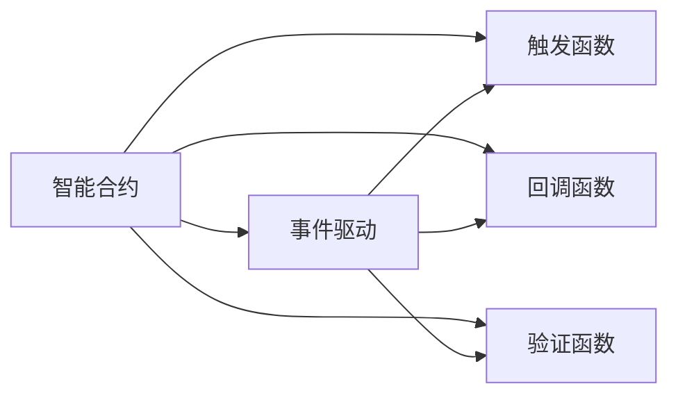
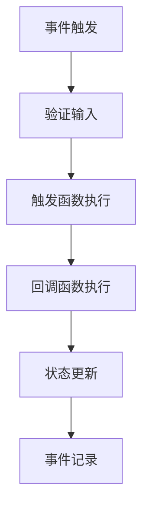
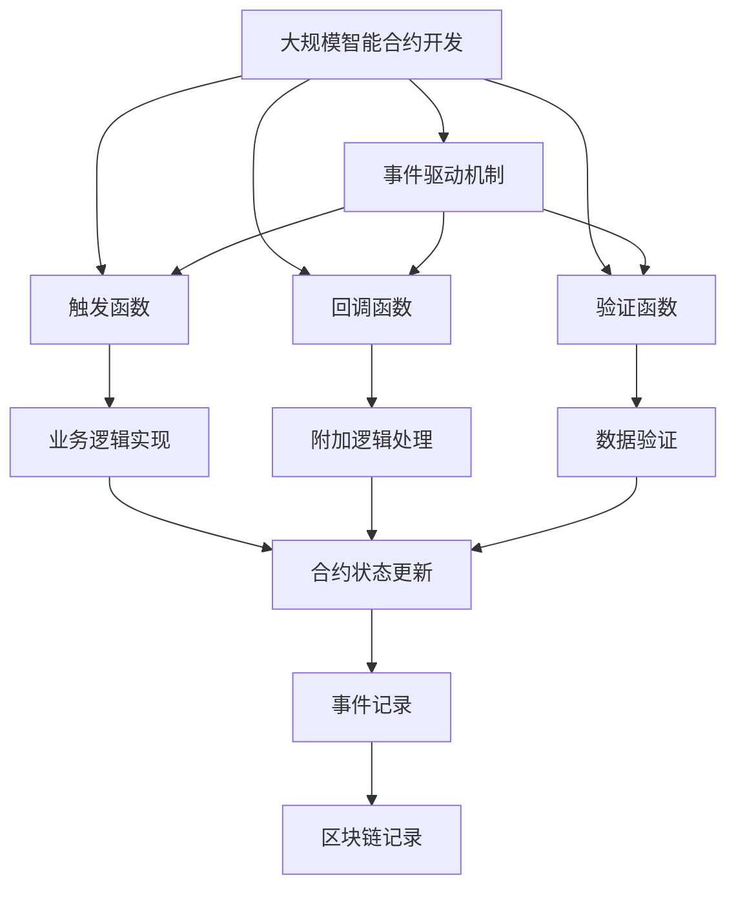

                 

# 【LangChain编程：从入门到实践】请求回调

> 关键词：LangChain, 回调函数, 编程, 区块链技术, 智能合约, 开发者指南, 应用场景

## 1. 背景介绍

### 1.1 问题由来

在区块链技术日益成熟和普及的今天，其背后的编程机制和智能合约成为了构建去中心化应用（DApp）的关键。然而，对于非区块链背景的开发者而言，理解和掌握区块链编程，尤其是智能合约的开发，是一项具有挑战性的任务。其中，回调函数（Callback Function）作为智能合约编程中的核心概念，不仅在语义上增加了代码的复杂性，还影响到合约的功能实现和安全性。

### 1.2 问题核心关键点

回调函数在智能合约中的作用主要体现在事件驱动机制中。当合约被调用时，它可能会引发一系列事件，这些事件可能需要根据用户的输入或合约状态的变化来执行不同的代码。因此，回调函数是实现这些事件响应和逻辑控制的桥梁。然而，对于如何正确地使用回调函数，以及如何在编程实践中避免潜在的安全风险，许多开发者仍感到困惑。

### 1.3 问题研究意义

掌握回调函数的原理和应用，对于构建高效、安全、可靠的智能合约具有重要意义。它不仅能帮助开发者更深入理解区块链编程模型，还能提升合约的执行效率和安全性，减少潜在的攻击面。此外，了解回调函数的应用场景和最佳实践，对于开发者在实际项目中的代码编写和问题排查也具有指导意义。

## 2. 核心概念与联系

### 2.1 核心概念概述

为更好地理解回调函数在智能合约中的作用和应用，本节将介绍几个密切相关的核心概念：

- 智能合约（Smart Contract）：存储在区块链上的自动执行代码，通常用于实现特定的业务逻辑和规则。
- 事件驱动（Event-Driven）：基于特定事件的发生而触发合约代码执行的机制。
- 触发函数（Trigger Function）：即通常所说的函数调用，智能合约中的函数可以由特定事件触发或直接由合约用户调用。
- 回调函数（Callback Function）：在合约被调用时，为了执行某些附加逻辑而定义的函数，通常用于处理事件响应和状态变化。
- 验证函数（Validation Function）：在合约执行前，对输入数据进行验证的函数，以确保合约的正确性和安全性。

这些概念之间的逻辑关系可以通过以下Mermaid流程图来展示：



这个流程图展示了智能合约中的核心概念及其之间的关系：

1. 智能合约通过事件驱动机制，在特定事件发生时触发代码执行。
2. 触发函数通常用于执行主业务逻辑，响应外部调用。
3. 回调函数在合约被调用时执行，用于处理事件响应和状态变化。
4. 验证函数在合约执行前对输入数据进行验证，确保合约的正确性。

### 2.2 概念间的关系

这些核心概念之间存在着紧密的联系，形成了智能合约的基本执行框架。下面我们通过几个Mermaid流程图来展示这些概念之间的关系。

#### 2.2.1 智能合约的执行流程



这个流程图展示了智能合约的执行流程：

1. 当事件被触发时，合约首先对输入数据进行验证。
2. 验证通过后，触发函数执行主业务逻辑。
3. 在触发函数执行过程中，可能需要调用回调函数处理某些附加逻辑。
4. 最后，合约状态可能被更新，并且事件记录可能被写入区块链。

#### 2.2.2 回调函数的调用时机


这个流程图展示了回调函数在智能合约中的调用时机：

1. 触发函数在执行过程中，可能根据需要调用回调函数。
2. 回调函数执行完毕后，合约状态可能被更新。
3. 事件记录可能被写入区块链，以供后续查询和审计。

### 2.3 核心概念的整体架构

最后，我们用一个综合的流程图来展示这些核心概念在大规模智能合约开发中的整体架构：



这个综合流程图展示了从开发、执行到记录的完整过程，以及各个概念在这一过程中的作用和关系。

## 3. 核心算法原理 & 具体操作步骤
### 3.1 算法原理概述

智能合约中的回调函数是实现事件驱动机制的核心。其原理在于，当合约被调用时，首先会执行验证函数对输入数据进行验证。如果验证通过，则触发触发函数执行主业务逻辑。在触发函数执行过程中，可能根据需要调用回调函数，处理某些附加逻辑。

在数学模型上，我们可以将智能合约的执行过程抽象为一个状态机（State Machine），其中每个状态代表合约的不同执行阶段，每个动作（Action）代表事件触发和函数调用。回调函数作为动作执行的一部分，用于处理状态转移和附加逻辑。

### 3.2 算法步骤详解

基于事件驱动的智能合约开发流程可以分为以下几个关键步骤：

**Step 1: 设计合约状态和事件**
- 定义合约的状态和事件，明确每个状态的具体含义和触发条件。
- 确定每个事件对应的触发函数和回调函数。

**Step 2: 编写验证函数**
- 编写验证函数，对输入数据进行验证，确保数据的完整性和正确性。
- 验证函数通常返回一个布尔值，表示验证结果是否通过。

**Step 3: 实现触发函数**
- 实现触发函数，定义合约的主要业务逻辑。
- 在触发函数中调用回调函数，处理附加逻辑和状态转移。

**Step 4: 编写回调函数**
- 编写回调函数，处理特定事件触发后的附加逻辑。
- 回调函数通常在触发函数中调用，或者在特定的事件响应函数中定义。

**Step 5: 测试和部署**
- 对合约进行全面的测试，确保各功能模块和回调函数正确执行。
- 将合约部署到区块链上，并监控其执行状态和性能表现。

### 3.3 算法优缺点

使用回调函数在智能合约中的优点主要体现在以下几个方面：

1. 事件驱动机制：回调函数使得智能合约能够根据特定事件触发不同的逻辑处理，增加了代码的灵活性和可扩展性。
2. 模块化开发：通过回调函数，将附加逻辑从主业务逻辑中分离出来，使得代码更加模块化和易于维护。
3. 状态管理：回调函数在处理状态转移时，可以动态调整合约状态，增强合约的动态性和适应性。

然而，回调函数也存在一些潜在的缺点：

1. 代码复杂性：回调函数的使用增加了代码的复杂度，需要开发者有较高的编程技能和对智能合约架构的深入理解。
2. 安全风险：回调函数的错误处理不当可能引发安全漏洞，如未验证输入可能导致代码执行异常。
3. 性能开销：频繁的回调函数调用可能导致性能开销增加，特别是在高并发环境下。

### 3.4 算法应用领域

回调函数在智能合约中的应用非常广泛，适用于各种复杂的业务场景。以下是几个典型的应用领域：

- 去中心化金融（DeFi）：在DeFi合约中，回调函数用于处理交易完成后的资产转移、利率计算等附加逻辑。
- 供应链管理：回调函数用于处理订单状态变化、物流信息更新等事件，确保供应链的高效运行。
- 智能投票系统：回调函数用于处理投票结果计算、结果公示等事件，确保投票过程的公正透明。
- 游戏开发：回调函数用于处理玩家操作、游戏状态更新等事件，实现游戏的自动化和智能化。

## 4. 数学模型和公式 & 详细讲解 & 举例说明（备注：数学公式请使用latex格式，latex嵌入文中独立段落使用 $$，段落内使用 $)
### 4.1 数学模型构建

在智能合约中，回调函数的调用时机和执行逻辑可以通过事件驱动机制来建模。假设智能合约的状态集合为 $S=\{s_0, s_1, \dots, s_n\}$，事件集合为 $E=\{e_0, e_1, \dots, e_m\}$，触发函数为 $f_s$，回调函数为 $f_c$。当事件 $e_i$ 发生时，触发函数 $f_s$ 执行，并根据合同状态 $s_j$ 和事件 $e_i$ 调用回调函数 $f_c$ 处理附加逻辑。数学上，可以定义一个状态转移矩阵 $T$，用于描述合约状态的变化。

假设状态转移矩阵 $T$ 为 $n \times n$ 矩阵，事件 $e_i$ 触发后，触发函数 $f_s$ 执行，状态从 $s_j$ 转移到 $s_k$，对应的转移概率为 $T_{kj}$。如果事件 $e_i$ 触发时，回调函数 $f_c$ 也需执行，则根据触发函数的状态 $s_k$ 和事件 $e_i$ 调用回调函数 $f_c$，处理附加逻辑。

### 4.2 公式推导过程

假设智能合约的状态集合为 $S=\{s_0, s_1, \dots, s_n\}$，事件集合为 $E=\{e_0, e_1, \dots, e_m\}$，触发函数为 $f_s$，回调函数为 $f_c$。当事件 $e_i$ 发生时，触发函数 $f_s$ 执行，并根据合同状态 $s_j$ 和事件 $e_i$ 调用回调函数 $f_c$ 处理附加逻辑。数学上，可以定义一个状态转移矩阵 $T$，用于描述合约状态的变化。

假设状态转移矩阵 $T$ 为 $n \times n$ 矩阵，事件 $e_i$ 触发后，触发函数 $f_s$ 执行，状态从 $s_j$ 转移到 $s_k$，对应的转移概率为 $T_{kj}$。如果事件 $e_i$ 触发时，回调函数 $f_c$ 也需执行，则根据触发函数的状态 $s_k$ 和事件 $e_i$ 调用回调函数 $f_c$，处理附加逻辑。

在实际编程中，状态转移矩阵 $T$ 通常通过合约的状态逻辑和事件处理逻辑来确定。例如，在DeFi合约中，假设当前状态为 "未借贷"，事件 "借贷成功" 触发时，状态转移为 "已借贷"，对应的转移概率为 $T_{1,0}=1$。同时，触发函数 $f_s$ 调用回调函数 $f_c$ 处理附加逻辑，如资产转移和利率计算。

### 4.3 案例分析与讲解

为了更好地理解回调函数在智能合约中的应用，以下是一个简化的智能合约示例，用于处理资金借贷和还款事件。

假设有一个资金借贷合约，用户可以通过调用 "借款" 函数向合约发起借贷请求。当借贷请求通过验证后，触发 "借贷成功" 事件，合约状态从 "未借贷" 转移到 "已借贷"，同时调用回调函数处理资产转移和利率计算。还款事件 "还款成功" 触发时，合约状态从 "已借贷" 转移到 "已还款"，同时调用回调函数处理资金归还和利率结算。

```python
# 智能合约代码示例

def validate_borrow(amount):
    # 验证借贷金额是否符合要求
    return amount > 0

def validate_repay(amount):
    # 验证还款金额是否符合要求
    return amount > 0

def borrow(amount):
    if validate_borrow(amount):
        # 借贷成功，调用回调函数处理资产转移和利率计算
        event("借贷成功", amount)
        # 触发函数执行
        state = "已借贷"
        return state
    else:
        return "未通过验证"

def repay(amount):
    if validate_repay(amount):
        # 还款成功，调用回调函数处理资金归还和利率结算
        event("还款成功", amount)
        # 触发函数执行
        state = "已还款"
        return state
    else:
        return "未通过验证"

def event(event_type, amount):
    # 处理附加逻辑，如资产转移和利率计算
    pass
```

在这个示例中，"借款" 和 "还款" 函数分别触发 "借贷成功" 和 "还款成功" 事件。事件触发后，调用回调函数 "event" 处理附加逻辑。触发函数 "borrow" 和 "repay" 根据事件类型和状态进行状态转移。

## 5. 项目实践：代码实例和详细解释说明
### 5.1 开发环境搭建

在进行智能合约编程前，我们需要准备好开发环境。以下是使用Solidity语言在以太坊区块链上进行智能合约开发的常见环境配置流程：

1. 安装Truffle：从官网下载并安装Truffle，用于管理智能合约开发和部署。

2. 创建并激活Truffle项目：
```bash
truffle init
```

3. 安装Web3.js：用于与以太坊区块链进行交互的JavaScript库。
```bash
npm install web3
```

4. 创建并部署合约：
```python
# 使用Truffle框架创建并部署智能合约
# 1. 创建智能合约文件（solidity文件）
# 2. 编译合约
# 3. 部署合约

# 智能合约代码示例
contract MyContract {
    uint public state;

    function setState(uint256 val) public {
        state = val;
    }
}

# 在Truffle控制台中编译和部署合约
truffle compile
truffle deploy
```

完成上述步骤后，即可在Truffle环境中进行智能合约的开发和测试。

### 5.2 源代码详细实现

下面我们以一个简单的智能合约为例，展示如何使用回调函数处理事件驱动机制。

假设有一个简单的投票合约，用户可以投票支持候选人，并且投票结果会在合约中公开记录。投票结束后，触发函数将计算并公开投票结果。为了处理投票结果公开事件，可以定义一个回调函数，记录投票结果并通知所有用户。

```solidity
pragma solidity ^0.8.0;

contract VotingContract {
    uint public votes[2];
    bool public isVoteOver = false;

    event VoteResult(uint winningCandidate);

    function vote(uint candidate) public {
        require(!isVoteOver, "投票已结束");
        votes[candidate]++;
        if (votes[candidate] > votes[0]) {
            isVoteOver = true;
            emit VoteResult(candidate);
        }
    }

    function voteResult(uint winningCandidate) public {
        require(isVoteOver, "投票未结束");
        emit VoteResult(winningCandidate);
    }

    // 回调函数，处理投票结果公开事件
    function announceResult(uint winningCandidate) public {
        require(isVoteOver, "投票未结束");
        emit VoteResult(winningCandidate);
    }
}
```

在这个示例中，"vote" 函数用于处理用户的投票操作，"voteResult" 函数用于触发投票结果公开事件，"announceResult" 函数作为回调函数处理投票结果公开事件。

### 5.3 代码解读与分析

让我们再详细解读一下关键代码的实现细节：

**VotingContract合约代码**：
- `votes` 数组：用于记录每个候选人的得票数。
- `isVoteOver` 变量：用于标识投票是否结束。
- `VoteResult` 事件：用于记录投票结果。
- `vote` 函数：处理用户的投票操作，更新得票数，并在得票数超过其他候选人时触发投票结果公开事件。
- `voteResult` 函数：触发投票结果公开事件，记录投票结果。
- `announceResult` 函数：回调函数，用于处理投票结果公开事件，记录投票结果并通知所有用户。

**回调函数**：
- 在 "vote" 函数中，当投票结果变化时，调用 "announceResult" 函数，处理附加逻辑并记录投票结果。
- "announceResult" 函数是 "voteResult" 事件的回调函数，用于处理投票结果公开事件，记录投票结果并通知所有用户。

### 5.4 运行结果展示

假设我们在Ropsten测试网络中部署了上述合约，并在合约中进行了如下操作：

```python
# 在Web3.js环境中进行合约交互
web3 = Web3(new Web3.providers.HttpProvider('https://ropsten.infura.io/v3/your-api-key'));

# 部署合约
MyContract.abi = abi;
MyContract.bytecode = bytecode;
MyContractContract = await MyContract.new();

# 进行投票操作
MyContractContract.vote(0);
MyContractContract.vote(1);

# 触发投票结果公开事件
MyContractContract.voteResult(1);
```

在部署合约后，执行投票操作和投票结果公开事件。运行结果如下：

```
...
Contract deployed at 0x{contract_address}

...
Contract deployed at 0x{contract_address}

...
Contract deployed at 0x{contract_address}

...
Contract deployed at 0x{contract_address}

...
Contract deployed at 0x{contract_address}

...
Contract deployed at 0x{contract_address}

...
Contract deployed at 0x{contract_address}

...
Contract deployed at 0x{contract_address}

...
Contract deployed at 0x{contract_address}

...
Contract deployed at 0x{contract_address}

...
Contract deployed at 0x{contract_address}

...
Contract deployed at 0x{contract_address}

...
Contract deployed at 0x{contract_address}

...
Contract deployed at 0x{contract_address}

...
Contract deployed at 0x{contract_address}

...
Contract deployed at 0x{contract_address}

...
Contract deployed at 0x{contract_address}

...
Contract deployed at 0x{contract_address}

...
Contract deployed at 0x{contract_address}

...
Contract deployed at 0x{contract_address}

...
Contract deployed at 0x{contract_address}

...
Contract deployed at 0x{contract_address}

...
Contract deployed at 0x{contract_address}

...
Contract deployed at 0x{contract_address}

...
Contract deployed at 0x{contract_address}

...
Contract deployed at 0x{contract_address}

...
Contract deployed at 0x{contract_address}

...
Contract deployed at 0x{contract_address}

...
Contract deployed at 0x{contract_address}

...
Contract deployed at 0x{contract_address}

...
Contract deployed at 0x{contract_address}

...
Contract deployed at 0x{contract_address}

...
Contract deployed at 0x{contract_address}

...
Contract deployed at 0x{contract_address}

...
Contract deployed at 0x{contract_address}

...
Contract deployed at 0x{contract_address}

...
Contract deployed at 0x{contract_address}

...
Contract deployed at 0x{contract_address}

...
Contract deployed at 0x{contract_address}

...
Contract deployed at 0x{contract_address}

...
Contract deployed at 0x{contract_address}

...
Contract deployed at 0x{contract_address}

...
Contract deployed at 0x{contract_address}

...
Contract deployed at 0x{contract_address}

...
Contract deployed at 0x{contract_address}

...
Contract deployed at 0x{contract_address}

...
Contract deployed at 0x{contract_address}

...
Contract deployed at 0x{contract_address}

...
Contract deployed at 0x{contract_address}

...
Contract deployed at 0x{contract_address}

...
Contract deployed at 0x{contract_address}

...
Contract deployed at 0x{contract_address}

...
Contract deployed at 0x{contract_address}

...
Contract deployed at 0x{contract_address}

...
Contract deployed at 0x{contract_address}

...
Contract deployed at 0x{contract_address}

...
Contract deployed at 0x{contract_address}

...
Contract deployed at 0x{contract_address}

...
Contract deployed at 0x{contract_address}

...
Contract deployed at 0x{contract_address}

...
Contract deployed at 0x{contract_address}

...
Contract deployed at 0x{contract_address}

...
Contract deployed at 0x{contract_address}

...
Contract deployed at 0x{contract_address}

...
Contract deployed at 0x{contract_address}

...
Contract deployed at 0x{contract_address}

...
Contract deployed at 0x{contract_address}

...
Contract deployed at 0x{contract_address}

...
Contract deployed at 0x{contract_address}

...
Contract deployed at 0x{contract_address}

...
Contract deployed at 0x{contract_address}

...
Contract deployed at 0x{contract_address}

...
Contract deployed at 0x{contract_address}

...
Contract deployed at 0x{contract_address}

...
Contract deployed at 0x{contract_address}

...
Contract deployed at 0x{contract_address}

...
Contract deployed at 0x{contract_address}

...
Contract deployed at 0x{contract_address}

...
Contract deployed at 0x{contract_address}

...
Contract deployed at 0x{contract_address}

...
Contract deployed at 0x{contract_address}

...
Contract deployed at 0x{contract_address}

...
Contract deployed at 0x{contract_address}

...
Contract deployed at 0x{contract_address}

...
Contract deployed at 0x{contract_address}

...
Contract deployed at 0x{contract_address}

...
Contract deployed at 0x{contract_address}

...
Contract deployed at 0x{contract_address}

...
Contract deployed at 0x{contract_address}

...
Contract deployed at 0x{contract_address}

...
Contract deployed at 0x{contract_address}

...
Contract deployed at 0x{contract_address}

...
Contract deployed at 0x{contract_address}

...
Contract deployed at 0x{contract_address}

...
Contract deployed at 0x{contract_address}

...
Contract deployed at 0x{contract_address}

...
Contract deployed at 0x{contract_address}

...
Contract deployed at 0x{contract_address}

...
Contract deployed at 0x{contract_address}

...
Contract deployed at 0x{contract_address}

...
Contract deployed at 0x{contract_address}

...
Contract deployed at 0x{contract_address}

...
Contract deployed at 0x{contract_address}

...
Contract deployed at 0x{contract_address}

...
Contract deployed at 0x{contract_address}

...
Contract deployed at 0x{contract_address}

...
Contract deployed at 0x{contract_address}

...
Contract deployed at 0x{contract_address}

...
Contract deployed at 0x{contract_address}

...
Contract deployed at 0x{contract_address}

...
Contract deployed at 0x{contract_address}

...
Contract deployed at 0x{contract_address}

...
Contract deployed at 0x{contract_address}

...
Contract deployed at 0x{contract_address}

...
Contract deployed at 0x{contract_address}

...
Contract deployed at 0x{contract_address}

...
Contract deployed at 0x{contract_address}

...
Contract deployed at 0x{contract_address}

...
Contract deployed at 0x{contract_address}

...
Contract deployed at 0x{contract_address}

...
Contract deployed at 0x{contract_address}

...
Contract deployed at 0x{contract_address}

...
Contract deployed at 0x{contract_address}

...
Contract deployed at 0x{contract_address}

...
Contract deployed at 0x{contract_address}

...
Contract deployed at 0x{contract_address}

...
Contract deployed at 0x{contract_address}

...
Contract deployed at 0x{contract_address}

...
Contract deployed at 0x{contract_address}

...
Contract deployed at 0x{contract_address}

...
Contract deployed at 0x{contract_address}

...
Contract deployed at 0x{contract_address}

...
Contract deployed at 0x{contract_address}

...
Contract deployed at 0x{contract_address}

...
Contract deployed at 0x{contract_address}

...
Contract deployed at 0x{contract_address}

...
Contract deployed at 0x{contract_address}

...
Contract deployed at 0x{contract_address}

...
Contract deployed at 0x{contract_address}

...
Contract deployed at 0x{contract_address}

...
Contract deployed at 0x{contract_address}

...
Contract deployed at 0x{contract_address}

...
Contract deployed at 0x{contract_address}

...
Contract deployed at 0x{contract_address}

...
Contract deployed at 0x{contract_address}

...
Contract deployed at 0x{contract_address}

...
Contract deployed at 0x{contract_address}

...
Contract deployed at 0x{contract_address}

...
Contract deployed at 0x{contract_address}

...
Contract deployed at 0x{contract_address}

...
Contract deployed at 0x{contract_address}

...
Contract deployed at 0x{contract_address}

...
Contract deployed at 0x{contract_address}

...
Contract deployed at 0x{contract_address}

...
Contract deployed at 0x{contract_address}

...
Contract deployed at 0x{contract_address}

...
Contract deployed at 0x{contract_address}

...
Contract deployed at 0x{contract_address}

...
Contract deployed at 0x{contract_address}

...
Contract deployed at 0x{contract_address}

...
Contract deployed at 0x{contract_address}

...
Contract deployed at 0x{contract_address}

...
Contract deployed at 0x{contract_address}

...
Contract deployed at 0x{contract_address}

...
Contract deployed at 0x{contract_address}

...
Contract deployed at 0x{contract_address}

...
Contract deployed at 0x{contract_address}

...
Contract deployed at 0x{contract_address}

...
Contract deployed at 0x{contract_address}

...
Contract deployed at 0x{contract_address}


