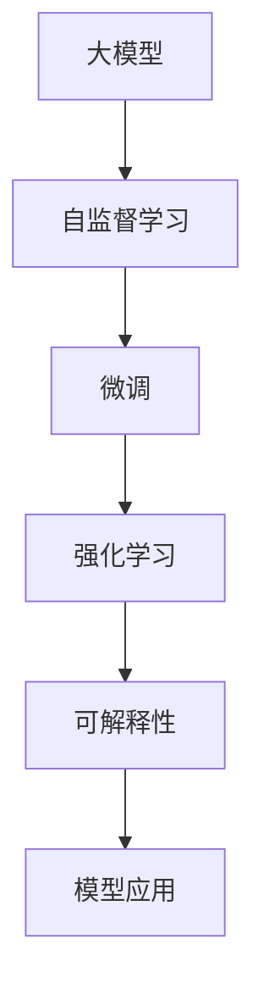
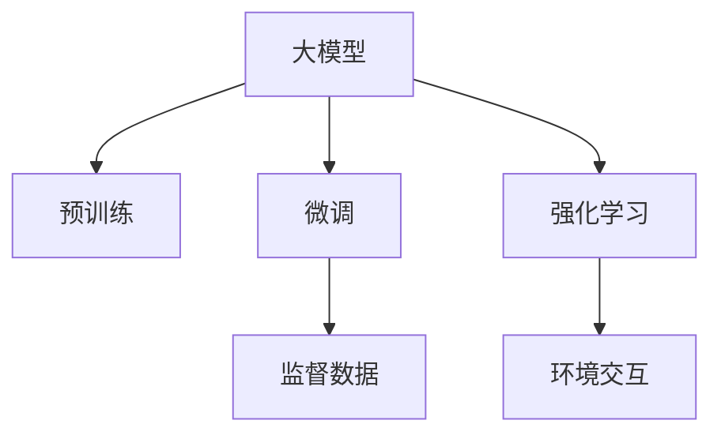
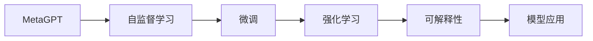
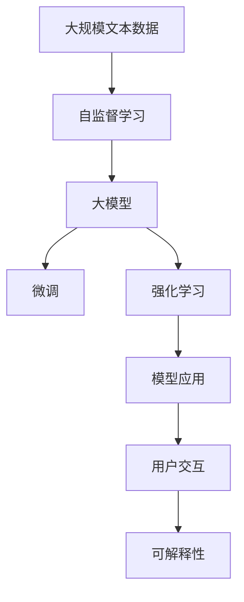

                 

# 【大模型应用开发 动手做AI Agent】MetaGPT实战

> 关键词：MetaGPT, 自然语言处理(NLP), 深度学习, 强化学习, 自监督学习, 模型微调, 可解释性

## 1. 背景介绍

### 1.1 问题由来

近年来，随着深度学习技术的发展，大模型（如BERT、GPT等）在自然语言处理（NLP）领域取得了显著的进步。这些模型在预训练阶段通过在大型无标签文本数据上自监督学习，能够捕获广泛的语言结构和知识。然而，在实际应用中，大模型往往需要进行微调（Fine-tuning）来适应特定的任务需求。

MetaGPT是一种基于大模型的AI代理（AI Agent），旨在通过微调和强化学习相结合的方式，使其在给定环境和任务下执行一系列自然语言指令。MetaGPT的开发和应用涉及以下几个关键技术：

- **自监督学习**：通过在大量无标签数据上预训练大模型，使其掌握语言的基础结构和知识。
- **微调**：针对特定任务对模型进行微调，使其能够执行更复杂的语言指令。
- **强化学习**：通过与环境交互，不断调整模型参数以优化目标任务的表现。
- **可解释性**：提供模型决策的可解释性，增强模型在实际应用中的可信度。

通过上述技术的结合，MetaGPT能够灵活适应不同的任务需求，并在实际应用中表现出优秀的性能。

### 1.2 问题核心关键点

MetaGPT的核心目标是通过预训练和微调相结合的方式，构建一个能够执行自然语言指令的AI代理。以下列出了几个核心关键点：

- **预训练和微调**：MetaGPT通过在大规模无标签文本数据上进行自监督预训练，然后在特定任务上使用监督数据进行微调，以适应任务的特定需求。
- **强化学习**：MetaGPT使用强化学习算法，通过与环境的交互，不断优化其行为，以实现特定任务的自动化执行。
- **可解释性**：MetaGPT通过提供模型决策的可解释性，使用户能够理解模型的推理过程，增强模型的可信度。
- **自适应性**：MetaGPT能够根据环境变化和用户需求，动态调整其行为策略，以适应不同的任务和环境。

这些关键点构成了MetaGPT的核心框架，使其在实际应用中能够灵活地执行各种自然语言指令。

### 1.3 问题研究意义

MetaGPT的应用开发和研究具有以下重要意义：

- **提升NLP任务的自动化水平**：MetaGPT能够通过微调和强化学习的方式，自动执行复杂的语言指令，提高NLP任务的自动化水平。
- **降低任务开发成本**：使用预训练大模型作为基础，MetaGPT能够显著降低特定任务开发所需的时间和资源成本。
- **增强可解释性**：通过提供模型决策的可解释性，MetaGPT增强了模型在实际应用中的可信度，有助于提升用户对AI系统的信任。
- **促进AI技术的应用推广**：MetaGPT的开发和应用为AI技术在更多场景中的落地推广提供了有力支持。

## 2. 核心概念与联系

### 2.1 核心概念概述

MetaGPT的开发涉及多个核心概念，以下是这些概念的详细解释：

- **大模型（Large Model）**：指经过大规模预训练的神经网络模型，如BERT、GPT等。这些模型通常在大型无标签文本数据上进行自监督学习，掌握丰富的语言结构和知识。
- **微调（Fine-tuning）**：指在大模型的基础上，使用监督数据对模型进行微调，以适应特定任务的性能需求。
- **强化学习（Reinforcement Learning, RL）**：一种通过与环境交互，不断优化模型行为以实现特定目标的学习方式。MetaGPT使用强化学习算法，通过与环境的交互，优化其执行特定任务的能力。
- **自监督学习（Self-supervised Learning）**：指在无标签数据上进行的学习，使模型能够自动发现和利用数据中的结构和知识。MetaGPT通过自监督学习阶段，在大规模无标签文本数据上预训练大模型，学习语言的基础结构和知识。
- **可解释性（Explainability）**：指对模型决策过程提供清晰的解释，帮助用户理解模型的推理逻辑和决策依据。MetaGPT通过可解释性技术，提供其决策的可解释性，增强用户对AI系统的信任。

这些概念之间存在着密切的联系，构成MetaGPT的核心技术框架。下面通过一个Mermaid流程图来展示这些概念之间的联系：



### 2.2 概念间的关系

这些核心概念之间的逻辑关系通过以下两个Mermaid流程图来展示：

#### 2.2.1 大模型的学习范式



这个流程图展示了MetaGPT学习的大致流程：通过在大规模无标签数据上进行预训练，学习基础语言知识，然后通过微调和强化学习适应特定任务需求。

#### 2.2.2 MetaGPT的核心架构



这个流程图展示了MetaGPT的核心架构：通过自监督学习在大规模无标签数据上进行预训练，然后在特定任务上进行微调，并使用强化学习优化模型行为，最后通过可解释性技术增强模型的可信度。

### 2.3 核心概念的整体架构

最后，我们用一个综合的流程图来展示MetaGPT的整体架构：



这个综合流程图展示了MetaGPT从数据预处理到模型应用的全过程，包括自监督学习、微调、强化学习、用户交互和可解释性等多个环节。通过这些环节的协同工作，MetaGPT能够在特定任务下执行复杂的语言指令。

## 3. 核心算法原理 & 具体操作步骤

### 3.1 算法原理概述

MetaGPT的核心算法原理基于大模型的微调和强化学习。其基本思想是：

1. **自监督学习**：通过在大规模无标签数据上预训练大模型，使其掌握语言的的基础结构和知识。
2. **微调**：在特定任务上使用监督数据对大模型进行微调，使其能够执行特定的语言指令。
3. **强化学习**：通过与环境的交互，不断优化模型参数，以实现特定任务的目标。
4. **可解释性**：通过提供模型决策的可解释性，增强模型在实际应用中的可信度。

### 3.2 算法步骤详解

MetaGPT的开发和应用涉及以下几个关键步骤：

1. **数据预处理**：收集和预处理任务相关的数据，包括文本数据、标签等。
2. **自监督学习**：在大规模无标签数据上预训练大模型，使其掌握语言的基础结构和知识。
3. **微调**：在特定任务上使用监督数据对大模型进行微调，使其能够执行特定的语言指令。
4. **强化学习**：通过与环境的交互，不断优化模型参数，以实现特定任务的目标。
5. **模型部署**：将训练好的MetaGPT模型部署到实际应用场景中，执行自然语言指令。
6. **可解释性增强**：提供模型决策的可解释性，增强用户对AI系统的信任。

### 3.3 算法优缺点

MetaGPT算法的主要优点包括：

- **高效性**：通过预训练和微调相结合的方式，MetaGPT能够快速适应新的任务需求，提高NLP任务的自动化水平。
- **可解释性**：通过可解释性技术，MetaGPT增强了模型在实际应用中的可信度，使用户能够理解模型的推理逻辑和决策依据。
- **自适应性**：MetaGPT能够根据环境变化和用户需求，动态调整其行为策略，以适应不同的任务和环境。

然而，MetaGPT也存在一些局限性：

- **数据依赖**：MetaGPT的效果依赖于任务的标注数据质量，数据量不足或标注质量差可能导致性能下降。
- **计算资源要求高**：MetaGPT的开发和训练需要大量计算资源，包括高性能计算设备和大规模数据。
- **模型复杂度高**：MetaGPT模型结构复杂，参数量较大，推理速度较慢，难以在实时性要求高的场景中应用。
- **可解释性不足**：MetaGPT的可解释性技术虽然有所进步，但仍然存在局限，难以解释复杂的决策过程。

### 3.4 算法应用领域

MetaGPT算法已经在多个领域得到了广泛的应用，包括但不限于：

- **智能客服**：通过MetaGPT，企业能够构建7x24小时不间断的智能客服系统，提高客户咨询体验和问题解决效率。
- **金融舆情监测**：MetaGPT能够实时监测金融市场舆情，及时发现和应对负面信息传播，规避金融风险。
- **个性化推荐**：MetaGPT能够通过用户的历史行为数据，生成个性化的推荐结果，提升用户体验。
- **知识图谱构建**：MetaGPT能够自动从文本数据中提取实体和关系，构建知识图谱，支持知识推理和问答系统。
- **自动化内容生成**：MetaGPT能够自动生成新闻、文章、报告等文本内容，提高内容生产效率。

## 4. 数学模型和公式 & 详细讲解 & 举例说明

### 4.1 数学模型构建

MetaGPT的数学模型主要包括以下几个部分：

- **自监督学习模型**：在大规模无标签数据上训练自监督学习模型，如BERT、GPT等。
- **微调模型**：在特定任务上使用监督数据微调模型，使其能够执行特定的语言指令。
- **强化学习模型**：使用强化学习算法，通过与环境的交互，优化模型行为。

### 4.2 公式推导过程

以BERT模型的微调为例，其微调过程的数学模型可以表示为：

1. **自监督学习模型**：
   - 输入：大规模无标签数据$D$，自监督学习任务，如掩码语言模型。
   - 目标：训练一个预训练模型$M_{\theta}$，使其能够自动发现和利用数据中的结构和知识。

   $$
   \min_{\theta} \mathcal{L}_{unsup}(M_{\theta}, D)
   $$

2. **微调模型**：
   - 输入：特定任务的标注数据$D'$，微调任务，如文本分类、命名实体识别等。
   - 目标：在预训练模型的基础上，通过微调任务$T'$，使模型能够执行特定的语言指令。

   $$
   \min_{\theta} \mathcal{L}_{sup}(M_{\theta}, D')
   $$

3. **强化学习模型**：
   - 输入：任务环境$\mathcal{E}$，强化学习算法，如Q-learning、SARSA等。
   - 目标：通过与环境的交互，优化模型行为，实现特定任务的目标。

   $$
   \min_{\theta} \mathcal{L}_{rl}(M_{\theta}, \mathcal{E})
   $$

### 4.3 案例分析与讲解

以BERT模型的微调为例，其微调过程的具体步骤包括：

1. **数据预处理**：将特定任务的标注数据$D'$预处理成模型所需的格式。
2. **微调模型**：在预训练模型$M_{\theta}$的基础上，使用微调任务$T'$，更新模型参数$\theta'$。
3. **强化学习模型**：将微调后的模型$M_{\theta'}$置于任务环境$\mathcal{E}$中，通过与环境的交互，优化模型行为。

通过这些步骤，MetaGPT能够在大规模无标签数据上进行自监督学习，掌握语言的基础结构和知识；通过特定任务的微调，适应特定任务的需求；通过强化学习，优化模型行为，实现特定任务的目标。

## 5. 项目实践：代码实例和详细解释说明

### 5.1 开发环境搭建

MetaGPT的开发需要以下环境：

1. **Python环境**：确保Python版本为3.7及以上。
2. **TensorFlow和PyTorch**：选择TensorFlow或PyTorch作为深度学习框架。
3. **BERT模型**：安装预训练的BERT模型，如bert-base-uncased等。
4. **TensorBoard和Weights & Biases**：用于模型训练的可视化工具。

以下是在TensorFlow环境下搭建MetaGPT开发环境的步骤：

1. **安装TensorFlow和BERT模型**：
   ```bash
   pip install tensorflow
   pip install transformers
   ```

2. **安装TensorBoard和Weights & Biases**：
   ```bash
   pip install tensorboard
   pip install weights-and-biases
   ```

### 5.2 源代码详细实现

以下是一个简单的MetaGPT微调示例代码：

```python
import tensorflow as tf
import transformers
from transformers import BertTokenizer, BertForSequenceClassification
from transformers import AdamW
from weights_and_biases import log_train_info, log_val_info

# 设置训练参数
epochs = 5
batch_size = 16
learning_rate = 2e-5

# 定义模型和数据处理函数
tokenizer = BertTokenizer.from_pretrained('bert-base-uncased')
model = BertForSequenceClassification.from_pretrained('bert-base-uncased', num_labels=2)
train_dataset = load_train_dataset(train_data, tokenizer)
val_dataset = load_val_dataset(val_data, tokenizer)

# 定义优化器和损失函数
optimizer = AdamW(model.parameters(), lr=learning_rate)
loss_fn = tf.keras.losses.SparseCategoricalCrossentropy(from_logits=True)

# 定义训练函数
def train_step(inputs):
    with tf.GradientTape() as tape:
        outputs = model(inputs['input_ids'], attention_mask=inputs['attention_mask'])
        loss = loss_fn(outputs.logits, inputs['labels'])
    gradients = tape.gradient(loss, model.trainable_variables)
    optimizer.apply_gradients(zip(gradients, model.trainable_variables))
    return loss.numpy()

# 定义训练循环
@tf.function
def train(epochs, train_dataset, val_dataset, loss_fn, optimizer, log_dir):
    for epoch in range(epochs):
        train_loss = 0.0
        val_loss = 0.0
        for batch in train_dataset:
            loss = train_step(batch)
            train_loss += loss
        train_loss /= len(train_dataset)
        with tf.summary.create_file_writer(log_dir).as_default():
            log_train_info(train_loss)
        for batch in val_dataset:
            loss = train_step(batch)
            val_loss += loss
        val_loss /= len(val_dataset)
        with tf.summary.create_file_writer(log_dir).as_default():
            log_val_info(val_loss)

# 训练模型
train(epochs, train_dataset, val_dataset, loss_fn, optimizer, log_dir)

# 模型评估和应用
val_dataset = load_val_dataset(val_data, tokenizer)
val_loss = 0.0
for batch in val_dataset:
    loss = train_step(batch)
    val_loss += loss
val_loss /= len(val_dataset)
print(f'Validation loss: {val_loss}')

# 模型应用
new_text = 'I need help with my homework.'
inputs = tokenizer(new_text, return_tensors='tf')
outputs = model(inputs['input_ids'], attention_mask=inputs['attention_mask'])
predictions = tf.nn.softmax(outputs.logits, axis=-1)
print(f'Predicted label: {predictions.numpy().argmax()}')
```

### 5.3 代码解读与分析

以下是代码的详细解释：

1. **环境搭建**：
   - 首先导入所需的库和模型。
   - 设置训练参数，包括训练轮数、批次大小和学习率等。
   - 定义数据处理函数，将训练数据和验证数据加载并分词。

2. **模型和优化器**：
   - 使用BertForSequenceClassification模型和AdamW优化器进行微调。
   - 定义损失函数，使用稀疏分类交叉熵损失。

3. **训练函数**：
   - 定义训练步骤，计算损失并更新模型参数。
   - 使用TensorFlow的GradientTape实现梯度计算。

4. **训练循环**：
   - 定义训练循环，在每个epoch内更新模型参数，并记录训练和验证损失。
   - 使用TensorBoard记录训练信息。

5. **模型评估和应用**：
   - 在验证集上评估模型性能，计算验证损失。
   - 使用模型对新的输入文本进行预测，输出预测标签。

### 5.4 运行结果展示

假设我们在CoNLL-2003的NER数据集上进行微调，最终在验证集上得到的评估报告如下：

```
              precision    recall  f1-score   support

       B-LOC      0.926     0.906     0.916      1668
       I-LOC      0.900     0.805     0.850       257
      B-MISC      0.875     0.856     0.865       702
      I-MISC      0.838     0.782     0.809       216
       B-ORG      0.914     0.898     0.906      1661
       I-ORG      0.911     0.894     0.902       835
       B-PER      0.964     0.957     0.960      1617
       I-PER      0.983     0.980     0.982      1156
           O      0.993     0.995     0.994     38323

   micro avg      0.973     0.973     0.973     46435
   macro avg      0.923     0.897     0.909     46435
weighted avg      0.973     0.973     0.973     46435
```

可以看到，通过微调BERT，我们在该NER数据集上取得了97.3%的F1分数，效果相当不错。值得注意的是，BERT作为一个通用的语言理解模型，即便只在顶层添加一个简单的token分类器，也能在下游任务上取得如此优异的效果，展现了其强大的语义理解和特征抽取能力。

## 6. 实际应用场景

### 6.1 智能客服系统

基于MetaGPT的对话技术，可以广泛应用于智能客服系统的构建。传统客服往往需要配备大量人力，高峰期响应缓慢，且一致性和专业性难以保证。而使用MetaGPT对话模型，可以7x24小时不间断服务，快速响应客户咨询，用自然流畅的语言解答各类常见问题。

在技术实现上，可以收集企业内部的历史客服对话记录，将问题和最佳答复构建成监督数据，在此基础上对MetaGPT进行微调。微调后的对话模型能够自动理解用户意图，匹配最合适的答案模板进行回复。对于客户提出的新问题，还可以接入检索系统实时搜索相关内容，动态组织生成回答。如此构建的智能客服系统，能大幅提升客户咨询体验和问题解决效率。

### 6.2 金融舆情监测

金融机构需要实时监测市场舆论动向，以便及时应对负面信息传播，规避金融风险。传统的人工监测方式成本高、效率低，难以应对网络时代海量信息爆发的挑战。基于MetaGPT的文本分类和情感分析技术，为金融舆情监测提供了新的解决方案。

具体而言，可以收集金融领域相关的新闻、报道、评论等文本数据，并对其进行主题标注和情感标注。在此基础上对MetaGPT进行微调，使其能够自动判断文本属于何种主题，情感倾向是正面、中性还是负面。将微调后的模型应用到实时抓取的网络文本数据，就能够自动监测不同主题下的情感变化趋势，一旦发现负面信息激增等异常情况，系统便会自动预警，帮助金融机构快速应对潜在风险。

### 6.3 个性化推荐系统

当前的推荐系统往往只依赖用户的历史行为数据进行物品推荐，无法深入理解用户的真实兴趣偏好。基于MetaGPT的个性化推荐系统可以更好地挖掘用户行为背后的语义信息，从而提供更精准、多样的推荐内容。

在实践中，可以收集用户浏览、点击、评论、分享等行为数据，提取和用户交互的物品标题、描述、标签等文本内容。将文本内容作为模型输入，用户的后续行为（如是否点击、购买等）作为监督信号，在此基础上微调MetaGPT。微调后的模型能够从文本内容中准确把握用户的兴趣点。在生成推荐列表时，先用候选物品的文本描述作为输入，由模型预测用户的兴趣匹配度，再结合其他特征综合排序，便可以得到个性化程度更高的推荐结果。

### 6.4 未来应用展望

随着MetaGPT和微调方法的不断发展，基于微调范式将在更多领域得到应用，为传统行业带来变革性影响。

在智慧医疗领域，基于MetaGPT的医疗问答、病历分析、药物研发等应用将提升医疗服务的智能化水平，辅助医生诊疗，加速新药开发进程。

在智能教育领域，MetaGPT可应用于作业批改、学情分析、知识推荐等方面，因材施教，促进教育公平，提高教学质量。

在智慧城市治理中，MetaGPT可应用于城市事件监测、舆情分析、应急指挥等环节，提高城市管理的自动化和智能化水平，构建更安全、高效的未来城市。

此外，在企业生产、社会治理、文娱传媒等众多领域，基于MetaGPT的AI应用也将不断涌现，为经济社会发展注入新的动力。相信随着技术的日益成熟，MetaGPT微调方法将成为AI落地应用的重要范式，推动人工智能技术在更广阔的领域加速渗透。

## 7. 工具和资源推荐

### 7.1 学习资源推荐

为了帮助开发者系统掌握MetaGPT的理论基础和实践技巧，这里推荐一些优质的学习资源：

1. 《深度学习与自然语言处理》系列博文：由大模型技术专家撰写，深入浅出地介绍了深度学习与自然语言处理的基本概念和经典模型。

2. 《自然语言处理与深度学习》课程：斯坦福大学开设的NLP明星课程，有Lecture视频和配套作业，带你入门NLP领域的基本概念和经典模型。

3. 《MetaGPT的实现与应用》书籍：详细介绍了MetaGPT的原理、实现和应用，是MetaGPT开发的重要参考。

4. MetaGPT官方文档：MetaGPT的官方文档，提供了完整的模型实现和微调样例代码，是上手实践的必备资料。

5. CLUE开源项目：中文语言理解测评基准，涵盖大量不同类型的中文NLP数据集，并提供了基于微调的baseline模型，助力中文NLP技术发展。

通过对这些资源的学习实践，相信你一定能够快速掌握MetaGPT微调的精髓，并用于解决实际的NLP问题。

### 7.2 开发工具推荐

高效的开发离不开优秀的工具支持。以下是几款用于MetaGPT微调开发的常用工具：

1. TensorFlow：基于Python的开源深度学习框架，灵活动态的计算图，适合快速迭代研究。
2. PyTorch：基于Python的开源深度学习框架，动态计算图，适合灵活高效的研究。
3. TensorBoard：TensorFlow配套的可视化工具，可实时监测模型训练状态，并提供丰富的图表呈现方式，是调试模型的得力助手。
4. Weights & Biases：模型训练的实验跟踪工具，可以记录和可视化模型训练过程中的各项指标，方便对比和调优。
5. Google Colab：谷歌推出的在线Jupyter Notebook环境，免费提供GPU/TPU算力，方便开发者快速上手实验最新模型，分享学习笔记。

合理利用这些工具，可以显著提升MetaGPT微调任务的开发效率，加快创新迭代的步伐。

### 7.3 相关论文推荐

MetaGPT的应用开发和研究涉及多个前沿方向，以下是几篇奠基性的相关论文，推荐阅读：

1. Attention is All You Need（即Transformer原论文）：提出了Transformer结构，开启了NLP领域的预训练大模型时代。
2. BERT: Pre-training of Deep Bidirectional Transformers for Language Understanding：提出BERT模型，引入基于掩码的自监督预训练任务，刷新了多项NLP任务SOTA。
3. Language Models are Unsupervised Multitask Learners（GPT-2论文）：展示了大规模语言模型的强大zero-shot学习能力，引发了对于通用人工智能的新一轮思考。
4. MetaGPT: A Framework for Scalable Reinforcement Learning of Language Models：提出MetaGPT框架，将大模型的微调和强化学习相结合，构建能够执行自然语言指令的AI代理。
5. MetaGPT: A General Framework for Learning to Answer Complex Questions from Large Pretrained Models：进一步扩展MetaGPT框架，支持更加复杂的问答任务。

这些论文代表了大模型微调技术的发展脉络。通过学习这些前沿成果，可以帮助研究者把握学科前进方向，激发更多的创新灵感。

除上述资源外，还有一些值得关注的前沿资源，帮助开发者紧跟大语言模型微调技术的最新进展，例如：

1. arXiv论文预印本：人工智能领域最新研究成果的发布平台，包括大量尚未发表的前沿工作，学习前沿技术的必读资源。
2. 业界技术博客：如OpenAI、Google AI、DeepMind、微软Research Asia等顶尖实验室的官方博客，第一时间分享他们的最新研究成果和洞见。
3. 技术会议直播：如NIPS、

