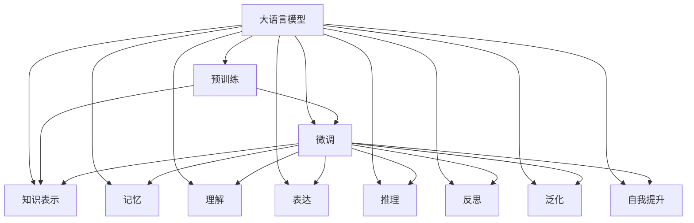
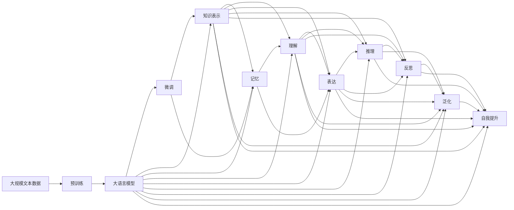
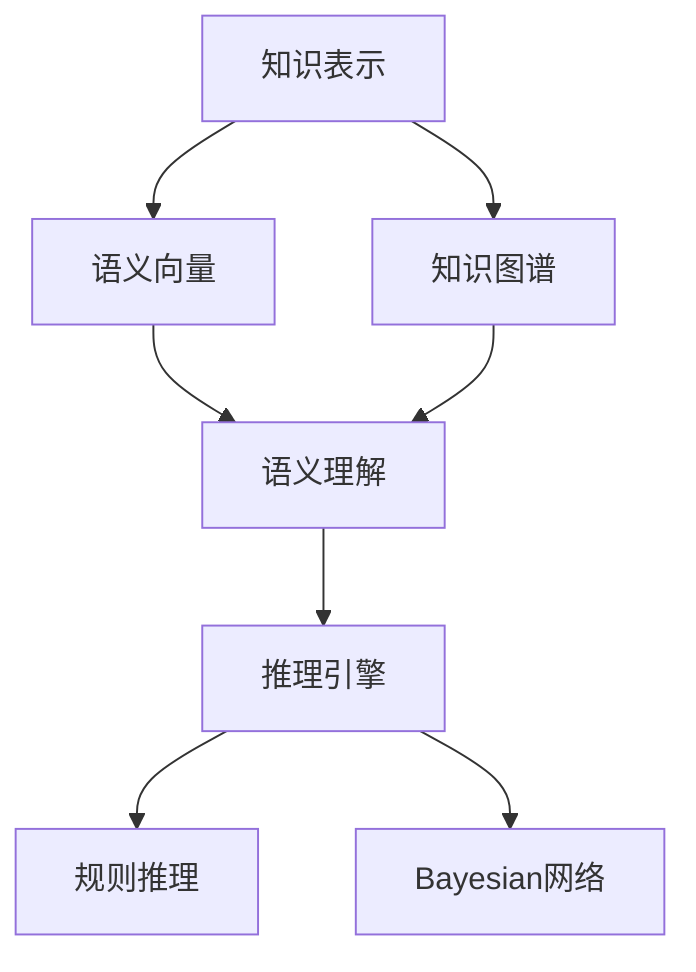
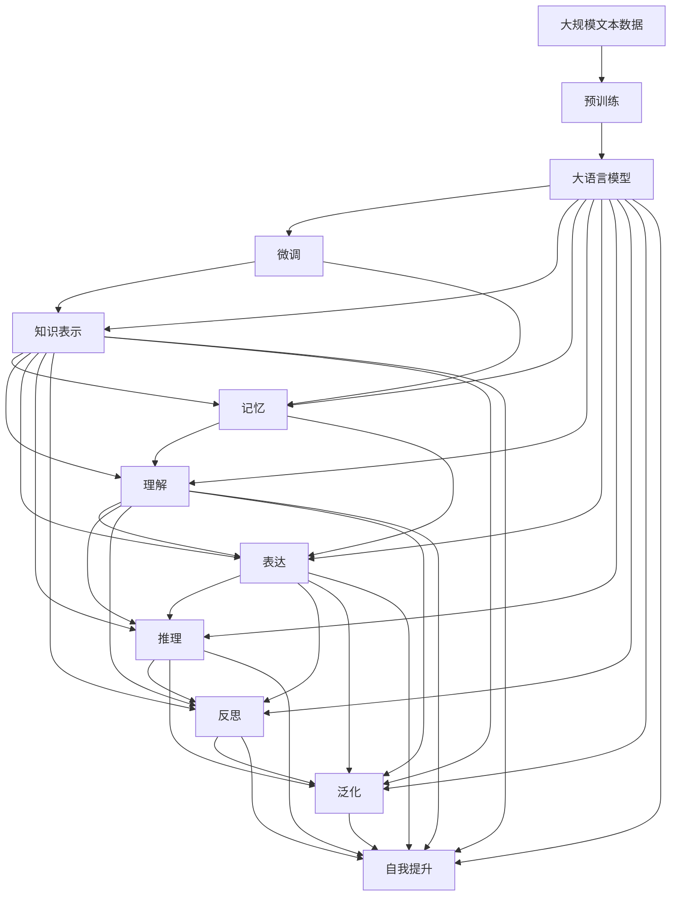

                 

# 【大模型应用开发 动手做AI Agent】知识、记忆、理解、表达、推理、反思、泛化和自我提升

> 关键词：
> 大语言模型, AI Agent, 知识表示, 记忆, 理解, 表达, 推理, 反思, 泛化, 自我提升

## 1. 背景介绍

### 1.1 问题由来
近年来，人工智能(AI)技术迅速发展，尤其是大语言模型和大规模深度学习模型的兴起，为AI Agent的开发和部署提供了新的契机。AI Agent作为智能体，具备自主学习、推理和决策能力，能够与人类进行交互并执行任务，广泛应用于智能推荐、自然语言处理、智能客服、医疗诊断等多个领域。

然而，大模型在大规模无标签数据上进行预训练，所学知识往往过于泛化，难以应用于特定任务。同时，预训练模型在记忆、理解、表达、推理等方面还存在不足，需要进行微调以提高在特定领域内的性能。因此，AI Agent的开发不仅需要大模型的预训练和微调，还需要深入理解其知识表示、记忆、理解、表达、推理、反思、泛化等能力，以及如何通过自我提升不断优化自身性能。

### 1.2 问题核心关键点
AI Agent的开发涉及多个核心问题，包括：
- **知识表示**：如何将大模型的预训练知识转化为特定任务的语义表示。
- **记忆**：如何让AI Agent记住过往的经验，提高其在处理新任务时的表现。
- **理解**：如何使AI Agent理解自然语言输入，并从中提取有价值的信息。
- **表达**：如何让AI Agent能够自然地生成和回应语言，满足用户需求。
- **推理**：如何使AI Agent具备逻辑推理能力，处理复杂任务。
- **反思**：如何使AI Agent具备反思能力，根据反馈调整自身行为。
- **泛化**：如何使AI Agent具备泛化能力，处理不同领域的任务。
- **自我提升**：如何让AI Agent通过反馈不断学习和优化，提高自身性能。

这些核心问题相互交织，共同构成了AI Agent开发的复杂系统，也是本文重点探讨的内容。

### 1.3 问题研究意义
研究AI Agent的开发和大模型的微调，对于拓展AI技术的实际应用，提高其性能和智能化水平，加速AI技术的产业化进程，具有重要意义：

1. **降低应用开发成本**：通过大模型进行微调，可以快速开发出满足特定需求的AI Agent，减少从头开发所需的数据、计算和人力等成本投入。
2. **提升模型效果**：微调使得AI Agent更好地适应特定任务，在应用场景中取得更优表现。
3. **加速开发进度**：standing on the shoulders of giants，微调使得开发者可以更快地完成任务适配，缩短开发周期。
4. **带来技术创新**：微调范式促进了对大模型和大规模深度学习模型的深入研究，催生了自适应学习、自监督学习等新的研究方向。
5. **赋能产业升级**：AI Agent的应用能够提升各行各业的技术水平和服务质量，为传统行业数字化转型升级提供新的技术路径。

## 2. 核心概念与联系

### 2.1 核心概念概述

为更好地理解AI Agent的开发和微调方法，本节将介绍几个密切相关的核心概念：

- **大语言模型(Large Language Model, LLM)**：以自回归(如GPT)或自编码(如BERT)模型为代表的大规模预训练语言模型。通过在大规模无标签文本语料上进行预训练，学习通用的语言知识，具备强大的语言理解和生成能力。

- **AI Agent**：具备自主学习、推理和决策能力的智能体，能够与人类进行交互并执行任务。通过微调和大模型支持，AI Agent能够处理自然语言输入，执行复杂的决策和任务。

- **知识表示**：将大模型的预训练知识转化为特定任务的语义表示，以支持AI Agent理解和处理任务。常见的知识表示方法包括语义向量、知识图谱等。

- **记忆**：指AI Agent存储和回忆过往经验的能力，对于提高AI Agent在处理新任务时的表现至关重要。

- **理解**：指AI Agent理解和解析自然语言输入的能力，通过语言模型和语义分析实现。

- **表达**：指AI Agent自然地生成和回应语言的能力，通过语言生成模型和语义编码器实现。

- **推理**：指AI Agent进行逻辑推理和决策的能力，通过规则推理、贝叶斯网络等技术实现。

- **反思**：指AI Agent根据反馈调整自身行为的能力，通过强化学习、元学习等方法实现。

- **泛化**：指AI Agent在不同领域和任务上表现一致的能力，通过跨领域微调、元学习等技术实现。

- **自我提升**：指AI Agent通过反馈不断学习和优化自身性能的能力，通过在线学习、自适应学习等方法实现。

这些核心概念之间的逻辑关系可以通过以下Mermaid流程图来展示：



这个流程图展示了大语言模型在预训练和微调过程中的多个关键能力：

1. 预训练：通过大规模无标签数据学习通用的语言知识。
2. 微调：通过特定任务的数据进行有监督学习，优化模型在特定任务上的性能。
3. 知识表示：将预训练知识转化为特定任务的语义表示。
4. 记忆：存储和回忆过往经验，提高新任务的处理能力。
5. 理解：理解自然语言输入，提取关键信息。
6. 表达：自然地生成和回应语言，满足用户需求。
7. 推理：逻辑推理和决策，处理复杂任务。
8. 反思：根据反馈调整自身行为。
9. 泛化：在不同领域和任务上表现一致。
10. 自我提升：通过反馈不断学习和优化，提高自身性能。

这些核心概念共同构成了AI Agent的开发框架，使其能够在各种场景下发挥强大的智能交互和决策能力。通过理解这些核心概念，我们可以更好地把握AI Agent的工作原理和优化方向。

### 2.2 概念间的关系

这些核心概念之间存在着紧密的联系，形成了AI Agent的开发和微调生态系统。下面我们通过几个Mermaid流程图来展示这些概念之间的关系。

#### 2.2.1 AI Agent的开发流程



这个流程图展示了大语言模型在预训练、微调和开发过程中的各个环节：

1. 预训练：通过大规模无标签数据学习通用的语言知识。
2. 微调：通过特定任务的数据进行有监督学习，优化模型在特定任务上的性能。
3. 知识表示：将预训练知识转化为特定任务的语义表示。
4. 记忆：存储和回忆过往经验，提高新任务的处理能力。
5. 理解：理解自然语言输入，提取关键信息。
6. 表达：自然地生成和回应语言，满足用户需求。
7. 推理：逻辑推理和决策，处理复杂任务。
8. 反思：根据反馈调整自身行为。
9. 泛化：在不同领域和任务上表现一致。
10. 自我提升：通过反馈不断学习和优化，提高自身性能。

#### 2.2.2 知识表示与推理的关系



这个流程图展示了知识表示与推理的逻辑关系：

1. 知识表示：将大模型的预训练知识转化为语义向量或知识图谱等形式。
2. 语义理解：通过语义向量等形式的知识表示，帮助AI Agent理解自然语言输入。
3. 推理引擎：使用规则推理、贝叶斯网络等技术，实现AI Agent的逻辑推理和决策。

### 2.3 核心概念的整体架构

最后，我们用一个综合的流程图来展示这些核心概念在大语言模型微调过程中的整体架构：



这个综合流程图展示了从预训练到微调，再到知识表示和推理的完整过程。大语言模型首先在大规模文本数据上进行预训练，然后通过微调获得特定任务上的性能提升。知识表示和推理是微调后的重要能力，使得AI Agent能够理解和处理自然语言输入，进行逻辑推理和决策。记忆和自我提升则进一步增强了AI Agent的学习和优化能力，使其在不同场景下表现出色。

## 3. 核心算法原理 & 具体操作步骤
### 3.1 算法原理概述

基于大语言模型和知识表示的AI Agent开发，本质上是一个通过有监督学习优化模型性能的过程。其核心思想是：将预训练的大语言模型视作一个强大的"特征提取器"，通过在特定任务的标注数据上进行有监督学习，优化模型在特定任务上的知识表示和推理能力，使其具备更强的任务处理能力。

形式化地，假设预训练模型为 $M_{\theta}$，其中 $\theta$ 为预训练得到的模型参数。给定特定任务的标注数据集 $D=\{(x_i,y_i)\}_{i=1}^N$，其中 $x_i$ 为输入文本，$y_i$ 为任务标签。AI Agent的优化目标是最小化任务损失，即找到最优参数：

$$
\hat{\theta}=\mathop{\arg\min}_{\theta} \mathcal{L}(M_{\theta},D)
$$

其中 $\mathcal{L}$ 为针对任务 $T$ 设计的损失函数，用于衡量模型预测输出与真实标签之间的差异。常见的损失函数包括交叉熵损失、均方误差损失等。

通过梯度下降等优化算法，AI Agent不断更新模型参数 $\theta$，最小化损失函数 $\mathcal{L}$，使得模型输出逼近真实标签。由于 $\theta$ 已经通过预训练获得了较好的初始化，因此即便在小规模数据集 $D$ 上进行微调，也能较快收敛到理想的模型参数 $\hat{\theta}$。

### 3.2 算法步骤详解

基于大语言模型和知识表示的AI Agent开发一般包括以下几个关键步骤：

**Step 1: 准备预训练模型和数据集**
- 选择合适的预训练语言模型 $M_{\theta}$ 作为初始化参数，如 BERT、GPT等。
- 准备特定任务的标注数据集 $D$，划分为训练集、验证集和测试集。一般要求标注数据与预训练数据的分布不要差异过大。

**Step 2: 添加任务适配层**
- 根据任务类型，在预训练模型顶层设计合适的输出层和损失函数。
- 对于分类任务，通常在顶层添加线性分类器和交叉熵损失函数。
- 对于生成任务，通常使用语言模型的解码器输出概率分布，并以负对数似然为损失函数。

**Step 3: 设置微调超参数**
- 选择合适的优化算法及其参数，如 AdamW、SGD 等，设置学习率、批大小、迭代轮数等。
- 设置正则化技术及强度，包括权重衰减、Dropout、Early Stopping 等。
- 确定冻结预训练参数的策略，如仅微调顶层，或全部参数都参与微调。

**Step 4: 执行梯度训练**
- 将训练集数据分批次输入模型，前向传播计算损失函数。
- 反向传播计算参数梯度，根据设定的优化算法和学习率更新模型参数。
- 周期性在验证集上评估模型性能，根据性能指标决定是否触发 Early Stopping。
- 重复上述步骤直到满足预设的迭代轮数或 Early Stopping 条件。

**Step 5: 测试和部署**
- 在测试集上评估微调后模型 $M_{\hat{\theta}}$ 的性能，对比微调前后的精度提升。
- 使用微调后的模型对新样本进行推理预测，集成到实际的应用系统中。
- 持续收集新的数据，定期重新微调模型，以适应数据分布的变化。

以上是基于大语言模型和知识表示的AI Agent开发的一般流程。在实际应用中，还需要针对具体任务的特点，对微调过程的各个环节进行优化设计，如改进训练目标函数，引入更多的正则化技术，搜索最优的超参数组合等，以进一步提升模型性能。

### 3.3 算法优缺点

基于大语言模型和知识表示的AI Agent开发方法具有以下优点：

1. 简单高效。只需准备少量标注数据，即可对预训练模型进行快速适配，获得较大的性能提升。
2. 通用适用。适用于各种NLP下游任务，包括分类、匹配、生成等，设计简单的任务适配层即可实现。
3. 参数高效。利用参数高效微调技术，在固定大部分预训练参数的情况下，仍可取得不错的提升。
4. 效果显著。在学术界和工业界的诸多任务上，基于微调的方法已经刷新了最先进的性能指标。

同时，该方法也存在一定的局限性：

1. 依赖标注数据。微调的效果很大程度上取决于标注数据的质量和数量，获取高质量标注数据的成本较高。
2. 迁移能力有限。当目标任务与预训练数据的分布差异较大时，微调的性能提升有限。
3. 负面效果传递。预训练模型的固有偏见、有害信息等，可能通过微调传递到下游任务，造成负面影响。
4. 可解释性不足。微调模型的决策过程通常缺乏可解释性，难以对其推理逻辑进行分析和调试。

尽管存在这些局限性，但就目前而言，基于大语言模型的微调方法仍是大规模深度学习在NLP领域应用的最主流范式。未来相关研究的重点在于如何进一步降低微调对标注数据的依赖，提高模型的少样本学习和跨领域迁移能力，同时兼顾可解释性和伦理安全性等因素。

### 3.4 算法应用领域

基于大语言模型和知识表示的AI Agent开发方法，已经在NLP领域得到了广泛的应用，覆盖了几乎所有常见任务，例如：

- 文本分类：如情感分析、主题分类、意图识别等。通过微调使模型学习文本-标签映射。
- 命名实体识别：识别文本中的人名、地名、机构名等特定实体。通过微调使模型掌握实体边界和类型。
- 关系抽取：从文本中抽取实体之间的语义关系。通过微调使模型学习实体-关系三元组。
- 问答系统：对自然语言问题给出答案。将问题-答案对作为微调数据，训练模型学习匹配答案。
- 机器翻译：将源语言文本翻译成目标语言。通过微调使模型学习语言-语言映射。
- 文本摘要：将长文本压缩成简短摘要。将文章-摘要对作为微调数据，使模型学习抓取要点。
- 对话系统：使机器能够与人自然对话。将多轮对话历史作为上下文，微调模型进行回复生成。

除了上述这些经典任务外，AI Agent的开发方法也被创新性地应用到更多场景中，如可控文本生成、常识推理、代码生成、数据增强等，为NLP技术带来了全新的突破。随着预训练模型和微调方法的不断进步，相信NLP技术将在更广阔的应用领域大放异彩。

## 4. 数学模型和公式 & 详细讲解  
### 4.1 数学模型构建

本节将使用数学语言对基于大语言模型和知识表示的AI Agent开发过程进行更加严格的刻画。

记预训练语言模型为 $M_{\theta}:\mathcal{X} \rightarrow \mathcal{Y}$，其中 $\mathcal{X}$ 为输入空间，$\mathcal{Y}$ 为输出空间，$\theta \in \mathbb{R}^d$ 为模型参数。假设特定任务的训练集为 $D=\{(x_i,y_i)\}_{i=1}^N, x_i \in \mathcal{X}, y_i \in \mathcal{Y}$。

定义模型 $M_{\theta}$ 在数据样本 $(x,y)$ 上的损失函数为 $\ell(M_{\theta}(x),y)$，则在数据集 $D$ 上的经验风险为：

$$
\mathcal{L}(\theta) = \frac{1}{N} \sum_{i=1}^N \ell(M_{\theta}(x_i),y_i)
$$

微调的优化目标是最小化经验风险，即找到最优参数：

$$
\theta^* = \mathop{\arg\min}_{\theta} \mathcal{L}(\theta)
$$

在实践中，我们通常使用基于梯度的优化算法（如SGD、Adam等）来近似求解上述最优化问题。设 $\eta$ 为学习率，$\lambda$ 为正则化系数，则参数的更新公式为：

$$
\theta \leftarrow \theta - \eta \nabla_{\theta}\mathcal{L}(\theta) - \eta\lambda\theta
$$

其中 $\nabla_{\theta}\mathcal{L}(\theta)$ 为损失函数对参数 $\theta$ 的梯度，可通过反向传播算法高效计算。

### 4.2 公式推导过程

以下我们以二分类任务为例，推导交叉熵损失函数及其梯度的计算公式。

假设模型 $M_{\theta}$ 在输入 $x$ 上的输出为 $\hat{y}=M_{\theta}(x) \in [0,1]$，表示样本属于正类的概率。真实标签 $y \in \{0,1\}$。则二分类交叉熵损失函数定义为：

$$
\ell(M_{\theta}(x),y) = -[y\log \hat{y} + (1-y)\log (1-\hat{y})]
$$

将其代入经验风险公式，得：

$$
\mathcal{L}(\theta) = -\frac{1}{N}\sum_{i=1}^N [y_i\log M_{\theta}(x_i)+(1-y_i)\log(1-M_{\theta}(x_i))]
$$

根据链式法则，损失函数对参数 $\theta_k$ 的梯度为：

$$
\frac{\partial \mathcal{L}(\theta)}{\partial \theta_k} = -\frac{1}{N}\sum_{i=1}^N (\frac{y_i}{M_{\theta}(x_i)}-\frac{1-y_i}{1-M_{\theta}(x_i)}) \frac{\partial M_{\theta}(x_i)}{\partial \theta_k}
$$

其中 $\frac{\partial M_{\theta}(x_i)}{\partial \theta_k}$ 可进一步递归展开，利用自动微分技术完成计算。

在得到损失函数的梯度后，即可带入参数更新公式，完成模型的迭代优化。重复上述过程直至收敛，最终得到适应下游任务的最优模型参数 $\theta^*$。

## 5. 项目实践：代码实例和详细解释说明
### 5.1 开发环境搭建

在进行AI Agent开发前，我们需要准备好开发环境。以下是使用Python进行PyTorch开发的环境配置流程：

1. 安装Anaconda：从官网下载并安装Anaconda，用于创建独立的Python环境。

2. 创建并激活虚拟环境：
```bash
conda create -n pytorch-env python=3.8 
conda activate pytorch-env
```

3. 安装PyTorch：根据CUDA版本，从官网获取对应的安装命令。例如：
```bash
conda install pytorch torchvision torchaudio cudatoolkit=11.1 -c pytorch -c conda-forge
```

4. 安装Transformers库：
```bash
pip install transformers
```

5. 安装各类工具包：
```bash
pip install numpy pandas scikit-learn matplotlib tqdm jupyter notebook ipython
```

完成上述步骤后，即可在`pytorch-env`环境中开始AI Agent的开发。

### 5.2 源代码详细实现

下面我们以命名实体识别(NER)任务为例，给出使用Transformers库对BERT模型进行微调的PyTorch代码实现。

首先，定义NER任务的数据处理函数：

```python
from transformers import BertTokenizer
from torch.utils.data import Dataset
import torch

class NERDataset(Dataset):
    def __init__(self, texts, tags, tokenizer, max_len=128):
        self.texts = texts
        self.tags = tags
        self.tokenizer = tokenizer
        self.max_len = max_len
        
    def __len__(self):
        return len(self.texts)
    
    def __getitem__(self, item):
        text = self.texts[item]
        tags = self.tags[item]
        
        encoding = self.tokenizer(text, return_tensors='pt', max_length=self.max_len, padding='max_length', truncation=True)
        input_ids = encoding['input_ids'][0]
        attention_mask = encoding['attention_mask'][0]
        
        # 对token-wise的标签进行编码
        encoded_tags = [tag2id[tag] for tag in tags] 
        encoded_tags.extend([tag2id['O']] * (self.max_len - len(encoded_tags)))
        labels = torch.tensor(encoded_tags, dtype=torch.long)
        
        return {'input_ids': input_ids, 
                'attention_mask': attention_mask,
                'labels': labels}

# 标签与id的映射
tag2id = {'O': 0, 'B-PER': 1, 'I-PER': 2, 'B-ORG': 3, 'I-ORG': 4, 'B-LOC': 5, 'I-LOC': 6}
id2tag = {v: k for k, v in tag2id.items()}

# 创建dataset
tokenizer = BertTokenizer.from_pretrained('bert-base-cased')

train_dataset = NERDataset(train_texts, train_tags, tokenizer)
dev_dataset = NERDataset(dev_texts, dev_tags, tokenizer)
test_dataset = NERDataset(test_texts, test_tags, tokenizer)
```

然后，定义模型和优化器：

```python
from transformers import BertForTokenClassification, AdamW

model = BertForTokenClassification.from_pretrained('bert-base-cased', num_labels=len(tag2id))

optimizer = AdamW(model.parameters(), lr=2e-5)
```

接着，定义训练和评估函数：

```python
from torch.utils.data import DataLoader
from tqdm import tqdm
from sklearn.metrics import classification_report

device = torch.device('cuda') if torch.cuda.is_available() else torch.device('cpu')
model.to(device)

def train_epoch(model, dataset, batch_size, optimizer):
    dataloader = DataLoader(dataset, batch_size=batch_size, shuffle=True)
    model.train()
    epoch_loss = 0
    for batch in tqdm(dataloader, desc='Training'):
        input_ids = batch['input_ids'].to(device)
        attention_mask = batch['attention_mask'].to(device)
        labels = batch['labels'].to(device)
        model.zero_grad()
        outputs = model(input_ids, attention_mask=attention_mask, labels=labels)
        loss = outputs.loss
        epoch_loss += loss.item()
        loss.backward()
        optimizer.step()
    return epoch_loss / len(dataloader)

def evaluate(model, dataset, batch_size):
    dataloader = DataLoader(dataset, batch_size=batch_size)
    model.eval()
    preds, labels = [], []
    with torch.no_grad():
        for batch

