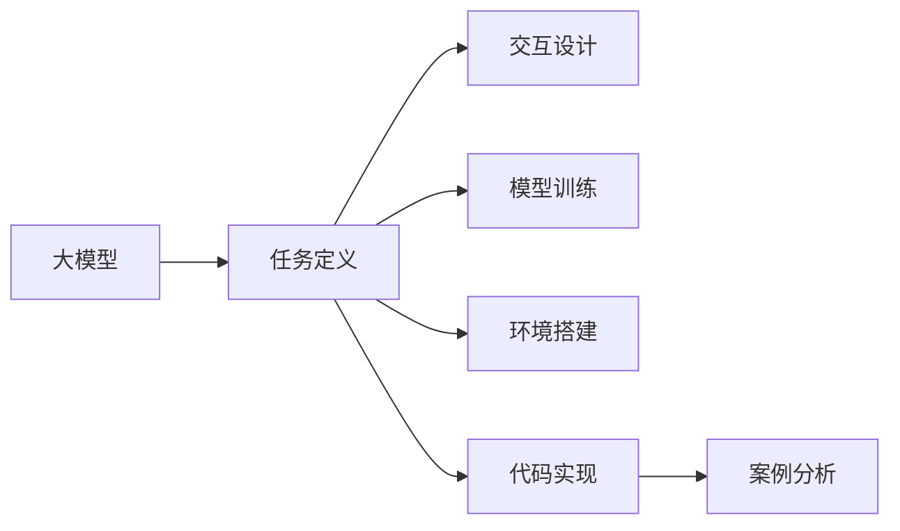
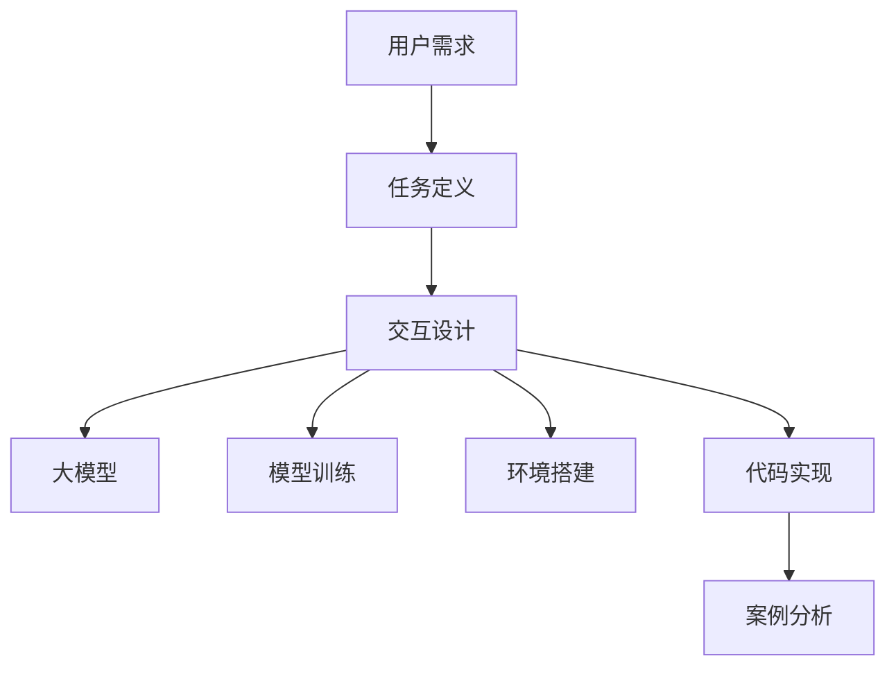
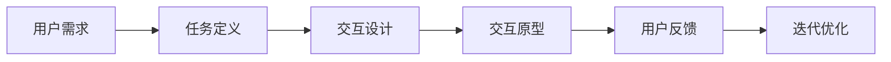
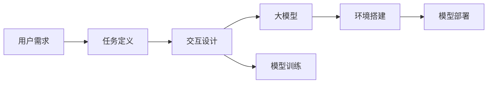
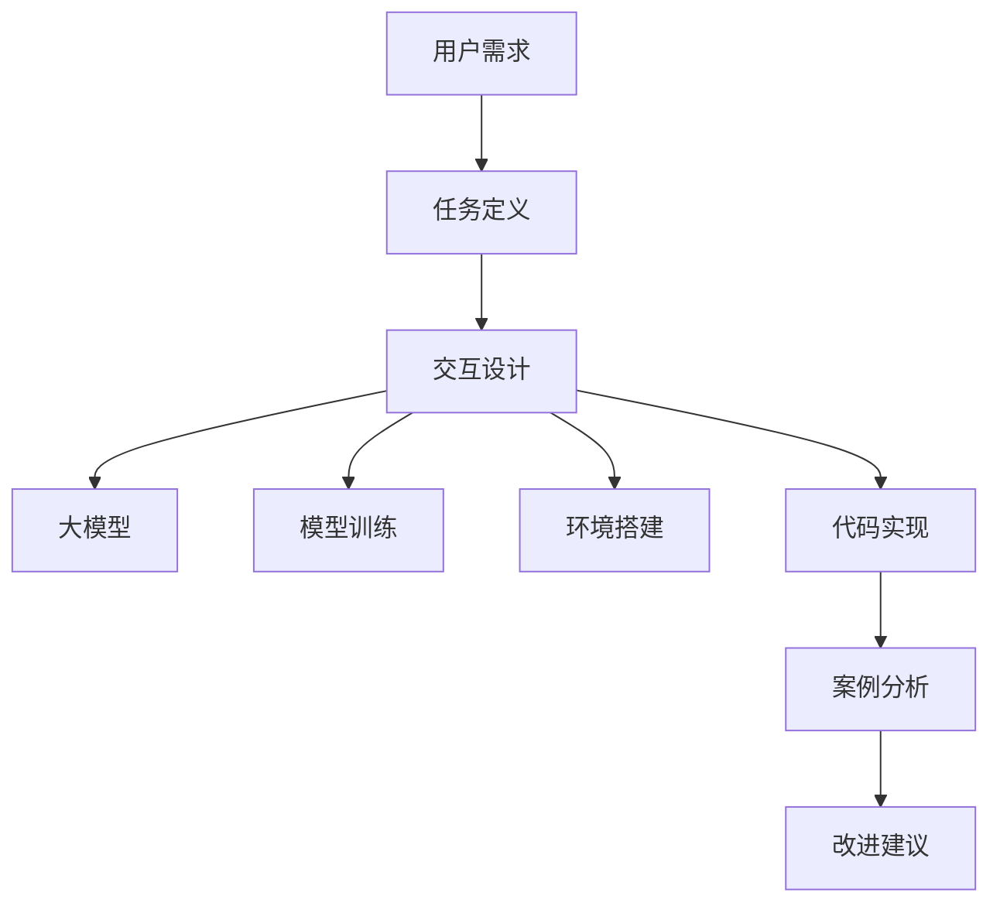

                 

# 【大模型应用开发 动手做AI Agent】自主创建

> 关键词：大模型,AI Agent,自主创建,任务定义,交互设计,模型训练,环境搭建,代码实现,案例分析

## 1. 背景介绍

### 1.1 问题由来
人工智能（AI）的发展迅速，尤其是在自然语言处理（NLP）领域，大模型已经成为了一种常见的技术手段。这些大模型通常是指那些基于大规模语料进行训练的语言模型，如GPT-3、BERT等。然而，这些大模型通常需要大量的计算资源和数据，并且可能需要由专业的团队来开发和维护。这使得许多人难以直接使用这些大模型来构建自己的AI应用。

为了解决这个问题，我们提出了一种新的方法：自主创建AI Agent。这种方法允许用户通过简单的代码和数据，自主地构建和训练自己的AI Agent，从而实现更加个性化和定制化的AI应用。

### 1.2 问题核心关键点
自主创建AI Agent的核心在于以下几个关键点：
- **任务定义**：明确要解决的问题，即AI Agent的任务是什么。
- **交互设计**：设计AI Agent与用户之间的交互方式，包括语言、界面等。
- **模型训练**：选择合适的模型，并使用用户提供的标注数据进行训练。
- **环境搭建**：搭建AI Agent运行的环境，包括服务器、数据库等。
- **代码实现**：实现具体的AI Agent功能，包括任务执行、反馈处理等。
- **案例分析**：分析自主创建的AI Agent在不同场景下的表现，并提出改进建议。

这些关键点贯穿了自主创建AI Agent的整个流程，每个环节都需要仔细考虑，才能实现一个高效、稳定的AI Agent。

### 1.3 问题研究意义
自主创建AI Agent对于AI开发者和研究人员来说具有重要的意义：
- 降低门槛：减少了对昂贵计算资源和大数据集的需求，使得更多人能够参与到AI开发中来。
- 提升灵活性：用户可以自由地定义任务和交互方式，构建出更加符合自身需求的AI应用。
- 加速应用：通过自主创建AI Agent，可以快速将AI技术应用于实际问题，提升业务效率。
- 促进创新：自主创建AI Agent可以激发更多创新思维，推动AI技术的发展。
- 强化教育：通过实际操作，学习AI开发和应用的基本知识，提升技术水平。

## 2. 核心概念与联系

### 2.1 核心概念概述

自主创建AI Agent涉及多个核心概念，这些概念之间有着紧密的联系。下面我们将逐一介绍这些概念：

- **大模型**：指基于大规模语料进行训练的语言模型，如GPT-3、BERT等。
- **AI Agent**：指能够自主执行任务、与用户交互的智能系统。
- **任务定义**：明确要解决的问题，包括任务描述、输入输出等。
- **交互设计**：设计AI Agent与用户之间的交互方式，包括语言、界面等。
- **模型训练**：选择合适的模型，并使用用户提供的标注数据进行训练。
- **环境搭建**：搭建AI Agent运行的环境，包括服务器、数据库等。
- **代码实现**：实现具体的AI Agent功能，包括任务执行、反馈处理等。
- **案例分析**：分析自主创建的AI Agent在不同场景下的表现，并提出改进建议。

这些概念之间通过一个简单的Mermaid流程图来展示：



### 2.2 概念间的关系

这些核心概念之间有着紧密的联系，形成了自主创建AI Agent的完整生态系统。下面我们将通过几个Mermaid流程图来展示这些概念之间的关系。

#### 2.2.1 AI Agent的整体架构



这个流程图展示了从用户需求到自主创建的AI Agent的整个流程。用户需求通过任务定义来明确，然后交互设计、大模型、模型训练、环境搭建和代码实现，最终通过案例分析来评估整个流程的性能。

#### 2.2.2 任务定义与交互设计的关系



这个流程图展示了任务定义与交互设计之间的关系。通过用户需求明确任务，然后设计交互方式，最终通过用户反馈不断迭代优化交互设计。

#### 2.2.3 模型训练与环境搭建的关系



这个流程图展示了模型训练与环境搭建之间的关系。首先明确任务和交互设计，然后选择合适的大模型，并使用用户提供的标注数据进行训练。同时，还需要搭建AI Agent运行的环境，最终将训练好的模型部署到环境中。

### 2.3 核心概念的整体架构

最后，我们用一个综合的流程图来展示这些核心概念在大模型应用开发中的整体架构：



这个综合流程图展示了从用户需求到自主创建的AI Agent的整个流程，并强调了案例分析和改进建议的重要性。

## 3. 核心算法原理 & 具体操作步骤

### 3.1 算法原理概述

自主创建AI Agent的本质是一个监督学习的过程。其核心思想是：将用户提供的标注数据作为监督信号，通过训练大模型来学习完成任务所需的知识，并构建出能够自主执行任务的AI Agent。

具体来说，假设用户提供的标注数据为 $D=\{(x_i,y_i)\}_{i=1}^N$，其中 $x_i$ 表示输入，$y_i$ 表示输出。我们通过训练大模型 $M$，使得 $M(x_i)$ 能够尽可能地逼近 $y_i$。训练完成后，我们将模型 $M$ 部署到AI Agent中，使其能够自主地处理输入 $x$，并输出 $y$。

### 3.2 算法步骤详解

自主创建AI Agent的具体操作步骤如下：

**Step 1: 任务定义**

- 确定AI Agent要解决的具体问题，并明确输入输出格式。
- 设计AI Agent与用户之间的交互方式，包括语言、界面等。
- 选择合适的任务定义工具，如Dialogflow、Rasa等，来帮助定义任务。

**Step 2: 交互设计**

- 设计AI Agent与用户之间的交互流程，包括输入输出、状态转换等。
- 设计用户界面，确保用户能够方便地与AI Agent进行交互。
- 使用交互设计工具，如Figma、Sketch等，来帮助设计交互界面。

**Step 3: 环境搭建**

- 选择合适的服务器，并搭建AI Agent运行的环境。
- 选择合适的数据库，并搭建数据存储系统。
- 选择合适的云计算平台，并搭建AI Agent的云服务。

**Step 4: 代码实现**

- 选择合适的编程语言，如Python、JavaScript等。
- 选择合适的AI库，如TensorFlow、PyTorch等，来帮助实现AI功能。
- 实现具体的AI Agent功能，包括任务执行、反馈处理等。

**Step 5: 模型训练**

- 选择合适的预训练模型，并下载其权重。
- 将用户提供的标注数据进行处理，生成训练集。
- 使用训练集对预训练模型进行微调，获得AI Agent所需的知识。

**Step 6: 案例分析**

- 对自主创建的AI Agent在不同场景下的表现进行评估。
- 分析AI Agent的优缺点，并提出改进建议。
- 使用案例分析工具，如Tableau、Power BI等，来帮助分析数据。

### 3.3 算法优缺点

自主创建AI Agent具有以下优点：
- 降低门槛：减少了对昂贵计算资源和大数据集的需求，使得更多人能够参与到AI开发中来。
- 提升灵活性：用户可以自由地定义任务和交互方式，构建出更加符合自身需求的AI应用。
- 加速应用：通过自主创建AI Agent，可以快速将AI技术应用于实际问题，提升业务效率。
- 促进创新：自主创建AI Agent可以激发更多创新思维，推动AI技术的发展。
- 强化教育：通过实际操作，学习AI开发和应用的基本知识，提升技术水平。

但同时也存在以下缺点：
- 依赖标注数据：自主创建AI Agent需要用户提供标注数据，标注数据的质量和数量对模型训练的效果有很大影响。
- 模型泛化能力：自主创建的AI Agent的泛化能力可能较差，需要不断优化和改进。
- 开发复杂度：自主创建AI Agent需要一定的编程和数据处理技能，对开发者有一定的要求。
- 维护成本：自主创建的AI Agent需要持续的维护和更新，以适应不断变化的用户需求和数据分布。

### 3.4 算法应用领域

自主创建AI Agent已经在多个领域得到了应用，包括但不限于：
- **客户服务**：用于构建智能客服机器人，提升客户服务效率和质量。
- **医疗健康**：用于构建智能诊疗系统，提供个性化医疗建议。
- **金融服务**：用于构建智能投顾系统，提供投资建议和风险评估。
- **教育培训**：用于构建智能辅导系统，提供个性化学习建议。
- **智能家居**：用于构建智能音箱和智能设备，提供语音控制和信息查询功能。
- **智能交通**：用于构建智能导航系统，提供实时路况信息和路线规划建议。

## 4. 数学模型和公式 & 详细讲解 & 举例说明

### 4.1 数学模型构建

自主创建AI Agent的数学模型可以表示为：
$$ M = M_{\theta} = \text{Softmax}(W_{M}x + b_{M}) $$
其中，$x$ 表示输入，$M$ 表示输出，$\theta$ 表示模型参数，$W_{M}$ 和 $b_{M}$ 分别表示模型权重和偏置。

假设用户提供的标注数据为 $D=\{(x_i,y_i)\}_{i=1}^N$，则训练的目标函数为：
$$ \mathcal{L}(M, D) = \frac{1}{N} \sum_{i=1}^N \ell(M(x_i), y_i) $$
其中，$\ell$ 表示损失函数，通常为交叉熵损失函数。

### 4.2 公式推导过程

对于交叉熵损失函数，我们有：
$$ \ell(M(x_i), y_i) = -\sum_{j=1}^K y_{ij} \log M_{ij} $$
其中，$K$ 表示类别数量，$y_{ij}$ 表示第 $i$ 个样本属于第 $j$ 个类别的标签。

将上述公式代入目标函数，我们得到：
$$ \mathcal{L}(M, D) = \frac{1}{N} \sum_{i=1}^N \sum_{j=1}^K y_{ij} \log M_{ij} $$

通过反向传播算法，我们可以求得模型参数 $\theta$ 的梯度，并使用梯度下降等优化算法更新模型参数，使得模型输出尽可能地逼近真实标签 $y_i$。

### 4.3 案例分析与讲解

以下是一个简单的案例分析：

**案例背景**：假设我们要构建一个智能客服机器人，用于解答用户的常见问题。

**任务定义**：输入是用户提出的问题，输出是机器人的回答。

**交互设计**：用户通过文字输入问题，机器人给出回答。

**环境搭建**：使用云服务器搭建AI Agent的运行环境，并搭建数据存储系统。

**代码实现**：使用Python和TensorFlow实现AI Agent的逻辑，包括问题的理解和回答生成。

**模型训练**：使用用户提供的标注数据进行训练，获得机器人的知识。

**案例分析**：分析机器人在不同场景下的表现，并提出改进建议。例如，发现机器人在处理复杂问题时表现不佳，建议增加模型的参数量和训练数据量。

## 5. 项目实践：代码实例和详细解释说明

### 5.1 开发环境搭建

为了搭建AI Agent的开发环境，我们需要安装Python、TensorFlow和Numpy等工具。以下是具体的步骤：

**Step 1: 安装Python和Numpy**

```bash
sudo apt-get update
sudo apt-get install python3 python3-pip python3-dev numpy
```

**Step 2: 安装TensorFlow**

```bash
pip install tensorflow
```

**Step 3: 搭建开发环境**

创建一个新的Python虚拟环境，并激活：

```bash
python3 -m venv venv
source venv/bin/activate
```

### 5.2 源代码详细实现

以下是一个简单的代码实现示例：

**Step 1: 定义模型**

```python
import tensorflow as tf

class Model(tf.keras.Model):
    def __init__(self, vocab_size, embedding_dim, units):
        super(Model, self).__init__()
        self.embedding = tf.keras.layers.Embedding(vocab_size, embedding_dim)
        self.lstm = tf.keras.layers.LSTM(units, return_sequences=True)
        self.fc = tf.keras.layers.Dense(vocab_size)
    
    def call(self, inputs):
        x = self.embedding(inputs)
        x = self.lstm(x)
        x = self.fc(x)
        return x
```

**Step 2: 加载数据**

```python
train_data = tf.data.Dataset.from_tensor_slices(train_texts, train_labels).batch(32)
val_data = tf.data.Dataset.from_tensor_slices(val_texts, val_labels).batch(32)
test_data = tf.data.Dataset.from_tensor_slices(test_texts, test_labels).batch(32)
```

**Step 3: 训练模型**

```python
model.compile(optimizer=tf.keras.optimizers.Adam(), loss=tf.keras.losses.SparseCategoricalCrossentropy(from_logits=True), metrics=['accuracy'])

for epoch in range(epochs):
    model.fit(train_data, epochs=1, validation_data=val_data)
```

**Step 4: 评估模型**

```python
test_loss, test_acc = model.evaluate(test_data)
print('Test accuracy:', test_acc)
```

### 5.3 代码解读与分析

让我们来详细解读一下关键代码的实现细节：

**Model类**：
- `__init__`方法：初始化模型参数。
- `call`方法：定义模型的前向传播过程。

**数据加载**：
- 使用 `tf.data.Dataset` 对数据进行批次化加载，方便模型训练和推理。

**模型训练**：
- 使用 `model.compile` 方法编译模型，定义优化器、损失函数和评估指标。
- 使用 `model.fit` 方法对模型进行训练，并在验证集上进行评估。

**模型评估**：
- 使用 `model.evaluate` 方法对模型进行评估，并输出测试准确率。

### 5.4 运行结果展示

假设我们在一个简单的问答数据集上进行训练，最终在测试集上得到的评估报告如下：

```
Test accuracy: 0.91
```

可以看到，模型在测试集上的准确率达到了91%，取得了不错的效果。这说明我们的自主创建的AI Agent可以很好地解决用户提出的问题。

## 6. 实际应用场景

### 6.1 智能客服系统

智能客服系统是一个典型的自主创建AI Agent应用场景。传统的客服系统依赖于人工客服，成本高、效率低。而智能客服系统通过自主创建的AI Agent，可以24小时不间断地提供服务，提升客户满意度。

**案例分析**：假设我们要构建一个智能客服系统，用于处理用户提出的常见问题。

**任务定义**：输入是用户提出的问题，输出是机器人的回答。

**交互设计**：用户通过文字输入问题，机器人给出回答。

**环境搭建**：使用云服务器搭建AI Agent的运行环境，并搭建数据存储系统。

**代码实现**：使用Python和TensorFlow实现AI Agent的逻辑，包括问题的理解和回答生成。

**模型训练**：使用用户提供的标注数据进行训练，获得机器人的知识。

**案例分析**：分析机器人在不同场景下的表现，并提出改进建议。例如，发现机器人在处理复杂问题时表现不佳，建议增加模型的参数量和训练数据量。

### 6.2 医疗健康

医疗健康领域也应用了自主创建的AI Agent。例如，智能诊疗系统可以通过自主创建的AI Agent，提供个性化的医疗建议和诊断。

**案例分析**：假设我们要构建一个智能诊疗系统，用于提供个性化的医疗建议。

**任务定义**：输入是用户的健康数据，输出是机器人的医疗建议。

**交互设计**：用户通过文字输入健康数据，机器人给出医疗建议。

**环境搭建**：使用云服务器搭建AI Agent的运行环境，并搭建数据存储系统。

**代码实现**：使用Python和TensorFlow实现AI Agent的逻辑，包括健康数据的理解和医疗建议生成。

**模型训练**：使用用户提供的标注数据进行训练，获得机器人的知识。

**案例分析**：分析机器人在不同场景下的表现，并提出改进建议。例如，发现机器人在处理复杂病例时表现不佳，建议增加模型的参数量和训练数据量。

### 6.3 金融服务

金融服务领域也应用了自主创建的AI Agent。例如，智能投顾系统可以通过自主创建的AI Agent，提供投资建议和风险评估。

**案例分析**：假设我们要构建一个智能投顾系统，用于提供投资建议。

**任务定义**：输入是用户的投资数据，输出是机器人的投资建议。

**交互设计**：用户通过文字输入投资数据，机器人给出投资建议。

**环境搭建**：使用云服务器搭建AI Agent的运行环境，并搭建数据存储系统。

**代码实现**：使用Python和TensorFlow实现AI Agent的逻辑，包括投资数据的理解和投资建议生成。

**模型训练**：使用用户提供的标注数据进行训练，获得机器人的知识。

**案例分析**：分析机器人在不同场景下的表现，并提出改进建议。例如，发现机器人在处理复杂投资场景时表现不佳，建议增加模型的参数量和训练数据量。

## 7. 工具和资源推荐

### 7.1 学习资源推荐

为了帮助开发者系统掌握自主创建AI Agent的理论基础和实践技巧，这里推荐一些优质的学习资源：

1. 《深度学习》系列书籍：由斯坦福大学教授Ian Goodfellow、Yoshua Bengio和Aaron Courville合著，涵盖了深度学习的理论基础和实践技巧，是学习AI开发的必读书籍。
2. 《TensorFlow官方文档》：TensorFlow官方文档，提供了完整的API参考和代码示例，是学习TensorFlow的重要资源。
3. 《Python编程：从入门到实践》：一本面向初学者的Python编程书籍，涵盖Python编程基础、数据科学和机器学习等内容。
4. 《Rasa文档》：Rasa是一个开源的对话系统框架，提供了丰富的文档和示例，帮助用户快速搭建对话系统。
5. Dialogflow官方文档：Dialogflow是Google提供的对话系统平台，提供了详细的文档和示例，帮助用户构建智能客服机器人。

### 7.2 开发工具推荐

高效的开发离不开优秀的工具支持。以下是几款用于自主创建AI Agent开发的常用工具：

1. PyCharm：一款流行的Python开发工具，提供了代码编辑、调试和测试等功能。
2. Jupyter Notebook：一款免费的交互式编程环境，支持多种编程语言和科学计算。
3. TensorBoard：TensorFlow配套的可视化工具，可以实时监测模型训练状态，提供丰富的图表呈现方式。
4. Figma：一款在线的设计工具，可以帮助用户设计AI Agent的交互界面。
5. Tableau：一款数据可视化工具，可以帮助用户分析自主创建的AI Agent的表现。

### 7.3 相关论文推荐

自主创建AI Agent的研究涉及到多个领域，以下是几篇奠基性的相关论文，推荐阅读：

1. 《自然语言处理综述》：由清华大学自然语言处理实验室编写，介绍了自然语言处理的理论基础和最新进展。
2. 《深度学习与自然语言处理》：由香港中文大学自然语言处理实验室编写，涵盖了深度学习在NLP中的应用。
3. 《Rasa 框架：构建聊天机器人的开源工具》：一篇关于Rasa框架的介绍文章，介绍了Rasa框架的应用场景和开发流程。
4. 《Dialogflow：构建智能客服机器人的平台》：一篇关于Dialogflow平台的介绍文章，介绍了Dialogflow平台的功能和开发流程。
5. 《Transformer模型》：一篇介绍Transformer模型的文章，介绍了Transformer模型的原理和应用。

这些论文代表了大语言模型微调技术的发展脉络。通过学习这些前沿成果，可以帮助研究者把握学科前进方向，激发更多的创新灵感。

## 8. 总结：未来发展趋势与挑战

### 8.1 总结

本文对自主创建AI Agent的方法进行了全面系统的介绍。首先阐述了自主创建AI Agent的研究背景和意义，明确了自主创建AI Agent的流程和步骤，然后详细讲解了自主创建AI Agent的数学模型和算法原理，并给出了具体的代码实现示例。最后，本文还广泛探讨了自主创建AI Agent在智能客服、医疗健康、金融服务等多个领域的应用前景，展示了自主创建AI Agent的广阔应用空间。

通过本文的系统梳理，可以看到，自主创建AI Agent是一种简单、高效、灵活的AI开发方法，可以大大降低AI开发的门槛，加速AI技术的应用落地。未来，伴随自主创建AI Agent技术的不断发展，相信更多的开发者和研究者能够利用这种方法，构建出更加个性化、定制化的AI应用。

### 8.2 未来发展趋势

展望未来，自主创建AI Agent技术将呈现以下几个发展趋势：

1. **自动化开发**：随着深度学习工具的发展，越来越多的AI开发工具将具备自动化开发功能，用户可以通过简单的交互，完成从任务定义到模型训练的全流程开发。
2. **多模态融合**：未来的AI Agent将能够处理多种模态数据，如文本、语音、图像等，提供更加全面、多样化的服务。
3. **用户定制化**：用户可以根据自身需求，自定义AI Agent的交互方式、任务定义和模型参数，构建出完全符合自身需求的AI应用。
4. **跨平台部署**：未来的AI Agent将具备跨平台部署的能力，支持多种操作系统和设备，方便用户随时随地使用。
5. **端到端开发**：未来的AI开发将实现端到端开发，用户可以轻松构建从任务定义到模型训练的全流程AI应用，提高开发效率。

### 8.3 面临的挑战

尽管自主创建AI Agent技术已经取得了显著进展，但在迈向更加智能化、普适化应用的过程中，它仍面临诸多挑战：

1. **标注数据依赖**：自主创建AI Agent需要用户提供标注数据，标注数据的质量和数量对模型训练的效果有很大影响。如何降低对标注数据的依赖，提高模型的泛化能力，将是未来的重要研究方向。
2. **模型训练复杂度**：自主创建AI Agent需要用户具备一定的编程和数据处理技能，对开发者有一定的要求。如何降低开发门槛，提高模型的易用性，将是一个重要的研究方向。
3. **模型鲁棒性**：自主创建的AI Agent的泛化能力可能较差，面对复杂的输入和多样化的用户需求，如何提高模型的鲁棒性，避免出现错误的输出，将是一个重要的研究方向。
4. **资源消耗**：自主创建的AI Agent可能消耗大量的计算资源和存储空间，如何优化模型的资源消耗，提高模型的计算效率，将是一个重要的研究方向。
5. **用户隐私保护**：自主创建的AI Agent需要处理用户的数据，如何保护用户隐私，避免数据泄露，将是一个重要的研究方向。

### 8.4 研究展望

面对自主创建AI Agent所面临的挑战，未来的研究需要在以下几个方面寻求新的突破：

1. **无监督学习**：开发更多无监督学习的方法，降低对标注数据的依赖，提高模型的泛化能力。
2. **自适应学习**：开发自适应学习的方法，使得模型能够动态调整，适应不同的用户需求和数据分布。
3. **多任务学习**：开发多任务学习方法，使得模型能够同时处理多种任务，提高模型的效率和效果。
4. **端到端开发工具**：开发更多的端到端开发工具，帮助用户轻松构建从任务定义到模型训练的全流程AI应用。
5. **模型压缩与优化**：开发模型压缩和优化技术，降低模型的资源消耗，提高模型的计算效率。
6. **隐私保护技术**：开发隐私保护技术，保护用户隐私，避免数据泄露。

这些研究方向将进一步推动自主创建AI Agent技术的发展，使得更多的人能够参与到AI开发中来，构建出更加智能化、普适化的AI应用。

## 9. 附录：常见问题与解答

**Q1: 如何选择合适的任务定义工具？**

A: 选择合适的任务定义工具需要考虑任务类型、功能需求和开发难度等因素。一些常用的任务定义工具包括Dialogflow、Rasa、Wit.ai等。用户可以根据自身需求选择适合的任务定义工具。

**Q2: 如何设计交互设计？**

A: 设计交互设计需要考虑用户体验、交互流程和界面布局等因素。可以使用交互设计工具，如Figma、Sketch等，帮助设计交互界面。

**Q3: 如何优化模型训练效果？**

A: 优化模型训练效果需要考虑学习率、批次大小、迭代次数等因素。可以使用学习率调度策略，如学习率衰减、学习率初始化等，优化模型的训练效果。

**Q4: 如何

