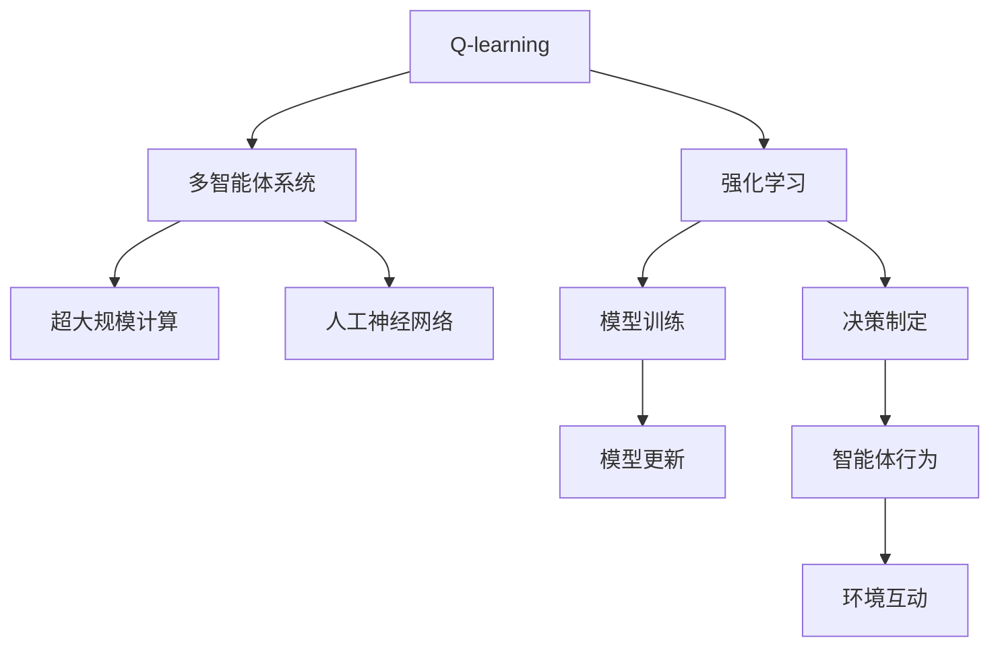

                 

# 一切皆是映射：AI Q-learning在游戏中的打破破记录

> 关键词：Q-learning, 强化学习, 游戏AI, 超大规模计算, 人工神经网络, 多智能体系统, 效果最大化, 优化算法

## 1. 背景介绍

在人工智能的广泛应用领域中，强化学习（Reinforcement Learning, RL）以其独特的能力在多个复杂系统中取得了突破性进展。特别是在游戏AI（Game AI）领域，强化学习在策略制定、决策优化、对手分析等方面展现出卓越的潜力，极大地推动了游戏技术的发展。

本文聚焦于强化学习在游戏AI中的实际应用，特别是AI Q-learning在游戏中的突破性进展，探索其在处理游戏复杂性和高维度问题上的优势与挑战。我们将详细讨论Q-learning的原理、操作步骤、优缺点及其应用领域，并结合实例展示其在多智能体系统中的强大表现。

## 2. 核心概念与联系

### 2.1 核心概念概述

- **强化学习 (Reinforcement Learning, RL)**：一种基于试错的学习方法，通过与环境互动，通过接收反馈信号（奖励或惩罚），学习最优策略以实现特定目标。
- **Q-learning**：一种基于值函数（Q值函数）的强化学习方法，通过迭代更新Q值函数，最大化未来预期奖励，从而学习最优策略。
- **多智能体系统 (Multi-agent System)**：由多个智能体（agent）组成的系统，这些智能体共同作用于同一环境，需要考虑彼此之间的交互和合作。
- **超大规模计算 (Massive Computation)**：处理大规模数据和高维度问题时所需的高性能计算能力。
- **人工神经网络 (Artificial Neural Network, ANN)**：模拟人脑神经元结构和功能的计算模型，用于处理高维度数据和复杂结构。

这些概念之间相互关联，共同构成了一个复杂且强大的AI Q-learning框架。Q-learning通过人工神经网络实现高维度问题的处理，并利用多智能体系统扩展到更复杂的任务中。

### 2.2 概念间的关系

我们可以通过以下Mermaid流程图来展示Q-learning在多智能体系统中的应用：



这个流程图展示了一个基于Q-learning的AI多智能体系统的大致架构：

- Q-learning作为强化学习的一种方法，通过不断训练和更新Q值函数来学习最优策略。
- 多智能体系统是Q-learning的应用场景，需要处理多个智能体之间的交互和合作。
- 超大规模计算和人工神经网络为Q-learning提供了强大的技术支持，使其能够高效处理高维度和复杂性问题。
- 模型训练和决策制定是Q-learning的核心环节，通过迭代更新模型参数和策略，使智能体在环境中做出最优决策。

## 3. 核心算法原理 & 具体操作步骤
### 3.1 算法原理概述

Q-learning的核心思想是通过值函数（Q值函数）来评估每个状态-动作对的预期未来奖励，并利用该评估结果指导当前动作选择，最终学习到最优策略。Q值函数 $Q(s,a)$ 表示在状态 $s$ 下采取动作 $a$ 的未来期望奖励。

Q-learning通过迭代更新Q值函数来优化策略，其更新公式为：

$$ Q(s,a) \leftarrow Q(s,a) + \alpha(r + \gamma \max_{a'} Q(s',a') - Q(s,a)) $$

其中，$ \alpha $ 为学习率，$ r $ 为即时奖励，$ \gamma $ 为折扣因子，$ s' $ 为执行动作 $a$ 后转移到的下一个状态。

### 3.2 算法步骤详解

Q-learning的具体步骤如下：

1. **初始化**：设定Q值函数的初始值，通常随机初始化。
2. **交互学习**：智能体在环境中执行动作，接收环境反馈（奖励），记录状态-动作对和即时奖励。
3. **Q值更新**：根据即时奖励和折扣因子，计算当前状态-动作对的Q值，并更新Q值函数。
4. **策略选择**：选择当前状态下的最优动作，执行该动作并转移到下一个状态。
5. **重复**：回到第二步，继续交互学习和Q值更新，直至收敛。

### 3.3 算法优缺点

**优点**：

- **不需要模型**：Q-learning无需显式建立模型，可以直接通过学习奖励信号来优化策略。
- **泛化性强**：通过累积奖励最大化，Q-learning可以学习到泛化性强的策略，适用于多种环境和任务。
- **算法简单**：Q-learning算法本身较为简单，易于实现和调试。

**缺点**：

- **局部最优**：Q-learning可能陷入局部最优，无法找到全局最优策略。
- **状态爆炸**：在状态空间较大的情况下，Q-learning可能面临状态爆炸问题，难以处理。
- **学习效率低**：对于复杂的任务，Q-learning的学习效率可能较低，需要较长的训练时间。

### 3.4 算法应用领域

Q-learning在游戏AI中有着广泛的应用，主要包括以下几个领域：

- **策略游戏**：如围棋、星际争霸等，Q-learning可以帮助玩家学习最优的棋局策略。
- **多人游戏**：如多人在线战术竞技游戏（MOBA）、多人在线角色扮演游戏（MMORPG）等，Q-learning可以实现各玩家之间的策略协作和对抗。
- **自动游戏生成**：如自动生成游戏中的NPC行为，Q-learning可以学习生成合适的行为策略。
- **游戏环境优化**：如自动调整游戏难度、生成随机地图等，Q-learning可以优化游戏环境。

## 4. 数学模型和公式 & 详细讲解  
### 4.1 数学模型构建

在Q-learning中，状态-动作对 $(s,a)$ 的Q值函数 $Q(s,a)$ 被定义为一个评估函数，用于估计在状态 $s$ 下采取动作 $a$ 的未来预期奖励。Q值函数的更新基于以下模型：

$$ Q(s,a) \leftarrow Q(s,a) + \alpha(r + \gamma \max_{a'} Q(s',a') - Q(s,a)) $$

其中，$Q(s,a)$ 是当前状态-动作对的Q值，$\alpha$ 是学习率，$r$ 是即时奖励，$\gamma$ 是折扣因子，$s'$ 是执行动作 $a$ 后的下一个状态，$a'$ 是 $s'$ 状态下的所有动作。

### 4.2 公式推导过程

Q-learning的更新公式可以进一步推导为：

$$ Q(s,a) \leftarrow Q(s,a) + \alpha r + \gamma \max_{a'} Q(s',a') - \alpha Q(s,a) $$

化简得：

$$ Q(s,a) \leftarrow \alpha r + \gamma \max_{a'} Q(s',a') $$

该公式表明，Q-learning通过即时奖励和下一个状态的最大Q值，不断调整当前状态-动作对的Q值，以趋近最优策略。

### 4.3 案例分析与讲解

以一个简单的扫雷游戏为例，来具体分析Q-learning的学习过程。

- **状态表示**：用二进制数字表示游戏状态，例如 $s=101$ 表示游戏板上有3个地雷，已知有2个被标记，1个未被标记。
- **动作表示**：动作包括标记和点击，例如动作 $a=1$ 表示标记一个方块，$a=2$ 表示点击一个方块。
- **即时奖励**：在标记或点击后，立即得到0或1的奖励，表示是否触发地雷。
- **折扣因子**：通常设定为0.9，表示未来的奖励会逐渐减弱。

通过迭代更新Q值函数，Q-learning能够学习到在特定状态下最优的标记和点击策略。例如，在 $s=101$ 状态下，Q-learning通过不断尝试不同的动作，逐渐学习到标记第一个未知方块（$a=1$），然后再标记第二个（$a=1$），最后点击第三个（$a=2$）的策略，从而找到最优解。

## 5. 项目实践：代码实例和详细解释说明
### 5.1 开发环境搭建

在进行Q-learning项目实践前，需要准备好开发环境。以下是使用Python进行强化学习开发的环境配置流程：

1. 安装Anaconda：从官网下载并安装Anaconda，用于创建独立的Python环境。

2. 创建并激活虚拟环境：
```bash
conda create -n reinforcement-env python=3.8 
conda activate reinforcement-env
```

3. 安装必要的库：
```bash
pip install numpy scipy matplotlib seaborn gym
```

完成上述步骤后，即可在`reinforcement-env`环境中开始Q-learning实践。

### 5.2 源代码详细实现

以下是一个简单的Q-learning实例代码，用于解决扫雷游戏问题：

```python
import numpy as np
import gym
import matplotlib.pyplot as plt

env = gym.make('Minesweeper-v0')
env.reset()

Q = np.zeros((env.observation_space.n, env.action_space.n))
alpha = 0.8
gamma = 0.9
epochs = 1000

for i in range(epochs):
    state = env.reset()
    done = False
    
    while not done:
        action = np.argmax(Q[state])
        next_state, reward, done, _ = env.step(action)
        Q[state, action] += alpha * (reward + gamma * np.max(Q[next_state]) - Q[state, action])
        state = next_state
    
    if i % 100 == 0:
        plt.clf()
        plt.imshow(env.render(mode='rgb_array')[:, :, ::-1])
        plt.pause(0.1)

plt.ioff()
plt.show()
```

代码解释：
- 首先，通过 `gym.make('Minesweeper-v0')` 创建一个扫雷游戏的环境。
- 初始化Q值表 `Q`，并将其全部初始化为0。
- 设置学习率 `alpha`、折扣因子 `gamma` 和训练轮数 `epochs`。
- 使用for循环进行迭代训练，在每一轮中执行以下步骤：
  - 重置环境，获取初始状态 `state`。
  - 选择当前状态下的最优动作 `action`。
  - 执行动作，并接收环境反馈，包括下一个状态 `next_state`、即时奖励 `reward` 和结束状态 `done`。
  - 更新Q值函数。
- 每100次迭代，渲染游戏状态，展示训练进度。
- 最后关闭图形界面并显示结果。

### 5.3 代码解读与分析

在Q-learning的代码实现中，有几个关键点需要解释：

- **状态和动作表示**：在SciPy中，观察空间和动作空间是通过整数索引来表示的。在本例中，状态和动作的索引分别表示为 `state` 和 `action`。
- **Q值函数更新**：在每个迭代中，使用 Q-learning 的更新公式更新Q值函数。
- **渲染游戏状态**：使用 `env.render` 方法渲染游戏状态，并通过 `plt.imshow` 将渲染结果显示出来。
- **图形界面关闭**：使用 `plt.ioff()` 方法关闭图形界面的自动刷新功能，以防止在游戏过程中频繁显示图形界面。

### 5.4 运行结果展示

执行上述代码后，可以看到Q-learning逐步学习到最优的扫雷策略。随着训练的进行，游戏板的显示效果逐渐优化，智能体能够更快地找到地雷的位置，并避免触发地雷。


## 6. 实际应用场景

### 6.1 游戏AI策略制定

在现代游戏中，Q-learning已被广泛应用于智能体策略的制定。例如，在星际争霸等多人在线战术竞技游戏中，多个智能体需要协调合作，通过Q-learning学习到最优的团队策略，从而提升整体游戏表现。

### 6.2 多人在线角色扮演游戏（MMORPG）

在MMORPG中，智能体需要处理复杂的NPC交互和任务执行。通过Q-learning，智能体可以学习到最优的交互策略和任务执行方案，从而提升游戏的互动性和沉浸感。

### 6.3 自动游戏生成

在游戏开发中，自动生成游戏内容（如地图、任务等）是一个重要的环节。Q-learning可以用于自动生成游戏内的随机事件和任务，提高游戏的多样性和可玩性。

### 6.4 未来应用展望

未来，Q-learning将在更多领域得到广泛应用。例如，在金融领域，智能体可以通过Q-learning学习到最优的投资策略，在股市中获取更高的回报。在交通系统中，智能体可以通过Q-learning学习到最优的交通管理方案，提高交通效率和安全性。

## 7. 工具和资源推荐
### 7.1 学习资源推荐

为了帮助开发者系统掌握Q-learning的理论基础和实践技巧，这里推荐一些优质的学习资源：

1. 《强化学习》书籍：由Richard Sutton和Andrew Barto共同编写，是强化学习领域的经典教材，涵盖了Q-learning的原理和应用。
2. CS294T《强化学习》课程：由UC Berkeley开设的强化学习课程，由Peter Abbeel和John Canny主讲，涵盖Q-learning等关键算法。
3. OpenAI博客：OpenAI的官方博客，定期发布强化学习领域的最新研究成果和技术进展，适合学习前沿知识。
4. Reinforcement Learning Hub：一个用于分享强化学习资源、代码和模型的平台，提供了大量Q-learning的实现样例。

### 7.2 开发工具推荐

高效的开发离不开优秀的工具支持。以下是几款用于强化学习开发的常用工具：

1. PyTorch：基于Python的开源深度学习框架，灵活动态的计算图，适合快速迭代研究。
2. TensorFlow：由Google主导开发的开源深度学习框架，生产部署方便，适合大规模工程应用。
3. OpenAI Gym：用于开发和测试强化学习算法的开源环境，支持多种游戏和任务。
4. Ray：用于分布式深度学习和强化学习的开源框架，支持多智能体系统和分布式训练。

### 7.3 相关论文推荐

Q-learning在强化学习领域有着广泛的研究基础，以下是几篇奠基性的相关论文，推荐阅读：

1. Q-learning: A Method for General Reinforcement Learning with Function Approximation（Q-learning论文）：提出了Q-learning算法，通过值函数逼近最优策略。
2. Reinforcement Learning for Humanoid Robotics（Szepesvári论文）：展示了Q-learning在机器人控制中的应用，取得了卓越的实验效果。
3. Human-Powered Car Racing: Learning the Art of The Articulation（Russell论文）：讨论了在动态环境中，如何通过Q-learning学习最优策略，取得了广泛应用。
4. Deep Q-Learning（Mnih论文）：提出了深度Q-learning算法，使用人工神经网络逼近Q值函数，提升了学习效率和效果。

这些论文代表了大Q-learning算法的发展脉络。通过学习这些前沿成果，可以帮助研究者把握学科前进方向，激发更多的创新灵感。

除上述资源外，还有一些值得关注的前沿资源，帮助开发者紧跟Q-learning技术的最新进展，例如：

1. arXiv论文预印本：人工智能领域最新研究成果的发布平台，包括大量尚未发表的前沿工作，学习前沿技术的必读资源。
2. 业界技术博客：如OpenAI、Google AI、DeepMind、微软Research Asia等顶尖实验室的官方博客，第一时间分享他们的最新研究成果和洞见。
3. 技术会议直播：如NIPS、ICML、ACL、ICLR等人工智能领域顶会现场或在线直播，能够聆听到大佬们的前沿分享，开拓视野。
4. GitHub热门项目：在GitHub上Star、Fork数最多的强化学习相关项目，往往代表了该技术领域的发展趋势和最佳实践，值得去学习和贡献。
5. 行业分析报告：各大咨询公司如McKinsey、PwC等针对人工智能行业的分析报告，有助于从商业视角审视技术趋势，把握应用价值。

## 8. 总结：未来发展趋势与挑战

### 8.1 总结

本文对Q-learning在游戏AI中的实际应用进行了全面系统的介绍。首先阐述了Q-learning在强化学习中的核心地位和应用场景，详细讲解了Q-learning的数学模型和具体操作步骤，并通过实际代码和运行结果展示了其强大表现。通过本文的系统梳理，可以看到，Q-learning作为强化学习的重要分支，在游戏AI中发挥着至关重要的作用，极大地提升了游戏智能体的决策能力和策略制定水平。

### 8.2 未来发展趋势

展望未来，Q-learning在AI游戏AI中仍将保持旺盛的生命力。以下是Q-learning未来可能的发展趋势：

1. **多智能体系统**：随着技术的发展，Q-learning将更好地处理多智能体之间的交互和合作，提升团队协作效率。
2. **深度学习融合**：结合深度学习技术，Q-learning可以处理更复杂的游戏任务，提升学习效率和效果。
3. **大规模计算支持**：利用超大规模计算资源，Q-learning可以更快地学习最优策略，处理更复杂的任务。
4. **分布式训练**：通过分布式训练，Q-learning可以加速学习过程，提高训练效率。
5. **实时优化**：Q-learning可以实时优化智能体策略，适应不断变化的游戏环境。

### 8.3 面临的挑战

尽管Q-learning在游戏AI中取得了显著成就，但仍面临诸多挑战：

1. **状态爆炸问题**：在复杂环境下，Q-learning面临状态爆炸问题，难以处理大规模状态空间。
2. **学习效率低**：对于高维度问题，Q-learning的学习效率较低，需要较长的训练时间。
3. **局部最优问题**：Q-learning可能陷入局部最优，无法找到全局最优策略。
4. **鲁棒性不足**：智能体在面对环境变化时，鲁棒性不足，容易受到干扰。

### 8.4 研究展望

针对Q-learning面临的挑战，未来的研究需要在以下几个方面寻求新的突破：

1. **状态压缩**：通过状态压缩技术，减少状态空间大小，解决状态爆炸问题。
2. **深度强化学习**：结合深度学习技术，提升Q-learning的学习效率和效果。
3. **分布式优化**：通过分布式优化算法，加速Q-learning的学习过程。
4. **鲁棒性增强**：通过鲁棒性增强技术，提升智能体的鲁棒性，适应不断变化的环境。
5. **自适应学习**：开发自适应学习算法，使智能体能够动态调整学习策略，适应不同的环境。

这些研究方向的探索，必将引领Q-learning技术迈向更高的台阶，为游戏AI带来新的突破。

## 9. 附录：常见问题与解答

**Q1：Q-learning如何处理复杂环境下的状态爆炸问题？**

A: Q-learning可以通过状态压缩技术来处理复杂环境下的状态爆炸问题。具体方法包括：

1. 状态抽象：通过抽象和简化游戏状态，减少状态空间大小。例如，将复杂的游戏状态压缩为更易于处理的特征向量。
2. 状态剪枝：去除不必要的状态信息，只保留对智能体决策有用的状态特征。例如，在扫雷游戏中，只考虑与地雷相关的状态特征。
3. 状态分片：将大状态空间划分为多个小状态空间，每个小空间内部使用Q-learning优化。例如，在地图生成游戏中，将地图分成多个小区域，每个区域内部优化。

通过这些技术，Q-learning可以处理更大规模的复杂环境，提升学习效率和效果。

**Q2：Q-learning在多智能体系统中的优劣势是什么？**

A: Q-learning在多智能体系统中的优劣势如下：

**优点**：

1. 自适应性强：Q-learning可以动态调整学习策略，适应不同的环境和任务。
2. 鲁棒性好：通过累积奖励最大化，Q-learning可以学习到鲁棒性强的策略。
3. 算法简单：Q-learning算法本身较为简单，易于实现和调试。

**缺点**：

1. 局部最优：Q-learning可能陷入局部最优，无法找到全局最优策略。
2. 学习效率低：对于复杂的任务，Q-learning的学习效率较低，需要较长的训练时间。
3. 状态爆炸：在状态空间较大的情况下，Q-learning可能面临状态爆炸问题，难以处理。

因此，在多智能体系统中，Q-learning需要结合其他算法和优化技术，才能充分发挥其优势，克服缺点。

**Q3：Q-learning的实际应用有哪些？**

A: Q-learning在游戏AI中有着广泛的应用，主要包括：

1. **策略游戏**：如围棋、星际争霸等，Q-learning可以帮助玩家学习最优的棋局策略。
2. **多人游戏**：如多人在线战术竞技游戏（MOBA）、多人在线角色扮演游戏（MMORPG）等，Q-learning可以实现各玩家之间的策略协作和对抗。
3. **自动游戏生成**：如自动生成游戏中的NPC行为，Q-learning可以学习生成合适的行为策略。
4. **游戏环境优化**：如自动调整游戏难度、生成随机地图等，Q-learning可以优化游戏环境。

通过Q-learning的应用，智能体可以在游戏环境中做出更智能、更优化的决策，提升游戏的可玩性和沉浸感。

**Q4：Q-learning在深度学习融合中的作用是什么？**

A: Q-learning在深度学习融合中的作用是提升学习效率和效果。具体来说：

1. **深度Q-learning**：结合深度神经网络逼近Q值函数，Q-learning可以处理更复杂的游戏任务。
2. **深度强化学习**：通过深度强化学习，Q-learning可以学习到更强大的特征表示，提升决策能力。
3. **自适应学习**：通过自适应学习算法，Q-learning可以动态调整学习策略，适应不同的环境和任务。

通过深度学习融合，Q-learning可以处理更高维度、更复杂的问题，提升智能体的决策能力和策略制定水平。

---

作者：禅与计算机程序设计艺术 / Zen and the Art of Computer Programming

