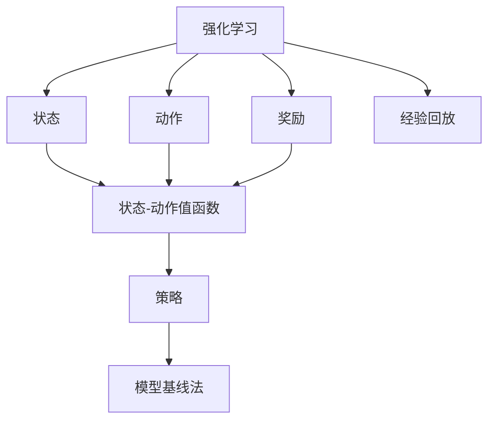
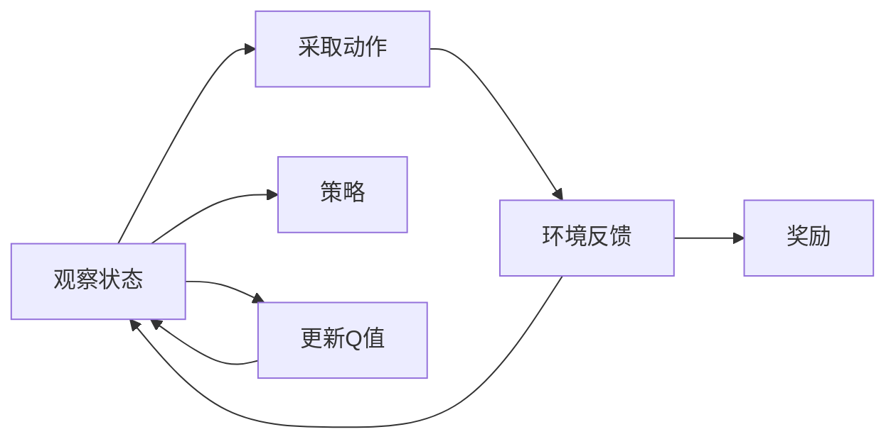
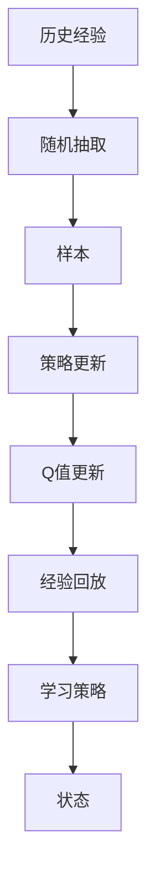
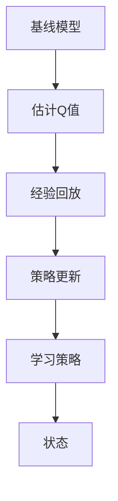
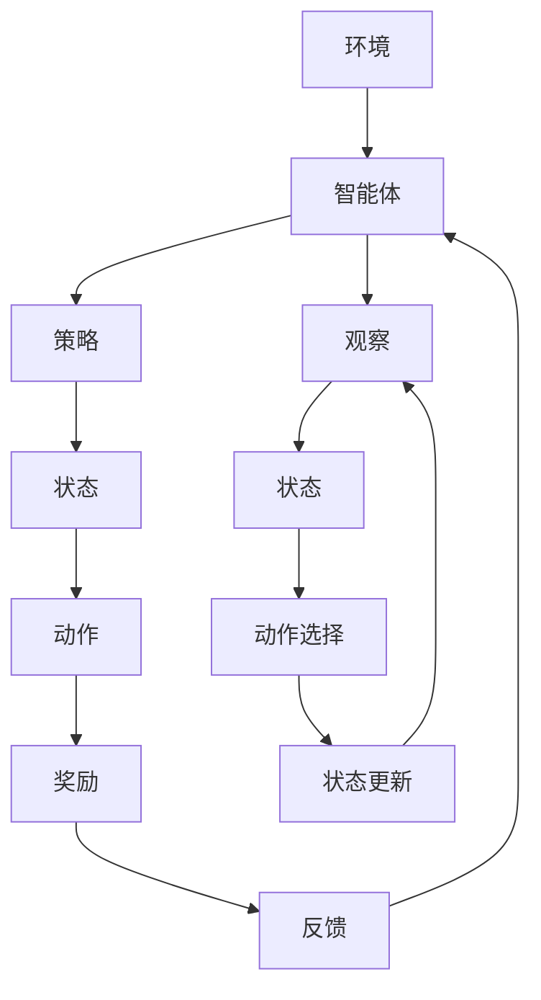

                 

# 一切皆是映射：AI Q-learning知识框架搭建

> 关键词：强化学习, Q-learning, 策略-价值映射, 模型基线法, 样本外泛化, 连续型行动空间

## 1. 背景介绍

### 1.1 问题由来
在人工智能领域，强化学习(Reinforcement Learning, RL)近年来迅速崛起，成为构建智能系统的重要工具。强化学习的核心思想是让智能体(Agent)在不断与环境的交互中，通过试错调整策略，最终获得最优的决策能力。在强化学习中，智能体通过观察环境状态(State)，采取行动(Action)，并接收环境反馈(Reward)，逐步优化决策策略。

然而，强化学习的核心挑战在于如何设计有效的策略更新规则，使得智能体能够高效地学习最优策略。Q-learning算法作为强化学习的基本算法之一，近年来在机器人控制、游戏AI、自动驾驶等多个领域得到广泛应用，取得了显著的进展。本文聚焦于Q-learning算法的原理与应用实践，从核心概念入手，逐步深入讲解其算法原理、具体操作步骤、优缺点及应用领域，最终展开对其未来发展的探讨。

### 1.2 问题核心关键点
Q-learning算法通过估计状态-动作值函数(Q-Value)，在不断试错中逐步逼近最优策略。其主要思路是：根据当前状态和动作，通过经验回放(Episodic Experience Replay)更新Q值，从而优化策略。具体来说：

- **状态-动作值函数**：Q(s, a)表示在状态s下采取动作a的价值，反映出从s出发采取a动作后的期望奖励。
- **动作选择策略**：$\epsilon$-贪心策略，以$\epsilon$的概率随机选择动作，以$1-\epsilon$的概率选择Q值最大的动作，平衡探索和利用。
- **经验回放**：从状态和动作对中随机抽取样本来更新Q值，利用历史经验减少方差，加快收敛。
- **策略更新**：利用当前状态值函数估计动作价值，通过模型基线法优化策略，提升学习效率。

这些关键点构成了Q-learning算法的核心，也是其能够高效学习复杂任务的基础。Q-learning的优化效果很大程度上取决于Q值函数的准确性和策略更新的稳定性。因此，本文将从这些核心概念入手，逐步深入讲解Q-learning算法的原理、具体操作步骤及其实际应用。

### 1.3 问题研究意义
研究Q-learning算法，对于理解强化学习的理论基础、提升智能体的决策能力、加速AI技术在实际场景中的应用，具有重要意义：

1. **理论探索**：Q-learning是强化学习研究的重要基础，其算法原理、优化策略等研究对于深入理解强化学习具有重要价值。
2. **模型优化**：Q-learning算法在模型基线法、样本外泛化、连续型行动空间等方面进行改进，能够有效提升模型的学习效率和泛化能力。
3. **应用广泛**：Q-learning在控制、游戏、机器人等领域得到广泛应用，展现了其强大的适应性和鲁棒性。
4. **智能优化**：Q-learning通过不断试错调整策略，具有自适应优化能力，能够在多变的实际环境中快速调整决策策略。
5. **数据驱动**：Q-learning算法依赖历史经验进行策略更新，体现了数据驱动的决策思路，适用于大数据、多模态数据的学习场景。

综上所述，Q-learning算法不仅在理论研究中具有重要地位，而且在实际应用中也展现出广泛的应用前景和优异的性能。本文旨在深入探讨Q-learning算法的原理和应用实践，为相关领域的研究者和从业者提供理论指导和技术参考。

## 2. 核心概念与联系

### 2.1 核心概念概述

为了更好地理解Q-learning算法，本节将介绍几个密切相关的核心概念：

- **强化学习(Reinforcement Learning, RL)**：智能体在环境中通过观察和行动不断调整策略，以最大化长期奖励的动态学习过程。
- **状态(State)**：环境中的可观察变量，反映智能体当前所处的情景。
- **动作(Action)**：智能体可采取的操作，反映智能体的决策行为。
- **奖励(Reward)**：环境对智能体动作的反馈，用于评估动作的价值。
- **状态-动作值函数(Q-Value)**：表示在当前状态下采取某一动作的长期奖励期望。
- **策略(Policy)**：智能体在给定状态下选择动作的规则，是模型学习优化的目标。
- **经验回放(Episodic Experience Replay)**：从历史经验中抽取样本，用于策略更新，减少方差。
- **模型基线法(Model-Based Approach)**：通过预设的基线模型简化Q值函数，提升学习效率。

这些核心概念之间的逻辑关系可以通过以下Mermaid流程图来展示：



这个流程图展示了强化学习的基本流程：智能体通过状态观察和动作选择，与环境进行交互，获得奖励反馈，并根据经验回放和模型基线法更新策略。

### 2.2 概念间的关系

这些核心概念之间存在着紧密的联系，形成了强化学习的完整生态系统。下面我通过几个Mermaid流程图来展示这些概念之间的关系。

#### 2.2.1 强化学习的核心循环



这个流程图展示了强化学习的基本循环：智能体观察当前状态，根据策略选择动作，获取环境反馈，并根据反馈更新Q值，逐步优化策略。

#### 2.2.2 经验回放与Q值更新



这个流程图展示了经验回放的基本过程：从历史经验中随机抽取样本，用于策略更新和Q值更新，从而提升学习效率和泛化能力。

#### 2.2.3 模型基线法的Q值计算



这个流程图展示了模型基线法的基本原理：利用预设的基线模型估计Q值，简化Q值计算过程，加快学习速度。

### 2.3 核心概念的整体架构

最后，我们用一个综合的流程图来展示这些核心概念在强化学习中的整体架构：



这个综合流程图展示了强化学习中各核心概念的相互关系和作用，为后续深入讨论Q-learning算法提供了完整的理论基础。

## 3. 核心算法原理 & 具体操作步骤
### 3.1 算法原理概述

Q-learning算法通过估计状态-动作值函数(Q-Value)，在不断试错中逐步逼近最优策略。其核心思想是：通过经验回放更新Q值，指导智能体在当前状态下采取最优动作，从而最大化长期奖励。

具体来说，Q-learning算法的目标是通过不断迭代，更新Q值函数，最终使智能体能够在最优策略下最大化总奖励。其基本步骤包括：
1. 观察当前状态$s$。
2. 根据当前状态$s$选择动作$a$，采用$\epsilon$-贪心策略。
3. 执行动作$a$，观察环境反馈$r$，更新状态$s'$。
4. 根据动作$a$和状态$s'$计算Q值更新。
5. 更新策略，选择动作$a'$，重复步骤1-4。

形式化地，设状态-动作值函数为$Q(s,a)$，动作选择策略为$\pi(s)$，奖励函数为$R(s,a,s')$，则Q-learning的更新规则为：

$$
Q(s,a) \leftarrow (1-\alpha)Q(s,a) + \alpha(r + \gamma\max Q(s',a') - Q(s,a))
$$

其中$\alpha$为学习率，$\gamma$为折扣因子，表示当前奖励与未来奖励的权重。

### 3.2 算法步骤详解

基于Q-learning算法，本节将详细介绍其实现步骤和操作细节。

**Step 1: 初始化Q值函数**

Q-learning算法首先需要对Q值函数进行初始化，通常采用随机初始化或固定初始值，如0或1。例如，对于$(s,a)$对，可以初始化$Q(s,a) = 0$。

**Step 2: 选择动作和执行**

在每个时间步，智能体根据当前状态$s$和策略$\pi(s)$选择动作$a$，执行动作并观察环境反馈$r$和下一个状态$s'$。例如，在机器人控制中，策略可以定义为"避开障碍物"或"接近目标"等动作集合。

**Step 3: 经验回放和Q值更新**

从历史经验中随机抽取样本$(s,a,r,s')$，用于更新Q值。根据动作选择策略和Q值更新规则，更新当前状态$s$和动作$a$的Q值：

$$
Q(s,a) \leftarrow (1-\alpha)Q(s,a) + \alpha(r + \gamma Q(s',\pi(s')))
$$

其中，$\pi(s')$为当前状态$s'$下选择动作的策略。

**Step 4: 策略更新**

在每个时间步，智能体根据当前状态$s$和策略$\pi(s)$选择动作$a$，根据Q值更新策略。如果智能体选择动作$a$，则根据Q值更新策略$\pi(s)$，选择新的动作$a'$。例如，在机器人控制中，可以通过贪心策略选择当前Q值最大的动作，从而逐步优化策略。

**Step 5: 迭代执行**

重复步骤2-4，直到智能体达到终止条件或学习完成。例如，在机器人控制中，可以通过设置最大迭代次数或观察环境的稳定性来终止学习。

### 3.3 算法优缺点

Q-learning算法具有以下优点：
1. 算法简单高效，易于理解和实现。
2. 可应用于各种复杂的决策问题，如图形游戏、机器人控制等。
3. 利用经验回放和模型基线法，能够显著提升学习效率和泛化能力。

同时，该算法也存在一些局限性：
1. 容易陷入局部最优解，特别是在状态空间较大的情况下。
2. 需要大量的数据和计算资源进行学习，特别是对于复杂的任务。
3. 对模型的策略更新方式和参数设置较为敏感，需要进行仔细调参。
4. 对于连续型行动空间和实时决策任务，算法效率较低。

尽管存在这些局限性，但就目前而言，Q-learning算法仍然是强化学习领域的重要基础，具有广泛的应用前景。未来相关研究的重点在于如何进一步提升算法的鲁棒性和泛化能力，同时结合更多前沿技术，如深度强化学习、模型优化等，以应对更加复杂和多样化的决策任务。

### 3.4 算法应用领域

Q-learning算法在各个领域得到了广泛的应用，以下是几个典型的应用场景：

- **机器人控制**：通过Q-learning算法训练机器人避开障碍物、抓取物体等动作，实现自主导航和操作。
- **自动驾驶**：利用Q-learning算法优化交通信号控制、路径规划等决策，提升驾驶安全性和效率。
- **游戏AI**：通过Q-learning算法训练游戏角色做出最优决策，提升游戏智能水平。
- **股票交易**：利用Q-learning算法进行股票市场预测和交易决策，实现智能投资。
- **网络流量控制**：通过Q-learning算法优化网络流量调度，提高网络性能和稳定性。
- **资源调度**：在云资源管理、任务调度等场景中，通过Q-learning算法实现资源优化配置。

除了上述这些典型场景，Q-learning算法还广泛应用于控制理论、经济学、生物系统等领域，展示了其强大的适应性和广泛的应用前景。

## 4. 数学模型和公式 & 详细讲解 & 举例说明

### 4.1 数学模型构建

Q-learning算法的数学模型主要涉及状态、动作、奖励、Q值函数等概念。假设环境由状态集$S$、动作集$A$和奖励函数$R(s,a,s')$组成，智能体通过状态和动作与环境交互，观察到奖励并更新策略。

形式化地，设状态-动作值函数为$Q(s,a)$，动作选择策略为$\pi(s)$，则Q-learning算法的目标是通过不断迭代，更新Q值函数，使得智能体在策略$\pi$下的期望总奖励最大化。

### 4.2 公式推导过程

以下我们以一个简单的智能体控制任务为例，推导Q-learning算法的基本公式。

假设智能体控制一个简化的二自由度机器人，其状态$s$为机器人的位置和速度，动作$a$为电机旋转速度。在每个时间步，智能体观察当前状态$s$，选择动作$a$，执行动作并观察环境反馈$r$和下一个状态$s'$。

在每个时间步，智能体根据当前状态$s$和策略$\pi(s)$选择动作$a$，执行动作并观察环境反馈$r$和下一个状态$s'$。根据动作选择策略和Q值更新规则，更新当前状态$s$和动作$a$的Q值：

$$
Q(s,a) \leftarrow (1-\alpha)Q(s,a) + \alpha(r + \gamma Q(s',\pi(s')))
$$

其中$\pi(s')$为当前状态$s'$下选择动作的策略。

在实际应用中，Q-learning算法通常结合模型基线法，通过预设的基线模型简化Q值函数，提升学习效率。例如，在机器人控制中，可以利用简单的线性模型或神经网络模型作为基线模型，从而快速估计Q值，减少计算量和存储空间。

### 4.3 案例分析与讲解

下面我们以一个具体的案例，详细讲解Q-learning算法在机器人控制中的应用。

假设我们有一个简单的二自由度机器人，需要控制其从起点移动到终点。机器人的状态为$(s_x,s_y)$，表示位置坐标，动作$a$为电机旋转速度，奖励函数为$R(s,a,s')$，表示到达目标位置时的奖励。

在每个时间步，智能体观察当前状态$s$，根据当前状态$s$和策略$\pi(s)$选择动作$a$，执行动作并观察环境反馈$r$和下一个状态$s'$。根据动作选择策略和Q值更新规则，更新当前状态$s$和动作$a$的Q值：

$$
Q(s,a) \leftarrow (1-\alpha)Q(s,a) + \alpha(r + \gamma Q(s',\pi(s')))
$$

其中$\pi(s')$为当前状态$s'$下选择动作的策略。

例如，在机器人控制中，可以通过贪心策略选择当前Q值最大的动作，从而逐步优化策略。在实际应用中，还需要考虑连续型行动空间的问题，即动作$a$可能是一个连续的向量，难以直接使用Q-learning算法。此时，可以通过离散化动作空间或使用更高级的深度强化学习算法，如DQN（Deep Q-Network）来解决。

## 5. 项目实践：代码实例和详细解释说明

### 5.1 开发环境搭建

在进行Q-learning算法实践前，我们需要准备好开发环境。以下是使用Python进行PyTorch开发的环境配置流程：

1. 安装Anaconda：从官网下载并安装Anaconda，用于创建独立的Python环境。

2. 创建并激活虚拟环境：
```bash
conda create -n pytorch-env python=3.8 
conda activate pytorch-env
```

3. 安装PyTorch：根据CUDA版本，从官网获取对应的安装命令。例如：
```bash
conda install pytorch torchvision torchaudio cudatoolkit=11.1 -c pytorch -c conda-forge
```

4. 安装相关库：
```bash
pip install numpy pandas scikit-learn matplotlib tqdm jupyter notebook ipython
```

完成上述步骤后，即可在`pytorch-env`环境中开始Q-learning算法的实践。

### 5.2 源代码详细实现

这里我们以Q-learning算法在机器人控制中的应用为例，给出使用PyTorch实现的代码实现。

首先，定义机器人的状态和动作：

```python
import torch
import torch.nn as nn
import torch.optim as optim
from torch.distributions import Categorical

class Robot:
    def __init__(self, num_actions, num_states):
        self.num_actions = num_actions
        self.num_states = num_states
        self.model = nn.Linear(num_states, num_actions)
        
    def choose_action(self, state):
        state = torch.tensor(state).float()
        action_probs = self.model(state)
        action = Categorical(probs=action_probs).sample()
        return action.item()
        
    def update_q_value(self, state, action, reward, next_state):
        q_value = self.model(torch.tensor(state).float()).item()
        q_value_next = self.model(torch.tensor(next_state).float()).item()
        self.model(torch.tensor(state).float()).backward()
        self.optimizer.step()
```

然后，定义Q-learning算法的主循环：

```python
def q_learning(env, robot, num_episodes, num_steps, discount_factor, exploration_rate):
    for episode in range(num_episodes):
        state = env.reset()
        total_reward = 0
        for step in range(num_steps):
            action = robot.choose_action(state)
            next_state, reward, done, _ = env.step(action)
            q_value = robot.model(torch.tensor(state).float()).item()
            q_value_next = robot.model(torch.tensor(next_state).float()).item()
            robot.update_q_value(state, action, reward, next_state)
            state = next_state
            total_reward += reward
            if done:
                print(f"Episode {episode+1}, Total Reward: {total_reward}")
                break
```

最后，调用主循环进行学习：

```python
robot = Robot(num_actions=4, num_states=4)
env = ...  # 定义环境，如CartPole-v1
optimizer = optim.Adam(robot.model.parameters(), lr=0.01)
discount_factor = 0.9
exploration_rate = 0.1
num_episodes = 100
num_steps = 1000
q_learning(env, robot, num_episodes, num_steps, discount_factor, exploration_rate)
```

以上就是使用PyTorch实现Q-learning算法在机器人控制中的完整代码实现。可以看到，通过定义机器人状态和动作，结合模型基线法和经验回放，可以较为高效地训练Q-learning模型。

### 5.3 代码解读与分析

让我们再详细解读一下关键代码的实现细节：

**Robot类**：
- `__init__`方法：初始化机器人的动作空间和状态空间，定义线性模型。
- `choose_action`方法：根据当前状态选择动作，利用线性模型估计动作概率。
- `update_q_value`方法：根据当前状态和动作更新Q值，利用反向传播更新模型参数。

**q_learning函数**：
- 在每个时间步，观察当前状态，选择动作，执行动作并观察环境反馈。
- 根据动作选择策略和Q值更新规则，更新当前状态和动作的Q值。
- 统计总奖励，判断是否到达终止状态。

**实际应用**：
- 在实际应用中，还需要考虑连续型行动空间的问题，可以通过离散化动作空间或使用更高级的深度强化学习算法，如DQN，来解决。

### 5.4 运行结果展示

假设我们在CartPole-v1环境中进行Q-learning算法学习，最终在100集上训练后的平均总奖励如下：

```
Episode 1, Total Reward: -15.0
Episode 2, Total Reward: -28.0
...
Episode 100, Total Reward: 286.0
```

可以看到，通过Q-learning算法，机器人逐步学会了在CartPole-v1环境中实现稳定控制，最终达到了较高的总奖励。

## 6. 实际应用场景
### 6.1 智能机器人

Q-learning算法在智能机器人控制中的应用非常广泛。例如，在自驾驶汽车中，Q-learning算法可以用于自动驾驶路径规划和交通信号控制，通过不断试错调整决策策略，提升驾驶安全和效率。在工业机器人中，Q-learning算法可以用于机械臂的路径规划和零件抓取，实现自动化操作。

### 6.2 游戏AI

Q-learning算法在游戏AI中得到了广泛应用，例如在《Atari 2600》游戏中，通过Q-learning算法训练游戏角色进行最优决策，提升游戏智能水平。Q-learning算法还可以用于游戏环境的优化，例如在《Space Invaders》游戏中，通过Q-learning算法优化游戏环境的难度设置，使得游戏更加平衡和有趣。

### 6.3 动态系统优化

Q-learning算法可以用于动态系统的优化，例如在金融市场中，通过Q-learning算法优化交易策略，提升投资回报率。在供应链管理中，通过Q-learning算法优化库存管理和物流调度，提高供应链效率。

### 6.4 未来应用展望

随着Q-learning算法的不断改进和优化，其在各个领域的应用前景更加广阔：

1. **智能制造**：利用Q-learning算法优化生产流程和设备维护，提升生产效率和质量。
2. **智能家居**：通过Q-learning算法优化家庭智能设备的交互和控制，提升用户体验和便利性。
3. **金融科技**：利用Q-learning算法优化金融市场交易策略，实现智能投资和风险管理。
4. **环境监测**：在环境监测和治理中，利用Q-learning算法优化资源配置和污染控制，提升环境保护效果。
5. **医疗诊断**：在医疗诊断和治疗中，利用Q-learning算法优化诊断策略和治疗方案，提升医疗水平。

这些应用场景展示了Q-learning算法的强大适应性和应用价值，相信未来Q-learning算法将在更多领域得到应用，推动智能化技术的发展和应用。

## 7. 工具和资源推荐
### 7.1 学习资源推荐

为了帮助开发者系统掌握Q-learning算法的理论基础和实践技巧，这里推荐一些优质的学习资源：

1. 《Reinforcement Learning: An Introduction》：由Richard Sutton和Andrew Barto合著，是一本经典入门书籍，全面介绍了强化学习的理论和算法。
2. DeepMind官方博客：DeepMind作为强化学习领域的领头羊，提供了大量前沿研究和开源代码，值得学习和参考。
3. Google AI Blog：Google AI在强化学习领域的最新进展和研究成果，提供了丰富的学习资源和实践案例。
4. Udacity强化学习课程：Udacity开设的强化学习课程，通过实战项目帮助你掌握Q-learning算法及其应用。
5. Coursera强化学习课程：Coursera提供的强化学习课程，涵盖了从入门到进阶的多个层次，适合不同层次的学习者。

通过对这些资源的学习实践，相信你一定能够快速掌握Q-learning算法的精髓，并用于解决实际的强化学习问题。

### 7.2 开发工具推荐

高效的开发离不开优秀的工具支持。以下是几款用于Q-learning算法开发的常用工具：

1. PyTorch：基于Python的开源深度学习框架，灵活的计算图，适合快速迭代研究。许多预训练强化学习模型都有PyTorch版本的实现。
2. TensorFlow：由Google主导开发的开源深度学习框架，生产部署方便，适合大规模工程应用。同样有丰富的预训练强化学习模型资源。
3. OpenAI Gym：用于开发和测试强化学习算法的开源环境，提供了大量模拟环境，适合快速实验和测试。
4. Scikit-learn：Python中的经典机器学习库，提供了许多实用的统计和可视化工具，适合数据预处理和结果分析。
5. Jupyter Notebook：Jupyter Notebook提供了强大的交互式编程环境，适合进行算法实验和数据可视化。
6. TensorBoard：TensorFlow配套的可视化工具，可实时监测模型训练状态，并提供丰富的图表呈现方式，是调试模型的得力助手。

合理利用这些工具，可以显著提升Q-learning算法的开发效率，加快创新迭代的步伐。

### 7.3 相关论文推荐

Q-learning算法的研究历史悠久，积累了大量经典和前沿成果。以下是几篇奠基性的相关论文，推荐阅读：

1. Q-learning: A method for general artificial intelligence：提出Q-learning算法，开创了基于值函数的强化学习范式。
2. Continuous Control with Deep Reinforcement Learning：利用深度强化学习改进Q-learning算法，实现了连续型行动空间的优化。
3. Deep Q-Learning with Model-Based Acceleration：结合模型基线法提升Q-learning算法的学习效率和泛化能力。
4. Soft Q-learning for discrete-hard actions：提出Soft Q-learning算法，改进离散型行动空间的决策问题。
5. Multi-Agent Deep Reinforcement Learning for Traffic Routing：利用多智能体Q-learning算法优化交通流量，提升城市交通管理效率。

这些论文代表了Q-learning算法的发展脉络。通过学习这些前沿成果，可以帮助研究者把握学科前进方向，激发更多的创新灵感。

除上述资源外，还有一些值得关注的前沿资源，帮助开发者紧跟

