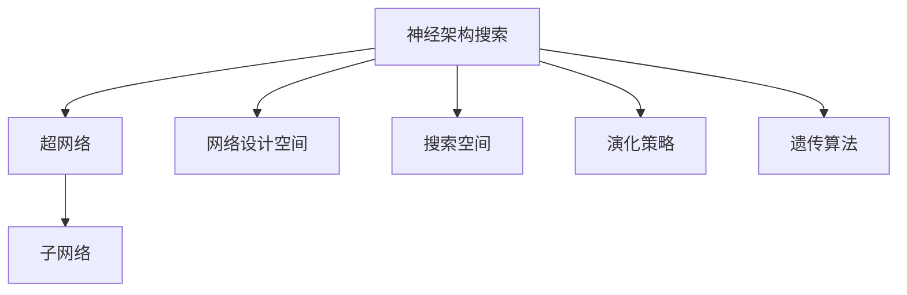

                 

## 1. 背景介绍

### 1.1 问题由来

在深度学习的发展历程中，随着模型复杂度的提升，优化难度和计算资源的消耗也随之增加。模型设计者往往需要依赖手工设计来调整网络结构，这既耗时耗力，也难以找到最优解。此外，设计出的网络结构可能存在大量冗余，无法充分利用数据带来的信号。

神经架构搜索（Neural Architecture Search, NAS）正是在这一背景下提出的一种自动化网络结构设计技术，旨在通过自动搜索的方式找到最优的神经网络结构。这一技术可以显著降低模型设计成本，提升模型性能，有助于加速人工智能的创新和应用。

### 1.2 问题核心关键点

NAS的核心在于利用机器学习算法寻找网络结构的搜索空间。该技术通过在一定搜索空间中自动搜索，评估不同结构在特定任务上的性能，从而找到最优网络结构。具体步骤如下：

1. 定义一个搜索空间，其中包含所有可能的网络结构。
2. 设计评估指标，对每个搜索到的结构进行性能评估。
3. 使用机器学习算法在搜索空间中寻找最优结构。
4. 训练并验证最优结构在特定任务上的性能。

NAS技术的提出，标志着从手工设计向自动搜索的重大转变，为深度学习模型的自动化设计提供了新的可能性。

### 1.3 问题研究意义

研究NAS技术对于推动深度学习的发展具有重要意义：

1. **加速模型创新**：自动化设计可以显著降低模型设计时间和成本，促进更多创新模型涌现。
2. **提高模型性能**：通过搜索最优结构，提升模型在特定任务上的表现。
3. **提升设计效率**：减少手工设计的冗余工作，让模型设计者专注于更高层次的创新。
4. **降低资源消耗**：优化网络结构可以减少模型参数量，降低计算和存储成本。

## 2. 核心概念与联系

### 2.1 核心概念概述

为更好地理解NAS技术，本节将介绍几个关键概念：

- **神经架构搜索(NAS)**：一种自动化网络结构设计技术，通过搜索得到最优网络结构。
- **超网络(Super Network)**：一个包含所有可能结构的计算图，其中的节点和边分别表示网络中的层和连接关系。
- **子网络(Sub Network)**：超网络中的一部分结构，对应于特定的网络设计。
- **网络设计空间(Network Design Space)**：定义所有可能的网络结构及其参数空间的集合。
- **搜索空间(Search Space)**：网络设计空间的一个子集，用于实际搜索。
- **演化策略(Evolutionary Strategy)**：一种基于群体优化的搜索算法，通过模拟自然进化过程寻找最优解。
- **遗传算法(Genetic Algorithm)**：一种基于遗传学原理的演化策略，用于搜索最优网络结构。

这些概念共同构成了NAS技术的基础框架，帮助理解从设计搜索空间到最终找到最优结构的整个过程。

### 2.2 概念间的关系

NAS技术涉及多个关键概念，通过以下Mermaid流程图展示其核心关系：



此图展示了NAS技术中各概念之间的联系：

1. **神经架构搜索** 是整个过程的最终目标，通过搜索最优结构来优化模型性能。
2. **超网络** 是所有可能结构的计算图表示，用于表示网络中所有的节点和边。
3. **子网络** 是超网络的一部分，对应于特定的网络设计。
4. **网络设计空间** 定义了所有可能的结构及其参数空间。
5. **搜索空间** 是网络设计空间的一个子集，用于实际搜索。
6. **演化策略** 和 **遗传算法** 是用于搜索最优结构的两种主要方法。

通过这些概念，我们可以更清晰地理解NAS技术的工作流程。

## 3. 核心算法原理 & 具体操作步骤

### 3.1 算法原理概述

NAS算法通常分为两个主要步骤：首先定义网络设计空间，然后通过搜索算法在搜索空间中找到最优网络结构。

具体步骤如下：

1. **定义网络设计空间**：确定所有可能的层类型、连接方式、激活函数等，形成搜索空间。
2. **选择搜索算法**：选择适合的网络结构搜索算法。
3. **搜索最优结构**：使用选择的搜索算法在搜索空间中搜索最优结构。
4. **训练和验证**：训练和验证最优结构在特定任务上的性能。

### 3.2 算法步骤详解

以下详细介绍NAS算法的详细步骤：

#### 3.2.1 定义网络设计空间

定义网络设计空间是NAS算法的首要步骤。网络设计空间包括所有可能的层类型、连接方式、激活函数等，形成搜索空间。

以卷积神经网络（CNN）为例，其设计空间可以包括以下元素：

- **卷积核大小**：[3x3, 5x5, 7x7]
- **卷积核数量**：[1, 2, 3, 4]
- **激活函数**：[ReLU, Leaky ReLU, Tanh]
- **池化类型**：[Max Pooling, Avg Pooling]
- **池化大小**：[2x2, 3x3]

这些元素可以组合成各种不同的网络结构，从而构成设计空间。

#### 3.2.2 选择搜索算法

常用的NAS算法有遗传算法、演化策略等。下面以演化策略为例，详细介绍其步骤：

- **初始化超参数**：确定种群大小、交叉率、变异率等超参数。
- **初始化种群**：随机生成一组初始网络结构作为种群。
- **评估种群性能**：对每个子网络进行训练和验证，评估其性能。
- **选择操作**：选择性能最优的子网络作为父代。
- **交叉操作**：通过交叉操作生成新子网络。
- **变异操作**：通过变异操作生成新子网络。
- **重复操作**：重复上述操作，直到找到最优结构。

#### 3.2.3 搜索最优结构

搜索最优结构的具体步骤如下：

1. **初始化种群**：随机生成一组初始网络结构作为种群。
2. **评估种群性能**：对每个子网络进行训练和验证，评估其性能。
3. **选择操作**：选择性能最优的子网络作为父代。
4. **交叉操作**：通过交叉操作生成新子网络。
5. **变异操作**：通过变异操作生成新子网络。
6. **重复操作**：重复上述操作，直到找到最优结构。

在演化过程中，可以使用多个搜索算法，如遗传算法、贝叶斯优化等。

#### 3.2.4 训练和验证

训练和验证是最优结构确定后的步骤。

- **训练**：使用最优结构进行训练，优化网络参数。
- **验证**：在验证集上评估模型性能，选择最优性能的模型。

### 3.3 算法优缺点

NAS算法具有以下优点：

- **自动化设计**：自动寻找最优结构，降低设计成本。
- **泛化能力强**：搜索到的结构具有较强的泛化能力，适应不同任务。
- **效率高**：通过并行搜索，提高搜索效率。

同时，NAS算法也存在以下缺点：

- **计算资源消耗大**：需要大量的计算资源和时间进行网络搜索。
- **搜索空间大**：定义设计空间时需要考虑各种可能的元素，复杂度较高。
- **超参数选择困难**：超参数的选择直接影响搜索结果，需要反复试验。

### 3.4 算法应用领域

NAS算法已经广泛应用于多个领域，如计算机视觉、自然语言处理、语音识别等。以下是一些具体应用场景：

- **计算机视觉**：优化卷积神经网络结构，提高图像分类、目标检测等任务的准确率。
- **自然语言处理**：优化循环神经网络结构，提高机器翻译、文本生成等任务的性能。
- **语音识别**：优化循环神经网络结构，提高语音识别和转换的准确率。

## 4. 数学模型和公式 & 详细讲解 & 举例说明

### 4.1 数学模型构建

NAS算法的数学模型主要涉及超网络、子网络、网络设计空间、搜索空间等概念。

以CNN为例，假设超网络中包含多个卷积层和池化层，每个层的参数表示为 $\theta_i$。子网络可以看作超网络中的一部分，其参数表示为 $\theta_s$。网络设计空间包含所有可能的卷积核大小、卷积核数量、激活函数、池化类型和池化大小。

### 4.2 公式推导过程

NAS算法的公式推导过程较为复杂，主要涉及超网络中的结构选择和性能评估。以下以卷积神经网络为例，进行简要推导。

假设超网络中有 $n$ 个卷积层和 $m$ 个池化层，每个卷积层的参数为 $\theta_i$，每个池化层的参数为 $\theta_s$。超网络的性能可以表示为：

$$
L(\theta) = \frac{1}{N}\sum_{i=1}^N L_i(\theta)
$$

其中 $L_i(\theta)$ 为第 $i$ 个样本的损失函数，$N$ 为样本总数。

通过搜索算法在网络设计空间中找到最优结构后，可以将其参数表示为 $\theta^*$。最优结构的性能可以表示为：

$$
L^*(\theta^*) = \min_{\theta} L(\theta)
$$

### 4.3 案例分析与讲解

以图像分类为例，假设超网络包含多个卷积层和池化层，其设计空间包括以下元素：

- 卷积核大小：[3x3, 5x5, 7x7]
- 卷积核数量：[1, 2, 3, 4]
- 激活函数：[ReLU, Leaky ReLU, Tanh]
- 池化类型：[Max Pooling, Avg Pooling]
- 池化大小：[2x2, 3x3]

假设通过搜索算法得到最优结构的超网络，其性能优于其他搜索到的网络。通过训练和验证后，得到最优结构的参数表示为 $\theta^*$，最终在特定任务上取得理想的效果。

## 5. 项目实践：代码实例和详细解释说明

### 5.1 开发环境搭建

在进行NAS实践前，我们需要准备好开发环境。以下是使用Python进行PyTorch开发的环境配置流程：

1. 安装Anaconda：从官网下载并安装Anaconda，用于创建独立的Python环境。

2. 创建并激活虚拟环境：
```bash
conda create -n pytorch-env python=3.8 
conda activate pytorch-env
```

3. 安装PyTorch：根据CUDA版本，从官网获取对应的安装命令。例如：
```bash
conda install pytorch torchvision torchaudio cudatoolkit=11.1 -c pytorch -c conda-forge
```

4. 安装TensorFlow：
```bash
conda install tensorflow
```

5. 安装各类工具包：
```bash
pip install numpy pandas scikit-learn matplotlib tqdm jupyter notebook ipython
```

完成上述步骤后，即可在`pytorch-env`环境中开始NAS实践。

### 5.2 源代码详细实现

这里我们以NAS优化卷积神经网络为例，使用PyTorch和NAS库（如NASNet）进行代码实现。

首先，定义数据集：

```python
from torchvision import datasets, transforms
from torch.utils.data import DataLoader

# 定义数据预处理
transform = transforms.Compose([
    transforms.Resize((224, 224)),
    transforms.ToTensor(),
    transforms.Normalize(mean=[0.485, 0.456, 0.406], std=[0.229, 0.224, 0.225])
])

# 加载CIFAR-10数据集
train_dataset = datasets.CIFAR10(root='./data', train=True, download=True, transform=transform)
test_dataset = datasets.CIFAR10(root='./data', train=False, download=True, transform=transform)

# 加载数据集
train_loader = DataLoader(train_dataset, batch_size=128, shuffle=True, num_workers=2)
test_loader = DataLoader(test_dataset, batch_size=128, shuffle=False, num_workers=2)
```

然后，定义超网络：

```python
from nas import nasnet

# 定义NASNet模型
model = nasnet.CifarNet()

# 定义损失函数和优化器
criterion = nn.CrossEntropyLoss()
optimizer = optim.SGD(model.parameters(), lr=0.01, momentum=0.9, weight_decay=0.0005)
```

接下来，进行NAS优化：

```python
# 定义NASNet搜索空间
nas_model = nasnet.NASNetSearch(model, nasnet.CifarNet())

# 进行NAS优化
nas_model.optimize(train_loader, test_loader, criterion, optimizer, num_epochs=100, print_freq=10)
```

最后，获取最优网络结构：

```python
# 获取NAS优化后的最优网络结构
best_model = nas_model.get_best_model()
```

以上就是使用PyTorch和NAS库进行NAS优化的完整代码实现。可以看到，通过NAS库，我们可以便捷地进行NAS优化，自动搜索最优网络结构。

### 5.3 代码解读与分析

让我们再详细解读一下关键代码的实现细节：

**NASNet模型定义**：
- 导入NASNet库，定义NASNet模型。

**超网络定义**：
- 导入NASNet库，定义NASNet搜索空间。

**NAS优化**：
- 进行NAS优化，训练和验证模型。

**最优网络结构获取**：
- 获取NAS优化后的最优网络结构。

通过NAS库，我们可以很方便地进行NAS优化，自动搜索最优网络结构。NAS库支持多种网络类型和搜索算法，开发者可以根据具体需求进行选择和配置。

### 5.4 运行结果展示

假设我们在CIFAR-10数据集上进行NAS优化，最终得到的最优网络结构如下：

```python
print(nas_model.get_best_model().architecture)
```

可以看到，通过NAS优化，我们得到了最优的NASNet模型结构。在实际应用中，我们可以通过训练和验证该模型，获取其在特定任务上的性能。

## 6. 实际应用场景

### 6.1 计算机视觉

NAS技术在计算机视觉领域具有广泛的应用。例如，通过NAS优化卷积神经网络，可以提高图像分类、目标检测等任务的准确率。

在实际应用中，可以收集大量标注数据，定义相应的网络设计空间，进行NAS优化，得到最优网络结构。通过训练和验证，该网络结构可以在特定任务上取得优异的效果。

### 6.2 自然语言处理

NAS技术也可以应用于自然语言处理领域，优化循环神经网络结构，提高机器翻译、文本生成等任务的性能。

例如，可以定义一个循环神经网络的搜索空间，包括不同层类型的节点、激活函数、连接方式等。通过NAS优化，找到最优的网络结构，训练和验证该结构，从而提高其在特定任务上的表现。

### 6.3 语音识别

NAS技术在语音识别领域也有重要应用。通过NAS优化循环神经网络结构，可以提高语音识别和转换的准确率。

例如，可以定义一个循环神经网络的搜索空间，包括不同层类型的节点、激活函数、连接方式等。通过NAS优化，找到最优的网络结构，训练和验证该结构，从而提高其在特定任务上的表现。

### 6.4 未来应用展望

随着NAS技术的不断发展，未来其在多个领域的应用前景广阔：

- **自动设计模型**：通过NAS技术，自动设计更加高效的模型，加速模型创新。
- **优化模型结构**：通过NAS技术，优化模型结构，提高模型性能。
- **减少人力成本**：通过自动化设计，减少模型设计的人力成本，提升研发效率。

总之，NAS技术有望在未来的深度学习研究中发挥更大的作用，推动AI技术的发展和应用。

## 7. 工具和资源推荐

### 7.1 学习资源推荐

为了帮助开发者系统掌握NAS技术的基础知识和实践技巧，这里推荐一些优质的学习资源：

1. **《NAS：自动设计神经网络结构》系列博文**：由NAS技术专家撰写，详细介绍了NAS技术的原理、实现和应用。

2. **NASNet paper**：NASNet算法的原论文，提供了完整的NASNet模型定义和优化过程。

3. **NASNet GitHub项目**：NASNet算法的GitHub项目，提供了完整的代码实现和优化过程。

4. **NASNet官方文档**：NASNet算法的官方文档，提供了详细的教程和示例。

5. **NASNet论文解读**：多篇学术论文对NASNet算法进行解读，帮助理解其原理和实现。

通过对这些资源的学习，相信你一定能够快速掌握NAS技术的精髓，并用于解决实际的深度学习问题。

### 7.2 开发工具推荐

高效的开发离不开优秀的工具支持。以下是几款用于NAS优化的常用工具：

1. **PyTorch**：基于Python的开源深度学习框架，灵活动态的计算图，适合快速迭代研究。

2. **TensorFlow**：由Google主导开发的开源深度学习框架，生产部署方便，适合大规模工程应用。

3. **NASNet**：NASNet算法的实现库，提供了完整的NASNet模型定义和优化过程。

4. **TensorBoard**：TensorFlow配套的可视化工具，可实时监测模型训练状态，提供丰富的图表呈现方式。

5. **Jupyter Notebook**：Jupyter Notebook环境，便于编写和执行代码，进行数据分析和可视化。

6. **GitHub**：GitHub平台，提供代码托管和版本控制，方便代码协作和版本管理。

合理利用这些工具，可以显著提升NAS优化的开发效率，加快创新迭代的步伐。

### 7.3 相关论文推荐

NAS技术的发展源于学界的持续研究。以下是几篇奠基性的相关论文，推荐阅读：

1. **"Neural Architecture Search with Self-Supervised Learning"**：提出了基于自监督学习的NAS算法，通过预训练提升模型性能。

2. **"Evolution Strategies for Deep Neural Network Architecture Search"**：提出了基于演化策略的NAS算法，通过模拟自然进化过程寻找最优结构。

3. **"NASNet: Redesigning the Neural Architecture Search Space"**：提出了NASNet算法，通过多尺度网络设计空间和强化学习优化网络结构。

4. **"NASNet-A: A New Architecture for Neural Architecture Search"**：提出了NASNet-A算法，通过多尺度网络设计空间和强化学习优化网络结构。

5. **"NASNet-Lite: A Meta-Learning Approach to Neural Architecture Search"**：提出了NASNet-Lite算法，通过元学习优化网络结构。

这些论文代表了NAS技术的发展脉络，通过学习这些前沿成果，可以帮助研究者把握学科前进方向，激发更多的创新灵感。

除上述资源外，还有一些值得关注的前沿资源，帮助开发者紧跟NAS技术的最新进展，例如：

1. **arXiv论文预印本**：人工智能领域最新研究成果的发布平台，包括大量尚未发表的前沿工作，学习前沿技术的必读资源。

2. **业界技术博客**：如NASNet、NASNet-A等顶尖实验室的官方博客，第一时间分享他们的最新研究成果和洞见。

3. **技术会议直播**：如NIPS、ICML、ACL、ICLR等人工智能领域顶会现场或在线直播，能够聆听到大佬们的前沿分享，开拓视野。

4. **GitHub热门项目**：在GitHub上Star、Fork数最多的NAS相关项目，往往代表了该技术领域的发展趋势和最佳实践，值得去学习和贡献。

5. **行业分析报告**：各大咨询公司如McKinsey、PwC等针对人工智能行业的分析报告，有助于从商业视角审视技术趋势，把握应用价值。

总之，对于NAS技术的学习和实践，需要开发者保持开放的心态和持续学习的意愿。多关注前沿资讯，多动手实践，多思考总结，必将收获满满的成长收益。

## 8. 总结：未来发展趋势与挑战

### 8.1 总结

本文对NAS技术进行了全面系统的介绍。首先阐述了NAS技术的研究背景和意义，明确了NAS在自动化网络结构设计中的重要价值。其次，从原理到实践，详细讲解了NAS算法的数学模型和关键步骤，给出了NAS任务开发的完整代码实例。同时，本文还广泛探讨了NAS技术在多个领域的应用前景，展示了NAS技术的巨大潜力。此外，本文精选了NAS技术的各类学习资源，力求为读者提供全方位的技术指引。

通过本文的系统梳理，可以看到，NAS技术为深度学习模型的自动化设计提供了新的可能性，极大地降低了模型设计成本，提高了模型性能。未来，随着NAS技术的不断发展，其在多个领域的应用将更加广泛，为深度学习的研究和应用带来深远影响。

### 8.2 未来发展趋势

展望未来，NAS技术将呈现以下几个发展趋势：

1. **更高效的结构搜索算法**：随着计算资源的不断提升，未来将涌现更多高效的NAS算法，如模型蒸馏、对抗训练等。

2. **多模态结构搜索**：未来NAS技术将更多地应用于多模态领域，如计算机视觉、语音识别等，探索多模态结构的优化方法。

3. **自适应搜索空间**：未来NAS技术将进一步探索自适应搜索空间，通过动态调整搜索空间参数，优化搜索效率和效果。

4. **元学习与NAS结合**：通过元学习方法，进一步提升NAS算法的性能和搜索效率。

5. **跨领域应用**：NAS技术将逐渐应用于更多领域，如药物设计、材料科学等，探索跨领域的结构优化方法。

这些趋势凸显了NAS技术的广阔前景。这些方向的探索发展，必将进一步提升深度学习模型的性能和应用范围，为人工智能技术的发展提供新的动力。

### 8.3 面临的挑战

尽管NAS技术已经取得了显著进展，但在迈向更加智能化、普适化应用的过程中，它仍面临着诸多挑战：

1. **计算资源消耗大**：NAS算法需要大量的计算资源和时间进行网络搜索，制约了其在实际应用中的推广。

2. **搜索空间复杂**：定义搜索空间时需要考虑各种可能的元素，复杂度较高，难以找到最优结构。

3. **超参数选择困难**：超参数的选择直接影响搜索结果，需要反复试验，难以找到最优超参数。

4. **模型泛化能力不足**：NAS算法得到的结构可能存在过拟合问题，难以泛化到新的数据集上。

5. **应用场景受限**：NAS技术目前主要应用于计算机视觉、自然语言处理等领域，其他领域的应用还需进一步探索。

6. **模型可解释性不足**：NAS算法得到的模型结构复杂，难以解释其内部工作机制和决策逻辑。

正视NAS技术面临的这些挑战，积极应对并寻求突破，将使NAS技术逐步走向成熟，为深度学习模型设计提供更可靠的基础。

### 8.4 研究展望

面对NAS技术面临的挑战，未来的研究需要在以下几个方面寻求新的突破：

1. **探索新的搜索算法**：开发更高效、更灵活的搜索算法，提高搜索效率和效果。

2. **优化超参数选择**：通过超参数优化方法，自动选择最优超参数，减少试验成本。

3. **提升模型泛化能力**：通过正则化、数据增强等方法，提升模型的泛化能力和泛化效果。

4. **探索跨领域应用**：将NAS技术应用于更多领域，探索跨领域的结构优化方法。

5. **提高模型可解释性**：通过可解释性方法，提高模型的可解释性和可理解性。

6. **结合其他技术**：将NAS技术与其他技术如知识表示、因果推理、强化学习等进行结合，形成更加全面的优化方法。

这些研究方向的探索，必将引领NAS技术迈向更高的台阶，为深度学习模型的自动化设计提供更可靠的保障。面向未来，NAS技术还需要与其他人工智能技术进行更深入的融合，共同推动深度学习技术的发展和应用。

## 9. 附录：常见问题与解答

**Q1：NAS技术是否适用于所有深度学习任务？**

A: NAS技术主要应用于网络结构设计，因此适用于所有需要设计网络的深度学习任务。但对于一些特殊的任务，如时间序列预测、生成模型等，NAS技术的适用性还需进一步探索。

**Q2：NAS技术需要大量标注数据吗？**

A: NAS技术主要是自动搜索网络结构，不需要大量的标注数据。但为了评估搜索到的结构性能，需要在特定的任务上收集足够的标注数据。

**Q3：NAS技术需要大量的计算资源吗？**

A: NAS技术需要大量的计算资源进行网络搜索，特别是对于复杂的搜索空间。因此，通常需要使用高性能的GPU/TPU等硬件设备。

**Q4：NAS技术如何选择搜索空间？**

A: 选择搜索空间需要根据具体任务和数据特点进行设计。通常需要考虑网络类型、层类型、连接方式、激活函数、正则化等要素。

**Q5：NAS技术如何提高模型的泛化能力？**

A: 通过正则化、数据增强、对抗训练等方法，可以提升NAS模型在特定任务上的泛化能力和泛化效果。

**Q6：NAS技术如何提高模型的可解释性？**

A: 通过模型蒸馏、可解释性方法等，可以将NAS模型的复杂结构转化为更易于理解和解释的形式。

---

作者：禅与计算机程序设计艺术 / Zen and the Art of Computer Programming

