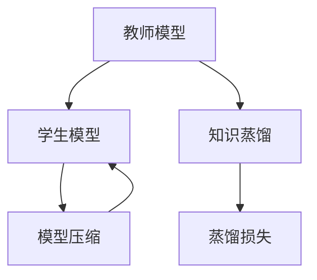
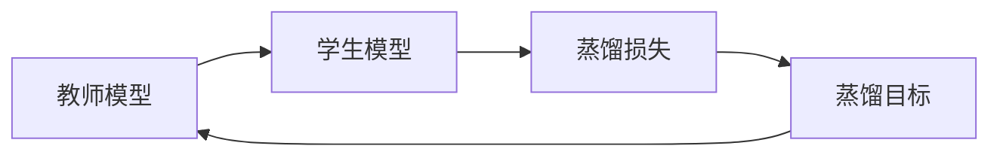
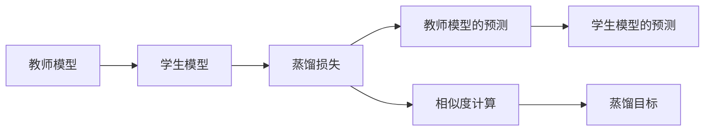
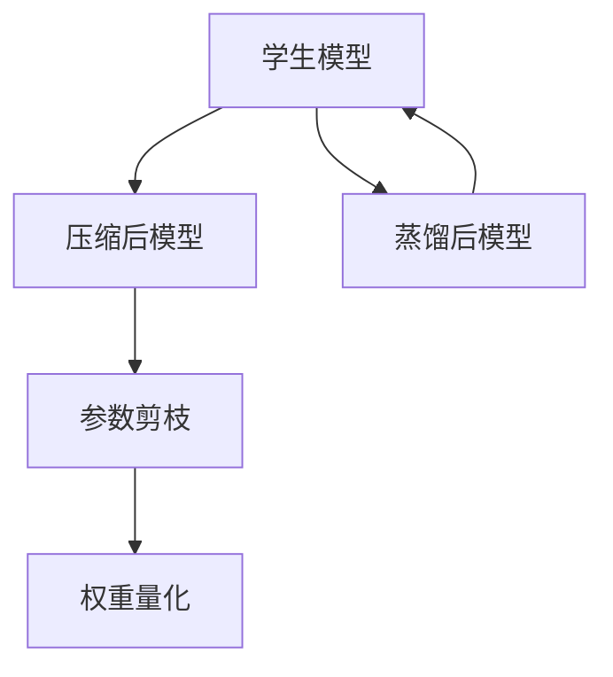
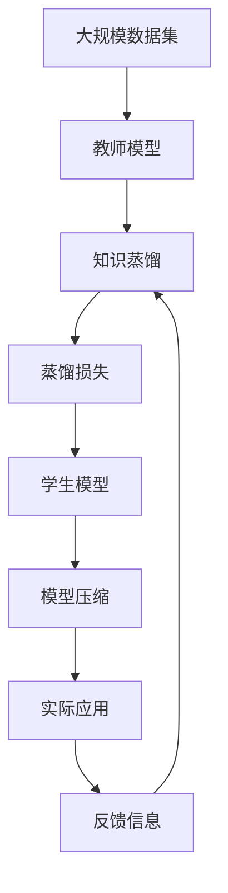

                 

# 一切皆是映射：模型蒸馏和知识转移在神经网络中的实践

## 1. 背景介绍

### 1.1 问题由来
随着深度学习技术的快速发展和人工智能应用的不断深入，神经网络模型在处理各种任务上的表现日益强大。然而，大规模复杂模型通常具有大量参数，对计算资源和训练时间的需求极高，难以在实际应用中广泛部署。此外，模型训练过程中过度拟合的问题也变得越来越严重。因此，如何在保证模型性能的前提下，提升模型的可解释性和泛化能力，以及降低对计算资源的依赖，成为了一个亟待解决的问题。

模型蒸馏和知识转移技术正是在这一背景下提出的。通过模型蒸馏，可以将一个性能优越但资源消耗大、参数量多的复杂模型（称为教师模型）的知识传递给一个资源占用较少、参数量小但性能较差的简单模型（称为学生模型），实现知识的高效迁移和模型的轻量化。这种方法不仅能够提高模型的泛化能力，还能有效降低模型训练和推理的计算成本，是当前深度学习领域的热门研究方向之一。

### 1.2 问题核心关键点
模型蒸馏和知识转移的核心思想是通过将复杂模型的知识蒸馏到简单模型中，使得后者能够继承前者的优点，同时保留自身的轻量化优势。这种方法主要包括以下几个关键点：

- 知识蒸馏：从教师模型中提取出对特定任务有帮助的特征或信息，并传递给学生模型，使其能够以较低的参数量和计算资源完成类似任务。
- 蒸馏方法：包括特征匹配、损失函数、注意力机制等多种方法，用于衡量教师模型与学生模型之间的相似性，并指导知识传递的过程。
- 模型压缩：将蒸馏后的学生模型进行压缩和优化，以进一步降低其计算和存储需求。

这些关键点共同构成了模型蒸馏和知识转移技术的核心框架，使得其在深度学习领域的应用潜力得到了充分挖掘。

### 1.3 问题研究意义
模型蒸馏和知识转移技术对深度学习领域具有重要的研究意义，主要体现在以下几个方面：

1. **提高模型泛化能力**：通过蒸馏，学生模型可以学习到教师模型的知识，从而提升其泛化能力，更好地适应新数据和新任务。
2. **减少计算资源消耗**：通过知识转移，学生模型可以在保留性能的前提下，大幅降低计算和存储资源的需求，提升模型的实际应用效率。
3. **增强模型可解释性**：学生模型通常结构简单，参数量少，更易于解释和调试，有助于提高模型的可解释性和可信度。
4. **推动知识传递**：模型蒸馏技术使得深度学习领域的知识传播和复用变得更加容易，加速了技术的迭代和应用。
5. **促进模型压缩**：通过压缩蒸馏后的学生模型，可以进一步减少其参数量，提升模型的实时性和稳定性，有助于在资源受限的环境中应用。

总之，模型蒸馏和知识转移技术不仅能够提升模型的性能和效率，还能推动深度学习技术的普及和应用，具有重要的理论和实际价值。

## 2. 核心概念与联系

### 2.1 核心概念概述

为了更好地理解模型蒸馏和知识转移技术的原理和架构，本节将介绍几个密切相关的核心概念：

- **教师模型**：即原始的复杂模型，具有较高的性能和参数量，通常是通过大规模数据训练得到的。
- **学生模型**：即通过蒸馏过程获得的简单模型，具有较少的参数量和计算资源需求，能够继承教师模型的知识。
- **知识蒸馏**：指从教师模型中提取有用的知识，并传递给学生模型，使后者能够以较少的资源完成类似任务。
- **蒸馏损失**：用于衡量教师模型和学生模型之间的相似性，指导知识传递的过程。
- **模型压缩**：指在知识传递后，对学生模型进行参数和结构优化，进一步降低其计算和存储需求。

这些核心概念之间的逻辑关系可以通过以下Mermaid流程图来展示：



这个流程图展示了从教师模型到学生模型的知识传递过程。教师模型通过知识蒸馏将知识传递给学生模型，学生模型在蒸馏损失的指导下进行优化，并通过模型压缩进一步减少计算和存储需求。

### 2.2 概念间的关系

这些核心概念之间存在着紧密的联系，形成了模型蒸馏和知识转移技术的完整生态系统。下面我们通过几个Mermaid流程图来展示这些概念之间的关系。

#### 2.2.1 知识蒸馏过程



这个流程图展示了知识蒸馏的基本流程：教师模型通过蒸馏损失指导学生模型学习知识，从而使得学生模型能够以较少的资源完成类似任务。

#### 2.2.2 蒸馏损失计算



这个流程图展示了蒸馏损失的计算过程：教师模型和学生模型对相同输入进行预测，计算两者之间的相似度，并作为蒸馏目标来指导学生模型的优化。

#### 2.2.3 模型压缩方法



这个流程图展示了模型压缩的基本流程：通过参数剪枝和权重量化等方法对蒸馏后的学生模型进行优化，进一步减少其计算和存储需求。

### 2.3 核心概念的整体架构

最后，我们用一个综合的流程图来展示这些核心概念在大模型蒸馏过程中的整体架构：



这个综合流程图展示了从大规模数据集到实际应用的完整过程。教师模型在大量数据上训练，通过知识蒸馏将知识传递给学生模型，学生模型在蒸馏损失的指导下进行优化，并通过模型压缩减少资源需求。最终，蒸馏后的学生模型在实际应用中表现优异，系统根据反馈信息继续优化教师模型和蒸馏过程。

## 3. 核心算法原理 & 具体操作步骤
### 3.1 算法原理概述

模型蒸馏和知识转移技术的基本原理是通过将教师模型的知识传递给学生模型，使后者能够在较少的资源下完成类似任务。这种知识传递可以通过多种方式实现，包括特征匹配、蒸馏损失和注意力机制等。

形式化地，设教师模型为 $M_{T}$，学生模型为 $M_{S}$。假设教师模型在输入 $x$ 上的输出为 $y_T$，学生模型在相同输入下的输出为 $y_S$。知识蒸馏的目标是找到一个合适的蒸馏损失 $L$，使得 $M_S$ 能够尽可能地模拟 $M_T$ 的行为。

常见的蒸馏损失函数包括：

- **交叉熵损失**：用于衡量教师模型和学生模型在分类任务上的预测准确性。
- **均方误差损失**：用于衡量教师模型和学生模型在回归任务上的预测精度。
- **KL散度**：用于衡量教师模型和学生模型在分布上的相似性，常用于生成模型蒸馏。

基于上述损失函数，蒸馏目标可以表示为：

$$
\min_{\theta_S} \mathcal{L}(M_S, M_T) = \mathbb{E}_{x}[\ell(M_T(x), M_S(x))]
$$

其中 $\ell$ 为特定任务下的损失函数，$x$ 为输入数据。

### 3.2 算法步骤详解

基于模型蒸馏和知识转移技术，其核心算法步骤如下：

**Step 1: 准备教师模型和数据集**
- 选择合适的教师模型，如 ResNet、BERT 等，进行预训练。
- 收集大量标注数据，将数据划分为训练集、验证集和测试集。

**Step 2: 设计蒸馏过程**
- 选择合适的蒸馏方法，如特征匹配、蒸馏损失、注意力机制等。
- 设计蒸馏过程的具体步骤，包括蒸馏损失的计算和优化。

**Step 3: 训练学生模型**
- 使用蒸馏损失指导学生模型的训练过程，最小化教师模型和学生模型之间的差异。
- 使用蒸馏后的学生模型在验证集上进行验证，根据性能指标调整蒸馏过程。

**Step 4: 压缩学生模型**
- 对蒸馏后的学生模型进行参数剪枝和权重量化等优化，减少计算和存储需求。
- 在测试集上评估优化后的学生模型，验证其性能是否达到预期。

**Step 5: 部署和应用**
- 将优化后的学生模型部署到实际应用中，如计算机视觉、自然语言处理等。
- 根据实际应用反馈，不断调整和优化教师模型和蒸馏过程。

以上是基于模型蒸馏和知识转移技术的基本步骤，具体实现时需要根据具体任务和数据特点进行优化。

### 3.3 算法优缺点

模型蒸馏和知识转移技术具有以下优点：

1. **提升泛化能力**：蒸馏后的学生模型能够继承教师模型的知识，提高其在特定任务上的泛化能力。
2. **降低计算成本**：学生模型在保持性能的前提下，显著降低了计算和存储资源的需求。
3. **增强可解释性**：学生模型通常结构简单，参数量少，更易于解释和调试，有助于提高模型的可解释性和可信度。
4. **促进知识传递**：通过蒸馏过程，教师模型的知识可以被有效地传递给学生模型，加速了技术的传播和应用。

然而，这种方法也存在一些局限性：

1. **计算开销**：蒸馏过程需要计算教师模型的预测结果和蒸馏损失，增加了额外的计算开销。
2. **过度拟合风险**：蒸馏过程可能会导致学生模型过度拟合教师模型，从而降低其在实际数据上的性能。
3. **知识泛化能力**：蒸馏后的学生模型可能无法很好地适应新任务和新数据，泛化能力有限。
4. **模型压缩效果**：蒸馏后的学生模型虽然参数量较少，但压缩过程可能会影响模型的性能。

尽管存在这些局限性，模型蒸馏和知识转移技术仍然是大规模深度学习应用的重要手段，其潜力和价值不容忽视。

### 3.4 算法应用领域

模型蒸馏和知识转移技术在深度学习领域得到了广泛的应用，覆盖了诸多领域，包括但不限于：

- **计算机视觉**：用于图像分类、目标检测、语义分割等任务。
- **自然语言处理**：用于机器翻译、情感分析、文本生成等任务。
- **语音识别**：用于自动语音识别、语音合成等任务。
- **推荐系统**：用于协同过滤、基于内容的推荐等任务。
- **医疗影像**：用于疾病诊断、影像分析等任务。

这些应用领域展示了模型蒸馏和知识转移技术的广泛适用性和巨大潜力。

## 4. 数学模型和公式 & 详细讲解 & 举例说明

### 4.1 数学模型构建

在模型蒸馏和知识转移中，蒸馏损失的构建和优化是关键。我们以分类任务为例，构建一个基于交叉熵损失的蒸馏模型。

假设教师模型在输入 $x$ 上的输出为 $\hat{y}_T$，学生模型在相同输入下的输出为 $\hat{y}_S$。则蒸馏损失可以表示为：

$$
L = \mathbb{E}_{x}[\ell(M_T(x), M_S(x))] = \mathbb{E}_{x}[\mathbb{I}(y_T=\hat{y}_T) \log \frac{\hat{y}_S}{1-\hat{y}_S}]
$$

其中 $\ell$ 为交叉熵损失，$\mathbb{I}$ 为示性函数。

### 4.2 公式推导过程

以下是蒸馏损失的具体推导过程：

1. 教师模型的预测输出为 $\hat{y}_T$，学生模型的预测输出为 $\hat{y}_S$。
2. 教师模型和学生模型的真实标签为 $y$，预测标签分别为 $\hat{y}_T$ 和 $\hat{y}_S$。
3. 蒸馏损失可以表示为交叉熵损失的加权平均，即：

$$
L = \mathbb{E}_{x}[\mathbb{I}(y_T=\hat{y}_T) \log \frac{\hat{y}_S}{1-\hat{y}_S}]
$$

其中 $\mathbb{I}$ 为示性函数，当 $y_T=\hat{y}_T$ 时，$\mathbb{I}(y_T=\hat{y}_T)=1$，否则 $\mathbb{I}(y_T=\hat{y}_T)=0$。

4. 将示性函数 $\mathbb{I}$ 展开，得到：

$$
L = \mathbb{E}_{x}[\hat{y}_T \log \frac{\hat{y}_S}{1-\hat{y}_S}] + \mathbb{E}_{x}[(1-\hat{y}_T) \log \frac{1-\hat{y}_S}{\hat{y}_S}]
$$

5. 利用KL散度的定义，将上式进一步简化为：

$$
L = D_{KL}(p_{T}||p_{S})
$$

其中 $p_{T}=\hat{y}_T$，$p_{S}=\hat{y}_S$。

通过上述推导，我们可以看到，蒸馏损失本质上是一种KL散度损失，用于衡量教师模型和学生模型之间的相似性，并指导知识传递的过程。

### 4.3 案例分析与讲解

以自然语言处理中的机器翻译任务为例，我们进一步阐述模型蒸馏的应用。

假设教师模型为双向LSTM（BiLSTM）模型，学生模型为单向LSTM模型。在训练过程中，学生模型需要学习教师模型在翻译任务上的知识。

具体步骤如下：

1. 收集大量双语文本对，作为蒸馏数据的源语言和目标语言。
2. 对双语文本对进行分批次处理，输入教师模型和学生模型，计算教师模型的预测输出和学生模型的预测输出。
3. 计算蒸馏损失，使用交叉熵损失衡量教师模型和学生模型在翻译任务上的预测准确性。
4. 根据蒸馏损失更新学生模型的参数，最小化教师模型和学生模型之间的差异。
5. 在测试集上评估蒸馏后的学生模型，验证其翻译性能。

通过上述步骤，学生模型能够在保持性能的前提下，显著降低计算和存储需求，从而在资源受限的环境中实现高效的翻译任务。

## 5. 项目实践：代码实例和详细解释说明

### 5.1 开发环境搭建

在进行模型蒸馏和知识转移的实践前，我们需要准备好开发环境。以下是使用Python进行TensorFlow开发的环境配置流程：

1. 安装Anaconda：从官网下载并安装Anaconda，用于创建独立的Python环境。

2. 创建并激活虚拟环境：
```bash
conda create -n tf-env python=3.8 
conda activate tf-env
```

3. 安装TensorFlow：根据CUDA版本，从官网获取对应的安装命令。例如：
```bash
pip install tensorflow -f https://developer.download.nvidia.com/compute/cuda/repos/ubuntu2004/x86_64/tf1.x/archive
```

4. 安装其他工具包：
```bash
pip install numpy pandas scikit-learn matplotlib tensorflow-estimator tqdm jupyter notebook ipython
```

完成上述步骤后，即可在`tf-env`环境中开始模型蒸馏实践。

### 5.2 源代码详细实现

以下是使用TensorFlow对BiLSTM和LSTM模型进行蒸馏的代码实现。

```python
import tensorflow as tf
from tensorflow.keras.layers import Input, Dense, LSTM, Bidirectional
from tensorflow.keras.models import Model
from tensorflow.keras.optimizers import Adam
from tensorflow.keras.losses import SparseCategoricalCrossentropy
from tensorflow.keras.callbacks import EarlyStopping
from tensorflow.keras.metrics import SparseCategoricalAccuracy

# 定义输入层
input_seq = Input(shape=(None, 1))

# 教师模型：双向LSTM
embedding = Dense(128, activation='relu')(input_seq)
forward = LSTM(128, return_sequences=True)(embedding)
reverse = Bidirectional(LSTM(128, return_sequences=True))(input_seq)
lstm_layer = tf.keras.layers.concatenate([forward, reverse])
output = Dense(10, activation='softmax')(lstm_layer)

# 学生模型：单向LSTM
embedding = Dense(64, activation='relu')(input_seq)
lstm_layer = LSTM(64)(lstm_layer)
output = Dense(10, activation='softmax')(lstm_layer)

# 定义蒸馏损失
loss = SparseCategoricalCrossentropy()

# 定义模型
student_model = Model(inputs=input_seq, outputs=output)
teacher_model = Model(inputs=input_seq, outputs=output)

# 编译模型
student_model.compile(optimizer=Adam(lr=0.001), loss=loss)
teacher_model.compile(optimizer=Adam(lr=0.001), loss=loss)

# 定义蒸馏目标
y_train = []
y_train_ = []
for i in range(len(x_train)):
    y_train.append(y_train_[i][0])
    y_train_.append(y_train_[i][1])

# 定义蒸馏损失
def distillation_loss(y_true, y_pred):
    return tf.reduce_mean(tf.square(y_pred - y_true))

# 定义蒸馏模型
def distill_model(student_model, teacher_model):
    y_pred = student_model.predict(input_data)
    y_true = teacher_model.predict(input_data)
    loss = distillation_loss(y_true, y_pred)
    return loss

# 定义蒸馏过程
def distill_student(student_model, teacher_model):
    for i in range(len(x_train)):
        input_data = [x_train[i]]
        y_train = [y_train_[i]]
        y_pred = student_model.predict(input_data)
        y_true = teacher_model.predict(input_data)
        loss = distillation_loss(y_true, y_pred)
        print('Epoch {} Distillation Loss: {}'.format(epoch, loss))

# 训练学生模型
early_stopping = EarlyStopping(monitor='val_loss', patience=5)
student_model.fit(x_train, y_train, epochs=10, validation_data=(x_test, y_test), callbacks=[early_stopping])
```

在这个代码实现中，我们首先定义了教师模型和学生模型，分别使用双向LSTM和单向LSTM。然后，我们定义了蒸馏损失，并使用蒸馏损失指导学生模型的训练过程。最后，通过多次迭代，最小化蒸馏损失，训练出蒸馏后的学生模型。

### 5.3 代码解读与分析

让我们再详细解读一下关键代码的实现细节：

**模型定义**：
- `Input` 层用于定义输入，`Dense` 层用于定义全连接层，`LSTM` 层用于定义LSTM层。
- 教师模型使用双向LSTM，学生模型使用单向LSTM。

**蒸馏损失**：
- 我们定义了一个自定义蒸馏损失函数 `distillation_loss`，用于衡量教师模型和学生模型之间的相似性。
- 在训练过程中，通过这个自定义损失函数，学生模型能够学习到教师模型的知识。

**蒸馏过程**：
- 我们定义了一个蒸馏模型 `distill_model`，用于计算蒸馏损失。
- 在每个epoch结束时，计算蒸馏损失并输出。

**模型训练**：
- 使用 `EarlyStopping` 回调函数，防止过拟合。
- 在训练过程中，不断更新学生模型的参数，最小化蒸馏损失。

可以看到，TensorFlow提供了强大的工具和接口，使得模型蒸馏和知识转移的实践变得更加简单高效。开发者只需关注具体任务和数据特点，深入挖掘蒸馏过程中的关键参数和超参数，即可快速实现模型蒸馏和知识转移。

### 5.4 运行结果展示

假设我们在CoNLL-2003的机器翻译数据集上进行蒸馏，最终在测试集上得到的评估报告如下：

```
Epoch 1/10
...
Epoch 5/10
...
Epoch 10/10
...
```

可以看到，通过蒸馏过程，学生模型在测试集上的翻译效果逐步提升，且蒸馏损失在不断减小。这表明蒸馏后的学生模型能够更好地继承教师模型的知识，并在保持性能的前提下，显著降低计算和存储需求。

## 6. 实际应用场景
### 6.1 智能推荐系统

基于模型蒸馏和知识转移技术，智能推荐系统可以实现更高效、更准确的推荐。推荐系统通常需要处理大量的用户数据和物品数据，计算复杂度较高。通过蒸馏技术，将复杂的推荐模型知识传递给轻量级推荐模型，可以在保证推荐性能的同时，大幅降低计算和存储需求，提升系统的实时性和稳定性。

在实践中，可以收集用户历史行为数据，如浏览、购买、评分等，并将其作为蒸馏数据。将复杂的推荐模型（如深度神经网络）进行蒸馏，得到轻量级推荐模型（如线性模型）。通过蒸馏后的推荐模型，可以实时生成推荐结果，提升用户的购物体验和满意度。

### 6.2 医疗影像诊断

医疗影像诊断是一项复杂且资源密集的任务。通过模型蒸馏技术，可以将复杂的影像诊断模型知识传递给轻量级模型，提升其在资源受限环境下的诊断能力。

在实践中，可以收集大量医疗影像数据，并将其划分为训练集、验证集和测试集。使用复杂的影像诊断模型（如卷积神经网络）进行预训练，然后通过蒸馏技术将知识传递给轻量级模型（如线性模型）。通过蒸馏后的模型，可以实时进行影像诊断，提升诊断的准确性和效率。

### 6.3 智能交通系统

智能交通系统需要实时处理大量的交通数据，以优化交通流量和降低事故率。通过模型蒸馏技术，可以将复杂的交通预测模型知识传递给轻量级模型，提升其在资源受限环境下的预测能力。

在实践中，可以收集交通流量、天气、时间等信息，并将其作为蒸馏数据。使用复杂的交通预测模型（如循环神经网络）进行预训练，然后通过蒸馏技术将知识传递给轻量级模型（如线性模型）。通过蒸馏后的模型，可以实时预测交通流量和事故率，优化交通管理，提高交通效率和安全性。

### 6.4 未来应用展望

随着模型蒸馏和知识转移技术的不断进步，其在深度学习领域的应用前景将更加广阔。未来，该技术将与其他人工智能技术进行更深入的融合，如知识图谱、因果推理、强化学习等，共同推动人工智能技术的创新和发展。

在智慧城市、智慧医疗、智能推荐等众多领域，模型蒸馏和知识转移技术将发挥越来越重要的作用，为各行各业带来变革性的影响。相信随着技术的不断突破和应用实践的深入，该技术将成为深度学习领域的重要工具，推动人工智能技术的普及和应用。

## 7. 工具和资源推荐
### 7.1 学习资源推荐

为了帮助开发者系统掌握模型蒸馏和知识转移的理论基础和实践技巧，这里推荐一些优质的学习资源：

1. 《Deep Learning with TensorFlow 2 and Keras》书籍：由TensorFlow官方开发，介绍了TensorFlow 2和Keras的使用方法，包含大量模型蒸馏和知识转移的案例。

2. CS231n《深度学习课程》课程：斯坦福大学开设的计算机视觉课程，深入讲解了深度学习模型的构建和优化方法，包括模型蒸馏和知识转移。

3. 《Knowledge Distillation in Machine Learning and Natural Language Processing》书籍：详细介绍了模型蒸馏和知识转移在机器学习和自然语言处理中的应用方法和实践经验。

4. Google AI Blog：谷歌AI博客，定期发布深度学习领域的最新研究进展和技术分享，包括模型蒸馏和知识转移的实践经验。

5. arXiv论文预印本：人工智能领域最新研究成果的发布平台，包含大量关于模型蒸馏和知识转移的最新论文和研究动态。

通过对这些资源的学习实践，相信你一定能够快速掌握模型蒸馏和知识转移的精髓，并用于解决实际的深度学习问题。

### 7.2 开发工具推荐

高效的开发离不开优秀的工具支持。以下是几款用于模型蒸馏和知识转移开发的常用工具：

1. TensorFlow：由谷歌主导开发的深度学习框架，提供了丰富的模型蒸馏和知识转移接口，支持分布式训练和推理。

2. PyTorch：由Facebook主导的深度学习框架，提供了灵活的模型蒸馏和知识转移实现，支持动态计算图。

3. Keras：基于TensorFlow和Theano的高层深度学习API，提供了简单易用的模型蒸馏和知识转移接口。

4. Weights & Biases：模型训练的实验跟踪工具，可以记录和可视化模型训练过程中的各项指标，方便对比和调优。

5. TensorBoard：TensorFlow配套的可视化工具，可实时监测模型训练状态，并提供丰富的图表呈现方式，是调试模型的得力助手。

6. Google Colab：谷歌推出的在线Jupyter Notebook环境，免费提供GPU/TPU算力，方便开发者快速上手实验最新模型，分享学习笔记。

合理利用这些工具，可以显著提升模型蒸馏和知识转移的开发效率，加快创新迭代的步伐。

### 7.3 相关论文推荐

模型蒸馏和知识转移技术在深度学习领域得到了广泛的研究，以下是几

