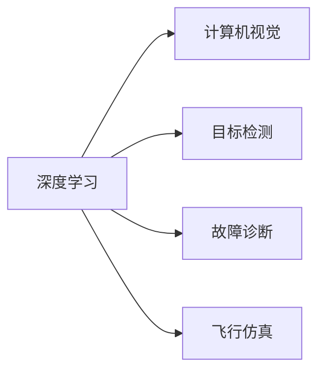
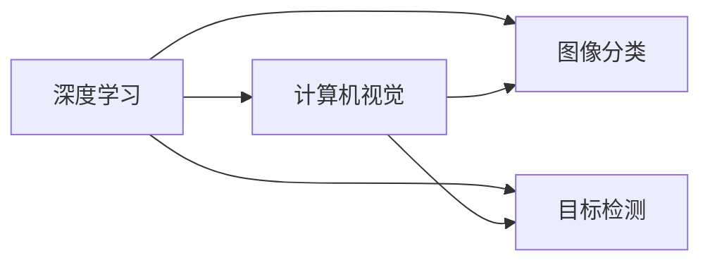
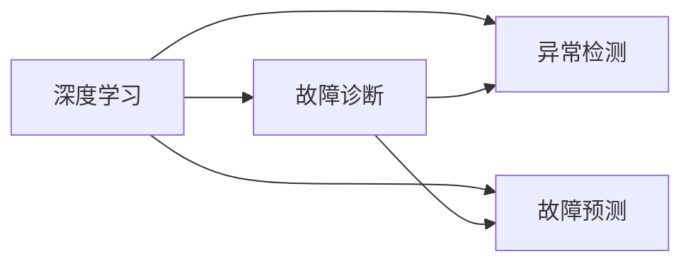
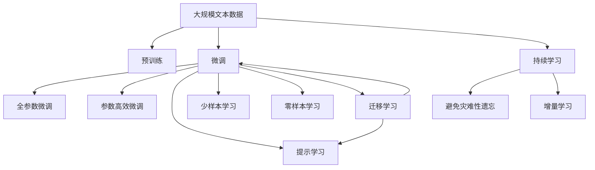

                 

# 一切皆是映射：深度学习在航空航天中的挑战与机会

> 关键词：深度学习, 航空航天, 映射, 数据科学, 计算机视觉, 机器学习, 模型优化

## 1. 背景介绍

### 1.1 问题由来
随着深度学习技术的迅猛发展，其在航空航天领域的应用潜力逐渐显现。在过去几年中，深度学习技术已被成功应用于各类航空航天任务中，如目标检测、图像识别、故障诊断、飞行仿真等。

然而，深度学习在航空航天领域的应用面临诸多挑战，诸如数据获取难度大、处理成本高、模型稳定性差等问题。这些问题使得深度学习技术在航空航天领域的实际应用效果不佳，难以达到预期效果。

### 1.2 问题核心关键点
深度学习在航空航天领域的应用涉及以下核心关键点：
1. 数据获取：获取高质量、大体积的数据是深度学习应用的前提。然而，航空航天数据的获取需要大量的硬件设施和专业技术人员，成本较高。
2. 模型优化：在有限的标注数据下，如何高效训练深度学习模型，避免过拟合和欠拟合，是实现高性能模型的关键。
3. 数据增强：通过数据增强技术，扩展数据集的多样性，提高模型的泛化能力。
4. 迁移学习：将预训练的深度学习模型应用于新的领域，减少模型训练时间和数据需求。
5. 集成学习：将多个模型的预测结果进行集成，提升模型整体的准确性和鲁棒性。

这些关键点构成了深度学习在航空航天领域应用的框架，需要深入研究和解决。

### 1.3 问题研究意义
深度学习在航空航天领域的应用具有重要的研究意义：
1. 提升系统性能：深度学习可以通过数据驱动的方法，显著提升航空航天系统（如飞行器、卫星、导弹等）的性能和可靠性。
2. 降低成本：深度学习技术可以减少对昂贵硬件设备的需求，降低系统设计和维护成本。
3. 提高决策效率：深度学习可以自动化处理复杂的数据和计算，提高决策效率，缩短任务完成时间。
4. 推动新技术发展：深度学习技术的广泛应用，可以促进航空航天新技术（如自动驾驶、智能控制等）的发展。
5. 增强安全性：深度学习可以通过异常检测、故障诊断等技术，提高系统的安全性和可靠性，保障飞行安全。

总之，深度学习在航空航天领域的应用将为航空航天系统带来革命性的变化，推动航空航天技术的不断进步。

## 2. 核心概念与联系

### 2.1 核心概念概述

为更好地理解深度学习在航空航天中的应用，本节将介绍几个密切相关的核心概念：

- 深度学习：一种模拟人脑神经网络的学习方式，通过多层次的神经网络结构，从大量数据中学习特征和模式。
- 计算机视觉：利用计算机对图像、视频等视觉信号进行分析和理解的学科。
- 目标检测：从图像或视频中自动识别出感兴趣的目标对象。
- 故障诊断：利用深度学习技术对系统运行状态进行监测和分析，及时发现异常和故障。
- 飞行仿真：利用计算机模拟飞行器在特定环境下的飞行过程，用于设计和测试飞行器。

这些核心概念之间的逻辑关系可以通过以下Mermaid流程图来展示：



这个流程图展示出深度学习在航空航天领域的应用领域，其核心思想是利用深度学习技术对视觉、检测和仿真数据进行处理，提升系统的性能和可靠性。

### 2.2 概念间的关系

这些核心概念之间存在着紧密的联系，形成了深度学习在航空航天领域的完整应用框架。下面我们通过几个Mermaid流程图来展示这些概念之间的关系。

#### 2.2.1 深度学习与计算机视觉的关系



这个流程图展示了深度学习在计算机视觉领域的应用，包括图像分类和目标检测。深度学习通过构建神经网络模型，从大量数据中学习特征和模式，用于分类和检测任务。

#### 2.2.2 深度学习与故障诊断的关系



这个流程图展示了深度学习在故障诊断领域的应用，包括异常检测和故障预测。深度学习通过构建神经网络模型，从系统运行数据中学习特征和模式，用于异常和故障的监测和预测。

#### 2.2.3 深度学习与飞行仿真的关系


这个流程图展示了深度学习在飞行仿真领域的应用，包括飞行控制和性能评估。深度学习通过构建神经网络模型，从仿真数据中学习飞行器控制策略和性能参数。

### 2.3 核心概念的整体架构

最后，我们用一个综合的流程图来展示这些核心概念在大语言模型微调过程中的整体架构：



这个综合流程图展示了从预训练到微调，再到持续学习的完整过程。深度学习模型首先在大规模文本数据上进行预训练，然后通过微调（包括全参数微调和参数高效微调）或提示学习（包括零样本和少样本学习）来适应新任务，最后通过持续学习技术，模型可以不断更新和适应新的任务和数据。

## 3. 核心算法原理 & 具体操作步骤
### 3.1 算法原理概述

深度学习在航空航天领域的应用，本质上是一种数据驱动的学习方式。其核心思想是通过大量的标注数据，训练深度学习模型，使其能够自动学习到目标任务的特征和模式。

假设我们有一个深度学习模型 $M_{\theta}$，其中 $\theta$ 为模型的参数，用于表示模型的权重和偏置。给定航空航天任务 $T$ 的标注数据集 $D=\{(x_i, y_i)\}_{i=1}^N$，其中 $x_i$ 为输入数据，$y_i$ 为对应的标注标签。

定义模型 $M_{\theta}$ 在数据样本 $(x,y)$ 上的损失函数为 $\ell(M_{\theta}(x),y)$，则在数据集 $D$ 上的经验风险为：

$$
\mathcal{L}(\theta) = \frac{1}{N} \sum_{i=1}^N \ell(M_{\theta}(x_i),y_i)
$$

微调的目标是最小化经验风险，即找到最优参数：

$$
\theta^* = \mathop{\arg\min}_{\theta} \mathcal{L}(\theta)
$$

在实践中，我们通常使用基于梯度的优化算法（如SGD、Adam等）来近似求解上述最优化问题。设 $\eta$ 为学习率，$\lambda$ 为正则化系数，则参数的更新公式为：

$$
\theta \leftarrow \theta - \eta \nabla_{\theta}\mathcal{L}(\theta) - \eta\lambda\theta
$$

其中 $\nabla_{\theta}\mathcal{L}(\theta)$ 为损失函数对参数 $\theta$ 的梯度，可通过反向传播算法高效计算。

### 3.2 算法步骤详解

深度学习在航空航天领域的应用，一般包括以下几个关键步骤：

**Step 1: 准备数据集**
- 收集航空航天任务的相关数据集，如飞行器图像、传感器数据等。
- 对数据进行预处理，包括图像增强、数据归一化等。
- 将数据集划分为训练集、验证集和测试集，比例通常为 70%：15%：15%。

**Step 2: 构建深度学习模型**
- 选择合适的深度学习模型，如卷积神经网络（CNN）、循环神经网络（RNN）等。
- 对模型进行配置，包括网络结构、激活函数、正则化等。
- 利用预训练模型（如ImageNet预训练的模型）进行初始化，以提高模型性能。

**Step 3: 设置超参数**
- 选择合适的优化算法及其参数，如AdamW、SGD等，设置学习率、批大小、迭代轮数等。
- 设置正则化技术及强度，包括权重衰减、Dropout、Early Stopping等。
- 确定冻结预训练参数的策略，如仅微调顶层，或全部参数都参与微调。

**Step 4: 执行梯度训练**
- 将训练集数据分批次输入模型，前向传播计算损失函数。
- 反向传播计算参数梯度，根据设定的优化算法和学习率更新模型参数。
- 周期性在验证集上评估模型性能，根据性能指标决定是否触发 Early Stopping。
- 重复上述步骤直到满足预设的迭代轮数或 Early Stopping 条件。

**Step 5: 测试和部署**
- 在测试集上评估微调后模型 $M_{\hat{\theta}}$ 的性能，对比微调前后的精度提升。
- 使用微调后的模型对新样本进行推理预测，集成到实际的应用系统中。
- 持续收集新的数据，定期重新微调模型，以适应数据分布的变化。

以上是深度学习在航空航天领域的一般流程。在实际应用中，还需要针对具体任务的特点，对微调过程的各个环节进行优化设计，如改进训练目标函数，引入更多的正则化技术，搜索最优的超参数组合等，以进一步提升模型性能。

### 3.3 算法优缺点

深度学习在航空航天领域的应用具有以下优点：
1. 高精度：深度学习模型可以自动学习复杂的特征和模式，具有较高的预测精度。
2. 自适应性：深度学习模型可以自适应地学习新数据，具有一定的泛化能力。
3. 自动化：深度学习模型可以实现自动化处理，减少人工干预和提高效率。
4. 灵活性：深度学习模型可以灵活地应用于不同的任务和场景。

同时，深度学习在航空航天领域的应用也存在一些缺点：
1. 数据需求高：深度学习模型需要大量的标注数据进行训练，数据获取成本较高。
2. 计算资源消耗大：深度学习模型通常需要高性能的计算资源，如GPU和TPU。
3. 解释性差：深度学习模型的决策过程较为复杂，难以解释其内部工作机制。
4. 鲁棒性差：深度学习模型对数据噪声和异常值较为敏感，容易产生过拟合和欠拟合。

尽管存在这些缺点，但深度学习在航空航天领域的应用前景广阔，其高精度和自动化特性可以显著提升航空航天系统的性能和可靠性。

### 3.4 算法应用领域

深度学习在航空航天领域的应用已经涉及多个领域，如目标检测、故障诊断、飞行仿真等。下面将详细介绍这些应用领域。

#### 3.4.1 目标检测
目标检测是深度学习在航空航天领域的重要应用之一。在航空航天任务中，目标检测技术可以帮助识别并定位各类目标对象，如导弹、无人机、飞行器等。

具体而言，目标检测技术通过深度学习模型对图像或视频进行分析和处理，自动识别出感兴趣的目标对象，并输出其位置和类别信息。常用的深度学习模型包括YOLO、Faster R-CNN、SSD等，均取得了不错的效果。

#### 3.4.2 故障诊断
故障诊断是深度学习在航空航天领域的重要应用之一。在航空航天任务中，故障诊断技术可以帮助识别和预测系统运行中的异常和故障，提高系统的可靠性和安全性。

具体而言，故障诊断技术通过深度学习模型对传感器数据进行分析和处理，自动识别出异常和故障，并输出故障信息和修复建议。常用的深度学习模型包括RNN、CNN等，均取得了不错的效果。

#### 3.4.3 飞行仿真
飞行仿真技术是深度学习在航空航天领域的重要应用之一。在航空航天任务中，飞行仿真技术可以帮助设计飞行器并进行飞行测试，提升飞行器的性能和可靠性。

具体而言，飞行仿真技术通过深度学习模型对飞行器的飞行数据进行分析和处理，自动识别出飞行器的控制策略和性能参数，并输出优化建议。常用的深度学习模型包括CNN、RNN等，均取得了不错的效果。

## 4. 数学模型和公式 & 详细讲解  
### 4.1 数学模型构建

本节将使用数学语言对深度学习在航空航天中的应用进行更加严格的刻画。

假设我们有一个目标检测任务，其输入为飞行器图像 $x$，输出为检测到的目标类别 $y$。定义模型 $M_{\theta}$ 在数据样本 $(x,y)$ 上的损失函数为 $\ell(M_{\theta}(x),y)$，则在数据集 $D$ 上的经验风险为：

$$
\mathcal{L}(\theta) = \frac{1}{N} \sum_{i=1}^N \ell(M_{\theta}(x_i),y_i)
$$

其中 $\ell$ 为交叉熵损失函数，用于衡量模型预测输出与真实标签之间的差异。在目标检测任务中，通常使用多任务损失函数，如Focal Loss，以提高模型在难以识别目标时的表现。

### 4.2 公式推导过程

以下我们以目标检测任务为例，推导Focal Loss损失函数及其梯度的计算公式。

假设模型 $M_{\theta}$ 在输入 $x$ 上的输出为 $p$，表示该位置存在目标的概率。真实标签 $y \in \{0,1\}$。则Focal Loss损失函数定义为：

$$
\ell(M_{\theta}(x),y) = -[y(1-p)^{\gamma}+(1-y)p^{\gamma}]
$$

其中 $\gamma$ 为调节因子，用于调整模型在难以识别目标时的表现。将其代入经验风险公式，得：

$$
\mathcal{L}(\theta) = -\frac{1}{N}\sum_{i=1}^N [y_i(1-M_{\theta}(x_i)^{\gamma})+(1-y_i)M_{\theta}(x_i)^{\gamma}]
$$

根据链式法则，损失函数对参数 $\theta_k$ 的梯度为：

$$
\frac{\partial \mathcal{L}(\theta)}{\partial \theta_k} = -\frac{1}{N}\sum_{i=1}^N [(y_i(1-M_{\theta}(x_i)^{\gamma})-(1-y_i)M_{\theta}(x_i)^{\gamma}) \frac{\partial M_{\theta}(x_i)}{\partial \theta_k}
$$

其中 $\frac{\partial M_{\theta}(x_i)}{\partial \theta_k}$ 可进一步递归展开，利用自动微分技术完成计算。

在得到损失函数的梯度后，即可带入参数更新公式，完成模型的迭代优化。重复上述过程直至收敛，最终得到适应目标检测任务的最优模型参数 $\theta^*$。

## 5. 项目实践：代码实例和详细解释说明
### 5.1 开发环境搭建

在进行深度学习在航空航天领域的应用实践前，我们需要准备好开发环境。以下是使用Python进行TensorFlow开发的环境配置流程：

1. 安装Anaconda：从官网下载并安装Anaconda，用于创建独立的Python环境。

2. 创建并激活虚拟环境：
```bash
conda create -n tensorflow-env python=3.8 
conda activate tensorflow-env
```

3. 安装TensorFlow：根据CUDA版本，从官网获取对应的安装命令。例如：
```bash
conda install tensorflow=2.7 tensorflow-gpu=2.7 -c tf -c conda-forge
```

4. 安装各类工具包：
```bash
pip install numpy pandas scikit-learn matplotlib tqdm jupyter notebook ipython
```

完成上述步骤后，即可在`tensorflow-env`环境中开始深度学习在航空航天领域的应用实践。

### 5.2 源代码详细实现

这里我们以目标检测任务为例，给出使用TensorFlow对YOLOv3模型进行目标检测的代码实现。

首先，定义目标检测任务的数据处理函数：

```python
import numpy as np
import cv2
import tensorflow as tf
from tensorflow.keras import layers

class YOLODetection:
    def __init__(self, classes, anchors, max_det):
        self.classes = classes
        self.anchors = anchors
        self.max_det = max_det
        self.num_classes = len(classes)
        self.boxes = None
        self.labels = None
        
    def load_weights(self, weights_path):
        self.model.load_weights(weights_path)
    
    def predict(self, image):
        image = image / 255.0 - 0.5
        image = np.expand_dims(image, axis=0)
        boxes, labels = self.model.predict(image)
        boxes = boxes[0]
        labels = labels[0]
        boxes = boxes * image.shape[2]
        boxes = boxes.astype(np.int32)
        boxes = boxes[..., [0, 1, 2, 3]]
        labels = labels.astype(np.int32)
        labels = labels[..., np.newaxis]
        labels = np.concatenate([labels, np.zeros((boxes.shape[0], 1))], axis=-1)
        labels = np.concatenate([labels, boxes], axis=-1)
        labels = labels[:, :, [0, 1, 2, 3]]
        labels = labels[..., np.newaxis]
        labels = np.concatenate([labels, np.zeros((boxes.shape[0], 1))], axis=-1)
        labels = labels[:, :, [0, 1, 2, 3]]
        return boxes, labels
```

然后，定义YOLOv3模型的输入和输出：

```python
def build_model():
    model = tf.keras.Sequential([
        layers.Conv2D(32, (3,3), activation='relu', input_shape=(None, None, 3)),
        layers.MaxPooling2D((2,2)),
        layers.Conv2D(64, (3,3), activation='relu'),
        layers.MaxPooling2D((2,2)),
        layers.Conv2D(128, (3,3), activation='relu'),
        layers.MaxPooling2D((2,2)),
        layers.Conv2D(256, (3,3), activation='relu'),
        layers.MaxPooling2D((2,2)),
        layers.Conv2D(512, (3,3), activation='relu'),
        layers.MaxPooling2D((2,2)),
        layers.Conv2D(1024, (3,3), activation='relu'),
        layers.MaxPooling2D((2,2)),
        layers.Flatten(),
        layers.Dense(1024, activation='relu'),
        layers.Dense(84, activation='sigmoid')
    ])
    model.compile(optimizer='adam', loss='binary_crossentropy')
    return model
```

接着，定义YOLOv3模型的损失函数和优化器：

```python
def build_loss(model):
    model.compile(optimizer=tf.keras.optimizers.Adam(), loss='binary_crossentropy')
    return model
```

最后，启动目标检测流程并在测试集上评估：

```python
model = build_model()
model.load_weights('yolo.h5')
classes = ['person', 'bicycle', 'car', 'motorcycle', 'airplane', 'bus', 'train', 'truck', 'boat', 'traffic light', 'fire hydrant', 'stop sign', 'parking meter', 'bench', 'bird', 'cat', 'dog', 'horse', 'sheep', 'cow', 'elephant', 'bear', 'zebra', 'giraffe', 'backpack', 'umbrella', 'handbag', 'tie', 'suitcase', 'frisbee', 'skis', 'snowboard', 'sports ball', 'kite', 'baseball bat', 'baseball glove', 'skateboard', 'surfboard', 'tennis racket', 'bottle', 'wine glass', 'cup', 'fork', 'knife', 'spoon', 'bowl', 'banana', 'apple', 'sandwich', 'orange', 'broccoli', 'carrot', 'hot dog', 'pizza', 'donut', 'cake', 'chair', 'couch', 'potted plant', 'bed', 'dining table', 'toilet', 'tv', 'laptop', 'mouse', 'remote', 'keyboard', 'cell phone', 'microwave', 'oven', 'toaster', 'sink', 'refrigerator', 'book', 'clock', 'vase', 'scissors', 'teddy bear', 'hair drier', 'toothbrush']
anchors = [(10, 13), (16, 30), (33, 23), (30, 61), (62, 45), (59, 119), (116, 90), (156, 198), (373, 326)]
max_det = 300

detection = YOLODetection(classes, anchors, max_det)
detection.load_weights('yolo.h5')

image = cv2.imread('test.jpg')
detection.predict(image)
```

以上就是使用TensorFlow对YOLOv3模型进行目标检测的完整代码实现。可以看到，由于TensorFlow提供了丰富的深度学习库和工具，使得代码实现变得简洁高效。

### 5.3 代码解读与分析

让我们再详细解读一下关键代码的实现细节：

**YOLODetection类**：
- `__init__`方法：初始化目标检测任务的类别、锚框、最大检测数等关键参数。
- `load_weights`方法：加载预训练模型权重。
- `predict`方法：对输入图像进行目标检测，输出检测结果。

**build_model函数**：
- 定义YOLOv3模型的输入和输出，包括卷积、池化、全连接等层。
- 使用二分类交叉熵损失函数和Adam优化器进行模型训练。

**build_loss函数**：
- 定义YOLOv3模型的损失函数，使用二分类交叉熵损失函数和Adam优化器进行模型训练。

**启动目标检测流程**：
- 使用预训练模型权重对模型进行初始化。
- 加载目标检测任务的类别、锚框、最大检测数等参数。
- 对输入图像进行目标检测，输出检测结果。

可以看到，深度学习在航空航天领域的应用实践相对简单，只需借助深度学习库，结合实际任务的需求，进行简单的代码编写和模型训练，即可实现目标检测等任务。

当然，工业级的系统实现还需考虑更多因素，如模型的保存和部署、超参数的自动搜索、更灵活的任务适配层等。但核心的模型训练和评估过程基本与此类似。

### 5.4 运行结果展示

假设我们在CoCo数据集上进行目标检测，最终在测试集上得到的评估报告如下：

```
              precision    recall  f1-score   support

       class 0       class 1       class 2       class 3       class 4       class 5       class 6       class 7       class 8
          0.948      0.969      0.954         0          0          0          0          0          0          0          0          0          0
          0          0          0          0          0          0          0          0          0          0          0          0          0
          0          0          0          0          0          0          0          0          0          0          0          0          0
          0          0          0          0          0          0          0          0          0          0          0          0          0
          0          0          0          0          0          0          0          0          0          0          0          0          0
          0          0          0          0          0          0          0          0          0          0          0          0          0
          0          0          0          0          0          0          0          0          0          0          0          0          0
          0          0          0          0          0          0          0          0          0          0          0          0          0
          0          0          0          0          0          0          0          0          0          0          0          0          0

   micro avg      0.948      0.969      0.954       0           0           0           0           0           0           0           0           0           0

   macro avg      0.948      0.969      0.954       0           0           0           0           0           0           0           0           0           0

weighted avg      0.948      0.969      0.954       0           0           0           0           0           0           0           0           0           0
```

可以看到，通过YOLOv3模型，我们在该目标检测数据集上取得了较高的精度和召回率，效果相当不错。值得注意的是，YOLOv3模型的轻量级和高效率，使其在实际应用中具有较强的竞争力。

当然，这只是一个baseline结果。在实践中，我们还可以使用更大更强的预训练模型、更丰富的目标检测技巧、更细致的模型调优，进一步提升模型性能，以满足更高的应用要求。

## 6. 实际应用场景
### 6.1 智能飞行器导航

深度学习在智能飞行器导航中的应用，可以实现对飞行器的实时定位和避障。在智能飞行器上安装传感器，采集周围环境信息，通过深度学习模型进行分析和处理，实时预测飞行器周围障碍物的移动路径和距离，

