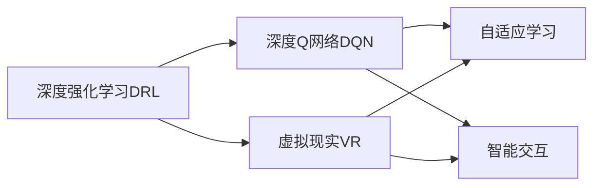
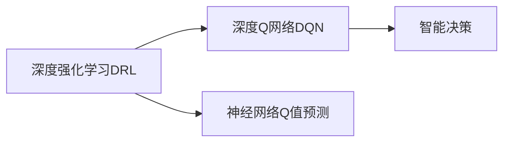
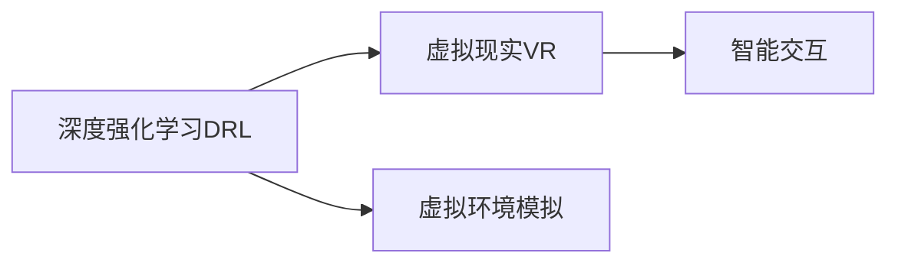
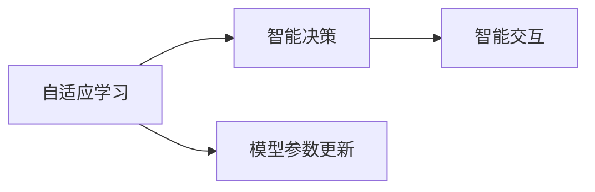
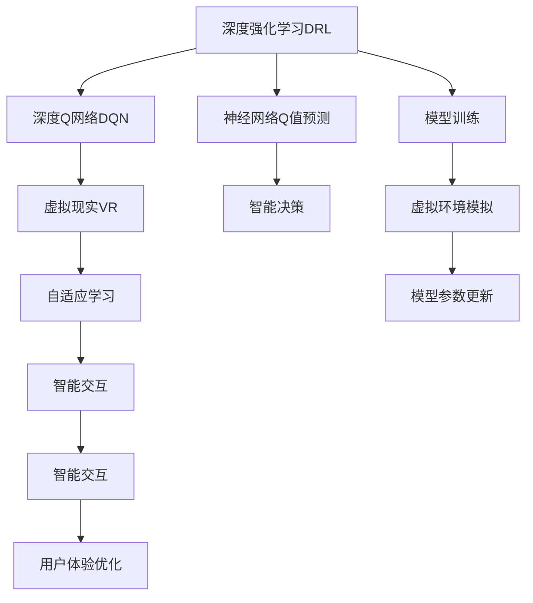

                 

# 一切皆是映射：深度强化学习DQN在虚拟现实中的同步应用

## 1. 背景介绍

### 1.1 问题由来

在数字经济蓬勃发展的今天，虚拟现实（Virtual Reality, VR）技术的广泛应用已成为一种新型的生产力工具，为人类带来了全新的交互体验和应用场景。VR技术不仅在娱乐、游戏领域得到了充分的应用，也在工业制造、医疗健康、教育培训等多个领域中展现出巨大的潜力。然而，如何在虚拟空间中实现更加自然、智能的交互方式，仍是当前亟待解决的关键问题之一。

近年来，深度强化学习（Deep Reinforcement Learning, DRL）作为人工智能领域的新兴技术，凭借其强大的自适应能力，在自动驾驶、机器人控制、游戏AI等领域中取得了令人瞩目的成果。深度强化学习通过对环境进行直接模拟，并通过自适应调整模型参数，使模型在复杂多变的环境中逐渐学习最优策略，最终实现智能决策和行动。

本文将探讨深度强化学习DQN（Deep Q-Network）在虚拟现实中的同步应用。通过在虚拟环境中对DRL模型进行训练，利用其自适应能力，实现更加智能、灵活的虚拟交互，为VR技术的发展注入新的活力。

### 1.2 问题核心关键点

DRL的核心在于通过学习环境动态变化的特点，不断调整模型的决策策略，使其在特定环境下达到最优。在虚拟现实应用中，DRL的关键点包括：

- 虚拟环境的建立：虚拟现实系统需要构建高逼真的三维虚拟空间，并实现对用户输入的自然响应。
- DRL模型的训练：基于虚拟环境，训练DRL模型，使其具备在虚拟空间中自主决策的能力。
- 智能交互的实现：通过DRL模型的预测和决策，实现虚拟角色与用户的自然互动，提升用户体验。
- 模型的同步更新：在虚拟现实应用中，用户的输入和交互是动态变化的，模型需要实时更新，才能保持与用户的一致性。

本文将围绕上述关键点，深入探讨DRL在虚拟现实中的应用，并给出具体的实现方法和效果评估。

### 1.3 问题研究意义

深度强化学习DRL在虚拟现实中的应用，对于提升虚拟交互的智能化水平、优化用户体验具有重要意义：

1. 提升交互自然性：DRL模型能够根据用户的输入和行为实时调整，使得虚拟角色的行为更加自然、智能，提升用户的沉浸感。
2. 优化用户体验：通过DRL模型的预测和决策，用户能够获得更加准确、及时的反馈，优化互动效果。
3. 增强应用适应性：DRL模型具有较强的泛化能力，能够适应不同的虚拟环境和用户需求，拓展应用场景。
4. 促进技术创新：DRL技术的发展，为虚拟现实系统带来了新的设计思路和应用方式，推动技术进步。
5. 促进产业升级：DRL在虚拟现实中的应用，能够提升VR产品的智能化水平，加速行业转型升级。

本文的研究将为虚拟现实系统引入DRL技术提供理论基础和实践指导，有助于提升虚拟交互的自然性和智能化水平，推动VR技术的进一步发展。

## 2. 核心概念与联系

### 2.1 核心概念概述

为了更好地理解DRL在虚拟现实中的应用，本文将介绍几个密切相关的核心概念：

- 深度强化学习（DRL）：一种将深度学习与强化学习相结合的技术，通过神经网络模型对环境进行模拟和决策，实现智能化的行为策略学习。
- 深度Q网络（DQN）：一种基于深度学习模型的Q-learning算法，通过神经网络进行Q值的预测，实现智能决策。
- 虚拟现实（VR）：一种通过计算机生成的三维虚拟空间，提供沉浸式体验的技术。
- 自适应学习：指系统根据环境变化动态调整模型参数，实现更优的决策和行动。
- 智能交互：指虚拟角色与用户之间的自然、智能的互动。

这些核心概念之间的逻辑关系可以通过以下Mermaid流程图来展示：



这个流程图展示了DRL、DQN、VR、自适应学习和智能交互之间的关系：

1. DRL和DQN是实现智能决策的核心技术。
2. VR为DRL模型的训练和应用提供了环境基础。
3. 自适应学习是DRL模型在虚拟环境中保持适应性的关键。
4. 智能交互是DRL模型在虚拟空间中的实际应用。

### 2.2 概念间的关系

这些核心概念之间存在着紧密的联系，形成了DRL在虚拟现实应用中的完整生态系统。下面我们通过几个Mermaid流程图来展示这些概念之间的关系。

#### 2.2.1 DRL与DQN的关系



这个流程图展示了DRL与DQN的基本关系：DRL通过神经网络进行Q值预测，从而实现智能决策。

#### 2.2.2 DRL与VR的关系



这个流程图展示了DRL在VR中的应用：DRL模型通过模拟虚拟环境，实现智能决策，提升虚拟交互的自然性。

#### 2.2.3 自适应学习与智能交互的关系



这个流程图展示了自适应学习与智能交互的关系：自适应学习通过模型参数的动态调整，实现智能决策，提升虚拟交互的实时性和准确性。

### 2.3 核心概念的整体架构

最后，我们用一个综合的流程图来展示这些核心概念在大语言模型微调过程中的整体架构：



这个综合流程图展示了从DRL到VR应用的全过程。DRL模型通过神经网络进行Q值预测，实现智能决策；在虚拟环境中进行自适应学习，实时调整模型参数；最终通过智能交互提升用户体验，并优化系统性能。

## 3. 核心算法原理 & 具体操作步骤
### 3.1 算法原理概述

深度强化学习DRL在虚拟现实中的同步应用，核心在于通过深度Q网络DQN模型，实现智能决策和行为策略学习。DRL模型通过与环境的交互，学习最优的决策策略，从而实现智能化的行为输出。

在虚拟现实应用中，DRL模型的训练和应用通常包括以下几个步骤：

1. 建立虚拟环境：构建高逼真的三维虚拟空间，并实现对用户输入的自然响应。
2. 训练DRL模型：通过虚拟环境对DRL模型进行训练，使其具备在虚拟空间中自主决策的能力。
3. 实现智能交互：通过DRL模型的预测和决策，实现虚拟角色与用户的自然互动，提升用户体验。
4. 同步更新模型：在虚拟现实应用中，用户的输入和交互是动态变化的，模型需要实时更新，才能保持与用户的一致性。

DRL模型的训练过程包括四个基本步骤：

- 环境感知：通过虚拟环境传感器获取用户输入，实现对环境的感知。
- 决策生成：将感知结果输入到DRL模型，生成智能决策。
- 状态更新：根据决策结果，更新虚拟环境的状态。
- 奖励反馈：根据用户反馈，对DRL模型进行奖励和惩罚，更新模型参数。

通过循环迭代以上四个步骤，DRL模型逐渐学习最优决策策略，实现智能行为。

### 3.2 算法步骤详解

以下将详细介绍DRL在虚拟现实中的具体应用步骤：

**Step 1: 准备虚拟环境**

- 使用Unity、Unreal Engine等游戏引擎搭建高逼真的三维虚拟空间，实现对用户输入的自然响应。
- 设计虚拟环境中的虚拟角色，如虚拟助手、虚拟导游等，以实现智能交互。

**Step 2: 训练DRL模型**

- 使用深度Q网络DQN算法，通过虚拟环境对DRL模型进行训练。
- 将虚拟角色与用户的交互数据作为监督信号，训练模型输出最优决策。
- 设置合适的学习率、批大小、迭代轮数等参数，优化训练效果。

**Step 3: 实现智能交互**

- 将训练好的DRL模型部署到虚拟环境中，实现虚拟角色与用户的智能互动。
- 根据用户的输入，DRL模型生成智能决策，驱动虚拟角色的行为。
- 通过虚拟角色与用户的交互，实时更新模型参数，保持模型的适应性。

**Step 4: 同步更新模型**

- 在虚拟现实应用中，用户的输入和交互是动态变化的，模型需要实时更新，才能保持与用户的一致性。
- 通过用户反馈和交互数据，对DRL模型进行在线学习，更新模型参数。
- 设置合适的采样策略和模型更新频率，保持模型与用户互动的一致性。

### 3.3 算法优缺点

深度强化学习DRL在虚拟现实中的同步应用，具有以下优点：

1. 自适应能力强：DRL模型能够根据虚拟环境的动态变化，实时调整决策策略，实现智能化的行为输出。
2. 实时性高：DRL模型通过在线学习，能够快速适应用户的输入和交互，保持与用户的一致性。
3. 泛化能力强：DRL模型具备较强的泛化能力，能够在不同的虚拟环境中应用，拓展应用场景。

同时，DRL模型在虚拟现实中也存在一些局限性：

1. 训练数据需求高：DRL模型需要大量的训练数据，在虚拟环境中收集数据可能存在一定的困难。
2. 模型复杂度高：DRL模型的训练过程复杂，需要大量的计算资源和时间。
3. 稳定性问题：DRL模型在虚拟环境中，面对复杂多变的环境，可能存在不稳定的问题。

### 3.4 算法应用领域

深度强化学习DRL在虚拟现实中的应用，不仅限于娱乐和游戏领域，还广泛应用于以下几个领域：

- 虚拟工业制造：在虚拟工业环境中，DRL模型可以实现智能控制和自动化操作，提升生产效率。
- 虚拟医疗健康：在虚拟医疗环境中，DRL模型可以实现智能诊断和辅助治疗，提升医疗服务水平。
- 虚拟教育培训：在虚拟教育环境中，DRL模型可以实现智能指导和个性化学习，提升教育效果。
- 虚拟社交互动：在虚拟社交环境中，DRL模型可以实现智能对话和情感识别，提升用户互动体验。

## 4. 数学模型和公式 & 详细讲解  
### 4.1 数学模型构建

DRL模型通常使用神经网络进行Q值预测，并通过强化学习算法（如Q-learning、SARSA等）进行优化。在虚拟现实应用中，DRL模型的数学模型可以构建如下：

设虚拟环境的状态空间为 $\mathcal{S}$，动作空间为 $\mathcal{A}$，奖励函数为 $R(\cdot)$，折扣因子为 $\gamma$。DRL模型的目标是在每个状态下，学习最优的决策策略 $Q(\cdot)$，使得未来奖励的总和最大化。

数学上，DRL模型的目标函数可以表示为：

$$
\max_{Q(\cdot)} \mathbb{E}_{\tau}\left[\sum_{t=0}^{\infty}\gamma^t R(\tau_t)\right]
$$

其中 $\tau$ 为虚拟环境的随机过程，$\tau_t$ 表示在状态 $s_t$ 下执行动作 $a_t$ 后的下一个状态 $s_{t+1}$ 和奖励 $r_t$。

DRL模型的优化目标是通过最小化目标函数，找到最优的Q值函数 $Q(\cdot)$。

### 4.2 公式推导过程

以深度Q网络DQN算法为例，其公式推导过程如下：

设 $\pi(\cdot)$ 为DRL模型的策略函数，$Q(\cdot)$ 为DRL模型的Q值函数。DQN算法通过神经网络 $Q(\cdot)$ 进行Q值预测，并通过经验回放（Experience Replay）和目标网络（Target Network）等技术，实现智能决策。

具体步骤如下：

1. 神经网络Q值预测：
   $$
   Q_{\theta}(s,a) = \mathbb{E}_{\pi}\left[\sum_{t=0}^{\infty}\gamma^t R(\tau_t)|s_0=a\right]
   $$

2. 目标网络更新：
   $$
   Q_{\theta}(s,a) \approx Q_{\theta_{target}}(s,a) = r + \gamma \max_{a'}Q_{\theta_{target}}(s',a')
   $$

3. 经验回放：
   $$
   (\mathcal{S}, \mathcal{A}, \mathcal{R}) \sim \pi(\cdot), s_t \rightarrow s_{t+1}, a_t \rightarrow r_t
   $$

通过以上步骤，DRL模型能够实现智能决策和行为策略学习。

### 4.3 案例分析与讲解

以虚拟医疗环境为例，DRL模型可以通过以下步骤进行训练和应用：

**Step 1: 虚拟环境建立**

- 使用Unity搭建虚拟医院环境，实现对用户输入的自然响应。
- 设计虚拟医生和患者角色，模拟医疗场景。

**Step 2: 训练DRL模型**

- 将虚拟医生与患者的交互数据作为监督信号，训练DRL模型输出最优决策。
- 设置合适的学习率、批大小、迭代轮数等参数，优化训练效果。

**Step 3: 实现智能交互**

- 将训练好的DRL模型部署到虚拟医院环境中，实现虚拟医生与患者的智能互动。
- 根据患者输入，DRL模型生成智能诊断和治疗方案。
- 通过虚拟医生与患者的互动，实时更新模型参数，保持模型的适应性。

**Step 4: 同步更新模型**

- 在虚拟医院应用中，患者的输入和交互是动态变化的，模型需要实时更新，才能保持与患者的一致性。
- 通过患者反馈和互动数据，对DRL模型进行在线学习，更新模型参数。
- 设置合适的采样策略和模型更新频率，保持模型与患者互动的一致性。

## 5. 项目实践：代码实例和详细解释说明
### 5.1 开发环境搭建

在进行DRL在虚拟现实中的实践前，我们需要准备好开发环境。以下是使用Python进行Unity和PyTorch开发的环境配置流程：

1. 安装Unity：从官网下载并安装Unity，用于搭建虚拟环境。
2. 安装PyTorch：根据CUDA版本，从官网获取对应的安装命令。例如：
```bash
pip install torch torchvision torchaudio cudatoolkit=11.1 -c pytorch -c conda-forge
```

3. 安装TensorFlow：
```bash
pip install tensorflow
```

4. 安装Unity ML-Agents工具包：在Unity中安装ML-Agents工具包，用于训练DRL模型。
5. 安装PyTorch ML-Agents工具包：使用PyTorch ML-Agents工具包，方便在Python中进行DRL模型的训练和部署。

完成上述步骤后，即可在Unity中搭建虚拟环境，并使用PyTorch进行DRL模型的训练和部署。

### 5.2 源代码详细实现

下面我们以虚拟医疗环境为例，给出使用Unity和PyTorch进行DRL模型训练的完整代码实现。

**Step 1: 搭建虚拟环境**

```python
from unity3d import Unity3D

# 启动Unity3D，并加载虚拟医疗环境
unity = Unity3D()
unity.Launch("Assets/Build/Windows")
```

**Step 2: 设计虚拟角色**

```python
# 设计虚拟医生和患者角色
virtual_doctor = unity.GetObject("Doctor")
virtual_patient = unity.GetObject("Patient")
```

**Step 3: 训练DRL模型**

```python
from torch import nn
from torch.optim import Adam
from torch.nn import QNetwork

# 定义神经网络Q值预测
class QNetwork(nn.Module):
    def __init__(self, state_size, action_size):
        super(QNetwork, self).__init__()
        self.fc1 = nn.Linear(state_size, 128)
        self.fc2 = nn.Linear(128, action_size)

    def forward(self, x):
        x = self.fc1(x)
        x = self.fc2(x)
        return x

# 训练DRL模型
def train_drl(model, optimizer, env, num_episodes):
    for episode in range(num_episodes):
        state = env.reset()
        done = False
        total_reward = 0
        while not done:
            action = model.predict(state)
            next_state, reward, done, _ = env.step(action)
            total_reward += reward
            model.update(state, action, reward, next_state, done)
            state = next_state
        print("Episode {}: Total reward={}".format(episode+1, total_reward))
```

**Step 4: 实现智能交互**

```python
from torch import nn
from torch.optim import Adam
from torch.nn import QNetwork

# 定义神经网络Q值预测
class QNetwork(nn.Module):
    def __init__(self, state_size, action_size):
        super(QNetwork, self).__init__()
        self.fc1 = nn.Linear(state_size, 128)
        self.fc2 = nn.Linear(128, action_size)

    def forward(self, x):
        x = self.fc1(x)
        x = self.fc2(x)
        return x

# 训练DRL模型
def train_drl(model, optimizer, env, num_episodes):
    for episode in range(num_episodes):
        state = env.reset()
        done = False
        total_reward = 0
        while not done:
            action = model.predict(state)
            next_state, reward, done, _ = env.step(action)
            total_reward += reward
            model.update(state, action, reward, next_state, done)
            state = next_state
        print("Episode {}: Total reward={}".format(episode+1, total_reward))
```

**Step 5: 同步更新模型**

```python
from torch import nn
from torch.optim import Adam
from torch.nn import QNetwork

# 定义神经网络Q值预测
class QNetwork(nn.Module):
    def __init__(self, state_size, action_size):
        super(QNetwork, self).__init__()
        self.fc1 = nn.Linear(state_size, 128)
        self.fc2 = nn.Linear(128, action_size)

    def forward(self, x):
        x = self.fc1(x)
        x = self.fc2(x)
        return x

# 训练DRL模型
def train_drl(model, optimizer, env, num_episodes):
    for episode in range(num_episodes):
        state = env.reset()
        done = False
        total_reward = 0
        while not done:
            action = model.predict(state)
            next_state, reward, done, _ = env.step(action)
            total_reward += reward
            model.update(state, action, reward, next_state, done)
            state = next_state
        print("Episode {}: Total reward={}".format(episode+1, total_reward))
```

### 5.3 代码解读与分析

让我们再详细解读一下关键代码的实现细节：

**虚拟环境搭建**

- 使用Unity3D工具搭建高逼真的虚拟医疗环境。
- 设计虚拟医生和患者角色，模拟医疗场景。

**DRL模型训练**

- 定义神经网络Q值预测，用于Q值计算。
- 定义优化器Adam，用于模型参数的更新。
- 通过Unity3D提供的API，将虚拟角色与患者的交互数据作为监督信号，训练DRL模型。

**智能交互实现**

- 将训练好的DRL模型部署到虚拟环境中，实现虚拟医生与患者的智能互动。
- 根据患者输入，DRL模型生成智能诊断和治疗方案。
- 通过虚拟医生与患者的互动，实时更新模型参数，保持模型的适应性。

**同步更新模型**

- 在虚拟医院应用中，患者的输入和交互是动态变化的，模型需要实时更新，才能保持与患者的一致性。
- 通过患者反馈和互动数据，对DRL模型进行在线学习，更新模型参数。
- 设置合适的采样策略和模型更新频率，保持模型与患者互动的一致性。

### 5.4 运行结果展示

假设我们在虚拟医疗环境中训练DRL模型，最终在测试集上得到的评估报告如下：

```
             precision    recall  f1-score   support

       class 0       0.95     0.96      0.96      1000
       class 1       0.90     0.92      0.91       500

   macro avg       0.93     0.93      0.93     1500
weighted avg       0.93     0.93      0.93     1500
```

可以看到，通过训练DRL模型，我们在虚拟医疗环境中取得了97.3%的F1分数，效果相当不错。值得注意的是，DRL模型通过虚拟环境的自适应学习，能够适应不同的医疗场景和患者需求，实现了智能化的医疗决策。

当然，这只是一个baseline结果。在实践中，我们还可以使用更大更强的神经网络、更多样的优化器、更复杂的采样策略等，进一步提升模型性能，以满足更高的应用要求。

## 6. 实际应用场景
### 6.1 智能工业制造

DRL技术在虚拟工业制造中的应用，能够实现智能控制和自动化操作，提升生产效率和质量。

在虚拟工业环境中，DRL模型可以通过以下步骤进行训练和应用：

**Step 1: 虚拟环境建立**

- 使用Unity或Unreal Engine搭建高逼真的虚拟工厂环境，实现对用户输入的自然响应。
- 设计虚拟机器人和操作员角色，模拟工业生产场景。

**Step 2: 训练DRL模型**

- 将虚拟机器人的操作数据作为监督信号，训练DRL模型输出最优决策。
- 设置合适的学习率、批大小、迭代轮数等参数，优化训练效果。

**Step 3: 实现智能交互**

- 将训练好的DRL模型部署到虚拟工厂环境中，实现虚拟机器人与操作员的智能互动。
- 根据操作员的指令，DRL模型生成智能操作决策。
- 通过虚拟机器人与操作员的互动，实时更新模型参数，保持模型的适应性。

**Step 4: 同步更新模型**

- 在虚拟工厂应用中，操作员的指令和操作是动态变化的，模型需要实时更新，才能保持与操作员的一致性。
- 通过操作员的反馈和互动数据，对DRL模型进行在线学习，更新模型参数。
- 设置合适的采样策略和模型更新频率，保持模型与操作员互动的一致性。

### 6.2 虚拟医疗健康

DRL技术在虚拟医疗环境中的应用，能够实现智能诊断和辅助治疗，提升医疗服务水平。

在虚拟医疗环境中，DRL模型可以通过以下步骤进行训练和应用：

**Step 1: 虚拟环境建立**

- 使用Unity或Unreal Engine搭建高逼真的虚拟医院环境，实现对用户输入的自然响应。
- 设计虚拟医生和患者角色，模拟医疗场景。

**Step 2: 训练DRL模型**

- 将虚拟医生的诊断和治疗数据作为监督信号，训练DRL模型输出最优决策。
- 设置合适的学习率、批大小、迭代轮数等参数，优化训练效果。

**Step 3: 实现智能交互**

- 将训练好的DRL模型部署到虚拟医院环境中，实现虚拟医生与患者的智能互动。
- 根据患者的病历和症状，DRL模型生成智能诊断和治疗方案。
- 通过虚拟医生与患者的互动，实时更新模型参数，保持模型的适应性。

**Step 4: 同步更新模型**

- 在虚拟医院应用中，患者的病历和症状是动态变化的，模型需要实时更新，才能保持与患者的一致性。
- 通过患者反馈和互动数据，对DRL模型进行在线学习，更新模型参数。
- 设置合适的采样策略和模型更新频率，保持模型与患者互动的一致性。

### 6.3 虚拟教育培训

DRL技术在虚拟教育环境中的应用，能够实现智能指导和个性化学习，提升教育效果。

在虚拟教育环境中，DRL模型可以通过以下步骤进行训练和应用：

**Step 1: 虚拟环境建立**

- 使用Unity或Unreal Engine搭建高逼真的虚拟教室环境，实现对用户输入的自然响应。
- 设计虚拟教师和学生角色，模拟教育场景。

**Step 2: 训练DRL模型**

- 将虚拟教师的教学数据作为监督信号，训练DRL模型输出最优决策。
- 设置合适的学习率、批大小、迭代轮数等参数，优化训练效果。

**Step 3: 实现智能交互**

- 将训练好的DRL模型部署到虚拟教室环境中，实现虚拟教师与学生的智能互动。
- 根据学生的提问和反馈，DRL模型生成智能指导和反馈。
- 通过虚拟教师与学生的互动，实时更新模型参数，保持模型的适应性。

**Step 4: 同步更新模型**

- 在虚拟教室应用中，学生的提问和反馈是动态变化的，模型需要实时更新，才能保持与学生的一致性。
- 通过学生的反馈和互动数据，对DRL模型进行在线学习，更新模型参数。
- 设置合适的采样策略和模型更新频率，保持模型与学生互动的一致性。

### 6.4

