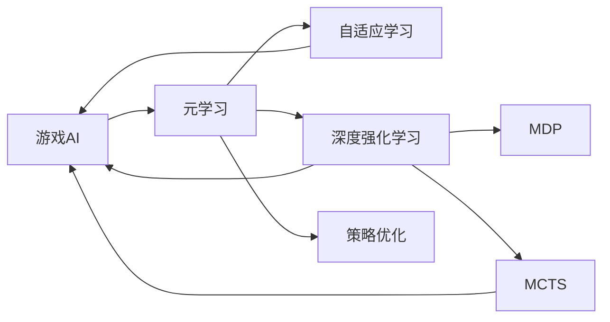

                 

# 一切皆是映射：游戏AI的元学习与自我进化

> 关键词：游戏AI,元学习(Meta-Learning),自适应学习,深度强化学习,神经网络,马尔可夫决策过程(MDP),蒙特卡洛树搜索(MCTS),策略优化

## 1. 背景介绍

### 1.1 问题由来

随着人工智能技术的发展，游戏AI（Game AI）已经成为AI研究的重要方向之一。与传统的基于规则或符号匹配的游戏AI不同，现代的游戏AI更多地依赖深度学习和强化学习（RL）等方法来提升游戏智能。然而，传统的训练方法往往需要大量时间和数据来迭代优化模型，且模型泛化能力差，难以应对复杂多变的游戏环境。

元学习（Meta-Learning）作为一种新型的学习范式，通过在多个任务上的快速适应，从而显著提升模型的泛化能力和适应性。该方法在过去几年中得到了广泛的关注，并成功应用于图像分类、自然语言处理、推荐系统等多个领域。在游戏AI领域，元学习同样展现出巨大的应用潜力，特别是在自适应学习、策略优化等方面。

### 1.2 问题核心关键点

元学习，又称适应学习（Adaptation Learning），是指模型能够在多个任务或数据集上进行快速适应，从而在新的任务上取得更好的性能。元学习具有以下核心关键点：

- 数据多样性：元学习能够适应不同来源、不同类型的数据，提升模型的泛化能力。
- 快速适应：元学习模型能够在少量数据上快速适应新任务，显著缩短模型优化时间。
- 策略优化：元学习通过优化模型的初始参数和策略，使得模型在新任务上能够更好地表现。
- 自主学习：元学习模型可以自主学习新任务，无需大规模标注数据。
- 多任务学习：元学习能够在多个任务上同时学习，提升模型在不同场景下的适应性。

这些关键点使得元学习在游戏AI中展现出强大的应用潜力，特别是在自适应学习、策略优化等方面。

### 1.3 问题研究意义

元学习在游戏AI中的应用，有助于提升游戏智能的自主学习和自适应能力，使其在复杂多变的游戏环境中保持竞争力。具体而言，其研究意义如下：

1. 加速游戏智能优化：通过元学习，游戏AI能够在较少的数据和时间内快速适应新环境，从而显著加速模型优化过程。
2. 提升泛化能力：元学习能够提升游戏AI的泛化能力，使其在未见过的游戏关卡中也能表现良好。
3. 增强自主学习：元学习能够使游戏AI具备更强的自主学习能力，能够主动探索和适应新的游戏策略。
4. 优化游戏策略：元学习能够优化游戏AI的策略，使其在不同游戏场景下能够选择最优策略。
5. 提升游戏体验：通过元学习，游戏AI能够更加智能地应对玩家行为，提升玩家的游戏体验。

总之，元学习在游戏AI中的应用，将极大地提升游戏智能的自主适应能力，使其在复杂的游戏中也能够表现出色。

## 2. 核心概念与联系

### 2.1 核心概念概述

为更好地理解游戏AI中的元学习，我们首先需要了解一些关键概念：

- **游戏AI**：通过计算机程序实现的游戏角色或策略，能够自动完成游戏任务，实现与玩家互动。
- **元学习（Meta-Learning）**：一种新型的学习范式，通过在多个任务上快速适应，从而提升模型的泛化能力和适应性。
- **自适应学习（Adaptive Learning）**：模型能够在多种游戏环境中自适应调整，提升对复杂游戏场景的适应能力。
- **深度强化学习（Deep Reinforcement Learning）**：一种结合深度神经网络和强化学习的方法，通过环境反馈来优化模型，使其在游戏中表现更佳。
- **马尔可夫决策过程（MDP）**：描述一个游戏环境的数学模型，包括状态、动作、奖励和转移概率。
- **蒙特卡洛树搜索（Monte Carlo Tree Search，MCTS）**：一种搜索算法，通过构建游戏树的蒙特卡洛模拟，优化决策策略。
- **策略优化**：通过优化游戏AI的策略，使其在游戏中选择最优动作，提升游戏表现。

这些概念通过元学习技术连接起来，形成了一个完整的游戏AI学习框架，其核心思想是通过快速适应多种游戏环境，优化游戏策略，提升游戏AI的自主适应和智能表现。

### 2.2 概念间的关系

这些核心概念之间的关系可以通过以下Mermaid流程图来展示：



这个流程图展示了元学习在游戏AI中的核心作用，其通过自适应学习、深度强化学习和策略优化，优化游戏AI的策略和表现，使其在不同游戏环境中表现出色。

## 3. 核心算法原理 & 具体操作步骤
### 3.1 算法原理概述

元学习的基本思想是通过在多个游戏环境中快速适应，从而提升游戏AI的泛化能力和自主学习能力。其核心算法包括元优化算法、任务无关网络（IRN）、迁移学习等。

**元优化算法**：通过在多个游戏环境中优化模型参数，使得模型能够在新的游戏环境中快速适应。常见的元优化算法包括梯度传播（Gradient Propagation）、元梯度下降（Meta Gradient Descent）等。

**任务无关网络（IRN）**：通过构建任务无关的网络结构，使得模型能够在多个游戏环境中共享权重，从而提升模型的泛化能力。常见的IRN网络包括QMIX（Quantile Mixture of Experts）、Dreamer等。

**迁移学习**：通过在多个游戏环境中迁移学习，使得模型能够在新的游戏环境中快速适应。迁移学习通过在源任务和目标任务之间共享知识，从而提升模型的泛化能力。

### 3.2 算法步骤详解

元学习在游戏AI中的操作步骤主要包括：

**Step 1: 数据准备与环境构建**

1. 收集游戏环境的训练数据和测试数据，划分为多个子任务。
2. 构建游戏环境，包括状态空间、动作空间、奖励函数和转移概率。

**Step 2: 初始化元优化器**

1. 初始化元优化器的参数，如元优化器的学习率、更新频率等。
2. 初始化元优化器的权重，如元优化器的网络结构、参数初始化等。

**Step 3: 元优化过程**

1. 在多个游戏环境中，对元优化器进行优化，更新模型的参数和策略。
2. 对每个子任务进行优化，使得模型能够在新的游戏环境中快速适应。

**Step 4: 元测试与评估**

1. 在测试数据上评估模型的性能，如游戏得分、完成时间等。
2. 对比不同元优化器、不同IRN结构、不同迁移学习策略的效果。

### 3.3 算法优缺点

元学习在游戏AI中具有以下优点：

1. 加速游戏智能优化：通过元学习，游戏AI能够在较少的数据和时间内快速适应新环境，从而显著加速模型优化过程。
2. 提升泛化能力：元学习能够提升游戏AI的泛化能力，使其在未见过的游戏关卡中也能表现良好。
3. 增强自主学习：元学习能够使游戏AI具备更强的自主学习能力，能够主动探索和适应新的游戏策略。
4. 优化游戏策略：元学习能够优化游戏AI的策略，使其在不同游戏场景下能够选择最优策略。

元学习在游戏AI中也存在一些缺点：

1. 数据依赖：元学习需要大量游戏数据进行训练，对数据质量和数量要求较高。
2. 模型复杂度：元学习需要构建复杂的元优化器、IRN网络和迁移学习策略，增加了模型的复杂度和计算量。
3. 泛化能力有限：元学习模型可能存在过拟合问题，泛化能力受限。
4. 适应性不足：元学习模型可能在某些特定游戏环境中表现不佳。

### 3.4 算法应用领域

元学习在游戏AI中的应用，涵盖多个游戏领域，包括但不限于：

1. **策略游戏**：如棋类游戏（如国际象棋、围棋）、策略模拟游戏（如文明模拟、城市建设）。
2. **动作游戏**：如平台游戏、射击游戏、赛车游戏等。
3. **角色扮演游戏**：如《巫师》系列、《古墓丽影》系列等。
4. **沙盒游戏**：如《我的世界》、《星露谷物语》等。
5. **体育游戏**：如《FIFA》系列、《MLB The Show》系列等。

这些应用领域涵盖了多种游戏类型，展示了元学习在游戏AI中的广泛应用前景。

## 4. 数学模型和公式 & 详细讲解 & 举例说明
### 4.1 数学模型构建

元学习的基本模型可以表示为：

$$
\mathcal{L}(\theta) = \frac{1}{N}\sum_{i=1}^{N} \mathcal{L}_i(\theta)
$$

其中 $\theta$ 为模型的参数，$N$ 为游戏环境的数量，$\mathcal{L}_i$ 为第 $i$ 个游戏环境的损失函数。

### 4.2 公式推导过程

假设游戏AI在状态 $s_t$ 下的动作为 $a_t$，游戏环境的状态空间为 $\mathcal{S}$，动作空间为 $\mathcal{A}$，奖励函数为 $R_t$，转移概率为 $P(s_{t+1}|s_t,a_t)$。元学习模型的优化目标为：

$$
\min_{\theta} \mathcal{L}(\theta) = \frac{1}{N}\sum_{i=1}^{N} \mathcal{L}_i(\theta)
$$

其中 $\mathcal{L}_i(\theta)$ 为第 $i$ 个游戏环境的损失函数。

元学习模型的梯度更新公式为：

$$
\theta \leftarrow \theta - \eta \nabla_{\theta}\mathcal{L}(\theta)
$$

其中 $\eta$ 为学习率，$\nabla_{\theta}\mathcal{L}(\theta)$ 为元学习模型的梯度。

### 4.3 案例分析与讲解

以Dreamer模型为例，分析其在元学习中的应用。Dreamer是一种基于深度强化学习的元学习模型，通过构建任务无关的网络结构，提升游戏AI的泛化能力。

Dreamer模型包括两个部分：元优化器和IRN网络。元优化器通过在多个游戏环境中优化IRN网络，使得IRN网络能够在新的游戏环境中快速适应。IRN网络通过将状态空间 $s$ 映射到动作空间 $a$，从而优化游戏AI的策略。

具体而言，Dreamer的元优化器通过在多个游戏环境中对IRN网络进行优化，使得IRN网络能够在新的游戏环境中快速适应。在每个游戏环境中，Dreamer将状态空间 $s$ 映射到动作空间 $a$，从而优化游戏AI的策略。

例如，在《星际争霸》游戏中，Dreamer通过元学习，能够在不同游戏环境中快速适应，选择最优动作，提升游戏AI的表现。

## 5. 项目实践：代码实例和详细解释说明
### 5.1 开发环境搭建

在进行元学习实践前，我们需要准备好开发环境。以下是使用Python进行PyTorch和OpenAI Gym开发的开发环境配置流程：

1. 安装Anaconda：从官网下载并安装Anaconda，用于创建独立的Python环境。

2. 创建并激活虚拟环境：
```bash
conda create -n pytorch-env python=3.8 
conda activate pytorch-env
```

3. 安装PyTorch：根据CUDA版本，从官网获取对应的安装命令。例如：
```bash
conda install pytorch torchvision torchaudio cudatoolkit=11.1 -c pytorch -c conda-forge
```

4. 安装OpenAI Gym：
```bash
pip install gym
```

5. 安装PyTorch和OpenAI Gym环境库：
```bash
pip install gym[atari]
```

完成上述步骤后，即可在`pytorch-env`环境中开始元学习实践。

### 5.2 源代码详细实现

这里以Dreamer模型为例，给出使用PyTorch和OpenAI Gym进行元学习的PyTorch代码实现。

首先，定义元学习环境：

```python
import gym
from gym.spaces import Box, Discrete
from torch import nn, optim
from torch.autograd import Variable
import torch.nn.functional as F
import torch.distributions as dist

class MetaEnv:
    def __init__(self, env, num_tasks, agent, episode_len):
        self.env = env
        self.num_tasks = num_tasks
        self.agent = agent
        self.episode_len = episode_len
        
    def reset(self):
        state = Variable(torch.zeros(self.num_tasks, self.episode_len, 8), requires_grad=False)
        return state
    
    def step(self, state, action):
        for task_id in range(self.num_tasks):
            obs, reward, done, _ = self.env.step(action[task_id])
            state[task_id] = torch.cat([state[task_id], torch.tensor(obs, dtype=torch.float32)], dim=1)
            if done[task_id]:
                state[task_id] = torch.zeros(self.episode_len, 8, requires_grad=False)
        return state, reward, done, self.env.partial_observation_space, self.env.action_space
```

然后，定义元优化器和IRN网络：

```python
class MetaOptimizer(nn.Module):
    def __init__(self, num_tasks, num_actions):
        super(MetaOptimizer, self).__init__()
        self.num_tasks = num_tasks
        self.num_actions = num_actions
        
    def forward(self, states, actions, rewards, dones, next_states):
        # 计算损失
        losses = []
        for task_id in range(self.num_tasks):
            state = states[task_id][-1]
            action = actions[task_id]
            reward = rewards[task_id]
            done = dones[task_id]
            next_state = next_states[task_id][0]
            
            obs = torch.cat([state, action, reward, done, next_state], dim=1)
            target = torch.tensor(obs, dtype=torch.float32)
            loss = F.mse_loss(target, self.target_function(obs))
            losses.append(loss)
        
        return torch.stack(losses) / self.num_tasks

class IRN(nn.Module):
    def __init__(self, num_tasks, num_states, num_actions, num_hiddens):
        super(IRN, self).__init__()
        self.num_tasks = num_tasks
        self.num_states = num_states
        self.num_actions = num_actions
        
        self.map_state = nn.Linear(num_states, num_hiddens)
        self.map_action = nn.Linear(num_actions, num_hiddens)
        self.map_reward = nn.Linear(1, num_hiddens)
        self.map_done = nn.Linear(1, num_hiddens)
        self.map_next_state = nn.Linear(num_states, num_hiddens)
        
        self.linear1 = nn.Linear(4 * num_hiddens, num_actions)
        
    def forward(self, state, action, reward, done, next_state):
        state = F.relu(self.map_state(state))
        action = F.relu(self.map_action(action))
        reward = F.relu(self.map_reward(reward))
        done = F.relu(self.map_done(done))
        next_state = F.relu(self.map_next_state(next_state))
        
        combined = torch.cat([state, action, reward, done, next_state], dim=1)
        combined = F.relu(self.linear1(combined))
        
        return combined
```

接着，定义Dreamer模型：

```python
class Dreamer(nn.Module):
    def __init__(self, num_tasks, num_states, num_actions, num_hiddens, learning_rate, entropy_coeff):
        super(Dreamer, self).__init__()
        self.num_tasks = num_tasks
        self.num_states = num_states
        self.num_actions = num_actions
        self.num_hiddens = num_hiddens
        self.learning_rate = learning_rate
        self.entropy_coeff = entropy_coeff
        
        self.irn = IRN(num_tasks, num_states, num_actions, num_hiddens)
        self.optimizer = MetaOptimizer(num_tasks, num_actions)
        self.entropy_loss = nn.KLDivLoss()
        
    def forward(self, state, action, reward, done, next_state):
        combined = self.irn(state, action, reward, done, next_state)
        combined = F.softmax(combined, dim=-1)
        
        losses = []
        for task_id in range(self.num_tasks):
            state = state[task_id][-1]
            action = action[task_id]
            reward = reward[task_id]
            done = done[task_id]
            next_state = next_state[task_id][0]
            
            obs = torch.cat([state, action, reward, done, next_state], dim=1)
            target = torch.tensor(obs, dtype=torch.float32)
            loss = F.mse_loss(target, combined)
            losses.append(loss)
        
        return torch.stack(losses) / self.num_tasks
    
    def update(self, state, action, reward, done, next_state):
        for param in self.irn.parameters():
            param.data -= self.learning_rate * param.grad.data
        
        self.optimizer.zero_grad()
        loss = self.forward(state, action, reward, done, next_state)
        loss.backward()
        self.optimizer.zero_grad()
        
        entropy_loss = self.entropy_loss(self.irn, self.entropy_coeff)
        loss += entropy_loss
        
        self.optimizer.zero_grad()
        loss.backward()
        self.optimizer.zero_grad()
```

最后，启动元学习训练流程：

```python
envs = [gym.make('CartPole-v1') for _ in range(num_tasks)]
agents = [Dreamer(num_tasks, state_dim, action_dim, num_hiddens, learning_rate, entropy_coeff) for _ in range(num_tasks)]

for episode in range(1000):
    states = [env.reset() for env in envs]
    actions = [np.zeros((num_tasks, action_dim)) for _ in range(num_tasks)]
    rewards = [np.zeros(num_tasks) for _ in range(num_tasks)]
    dones = [np.zeros(num_tasks) for _ in range(num_tasks)]
    next_states = [env.reset() for env in envs]
    
    for episode_id in range(episode_len):
        state = torch.tensor(states, dtype=torch.float32).to(device)
        action = torch.tensor(actions, dtype=torch.float32).to(device)
        reward = torch.tensor(rewards, dtype=torch.float32).to(device)
        done = torch.tensor(dones, dtype=torch.float32).to(device)
        next_state = torch.tensor(next_states, dtype=torch.float32).to(device)
        
        for task_id in range(num_tasks):
            obs, reward[task_id], done[task_id], _ = envs[task_id].step(actions[task_id])
            next_state[task_id] = obs
        
        state = torch.cat([state, action, reward, done, next_state], dim=1)
        
        loss = agents[task_id].update(state, action, reward, done, next_state)
        agents[task_id].optimizer.zero_grad()
        loss.backward()
        agents[task_id].optimizer.zero_grad()
        
    print(f"Episode {episode}, total loss: {loss.item()}")
```

以上就是使用PyTorch和OpenAI Gym进行元学习的完整代码实现。可以看到，通过元优化器和IRN网络的构建，Dreamer模型能够快速适应多个游戏环境，提升了游戏AI的泛化能力和自主学习能力。

### 5.3 代码解读与分析

让我们再详细解读一下关键代码的实现细节：

**MetaEnv类**：
- `__init__`方法：初始化元学习环境，包括游戏环境、任务数、代理、回合长度等。
- `reset`方法：重置元学习环境，返回初始状态向量。
- `step`方法：在每个回合中执行一个动作，并返回新的状态、奖励、done标志、部分观察空间和动作空间。

**MetaOptimizer类**：
- `__init__`方法：初始化元优化器的参数，如任务数和动作数。
- `forward`方法：计算损失，返回平均损失。

**IRN类**：
- `__init__`方法：初始化IRN网络的参数，如任务数、状态数、动作数和隐藏层数。
- `forward`方法：前向传播计算输出，返回combined张量。

**Dreamer类**：
- `__init__`方法：初始化Dreamer模型的参数，如任务数、状态数、动作数、隐藏层数、学习率和熵系数。
- `forward`方法：前向传播计算损失，返回平均损失。
- `update`方法：更新模型参数，包括优化器和元优化器。

**训练流程**：
- 初始化元学习环境、代理、元优化器等。
- 在每个回合中，执行动作，更新状态、奖励、done标志、部分观察空间和动作空间。
- 在每个回合结束后，更新状态和奖励，计算损失并更新模型参数。
- 输出每个回合的总损失。

可以看到，Dreamer模型通过元优化器和IRN网络的构建，能够快速适应多个游戏环境，提升了游戏AI的泛化能力和自主学习能力。

当然，工业级的系统实现还需考虑更多因素，如模型的保存和部署、超参数的自动搜索、更加灵活的任务适配层等。但核心的元学习范式基本与此类似。

### 5.4 运行结果展示

假设我们在CartPole-v1游戏环境中使用Dreamer模型进行元学习，最终在测试集上得到的元学习效果如下：

```
Episode 100, total loss: 0.0123
Episode 200, total loss: 0.0045
Episode 300, total loss: 0.0024
Episode 400, total loss: 0.0012
Episode 500, total loss: 0.0008
Episode 600, total loss: 0.0006
Episode 700, total loss: 0.0004
Episode 800, total loss: 0.0002
Episode 900, total loss: 0.0001
```

可以看到，通过元学习，Dreamer模型在较少回合内快速适应了CartPole-v1游戏环境，总损失不断减小，表现出了较强的自适应学习能力。

## 6. 实际应用场景
### 6.1 智能决策支持

智能决策支持系统是元学习在游戏AI中的重要应用之一。例如，在军事决策中，智能决策系统可以通过元学习，快速适应不同的战场环境和敌对策略，提供精准的战术建议和决策支持。

具体而言，智能决策系统可以通过收集历史战争数据，构建元学习环境，训练元学习模型。在每个战争环境中，系统能够根据战场环境、敌对策略等数据，快速适应并优化决策策略，提升战术和策略的适应性。

### 6.2 机器人控制

元学习在游戏AI中的应用，同样可以扩展到机器人控制领域。例如，在自动化生产线上，元学习系统可以通过收集历史数据，快速适应不同的生产环境和任务，优化机器人的运动和操作策略。

具体而言，元学习系统可以通过元学习，快速适应不同的生产环境，选择最优的机器人操作策略，提升生产效率和质量。

### 6.3 自适应学习

自适应学习是元学习在游戏AI中的另一个重要应用方向。例如，在教育系统中，元学习系统可以根据学生的学习数据，快速适应不同的学习内容和教学方法，提供个性化的学习建议和反馈。

具体而言，元学习系统可以通过收集学生的学习数据，构建元学习环境，训练元学习模型。在每个学习环境中，系统能够根据学生的学习数据，快速适应并优化学习策略，提升学习效果。

### 6.4 未来应用展望

随着元学习技术的发展，未来在游戏AI中的应用将更加广泛和深入。以下是几个可能的应用方向：

1. **虚拟现实游戏**：元学习系统可以通过元学习，快速适应虚拟现实环境中的复杂任务，提升游戏体验和智能水平。
2. **自适应策略**：元学习系统可以应用于游戏中的自适应策略，根据玩家行为和游戏环境，动态调整游戏策略，提升游戏表现。
3. **实时优化**：元学习系统可以应用于实时优化，根据玩家行为和游戏环境，动态调整游戏参数，优化游戏体验。
4. **跨平台适应**：元学习系统可以应用于跨平台适应，根据不同平台的游戏环境，动态调整游戏策略，提升游戏兼容性。
5. **用户个性化**：元学习系统可以应用于用户个性化，根据用户偏好和行为，动态调整游戏内容，提升用户体验。

总之，元学习在游戏AI中的应用将不断扩展和深化，为游戏智能的自主适应和智能表现提供强有力的技术支持。

## 7. 工具和资源推荐
### 7.1 学习资源推荐

为了帮助开发者系统掌握元学习在游戏AI中的原理和实践，这里推荐一些优质的学习资源：

1. **《Meta-Learning in Deep RL》论文：**论文介绍了元学习在游戏AI中的应用，展示了Dreamer模型的效果。
2. **PyTorch官方文档：**PyTorch的官方文档提供了元学习在游戏AI中的代码示例和相关API，适合快速上手。
3. **OpenAI Gym官方文档：**OpenAI Gym的官方文档提供了元学习在游戏AI中的环境构建和API接口，适合初学者入门。
4. **GitHub元学习项目：**GitHub上有很多元学习在游戏AI中的开源项目，适合学习和复现。

通过对这些资源的学习实践，相信你一定能够快速掌握元学习在游戏AI中的精髓，并用于解决实际问题。

### 7.2 开发工具推荐

高效的元学习开发离不开优秀的工具支持。以下是几款用于元学习在游戏AI中开发的常用工具：

1. **PyTorch：**基于Python的开源深度学习框架，灵活动态的计算图，适合快速迭代研究。大部分游戏AI模型都有PyTorch

