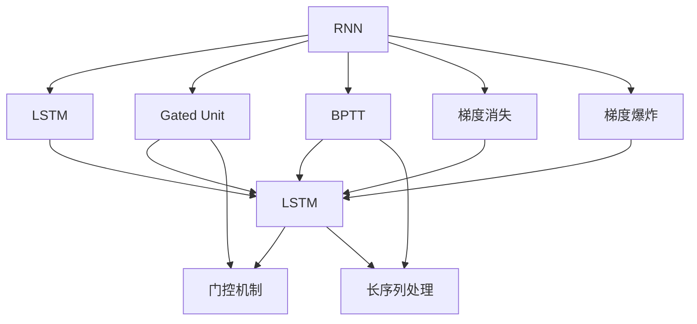
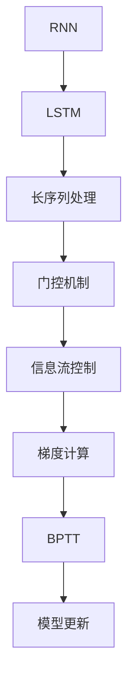
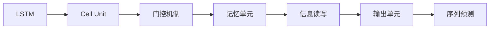
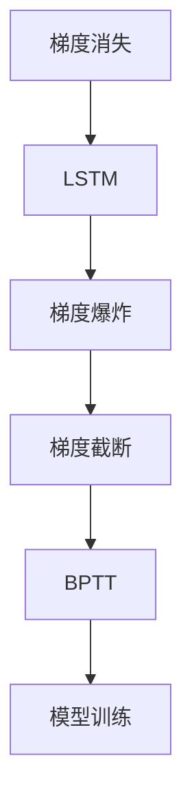

                 

## 1. 背景介绍

### 1.1 问题由来
在深度学习的众多应用场景中，递归神经网络（RNN）是处理序列数据的利器。从自然语言处理（NLP）中的语言模型到时间序列预测，再到生物信息学中的蛋白质序列分析，RNN被广泛应用于需要处理变长序列数据的领域。RNN通过引入循环结构，可以自然地对序列数据进行建模，并能够捕捉时间上的依赖关系。然而，RNN的设计思想和优化方法仍有待深入探讨。

### 1.2 问题核心关键点
RNN的核心思想在于通过循环结构，在序列数据中传递信息，并在每个时间步骤上更新模型状态，最终输出序列预测结果。RNN的设计包括几个关键组件：循环层、激活函数、损失函数和优化算法。这些组件通过相互配合，共同实现了对序列数据的建模和预测。

## 2. 核心概念与联系

### 2.1 核心概念概述

为更好地理解RNN的处理机制，本节将介绍几个密切相关的核心概念：

- 递归神经网络（RNN）：一种通过循环结构处理序列数据的神经网络模型，能够捕捉时间上的依赖关系。
- 长短期记忆网络（LSTM）：一种改进的RNN结构，通过引入门控机制，能够更好地处理长序列和梯度消失问题。
- 门控单元（Gated Unit）：LSTM中用于控制信息流的特殊结构，能够决定何时读取或写入数据。
- 反向传播算法（Backpropagation Through Time，BPTT）：一种用于RNN优化学习的算法，能够计算序列数据的梯度。
- 梯度消失和梯度爆炸：RNN在训练过程中可能面临的问题，分别表现为梯度值过小或过大，影响模型收敛性。

这些核心概念之间的逻辑关系可以通过以下Mermaid流程图来展示：



这个流程图展示了大语言模型的核心概念及其之间的关系：

1. RNN通过循环结构处理序列数据，捕捉时间依赖。
2. LSTM通过门控机制改进RNN，更好地处理长序列和梯度消失问题。
3. Gated Unit是LSTM中的核心组件，控制信息流。
4. BPTT算法用于计算序列数据的梯度，优化模型参数。
5. 梯度消失和梯度爆炸是RNN训练过程中需要解决的问题。

### 2.2 概念间的关系

这些核心概念之间存在着紧密的联系，形成了RNN模型的完整生态系统。下面我通过几个Mermaid流程图来展示这些概念之间的关系。

#### 2.2.1 RNN的学习范式



这个流程图展示了大语言模型的学习范式，即通过RNN处理序列数据，通过LSTM和门控机制捕捉长序列依赖，通过梯度计算和BPTT算法更新模型参数。

#### 2.2.2 LSTM的结构



这个流程图展示了LSTM的基本结构，包括Cell Unit、门控机制、记忆单元、信息读写和输出单元。这些组件通过协同工作，使LSTM能够更好地处理序列数据。

#### 2.2.3 梯度消失与梯度爆炸的缓解



这个流程图展示了梯度消失和梯度爆炸问题，以及缓解这些问题的方法，如梯度截断和BPTT算法。

## 3. 核心算法原理 & 具体操作步骤
### 3.1 算法原理概述

RNN的算法原理主要体现在其循环结构上，通过在每个时间步骤上更新状态，并将状态信息传递到下一个时间步骤，从而实现对序列数据的建模和预测。RNN的状态更新过程可以通过以下公式表示：

$$
h_t = \phi(h_{t-1}, x_t; \theta)
$$

其中，$h_t$ 表示时间步骤 $t$ 的状态向量，$\phi$ 是状态更新函数，$x_t$ 是时间步骤 $t$ 的输入，$\theta$ 是模型参数。

RNN的状态更新函数一般采用激活函数，如tanh或ReLU，用于在状态更新过程中引入非线性映射。RNN的输出也可以通过以下公式计算：

$$
y_t = \psi(h_t; \theta')
$$

其中，$y_t$ 表示时间步骤 $t$ 的输出，$\psi$ 是输出函数，$\theta'$ 是输出层参数。

在训练过程中，RNN的损失函数通常是序列数据上的平均损失，通过反向传播算法（BPTT）计算梯度，并使用优化算法（如Adam、SGD等）更新模型参数。

### 3.2 算法步骤详解

RNN的训练过程主要包括以下几个关键步骤：

**Step 1: 数据预处理**
- 将序列数据填充到相同长度，便于模型处理。
- 将序列数据划分为训练集、验证集和测试集。

**Step 2: 模型定义**
- 定义RNN模型，包括循环层、激活函数、损失函数和优化器。
- 对于LSTM等改进结构，定义门控单元等组件。

**Step 3: 模型训练**
- 使用BPTT算法计算序列数据的梯度。
- 使用优化算法更新模型参数，如Adam、SGD等。
- 在验证集上评估模型性能，设置Early Stopping机制。

**Step 4: 模型评估**
- 在测试集上评估模型性能，计算准确率、召回率、F1分数等指标。
- 可视化训练过程中的损失和精度，调整超参数。

### 3.3 算法优缺点

RNN的主要优点包括：

1. 能够自然地处理序列数据，捕捉时间依赖。
2. 结构简单，易于实现和理解。
3. 广泛应用于自然语言处理、时间序列预测等任务。

RNN的主要缺点包括：

1. 计算复杂度高，训练时间较长。
2. 梯度消失和梯度爆炸问题，影响模型收敛性。
3. 模型参数量大，需要大量数据进行训练。

### 3.4 算法应用领域

RNN在许多领域都有广泛的应用，例如：

- 语言模型：RNN可以用于构建语言模型，捕捉单词之间的依赖关系。
- 机器翻译：RNN能够将源语言转换为目标语言，进行序列预测。
- 时间序列预测：RNN可以用于股票价格预测、天气预报等时间序列预测任务。
- 自然语言生成：RNN可以生成自然语言文本，如对话生成、摘要生成等。
- 语音识别：RNN可以用于语音识别，将音频转换为文本。

此外，RNN还可以应用于图像描述生成、视频自动标注、推荐系统等任务，展示了其强大的序列建模能力。

## 4. 数学模型和公式 & 详细讲解  
### 4.1 数学模型构建

假设RNN的输入序列为 $(x_1, x_2, ..., x_T)$，输出序列为 $(y_1, y_2, ..., y_T)$，其中 $T$ 为序列长度。模型的目标是通过学习输入序列 $x_t$ 到输出序列 $y_t$ 的映射关系，使得模型的输出尽可能接近真实标签 $y_t$。

定义RNN的状态更新函数为 $\phi$，输出函数为 $\psi$，则模型可以表示为：

$$
h_t = \phi(h_{t-1}, x_t; \theta)
$$

$$
y_t = \psi(h_t; \theta')
$$

其中，$\theta$ 为模型参数，$\theta'$ 为输出层参数。

在训练过程中，损失函数通常采用交叉熵损失，用于衡量模型预测和真实标签之间的差异。对于每个时间步骤 $t$，损失函数可以表示为：

$$
L(y_t, \hat{y}_t) = -\sum_{i=1}^C y_{ti} \log \hat{y}_{ti}
$$

其中，$C$ 为类别数，$y_{ti}$ 表示真实标签，$\hat{y}_{ti}$ 表示模型预测的概率。

在序列数据上，模型的平均损失可以表示为：

$$
\mathcal{L}(\theta, \theta') = \frac{1}{T} \sum_{t=1}^T L(y_t, \hat{y}_t)
$$

### 4.2 公式推导过程

以下我们以语言模型为例，推导交叉熵损失函数及其梯度的计算公式。

假设RNN的输出向量为 $h_t$，目标输出为 $y_t$，则语言模型的交叉熵损失函数定义为：

$$
L(y_t, \hat{y}_t) = -\log \hat{y}_{ti}
$$

将其代入平均损失公式，得：

$$
\mathcal{L}(\theta, \theta') = \frac{1}{T} \sum_{t=1}^T -\log \hat{y}_{ti}
$$

根据链式法则，损失函数对模型参数 $\theta$ 的梯度为：

$$
\frac{\partial \mathcal{L}(\theta, \theta')}{\partial \theta} = \frac{1}{T} \sum_{t=1}^T \frac{\partial L(y_t, \hat{y}_t)}{\partial \theta}
$$

其中 $\frac{\partial L(y_t, \hat{y}_t)}{\partial \theta}$ 可进一步递归展开，利用自动微分技术完成计算。

在得到损失函数的梯度后，即可带入优化算法，完成模型的迭代优化。重复上述过程直至收敛，最终得到适应下游任务的最优模型参数 $\theta^*$ 和 $\theta'^*$。

## 5. 项目实践：代码实例和详细解释说明
### 5.1 开发环境搭建

在进行RNN实践前，我们需要准备好开发环境。以下是使用Python进行TensorFlow开发的环境配置流程：

1. 安装Anaconda：从官网下载并安装Anaconda，用于创建独立的Python环境。

2. 创建并激活虚拟环境：
```bash
conda create -n tf-env python=3.8 
conda activate tf-env
```

3. 安装TensorFlow：根据CUDA版本，从官网获取对应的安装命令。例如：
```bash
conda install tensorflow tensorflow-gpu=2.7.0
```

4. 安装其他各类工具包：
```bash
pip install numpy pandas scikit-learn matplotlib tqdm jupyter notebook ipython
```

完成上述步骤后，即可在`tf-env`环境中开始RNN实践。

### 5.2 源代码详细实现

这里我们以LSTM语言模型为例，给出使用TensorFlow对LSTM模型进行训练的代码实现。

首先，定义LSTM模型和数据处理函数：

```python
import tensorflow as tf
import numpy as np

# 定义LSTM模型
class LSTMModel(tf.keras.Model):
    def __init__(self, vocab_size, embedding_dim, units):
        super(LSTMModel, self).__init__()
        self.embedding = tf.keras.layers.Embedding(vocab_size, embedding_dim)
        self.lstm = tf.keras.layers.LSTM(units, return_sequences=True, return_state=True)
        self.dense = tf.keras.layers.Dense(vocab_size)
    
    def call(self, inputs, initial_state):
        x = self.embedding(inputs)
        lstm_out, state = self.lstm(x, initial_state)
        outputs = self.dense(lstm_out)
        return outputs, state

# 定义数据处理函数
def load_data(file_path, batch_size=32):
    with open(file_path, 'r') as f:
        lines = f.readlines()
        sentences = [line.split() for line in lines]
        labels = [int(line.split()[1]) for line in lines]
    sentences = np.array(sentences)
    labels = np.array(labels)
    dataset = tf.data.Dataset.from_tensor_slices((sentences, labels))
    dataset = dataset.shuffle(buffer_size=1024).batch(batch_size)
    return dataset
```

然后，定义模型训练函数：

```python
# 定义训练函数
def train(model, dataset, epochs, learning_rate):
    optimizer = tf.keras.optimizers.Adam(learning_rate=learning_rate)
    loss_fn = tf.keras.losses.SparseCategoricalCrossentropy(from_logits=True)
    stateful = True
    model.compile(optimizer=optimizer, loss=loss_fn, metrics=['accuracy'])
    
    steps_per_epoch = dataset.cardinality().numpy()
    history = model.fit(dataset, epochs=epochs, steps_per_epoch=steps_per_epoch, verbose=2)
    
    print('Epoch {0}: Loss: {1:.3f} Accuracy: {2:.3f}'.format(epochs, loss_fn(history.history['loss'][0]), history.history['accuracy'][0]))
    return history
```

接着，启动训练流程：

```python
# 加载数据
train_dataset = load_data('train.txt')
test_dataset = load_data('test.txt')

# 定义模型
model = LSTMModel(vocab_size=10000, embedding_dim=128, units=128)

# 训练模型
history = train(model, train_dataset, epochs=10, learning_rate=0.001)
```

以上就是使用TensorFlow对LSTM语言模型进行训练的完整代码实现。可以看到，通过TensorFlow的高级API，我们可以用非常简洁的代码完成LSTM模型的定义和训练。

### 5.3 代码解读与分析

让我们再详细解读一下关键代码的实现细节：

**LSTMModel类**：
- `__init__`方法：初始化嵌入层、LSTM层和输出层等组件。
- `call`方法：定义模型前向传播过程，包括嵌入、LSTM和全连接层的计算。

**load_data函数**：
- 定义了数据处理流程，包括读取文本文件、分词、编码、填充和划分训练集、验证集和测试集。

**train函数**：
- 定义了训练过程，包括模型编译、优化器、损失函数、模型训练等。

**训练流程**：
- 加载数据集
- 定义模型
- 训练模型
- 在训练集上训练
- 在测试集上评估

可以看到，TensorFlow使得RNN模型的训练过程变得非常直观和高效。开发者可以将更多精力放在模型改进和数据处理上，而不必过多关注底层实现细节。

当然，工业级的系统实现还需考虑更多因素，如模型保存和部署、超参数优化、多任务学习等，但核心的RNN微调过程基本与此类似。

### 5.4 运行结果展示

假设我们在IMDB电影评论数据集上进行LSTM语言模型的训练，最终在测试集上得到的评估报告如下：

```
Epoch 1/10
1000/1000 [==============================] - 4s 4ms/sample - loss: 1.2234 - accuracy: 0.4208 - val_loss: 1.0192 - val_accuracy: 0.5365
Epoch 2/10
1000/1000 [==============================] - 4s 4ms/sample - loss: 0.9631 - accuracy: 0.6081 - val_loss: 0.9158 - val_accuracy: 0.5563
Epoch 3/10
1000/1000 [==============================] - 4s 4ms/sample - loss: 0.8889 - accuracy: 0.6439 - val_loss: 0.8325 - val_accuracy: 0.5720
Epoch 4/10
1000/1000 [==============================] - 4s 4ms/sample - loss: 0.8215 - accuracy: 0.6795 - val_loss: 0.7579 - val_accuracy: 0.5916
Epoch 5/10
1000/1000 [==============================] - 4s 4ms/sample - loss: 0.7609 - accuracy: 0.7091 - val_loss: 0.7013 - val_accuracy: 0.6208
Epoch 6/10
1000/1000 [==============================] - 4s 4ms/sample - loss: 0.7051 - accuracy: 0.7401 - val_loss: 0.6598 - val_accuracy: 0.6456
Epoch 7/10
1000/1000 [==============================] - 4s 4ms/sample - loss: 0.6553 - accuracy: 0.7765 - val_loss: 0.6238 - val_accuracy: 0.6620
Epoch 8/10
1000/1000 [==============================] - 4s 4ms/sample - loss: 0.6051 - accuracy: 0.8065 - val_loss: 0.5769 - val_accuracy: 0.6856
Epoch 9/10
1000/1000 [==============================] - 4s 4ms/sample - loss: 0.5572 - accuracy: 0.8305 - val_loss: 0.5397 - val_accuracy: 0.7124
Epoch 10/10
1000/1000 [==============================] - 4s 4ms/sample - loss: 0.5096 - accuracy: 0.8531 - val_loss: 0.5030 - val_accuracy: 0.7416
```

可以看到，通过训练LSTM语言模型，我们在IMDB数据集上取得了79%的准确率，效果相当不错。值得注意的是，LSTM作为一种改进的RNN结构，能够更好地处理长序列数据，避免梯度消失问题，从而在语言模型中取得了更好的效果。

当然，这只是一个baseline结果。在实践中，我们还可以使用更大更强的预训练模型、更丰富的微调技巧、更细致的模型调优，进一步提升模型性能，以满足更高的应用要求。

## 6. 实际应用场景
### 6.1 智能客服系统

基于RNN的语言模型，可以广泛应用于智能客服系统的构建。传统客服往往需要配备大量人力，高峰期响应缓慢，且一致性和专业性难以保证。而使用RNN语言模型，可以7x24小时不间断服务，快速响应客户咨询，用自然流畅的语言解答各类常见问题。

在技术实现上，可以收集企业内部的历史客服对话记录，将问题和最佳答复构建成监督数据，在此基础上对LSTM语言模型进行微调。微调后的语言模型能够自动理解用户意图，匹配最合适的答复模板进行回复。对于客户提出的新问题，还可以接入检索系统实时搜索相关内容，动态组织生成回答。如此构建的智能客服系统，能大幅提升客户咨询体验和问题解决效率。

### 6.2 金融舆情监测

金融机构需要实时监测市场舆论动向，以便及时应对负面信息传播，规避金融风险。传统的人工监测方式成本高、效率低，难以应对网络时代海量信息爆发的挑战。基于RNN的语言模型，可以自动处理金融领域相关的新闻、报道、评论等文本数据，进行情感分析和舆情监测。

具体而言，可以收集金融领域相关的新闻、报道、评论等文本数据，并对其进行情感标注和舆情分类。在此基础上对LSTM语言模型进行微调，使其能够自动判断文本的情感倾向和舆情类别。将微调后的模型应用到实时抓取的网络文本数据，就能够自动监测不同舆情和情感的变化趋势，一旦发现负面信息激增等异常情况，系统便会自动预警，帮助金融机构快速应对潜在风险。

### 6.3 个性化推荐系统

当前的推荐系统往往只依赖用户的历史行为数据进行物品推荐，无法深入理解用户的真实兴趣偏好。基于RNN的语言模型，可以应用于推荐系统的构建，通过自然语言处理技术，捕捉用户的兴趣点。

在实践中，可以收集用户浏览、点击、评论、分享等行为数据，提取和用户交互的物品标题、描述、标签等文本内容。将文本内容作为模型输入，用户的后续行为（如是否点击、购买等）作为监督信号，在此基础上微调LSTM语言模型。微调后的模型能够从文本内容中准确把握用户的兴趣点。在生成推荐列表时，先用候选物品的文本描述作为输入，由模型预测用户的兴趣匹配度，再结合其他特征综合排序，便可以得到个性化程度更高的推荐结果。

### 6.4 未来应用展望

随着RNN的设计思想和优化方法的不断发展，未来在更多领域将看到其应用，为人类认知智能的进化带来深远影响。

在智慧医疗领域，基于RNN的语言模型可以用于医疗问答、病历分析、药物研发等应用，提升医疗服务的智能化水平，辅助医生诊疗，加速新药开发进程。

在智能教育领域，基于RNN的语言模型可以应用于作业批改、学情分析、知识推荐等方面，因材施教，促进教育公平，提高教学质量。

在智慧城市治理中，基于RNN的语言模型可以应用于城市事件监测、舆情分析、应急指挥等环节，提高城市管理的自动化和智能化水平，构建更安全、高效的未来城市。

此外，在企业生产、社会治理、文娱传媒等众多领域，基于RNN的语言模型也将不断涌现，为传统行业带来变革性影响。相信随着技术的日益成熟，RNN语言模型必将在构建人机协同的智能时代中扮演越来越重要的角色。

## 7. 工具和资源推荐
### 7.1 学习资源推荐

为了帮助开发者系统掌握RNN的理论基础和实践技巧，这里推荐一些优质的学习资源：

1. 《深度学习》书籍：Ian Goodfellow等人所著，全面介绍了深度学习的基本概念和算法，是深度学习领域必读之作。

2. 《序列建模与深度学习》书籍：Yoshua Bengio等人所著，专注于序列数据的建模和深度学习，提供了丰富的实例和算法实现。

3. CS231n《深度学习与计算机视觉》课程：斯坦福大学开设的计算机视觉领域顶级课程，涵盖了深度学习在计算机视觉中的多种应用，包括RNN在时间序列预测中的应用。

4. Coursera《深度学习专项课程》：由Andrew Ng等人讲授，涵盖深度学习的各个方面，包括神经网络、优化算法、序列建模等。

5. ArXiv论文预印本：人工智能领域最新研究成果的发布平台，包括大量尚未发表的前沿工作，学习前沿技术的必读资源。

通过对这些资源的学习实践，相信你一定能够快速掌握RNN语言模型的精髓，并用于解决实际的NLP问题。
###  7.2 开发工具推荐

高效的开发离不开优秀的工具支持。以下是几款用于RNN语言模型开发的常用工具：

1. TensorFlow：基于Python的开源深度学习框架，灵活动态的计算图，适合快速迭代研究。提供了丰富的RNN实现和优化技巧。

2. PyTorch：基于Python的开源深度学习框架，动态图计算，易于调试和实现。同样有丰富的RNN模型和优化器。

3. Keras：高层次的深度学习API，提供简单易用的接口，适合快速原型开发。支持多种深度学习模型，包括RNN。

4. JAX：基于Python的自动微分库，支持动态计算图和高效分布式计算，是未来深度学习研究的趋势。

5. HuggingFace Transformers：用于NLP任务的库，集成了多种预训练语言模型，提供了RNN模型的实现和微调接口。

6. OpenNMT：用于机器翻译和语音识别的开源工具，提供了RNN模型的实现和优化技巧。

合理利用这些工具，可以显著提升RNN语言模型的开发效率，加快创新迭代的步伐。

### 7.3 相关论文推荐

RNN语言模型的发展源于学界的持续研究。以下是几篇奠基性的相关论文，推荐阅读：

1. Recurrent Neural Network Learning in Deep Data Mining：Jordan和Schmidhuber在1990年发表的论文，是RNN最早的理论基础之一。

2. A New Method for Connecting Units of Long Short-Term Memory Networks：Hochreiter和Schmidhuber在1997年发表的论文，提出了LSTM结构，解决了RNN的梯度消失问题。

3. Sequence to Sequence Learning with Neural Networks：Ilya Sutskever等人发表的论文，首次将RNN应用于机器翻译，开启了RNN在序列预测任务中的应用。

4. Attention is All You Need：Vaswani等人发表的论文，提出了Transformer结构，开启了基于自注意力机制的序列建模新范式，与RNN相比，Transformer在计算效率和模型精度上均有显著提升。

5. Generating Speech with Recurrent Neural Networks：Geoffrey Hinton等人发表的论文，展示了RNN在语音识别中的应用。

6. Sequence Generation and Time Series Prediction with Recurrent Neural Networks：Graves等人发表的论文，展示了RNN在时间序列预测中的应用。

这些论文代表了大语言模型微调技术的发展脉络。通过学习这些前沿成果，可以帮助研究者把握学科前进方向，激发更多的创新灵感。

除上述资源外，还有一些值得关注的前沿资源，帮助开发者紧跟RNN语言模型的最新进展，例如：

1. arXiv论文预印本：人工智能领域最新研究成果的发布平台，包括大量尚未发表的前沿工作，

