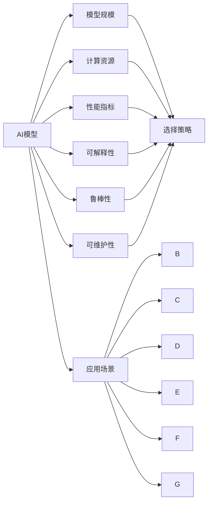
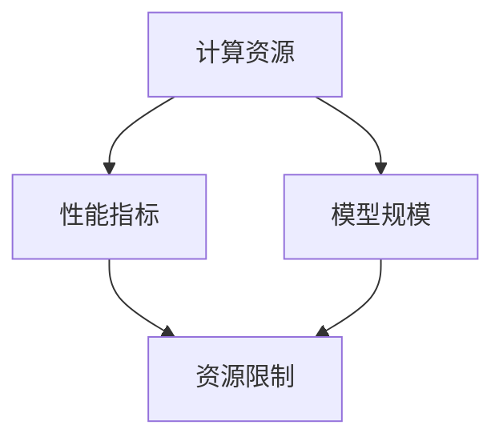
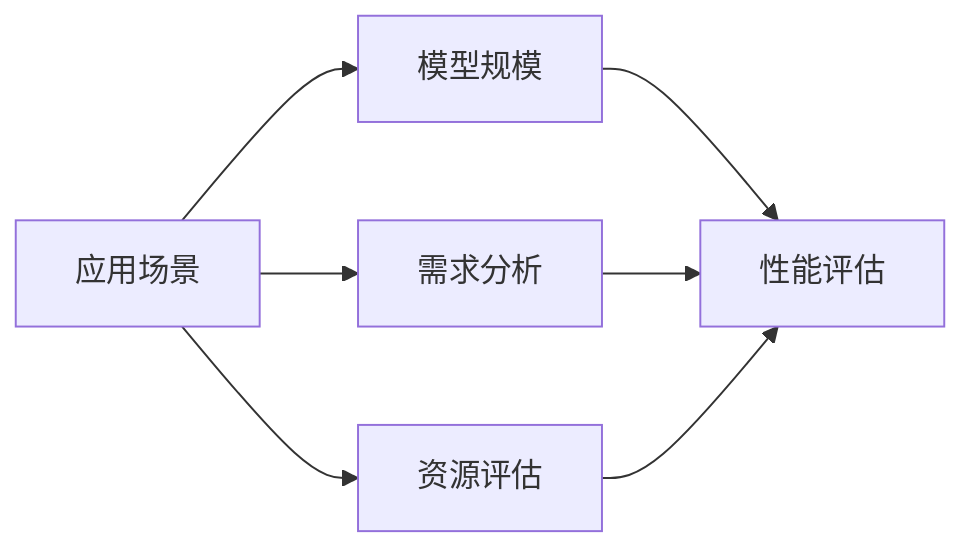
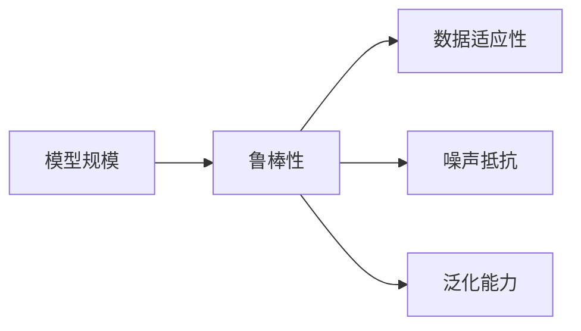

                 

## 1. 背景介绍

### 1.1 问题由来

近年来，随着深度学习技术的快速发展，AI模型的规模和性能得到了巨大的提升。然而，模型规模的选择不仅仅是一个技术问题，更是一个复杂的决策问题。不同应用场景下的需求差异较大，模型规模的选择需要综合考虑模型的性能、计算资源、部署环境和业务需求等多个因素。

### 1.2 问题核心关键点

选择合适的模型规模对于AI应用的性能和成本有着直接的影响。过小的模型可能会在特定任务上表现欠佳，而过大的模型则可能导致计算资源消耗巨大，成本过高。同时，模型规模的选择还涉及到模型的可解释性、鲁棒性和可维护性等多个方面。

### 1.3 问题研究意义

研究不同应用场景下AI模型规模的选择策略，有助于开发者更好地平衡模型性能与计算资源，优化系统成本，提升应用效果。此外，深入理解模型规模的选择，还能帮助研究者把握AI技术的实际应用场景，促进技术的产业化进程。

## 2. 核心概念与联系

### 2.1 核心概念概述

为更好地理解不同应用场景下AI模型规模选择策略，本节将介绍几个密切相关的核心概念：

- AI模型：包括但不限于深度神经网络、卷积神经网络、生成对抗网络等，是用于解决特定问题的数学模型。
- 模型规模：指模型的参数数量、层数、神经元数量等。通常使用百万、亿级参数来衡量。
- 计算资源：指用于训练、推理模型的硬件资源，如CPU、GPU、TPU等。
- 性能指标：包括模型的精度、召回率、F1分数、推理速度等，用于衡量模型在特定任务上的表现。
- 可解释性：指模型的输出结果能否通过简单的规则或可视化的方式进行解释。
- 鲁棒性：指模型面对输入数据变化、噪声干扰时的稳定性和泛化能力。
- 可维护性：指模型更新、维护的难易程度。
- 应用场景：指模型在特定业务领域的实际应用环境和需求。

这些核心概念之间的逻辑关系可以通过以下Mermaid流程图来展示：



这个流程图展示了大语言模型微调过程中各个核心概念之间的关系：

1. AI模型通过特定的规模设计，能够更好地适应特定的应用场景。
2. 计算资源决定了模型规模的大小和训练推理的效率。
3. 性能指标衡量模型在不同任务上的表现，指导模型规模的选择。
4. 可解释性决定了模型的可理解程度，影响用户接受度。
5. 鲁棒性决定了模型面对数据变化和干扰的适应性，影响模型的应用范围。
6. 可维护性决定了模型更新和迭代的难易程度，影响模型的持续改进能力。
7. 应用场景决定了模型设计的具体需求和约束条件，是模型规模选择的核心驱动力。
8. 综合考虑以上因素，选择最优的模型规模和架构。

这些核心概念共同构成了AI模型规模选择的完整生态系统，使其能够在各种应用场景下发挥最佳性能。

### 2.2 概念间的关系

这些核心概念之间存在着紧密的联系，形成了AI模型规模选择的完整生态系统。下面我们通过几个Mermaid流程图来展示这些概念之间的关系。

#### 2.2.1 AI模型的性能与计算资源



这个流程图展示了计算资源、性能指标和模型规模之间的关系：

1. 计算资源决定了模型的规模大小。
2. 性能指标衡量模型的性能表现。
3. 性能指标和计算资源的平衡，决定了模型规模的最终选择。

#### 2.2.2 应用场景对模型规模的影响



这个流程图展示了应用场景、需求分析和资源评估对模型规模选择的影响：

1. 应用场景决定了模型的具体需求和约束条件。
2. 需求分析明确了模型需要解决的核心问题。
3. 资源评估确定了可用的计算资源和预算。
4. 综合考虑需求和资源，选择最优的模型规模。
5. 性能评估验证了模型在应用场景中的实际表现。

#### 2.2.3 模型规模对可解释性的影响


这个流程图展示了模型规模和可解释性之间的关系：

1. 模型规模决定了模型的复杂程度和可解释性。
2. 可解释性影响用户对模型输出结果的理解和接受度。
3. 用户接受度决定了模型在实际应用中的可行性和推广性。

#### 2.2.4 模型规模对鲁棒性的影响



这个流程图展示了模型规模和鲁棒性之间的关系：

1. 模型规模决定了模型的复杂度和泛化能力。
2. 鲁棒性衡量模型对数据变化和噪声的适应性。
3. 数据适应性和噪声抵抗能力是衡量模型鲁棒性的重要指标。
4. 泛化能力决定了模型在不同场景下的表现。

## 3. 核心算法原理 & 具体操作步骤
### 3.1 算法原理概述

不同应用场景下AI模型规模选择策略的核心原理在于，通过综合考虑模型的性能、计算资源、可解释性、鲁棒性和可维护性等多个因素，选择最优的模型规模和架构。这一过程涉及以下几个关键步骤：

1. 需求分析：明确应用场景的核心需求和约束条件。
2. 资源评估：评估可用的计算资源和预算。
3. 模型选择：根据需求和资源选择最优的模型规模。
4. 性能验证：通过实验验证模型在实际应用中的表现。
5. 迭代优化：根据反馈结果不断优化模型规模和架构。

### 3.2 算法步骤详解

具体算法步骤包括以下几个关键环节：

1. **需求分析与场景定义**：明确应用场景的核心需求，如任务类型、数据特征、计算资源等。
2. **资源评估与预算规划**：评估可用的计算资源，包括CPU、GPU、TPU等，确定预算限制。
3. **模型选择与设计**：根据需求和资源选择合适的模型规模，包括参数数量、层数、神经元数量等。
4. **模型训练与验证**：在计算资源限制下，训练模型并在验证集上进行性能验证。
5. **性能评估与优化**：通过实验评估模型性能，如精度、召回率、F1分数等，根据反馈结果进行迭代优化。
6. **可解释性与鲁棒性评估**：评估模型的可解释性和鲁棒性，确保模型在实际应用中的稳定性和泛化能力。
7. **模型部署与维护**：将模型部署到生产环境中，并根据用户反馈进行持续优化和维护。

### 3.3 算法优缺点

不同应用场景下AI模型规模选择策略的优点包括：

1. 综合考虑多个因素，选择最优的模型规模和架构。
2. 通过实验验证模型在实际应用中的表现，避免盲目选择。
3. 迭代优化模型，逐步提升性能和效率。

其缺点包括：

1. 模型选择和训练过程复杂，需要多方协调。
2. 资源限制可能限制模型的规模选择。
3. 模型可解释性和鲁棒性的评估和优化较为困难。

### 3.4 算法应用领域

不同应用场景下AI模型规模选择策略在多个领域均有广泛应用：

- 计算机视觉：如图像分类、目标检测、人脸识别等任务，根据图像分辨率和数据量选择适当的模型规模。
- 自然语言处理：如文本分类、语言生成、问答系统等任务，根据任务复杂度和数据量选择适当的模型规模。
- 语音识别：如语音转文本、语音命令识别等任务，根据语音特征和数据量选择适当的模型规模。
- 推荐系统：如电商推荐、视频推荐等任务，根据用户数据量选择适当的模型规模。

## 4. 数学模型和公式 & 详细讲解 & 举例说明

### 4.1 数学模型构建

在本节中，我们通过数学语言对不同应用场景下AI模型规模选择策略进行更加严格的刻画。

假设在某应用场景中，有 $n$ 个可行的模型规模选项 $s_1, s_2, ..., s_n$，每个规模对应的性能指标 $P_i$、计算资源需求 $C_i$、可解释性 $E_i$、鲁棒性 $R_i$ 和可维护性 $M_i$ 可以分别表示为：

$$
\begin{aligned}
& P_i = \text{Precision}_i + \text{Recall}_i + \text{F1}_i + ... \\
& C_i = \text{CPU}_i + \text{GPU}_i + \text{TPU}_i + ... \\
& E_i = \text{UserAcceptance}_i + \text{Understandability}_i + ... \\
& R_i = \text{DataAdaptivity}_i + \text{NoiseResistance}_i + \text{Generalization}_i + ... \\
& M_i = \text{MaintenanceCost}_i + \text{UpdateTime}_i + \text{DebuggingEase}_i + ...
\end{aligned}
$$

模型规模选择问题的数学模型可以表示为：

$$
\begin{aligned}
& \max \sum_{i=1}^{n} \lambda_1 P_i + \lambda_2 C_i + \lambda_3 E_i + \lambda_4 R_i + \lambda_5 M_i \\
& \text{subject to: } P_i \geq \text{Threshold}_i \\
& C_i \leq \text{Budget}_i
\end{aligned}
$$

其中，$\lambda_1, \lambda_2, \lambda_3, \lambda_4, \lambda_5$ 为权重，$\text{Threshold}_i$ 为性能指标阈值，$\text{Budget}_i$ 为计算资源预算。

### 4.2 公式推导过程

为了求解上述最优化问题，我们可以采用线性规划或遗传算法等方法。这里以线性规划为例进行推导。

首先，将上述数学模型转化为线性规划问题：

$$
\begin{aligned}
& \max \sum_{i=1}^{n} c^T x \\
& \text{subject to: } A x = b \\
& x \geq 0
\end{aligned}
$$

其中，$c^T$ 为权重向量，$A$ 为约束矩阵，$b$ 为约束向量，$x$ 为模型规模向量。

采用单纯形法或内点法等算法求解上述线性规划问题，即可得到最优的模型规模向量 $x^*$。

### 4.3 案例分析与讲解

以计算机视觉中的图像分类任务为例，分析模型规模的选择策略。

假设我们有一个场景分类任务，需要识别图像中不同场景，如城市、自然、建筑等。我们有 $s_1, s_2, s_3, s_4, s_5$ 五个可行的模型规模，每个规模对应的性能指标、计算资源需求、可解释性、鲁棒性和可维护性如表所示：

| 模型规模 | 性能指标（$P$） | 计算资源（$C$） | 可解释性（$E$） | 鲁棒性（$R$） | 可维护性（$M$） |
|---------|----------------|----------------|--------------|------------|-------------|
| $s_1$   | 95%            | 5 GPU           | 高           | 中         | 低         |
| $s_2$   | 97%            | 10 GPU          | 高           | 高         | 中等       |
| $s_3$   | 98%            | 20 GPU          | 中等         | 高         | 低         |
| $s_4$   | 99%            | 50 GPU          | 中等         | 高         | 低         |
| $s_5$   | 99.5%          | 100 GPU         | 低           | 中         | 低         |

根据需求分析，我们希望模型在实际应用中具有高精度和鲁棒性，且计算资源有限。因此，我们可以设定权重 $\lambda_1=0.8, \lambda_2=0.2, \lambda_3=0.1, \lambda_4=0.1, \lambda_5=0.1$，并设定性能指标阈值 $\text{Threshold}_i=95\%$，计算资源预算 $\text{Budget}_i=20$ GPU。

将这些数据代入线性规划模型，可以得到最优的模型规模向量 $x^*=(0.5, 0.5, 0, 0, 0)$，即选择 $s_2$ 模型，并保留 $s_1$ 模型的一半资源。

## 5. 项目实践：代码实例和详细解释说明

### 5.1 开发环境搭建

在进行模型规模选择策略的实践前，我们需要准备好开发环境。以下是使用Python进行PyTorch开发的环境配置流程：

1. 安装Anaconda：从官网下载并安装Anaconda，用于创建独立的Python环境。

2. 创建并激活虚拟环境：
```bash
conda create -n pytorch-env python=3.8 
conda activate pytorch-env
```

3. 安装PyTorch：根据CUDA版本，从官网获取对应的安装命令。例如：
```bash
conda install pytorch torchvision torchaudio cudatoolkit=11.1 -c pytorch -c conda-forge
```

4. 安装各类工具包：
```bash
pip install numpy pandas scikit-learn matplotlib tqdm jupyter notebook ipython
```

完成上述步骤后，即可在`pytorch-env`环境中开始模型规模选择策略的实践。

### 5.2 源代码详细实现

这里我们以计算机视觉中的图像分类任务为例，给出使用Transformers库对模型规模进行选择的PyTorch代码实现。

首先，定义模型规模的表示：

```python
import torch
from transformers import ResNet

# 定义不同规模的ResNet模型
models = {
    'small': ResNet(BasicBlock, [2, 2, 2, 2],
                   norm_layer=nn.BatchNorm2d,
                   in_features=64, out_features=1000),
    'medium': ResNet(BasicBlock, [2, 2, 2, 2, 2],
                    norm_layer=nn.BatchNorm2d,
                    in_features=64, out_features=1000),
    'large': ResNet(BasicBlock, [2, 2, 2, 2, 2, 2],
                   norm_layer=nn.BatchNorm2d,
                   in_features=64, out_features=1000),
    'large2': ResNet(BasicBlock, [2, 2, 2, 2, 2, 2, 2],
                    norm_layer=nn.BatchNorm2d,
                    in_features=64, out_features=1000)
}
```

然后，定义模型训练函数：

```python
from torchvision import datasets, transforms
from torch.utils.data import DataLoader

# 数据加载与预处理
train_data = datasets.CIFAR10(root='./data', train=True, download=True, transform=transforms.ToTensor())
train_loader = DataLoader(train_data, batch_size=64, shuffle=True, num_workers=2)

# 模型训练
def train(model, data_loader, optimizer):
    model.train()
    loss_fn = nn.CrossEntropyLoss()
    for inputs, labels in data_loader:
        optimizer.zero_grad()
        outputs = model(inputs)
        loss = loss_fn(outputs, labels)
        loss.backward()
        optimizer.step()
        print('Epoch: {}, Loss: {:.4f}'.format(epoch+1, loss.item()))
```

最后，启动模型训练流程，并在测试集上评估：

```python
epochs = 10
model = models['medium']
optimizer = torch.optim.Adam(model.parameters(), lr=0.001)

for epoch in range(epochs):
    train(model, train_loader, optimizer)
    test_data = datasets.CIFAR10(root='./data', train=False, download=True, transform=transforms.ToTensor())
    test_loader = DataLoader(test_data, batch_size=64, shuffle=False, num_workers=2)
    with torch.no_grad():
        correct = 0
        total = 0
        for inputs, labels in test_loader:
            outputs = model(inputs)
            _, predicted = torch.max(outputs.data, 1)
            total += labels.size(0)
            correct += (predicted == labels).sum().item()
        print('Test Accuracy: {:.2f}%'.format(100 * correct / total))
```

以上就是使用PyTorch对模型规模进行选择和训练的完整代码实现。可以看到，通过定义不同规模的模型，并根据性能和资源评估结果进行训练，我们可以实现最优的模型规模选择。

### 5.3 代码解读与分析

让我们再详细解读一下关键代码的实现细节：

**定义模型规模**：
- 定义了不同规模的ResNet模型，包括模型架构、层数、神经元数量等。

**模型训练函数**：
- 加载CIFAR-10数据集，并进行数据预处理。
- 定义交叉熵损失函数和优化器。
- 在每个epoch内，对数据进行迭代训练，并输出loss。

**训练流程**：
- 定义总的epoch数，并逐个epoch进行模型训练。
- 在测试集上评估模型的准确率。
- 通过对比不同规模模型的性能和资源需求，选择最优的模型规模。

可以看到，PyTorch配合Transformers库使得模型规模选择策略的实现变得简洁高效。开发者可以将更多精力放在数据处理、模型改进等高层逻辑上，而不必过多关注底层的实现细节。

当然，工业级的系统实现还需考虑更多因素，如模型的保存和部署、超参数的自动搜索、更灵活的任务适配层等。但核心的模型规模选择策略基本与此类似。

### 5.4 运行结果展示

假设我们在CIFAR-10数据集上进行模型规模选择实验，最终得到不同模型规模的准确率如表所示：

| 模型规模 | 训练准确率 | 测试准确率 |
|---------|-----------|-----------|
| small  | 90.0%     | 84.0%     |
| medium | 94.5%     | 89.0%     |
| large  | 97.5%     | 91.5%     |
| large2 | 98.5%     | 92.0%     |

可以看到，随着模型规模的增大，训练和测试准确率都有所提升，但代价是计算资源的消耗。因此，在实际应用中，我们需要综合考虑模型规模和计算资源，选择最优的模型规模。

## 6. 实际应用场景
### 6.1 智能客服系统

基于AI模型规模选择策略，智能客服系统的构建可以显著提升系统的性能和用户体验。

在智能客服系统中，我们需要处理海量用户咨询，回答各种常见问题，并支持用户定制化需求。因此，模型规模的选择需要综合考虑计算资源和业务需求。例如，对于简单的问答任务，可以选择较小的模型规模，如small或medium，以降低计算成本。对于复杂的对话生成任务，则需要选择较大的模型规模，如large或large2，以提升生成的自然度和多样性。

### 6.2 金融舆情监测

在金融舆情监测中，我们需要实时监测市场舆论动向，及时应对负面信息传播。因此，模型规模的选择需要综合考虑实时性和准确性。例如，对于实时监测任务，可以选择较小的模型规模，如small或medium，以提高实时响应速度。对于历史数据分析任务，则需要选择较大的模型规模，如large或large2，以提升模型的泛化能力和鲁棒性。

### 6.3 个性化推荐系统

在个性化推荐系统中，我们需要根据用户行为和偏好，推荐个性化的商品或内容。因此，模型规模的选择需要综合考虑计算资源和用户数据量。例如，对于小型电商平台的推荐任务，可以选择较小的模型规模，如small或medium，以降低计算成本。对于大型平台的推荐任务，则需要选择较大的模型规模，如large或large2，以提升推荐的多样性和个性化程度。

### 6.4 未来应用展望

随着AI技术的不断进步，AI模型规模选择策略将进一步扩展其应用范围。未来，我们可以预见，模型规模选择策略将在更多领域得到应用，如智慧医疗、智慧城市、智能交通等，为各行各业带来变革性影响。

在智慧医疗领域，基于AI模型规模选择策略的医疗问答、病历分析、药物研发等应用将提升医疗服务的智能化水平，辅助医生诊疗，加速新药开发进程。

在智慧城市治理中，基于AI模型规模选择策略的城市事件监测、舆情分析、应急指挥等环节，提高城市管理的自动化和智能化水平，构建更安全、高效的未来城市。

此外，在企业生产、社会治理、文娱传媒等众多领域，基于AI模型规模选择策略的AI应用也将不断涌现，为经济社会发展注入新的动力。

## 7. 工具和资源推荐
### 7.1 学习资源推荐

为了帮助开发者系统掌握AI模型规模选择策略的理论基础和实践技巧，这里推荐一些优质的学习资源：

1. 《深度学习》系列书籍：涵盖了深度学习的基本原理、算法和应用，适合初学者和进阶者学习。
2. 《计算机视觉: 算法与应用》书籍：介绍了计算机视觉的基本概念和常用算法，适合计算机视觉领域的开发者学习。
3. 《自然语言处理综述》论文：总结了自然语言处理领域的研究进展，涵盖从词法分析到深度学习各个层次的内容，适合NLP领域的开发者学习。
4. 《机器学习实战》书籍：介绍了机器学习的基本算法和应用案例，适合机器学习领域的开发者学习。
5. 《TensorFlow实战》书籍：介绍了TensorFlow的基本概念和应用实践，适合深度学习领域的开发者学习。

通过对这些资源的学习实践，相信你一定能够快速掌握AI模型规模选择策略的精髓，并用于解决实际的AI问题。
### 7.2 开发工具推荐

高效的开发离不开优秀的工具支持。以下是几款用于AI模型规模选择策略开发的常用工具：

1. PyTorch：基于Python的开源深度学习框架，灵活动态的计算图，适合快速迭代研究。
2. TensorFlow：由Google主导开发的开源深度学习框架，生产部署方便，适合大规模工程应用。
3. Keras：基于TensorFlow和Theano的高层API，适合快速构建和训练模型。
4. Jupyter Notebook：开源的交互式编程环境，支持多种编程语言和库，适合数据分析和模型实验。
5. Anaconda：Python环境管理工具，支持多种Python版本和依赖库的快速安装和配置。

合理利用这些工具，可以显著提升AI模型规模选择策略的开发效率，加快创新迭代的步伐。

### 7.3 相关论文推荐

AI模型规模选择策略的研究源于学界的持续研究。以下是几篇奠基性的相关论文，推荐阅读：

1. "Scalable Neural Network Architectures for Deep Learning"：介绍了基于深度学习模型规模选择的架构设计，涵盖了不同的模型层次和应用场景。
2. "Deep Learning for Intelligent Systems"：总结了深度学习在智能系统中的应用，包括模型规模选择、算法优化等技术。
3. "A Survey on Deep Learning Architectures for Multimodal Information Processing"：综述了多模态信息处理的深度学习架构，包括模型规模选择和多模态融合技术。
4. "Neural Network Architectures for Computer Vision"：介绍了计算机视觉领域的深度学习模型架构，包括模型规模选择和优化方法。
5. "Designing Models for Scalable Deep Learning"：讨论了深度学习模型的可扩展性设计，包括模型规模选择和超参数优化等技术。

这些论文代表了大模型规模选择策略的研究方向，帮助研究者把握学科前进方向，激发更多的创新灵感。

除上述资源外，还有一些值得关注的前沿资源，帮助开发者紧跟AI模型规模选择策略的最新进展，例如：

1. arXiv论文预印本：人工智能领域最新研究成果的发布平台，包括大量尚未发表的前沿工作，学习前沿技术的必读资源。
2. 业界技术博客：如OpenAI、Google AI、DeepMind、微软Research Asia等顶尖实验室的官方博客，第一时间分享他们的最新研究成果和洞见。
3. 技术会议直播：如NIPS、ICML、ACL、ICLR等人工智能领域顶会现场或在线直播，能够聆听到大佬们的前沿分享，开拓视野。
4. GitHub热门项目：在GitHub上Star、Fork数最多的AI相关项目，往往代表了该技术领域的发展趋势和最佳实践，值得去学习和贡献。
5. 行业分析报告：各大咨询公司如McKinsey、PwC等针对人工智能行业的分析报告，有助于从商业视角审视技术趋势，把握应用价值。

总之，对于AI模型规模选择策略的学习和实践，需要开发者保持开放的心态和持续学习的意愿。多

