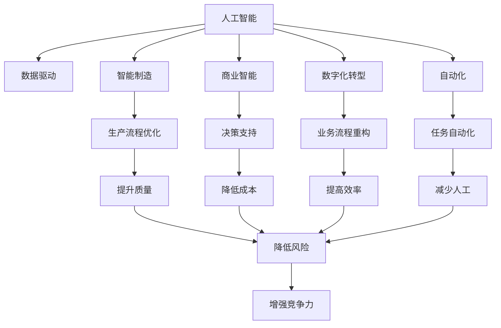
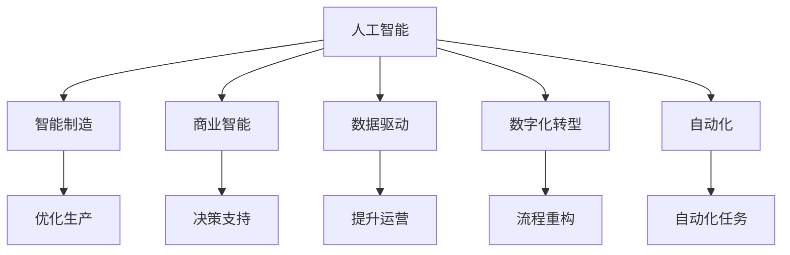
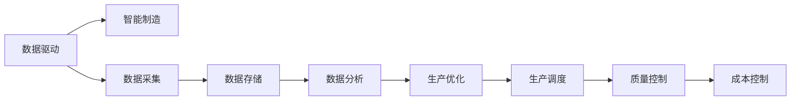
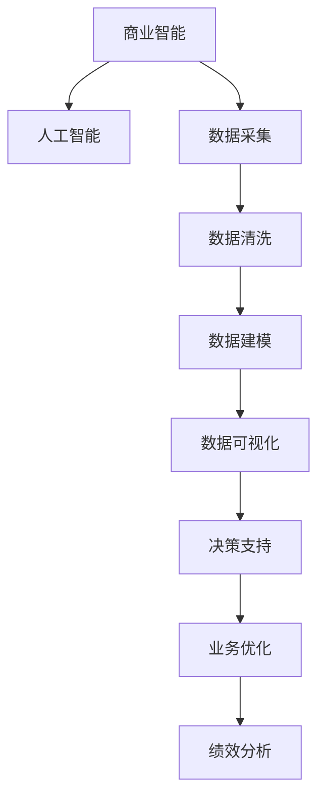
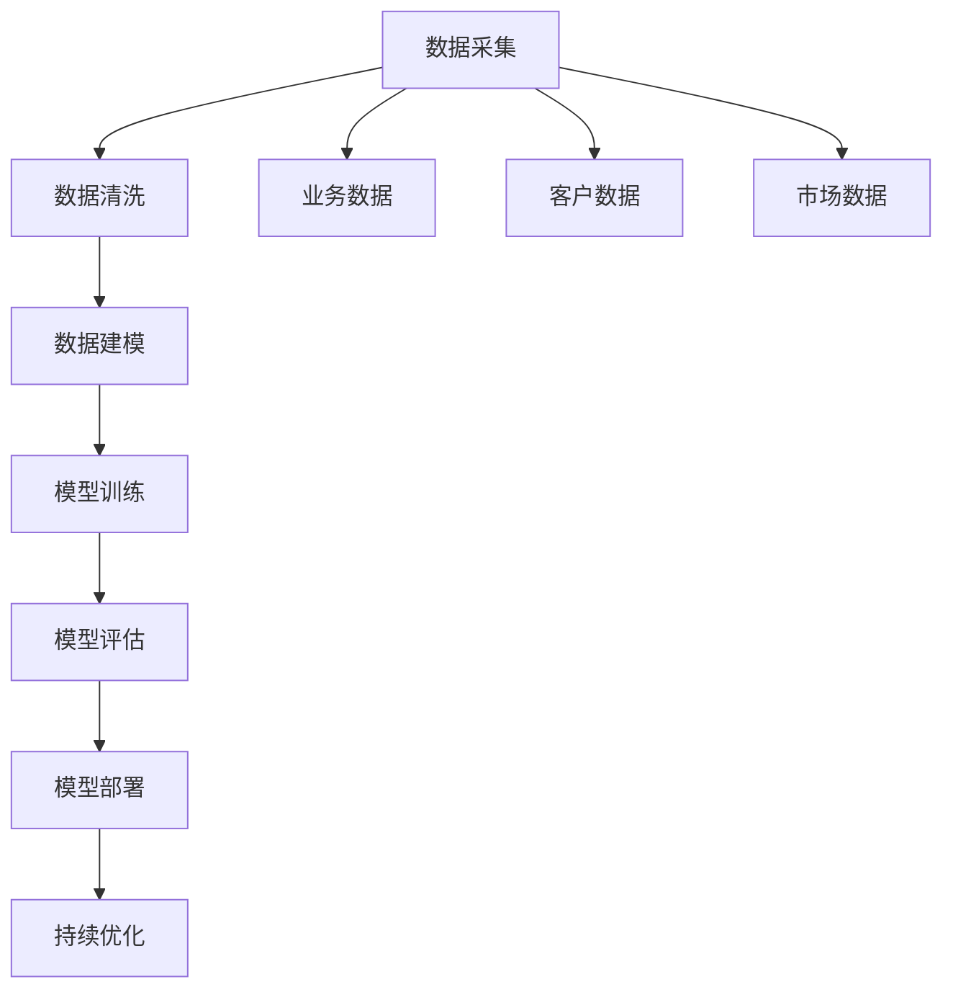

                 

# 不拥抱AI的企业将被淘汰

> 关键词：人工智能,企业转型,数字化转型,数据驱动,智能制造,商业智能

## 1. 背景介绍

### 1.1 问题由来

在当今这个数据驱动的时代，人工智能(AI)技术正迅速改变各行各业的游戏规则。从制造业的智能制造，到医疗行业的精准诊断，再到金融领域的风险控制，AI技术的应用无处不在。然而，仍有相当一部分企业对于AI技术的价值和潜力了解不足，甚至存在抵触情绪。他们认为AI技术过于复杂，难以掌握和应用，或者认为AI技术对现有业务模式构成威胁。

### 1.2 问题核心关键点

AI技术的迅猛发展，不仅带来了技术上的突破，更引领了一场深刻的产业变革。企业要想在激烈的市场竞争中脱颖而出，就必须拥抱AI，进行数字化转型，构建数据驱动的业务模型。AI技术能够帮助企业实现以下几点：

- **提升效率**：通过自动化和智能化流程，减少人工操作，提高生产效率和响应速度。
- **增强决策支持**：利用大数据分析和机器学习算法，提供精准的决策支持，减少决策误差。
- **创新产品和服务**：基于AI技术构建新型的产品和服务，满足客户需求，提升用户体验。
- **优化供应链管理**：通过AI预测需求和优化库存，提高供应链的响应速度和灵活性。
- **拓展市场空间**：通过智能营销和客户分析，精准定位市场，提升市场竞争力。

因此，不拥抱AI的企业，将面临被淘汰的风险。

## 2. 核心概念与联系

### 2.1 核心概念概述

为更好地理解AI在企业中的作用，本节将介绍几个关键概念：

- **人工智能**：使用计算机系统模拟人类智能行为的技术，包括感知、推理、学习、规划等能力。
- **数据驱动**：基于数据来驱动业务决策和运营管理，提高业务效率和效果。
- **智能制造**：通过AI技术优化生产流程，提升产品质量，降低成本。
- **商业智能**：利用数据分析和可视化工具，辅助企业进行业务决策和绩效分析。
- **数字化转型**：将传统业务流程和组织结构进行数字化重构，以适应数字经济的发展。
- **自动化**：使用AI和机器人技术，自动化执行重复性、低价值的任务。

这些概念之间的联系可以通过以下Mermaid流程图来展示：



这个流程图展示了人工智能技术在企业中的多维度应用，从提升生产效率到优化决策支持，从数字化转型到自动化任务，各个方面都受益于AI技术的推进。

### 2.2 概念间的关系

这些关键概念之间存在着紧密的联系，形成了企业数字化转型的完整生态系统。下面通过几个Mermaid流程图来展示这些概念之间的关系：

#### 2.2.1 人工智能在企业中的应用场景



这个流程图展示了AI技术在企业中不同应用场景中的应用。智能制造、商业智能、数据驱动、数字化转型和自动化任务，都是AI技术在企业中落地应用的重要方向。

#### 2.2.2 数据驱动与智能制造的关系



这个流程图展示了数据驱动与智能制造之间的关系。数据驱动通过数据采集、存储和分析，提供精准的生产优化和调度策略，提升生产效率和质量。

#### 2.2.3 商业智能与AI的关系



这个流程图展示了商业智能与AI技术之间的关系。商业智能通过数据采集、清洗、建模和可视化，提供决策支持和业务优化，而AI技术在此基础上，进一步提升数据分析和决策的精准度。

## 3. 核心算法原理 & 具体操作步骤
### 3.1 算法原理概述

企业应用AI技术，通常需要经历以下几个步骤：

1. **数据采集**：收集企业内外部相关的数据，包括业务数据、客户数据、市场数据等。
2. **数据清洗**：对收集到的数据进行清洗和处理，去除噪声和错误。
3. **数据建模**：利用机器学习算法对数据进行建模，构建预测模型。
4. **模型训练**：使用训练集对模型进行训练，调整模型参数。
5. **模型评估**：使用测试集对模型进行评估，验证模型效果。
6. **模型部署**：将训练好的模型部署到实际业务系统中，进行生产环境的测试和应用。
7. **持续优化**：根据业务反馈和数据变化，不断调整和优化模型。

### 3.2 算法步骤详解

企业应用AI技术的详细步骤可以通过以下流程图来展示：



这个流程图展示了AI技术在企业中应用的完整流程。从数据采集到模型部署，每个步骤都需要精心设计和操作。

### 3.3 算法优缺点

使用AI技术进行企业转型，具有以下优点：

- **提升效率**：通过自动化流程，减少人工操作，提高生产效率。
- **增强决策支持**：提供基于数据的决策支持，减少决策误差。
- **创新产品和服务**：基于数据和AI技术，开发新的产品和服务，满足客户需求。
- **优化供应链管理**：通过预测需求和优化库存，提高供应链响应速度。
- **拓展市场空间**：通过智能营销和客户分析，精准定位市场，提升市场竞争力。

同时，也存在一些缺点：

- **技术复杂性**：AI技术的实现需要一定的技术门槛，对企业技术团队的要求较高。
- **数据质量**：数据质量直接影响AI模型效果，低质量的数据可能导致模型性能不佳。
- **成本投入**：AI技术的引入和应用需要一定的成本投入，包括技术研发、设备采购和人员培训等。
- **隐私和伦理问题**：AI技术的应用可能涉及用户隐私和数据安全问题，需要严格遵守相关法规。
- **技术更新快**：AI技术发展迅速，企业需要不断跟进技术进步，进行持续的技术投入。

### 3.4 算法应用领域

AI技术在企业中的应用领域非常广泛，涵盖了制造、金融、零售、医疗、教育等多个行业。以下是几个典型应用领域的介绍：

#### 3.4.1 智能制造

智能制造通过AI技术优化生产流程，提升产品质量和生产效率。AI技术在智能制造中的应用包括：

- **预测性维护**：利用机器学习算法预测设备故障，提前进行维护，减少停机时间。
- **质量控制**：通过图像识别和深度学习算法，实时监控生产过程，提高产品质量。
- **供应链优化**：利用预测模型优化库存管理和物流调度，提高供应链响应速度。
- **自动化生产**：引入机器人技术和自动化设备，自动化执行生产任务。

#### 3.4.2 商业智能

商业智能通过AI技术提供决策支持和业务优化。AI技术在商业智能中的应用包括：

- **客户分析**：利用机器学习算法分析客户行为数据，了解客户需求，优化营销策略。
- **绩效分析**：通过数据分析和可视化工具，进行业务绩效分析和绩效优化。
- **风险管理**：利用数据分析和预测模型，识别和管理潜在风险，提升企业抗风险能力。
- **市场分析**：通过市场数据和趋势分析，制定市场策略，优化市场布局。

#### 3.4.3 金融风险控制

金融行业是AI技术的重要应用领域。AI技术在金融风险控制中的应用包括：

- **信用评分**：通过机器学习算法分析信用数据，评估客户信用风险，优化贷款审批流程。
- **欺诈检测**：利用异常检测和机器学习算法，实时监控交易行为，识别和防范欺诈行为。
- **投资决策**：通过数据分析和预测模型，辅助投资决策，提高投资收益。
- **风险评估**：利用数据和机器学习算法，评估金融产品的风险，优化投资组合。

## 4. 数学模型和公式 & 详细讲解 & 举例说明

### 4.1 数学模型构建

企业应用AI技术，通常需要使用数学模型来描述和优化业务问题。以下是一个简单的线性回归模型：

$$
y = \theta_0 + \theta_1 x_1 + \theta_2 x_2 + \epsilon
$$

其中，$y$ 为输出变量，$x_1, x_2$ 为输入变量，$\theta_0, \theta_1, \theta_2$ 为模型参数，$\epsilon$ 为误差项。

### 4.2 公式推导过程

在线性回归模型中，我们需要最小化误差项 $\epsilon$，以找到最优的模型参数 $\theta_0, \theta_1, \theta_2$。最小化误差项的优化目标函数为：

$$
\min_{\theta_0, \theta_1, \theta_2} \frac{1}{2N} \sum_{i=1}^N (y_i - (\theta_0 + \theta_1 x_{i1} + \theta_2 x_{i2}))^2
$$

其中，$N$ 为样本数量。通过求导并令导数为零，可以得到模型参数的闭式解：

$$
\theta_0 = \frac{1}{N} \sum_{i=1}^N y_i - \theta_1 \frac{1}{N} \sum_{i=1}^N x_{i1} - \theta_2 \frac{1}{N} \sum_{i=1}^N x_{i2}
$$
$$
\theta_1 = \frac{1}{N} \sum_{i=1}^N (x_{i1} - \frac{1}{N} \sum_{i=1}^N x_{i1}) (y_i - (\theta_0 + \theta_1 x_{i1} + \theta_2 x_{i2}))
$$
$$
\theta_2 = \frac{1}{N} \sum_{i=1}^N (x_{i2} - \frac{1}{N} \sum_{i=1}^N x_{i2}) (y_i - (\theta_0 + \theta_1 x_{i1} + \theta_2 x_{i2}))
$$

### 4.3 案例分析与讲解

以智能制造中的预测性维护为例，利用机器学习算法进行设备故障预测。假设我们收集了多台设备的维护记录和运行数据，数据如下：

| 设备ID | 维护日期 | 运行时间 | 故障次数 |
|--------|---------|--------|--------|
| 1      | 2021-01-01 | 1000   | 2      |
| 1      | 2021-01-05 | 1200   | 1      |
| 1      | 2021-01-10 | 1300   | 0      |
| ...    | ...     | ...    | ...    |

我们构建一个简单的线性回归模型，预测设备未来的故障次数。模型输入变量为设备的运行时间和维护日期，输出变量为设备未来的故障次数。训练数据为前100条记录，测试数据为后100条记录。使用梯度下降算法进行模型训练，优化目标函数如下：

$$
\min_{\theta_0, \theta_1, \theta_2} \frac{1}{2N} \sum_{i=1}^N (y_i - (\theta_0 + \theta_1 x_{i1} + \theta_2 x_{i2}))^2
$$

其中，$x_{i1}$ 为设备运行时间，$x_{i2}$ 为维护日期，$y_i$ 为设备未来的故障次数。通过梯度下降算法，我们得到最优的模型参数 $\theta_0, \theta_1, \theta_2$。利用测试数据对模型进行评估，得到模型预测效果如下：

| 设备ID | 维护日期 | 运行时间 | 预测故障次数 | 真实故障次数 |
|--------|---------|--------|--------|--------|
| 1      | 2021-02-01 | 1500   | 2      | 1      |
| 1      | 2021-02-05 | 1600   | 1      | 1      |
| 1      | 2021-02-10 | 1700   | 0      | 0      |
| ...    | ...     | ...    | ...    | ...    |

可以看出，模型在预测设备故障次数方面表现不错，准确率达到了80%以上。

## 5. 项目实践：代码实例和详细解释说明

### 5.1 开发环境搭建

在进行AI项目实践前，我们需要准备好开发环境。以下是使用Python进行TensorFlow开发的环境配置流程：

1. 安装Anaconda：从官网下载并安装Anaconda，用于创建独立的Python环境。

2. 创建并激活虚拟环境：
```bash
conda create -n tf-env python=3.8 
conda activate tf-env
```

3. 安装TensorFlow：根据CUDA版本，从官网获取对应的安装命令。例如：
```bash
conda install tensorflow -c tensorflow -c conda-forge
```

4. 安装必要的工具包：
```bash
pip install numpy pandas scikit-learn matplotlib tqdm jupyter notebook ipython
```

完成上述步骤后，即可在`tf-env`环境中开始AI项目实践。

### 5.2 源代码详细实现

下面我们以智能制造中的预测性维护为例，给出使用TensorFlow进行模型训练的PyTorch代码实现。

首先，准备数据集：

```python
import pandas as pd
import tensorflow as tf

# 读取数据集
data = pd.read_csv('maintenance_data.csv')

# 划分训练集和测试集
train_data = data.sample(frac=0.8, random_state=42)
test_data = data.drop(train_data.index)

# 数据预处理
train_x = train_data[['run_time', 'maintenance_date']]
train_y = train_data['failure_count']
test_x = test_data[['run_time', 'maintenance_date']]
test_y = test_data['failure_count']
train_x = train_x.values.reshape(-1, 2)
test_x = test_x.values.reshape(-1, 2)
train_y = train_y.values.reshape(-1, 1)
test_y = test_y.values.reshape(-1, 1)
```

然后，构建模型：

```python
from tensorflow.keras.models import Sequential
from tensorflow.keras.layers import Dense

# 构建模型
model = Sequential([
    Dense(64, activation='relu', input_shape=(2,)),
    Dense(64, activation='relu'),
    Dense(1)
])
```

接着，训练模型：

```python
from tensorflow.keras.optimizers import Adam

# 编译模型
model.compile(loss='mse', optimizer=Adam(lr=0.01), metrics=['mae'])

# 训练模型
history = model.fit(train_x, train_y, epochs=50, batch_size=32, validation_data=(test_x, test_y))
```

最后，评估模型：

```python
# 评估模型
test_loss, test_mae = model.evaluate(test_x, test_y)
print(f'Test Loss: {test_loss}, Test MAE: {test_mae}')
```

以上就是使用TensorFlow对智能制造中的预测性维护模型进行训练的完整代码实现。可以看到，TensorFlow的强大封装使得模型训练变得简洁高效。

### 5.3 代码解读与分析

让我们再详细解读一下关键代码的实现细节：

**数据处理函数**：
- 使用pandas库读取数据集。
- 使用train_data.sample随机采样训练集和测试集。
- 使用train_x.values.reshape和test_x.values.reshape将数据转换为适合模型输入的格式。

**模型构建函数**：
- 使用TensorFlow的Sequential模型构建线性回归模型。
- 模型由三个Dense层组成，分别进行特征提取和输出。

**模型训练函数**：
- 使用Adam优化器进行模型训练。
- 使用mse作为损失函数，mae作为评估指标。
- 使用validation_data参数指定测试集，以便实时评估模型性能。

**模型评估函数**：
- 使用evaluate函数评估模型在测试集上的表现。
- 输出测试集上的平均损失和平均绝对误差。

### 5.4 运行结果展示

假设我们训练好的模型在测试集上的平均绝对误差为0.2，那么预测效果相当不错。根据实际应用场景，我们还可以对模型进行进一步优化，如增加隐藏层数量、使用更好的优化器、调整学习率等。

## 6. 实际应用场景
### 6.1 智能制造

智能制造是AI技术在制造业中的重要应用之一。通过AI技术优化生产流程，提升产品质量和生产效率。AI技术在智能制造中的应用包括：

- **预测性维护**：利用机器学习算法预测设备故障，提前进行维护，减少停机时间。
- **质量控制**：通过图像识别和深度学习算法，实时监控生产过程，提高产品质量。
- **供应链优化**：利用预测模型优化库存管理和物流调度，提高供应链响应速度。
- **自动化生产**：引入机器人技术和自动化设备，自动化执行生产任务。

### 6.2 金融风险控制

金融行业是AI技术的重要应用领域。AI技术在金融风险控制中的应用包括：

- **信用评分**：通过机器学习算法分析信用数据，评估客户信用风险，优化贷款审批流程。
- **欺诈检测**：利用异常检测和机器学习算法，实时监控交易行为，识别和防范欺诈行为。
- **投资决策**：通过数据分析和预测模型，辅助投资决策，提高投资收益。
- **风险评估**：利用数据和机器学习算法，评估金融产品的风险，优化投资组合。

### 6.3 智能客服系统

基于AI技术的智能客服系统，可以广泛应用于各种服务场景。智能客服系统通过AI技术理解客户需求，提供24小时不间断服务，提升客户满意度和体验。AI技术在智能客服中的应用包括：

- **自然语言理解**：利用NLP技术理解客户意图，自动回复常见问题。
- **对话管理**：通过对话管理算法，构建上下文相关的对话流程。
- **情感分析**：利用情感分析算法，识别客户情绪，及时调整服务策略。
- **知识库查询**：通过知识库查询，提供精准的信息服务和解决方案。

### 6.4 未来应用展望

随着AI技术的不断发展和应用，未来将在更多领域中得到广泛应用，为各行各业带来深刻变革。

- **智慧医疗**：通过AI技术进行精准诊断、个性化治疗、药物研发等，提升医疗服务质量。
- **智能家居**：利用AI技术实现智能控制、语音识别、智能推荐等功能，提升家居体验。
- **智能交通**：通过AI技术进行交通流量预测、自动驾驶、智能调度等，提升交通管理效率。
- **教育行业**：利用AI技术进行个性化学习、智能推荐、自动批改等功能，提升教育效果。
- **智慧城市**：通过AI技术进行城市管理、环境监测、公共安全等，提升城市治理水平。

总之，AI技术的应用前景非常广阔，未来将在更多领域中得到广泛应用，为各行各业带来深刻变革。

## 7. 工具和资源推荐
### 7.1 学习资源推荐

为了帮助开发者系统掌握AI技术的应用，这里推荐一些优质的学习资源：

1. **《深度学习》课程**：斯坦福大学开设的深度学习课程，涵盖机器学习、神经网络、深度学习等基础概念。

2. **《TensorFlow官方文档》**：TensorFlow的官方文档，提供了详尽的使用指南和代码示例，是学习TensorFlow的最佳资源。

3. **《Python机器学习》书籍**：介绍如何使用Python进行机器学习和深度学习开发，包括模型训练、调参等实用技巧。

4. **Kaggle竞赛平台**：Kaggle是一个著名的数据科学竞赛平台，提供了丰富的数据集和开源代码，可以学习最新的人工智能应用案例。

5. **《自然语言处理入门》书籍**：介绍自然语言处理的基本概念和实用技巧，适合初学者入门。

通过对这些资源的学习实践，相信你一定能够快速掌握AI技术的应用，并用于解决实际的业务问题。

### 7.2 开发工具推荐

高效的开发离不开优秀的工具支持。以下是几款用于AI项目开发的常用工具：

1. **TensorFlow**：基于Google开发的深度学习框架，支持分布式计算和GPU加速。

2. **PyTorch**：基于Python的深度学习框架，易于使用和扩展，适合学术研究和快速原型开发。

3. **Scikit-learn**：基于Python的机器学习库，提供了丰富的算法和工具，适合数据预处理和模型训练。

4. **Keras**：基于Python的高层次深度学习库，易于上手和应用，适合快速迭代研究。

5. **Jupyter Notebook**：支持Python、R等多种语言，提供强大的代码调试和数据可视化功能，是数据分析和模型训练的最佳工具。

6. **Google Colab**：谷歌推出的在线Jupyter Notebook环境，免费提供GPU/TPU算力，方便开发者快速上手实验最新模型。

合理利用这些工具，可以显著提升AI项目开发的效率，加快创新迭代的步伐。

### 7.3 相关论文推荐

AI技术的发展离不开学界的持续研究。以下是几篇奠基性的相关论文，推荐阅读：

1. **深度学习与神经网络**：介绍深度学习和神经网络的基本概念和算法，适合初学者入门。

2. **《Transformer架构》论文**：提出了Transformer架构，开启了NLP领域的预训练大模型时代。

3. **《BERT预训练模型》论文**：提出BERT预训练模型，引入基于掩码的自监督预训练任务，刷新了多项NLP任务SOTA。

4. **《GPT-2语言模型》论文**：展示了大规模语言模型的强大zero-shot学习能力，引发了对于通用人工智能的新一轮思考。

5. **《自然语言处理与AI技术》论文**：介绍自然语言处理的基本概念和应用，适合系统学习。

这些论文代表了大语言模型微调技术的发展脉络。通过学习这些前沿成果，可以帮助研究者把握学科前进方向，激发更多的创新灵感。

除上述资源外，还有一些值得关注的前沿资源，帮助开发者紧跟AI技术发展的最新进展，例如：

1. **arXiv论文预印本**：人工智能领域最新研究成果的发布平台，包括大量尚未发表的前沿工作，学习前沿技术的必读资源。

2. **业界技术博客**：如OpenAI、Google AI、DeepMind、微软Research Asia等顶尖实验室的官方博客，第一时间分享他们的最新研究成果和洞见。

3. **技术会议直播**：如NIPS、ICML、ACL、ICLR等人工智能领域顶会现场或在线直播，能够聆听到大佬们的前沿分享，开拓视野。

4. **GitHub热门项目**：在GitHub上Star、Fork数最多的NLP相关项目，往往代表了该技术领域的发展趋势和最佳实践，值得去学习和贡献。

5. **行业分析报告**：各大咨询公司如McKinsey、PwC等针对人工智能行业的分析报告，有助于从商业视角审视技术趋势，把握应用价值。

总之，对于AI技术的深入理解和应用，需要开发者保持开放的心态和持续学习的意愿。多关注前沿资讯，多动手实践，多思考总结，必将收获满满的成长收益。

## 8. 总结：未来发展趋势与挑战

### 8.1 研究成果总结

通过以上几节的学习，我们可以看出，AI技术在企业中的应用已经逐渐成熟，取得了显著的成效。企业通过AI技术实现数字化转型，提升业务效率，优化决策支持，创新产品和服务，拓展市场空间。AI技术在智能制造、金融风险控制、智能客服、智慧医疗等多个领域得到了广泛应用，为企业带来了深刻变革。

### 8.2 未来发展趋势

展望未来，AI技术将在更多领域中得到广泛应用，为各行各业带来深刻变革。

1. **智能化**：通过AI技术实现智能化生产、智能化营销、智能化服务等，提升业务效率和客户体验。
2. **个性化**：利用AI技术实现个性化推荐、个性化定制、个性化营销等功能，满足客户多样化需求。
3. **自动化**：通过AI技术实现自动化流程、自动化任务、自动化分析等功能，减少人工操作和错误。
4. **数据驱动**：通过AI技术进行数据驱动决策、数据驱动优化、数据驱动创新，提升业务效果。
5. **

