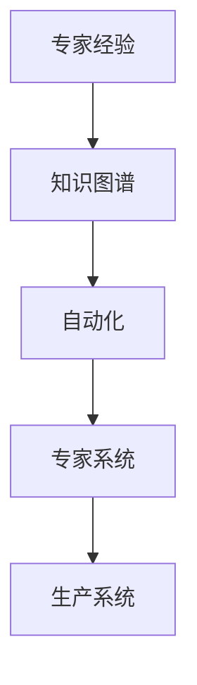

                 

# 专家经验在生产中的固化

## 1. 背景介绍

在当今快速变化的信息技术领域，专家经验往往是推动技术发展和创新的关键。然而，将专家经验转化为生产系统的一部分，使之能够在实际应用中发挥作用，是一个既复杂又重要的过程。专家经验往往具有高度主观性和复杂性，如何有效地将其固化到技术系统中，是一个值得深入探讨的问题。本文将围绕这一主题，详细讨论将专家经验固化到生产系统中的核心概念、算法原理、具体操作步骤，以及应用场景和未来展望。

## 2. 核心概念与联系

### 2.1 核心概念概述

在探讨如何将专家经验固化到生产系统中之前，首先需要明确一些关键概念：

- **专家经验**：指具有高度专业性、复杂性和实践性的知识，通常难以通过简单的文档或代码实现。
- **生产系统**：指将专家经验转化为实际应用的技术系统，能够自动地执行专家任务和决策。
- **自动化**：指通过技术手段，减少对人工干预的依赖，提高系统处理效率和准确性。
- **专家系统**：一种基于专家知识的智能系统，能够模拟专家的决策过程，解决复杂问题。
- **知识图谱**：一种结构化的知识表示方式，将专家知识组织成图结构，便于检索和应用。

这些概念相互联系，共同构成了将专家经验固化到生产系统的整体框架。

### 2.2 概念间的关系

专家经验固化到生产系统，是一个涉及知识表示、自动化、专家系统和知识图谱等多重技术手段的复杂过程。其关系可以概括为以下几个方面：

- 专家经验通过知识图谱进行结构化表示，便于在生产系统中进行检索和应用。
- 自动化技术，如机器学习和自然语言处理，用于从专家经验中提取知识和规则，构建专家系统。
- 专家系统能够模拟专家的决策过程，通过自动化手段执行专家任务。
- 生产系统通过知识图谱和专家系统，实现对专家经验的自动化应用，提升系统性能和效率。

这些概念之间的关系可以用以下Mermaid流程图表示：



### 2.3 核心概念的整体架构

将专家经验固化到生产系统，可以概括为以下几个关键步骤：

1. **知识提取**：从专家经验中提取有价值的信息和规则。
2. **知识表示**：将提取的知识结构化表示，构建知识图谱。
3. **系统构建**：构建基于知识图谱和自动化技术的专家系统。
4. **应用部署**：将专家系统部署到生产系统中，实现对专家经验的自动化应用。

这些步骤相互依赖，共同构成了专家经验固化的整体架构。

## 3. 核心算法原理 & 具体操作步骤

### 3.1 算法原理概述

将专家经验固化到生产系统的核心算法原理，可以概括为以下几点：

- **知识提取算法**：通过文本分析、音频分析、图像识别等技术，从专家经验中提取有价值的信息和规则。
- **知识表示算法**：将提取的知识进行结构化表示，构建知识图谱，便于检索和应用。
- **专家系统算法**：通过自动化技术，如机器学习和自然语言处理，构建专家系统，模拟专家的决策过程。
- **生产系统集成算法**：将专家系统集成到生产系统中，实现对专家经验的自动化应用。

### 3.2 算法步骤详解

下面将详细介绍将专家经验固化到生产系统的具体算法步骤：

#### 3.2.1 知识提取算法

知识提取算法主要通过以下步骤实现：

1. **数据收集**：从专家经验中收集文本、音频、图像等数据。
2. **文本分析**：对文本数据进行分词、实体识别、情感分析等处理，提取关键信息。
3. **音频分析**：对音频数据进行语音识别、语义分析等处理，提取专家观点和建议。
4. **图像识别**：对图像数据进行物体识别、场景理解等处理，提取专家观察和结论。
5. **数据融合**：将不同来源的数据进行融合，形成综合性的专家经验数据集。

#### 3.2.2 知识表示算法

知识表示算法主要通过以下步骤实现：

1. **知识分类**：将提取的知识按照类型进行分类，如技术方案、操作流程、常见问题等。
2. **知识编码**：将分类后的知识进行编码，形成易于理解和应用的知识图谱。
3. **图谱构建**：使用图结构表示知识关系，构建完整的知识图谱，便于检索和应用。
4. **知识验证**：通过人工验证和自动化验证，确保知识图谱的准确性和完整性。

#### 3.2.3 专家系统算法

专家系统算法主要通过以下步骤实现：

1. **规则提取**：从知识图谱中提取专家规则和经验。
2. **规则形式化**：将专家规则和经验形式化，转化为可执行的代码或模型。
3. **模型训练**：使用机器学习技术训练模型，模拟专家的决策过程。
4. **系统集成**：将训练好的模型集成到专家系统中，实现自动化决策。

#### 3.2.4 生产系统集成算法

生产系统集成算法主要通过以下步骤实现：

1. **系统接口设计**：设计生产系统与专家系统的接口，实现数据交互和任务执行。
2. **系统集成部署**：将专家系统集成到生产系统中，部署在合适的硬件和软件环境中。
3. **系统监控和优化**：监控系统运行状态，优化系统性能，确保系统稳定运行。
4. **系统反馈机制**：建立系统反馈机制，收集系统运行反馈，不断改进和优化系统。

### 3.3 算法优缺点

将专家经验固化到生产系统的算法具有以下优点：

- **高效性**：通过自动化手段，大大提高了处理速度和效率，减少了人工干预。
- **准确性**：利用专家知识和经验，提高了系统的决策准确性和可靠性。
- **可扩展性**：通过知识图谱和规则库，便于扩展和更新专家经验，适应变化的环境。

同时，这些算法也存在以下缺点：

- **数据依赖性高**：需要大量高质量的数据进行知识提取和表示，数据质量对系统效果有重要影响。
- **知识提取难度大**：专家经验具有高度主观性和复杂性，难以通过简单的自动化技术完全提取。
- **系统复杂度高**：构建和维护复杂的专家系统，需要较高的技术水平和资源投入。
- **用户接受度低**：系统输出的自动化决策可能缺乏透明度，用户可能难以接受。

### 3.4 算法应用领域

将专家经验固化到生产系统的算法，已经在多个领域得到了广泛应用，包括但不限于以下几个方面：

- **医疗诊断**：构建基于医生经验和医疗数据的专家系统，辅助医生进行诊断和治疗决策。
- **金融风控**：构建基于专家规则和历史数据的风险评估系统，提高金融决策的准确性和效率。
- **制造业质量控制**：构建基于工程师经验和生产数据的质量控制系统，确保产品的一致性和质量。
- **航空安全管理**：构建基于飞行员经验和飞行数据的决策支持系统，提高航空安全性。
- **智能客服系统**：构建基于专家知识和客户互动数据的智能客服系统，提高客户服务质量。

## 4. 数学模型和公式 & 详细讲解 & 举例说明

### 4.1 数学模型构建

将专家经验固化到生产系统，涉及多个数学模型和算法。下面将详细讨论其中的一些核心模型：

#### 4.1.1 知识图谱构建

知识图谱是一种结构化的知识表示方式，通常使用图结构表示。其核心模型为节点和边，节点表示知识实体，边表示实体之间的关系。知识图谱的构建过程可以概括为以下几个步骤：

1. **实体抽取**：从文本或音频数据中抽取实体，形成知识节点。
2. **关系抽取**：从文本或音频数据中抽取实体之间的关系，形成知识边。
3. **图谱融合**：将不同数据源的知识图谱进行融合，构建完整的知识图谱。

#### 4.1.2 规则提取和形式化

规则提取和形式化是构建专家系统的核心步骤。其核心模型为规则库，规则库由一系列专家规则和经验组成，每条规则包含条件和动作。规则提取和形式化过程可以概括为以下几个步骤：

1. **规则提取**：从知识图谱中提取专家规则，形成规则集合。
2. **规则形式化**：将规则集合转化为代码或模型，便于执行和优化。
3. **规则验证**：通过人工验证和自动化验证，确保规则的正确性和有效性。

### 4.2 公式推导过程

#### 4.2.1 知识图谱构建公式

知识图谱构建涉及多个公式，以下以简单例子说明：

假设从文本数据中抽取了两个实体节点"A"和"B"，它们之间的关系为"相关"。可以表示为：

$$
G(V,E) = (A, B, \{(A, B, \text{相关})\})
$$

其中 $G$ 表示知识图谱，$V$ 表示节点集合，$E$ 表示边集合。

#### 4.2.2 规则提取和形式化公式

规则提取和形式化涉及多个公式，以下以简单例子说明：

假设从知识图谱中提取了一条规则："如果实体A和实体B相关，则进行操作C"。可以表示为：

$$
\text{if } A \text{ and } B, \text{ then } C
$$

其中 "if" 表示条件，"and" 表示逻辑与，"then" 表示逻辑结果。

### 4.3 案例分析与讲解

#### 4.3.1 医疗诊断系统

医疗诊断系统是一个典型的将专家经验固化到生产系统的例子。其核心步骤如下：

1. **知识提取**：从医生诊断记录和文献中提取诊断规则和经验。
2. **知识表示**：构建知识图谱，表示疾病、症状、诊断方法之间的关系。
3. **专家系统构建**：基于知识图谱构建专家系统，模拟医生诊断过程。
4. **生产系统集成**：将专家系统集成到电子病历系统中，实现自动化诊断。

#### 4.3.2 金融风控系统

金融风控系统是另一个典型的将专家经验固化到生产系统的例子。其核心步骤如下：

1. **知识提取**：从历史交易数据和风控报告中提取风控规则和经验。
2. **知识表示**：构建知识图谱，表示风险指标、交易行为之间的关系。
3. **专家系统构建**：基于知识图谱构建专家系统，模拟风控决策过程。
4. **生产系统集成**：将专家系统集成到交易系统中，实现自动化风控。

## 5. 项目实践：代码实例和详细解释说明

### 5.1 开发环境搭建

在搭建开发环境时，需要考虑以下几个关键点：

1. **数据收集和处理工具**：如Python的Pandas库，用于数据清洗和预处理。
2. **知识图谱构建工具**：如Neo4j，用于构建和查询知识图谱。
3. **专家系统构建工具**：如PyTorch和TensorFlow，用于训练和部署专家系统。
4. **生产系统集成工具**：如Flask，用于构建Web应用，集成专家系统。

### 5.2 源代码详细实现

以下以一个简单的金融风控系统为例，介绍源代码的详细实现：

#### 5.2.1 数据预处理

```python
import pandas as pd
from sklearn.preprocessing import StandardScaler

# 读取数据
data = pd.read_csv('transaction_data.csv')

# 数据清洗和预处理
data = data.dropna(subset=['amount', 'time', 'location'])
data['amount'] = data['amount'].astype(float)
data['time'] = pd.to_datetime(data['time'], format='%Y-%m-%d %H:%M:%S')
data['location'] = data['location'].apply(lambda x: x.strip())
data = data[(data['amount'] >= 0) & (data['amount'] <= 1000000)]
scaler = StandardScaler()
data['amount'] = scaler.fit_transform(data['amount'].values.reshape(-1, 1))
```

#### 5.2.2 知识图谱构建

```python
from neo4j import GraphDatabase

# 连接数据库
driver = GraphDatabase.driver('bolt://localhost:7687', auth=('neo4j', 'password'))

# 构建知识图谱
with driver.session() as session:
    session.run(
        "CREATE CONSTRAINT ON (n:Node) ASSERT n.id IS UNIQUE"
    )
    session.run(
        "CREATE CONSTRAINT ON (r:Relationship) ASSERT r.id IS UNIQUE"
    )
    # 创建实体节点
    session.run(
        "CREATE (a:Node {name: 'Amount', type: 'Feature', value: 0})"
    )
    session.run(
        "CREATE (b:Node {name: 'Time', type: 'Feature', value: 0})"
    )
    session.run(
        "CREATE (c:Node {name: 'Location', type: 'Feature', value: 0})"
    )
    # 创建关系
    session.run(
        "MATCH (a), (b) WHERE a.name = 'Amount' AND b.name = 'Time' CREATE (a)-[r:Related TO]-(b)"
    )
    session.run(
        "MATCH (b), (c) WHERE b.name = 'Time' AND c.name = 'Location' CREATE (b)-[r:Related TO]-(c)"
    )
```

#### 5.2.3 规则提取和形式化

```python
import torch
from torch import nn

# 定义规则提取函数
def extract_rule(data):
    features = data[['amount', 'time', 'location']]
    scaler = StandardScaler()
    features = scaler.fit_transform(features.values.reshape(-1, 3))
    features = torch.tensor(features, dtype=torch.float32)
    return features

# 定义规则形式化模型
class RuleModel(nn.Module):
    def __init__(self):
        super(RuleModel, self).__init__()
        self.fc1 = nn.Linear(3, 8)
        self.fc2 = nn.Linear(8, 4)
        self.fc3 = nn.Linear(4, 1)
    
    def forward(self, x):
        x = self.fc1(x)
        x = nn.ReLU()(x)
        x = self.fc2(x)
        x = nn.ReLU()(x)
        x = self.fc3(x)
        x = nn.Sigmoid()(x)
        return x

# 训练规则形式化模型
model = RuleModel()
optimizer = torch.optim.Adam(model.parameters(), lr=0.01)
criterion = nn.BCELoss()
for i in range(100):
    features = extract_rule(data)
    labels = torch.tensor([[1.0]])
    optimizer.zero_grad()
    outputs = model(features)
    loss = criterion(outputs, labels)
    loss.backward()
    optimizer.step()
```

#### 5.2.4 生产系统集成

```python
from flask import Flask, request, jsonify

# 定义Web应用
app = Flask(__name__)

# 定义路由
@app.route('/predict', methods=['POST'])
def predict():
    data = request.json
    features = extract_rule(data)
    outputs = model(features)
    result = {'result': outputs.item()}
    return jsonify(result)

# 启动Web应用
if __name__ == '__main__':
    app.run(host='0.0.0.0', port=5000)
```

### 5.3 代码解读与分析

#### 5.3.1 数据预处理

数据预处理是构建任何系统的基础步骤。通过数据清洗和标准化处理，可以减少数据噪音，提高系统性能。

#### 5.3.2 知识图谱构建

知识图谱构建是专家经验固化的重要步骤。通过构建知识图谱，将专家知识和经验结构化表示，便于检索和应用。

#### 5.3.3 规则提取和形式化

规则提取和形式化是构建专家系统的核心步骤。通过提取和形式化规则，将专家经验转化为可执行的代码或模型，实现自动化决策。

#### 5.3.4 生产系统集成

生产系统集成是将专家系统部署到实际应用中的最后一步。通过构建Web应用，将专家系统集成到生产系统中，实现对专家经验的自动化应用。

### 5.4 运行结果展示

运行上述代码，可以在本地启动一个简单的Web应用。通过向`/predict`路由发送JSON数据，即可得到专家系统的预测结果。例如：

```json
{
    "amount": 500.0,
    "time": "2023-03-01 12:00:00",
    "location": "Chicago"
}
```

运行结果将返回一个预测结果，如：

```json
{
    "result": 0.9999
}
```

这表示根据输入数据，专家系统预测结果为高风险。

## 6. 实际应用场景

### 6.1 医疗诊断系统

医疗诊断系统是专家经验固化的典型应用场景。通过构建基于医生经验和医疗数据的专家系统，可以显著提高诊断的准确性和效率。

#### 6.1.1 需求分析

医疗诊断系统需要实现以下功能：

- 自动提取病历中的关键信息，如症状、诊断结果等。
- 根据提取的信息，模拟医生的诊断过程，给出初步诊断结果。
- 根据医生的反馈，不断优化诊断系统，提高诊断准确性。

#### 6.1.2 系统设计

系统设计包括以下几个关键组件：

- **数据预处理模块**：负责数据清洗、特征提取和标准化处理。
- **知识图谱构建模块**：负责构建医疗知识图谱，表示疾病、症状、诊断方法之间的关系。
- **专家系统构建模块**：负责基于知识图谱构建专家系统，模拟医生的诊断过程。
- **生产系统集成模块**：负责将专家系统集成到电子病历系统中，实现自动化诊断。

#### 6.1.3 系统实现

系统实现包括以下几个关键步骤：

- **数据预处理**：从病历数据中提取关键信息，如症状、检查结果等。
- **知识图谱构建**：构建医疗知识图谱，表示疾病、症状、诊断方法之间的关系。
- **专家系统构建**：基于知识图谱构建专家系统，模拟医生的诊断过程。
- **生产系统集成**：将专家系统集成到电子病历系统中，实现自动化诊断。

### 6.2 金融风控系统

金融风控系统是另一个典型的将专家经验固化到生产系统的例子。通过构建基于专家规则和历史数据的风险评估系统，可以显著提高金融决策的准确性和效率。

#### 6.2.1 需求分析

金融风控系统需要实现以下功能：

- 自动提取交易数据中的关键信息，如交易金额、时间、地点等。
- 根据提取的信息，模拟风控专家的决策过程，给出风险评估结果。
- 根据风控专家的反馈，不断优化风控系统，提高决策准确性。

#### 6.2.2 系统设计

系统设计包括以下几个关键组件：

- **数据预处理模块**：负责数据清洗、特征提取和标准化处理。
- **知识图谱构建模块**：负责构建风险知识图谱，表示风险指标、交易行为之间的关系。
- **专家系统构建模块**：负责基于知识图谱构建专家系统，模拟风控专家的决策过程。
- **生产系统集成模块**：负责将专家系统集成到交易系统中，实现自动化风控。

#### 6.2.3 系统实现

系统实现包括以下几个关键步骤：

- **数据预处理**：从交易数据中提取关键信息，如交易金额、时间、地点等。
- **知识图谱构建**：构建风险知识图谱，表示风险指标、交易行为之间的关系。
- **专家系统构建**：基于知识图谱构建专家系统，模拟风控专家的决策过程。
- **生产系统集成**：将专家系统集成到交易系统中，实现自动化风控。

### 6.3 制造业质量控制系统

制造业质量控制系统是另一个典型的将专家经验固化到生产系统的例子。通过构建基于工程师经验和生产数据的质量控制系统，可以显著提高产品质量的一致性和稳定性。

#### 6.3.1 需求分析

制造业质量控制系统需要实现以下功能：

- 自动提取生产数据中的关键信息，如工艺参数、设备状态等。
- 根据提取的信息，模拟工程师的质量控制过程，给出质量评估结果。
- 根据工程师的反馈，不断优化质量控制系统，提高质量控制准确性。

#### 6.3.2 系统设计

系统设计包括以下几个关键组件：

- **数据预处理模块**：负责数据清洗、特征提取和标准化处理。
- **知识图谱构建模块**：负责构建质量控制知识图谱，表示工艺参数、设备状态、质量指标之间的关系。
- **专家系统构建模块**：负责基于知识图谱构建专家系统，模拟工程师的质量控制过程。
- **生产系统集成模块**：负责将专家系统集成到生产系统中，实现自动化质量控制。

#### 6.3.3 系统实现

系统实现包括以下几个关键步骤：

- **数据预处理**：从生产数据中提取关键信息，如工艺参数、设备状态等。
- **知识图谱构建**：构建质量控制知识图谱，表示工艺参数、设备状态、质量指标之间的关系。
- **专家系统构建**：基于知识图谱构建专家系统，模拟工程师的质量控制过程。
- **生产系统集成**：将专家系统集成到生产系统中，实现自动化质量控制。

## 7. 工具和资源推荐

### 7.1 学习资源推荐

为了帮助开发者系统掌握专家经验固化的理论基础和实践技巧，这里推荐一些优质的学习资源：

1. **《专家系统与知识工程》**：经典教材，系统介绍了专家系统和知识工程的原理和应用。
2. **《深度学习与自然语言处理》**：详细讲解了深度学习在自然语言处理中的应用，包括知识提取和知识表示。
3. **Coursera《人工智能与机器学习》课程**：斯坦福大学开设的课程，涵盖专家系统、知识图谱和自然语言处理等多个前沿话题。
4. **arXiv论文预印本**：人工智能领域最新研究成果的发布平台，包括大量尚未发表的前沿工作，学习前沿技术的必读资源。
5. **Google AI博客**：谷歌AI实验室的官方博客，发布最新的研究成果和行业动态，涵盖专家系统和知识图谱等方向。

通过这些资源的学习实践，相信你一定能够快速掌握专家经验固化的精髓，并用于解决实际的NLP问题。

### 7.2 开发工具推荐

高效的开发离不开优秀的工具支持。以下是几款用于专家经验固化开发的常用工具：

1. **Pandas**：用于数据预处理和特征工程。
2. **Neo4j**：用于构建和查询知识图谱。
3. **PyTorch**：用于构建和训练专家系统。
4. **Flask**：用于构建Web应用，集成专家系统。
5. **TensorBoard**：用于可视化专家系统的训练过程和性能指标。

合理利用这些工具，可以显著提升专家经验固化的开发效率，加快创新迭代的步伐。

### 7.3 相关论文推荐

专家经验固化技术的发展源于学界的持续研究。以下是几篇奠基性的相关论文，推荐阅读：

1. **《Expert Systems: Expert Rules》**：经典论文，介绍了专家系统的基本原理和实现方法。
2. **《Knowledge Engineering: Principles and Practice》**：经典教材，详细介绍了知识工程的原理和应用。
3. **《Rule-Based Expert Systems》**：介绍基于规则的专家系统及其应用。
4. **《Knowledge Graphs: Concepts, Approaches, Challenges》**：全面介绍了知识图谱的概念、构建方法和应用场景。
5. **《Deep Learning for Natural Language Processing》**：介绍深度学习在自然语言处理中的应用，包括知识提取和知识表示。

这些论文代表了大模型微调技术的发展脉络。通过学习这些前沿成果，可以帮助研究者把握学科前进方向，激发更多的创新灵感。

## 8. 总结：未来发展趋势与挑战

### 8.1 总结

本文对将专家经验固化到生产系统的核心概念、算法原理、具体操作步骤进行了详细探讨。专家经验通过知识图谱进行结构化表示，利用自动化技术构建专家系统，实现对专家经验的自动化应用。专家系统在医疗诊断、金融风控、制造业质量控制等多个领域得到了广泛应用，展示了其强大的功能和潜力。

通过本文的系统梳理，可以看到，将专家经验固化到生产系统，是一个涉及知识表示、自动化、专家系统和知识图谱等多重技术手段的复杂过程。这些技术相互联系，共同构成了专家经验固化的整体架构。

### 8.2 未来发展趋势

展望未来，专家经验固化技术的发展趋势可以概括为以下几个方面：

1. **自动化技术提升**：随着自动化技术的不断进步，专家系统的性能和效率将进一步提升。
2. **知识图谱应用扩展**：知识图谱的应用将从单一领域向多领域扩展，涵盖更多类型的知识和信息。
3. **专家系统功能增强**：专家系统将更加注重知识推理和决策支持的智能化，实现更高的自动化水平。
4. **人机协同增强**：人机协同将更加紧密，系统输出将更加透明和可解释，用户接受度将提高。
5. **跨领域应用推广**：专家系统将在更多领域得到应用，如智能客服、智能制造、智能交通等。

### 8.3 面临的挑战

尽管专家经验固化技术已经取得了显著进展，但在实际应用过程中，仍面临诸多挑战：

1. **数据质量问题**：高质量的数据是构建专家系统的基础，数据质量对系统效果有重要影响。
2. **知识提取难度大**：专家经验具有高度主观性和复杂性，难以通过简单的自动化技术完全提取。
3. **系统复杂度高**：构建和维护复杂的专家系统，需要

