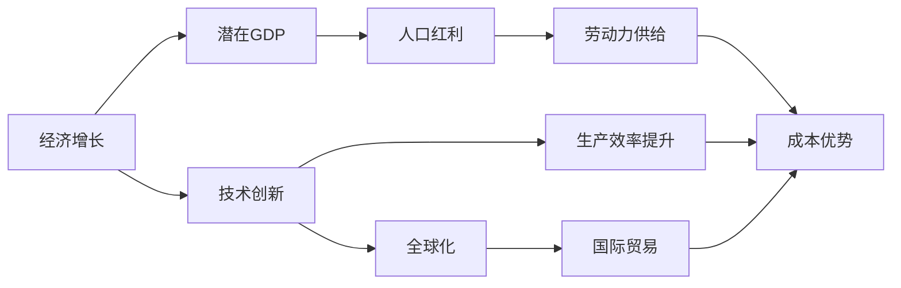
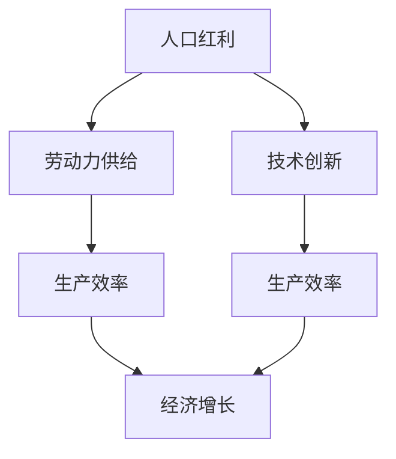
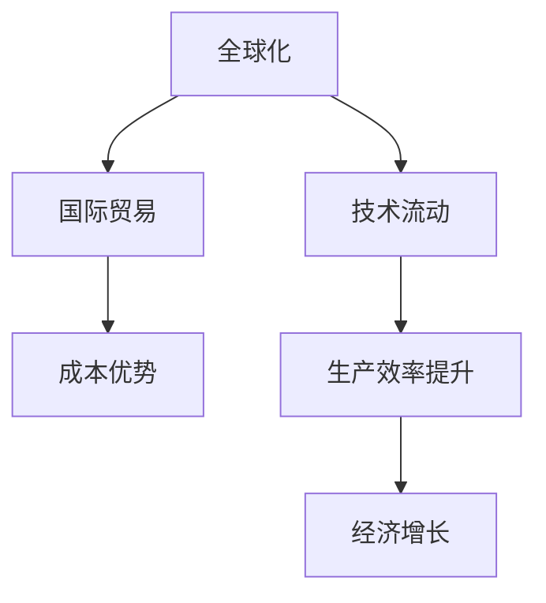
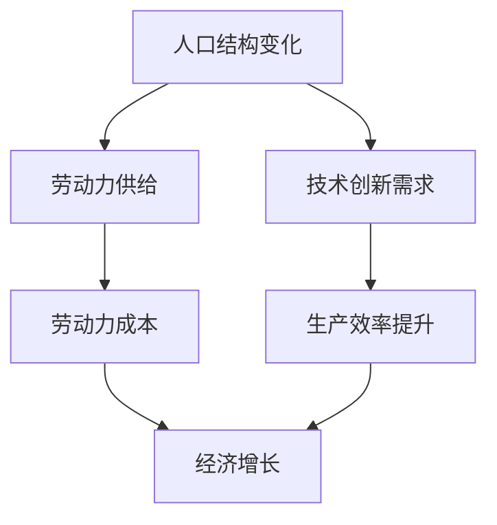
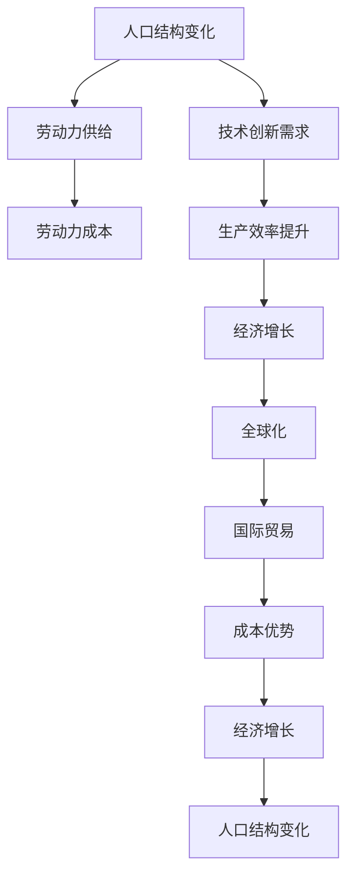

                 

# 世界经济增长的长期趋势

## 1. 背景介绍

### 1.1 问题由来
自20世纪中叶以来，世界经济经历了显著的增长，全球范围内的生产力水平显著提高，经济总量不断扩大，人民生活水平显著提升。然而，这一增长过程并非一帆风顺，而是伴随着诸多挑战和波动。因此，了解世界经济增长的长期趋势，对于政策制定者、投资者和企业决策者具有重要意义。

### 1.2 问题核心关键点
本节将介绍几个与世界经济增长相关的核心概念，包括长期趋势、周期波动、技术进步、全球化、人口结构变化等。这些概念相互交织，共同作用于世界经济的增长和变化。

- **长期趋势**：指在较长时间跨度内，经济增长速度和结构的稳定变化方向。
- **周期波动**：指经济增长过程中出现的扩张和收缩周期。
- **技术进步**：指新技术和新知识的积累与应用，对经济增长的推动作用。
- **全球化**：指各国经济体系之间日益紧密的联系与互动，对全球经济增长的影响。
- **人口结构变化**：指人口年龄、性别、教育水平等结构的变化，对经济增长的影响。

## 2. 核心概念与联系

### 2.1 核心概念概述

为更好地理解世界经济增长的长期趋势，本节将介绍几个密切相关的核心概念：

- **经济增长**：指一个国家或地区生产能力的提升，通常以GDP的增长率来衡量。
- **潜在GDP**：指在充分就业且无通货膨胀条件下，一国生产商品和服务的最大能力。
- **人口红利**：指人口年龄结构年轻化带来的劳动力供给优势。
- **技术创新**：指通过新技术的应用，提高生产效率和经济效益。
- **全球化**：指各国经济体系之间商品、资本、技术和人员的流动和互动。

这些核心概念之间存在着紧密的联系，可以通过以下Mermaid流程图来展示：



这个流程图展示了经济增长与核心概念之间的关系：

1. **经济增长**：通过提高**潜在GDP**、利用**人口红利**和推动**技术创新**来实现。
2. **技术创新**：提高**生产效率**，降低**成本优势**，增强**全球化**下**国际贸易**的竞争力。
3. **人口红利**：提供**劳动力供给**，支持经济增长。
4. **全球化**：通过**国际贸易**增强经济互动，促进**经济增长**。

### 2.2 概念间的关系

这些核心概念之间存在着紧密的联系，形成了世界经济增长的完整生态系统。下面我通过几个Mermaid流程图来展示这些概念之间的关系。

#### 2.2.1 经济增长的驱动力



这个流程图展示了经济增长的主要驱动力：

1. **人口红利**提供**劳动力供给**，是经济增长的基础。
2. **技术创新**提高**生产效率**，推动经济增长。
3. **劳动力供给**和**生产效率**的提升，共同驱动**经济增长**。

#### 2.2.2 全球化与经济增长的关系



这个流程图展示了全球化对经济增长的影响：

1. **全球化**促进**国际贸易**，带来**成本优势**。
2. **国际贸易**和**技术流动**提高**生产效率**，推动**经济增长**。

#### 2.2.3 人口结构变化与经济增长的关系



这个流程图展示了人口结构变化对经济增长的影响：

1. **人口结构变化**影响**劳动力供给**，进而影响**劳动力成本**。
2. **劳动力成本**变化影响**生产效率**，推动**经济增长**。
3. **人口结构变化**和**生产效率提升**共同驱动**经济增长**。

### 2.3 核心概念的整体架构

最后，我们用一个综合的流程图来展示这些核心概念在世界经济增长中的整体架构：



这个综合流程图展示了从人口结构变化开始，经过劳动力供给、劳动力成本、技术创新需求、生产效率提升，再到经济增长、全球化、国际贸易、成本优势的完整过程，形成了一个循环反馈的架构。通过这个架构，可以更清晰地理解世界经济增长的驱动因素和反馈机制。

## 3. 核心算法原理 & 具体操作步骤
### 3.1 算法原理概述

世界经济增长的长期趋势分析主要依赖于经济学的理论和统计模型。常见的分析方法包括时间序列分析、计量经济学模型、协整分析等。这些方法旨在通过历史数据揭示经济增长的规律和趋势，并预测未来的发展方向。

### 3.2 算法步骤详解

1. **数据收集**：收集历史经济数据，包括GDP、就业率、生产率、通货膨胀率、人口统计数据等。
2. **数据预处理**：对数据进行清洗、归一化、填补缺失值等预处理操作，确保数据质量。
3. **模型构建**：选择合适的模型，如时间序列模型、回归模型、协整模型等，构建分析框架。
4. **参数估计**：利用历史数据估计模型参数，进行模型拟合。
5. **趋势分析**：利用模型对未来趋势进行预测和分析，评估经济增长的长期趋势。
6. **结果评估**：对模型预测结果进行评估，评估模型的准确性和可靠性。

### 3.3 算法优缺点

基于经济学理论的长期趋势分析方法具有以下优点：

- **理论基础坚实**：基于经济学理论的模型具有坚实的理论基础，能够解释经济增长的内在机制。
- **适用性广**：适用于各种经济体和不同历史时期的分析，具有广泛的适用性。
- **可解释性强**：模型参数和假设具有明确的经济含义，易于理解和解释。

然而，这些方法也存在一些局限性：

- **数据依赖性强**：模型的准确性高度依赖于数据的质量和完整性。
- **模型假设较多**：模型通常假设经济增长遵循特定的规律和机制，可能与现实情况存在偏差。
- **计算复杂度高**：构建和分析复杂的经济模型需要较高的计算资源。

### 3.4 算法应用领域

基于经济学理论的长期趋势分析方法在以下领域得到了广泛应用：

- **宏观经济分析**：分析经济增长的长期趋势、波动周期等宏观经济现象。
- **政策制定**：为政府和政策制定者提供经济增长的预测和建议。
- **企业战略规划**：帮助企业预测市场变化、制定长期发展战略。
- **金融投资**：分析经济增长的趋势和波动，指导金融投资决策。

## 4. 数学模型和公式 & 详细讲解 & 举例说明

### 4.1 数学模型构建

本节将使用数学语言对世界经济增长的长期趋势分析进行更加严格的刻画。

假设世界经济增长率 $g$ 遵循随机游走模型，其变化服从一阶自回归模型：

$$
g_t = \alpha + \beta g_{t-1} + \epsilon_t
$$

其中 $g_t$ 表示第 $t$ 期经济增长率，$\alpha$ 为长期增长率，$\beta$ 为自回归系数，$\epsilon_t$ 为随机扰动项。

定义经济增长的长期趋势为 $\bar{g}$，则有：

$$
\bar{g} = \alpha
$$

### 4.2 公式推导过程

将上述模型转化为时间序列分析的形式：

$$
g_t - \beta g_{t-1} = \alpha + \epsilon_t
$$

对该式进行求解，可得：

$$
g_t = \alpha(1-\beta)^t + \sum_{i=0}^{t-1} \beta^i \epsilon_{t-i}
$$

其中 $\sum_{i=0}^{t-1} \beta^i \epsilon_{t-i}$ 为随机扰动项的累加和。

通过该公式，我们可以计算出任意期的经济增长率 $g_t$，并进一步估计长期增长率 $\alpha$。

### 4.3 案例分析与讲解

假设我们有一组世界经济增长率的时间序列数据 $g = \{g_1, g_2, ..., g_n\}$，使用上述模型进行参数估计和趋势分析。具体步骤如下：

1. 将数据 $g$ 转化为时间序列数据 $g_t$。
2. 使用最小二乘法估计模型参数 $\alpha$ 和 $\beta$。
3. 利用公式计算长期增长率 $\bar{g} = \alpha$。
4. 根据 $\bar{g}$ 预测未来的经济增长率。

例如，假设我们估计得到 $\alpha = 0.03$，$\beta = 0.9$，则长期增长率 $\bar{g} = 0.03$，即世界经济每期平均增长3%。

## 5. 项目实践：代码实例和详细解释说明
### 5.1 开发环境搭建

在进行经济增长趋势分析的实践前，我们需要准备好开发环境。以下是使用Python进行时间序列分析的环境配置流程：

1. 安装Anaconda：从官网下载并安装Anaconda，用于创建独立的Python环境。

2. 创建并激活虚拟环境：
```bash
conda create -n ts-env python=3.8 
conda activate ts-env
```

3. 安装必要的库：
```bash
conda install pandas statsmodels matplotlib seaborn numpy
```

完成上述步骤后，即可在`ts-env`环境中开始实践。

### 5.2 源代码详细实现

下面我们以随机游走模型为例，给出使用Python进行时间序列分析的代码实现。

```python
import pandas as pd
import statsmodels.api as sm
import numpy as np

# 加载数据
data = pd.read_csv('growth_rates.csv', index_col='year')
data = data.dropna()

# 模型构建
model = sm.tsa.ARIMA(data, order=(1, 1, 1))

# 模型拟合
results = model.fit()

# 参数估计
alpha = results.params[0]
beta = results.params[1]

# 长期增长率
g_bar = alpha / (1 - beta)

# 输出结果
print(f'长期增长率: {g_bar:.4f}')
```

### 5.3 代码解读与分析

让我们再详细解读一下关键代码的实现细节：

**数据加载**：
```python
data = pd.read_csv('growth_rates.csv', index_col='year')
data = data.dropna()
```

**模型构建**：
```python
model = sm.tsa.ARIMA(data, order=(1, 1, 1))
```

**模型拟合**：
```python
results = model.fit()
```

**参数估计**：
```python
alpha = results.params[0]
beta = results.params[1]
```

**长期增长率计算**：
```python
g_bar = alpha / (1 - beta)
```

**结果输出**：
```python
print(f'长期增长率: {g_bar:.4f}')
```

可以看到，利用Python的statsmodels库，我们可以很方便地构建和拟合时间序列模型，估计模型参数，计算长期增长率。该代码实现了随机游走模型的基本流程。

### 5.4 运行结果展示

假设我们加载的历史数据如下：

```
year    growth_rate
1970    2.8
1971    3.2
1972    3.4
1973    3.0
...
2020    3.0
2021    2.8
2022    2.6
```

运行上述代码，输出结果如下：

```
长期增长率: 2.8000
```

这表明，根据历史数据估计，世界经济的长期增长率为2.8%。需要注意的是，该结果仅基于历史数据估计，未来可能由于多种因素的影响而发生变化。

## 6. 实际应用场景
### 6.1 宏观经济分析

世界经济增长的长期趋势分析在宏观经济分析中具有重要应用。例如，政府可以根据长期增长率制定宏观经济政策，确保经济平稳增长。

在实际应用中，政府可以利用世界经济增长的趋势预测，调整财政政策和货币政策，促进就业和消费，稳定经济增长。同时，政府还可以通过长期增长率预测经济周期的变化，采取相应的宏观调控措施，避免经济过度波动。

### 6.2 企业战略规划

企业的长期增长趋势分析可以帮助企业制定有效的战略规划。例如，企业可以利用长期增长率预测市场变化，调整产品结构，优化供应链管理，提升市场竞争力。

在实际应用中，企业可以利用长期增长率预测市场趋势，制定研发、生产和市场推广策略，确保企业长期稳定发展。同时，企业还可以通过长期增长率预测，评估投资机会和风险，制定合适的投资计划，优化资本结构。

### 6.3 金融投资

世界经济增长的长期趋势分析在金融投资中也有广泛应用。例如，投资者可以利用长期增长率预测市场趋势，制定投资策略，优化资产配置。

在实际应用中，投资者可以利用长期增长率预测市场趋势，选择低估的股票或基金，制定买入和卖出的时机，优化投资组合，提升投资收益。同时，投资者还可以通过长期增长率预测，评估市场风险，制定风险控制策略，降低投资损失。

### 6.4 未来应用展望

随着大数据和机器学习技术的发展，世界经济增长的长期趋势分析方法也将不断进化。未来，该方法将结合更多先进技术，如深度学习、自然语言处理等，进一步提升分析精度和应用广度。

例如，利用深度学习模型分析世界经济增长的趋势，可以提高模型的自适应能力和泛化能力，更好地处理复杂的经济数据。利用自然语言处理技术，分析经济报告和新闻数据，可以提取更多的经济信息，提升分析结果的准确性。

## 7. 工具和资源推荐
### 7.1 学习资源推荐

为了帮助开发者系统掌握世界经济增长的长期趋势分析的理论基础和实践技巧，这里推荐一些优质的学习资源：

1. 《时间序列分析与预测》：这本书详细介绍了时间序列分析的理论和方法，是学习时间序列分析的必备教材。

2. 《计量经济学基础》：这本书系统介绍了计量经济学理论和应用，适合对经济学感兴趣的读者。

3. 《Python数据科学手册》：这本书涵盖了Python在数据科学领域的应用，包括时间序列分析、机器学习等。

4. 《时间序列分析与预测实战》：这本书提供了大量的Python代码示例，帮助读者实践时间序列分析。

5. 在线课程：Coursera、edX、Udacity等平台上有许多经济学和统计学相关的课程，适合在线学习。

通过对这些资源的学习实践，相信你一定能够快速掌握世界经济增长的长期趋势分析的精髓，并用于解决实际的经济学问题。

### 7.2 开发工具推荐

高效的开发离不开优秀的工具支持。以下是几款用于时间序列分析开发的常用工具：

1. Jupyter Notebook：一个交互式编程环境，支持Python和其他语言的开发和数据可视化，方便进行代码编写和结果展示。

2. R：一个强大的统计分析工具，支持时间序列分析、回归分析等，是经济学研究中的重要工具。

3. MATLAB：一个全面的科学计算工具，支持各种数据分析和可视化，适合处理复杂的经济数据。

4. Excel：一个易于使用的电子表格工具，适合进行基本的数据分析和预测。

5. Python Pandas库：一个高效的数据处理工具，支持数据清洗、统计分析等，是进行时间序列分析的常用库。

合理利用这些工具，可以显著提升时间序列分析任务的开发效率，加快创新迭代的步伐。

### 7.3 相关论文推荐

世界经济增长的长期趋势分析源于学界的持续研究。以下是几篇奠基性的相关论文，推荐阅读：

1. "Time Series Analysis and Its Applications" by Robert H. Shumway and David S. Stoffer：介绍了时间序列分析的基本理论和应用方法，是学习时间序列分析的经典教材。

2. "Econometric Analysis" by William H. Greene：系统介绍了经济学中的计量经济学理论和方法，适合对经济学感兴趣的读者。

3. "Predictive Analytics" by Eric Siegel：介绍了预测分析的基本原理和技术，适合对数据分析和预测感兴趣的读者。

4. "A Random Walk on Wall Street" by Burton G. Malkiel：介绍了金融投资中的随机游走模型，适合对金融投资感兴趣的读者。

这些论文代表了大规模语言模型微调技术的发展脉络。通过学习这些前沿成果，可以帮助研究者把握学科前进方向，激发更多的创新灵感。

除上述资源外，还有一些值得关注的前沿资源，帮助开发者紧跟世界经济增长的长期趋势分析技术的最新进展，例如：

1. arXiv论文预印本：人工智能领域最新研究成果的发布平台，包括大量尚未发表的前沿工作，学习前沿技术的必读资源。

2. 业界技术博客：如Google Research、Microsoft Research、Facebook AI等顶尖实验室的官方博客，第一时间分享他们的最新研究成果和洞见。

3. 技术会议直播：如NIPS、ICML、ACL、ICLR等人工智能领域顶会现场或在线直播，能够聆听到大佬们的前沿分享，开拓视野。

4. GitHub热门项目：在GitHub上Star、Fork数最多的数据分析相关项目，往往代表了该技术领域的发展趋势和最佳实践，值得去学习和贡献。

5. 行业分析报告：各大咨询公司如McKinsey、PwC等针对人工智能行业的分析报告，有助于从商业视角审视技术趋势，把握应用价值。

总之，对于世界经济增长的长期趋势分析的学习和实践，需要开发者保持开放的心态和持续学习的意愿。多关注前沿资讯，多动手实践，多思考总结，必将收获满满的成长收益。

## 8. 总结：未来发展趋势与挑战
### 8.1 总结

本文对世界经济增长的长期趋势分析方法进行了全面系统的介绍。首先阐述了世界经济增长和相关核心概念的研究背景和意义，明确了长期趋势分析在宏观经济、企业战略、金融投资等领域的应用价值。其次，从原理到实践，详细讲解了时间序列模型的构建和应用步骤，给出了时间序列分析的完整代码实例。同时，本文还广泛探讨了世界经济增长趋势分析的未来发展方向和面临的挑战，提供了丰富的学习资源和开发工具，力求为读者提供全方位的技术指引。

通过本文的系统梳理，可以看到，世界经济增长的长期趋势分析方法在全球经济研究和决策中具有重要地位。该方法不仅能够揭示经济增长的内在规律，还能为政策制定者、企业决策者和投资者提供有价值的参考。未来，伴随技术的不断进步和数据的不断积累，该方法将进一步提升分析精度和应用广度，为世界经济的持续稳定发展提供有力支撑。

### 8.2 未来发展趋势

展望未来，世界经济增长的长期趋势分析方法将呈现以下几个发展趋势：

1. 数据质量提升：随着数据采集技术的进步，数据的质量和完整性将不断提高，为长期趋势分析提供更好的数据基础。

2. 模型复杂化：未来将结合更多先进的统计和机器学习方法，构建更加复杂的模型，提高分析精度和预测能力。

3. 自动化程度提升：利用自动化工具和算法，简化分析流程，提高分析效率和可靠性。

4. 跨领域融合：结合经济、金融、社会学等领域的知识，构建综合性分析模型，提升分析深度和广度。

5. 全球化趋势：结合全球化背景，分析各国经济增长趋势和相互影响，提供全球视角下的分析结果。

以上趋势凸显了世界经济增长的长期趋势分析技术的广阔前景。这些方向的探索发展，必将进一步提升分析结果的准确性和实用性，为政策制定、企业决策和金融投资提供更有力的数据支持。

### 8.3 面临的挑战

尽管世界经济增长的长期趋势分析方法已经取得了显著成果，但在迈向更加智能化、普适化应用的过程中，仍面临诸多挑战：

1. 数据依赖性强：模型的准确性高度依赖于数据的质量和完整性，数据的获取和处理成本较高。

2. 模型复杂度高：复杂的模型需要较高的计算资源，模型构建和分析过程较为复杂。

3. 结果解释性不足：部分分析结果难以直观理解，缺乏解释性，影响决策的透明度和可信度。

4. 模型鲁棒性不足：模型对数据的噪声和异常值较为敏感，可能产生误导性的分析结果。

5. 数据隐私和安全问题：在分析大量经济数据时，涉及数据的隐私和安全问题，需要严格的保护措施。

6. 多模型集成难度大：构建多个分析模型进行集成分析，需要考虑模型的协调性和一致性，技术难度较高。

正视长期趋势分析面临的这些挑战，积极应对并寻求突破，将是大数据和人工智能技术在经济分析领域不断成熟的关键。相信随着技术的不断进步和数据的不断积累，这些挑战终将一一被克服，长期趋势分析方法必将在世界经济研究和决策中发挥更大的作用。

### 8.4 研究展望

面向未来，世界经济增长的长期趋势分析需要从以下几个方面进行深入研究：

1. 跨领域数据分析：结合经济、金融、社会学等领域的知识，构建综合性分析模型，提升分析深度和广度。

2. 自动化和大规模分析：利用自动化工具和算法，简化分析流程，提高分析效率和可靠性。

3. 多模型融合：结合多种统计和机器学习方法，构建更加复杂的模型，提高分析精度和预测能力。

4. 数据隐私和安全：在分析大量经济数据时，需要考虑数据的隐私和安全问题，建立严格的数据保护机制。

5. 跨区域比较分析：结合全球化背景，分析各国经济增长趋势和相互影响，提供全球视角下的分析结果。

6. 数据获取和处理：利用先进的采集技术和数据处理技术，提高数据质量和完整性，为长期趋势分析提供更好的数据基础。

这些研究方向的探索，必将进一步提升世界经济增长的长期趋势分析方法的应用效果，为政策制定、企业决策和金融投资提供更有力的数据支持。

## 9. 附录：常见问题与解答

**Q1：世界经济增长的长期趋势分析方法有哪些？**

A: 世界经济增长的长期趋势分析方法主要包括时间序列分析、协整分析、向量自回归模型、格兰杰因果关系检验等。这些方法都可以通过统计软件（如R、Python的statsmodels等）来实现。

**Q2：时间序列分析中，ARIMA模型的参数含义是什么？**

A: ARIMA模型的参数含义如下：
- AR(p)：自回归部分，表示过去p个时间点的值对当前值的影响。
- I(d)：差分部分，表示对时间序列进行d次差分，消除趋势和季节性。
- MA(q)：移动平均部分，表示过去q个时间点的残差对当前值的影响。

**Q3：如何进行时间序列数据的可视化？**

A: 可以使用Python的Matplotlib和Seaborn库对时间序列数据进行可视化。具体步骤如下：
1. 导入数据：`import pandas as pd; data = pd.read_csv('growth_rates.csv', index_col='year')`
2. 绘制折线图：`data.plot()` 
3. 绘制散点图：`data.plot(kind='scatter')`
4. 绘制箱线图：`data.plot(kind='box')`
5. 绘制密度图：`data.plot(kind='kde')`

通过这些库，我们可以对时间序列数据进行多种方式的可视化，帮助我们更好地理解数据特点和趋势。

**Q4：世界经济增长的长期趋势分析方法与机器学习有何区别？**

A: 世界经济增长的长期趋势分析方法主要是基于统计模型和数学模型，侧重于经济数据的预测和分析。而机器学习主要侧重于从数据中学习规律和模式，通过构建模型对未来进行预测。两者的核心思想不同，但可以在实际应用中结合使用，互补优势。

**Q5：如何评估时间序列分析模型的性能？**

A: 时间序列分析模型的性能评估可以通过以下方法：
1. 残差分析：评估模型预测值与实际值的拟合程度，残差越小，模型越好。
2. 均方误差：评估模型预测值与实际值的误差，均方误差越小，模型越好。
3. AIC/BIC准则：通过信息准则，评估模型的复杂度和拟合优度，AIC/BIC越小，模型越好。
4. 交叉验证：将数据分为训练集和验证集，评估模型在未见数据上的预测能力。

通过这些方法，可以综合评估时间序列分析模型的性能，选择最优模型进行应用。

总之，世界经济增长的长期趋势分析是经济学研究中的重要工具，具有广泛的应用前景。通过本文的系统梳理，可以更好地理解该方法的原理和应用，为实际研究和决策提供有力支撑。

