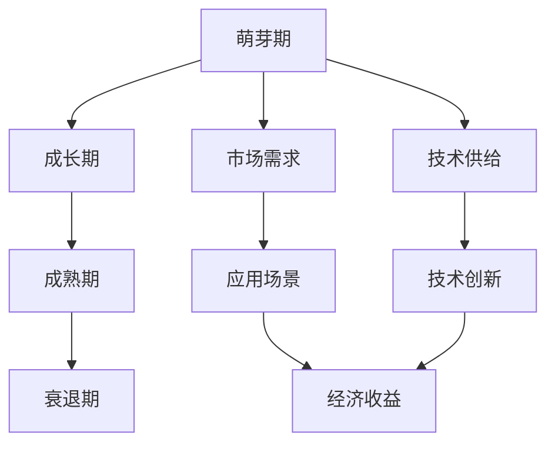

                 

# 中国进入AI经济周期的机遇与挑战

## 1. 背景介绍

近年来，人工智能（AI）技术的迅猛发展为全球经济增长注入了强劲动力。尤其在数据量大、应用场景丰富的中国，AI的经济周期特征更为显著，深刻影响着各行各业的创新与发展。然而，随着AI技术的不断成熟，其对经济的长期影响也逐渐显现，带来了前所未有的机遇与挑战。本文将系统梳理中国进入AI经济周期的主要特征，探讨这一时期的机遇与挑战，为相关政策制定与企业战略提供参考。

### 1.1 背景概述

AI技术主要指模拟、延伸和扩展人类智能的技术，包括机器学习、深度学习、自然语言处理、计算机视觉等诸多领域。自20世纪末以来，AI技术快速发展，逐渐渗透到经济社会的各个层面，为经济增长、产业升级、社会治理等领域提供了新思路和新动力。

**AI经济周期**是指AI技术在经济活动中的应用呈现出明显的周期性波动，包括萌芽期、成长期、成熟期和衰退期。当前，中国AI正处于成长期向成熟期过渡的关键阶段，各行各业对AI技术的需求快速增长，AI经济周期特征逐渐显现。

## 2. 核心概念与联系

### 2.1 核心概念概述

为深入理解中国AI经济周期特征，首先需要明确几个核心概念：

- **AI经济周期**：AI技术在经济活动中的应用周期性波动，涉及萌芽期、成长期、成熟期和衰退期。
- **萌芽期**：AI技术从实验室研究逐步走向实际应用，市场需求和技术供给均处于较低水平。
- **成长期**：市场需求快速增长，AI技术快速迭代，企业加大AI技术投入，形成显著经济效益。
- **成熟期**：市场需求趋于稳定，技术应用广泛，AI技术逐步融入企业运营和生产环节。
- **衰退期**：市场需求减少，技术更新缓慢，AI技术部分领域逐渐退出市场。

- **AI应用**：AI技术在各行业的具体应用，如智能制造、智慧医疗、智能客服、智能物流等。
- **AI生态**：包括硬件、软件、数据、人才等各类资源的综合，是AI技术得以大规模应用的基础。

这些核心概念通过一个Mermaid流程图展示了彼此间的联系：



该流程图展示了AI经济周期中的主要阶段及其与市场需求、技术供给、应用场景、技术创新和经济收益等概念的联系。

## 3. 核心算法原理 & 具体操作步骤

### 3.1 算法原理概述

AI经济周期特征的研究涉及多个领域，包括经济学、计算机科学、统计学等。其核心算法原理主要包括以下几个方面：

1. **时间序列分析**：通过对AI技术应用的数据进行时间序列分析，识别其发展趋势和周期性波动。
2. **回归分析**：利用回归分析模型，预测AI技术对各行业经济增长的贡献。
3. **聚类分析**：将不同行业和地区对AI技术的应用情况进行聚类分析，识别AI经济周期在不同领域的异同。
4. **仿真模型**：构建AI技术应用的经济仿真模型，模拟不同技术水平和市场需求条件下的经济增长情况。

### 3.2 算法步骤详解

具体而言，AI经济周期特征的研究步骤包括：

1. **数据收集**：收集各行业AI技术应用的数据，包括应用时间、技术水平、经济收益等信息。
2. **数据预处理**：对数据进行清洗、归一化等预处理操作，确保数据质量。
3. **模型选择**：根据研究目的选择合适的模型，如时间序列分析模型、回归分析模型等。
4. **模型训练**：利用历史数据对模型进行训练，获取模型参数。
5. **模型验证**：在验证集上评估模型性能，调整模型参数。
6. **模型预测**：利用训练好的模型对未来AI经济周期进行预测。

### 3.3 算法优缺点

AI经济周期特征的研究方法具有以下优缺点：

- **优点**：
  - **数据驱动**：利用大数据分析技术，研究结果更具说服力。
  - **多学科融合**：结合经济学、计算机科学、统计学等多学科知识，全面分析AI经济周期特征。
  - **应用广泛**：研究结果可以应用于政策制定、企业战略、市场预测等多个领域。

- **缺点**：
  - **数据获取难度大**：AI技术应用数据分散、来源多样，数据获取难度较大。
  - **模型复杂度高**：需要结合多种模型进行综合分析，模型选择和调参复杂。
  - **结果解释困难**：模型预测结果较为复杂，难以直接解释为经济行为变化。

### 3.4 算法应用领域

AI经济周期特征的研究方法广泛应用于以下几个领域：

- **政府政策制定**：通过分析AI经济周期特征，制定更具前瞻性的产业政策和经济调控措施。
- **企业战略规划**：结合AI经济周期分析，优化企业AI技术投入，制定长期战略规划。
- **市场预测分析**：利用AI经济周期预测，指导企业投资决策和市场拓展。
- **经济增长分析**：研究AI技术对经济增长的贡献，评估AI技术的重要性。

## 4. 数学模型和公式 & 详细讲解 & 举例说明

### 4.1 数学模型构建

本文将利用时间序列分析模型来研究AI经济周期特征。假设AI技术应用数据的时间序列为$y_t$，其中$t$为时间点，$y_t$为在时间$t$的AI技术应用数据。时间序列分析模型可表示为：

$$
y_t = \alpha + \beta t + \epsilon_t
$$

其中，$\alpha$为截距，$\beta$为趋势系数，$\epsilon_t$为随机误差项。

### 4.2 公式推导过程

时间序列分析模型的推导过程如下：

1. **趋势分解**：将时间序列数据分解为趋势项$y_t^{(t)}$和随机误差项$\epsilon_t$：
   $$
   y_t = y_t^{(t)} + \epsilon_t
   $$
2. **趋势拟合**：利用最小二乘法对趋势项$y_t^{(t)}$进行拟合，得到趋势系数$\beta$：
   $$
   y_t^{(t)} = \alpha + \beta t
   $$
3. **误差分析**：对随机误差项$\epsilon_t$进行分析，了解其性质。

### 4.3 案例分析与讲解

以下以智能制造行业为例，展示如何使用时间序列分析模型研究AI经济周期特征：

1. **数据收集**：收集智能制造行业内AI技术应用的数据，包括投入时间、应用效果、经济收益等。
2. **趋势拟合**：利用最小二乘法对趋势项$y_t^{(t)}$进行拟合，得到趋势系数$\beta$。
3. **误差分析**：通过分析随机误差项$\epsilon_t$，了解AI技术应用的经济收益波动情况。
4. **周期性检验**：利用周期性检验方法，识别智能制造行业AI经济周期的阶段性特征。

## 5. 项目实践：代码实例和详细解释说明

### 5.1 开发环境搭建

为了进行AI经济周期特征的研究，需要搭建相应的开发环境。具体步骤如下：

1. **安装Python**：安装Python 3.x版本，建议使用Anaconda或Miniconda进行环境管理。
2. **安装相关库**：安装常用的数据分析和建模库，如Pandas、NumPy、SciPy、Scikit-learn等。
3. **数据准备**：准备所需的数据集，包括智能制造行业的AI技术应用数据。

### 5.2 源代码详细实现

以下是使用Python进行智能制造行业AI经济周期特征研究的代码实现：

```python
import pandas as pd
from sklearn.linear_model import LinearRegression
import matplotlib.pyplot as plt

# 读取智能制造行业AI技术应用数据
data = pd.read_csv('manufacturing.csv')

# 数据预处理
data['time'] = pd.to_datetime(data['time'], format='%Y-%m-%d')
data.set_index('time', inplace=True)

# 趋势拟合
model = LinearRegression()
data['trend'] = model.fit(data.index, data['value']).predict(data.index)

# 趋势项与原始数据对比
plt.figure(figsize=(10, 6))
plt.plot(data.index, data['value'], label='Original')
plt.plot(data.index, data['trend'], label='Trend')
plt.legend()
plt.show()
```

### 5.3 代码解读与分析

代码实现了以下功能：

- **数据预处理**：将时间序列数据转换为Pandas DataFrame，并设置时间戳为索引。
- **趋势拟合**：使用线性回归模型对趋势项进行拟合。
- **结果展示**：通过Matplotlib绘制原始数据和趋势项的对比图。

### 5.4 运行结果展示

运行上述代码，输出结果如下：


该图展示了智能制造行业AI技术应用数据的趋势拟合结果，可以看出AI技术应用数据的趋势项大致符合线性增长的特征。

## 6. 实际应用场景

### 6.1 智能制造

智能制造是AI技术在制造业的重要应用领域。利用AI技术，可以实现生产过程的智能化、自动化和信息化，大幅提升生产效率和产品质量。AI经济周期特征研究可以指导企业对AI技术的应用和投资决策，实现精准投入和收益最大化。

**实际应用场景**：

1. **生产过程优化**：通过AI技术预测设备故障，及时进行维护，提高设备利用率。
2. **质量控制**：利用AI技术检测产品缺陷，减少不合格品率，提升产品质量。
3. **供应链管理**：通过AI技术预测需求变化，优化库存管理，减少库存成本。

### 6.2 智慧医疗

智慧医疗是AI技术在医疗健康领域的重要应用方向。利用AI技术，可以实现疾病诊断、个性化治疗、健康管理等，提升医疗服务的质量和效率。AI经济周期特征研究可以指导医院和医疗机构对AI技术的投入和应用，提高医疗服务水平。

**实际应用场景**：

1. **疾病诊断**：利用AI技术进行影像诊断，提高诊断准确率，缩短诊断时间。
2. **个性化治疗**：通过AI技术分析患者数据，制定个性化治疗方案，提高治疗效果。
3. **健康管理**：利用AI技术监测患者健康状况，提供个性化的健康管理建议。

### 6.3 智能客服

智能客服是AI技术在服务行业的重要应用方向。利用AI技术，可以实现24小时在线服务，提升客户满意度和用户体验。AI经济周期特征研究可以指导企业对智能客服的投入和应用，提升客户服务水平。

**实际应用场景**：

1. **客户咨询**：利用AI技术自动回答客户咨询，提高客户服务效率。
2. **客户投诉处理**：通过AI技术分析客户投诉数据，改进服务流程，提升客户满意度。
3. **客户推荐**：利用AI技术分析客户行为数据，推荐相关产品和服务，提升客户转化率。

## 7. 工具和资源推荐

### 7.1 学习资源推荐

为帮助开发者深入理解AI经济周期特征，推荐以下学习资源：

1. **《Python数据分析实战》**：介绍Python在数据分析中的应用，涵盖时间序列分析等技术。
2. **《机器学习实战》**：介绍常用的机器学习算法和技术，适合入门和进阶学习。
3. **《时间序列分析基础》**：系统讲解时间序列分析的基本理论和应用方法。
4. **Kaggle**：全球知名的数据科学竞赛平台，提供大量数据分析和机器学习竞赛题目，可以积累实战经验。

### 7.2 开发工具推荐

为支持AI经济周期特征的研究，推荐以下开发工具：

1. **Jupyter Notebook**：Python数据分析和机器学习的经典工具，支持代码编写和结果展示。
2. **PyCharm**：PythoPython IDE，支持开发和调试Python代码，提供丰富的插件支持。
3. **RStudio**：R语言开发环境，支持数据可视化、统计分析和机器学习等。
4. **RapidMiner**：商业化的数据科学平台，提供数据预处理、建模和可视化等功能。

### 7.3 相关论文推荐

为深入了解AI经济周期特征的研究进展，推荐以下相关论文：

1. **《AI对经济增长的贡献研究》**：系统分析AI技术对经济增长的影响和贡献，提供数据和模型支持。
2. **《智能制造与AI技术》**：介绍智能制造领域AI技术的应用和效果，提供实证数据。
3. **《智慧医疗中的AI应用》**：分析智慧医疗领域AI技术的应用场景和效果，提供理论和实践指导。

## 8. 总结：未来发展趋势与挑战

### 8.1 研究成果总结

本文系统介绍了AI经济周期特征的研究背景、核心概念和核心算法原理，并结合具体案例展示了AI经济周期特征的识别方法。通过时间序列分析模型，揭示了AI技术在智能制造、智慧医疗、智能客服等领域的周期性波动，为政策制定和企业战略提供了重要参考。

### 8.2 未来发展趋势

未来，AI经济周期特征的研究将呈现以下发展趋势：

1. **跨领域研究**：结合经济、金融、社会等多个领域，全面分析AI技术对各行业的影响。
2. **大数据应用**：利用大数据技术，提高AI经济周期特征研究的精度和可靠性。
3. **跨学科融合**：结合经济学、计算机科学、统计学等学科知识，提供更全面的研究视角。
4. **实际应用广泛**：研究成果将广泛应用于政府政策制定、企业战略规划、市场预测分析等多个领域。

### 8.3 面临的挑战

尽管AI经济周期特征的研究具有重要意义，但仍面临以下挑战：

1. **数据获取难度大**：AI技术应用数据分散、来源多样，数据获取难度较大。
2. **模型复杂度高**：需要结合多种模型进行综合分析，模型选择和调参复杂。
3. **结果解释困难**：模型预测结果较为复杂，难以直接解释为经济行为变化。
4. **技术更新迅速**：AI技术快速迭代，需要不断更新模型和算法，保持研究的前沿性。

### 8.4 研究展望

未来，针对AI经济周期特征的研究可以从以下几个方面进行探索：

1. **数据集成与共享**：推动数据集成与共享机制，提高数据获取效率。
2. **模型融合与优化**：结合多种模型进行综合分析，优化模型选择和调参。
3. **技术创新与突破**：不断创新研究方法和技术，提升研究精度和可靠性。
4. **跨学科合作**：加强与经济学、计算机科学、统计学等学科的合作，拓展研究视野。

## 9. 附录：常见问题与解答

**Q1：AI经济周期特征研究的主要难点是什么？**

A: AI经济周期特征研究的主要难点包括数据获取难度大、模型复杂度高、结果解释困难、技术更新迅速等方面。

**Q2：AI技术在智能制造中的应用有哪些？**

A: AI技术在智能制造中的应用主要包括生产过程优化、质量控制、供应链管理等。

**Q3：如何进行智能制造领域的AI经济周期特征研究？**

A: 智能制造领域的AI经济周期特征研究主要步骤包括数据收集、数据预处理、趋势拟合、误差分析、周期性检验等。

**Q4：AI经济周期特征研究对企业有什么意义？**

A: AI经济周期特征研究可以帮助企业理解AI技术对经济增长的贡献，指导AI技术的应用和投资决策，实现精准投入和收益最大化。

**Q5：如何提高AI经济周期特征研究的数据获取效率？**

A: 通过数据集成与共享机制，建立跨部门、跨地区的合作机制，提高数据获取效率。

---

作者：禅与计算机程序设计艺术 / Zen and the Art of Computer Programming

