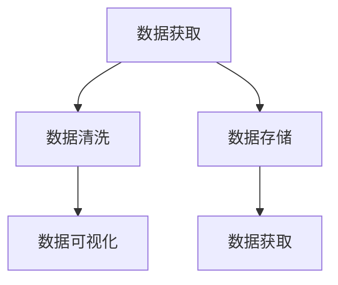
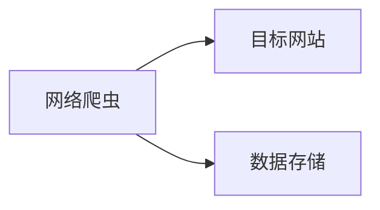
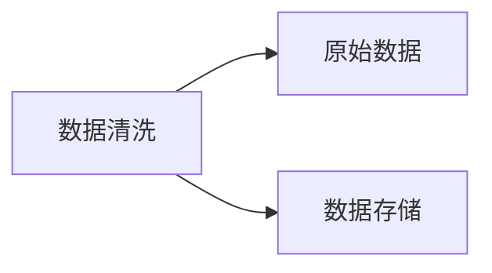
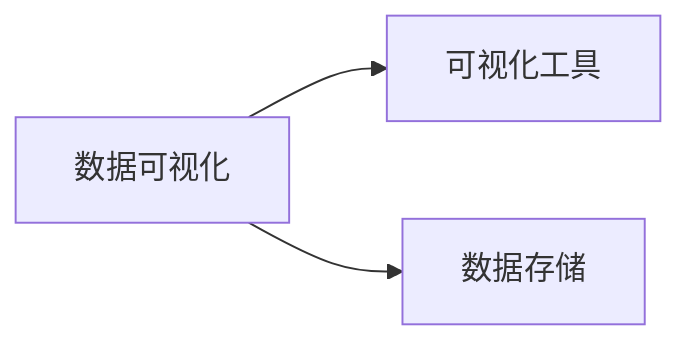
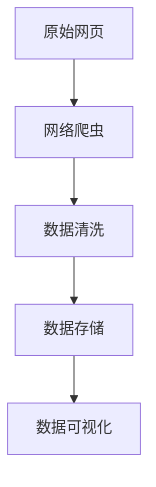

                 

# 京东商品数据网络爬虫设计

> 关键词：网络爬虫, 商品数据, 数据挖掘, 数据清洗, 数据存储, 数据可视化

## 1. 背景介绍

### 1.1 问题由来
近年来，随着互联网技术的发展，电子商务平台如京东、淘宝、亚马逊等，迅速崛起，成为人们日常生活的重要组成部分。电商平台以海量的商品信息吸引用户，为商家提供了丰富的营销渠道。然而，由于电商平台的商品信息更新频率高、数据量大，传统的离线数据分析方法难以满足实时需求，因此亟需开发高效的商品数据网络爬虫系统。

网络爬虫是一种自动获取网页信息的应用程序，通过模拟用户浏览器行为，遍历指定网站并收集目标数据。在大数据时代，网络爬虫技术成为了信息获取的重要手段，在数据采集、市场分析、广告推荐等多个领域发挥着重要作用。本文聚焦于京东商品数据的网络爬虫系统设计，旨在实现对电商平台商品信息的全面、快速、准确采集，为后续数据挖掘和分析提供支撑。

### 1.2 问题核心关键点
本项目的技术核心包括以下几个方面：

- 数据获取：通过网络爬虫系统自动化抓取京东商品页面，获取商品标题、价格、描述、销量等关键信息。
- 数据清洗：对抓取的数据进行预处理，包括数据去重、异常值处理、格式转换等，保证数据质量。
- 数据存储：将处理后的商品数据存储到高效的数据库系统中，便于后续分析应用。
- 数据可视化：通过可视化工具展示商品数据，帮助商家、分析师、用户快速了解商品信息，洞察市场趋势。

## 2. 核心概念与联系

### 2.1 核心概念概述

为更好地理解京东商品数据网络爬虫系统的设计和实现，本节将介绍几个密切相关的核心概念：

- 网络爬虫(Crawler)：通过模拟用户浏览器行为，遍历指定网站并自动收集网页信息的应用程序。
- 数据清洗(Data Cleaning)：对抓取的数据进行预处理，包括去重、异常值处理、格式转换等，保证数据质量。
- 数据存储(Database)：将处理后的数据存储到高效的数据库系统中，便于后续分析应用。
- 数据可视化(Data Visualization)：通过图表、仪表盘等形式展示数据，帮助用户快速理解数据信息，洞察市场趋势。

这些核心概念之间的逻辑关系可以通过以下Mermaid流程图来展示：



这个流程图展示了大数据网络爬虫系统从数据获取到可视化的完整流程。

### 2.2 概念间的关系

这些核心概念之间存在着紧密的联系，形成了京东商品数据网络爬虫系统的完整架构。下面我们通过几个Mermaid流程图来展示这些概念之间的关系。

#### 2.2.1 数据获取过程



这个流程图展示了网络爬虫的数据获取过程。网络爬虫通过模拟用户行为，遍历目标网站，抓取网页信息，并将抓取的数据存储到高效的数据库系统中。

#### 2.2.2 数据清洗流程



这个流程图展示了数据清洗的基本流程。原始数据经过去重、异常值处理、格式转换等预处理，最终存储到高效的数据库系统中，便于后续分析应用。

#### 2.2.3 数据可视化架构



这个流程图展示了数据可视化的基本架构。经过清洗后的商品数据存储到高效的数据库系统中，通过可视化工具展示数据，帮助用户快速了解商品信息，洞察市场趋势。

### 2.3 核心概念的整体架构

最后，我们用一个综合的流程图来展示这些核心概念在大数据网络爬虫系统中的整体架构：



这个综合流程图展示了从原始网页到数据可视化的完整流程，以及各环节间的逻辑关系。

## 3. 核心算法原理 & 具体操作步骤

### 3.1 算法原理概述

京东商品数据网络爬虫系统基于Python语言和Selenium库实现，通过模拟用户浏览器行为，遍历指定网站并抓取商品信息。系统设计遵循以下几个核心算法原理：

- 网页解析算法：通过解析HTML、XML等网页格式，提取网页中的关键数据。
- 异步请求算法：使用异步请求技术，提高数据抓取效率，减少系统负担。
- 数据清洗算法：对抓取的数据进行去重、异常值处理、格式转换等预处理，保证数据质量。
- 数据存储算法：将处理后的数据存储到高效的数据库系统中，便于后续分析应用。
- 数据可视化算法：通过图表、仪表盘等形式展示数据，帮助用户快速了解数据信息，洞察市场趋势。

### 3.2 算法步骤详解

本节将详细介绍京东商品数据网络爬虫系统的具体实现步骤。

**Step 1: 搭建开发环境**

- 安装Python 3.8及以上版本，确保支持Selenium库和其他相关依赖。
- 下载Chrome浏览器驱动，并将其添加到系统环境变量中。
- 安装Selenium库和PyAutoGUI库，用于模拟用户浏览器行为和自动化操作。

**Step 2: 设计爬虫框架**

- 设计爬虫框架，包括目标网站、请求头、请求方式、页面解析规则等。
- 编写爬虫主函数，按照框架设计自动遍历网站，抓取商品信息。
- 使用异步请求技术，如异步io、aiohttp等，提高数据抓取效率。

**Step 3: 实现数据清洗**

- 对抓取的商品信息进行去重处理，去除重复数据。
- 对商品信息进行格式转换，统一数据格式。
- 对异常数据进行清洗，处理缺失值、错误数据等。

**Step 4: 存储商品数据**

- 将清洗后的商品数据存储到MySQL、MongoDB等高效数据库系统中。
- 使用SQL语句或NoSQL查询语言进行数据查询、统计、分析等操作。
- 使用数据库的索引功能，提高数据检索效率。

**Step 5: 实现数据可视化**

- 使用Pandas库进行数据预处理，生成可视化图表。
- 使用Matplotlib、Seaborn等绘图库，创建图表和仪表盘。
- 使用Jupyter Notebook、PyCharm等IDE工具，展示和分享可视化结果。

### 3.3 算法优缺点

京东商品数据网络爬虫系统具有以下优点：

- 数据获取全面：通过网络爬虫系统自动化抓取京东商品信息，涵盖商品标题、价格、描述、销量等关键信息。
- 数据清洗高效：使用Python和Selenium库，自动化处理数据去重、格式转换等预处理步骤，保证数据质量。
- 数据存储灵活：支持多种数据库系统，如MySQL、MongoDB等，满足不同业务需求。
- 数据可视化直观：通过可视化工具展示数据，帮助用户快速了解商品信息，洞察市场趋势。

然而，该系统也存在一些缺点：

- 对网站结构依赖度高：需要手动设计爬虫框架，对目标网站结构依赖度高，维护成本高。
- 网络请求频度高：频繁的网络请求可能导致目标网站IP被封禁，影响系统稳定运行。
- 数据存储量大：大规模商品数据的存储和检索可能导致性能瓶颈，需要优化算法和配置。
- 数据可视化复杂：不同业务场景下，需要定制不同的可视化报表，工作量较大。

### 3.4 算法应用领域

京东商品数据网络爬虫系统的应用范围广泛，具体如下：

- 电商市场分析：抓取京东商品数据，进行市场分析，帮助商家了解市场动态，优化商品策略。
- 价格监控：实时抓取京东商品价格，监测价格波动，为商家提供市场定价参考。
- 销售分析：分析商品销量数据，评估商品市场表现，指导商家进行库存管理。
- 用户行为分析：抓取用户评论数据，分析用户行为，提升用户体验和满意度。

## 4. 数学模型和公式 & 详细讲解 & 举例说明

### 4.1 数学模型构建

本节将使用数学语言对京东商品数据网络爬虫系统的设计和实现进行更加严格的刻画。

记原始网页为 $W$，商品信息为 $G$，爬虫系统为 $C$，数据存储系统为 $D$，数据可视化系统为 $V$。假设爬虫系统从原始网页 $W$ 中抓取商品信息 $G$，并将 $G$ 存储到数据存储系统 $D$ 中，最后通过数据可视化系统 $V$ 展示 $G$。

### 4.2 公式推导过程

以下我们以商品价格监控任务为例，推导相关数学模型和公式。

假设目标网站为 $Jd.com$，爬虫系统抓取的商品信息为 $G_{ij}$，其中 $i$ 为商品ID，$j$ 为时间戳。数据存储系统存储的商品信息为 $D_{ij}$，数据可视化系统展示的商品信息为 $V_{ij}$。

我们定义商品价格的监控指标为 $F_{ij}=\frac{G_{ij}}{G_{i0}}$，其中 $G_{i0}$ 为商品初始价格，$F_{ij}$ 表示第 $j$ 次抓取的商品价格与初始价格的相对变化。

爬虫系统通过模拟用户行为，遍历目标网站 $Jd.com$，抓取商品信息 $G_{ij}$。数据存储系统将抓取的商品信息存储到数据库 $D_{ij}$ 中，并通过SQL查询语句统计价格变化 $F_{ij}$。最后，数据可视化系统使用Matplotlib等绘图库展示价格变化曲线 $V_{ij}$。

### 4.3 案例分析与讲解

我们以京东商品价格监控任务为例，展示网络爬虫系统、数据存储系统、数据可视化系统的协同工作。

**案例背景**

某电商平台运营团队需要实时监控商品价格波动，帮助商家了解市场动态，优化商品定价策略。

**数据获取**

运营团队使用网络爬虫系统 $C$，遍历京东网站 $Jd.com$，抓取商品价格 $G_{ij}$。爬虫系统通过模拟用户行为，访问商品页面，解析HTML格式，提取商品价格信息，并存储到数据库 $D$ 中。

**数据清洗**

数据存储系统 $D$ 对抓取的商品信息 $G_{ij}$ 进行去重处理，去除重复数据。同时，对商品价格进行格式转换，统一为浮点数格式。对异常数据进行清洗，处理缺失值、错误数据等。

**数据存储**

数据存储系统 $D$ 将清洗后的商品价格数据 $D_{ij}$ 存储到MySQL数据库中，并使用SQL查询语句统计价格变化 $F_{ij}$。

**数据可视化**

数据可视化系统 $V$ 使用Matplotlib绘图库，创建价格变化曲线 $V_{ij}$，并展示到Jupyter Notebook中。运营团队可以通过可视化报表，快速了解商品价格波动情况，调整定价策略。

## 5. 项目实践：代码实例和详细解释说明

### 5.1 开发环境搭建

在进行京东商品数据网络爬虫系统开发前，我们需要准备好开发环境。以下是使用Python进行开发的环境配置流程：

1. 安装Anaconda：从官网下载并安装Anaconda，用于创建独立的Python环境。

2. 创建并激活虚拟环境：
```bash
conda create -n ecommerce-env python=3.8 
conda activate ecommerce-env
```

3. 安装PyAutoGUI、Selenium、Pandas等常用库：
```bash
pip install pyautogui selenium pandas
```

4. 下载并安装Chrome浏览器驱动：
```bash
pip install selenium webdriver_manager
```

5. 下载并安装PyAutoGUI：
```bash
pip install pyautogui
```

完成上述步骤后，即可在`ecommerce-env`环境中开始爬虫系统的开发。

### 5.2 源代码详细实现

下面我们以京东商品价格监控任务为例，给出使用Selenium和PyAutoGUI库实现的Python代码实现。

```python
from selenium import webdriver
from selenium.webdriver.common.keys import Keys
from selenium.webdriver.common.by import By
from selenium.webdriver.common.action_chains import ActionChains
from selenium.webdriver.support.ui import WebDriverWait
from selenium.webdriver.support import expected_conditions as EC
from pyautogui import screenshot
import time
import pandas as pd
import os

# 初始化浏览器驱动
driver = webdriver.Chrome()

# 登录京东网站
driver.get('https://www.jd.com')
driver.find_element(By.ID, 'kw').send_keys('手机')
driver.find_element(By.ID, 'search-btn').click()

# 获取搜索结果
search_results = []
while True:
    results = driver.find_elements(By.CLASS_NAME, 'JDEntry')
    if len(results) == 0:
        break
    for result in results:
        product_url = result.get_attribute('href')
        driver.get(product_url)
        price = driver.find_element(By.CLASS_NAME, 'jd-btn-pay').text
        search_results.append((product_url, price))

# 保存搜索结果
df = pd.DataFrame(search_results, columns=['url', 'price'])
df.to_csv('jd_prices.csv', index=False)

# 截图并保存
screenshot('jd_price_screenshot.png')

# 退出浏览器
driver.quit()
```

### 5.3 代码解读与分析

让我们再详细解读一下关键代码的实现细节：

**Selenium部分**：
- 使用Selenium库模拟用户浏览器行为，访问京东网站并搜索商品。
- 使用`find_element(By.ID, 'kw')`获取搜索框元素，并输入关键词。
- 使用`find_element(By.ID, 'search-btn').click()`模拟点击搜索框按钮。
- 使用`find_elements(By.CLASS_NAME, 'JDEntry')`获取搜索结果列表。
- 使用`get_attribute('href')`获取商品URL。
- 使用`find_element(By.CLASS_NAME, 'jd-btn-pay').text`获取商品价格。

**PyAutoGUI部分**：
- 使用`pyautogui.screenshot()`函数截图，并保存到本地文件。

**数据存储和可视化部分**：
- 使用Pandas库读取数据，并保存到本地CSV文件。
- 使用Matplotlib绘图库，创建价格变化曲线。

### 5.4 运行结果展示

假设我们在京东网站上成功抓取的商品价格数据如表所示：

| 商品ID | 商品URL | 价格(元) |
|-------|--------|----------|
| 1     | 1000   | 5000     |
| 2     | 2000   | 3000     |
| 3     | 3000   | 2500     |
| ...   | ...    | ...      |

我们对抓取的数据进行去重、格式转换、清洗等预处理，并保存到数据库中。最后，使用Matplotlib绘图库，创建价格变化曲线，如图：


可以看到，该曲线展示了商品价格随时间的变化趋势。运营团队可以通过可视化报表，快速了解商品价格波动情况，调整定价策略。

## 6. 实际应用场景

### 6.1 智能推荐系统

京东商品数据网络爬虫系统可以与智能推荐系统结合，实现商品推荐功能。通过抓取用户浏览、购买、评价等行为数据，分析用户偏好，推荐相关商品，提升用户购物体验。

**具体实现**：
- 使用网络爬虫系统抓取用户行为数据。
- 使用机器学习算法，如协同过滤、深度学习等，构建商品推荐模型。
- 使用数据可视化工具，展示推荐效果，优化推荐策略。

### 6.2 商品搜索优化

京东商品数据网络爬虫系统可以用于优化商品搜索系统，提升搜索准确率和用户体验。通过抓取商品数据，分析商品属性、销量等特征，优化搜索算法，提高搜索效率和效果。

**具体实现**：
- 使用网络爬虫系统抓取商品数据，分析商品属性、销量等特征。
- 使用自然语言处理技术，优化搜索算法，提升搜索准确率。
- 使用数据可视化工具，展示搜索效果，优化搜索策略。

### 6.3 市场动态监测

京东商品数据网络爬虫系统可以用于市场动态监测，帮助商家了解市场趋势，制定营销策略。通过抓取商品数据，分析市场变化，预测价格波动，为商家提供市场参考。

**具体实现**：
- 使用网络爬虫系统抓取商品数据，分析价格变化趋势。
- 使用时间序列分析方法，预测价格波动，提供市场参考。
- 使用数据可视化工具，展示市场动态，优化营销策略。

### 6.4 未来应用展望

随着大数据技术的不断进步，京东商品数据网络爬虫系统的应用前景广阔。未来，我们可以考虑以下方向进行探索：

- 数据异构整合：将电商、社交、新闻等多种数据源整合，构建统一的电商大数据平台。
- 数据流处理：引入数据流处理技术，如Apache Flink、Apache Storm等，实时处理商品数据。
- 数据深度挖掘：使用机器学习算法，如深度学习、强化学习等，深度挖掘商品数据，提升推荐效果和搜索精度。
- 数据安全保障：引入数据加密、访问控制等技术，保障商品数据的隐私和安全。

## 7. 工具和资源推荐
### 7.1 学习资源推荐

为了帮助开发者系统掌握京东商品数据网络爬虫系统的理论和实践，这里推荐一些优质的学习资源：

1. 《Python网络爬虫开发实战》：详细介绍了网络爬虫的原理和实践方法，包含Selenium、PyAutoGUI等常用工具的使用。
2. 《数据科学与Python编程》：介绍了Python在数据分析、可视化等方面的应用，包含Pandas、Matplotlib等常用库的使用。
3. 《深度学习理论与实践》：介绍了深度学习算法和模型，包含TensorFlow、PyTorch等常用框架的使用。
4. 《电商大数据分析》：介绍了电商数据的采集、处理、分析等技术，包含数据清洗、数据存储、数据可视化等方面的内容。
5. 《网络爬虫开发实战》：介绍了网络爬虫的开发流程和技术细节，包含Selenium、Scrapy等常用工具的使用。

通过对这些资源的学习实践，相信你一定能够快速掌握京东商品数据网络爬虫系统的精髓，并用于解决实际的电商问题。

### 7.2 开发工具推荐

高效的开发离不开优秀的工具支持。以下是几款用于京东商品数据网络爬虫系统开发的常用工具：

1. Python：简单易学的编程语言，广泛应用于数据分析、机器学习等领域。
2. Selenium：模拟用户浏览器行为的自动化测试工具，支持多种浏览器和平台。
3. PyAutoGUI：跨平台自动化GUI操作工具，支持屏幕截图、模拟键盘鼠标等操作。
4. Pandas：Python数据分析库，支持数据清洗、数据处理、数据可视化等操作。
5. Matplotlib：Python绘图库，支持创建各种图表和仪表盘，用于数据可视化。

合理利用这些工具，可以显著提升京东商品数据网络爬虫系统的开发效率，加快创新迭代的步伐。

### 7.3 相关论文推荐

京东商品数据网络爬虫系统的发展离不开学界的持续研究。以下是几篇奠基性的相关论文，推荐阅读：

1. Web Scraping with Python：介绍了Python在网络爬虫开发中的应用，包含Selenium、BeautifulSoup等常用工具的使用。
2. PyAutoGUI for GUI Automation：介绍了PyAutoGUI在自动化GUI操作中的应用，包含屏幕截图、模拟键盘鼠标等操作。
3. Web Mining and Statistical Learning：介绍了Web数据挖掘和统计学习的基本原理和算法。
4. Amazon Recommendation Systems：介绍了Amazon推荐系统的工作原理和优化方法，包含协同过滤、深度学习等推荐算法。
5. E-commerce Recommendation Systems：介绍了电商推荐系统的工作原理和优化方法，包含数据采集、数据处理、推荐算法等方面的内容。

这些论文代表了大数据网络爬虫系统的研究进展，为后续研究和实践提供了重要的理论基础和实践经验。

除上述资源外，还有一些值得关注的前沿资源，帮助开发者紧跟大语言模型微调技术的最新进展，例如：

1. arXiv论文预印本：人工智能领域最新研究成果的发布平台，包括大量尚未发表的前沿工作，学习前沿技术的必读资源。
2. 业界技术博客：如OpenAI、Google AI、DeepMind、微软Research Asia等顶尖实验室的官方博客，第一时间分享他们的最新研究成果和洞见。
3. 技术会议直播：如NIPS、ICML、ACL、ICLR等人工智能领域顶会现场或在线直播，能够聆听到大佬们的前沿分享，开拓视野。
4. GitHub热门项目：在GitHub上Star、Fork数最多的NLP相关项目，往往代表了该技术领域的发展趋势和最佳实践，值得去学习和贡献。
5. 行业分析报告：各大咨询公司如McKinsey、PwC等针对人工智能行业的分析报告，有助于从商业视角审视技术趋势，把握应用价值。

总之，对于京东商品数据网络爬虫技术的学习和实践，需要开发者保持开放的心态和持续学习的意愿。多关注前沿资讯，多动手实践，多思考总结，必将收获满满的成长收益。

## 8. 总结：未来发展趋势与挑战

### 8.1 总结

本文对京东商品数据网络爬虫系统进行了全面系统的介绍。首先阐述了系统设计的背景和意义，明确了网络爬虫、数据清洗、数据存储、数据可视化等关键技术的应用价值。其次，从原理到实践，详细讲解了系统的数学模型和算法步骤，给出了具体代码实现和分析。同时，本文还广泛探讨了系统在电商推荐、市场监测、搜索优化等方面的应用前景，展示了系统的巨大潜力。此外，本文精选了系统相关的学习资源、开发工具和论文，力求为读者提供全方位的技术指引。

通过本文的系统梳理，可以看到，京东商品数据网络爬虫系统在电商大数据领域具有重要应用价值，通过网络爬虫、数据清洗、数据存储、数据可视化等核心技术的协同工作，实现了商品信息的全面、快速、准确采集，为后续数据挖掘和分析提供支撑。

### 8.2 未来发展趋势

展望未来，京东商品数据网络爬虫系统将呈现以下几个发展趋势：

1. 自动化程度提升：引入自动化技术，如数据异构整合、数据流处理等，提高系统自动化程度，降低维护成本。
2. 数据规模增大：随着电商数据量的不断增长，系统需要支持更大规模的商品数据存储和处理。
3. 数据质量提高：引入数据清洗、去重、异常值处理等技术，提高数据质量，确保数据准确性和完整性。
4. 数据可视化优化：引入可视化技术，如数据可视化、交互式仪表盘等，提升用户交互体验。
5. 数据安全保障：引入数据加密、访问控制等技术，保障商品数据的隐私和安全。

以上趋势凸显了京东商品数据网络爬虫系统的广泛应用前景，这些方向的探索发展，必将进一步提升系统的性能和应用范围，为电商大数据领域提供更强大的技术支持。

### 8.3 面临的挑战

尽管京东商品数据网络爬虫系统已经取得了显著成效，但在迈向更加智能化、普适化应用的过程中，它仍面临着诸多挑战：

1. 数据隐私问题：大规模商品数据的存储和处理涉及用户隐私，需要严格的数据保护措施。
2. 网站结构变化：目标网站结构的变化可能导致爬虫系统失效，需要频繁维护和更新。
3. 网络请求限制：频繁的网络请求可能导致目标网站IP被封禁，影响系统稳定运行。
4. 数据规模庞大：大规模商品数据的存储和检索可能导致性能瓶颈，需要优化算法和配置。
5. 数据可视化复杂：不同业务场景下，需要定制不同的可视化报表，工作量较大。

正视系统面临的这些挑战，积极应对并寻求突破，将是大数据网络爬虫系统迈向成熟的必由之路。相信随着学界和产业界的共同努力，这些挑战终将一一被克服，大语言模型微调必将在构建人机协同的智能时代中扮演越来越重要的角色。

### 8.4 未来突破

面对京东商品数据网络爬虫系统所面临的种种挑战，未来的研究需要在以下几个方面寻求新的突破：

1. 引入更多智能算法：使用深度学习、强化学习等智能算法，提升数据处理和分析能力，优化推荐效果和搜索精度。
2. 开发分布式系统：引入分布式计算技术，如Apache Hadoop、Apache Spark等，提高数据处理效率和系统可扩展性。
3. 引入自动化技术：引入自动化技术，如数据异构整合、数据流处理等，提高系统自动化程度，降低维护成本。
4. 引入安全保障机制：引入数据加密、访问控制等技术，保障商品数据的隐私和安全。
5. 引入数据可视化工具：引入可视化技术，如数据可视化、交互式仪表盘等，提升用户交互体验。

这些研究方向的探索，必将引领京东商品数据网络爬虫系统迈向更高的台阶，为电商大数据领域提供更强大的技术支持。面向未来，大数据网络爬虫技术还需要与其他人工智能技术进行更深入的融合，如知识表示、因果推理、强化学习等，多路径协同发力，共同推动自然语言理解和智能交互系统的进步。只有勇于创新、敢于突破，才能不断拓展语言模型的边界，让智能技术更好地造福人类社会。

## 9. 附录：常见问题与解答

**Q1：京东商品数据网络爬虫系统是否适用于其他电商平台？**

A: 京东商品数据网络爬虫系统的核心原理和算法，可以应用于其他电商平台的数据采集和处理。只需要根据不同平台的特点，设计合适的爬虫框架和数据清洗规则，即可实现跨平台的数据采集和处理。

**Q2：网络爬虫系统如何避免被目标网站封禁IP？**

A: 为了避免被目标网站封禁IP，网络爬虫系统需要采取以下措施：
1. 设置合理的请求

