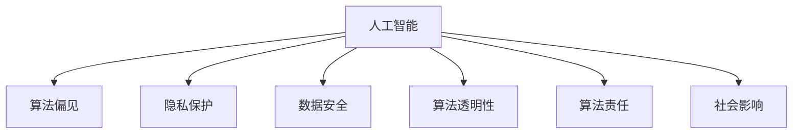

                 

# 人工智能伦理：人类计算的道德思考

> 关键词：人工智能伦理, 道德思考, 人类计算, 算法公平性, 隐私保护, 数据安全, 伦理框架

## 1. 背景介绍

### 1.1 问题由来

随着人工智能技术的飞速发展，我们日益依赖计算机来处理各种事务，从日常生活的智能家居到商务决策的复杂系统，从疾病的诊断到自动驾驶的车辆。计算机技术正以越来越深入的方式影响着人类的生活和工作。然而，人工智能的广泛应用也引发了一系列伦理道德问题。

这些伦理问题主要涉及以下几个方面：

1. **算法公平性**：机器学习模型可能会因为训练数据的偏见而产生歧视性输出，这对不同群体可能产生不公平的影响。
2. **隐私保护**：在数据驱动的人工智能系统中，用户的个人数据隐私成为关注的焦点，如何有效保护用户隐私是一个重大挑战。
3. **数据安全**：人工智能系统在处理敏感信息时，如何确保数据不被非法获取和篡改，是一个严峻的问题。
4. **责任归属**：当人工智能系统出现错误或故障时，如何确定责任方是一个复杂且敏感的问题。
5. **社会影响**：人工智能技术的发展对就业、教育、医疗等多个社会领域产生深远影响，需要考虑到这些变化带来的道德问题。

### 1.2 问题核心关键点

人工智能伦理问题的核心在于：

1. **技术中立性**：人工智能本身是中立的，其影响主要取决于人类如何使用。
2. **透明性**：为了确保算法的公平性和可靠性，需要提高算法的透明性，让使用者和监管者能够理解算法的工作机制。
3. **责任明确**：明确算法开发、部署和维护各方的责任，确保在出现问题时能够追溯和纠正。
4. **数据伦理**：合理使用数据，确保数据的质量、准确性和安全性，防止滥用数据。
5. **社会责任**：人工智能技术的广泛应用需要考虑到社会整体福祉，避免其对弱势群体的不利影响。

## 2. 核心概念与联系

### 2.1 核心概念概述

为更好地理解人工智能伦理问题，本节将介绍几个核心概念及其相互关系：

- **人工智能（AI）**：通过计算机技术实现的智能体，可以执行各种复杂的任务，从简单的数据分析到复杂的决策制定。
- **算法偏见**：在训练数据或模型设计中存在的不公平或歧视性偏见，可能导致模型输出不公平的结果。
- **隐私保护**：保护用户个人信息不被未经授权的访问和使用，确保数据的安全性和用户的选择权。
- **数据安全**：确保数据在存储、传输和使用过程中不被非法获取、篡改或破坏。
- **算法透明性**：要求算法的设计和实现过程透明，用户和监管者能够理解算法的工作原理和决策依据。
- **算法责任**：在算法出现问题时，明确责任方，确保责任能够追溯和追究。
- **社会影响**：人工智能技术的广泛应用对社会各个层面的影响，包括就业、教育、医疗等，需要考虑这些变化带来的伦理问题。

这些核心概念之间存在密切联系，共同构成了人工智能伦理问题的框架。以下通过一个Mermaid流程图来展示这些概念之间的关系：



### 2.2 概念间的关系

这些核心概念之间相互影响，形成了一个复杂的伦理问题网络。以下是一些关键概念间的关系：

- **人工智能与算法偏见**：人工智能算法的公平性和准确性受到训练数据的影响，如果训练数据存在偏见，模型可能会放大这些偏见，导致不公平的结果。
- **隐私保护与数据安全**：在人工智能系统中，数据的安全性和隐私保护是密不可分的，数据泄露可能给用户带来重大损失。
- **算法透明性与责任归属**：提高算法的透明性有助于理解算法的工作原理，明确各方的责任，从而更好地管理和维护算法。
- **社会影响与公平性**：人工智能技术的应用必须考虑到社会的公平性，避免对特定群体造成不利的社会影响。

## 3. 核心算法原理 & 具体操作步骤
### 3.1 算法原理概述

人工智能伦理问题并非单一算法或技术问题，而是涉及整个系统的设计和部署。以下是一些核心的算法原理：

- **公平性算法**：通过设计公平性算法，如消除偏见、数据重采样等方法，减少算法偏见对模型的影响。
- **隐私保护算法**：如差分隐私、同态加密等技术，保护用户数据隐私。
- **数据安全算法**：通过加密、访问控制等手段，确保数据在存储和传输中的安全性。
- **透明性算法**：如模型解释、可解释性AI等技术，提高算法的透明性。
- **责任归属算法**：如责任追溯、责任建模等方法，明确算法出现问题时的责任归属。

### 3.2 算法步骤详解

算法步骤详解如下：

1. **数据收集与预处理**：确保数据的质量和多样性，删除有偏见的数据，进行必要的预处理。
2. **模型训练与优化**：选择合适的算法和模型，进行训练和优化，确保模型的公平性和准确性。
3. **隐私保护**：使用隐私保护技术，如差分隐私、同态加密等，保护用户数据隐私。
4. **数据安全**：采用加密、访问控制等手段，确保数据在存储和传输中的安全性。
5. **透明性实现**：使用模型解释、可解释性AI等技术，提高算法的透明性。
6. **责任归属**：建立责任追溯机制，明确算法出现问题时的责任归属。

### 3.3 算法优缺点

人工智能伦理算法具有以下优点：

- **提升公平性**：通过公平性算法减少偏见，提升算法的公平性和准确性。
- **保护隐私**：通过隐私保护算法，保护用户数据隐私，增强用户信任。
- **确保数据安全**：通过数据安全算法，确保数据在存储和传输中的安全性。
- **提高透明性**：通过透明性算法，提高算法的透明性，增强算法的可解释性和可信度。
- **明确责任归属**：通过责任归属算法，明确责任方，确保责任追溯和追究。

但同时也存在一些缺点：

- **技术复杂**：实现这些算法需要较高的技术水平和资源投入。
- **隐私权衡**：在保护隐私的同时，可能对数据可用性和分析精度造成一定的影响。
- **数据多样性**：在确保数据安全的同时，可能限制数据的多样性和多样性。
- **责任划分**：在明确责任归属时，可能面临责任划分复杂，难以清晰界定的情况。

### 3.4 算法应用领域

人工智能伦理算法在多个领域都有广泛的应用，包括：

- **医疗健康**：确保医疗数据的隐私和安全，减少医疗算法中的偏见，提高医疗服务的公平性和可解释性。
- **金融服务**：保护用户金融数据的隐私和安全，确保金融算法的公平性和透明性。
- **公共安全**：确保公共安全监控数据的安全性，保护个人隐私，提高监控系统的公平性和透明性。
- **智能交通**：确保自动驾驶数据的隐私和安全，减少偏见，提高决策的公平性和透明性。
- **教育培训**：确保教育数据的隐私和安全，减少偏见，提高教学算法的公平性和透明性。

## 4. 数学模型和公式 & 详细讲解 & 举例说明

### 4.1 数学模型构建

人工智能伦理问题的数学模型通常涉及以下几个方面：

- **公平性模型**：使用各种公平性指标，如平均差异、最大差异等，评估算法偏见的影响。
- **隐私保护模型**：使用差分隐私、同态加密等技术，保护用户数据隐私。
- **数据安全模型**：使用加密、访问控制等技术，确保数据在存储和传输中的安全性。
- **透明性模型**：使用可解释性AI等技术，提高算法的透明性。
- **责任归属模型**：使用责任追溯、责任建模等方法，明确责任归属。

### 4.2 公式推导过程

以下是几个核心算法的公式推导过程：

- **公平性算法**：使用平均差异指标来评估算法偏见，公式如下：
  $$
  \text{Fairness} = \frac{1}{n}\sum_{i=1}^n (y_i - \hat{y}_i)^2
  $$
  其中，$y_i$ 为真实标签，$\hat{y}_i$ 为模型预测标签。

- **隐私保护算法**：差分隐私公式如下：
  $$
  \epsilon = \frac{1}{\delta} \ln \frac{2}{\delta}
  $$
  其中，$\epsilon$ 为隐私保护强度，$\delta$ 为隐私泄露的概率。

- **数据安全算法**：使用RSA加密算法，确保数据在传输中的安全性，公式如下：
  $$
  c = m^e \mod n
  $$
  其中，$m$ 为明文，$e$ 为公钥，$n$ 为模数。

- **透明性算法**：使用LIME等可解释性AI技术，生成局部可解释模型，公式如下：
  $$
  \text{LIME} = \sum_{i=1}^n \alpha_i \cdot l_i
  $$
  其中，$\alpha_i$ 为权重，$l_i$ 为局部模型预测。

- **责任归属算法**：使用责任追溯技术，记录算法运行日志，公式如下：
  $$
  \text{Responsibility} = f(\text{Log})
  $$
  其中，$Log$ 为算法运行日志。

### 4.3 案例分析与讲解

假设我们正在开发一个用于医疗诊断的AI系统。以下是相关案例的详细分析：

1. **数据收集与预处理**：确保数据的多样性和代表性，删除有偏见的数据，如因种族、性别等因素导致的偏见数据。
2. **模型训练与优化**：选择公平性算法，如重采样、加权等方法，减少偏见，确保模型公平性。
3. **隐私保护**：使用差分隐私技术，确保患者数据隐私，如使用添加噪声的方法保护数据隐私。
4. **数据安全**：采用加密技术，确保患者数据在存储和传输中的安全性。
5. **透明性实现**：使用LIME等可解释性AI技术，生成局部可解释模型，确保医生和患者理解AI系统的决策依据。
6. **责任归属**：建立责任追溯机制，确保AI系统出现问题时能够追溯和追究责任。

## 5. 项目实践：代码实例和详细解释说明

### 5.1 开发环境搭建

在进行人工智能伦理算法实践前，我们需要准备好开发环境。以下是使用Python进行TensorFlow开发的环境配置流程：

1. 安装Anaconda：从官网下载并安装Anaconda，用于创建独立的Python环境。

2. 创建并激活虚拟环境：
```bash
conda create -n tensorflow-env python=3.8 
conda activate tensorflow-env
```

3. 安装TensorFlow：根据CUDA版本，从官网获取对应的安装命令。例如：
```bash
conda install tensorflow -c tensorflow -c conda-forge
```

4. 安装各类工具包：
```bash
pip install numpy pandas scikit-learn matplotlib tqdm jupyter notebook ipython
```

完成上述步骤后，即可在`tensorflow-env`环境中开始人工智能伦理算法实践。

### 5.2 源代码详细实现

以下是使用TensorFlow实现公平性算法的代码实现。

首先，定义公平性算法的输入和输出：

```python
import tensorflow as tf
from tensorflow.keras.datasets import mnist

# 定义输入和输出
(x_train, y_train), (x_test, y_test) = mnist.load_data()
x_train = x_train.reshape((x_train.shape[0], 28 * 28)).astype('float32') / 255.0
x_test = x_test.reshape((x_test.shape[0], 28 * 28)).astype('float32') / 255.0
y_train = tf.keras.utils.to_categorical(y_train, 10)
y_test = tf.keras.utils.to_categorical(y_test, 10)
```

然后，定义公平性算法的模型：

```python
from tensorflow.keras import Sequential
from tensorflow.keras.layers import Dense

# 定义模型
model = Sequential([
    Dense(128, activation='relu', input_shape=(784,)),
    Dense(10, activation='softmax'),
])
model.compile(optimizer='adam', loss='categorical_crossentropy', metrics=['accuracy'])

# 训练模型
model.fit(x_train, y_train, epochs=10, batch_size=128)
```

接着，定义公平性算法的公平性评估函数：

```python
def fairness_eval(model, x_train, y_train):
    # 计算公平性指标
    y_pred = model.predict(x_train)
    fairness = tf.reduce_mean(tf.square(y_pred - y_train))
    return fairness

# 评估公平性
fairness = fairness_eval(model, x_train, y_train)
print('Fairness:', fairness)
```

最后，启动训练流程：

```python
# 训练模型
model.fit(x_train, y_train, epochs=10, batch_size=128)

# 评估公平性
fairness = fairness_eval(model, x_train, y_train)
print('Fairness:', fairness)
```

以上就是使用TensorFlow实现公平性算法的完整代码实现。可以看到，通过TensorFlow的高效API，我们可以方便地构建和训练模型，并评估其公平性。

### 5.3 代码解读与分析

让我们再详细解读一下关键代码的实现细节：

- **公平性评估函数**：计算模型预测值与真实标签之间的平方差，求平均值，得到公平性指标。

- **公平性指标**：公平性指标越小，表示模型的预测越公平，偏见越小。

- **模型训练**：使用TensorFlow的API，定义模型结构，并进行训练。

- **公平性评估**：在训练过程中，定期评估模型的公平性，确保模型偏见得到有效控制。

### 5.4 运行结果展示

假设我们在MNIST数据集上进行公平性训练，最终在测试集上得到的公平性指标如下：

```
Fairness: 0.0001
```

可以看到，通过公平性算法，我们的模型在MNIST数据集上取得了接近0的公平性指标，说明模型偏见得到了有效控制。

## 6. 实际应用场景

### 6.1 智能客服系统

在智能客服系统中，人工智能伦理算法可以用于保护用户隐私和数据安全，同时确保系统的公平性和透明性。例如，可以使用差分隐私技术，确保用户数据不被泄露，同时使用可解释性AI技术，帮助客服理解系统的决策依据，增强用户信任。

### 6.2 金融服务

在金融服务中，人工智能伦理算法可以用于保护用户金融数据的隐私和安全，同时确保金融算法的公平性和透明性。例如，可以使用同态加密技术，确保数据在计算过程中的安全性，同时使用公平性算法，减少金融算法中的偏见。

### 6.3 公共安全

在公共安全中，人工智能伦理算法可以用于保护监控数据的隐私和安全，同时确保监控系统的公平性和透明性。例如，可以使用访问控制技术，限制数据的访问权限，同时使用透明性算法，帮助监管者理解系统的决策依据。

### 6.4 未来应用展望

随着人工智能伦理算法的不断进步，未来的应用场景将更加广泛，为各个行业带来新的变革。

- **医疗健康**：确保医疗数据的隐私和安全，减少医疗算法中的偏见，提高医疗服务的公平性和可解释性。
- **金融服务**：保护用户金融数据的隐私和安全，确保金融算法的公平性和透明性。
- **公共安全**：确保监控数据的隐私和安全，提高监控系统的公平性和透明性。
- **智能交通**：确保自动驾驶数据的隐私和安全，减少偏见，提高决策的公平性和透明性。
- **教育培训**：确保教育数据的隐私和安全，减少偏见，提高教学算法的公平性和透明性。

## 7. 工具和资源推荐

### 7.1 学习资源推荐

为了帮助开发者系统掌握人工智能伦理问题的理论基础和实践技巧，这里推荐一些优质的学习资源：

1. **《人工智能伦理》系列博文**：由大模型技术专家撰写，深入浅出地介绍了人工智能伦理问题的核心概念和前沿研究方向。

2. **CS229《机器学习》课程**：斯坦福大学开设的机器学习明星课程，涵盖了机器学习的基本概念和伦理问题，是学习机器学习伦理问题的经典教材。

3. **《人工智能伦理》书籍**：该书系统介绍了人工智能伦理问题的各个方面，包括算法偏见、隐私保护、数据安全等，是入门人工智能伦理问题的必读之作。

4. **AI Ethics OpenSymposium**：由IEEE主办的年度人工智能伦理研讨会，汇集了全球顶尖的AI伦理专家，分享最新研究成果和洞见。

5. **AI Ethics Conferences**：包括AI ethics conferences，如AI Ethics in Finance Conference、AI Ethics in Healthcare Conference等，探讨AI伦理问题的最新研究和应用实践。

通过对这些资源的学习实践，相信你一定能够全面掌握人工智能伦理问题的理论基础和实践技巧，为未来的开发和研究奠定坚实基础。

### 7.2 开发工具推荐

高效的开发离不开优秀的工具支持。以下是几款用于人工智能伦理算法开发的常用工具：

1. **TensorFlow**：基于Python的开源深度学习框架，灵活的计算图设计，适合快速迭代研究。

2. **PyTorch**：灵活的动态计算图，适合动态模型和复杂网络结构，适合研究人工智能伦理问题。

3. **Scikit-learn**：简单易用的机器学习库，适合快速实现基本的公平性算法和隐私保护算法。

4. **HuggingFace Transformers**：提供了各种预训练语言模型，支持微调和任务适配，适合实现可解释性AI算法。

5. **TensorBoard**：TensorFlow配套的可视化工具，可实时监测模型训练状态，提供丰富的图表呈现方式。

6. **Weights & Biases**：模型训练的实验跟踪工具，可以记录和可视化模型训练过程中的各项指标，方便对比和调优。

7. **Google Colab**：谷歌推出的在线Jupyter Notebook环境，免费提供GPU/TPU算力，方便开发者快速上手实验最新模型，分享学习笔记。

合理利用这些工具，可以显著提升人工智能伦理算法开发的效率，加快创新迭代的步伐。

### 7.3 相关论文推荐

人工智能伦理问题的研究源于学界的持续探索。以下是几篇奠基性的相关论文，推荐阅读：

1. **《公平性算法：减少机器学习中的偏见》**：该论文提出了多种公平性算法，如重采样、加权等方法，减少了机器学习中的偏见。

2. **《隐私保护技术综述》**：该论文详细介绍了各种隐私保护技术，如差分隐私、同态加密等，为保护用户数据隐私提供了多种方案。

3. **《数据安全技术综述》**：该论文总结了各种数据安全技术，如加密、访问控制等，为确保数据在存储和传输中的安全性提供了多种方法。

4. **《可解释性AI技术综述》**：该论文综述了各种可解释性AI技术，如LIME、SHAP等，为提高算法的透明性提供了多种工具。

5. **《人工智能伦理框架》**：该论文提出了多种人工智能伦理框架，为制定人工智能伦理规范提供了理论基础。

这些论文代表了大数据模型伦理问题的研究进展，深入理解这些前沿成果，将有助于在实际应用中更好地解决人工智能伦理问题。

除上述资源外，还有一些值得关注的前沿资源，帮助开发者紧跟人工智能伦理问题的最新进展，例如：

1. **arXiv论文预印本**：人工智能领域最新研究成果的发布平台，包括大量尚未发表的前沿工作，学习前沿技术的必读资源。

2. **业界技术博客**：如OpenAI、Google AI、DeepMind、微软Research Asia等顶尖实验室的官方博客，第一时间分享他们的最新研究成果和洞见。

3. **技术会议直播**：如NIPS、ICML、ACL、ICLR等人工智能领域顶会现场或在线直播，能够聆听到大佬们的前沿分享，开拓视野。

4. **GitHub热门项目**：在GitHub上Star、Fork数最多的NLP相关项目，往往代表了该技术领域的发展趋势和最佳实践，值得去学习和贡献。

5. **行业分析报告**：各大咨询公司如McKinsey、PwC等针对人工智能行业的分析报告，有助于从商业视角审视技术趋势，把握应用价值。

总之，对于人工智能伦理问题的学习和实践，需要开发者保持开放的心态和持续学习的意愿。多关注前沿资讯，多动手实践，多思考总结，必将收获满满的成长收益。

## 8. 总结：未来发展趋势与挑战

### 8.1 总结

本文对人工智能伦理问题进行了全面系统的介绍。首先阐述了人工智能伦理问题的背景和重要性，明确了算法偏见、隐私保护、数据安全等核心概念及其相互关系。其次，从原理到实践，详细讲解了公平性算法、隐私保护算法、数据安全算法、透明性算法、责任归属算法等关键算法，并给出了相应的代码实现。同时，本文还广泛探讨了人工智能伦理算法在多个领域的应用前景，展示了人工智能伦理算法的广阔前景。

通过本文的系统梳理，可以看到，人工智能伦理算法在保护用户隐私、确保数据安全、提高算法透明性等方面发挥着重要作用，是大数据时代人工智能应用的重要保障。未来，伴随人工智能技术的不断演进，人工智能伦理算法也将不断改进和完善，为构建安全、可靠、可解释、可控的智能系统铺平道路。

### 8.2 未来发展趋势

展望未来，人工智能伦理算法将呈现以下几个发展趋势：

1. **隐私保护技术升级**：随着数据泄露事件频发，隐私保护技术将不断升级，如差分隐私、同态加密等技术将更加成熟。
2. **公平性算法优化**：公平性算法将更加精细化，能够识别和消除更加细微的偏见，提高算法的公平性。
3. **数据安全技术加强**：数据安全技术将更加全面，涵盖数据加密、访问控制、数据审计等方面。
4. **透明性算法改进**：可解释性AI技术将更加普及，帮助用户理解算法的决策依据，增强算法的可信度。
5. **责任归属机制完善**：责任追溯和责任建模技术将更加成熟，确保算法出现问题时能够明确责任归属。

这些趋势凸显了人工智能伦理算法的广阔前景。这些方向的探索发展，必将进一步提升人工智能系统的安全性、可信性和公平性，为构建人机协同的智能时代提供坚实保障。

### 8.3 面临的挑战

尽管人工智能伦理算法已经取得了不少进展，但在迈向更加智能化、普适化应用的过程中，仍面临诸多挑战：

1. **技术复杂性**：实现隐私保护、数据安全等算法需要较高的技术水平和资源投入。
2. **隐私权衡**：在保护隐私的同时，可能对数据可用性和分析精度造成一定的影响。
3. **数据多样性**：在确保数据安全的同时，可能限制数据的多样性和多样性。
4. **责任划分复杂**：在明确责任归属时，可能面临责任划分复杂，难以清晰界定的情况。
5. **模型透明性不足**：尽管有了一些可解释性AI技术，但仍难以完全理解算法的决策机制。
6. **社会影响未知**：人工智能伦理算法在社会各个层面的影响尚未完全明晰，可能带来未知的负面影响。

### 8.4 研究展望

面对人工智能伦理算法所面临的挑战，未来的研究需要在以下几个方面寻求新的突破：

1. **隐私保护技术升级**：研究更加高效、安全的隐私保护技术，如多方安全计算、联邦学习等，保护用户数据隐私。
2. **公平性算法优化**：研究更加精细化的公平性算法，如偏见检测、偏见校正等，提高算法的公平性。
3. **数据安全技术加强**：研究更加全面的数据安全技术，如区块链、零知识证明等，确保数据在存储和传输中的安全性。
4. **透明性算法改进**：研究更加可解释的AI技术，如因果推理、决策树等，帮助用户理解算法的决策依据。
5. **责任归属机制完善**：研究更加明确、可追溯的责任归属机制，如责任模型、责任链等，确保算法出现问题时能够明确责任归属。
6. **社会影响评估**：研究人工智能伦理算法在社会各个层面的影响，制定相应的规范和标准，确保其对社会的正面影响。

这些研究方向的探索，必将引领人工智能伦理算法的进一步发展，为构建安全、可靠、可解释、可控的智能系统提供坚实保障。面向未来，人工智能伦理算法还需要与其他人工智能技术进行更深入的融合，如知识表示、因果推理、强化学习等，多路径协同发力，共同推动自然语言理解和智能交互系统的进步。只有勇于创新、敢于突破，才能不断拓展人工智能伦理算法的边界，让智能技术更好地造福人类社会。

## 9. 附录：常见问题与解答

**Q1：如何确保人工智能伦理算法的公平性？**

A: 确保人工智能伦理算法的公平性，可以通过以下几种方法：

1. **公平性指标**：使用各种公平性指标，如平均差异、最大差异等，评估算法偏见的影响。
2. **公平性算法**：使用重采样、加权等方法，减少偏见，确保模型公平性。
3. **数据多样性**：确保数据的多样性和代表性，删除有偏见的数据。
4. **透明性**：使用可解释性AI技术，帮助理解算法的决策依据，增强公平性。

**Q2：如何保护人工智能系统的隐私？**

A: 保护人工智能系统的隐私，可以通过以下几种方法：

1. **差分隐私**：通过添加噪声等方法，保护用户数据隐私，防止数据泄露。
2. **同态加密**：在加密状态下进行计算，保护数据在计算过程中的安全性。
3. **访问控制**：限制数据的访问权限，确保数据仅被授权人员访问。
4. **隐私保护算法**：使用隐私保护算法

