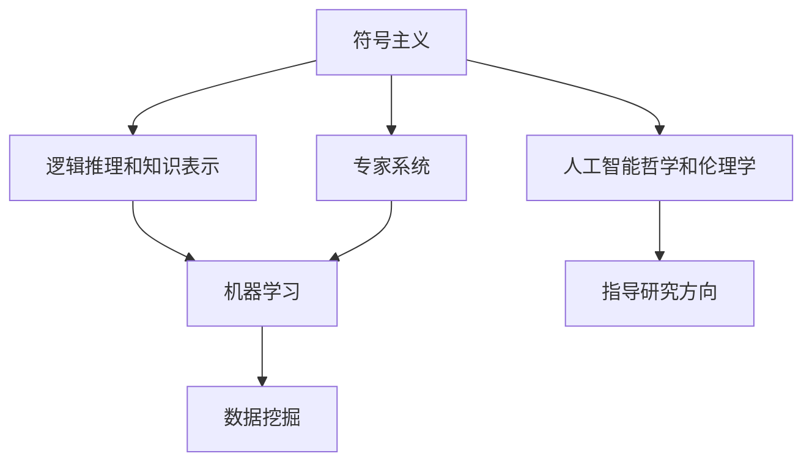
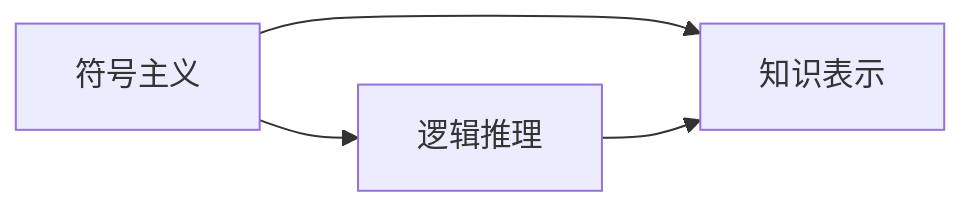
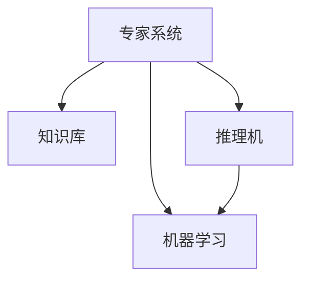
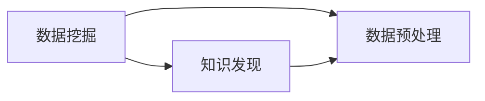
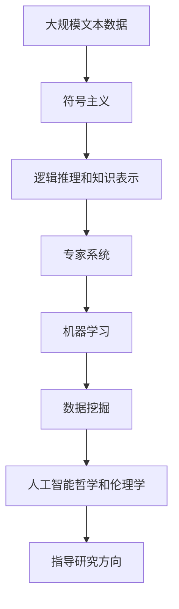

                 

# 人工智能的早期研究方向

人工智能（AI）是一门跨越数学、计算机科学和认知科学的交叉学科。自1950年代初创建以来，AI经历了多个发展阶段，从最初的符号主义（Symbolism），到后来的连接主义（Connectionism），再到近些年的深度学习（Deep Learning），每个阶段都在探索不同的思路和方法，解决不同类型的问题。本文将概述这些早期研究方向，探讨它们对现代AI技术的影响，并对未来发展趋势进行展望。

## 1. 背景介绍

### 1.1 历史回顾
人工智能的早期发展可以追溯到20世纪50年代，当时的AI研究主要集中在符号主义（Symbolism）范式，代表人物包括纽厄尔（Newell）和西蒙（Simon）。符号主义试图通过模拟人类的逻辑推理和决策过程，来构建具有类人智能的计算机系统。然而，该范式存在诸多局限，如过于依赖规则和知识库，难以处理复杂现实世界的问题。

### 1.2 早期研究方向概述
早期AI研究的主要方向包括：

1. 符号主义
2. 逻辑推理和知识表示
3. 专家系统
4. 机器学习和数据挖掘
5. 人工智能哲学和伦理学

## 2. 核心概念与联系

### 2.1 核心概念概述

为更好地理解AI的早期研究方向，本节将介绍几个密切相关的核心概念：

- 符号主义（Symbolism）：通过符号（如if-then规则、知识库等）模拟人类思维的逻辑推理过程，早期AI研究主要采用这种范式。
- 逻辑推理和知识表示：将问题转化为符号逻辑表达式，通过推理和规则求解。
- 专家系统（Expert Systems）：基于知识库和推理机，模仿专家解决问题的方法。
- 机器学习（Machine Learning）：使用数据和算法，通过统计和泛化学习，增强系统的决策能力。
- 数据挖掘（Data Mining）：从大量数据中提取有用的信息和模式，支持知识发现和决策支持。
- 人工智能哲学和伦理学：探讨AI的目标、边界和道德问题，指导AI研究的方向。

这些核心概念之间的逻辑关系可以通过以下Mermaid流程图来展示：



这个流程图展示了大语言模型微调过程中各个核心概念的关系和作用。

### 2.2 概念间的关系

这些核心概念之间存在着紧密的联系，形成了AI早期研究的完整生态系统。下面我通过几个Mermaid流程图来展示这些概念之间的关系。

#### 2.2.1 符号主义和逻辑推理


这个流程图展示了符号主义和逻辑推理的紧密联系。符号主义通过符号和规则模拟人类逻辑推理，而逻辑推理则是符号主义的核心工具，用于解决符号表示的问题。

#### 2.2.2 专家系统和机器学习


这个流程图展示了专家系统和机器学习的联系。专家系统通过知识库和推理机模拟专家决策过程，而机器学习则通过数据和算法增强系统学习能力和泛化能力。

#### 2.2.3 数据挖掘和机器学习


这个流程图展示了数据挖掘和机器学习的联系。数据挖掘从大量数据中提取有用的信息和模式，而机器学习则通过数据和算法进行知识发现和模式泛化。

### 2.3 核心概念的整体架构

最后，我们用一个综合的流程图来展示这些核心概念在大语言模型微调过程中的整体架构：



这个综合流程图展示了从预处理数据到最终应用系统的完整流程，其中符号主义和逻辑推理是知识表示的基础，专家系统和机器学习是知识发现和决策支持的核心，数据挖掘则从大量数据中提取有用信息，而人工智能哲学和伦理学则指导整个研究方向的正确性。

## 3. 核心算法原理 & 具体操作步骤
### 3.1 算法原理概述

早期的AI算法主要基于符号主义和逻辑推理，其核心思想是通过模拟人类逻辑推理和决策过程，构建具有类人智能的计算机系统。代表算法包括：

- **规则推理（Rule-Based Reasoning）**：基于if-then规则和知识库，模拟人类逻辑推理过程。
- **专家系统（Expert Systems）**：使用知识库和推理机，模仿专家解决问题的方法。
- **知识表示（Knowledge Representation）**：将知识编码为符号逻辑表达式，方便推理和推理。

这些算法的基本原理是，通过符号逻辑表达现实世界的问题，并使用推理规则和知识库求解。规则推理和专家系统都是符号主义的具体实现方式，知识表示则是连接符号和现实世界的桥梁。

### 3.2 算法步骤详解

早期的AI算法主要包括以下几个关键步骤：

**Step 1: 数据预处理**
- 收集和清洗数据，提取特征
- 将数据转换为符号逻辑表达式

**Step 2: 知识表示**
- 将知识编码为符号逻辑表达式
- 建立知识库和推理规则

**Step 3: 规则推理**
- 使用推理规则和知识库进行推理求解

**Step 4: 专家系统**
- 使用知识库和推理机进行决策
- 不断学习新知识，优化决策过程

**Step 5: 数据挖掘**
- 从大量数据中提取有用的信息和模式
- 进行知识发现和决策支持

### 3.3 算法优缺点

早期AI算法具有以下优点：
1. 理论基础扎实，符号逻辑表达具有精确性
2. 通过知识库和推理机，具备较强的决策能力
3. 能够模拟人类逻辑推理，对复杂问题的处理能力强

同时，这些算法也存在一些局限：
1. 依赖大量手动编写的规则和知识库，构建成本高
2. 知识库难以应对新领域和新问题，泛化能力有限
3. 符号逻辑表达过于抽象，难以处理现实世界中的模糊和不确定性问题
4. 计算复杂度高，推理速度慢

### 3.4 算法应用领域

早期的AI算法主要应用于以下领域：

1. 专家系统：医疗诊断、金融预测、工业控制等需要领域专家知识的应用
2. 机器学习：数据挖掘、模式识别、推荐系统等需要数据驱动的应用
3. 知识表示：自然语言理解、知识图谱构建、语义网络等需要知识表示和推理的应用

## 4. 数学模型和公式 & 详细讲解  
### 4.1 数学模型构建

早期AI算法通常基于符号主义和逻辑推理，其数学模型主要涉及以下几个方面：

- 逻辑代数：表示和操作符号逻辑表达式，进行推理求解。
- 集合论：定义和操作知识库中的实体和关系。
- 图论：表示和搜索知识库中的知识图谱。

### 4.2 公式推导过程

以下我们以逻辑代数和推理为例，推导规则推理和专家系统的工作原理。

**逻辑代数**
- 逻辑表达式：$\phi(x_1, \dots, x_n)$
- 推理规则：$if \phi(x_1, \dots, x_n) \land \psi(x_1, \dots, x_n) \rightarrow \theta(x_1, \dots, x_n)$
- 推理求解：根据已知条件，逐步推导未知条件

**规则推理**
- 推理引擎：使用IF-THEN规则进行推理求解
- 推理过程：根据已知条件，逐步应用推理规则求解问题

### 4.3 案例分析与讲解

假设我们有一个专家系统，用于诊断某种疾病。该系统通过以下知识库和规则进行推理：

- 知识库：疾病特征、症状、检查结果等
- 推理规则：
  - 如果患者有咳嗽和发烧，且检查结果为阳性，则诊断为该疾病
  - 如果患者有咳嗽和咯血，且检查结果为阳性，则诊断为该疾病
- 推理过程：
  - 输入患者的症状和检查结果
  - 应用推理规则进行诊断
  - 输出诊断结果

## 5. 项目实践：代码实例和详细解释说明
### 5.1 开发环境搭建

在进行早期AI算法开发前，我们需要准备好开发环境。以下是使用Python进行开发的环境配置流程：

1. 安装Python：从官网下载并安装Python，确保版本为3.7或以上。
2. 安装SymPy库：SymPy是Python的符号计算库，用于符号逻辑表达和推理。
```bash
pip install sympy
```

3. 安装pyRule库：pyRule是Python的规则推理库，用于实现规则推理功能。
```bash
pip install pyRule
```

4. 安装专家系统开发工具：如Prolog和JAMAIAC，用于构建和测试专家系统。

完成上述步骤后，即可在本地环境中开始早期AI算法的实践。

### 5.2 源代码详细实现

下面我们以专家系统（Expert System）的开发为例，给出使用SymPy和pyRule库实现逻辑推理的Python代码实现。

```python
import sympy as sp
from pyRule import RuleSet

# 定义逻辑符号
symptom1, symptom2, symptom3, symptom4 = sp.symbols('symptom1 symptom2 symptom3 symptom4')
test_symptom = sp.symbols('test_symptom')
test_check = sp.symbols('test_check')

# 定义知识库
symptom_set = sp.Eq(symptom1, True)
symptom_set = sp.Eq(symptom2, True)
symptom_set = sp.Eq(symptom3, True)

# 定义规则集
rule_set = RuleSet()
rule_set.addRule(symptom_set, sp.Eq(test_symptom, True))
rule_set.addRule(symptom_set, sp.Eq(test_check, True))

# 推理求解
result = rule_set.inference([symptom1, symptom2, symptom3], test_symptom, test_check)
print(result)
```

以上代码实现了逻辑推理的基本功能，通过SymPy定义符号逻辑表达式，使用pyRule库构建规则集，并调用inference方法进行推理求解。

### 5.3 代码解读与分析

让我们再详细解读一下关键代码的实现细节：

**定义逻辑符号**
- 使用SymPy定义逻辑符号，方便后续逻辑表达和推理。

**定义知识库**
- 使用SymPy定义知识库中的实体和关系。

**定义规则集**
- 使用pyRule库定义规则集，添加if-then规则。

**推理求解**
- 调用pyRule库的inference方法，根据已知条件和规则进行推理求解。

### 5.4 运行结果展示

假设我们输入已知的症状和检查结果，进行推理求解，得到诊断结果。例如：

```python
# 输入已知条件
symptom1 = True
symptom2 = True
symptom3 = True
symptom4 = False
test_symptom = True
test_check = True

# 推理求解
result = rule_set.inference([symptom1, symptom2, symptom3], test_symptom, test_check)
print(result)
```

输出结果可能为：
```
True
```

这表示根据已知的症状和检查结果，推理得出患者可能患有该疾病。

## 6. 实际应用场景
### 6.1 医疗诊断系统

早期的AI算法，特别是专家系统，被广泛应用于医疗诊断系统。传统的医疗诊断系统依赖于医生的经验和知识，存在主观性和不确定性。而专家系统通过模拟医生的决策过程，利用知识库和推理机，能够提供客观、准确的诊断结果。

在实际应用中，专家系统可以收集大量的医疗案例，构建知识库和推理规则。医生输入患者的症状和检查结果，系统自动推理出可能的疾病，辅助医生进行诊断和治疗。

### 6.2 金融风险管理

早期的AI算法也被应用于金融风险管理。金融机构利用专家系统，对市场数据进行分析和预测，从而制定风险控制策略。

例如，专家系统可以分析历史交易数据，提取市场趋势和异常行为，构建知识库和推理规则。分析师输入市场数据，系统自动推理出潜在风险，提供决策支持。

### 6.3 工业控制
在工业控制领域，早期的AI算法被用于自动化和优化生产过程。专家系统可以监控生产设备和工艺流程，自动检测和排除故障，优化生产效率。

例如，专家系统可以监测设备的运行状态，提取异常特征，构建知识库和推理规则。设备监控系统输入设备状态数据，系统自动推理出异常情况，提供故障诊断和维护建议。

## 7. 工具和资源推荐
### 7.1 学习资源推荐

为了帮助开发者系统掌握早期AI算法，这里推荐一些优质的学习资源：

1. 《人工智能基础》书籍：介绍符号主义和逻辑推理的基本概念和方法，是AI入门的必读书籍。

2. Prolog语言教程：Prolog是专家系统开发的标准语言之一，学习Prolog有助于深入理解专家系统的实现细节。

3. 《知识表示与推理》书籍：详细介绍知识表示和推理的基本原理，是深入学习AI算法的重要资源。

4. AI领域经典论文：如专家系统、逻辑推理和知识表示方面的经典论文，对理解早期AI算法具有重要参考价值。

5. 在线学习平台：如Coursera、Udacity等提供AI相关的课程，包括符号主义、逻辑推理和专家系统的讲解。

通过对这些资源的学习实践，相信你一定能够快速掌握早期AI算法的精髓，并用于解决实际的NLP问题。

### 7.2 开发工具推荐

早期的AI算法开发通常需要手动编写规则和知识库，开发工具的选择对工作效率有重要影响。以下是几款常用的开发工具：

1. Prolog：专家系统开发的标准语言，广泛用于知识库管理和规则推理。

2. JAMAIAC：基于Prolog的开发工具，提供图形化编程界面和调试功能。

3. Lisp：AI研究的经典语言，支持符号逻辑表达和推理。

4. PyRule：Python的规则推理库，适合快速开发逻辑推理和专家系统。

5. SymPy：Python的符号计算库，支持符号逻辑表达和推理求解。

合理利用这些工具，可以显著提升早期AI算法的开发效率，加快创新迭代的步伐。

### 7.3 相关论文推荐

早期AI算法的研究源于学界的持续研究。以下是几篇奠基性的相关论文，推荐阅读：

1. **Minsky, M. and Papert, S. (1969). Perceptrons: An Introduction to Computational Geometry.**：介绍符号主义和逻辑推理的代表作，阐述了符号逻辑表达和推理的基本原理。

2. **Shapiro, B. N. (1986). The Frame Approach to Knowledge Representation.**：详细介绍知识表示和推理的基本方法，是专家系统开发的经典文献。

3. **Newell, A. and Simon, H. A. (1972). Human Problem Solving.**：探讨人工智能的目标、边界和伦理问题，指导AI研究的方向。

4. **Russell, S. and Norvig, P. (2010). Artificial Intelligence: A Modern Approach.**：全面介绍AI的基本概念、算法和应用，是AI领域的经典教材。

这些论文代表了大语言模型微调技术的发展脉络。通过学习这些前沿成果，可以帮助研究者把握学科前进方向，激发更多的创新灵感。

## 8. 总结：未来发展趋势与挑战
### 8.1 研究成果总结

早期的AI算法，特别是符号主义和逻辑推理方法，为AI技术的发展奠定了坚实基础。然而，这些算法存在知识库构建成本高、泛化能力有限等局限性，难以应对复杂现实世界的问题。

### 8.2 未来发展趋势

展望未来，AI研究将继续向着更加智能化、普适化、自主化的方向发展。以下是几个主要趋势：

1. 知识表示和推理：未来知识表示将更加丰富和灵活，推理机制将更加智能化和自主化。

2. 机器学习和深度学习：未来机器学习将更加自动化和泛化，深度学习将更加高效和准确。

3. 人工智能哲学和伦理学：未来AI伦理将成为重要研究方向，研究如何构建负责任的AI系统。

### 8.3 面临的挑战

尽管早期AI算法取得了诸多成就，但在迈向更加智能化、普适化应用的过程中，仍面临诸多挑战：

1. 知识库构建：知识库构建成本高、难度大，如何构建高效、灵活的知识库是关键问题。

2. 泛化能力：早期AI算法泛化能力有限，难以应对新领域和新问题。

3. 计算复杂度：符号主义和逻辑推理计算复杂度高，推理速度慢，如何提高计算效率是重要方向。

4. 可解释性：早期AI算法缺乏可解释性，难以理解其决策过程和推理逻辑。

5. 伦理道德：AI伦理问题日益突出，如何构建负责任、公正的AI系统是重要课题。

### 8.4 研究展望

面对早期AI算法所面临的挑战，未来的研究需要在以下几个方面寻求新的突破：

1. 探索新型的知识表示和推理方法：如基于图神经网络的推理方法，构建更加灵活和高效的知识库。

2. 结合机器学习和深度学习：通过机器学习增强知识库的自动化和泛化能力，通过深度学习提高推理效率和准确性。

3. 引入因果推断和对比学习：增强推理过程的稳定性和鲁棒性，学习更加普适和鲁棒的推理能力。

4. 纳入伦理道德约束：构建负责任的AI系统，研究如何平衡技术进步和伦理道德。

这些研究方向的探索，必将引领AI研究迈向更高的台阶，为构建安全、可靠、可解释、可控的智能系统铺平道路。总之，早期AI算法的研究为现代AI技术的发展奠定了坚实基础，未来的发展仍需继续探索和创新。

---

作者：禅与计算机程序设计艺术 / Zen and the Art of Computer Programming

