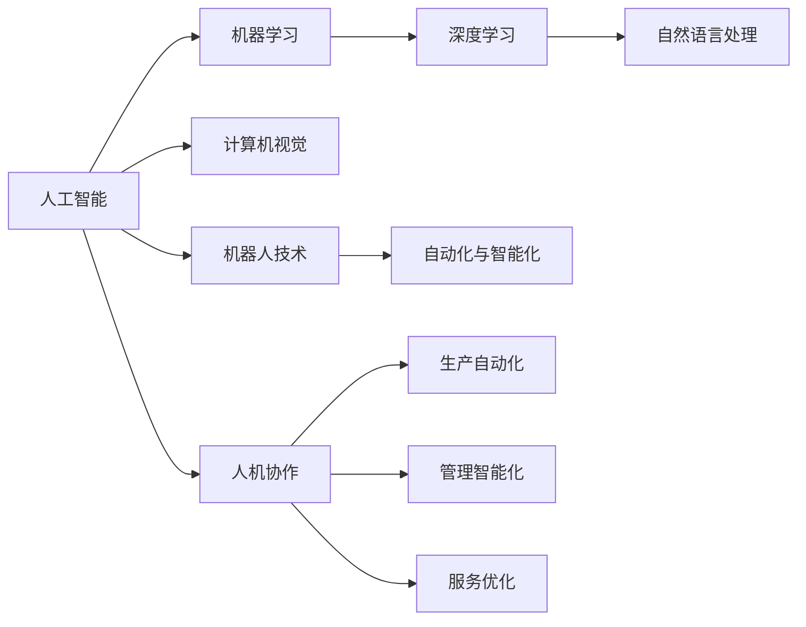
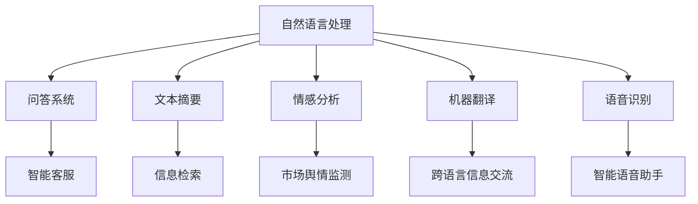
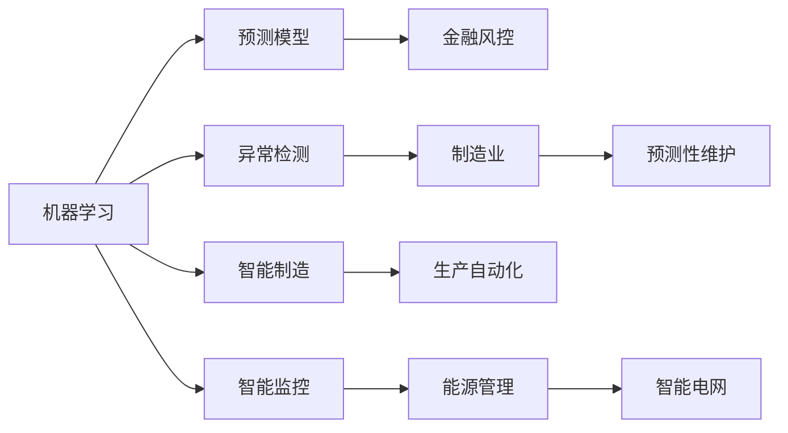
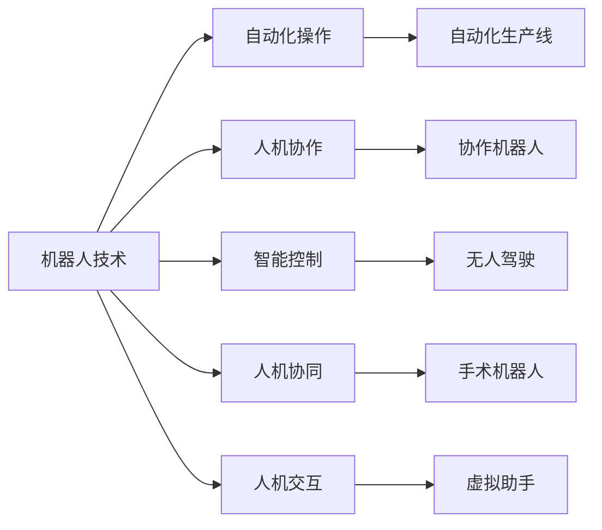
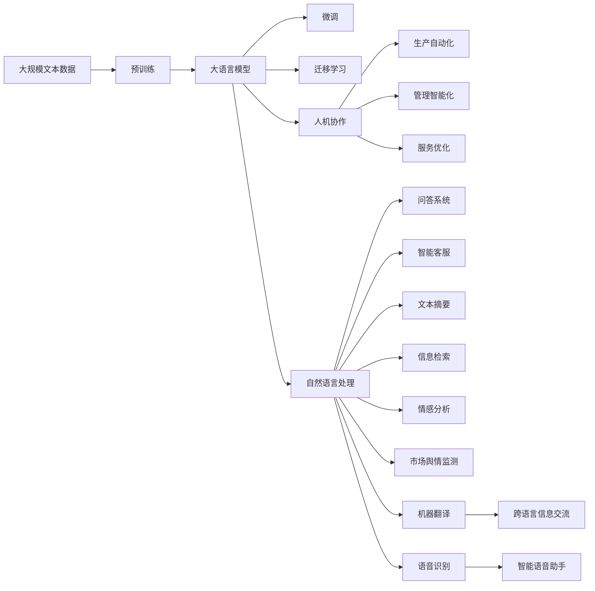

                 

# 人工智能：社会影响与思考

> 关键词：人工智能, 社会影响, 技术伦理, 隐私保护, 人机协作

## 1. 背景介绍

### 1.1 问题由来
随着人工智能(AI)技术的快速发展和应用普及，其在多个领域带来的影响越来越大，从医疗、教育、金融到交通、制造、农业等，几乎无所不包。然而，随着AI技术的深入应用，其在社会层面带来的影响也日益复杂和深远，引起了广泛关注和讨论。

本文聚焦于AI技术对社会的广泛影响，从技术、伦理、法律、经济等多个角度进行深入分析和探讨，旨在为各界人士提供更全面、更客观的认识，助力构建更加和谐、可持续的人工智能社会。

### 1.2 问题核心关键点
当前，AI技术对社会的影响主要体现在以下几个方面：

- **技术进步与失业风险**：自动化和智能化可能导致部分低技能工种被机器替代，影响就业结构，引发社会不稳定。
- **数据隐私与安全**：AI系统需要大量的数据支持训练和推理，但数据隐私和安全的保护始终是一个棘手的问题。
- **算法透明度与公平性**：AI系统的决策过程和逻辑往往是"黑盒"的，如何提高透明度、保障公平性，仍需持续探索。
- **伦理决策与责任界定**：AI在医疗、司法、公共安全等领域的应用，可能面临伦理困境和决策责任的界定问题。
- **经济社会不平等**：AI技术的部署和应用可能加剧或缓解社会不平等，取决于其治理和管理的模式。
- **伦理道德约束**：AI技术的应用应符合伦理道德标准，避免误用和滥用。

这些关键问题贯穿了AI技术发展的全过程，亟需通过深入研究和技术创新，寻找解决方案，确保AI技术健康、可持续地发展。

### 1.3 问题研究意义
深入探讨AI技术对社会的广泛影响，对于构建人工智能伦理框架、完善相关法律法规、指导AI技术的健康发展具有重要意义：

- **指导政策制定**：为政府和企业提供科学依据，制定更为合理的AI政策法规，确保AI技术的公平、公正和透明应用。
- **提升公众认知**：帮助公众理解AI技术的潜在影响，增强对AI的接受度和信任感，促进社会和谐。
- **促进技术创新**：为AI技术开发者提供新的研究方向和思路，推动技术进步。
- **保障社会公平**：确保AI技术在应用过程中，不扩大社会不平等，保障弱势群体的利益。
- **强化安全防范**：在AI技术应用中，注重隐私保护和伦理约束，防止技术滥用。

通过深入分析和讨论，我们希望为AI技术的应用提供更为全面、务实的指导，助力构建更为和谐、公正、可持续的人工智能社会。

## 2. 核心概念与联系

### 2.1 核心概念概述

为更好地理解AI技术对社会的广泛影响，本节将介绍几个密切相关的核心概念：

- **人工智能(AI)**：指通过算法和模型，使机器具备一定程度的智能和自主决策能力，包括机器学习、深度学习等子领域。
- **机器学习(ML)**：一种让机器从数据中学习规律，并应用这些规律进行预测和决策的技术。
- **深度学习(DL)**：一种基于多层神经网络的机器学习方法，模拟人脑神经元处理信息的过程。
- **自然语言处理(NLP)**：使机器能够理解和生成自然语言的技术，是AI的重要分支。
- **计算机视觉(CV)**：使机器能够理解和处理图像和视频数据的技术，广泛应用于自动驾驶、安防监控等领域。
- **机器人技术**：融合机械工程、控制理论、人工智能等多学科技术的交叉领域，目标是构建具有自主决策能力的机器人。
- **自动化与智能化**：通过引入AI技术，实现生产、管理、服务等方面的自动化和智能化，提升效率和质量。
- **人机协作**：在人类与机器的协同合作中，充分发挥各自优势，实现任务优化和效能提升。

这些核心概念之间的逻辑关系可以通过以下Mermaid流程图来展示：



这个流程图展示了人工智能技术的核心组成和应用领域：

1. **人工智能**：基础技术框架，涵盖机器学习、深度学习等多个子领域。
2. **机器学习**：提供数据驱动的学习能力。
3. **深度学习**：构建多层神经网络模型，实现更强大的学习与推理。
4. **自然语言处理**：使机器能够理解和生成自然语言。
5. **计算机视觉**：使机器能够理解和处理图像和视频数据。
6. **机器人技术**：结合机械工程与AI技术，构建自主决策的机器人。
7. **自动化与智能化**：将AI技术应用于生产、管理和服务中，提升效率和质量。
8. **人机协作**：通过AI技术，实现人与机器的协同工作，优化任务执行。

### 2.2 概念间的关系

这些核心概念之间存在着紧密的联系，形成了AI技术应用的整体生态系统。下面我们通过几个Mermaid流程图来展示这些概念之间的关系。

#### 2.2.1 AI技术的应用场景



这个流程图展示了NLP技术在多个应用场景中的具体应用：

1. **自然语言处理**：使机器能够理解和生成自然语言，包括问答、情感分析、翻译等任务。
2. **问答系统**：通过问答技术，提供实时问题解答服务。
3. **智能客服**：通过自然语言理解和生成技术，实现人机交互。
4. **文本摘要**：将长文本压缩成简短摘要，方便信息检索和阅读。
5. **信息检索**：根据用户查询，检索相关文本信息。
6. **情感分析**：分析用户文本中的情感倾向，帮助企业了解市场舆情。
7. **机器翻译**：实现语言间的自动翻译，促进跨语言信息交流。

#### 2.2.2 AI与自动化、智能化



这个流程图展示了AI技术在自动化和智能化领域的应用：

1. **机器学习**：构建预测模型，实现自动化决策。
2. **预测模型**：应用于金融风控，实现风险评估和预警。
3. **异常检测**：应用于制造业，实现设备故障预测和预防性维护。
4. **智能制造**：通过AI技术，优化生产流程，实现自动化生产。
5. **智能监控**：应用于能源管理，实现智能电网和能源优化。

#### 2.2.3 人机协作



这个流程图展示了机器人技术在多个领域中的应用：

1. **机器人技术**：构建具有自主决策能力的机器人，实现自动化操作。
2. **自动化操作**：应用于生产线，实现自动化生产。
3. **协作机器人**：与人类协作，提升生产效率。
4. **智能控制**：应用于无人驾驶，实现智能交通管理。
5. **人机协作**：应用于手术机器人，提高医疗手术的精准度和成功率。
6. **人机交互**：应用于虚拟助手，提供智能服务。

### 2.3 核心概念的整体架构

最后，我们用一个综合的流程图来展示这些核心概念在大规模应用中的整体架构：



这个综合流程图展示了从预训练到微调，再到人机协作的完整过程：

1. **大规模文本数据**：作为预训练的基础。
2. **预训练**：通过大规模无标签数据训练大语言模型，构建基础能力。
3. **微调**：通过有监督数据调整模型参数，适应特定任务。
4. **迁移学习**：在不同任务之间进行知识迁移，提升模型泛化能力。
5. **人机协作**：将AI技术应用于生产、管理和服务中，提升效率和质量。
6. **自然语言处理**：在问答、智能客服、文本摘要、信息检索、情感分析、机器翻译、语音识别等多个任务中应用。
7. **生产自动化**：通过AI技术，优化生产流程，实现自动化生产。
8. **管理智能化**：通过AI技术，实现管理决策的智能化。
9. **服务优化**：通过AI技术，提升服务质量。

通过这些流程图，我们可以更清晰地理解AI技术的应用范围和逻辑结构，为后续深入讨论AI技术对社会的广泛影响奠定基础。

## 3. 核心算法原理 & 具体操作步骤

### 3.1 算法原理概述

AI技术对社会的影响涉及多个层面，本文将聚焦于AI在生产、医疗、司法、公共安全等领域的应用，探讨其带来的广泛影响。

AI技术的应用通常包括以下几个步骤：

1. **数据收集与预处理**：收集相关数据，并进行清洗、标注和预处理，为后续模型训练和应用提供基础。
2. **模型构建与训练**：选择合适的算法和模型结构，构建并训练AI模型。
3. **模型评估与优化**：通过评估和优化，提升模型的性能和泛化能力。
4. **模型应用与部署**：将模型应用于实际场景中，并根据反馈进行迭代优化。

这些步骤中，模型的训练和应用是关键环节，本文将详细探讨这一过程。

### 3.2 算法步骤详解

#### 3.2.1 数据收集与预处理

数据是AI技术的核心，数据的质量和数量直接影响模型的性能。数据收集和预处理通常包括以下步骤：

1. **数据来源**：从公共数据集、企业内部数据、互联网爬虫等多种渠道收集数据。
2. **数据清洗**：去除噪声和异常数据，确保数据质量。
3. **数据标注**：对数据进行标注，包括标签、类别等，为模型训练提供监督信号。
4. **数据增强**：通过数据增强技术，扩充训练数据集，提升模型泛化能力。

例如，在医疗领域，收集和清洗患者的电子病历数据，对数据进行标注，如病历诊断、治疗方案等，为后续模型训练提供数据集。

#### 3.2.2 模型构建与训练

模型构建和训练是AI技术的核心环节。这一过程通常包括以下步骤：

1. **选择算法**：根据任务类型，选择适合的算法和模型结构，如回归、分类、聚类等。
2. **设计网络**：构建神经网络模型，设计层数、激活函数、损失函数等。
3. **模型训练**：使用训练数据集对模型进行训练，最小化损失函数，优化模型参数。
4. **模型评估**：使用测试数据集对模型进行评估，验证其性能和泛化能力。

例如，在智能客服领域，使用自然语言处理技术，构建问答系统，训练模型，使其能够理解用户问题并提供准确回答。

#### 3.2.3 模型评估与优化

模型评估和优化是提升AI模型性能的关键步骤。这一过程通常包括以下步骤：

1. **选择评估指标**：根据任务类型，选择适合的评估指标，如准确率、召回率、F1分数等。
2. **模型调参**：通过调整模型参数，提升模型性能。
3. **模型融合**：通过模型融合技术，提升模型的泛化能力和鲁棒性。

例如，在金融风控领域，使用机器学习模型进行信用风险评估，通过调整模型参数和特征选择，提升模型性能。

#### 3.2.4 模型应用与部署

模型应用和部署是将AI技术应用于实际场景的关键步骤。这一过程通常包括以下步骤：

1. **模型部署**：将训练好的模型部署到实际应用场景中，如生产环境、服务器、云平台等。
2. **系统集成**：将模型集成到应用系统中，实现业务流程的自动化和智能化。
3. **用户反馈**：收集用户反馈，进行模型迭代优化。

例如，在智能制造领域，将训练好的预测模型部署到生产线上，实现预测性维护和质量控制。

### 3.3 算法优缺点

AI技术在实际应用中，具有以下优点：

1. **提升效率**：通过自动化和智能化，显著提升生产效率和决策速度。
2. **提高精度**：通过数据驱动的模型训练，提升决策的精度和准确性。
3. **降低成本**：通过自动化和智能化，降低人力成本和管理成本。
4. **增强决策能力**：通过大数据分析和智能推理，提升决策能力。
5. **优化资源利用**：通过智能调度和管理，优化资源利用效率。

同时，AI技术也存在一些缺点：

1. **数据依赖性强**：模型的性能依赖于数据质量和数量，数据不足或质量差可能导致模型性能不佳。
2. **算法复杂度高**：模型构建和训练过程复杂，需要高水平的算法和工程能力。
3. **模型可解释性差**：许多AI模型是"黑盒"系统，难以解释其决策过程。
4. **风险不可控**：模型可能引入偏见、歧视，存在伦理和法律风险。
5. **隐私保护困难**：AI模型需要大量数据支持训练和推理，涉及隐私保护问题。

这些优点和缺点体现了AI技术的双重特性，需要我们深入理解并加以应对。

### 3.4 算法应用领域

AI技术在多个领域的应用已经展现出巨大的潜力和价值，以下是几个典型的应用场景：

- **医疗健康**：AI技术在医疗影像分析、疾病预测、个性化诊疗等方面，提高了诊断和治疗的精准度和效率。
- **智能制造**：AI技术在智能制造、预测性维护、质量控制等方面，提升了生产效率和产品质量。
- **金融风控**：AI技术在信用评估、风险预警、欺诈检测等方面，增强了金融机构的决策能力和风险管理能力。
- **智能客服**：AI技术在智能客服、智能问答、情感分析等方面，提升了客户服务体验和运营效率。
- **智慧城市**：AI技术在智慧交通、智能安防、公共服务等方面，提升了城市管理和服务水平。
- **教育培训**：AI技术在个性化推荐、学习评估、智能辅导等方面，提升了教育培训的效果和质量。
- **农业生产**：AI技术在精准农业、智能灌溉、智能监控等方面，提高了农业生产的效率和效益。

## 4. 数学模型和公式 & 详细讲解 & 举例说明

### 4.1 数学模型构建

在AI技术的应用中，数学模型和公式起着至关重要的作用。以下是几个常见的数学模型和公式：

#### 4.1.1 线性回归模型

线性回归模型是一种基本的回归模型，用于预测连续型变量的值。其数学模型为：

$$
y = \theta_0 + \theta_1 x_1 + \theta_2 x_2 + \cdots + \theta_n x_n
$$

其中，$y$为预测值，$x_i$为输入变量，$\theta_i$为模型参数。

#### 4.1.2 逻辑回归模型

逻辑回归模型用于预测二分类变量的值，其数学模型为：

$$
P(y=1|x) = \sigma(\theta_0 + \theta_1 x_1 + \theta_2 x_2 + \cdots + \theta_n x_n)
$$

其中，$P(y=1|x)$为预测值为1的概率，$\sigma$为sigmoid函数，$\theta_i$为模型参数。

#### 4.1.3 决策树模型

决策树模型是一种基于树形结构的分类模型，其数学模型为：

$$
T = (N, D, \Theta)
$$

其中，$N$为决策树节点数，$D$为特征维度，$\Theta$为模型参数。

#### 4.1.4 卷积神经网络模型

卷积神经网络模型是一种常用的图像处理模型，其数学模型为：

$$
y = \sum_{i=1}^n W_i x_i + b
$$

其中，$y$为输出，$x_i$为卷积核，$W_i$为卷积核权重，$b$为偏置项。

### 4.2 公式推导过程

以下是对几个常见数学模型的公式推导过程：

#### 4.2.1 线性回归模型的推导

线性回归模型的目标是最小化预测值与真实值之间的均方误差，其推导过程如下：

1. 构建损失函数：

$$
L = \frac{1}{2} \sum_{i=1}^n (y_i - \theta_0 - \theta_1 x_{i1} - \theta_2 x_{i2} - \cdots - \theta_n x_{in})^2
$$

2. 求偏导数：

$$
\frac{\partial L}{\partial \theta_0} = -(y_i - \theta_0 - \theta_1 x_{i1} - \theta_2 x_{i2} - \cdots - \theta_n x_{in})
$$

$$
\frac{\partial L}{\partial \theta_j} = -(y_i - \theta_0 - \theta_1 x_{i1} - \theta_2 x_{i2} - \cdots - \theta_n x_{in})x_{ij}
$$

3. 求解参数：

$$
\theta_j = \frac{\sum_{i=1}^n (x_{ij} - \bar{x}_{ij})\left(y_i - \bar{y}_i\right)}{\sum_{i=1}^n \left(x_{ij} - \bar{x}_{ij}\right)^2}
$$

其中，$\bar{x}_{ij}$和$\bar{y}_i$分别为$x_{ij}$和$y_i$的均值。

#### 4.2.2 逻辑回归模型的推导

逻辑回归模型的目标是最小化预测值与真实值之间的交叉熵损失，其推导过程如下：

1. 构建损失函数：

$$
L = -\frac{1}{n} \sum_{i=1}^n \left(y_i \log P(y=1|x) + (1-y_i) \log P(y=0|x)\right)
$$

2. 求偏导数：

$$
\frac{\partial L}{\partial \theta_j} = -\frac{1}{n} \sum_{i=1}^n \left(\frac{y_i}{P(y=1|x)} - \frac{1-y_i}{P(y=0|x)}\right)x_{ij}
$$

3. 求解参数：

$$
\theta_j = \arg\min_{\theta_j} \frac{1}{n} \sum_{i=1}^n \left(\frac{y_i}{P(y=1|x)} - \frac{1-y_i}{P(y=0|x)}\right)x_{ij}
$$

其中，$P(y=1|x)$和$P(y=0|x)$分别为预测值为1和0的概率，$\theta_j$为模型参数。

#### 4.2.3 决策树模型的推导

决策树模型的目标是通过最优划分，最大化信息增益，其推导过程如下：

1. 计算信息熵：

$$
H = -\sum_{i=1}^n p_i \log p_i
$$

2. 计算信息增益：

$$
I(X_j) = H - \sum_{i=1}^n \frac{|D_i|}{|D|} H_i
$$

3. 选取最优特征：

$$
\theta_j = \arg\max_{j} I(X_j)
$$

其中，$H$为信息熵，$D$为样本集，$D_i$为划分后的子集，$p_i$为子集概率。

#### 4.2.4 卷积神经网络模型的推导

卷积神经网络模型的目标是最小化预测值与真实值之间的交叉熵损失，其推导过程如下：

1. 构建损失函数：

$$
L = -\frac{1}{n} \sum_{i=1}^n \log P(y|x)
$$

2. 求偏导数：

$$
\frac{\partial L}{\partial W_i} = \frac{1}{n} \sum_{i=1}^n (y_i - \sigma(\theta_0 + \theta_1 x_{i1} + \theta_2 x_{i2} + \cdots + \theta_n x_{in}))x_{ij}
$$

$$
\frac{\partial L}{\partial b} = \frac{1}{n} \sum_{i=1}^n (y_i - \sigma(\theta_0 + \theta_1 x_{i1} + \theta_2 x_{i2} + \cdots + \theta_n x_{in}))
$$

3. 求解参数：

$$
\theta_j = \arg\min_{\theta_j} \frac{1}{n} \sum_{i=1}^n (y_i - \sigma(\theta_0 + \theta_1 x_{i1} + \theta_2 x_{i2} + \cdots + \theta_n x_{in}))
$$

其中，$P(y|x)$为预测概率，$x_{ij}$为卷积核，$\sigma$为sigmoid函数，$\theta_i$为模型参数。

### 4.3 案例分析与讲解

#### 4.3.1 智能制造中的预测性维护

在智能制造领域，预测性维护是一种常见的应用场景，其目标是通过AI技术预测设备故障，提前进行维护，避免生产中断。以下是一个案例分析：

1. **数据收集**：收集设备运行数据，如温度、振动、电流等。
2. **数据预处理**：对数据进行清洗和标注，去除异常数据，标记故障类型。
3. **模型构建**：构建卷积神经网络模型，进行特征提取和故障预测。
4. **模型训练**：使用历史故障数据进行模型训练，最小化损失函数。
5. **模型评估**：使用测试数据集对模型进行评估，验证其性能和泛化能力。
6. **模型应用**：将训练好的模型部署到生产环境中，实时监测设备运行状态，进行故障预测和维护。

例如，某制造企业收集了大量的生产设备运行数据，构建了卷积神经网络模型，用于预测设备故障。通过训练和评估，模型在设备故障预测中取得了较高的准确率和召回率，显著提升了生产效率和维护水平。

#### 4.3.2 智慧城市中的智能交通管理

在智慧城市领域，智能交通管理是一种常见的应用场景，其目标是通过AI技术优化交通流量，减少拥堵和事故。以下是一个案例分析：

1. **数据收集**：收集交通流量数据，如车辆速度、方向、位置等。
2. **数据预处理**：对数据进行清洗和标注，去除异常数据，标记交通事件。
3. **模型构建**：构建决策树模型，进行交通流量分析和优化。
4. **模型训练**：使用历史交通数据进行模型训练，最小化损失函数。
5. **模型评估**：使用测试数据集对模型进行评估，验证其性能和泛化能力。
6. **模型应用**：将训练好的模型部署到智能交通系统中，实时监测交通状态，优化交通流量。

例如，某智慧城市收集了大量的交通流量数据，构建了决策树模型，用于优化交通流量。通过训练和评估，模型在交通流量优化中取得了较高的准确率和召回率，显著减少了交通拥堵和事故，提高了城市管理效率。

## 5. 项目实践：代码实例和详细解释说明

### 5.1 开发环境搭建

在进行AI项目实践前，我们需要准备好开发环境。以下是使用Python进行TensorFlow开发的环境配置流程：

1. 安装Anaconda：从官网下载并安装Anaconda，用于创建独立的Python环境。

2. 创建并激活虚拟环境：
```bash
conda create -n tf-env python=3.8 
conda activate tf-

