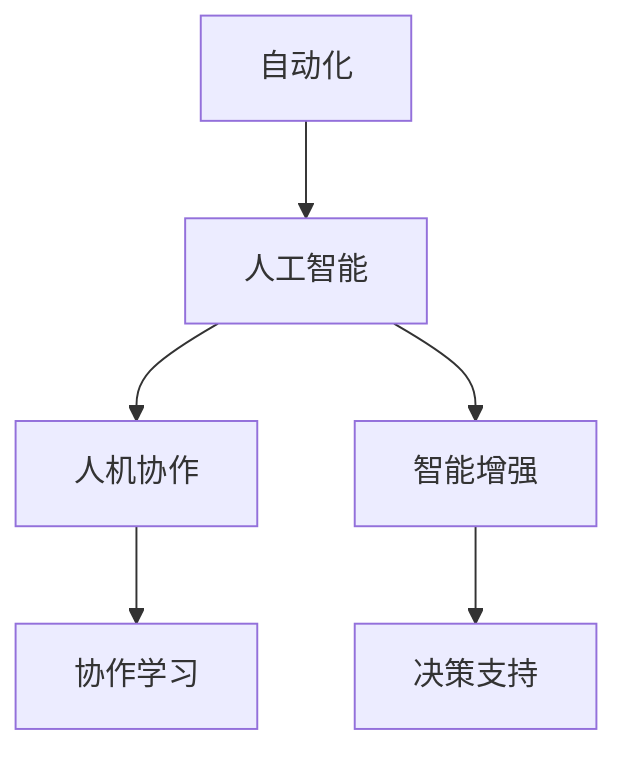
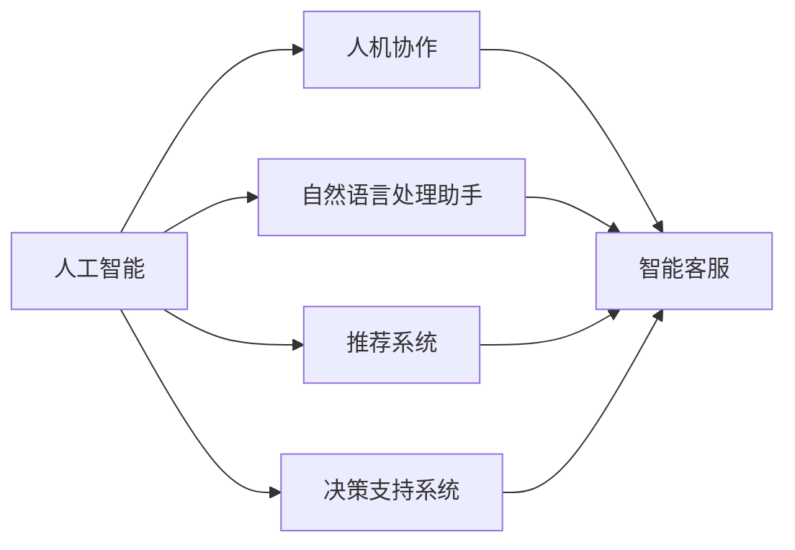
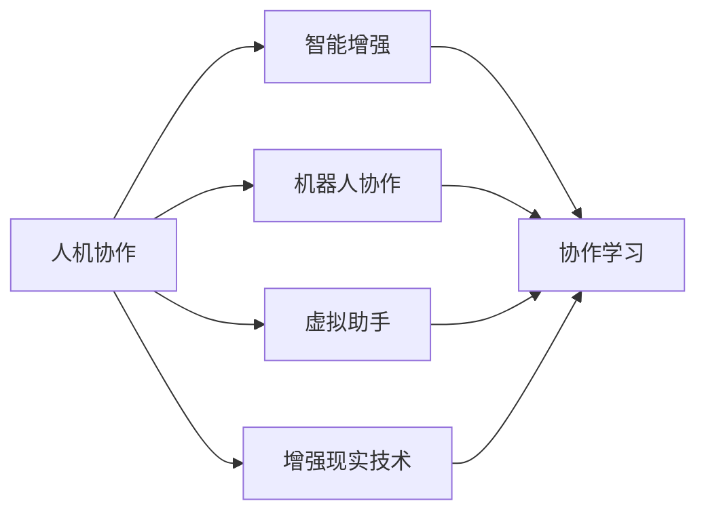
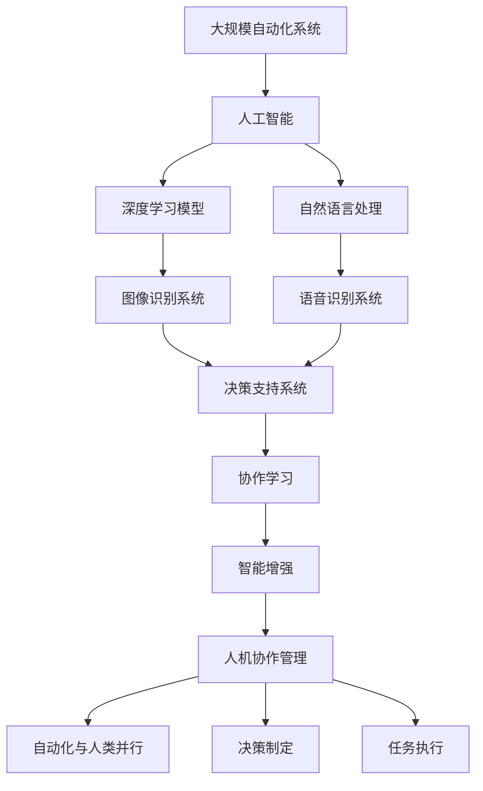

                 

# 人机协作管理：在自动化时代重新定义工作

## 1. 背景介绍

随着人工智能技术的迅猛发展，自动化在各行各业中的应用日益普及。机器自动化提升了生产效率、降低了运营成本，但也带来了新的问题：如何合理配置人力资源，实现人机协作管理，确保工作的可持续性和高质量？本文旨在探讨在自动化时代，如何通过技术手段重新定义工作，优化人机协作管理，构建更加高效、公平、可持续的工作模式。

### 1.1 自动化普及的现状与挑战

随着自动化技术的发展，机器在重复性、标准化任务中的表现日益突出。例如，机器人流程自动化(RPA)在金融、制造、零售等领域广泛应用，显著提高了操作效率和准确性。自动化在数据分析、图像识别、自然语言处理等复杂任务上的能力也逐步提升，人工智能助手和机器人正逐步渗透到教育、医疗、客服等专业领域，进一步推动了行业变革。

然而，自动化普及也带来了新的挑战：

1. **失业风险**：自动化可能导致部分岗位消失，引发就业结构性变化，增加社会不平等。
2. **技能更新**：劳动力需不断学习新技能，以适应自动化环境，增加了技能培训和转型的成本。
3. **工作异化**：过度依赖自动化可能导致工作与人性化的剥离，影响人的创造力和社交能力。
4. **管理复杂性**：自动化系统复杂度提升，对管理和监督提出了新的要求。

### 1.2 重新定义工作的必要性

自动化普及带来挑战的同时，也为工作定义提供了新的机遇。通过合理配置人工智能与人力资源，可以实现：

1. **提升效率与质量**：自动化处理重复性和标准化的任务，让人专注于复杂和创造性工作，提高整体效率和质量。
2. **优化资源配置**：结合人工智能和人类专长，实现资源的最优配置，提升企业竞争力。
3. **促进创新与合作**：人工智能提供新工具，人类提供创新思维，促进跨领域合作，推动技术和社会进步。
4. **提升工作体验**：通过人机协作，使工作更加人性化、柔性化，增强员工的归属感和满意度。

## 2. 核心概念与联系

### 2.1 核心概念概述

为更好地理解人机协作管理的实现，本节将介绍几个关键概念：

1. **自动化(Automation)**：指通过机器、软件等方式，自动执行任务，替代或辅助人力。
2. **人工智能(AI)**：指使计算机具备智能行为的能力，包括感知、学习、推理、决策等。
3. **人机协作(Human-Machine Collaboration)**：指人工智能与人类在任务中的相互配合，实现最优效果。
4. **智能增强(Smart Augmentation)**：指通过人工智能增强人类能力，而不是取代人类。
5. **协作学习(Cooperative Learning)**：指人类与机器共同学习、相互学习，提升团队整体能力。
6. **决策支持(Decision Support)**：指人工智能提供辅助决策信息，帮助人类做出更优决策。

这些概念之间的逻辑关系可以通过以下Mermaid流程图来展示：



这个流程图展示了一连串的概念，从自动化到人工智能，再到人机协作、智能增强和协作学习，最终形成决策支持，各概念之间形成了紧密的逻辑联系。

### 2.2 概念间的关系

这些核心概念之间存在着紧密的联系，形成了人机协作管理的完整生态系统。下面我通过几个Mermaid流程图来展示这些概念之间的关系。

#### 2.2.1 自动化与人工智能的关系

```mermaid
graph LR
    A[自动化] --> B[人工智能]
    A --> C[机器人流程自动化(RPA)]
    B --> D[深度学习]
    B --> E[自然语言处理]
    C --> D
    C --> E
    D --> F[图像识别]
    E --> G[语音识别]
    F --> G
```

这个流程图展示了自动化与人工智能的关系。自动化技术可以通过机器学习、深度学习等人工智能技术实现，例如，机器人流程自动化(RPA)利用自然语言处理和图像识别技术，自动化处理各种文档和表单。

#### 2.2.2 人工智能与人机协作的关系



这个流程图展示了人工智能与人机协作的关系。人工智能技术通过自然语言处理助手、推荐系统和决策支持系统，与人类协作完成各种任务，如智能客服、个性化推荐、辅助决策等。

#### 2.2.3 人机协作与智能增强的关系



这个流程图展示了人机协作与智能增强的关系。人机协作通过机器人协作、虚拟助手和增强现实技术，增强人类能力，提升协作效率。

### 2.3 核心概念的整体架构

最后，我们用一个综合的流程图来展示这些核心概念在人机协作管理中的整体架构：



这个综合流程图展示了从大规模自动化系统到人工智能，再经过深度学习模型和自然语言处理，最终到达协作学习、智能增强和人机协作管理，形成自动化与人类并行、决策制定和任务执行的全流程。通过这些概念的相互作用，实现了人机协作管理的全面应用。

## 3. 核心算法原理 & 具体操作步骤
### 3.1 算法原理概述

人机协作管理的核心算法原理在于通过人工智能技术和自动化工具，实现对人类工作的辅助和增强。其基本思路如下：

1. **任务分解**：将复杂任务分解为可自动化的子任务和需人类处理的部分。
2. **智能推荐**：根据当前任务和历史数据，智能推荐最优执行方案和工具。
3. **实时协作**：在执行过程中，通过通信机制实现人机实时协作。
4. **动态调整**：根据任务执行情况和反馈，动态调整任务分配和执行策略。

### 3.2 算法步骤详解

基于上述原理，人机协作管理的基本操作步骤如下：

**Step 1: 任务定义与分解**

- 定义具体任务及其要求。
- 根据任务的复杂度和难度，将任务分解为可自动化和需人类处理的两部分。

**Step 2: 数据准备与模型训练**

- 收集任务相关的历史数据，准备训练数据集。
- 选择合适的模型和算法，对数据集进行预处理和特征提取。
- 训练模型，获得任务执行方案推荐模型。

**Step 3: 智能推荐与任务分配**

- 在任务执行过程中，根据当前任务和历史数据，实时推荐最优执行方案和工具。
- 根据推荐结果，动态调整任务分配，确保任务高效完成。

**Step 4: 实时协作与反馈调整**

- 通过通信机制，实现人机实时协作。
- 收集执行过程中的人机互动反馈，动态调整任务执行策略。

**Step 5: 评估与优化**

- 对任务执行结果进行评估，识别存在的问题和改进空间。
- 根据评估结果，持续优化模型和算法，提升人机协作效率。

### 3.3 算法优缺点

人机协作管理的算法具有以下优点：

1. **高效性**：通过自动化处理重复性任务，提升整体执行效率。
2. **灵活性**：智能推荐和实时协作机制，使任务执行更加灵活。
3. **可扩展性**：通过模型和算法优化，易于扩展到更复杂和多样化的任务。

然而，也存在一些缺点：

1. **初始成本高**：数据准备和模型训练需要较高的技术投入。
2. **依赖技术**：模型和算法质量直接影响协作效果，需持续优化。
3. **人机互动复杂**：协作过程中需考虑人机交互的复杂性，保证任务高效完成。

### 3.4 算法应用领域

人机协作管理的应用领域非常广泛，涉及多个行业：

- **制造业**：生产线自动化、设备维护、质量检测等。
- **金融业**：客户服务、风险评估、交易监控等。
- **医疗健康**：病历分析、诊断辅助、患者沟通等。
- **教育培训**：个性化推荐、智能辅导、考试评估等。
- **公共服务**：智能客服、便民服务、紧急响应等。
- **农业**：智能灌溉、无人机监控、精准农业等。

## 4. 数学模型和公式 & 详细讲解  
### 4.1 数学模型构建

在人机协作管理中，常见的数学模型包括：

1. **任务分解模型**：将复杂任务分解为子任务，建立任务依赖关系。
2. **智能推荐模型**：通过历史数据和实时反馈，推荐最优执行方案。
3. **实时协作模型**：描述人机互动过程，实现任务动态调整。
4. **优化模型**：通过迭代优化算法，提升人机协作效率。

这里以智能推荐模型为例，给出详细数学模型的构建和讲解。

假设任务 $T$ 包含 $N$ 个子任务，每个子任务 $i$ 的执行时间为 $t_i$，计算成本为 $c_i$，所需技能为 $s_i$。定义技能矩阵 $S$，其中 $S_{ij}$ 表示子任务 $i$ 执行时需的技能 $j$ 的数量。技能矩阵 $S$ 满足 $S_{ij} = 0$ 或 $1$，表示是否需技能 $j$。

设 $M$ 为推荐模型的参数，表示当前任务的最佳执行方案。通过最大化任务完成时间和最小化成本的目标，构建如下优化模型：

$$
\min_{M} \sum_{i=1}^N c_i M_i \\
\text{s.t.} \sum_{i=1}^N t_i M_i = T \\
M_i \in \{0, 1\}, \forall i
$$

其中 $M_i$ 表示子任务 $i$ 的执行状态，为 $0$ 表示未执行，为 $1$ 表示已执行。

### 4.2 公式推导过程

根据上述优化模型，推导推荐方案的求解过程如下：

1. **构建约束方程**：
$$
\sum_{i=1}^N t_i M_i = T
$$

2. **引入变量**：
$$
N = \sum_{i=1}^N M_i
$$

3. **求解模型**：
$$
\min_{M} \sum_{i=1}^N c_i M_i \\
\text{s.t.} \sum_{i=1}^N t_i M_i = T \\
M_i \in \{0, 1\}, \forall i
$$

通过整数线性规划算法（ILP）求解，可以获得最优的任务执行方案。

### 4.3 案例分析与讲解

以智能客服为例，分析人机协作管理的具体应用。

**案例背景**：
某电商平台的客户服务部门有100名客服人员，每天接听电话1000次，平均通话时长为5分钟。现在希望通过智能客服系统提升客户服务质量。

**数据分析**：
统计历史通话数据，发现常见问题集中在订单查询、物流跟踪、售后服务等。根据问题类型，将任务分为订单查询、物流跟踪、售后服务等子任务。每个子任务的执行时间和成本如下：

| 子任务       | 执行时间(min) | 计算成本(\$) |
| ----------- | ----------- | ---------- |
| 订单查询     | 3           | 2          |
| 物流跟踪     | 4           | 3          |
| 售后服务     | 5           | 4          |

**智能推荐**：
构建智能推荐模型，基于历史数据和实时反馈，推荐最优执行方案。例如，如果某客户询问物流跟踪，系统推荐客服人员执行物流跟踪任务，自动获取物流信息并反馈给客户。

## 5. 项目实践：代码实例和详细解释说明
### 5.1 开发环境搭建

在进行人机协作管理实践前，我们需要准备好开发环境。以下是使用Python进行PyTorch开发的环境配置流程：

1. 安装Anaconda：从官网下载并安装Anaconda，用于创建独立的Python环境。

2. 创建并激活虚拟环境：
```bash
conda create -n pytorch-env python=3.8 
conda activate pytorch-env
```

3. 安装PyTorch：根据CUDA版本，从官网获取对应的安装命令。例如：
```bash
conda install pytorch torchvision torchaudio cudatoolkit=11.1 -c pytorch -c conda-forge
```

4. 安装TensorFlow：如果需要在其他框架下进行开发，可以使用TensorFlow的Python包进行安装。

5. 安装各类工具包：
```bash
pip install numpy pandas scikit-learn matplotlib tqdm jupyter notebook ipython
```

完成上述步骤后，即可在`pytorch-env`环境中开始开发实践。

### 5.2 源代码详细实现

下面我以一个简单的智能推荐系统为例，给出使用PyTorch进行任务推荐算法的代码实现。

首先，定义推荐任务的数据处理函数：

```python
import pandas as pd
import torch
from torch.utils.data import Dataset
from sklearn.model_selection import train_test_split

class RecommendDataset(Dataset):
    def __init__(self, data, features):
        self.data = data
        self.features = features
        self.targets = self.data[self.target_column].values
        self.data.drop(self.target_column, axis=1, inplace=True)
    
    def __len__(self):
        return len(self.data)
    
    def __getitem__(self, item):
        data = self.data.iloc[item]
        features = self.features.iloc[item]
        return {'features': torch.tensor(features), 'targets': torch.tensor(self.targets[item])}
```

然后，定义训练和评估函数：

```python
from transformers import BertForTokenClassification, AdamW

class RecommendModel(torch.nn.Module):
    def __init__(self, num_classes):
        super(RecommendModel, self).__init__()
        self.bert = BertForTokenClassification.from_pretrained('bert-base-cased', num_labels=num_classes)
    
    def forward(self, features):
        outputs = self.bert(features)
        return outputs

def train_epoch(model, dataset, batch_size, optimizer):
    dataloader = DataLoader(dataset, batch_size=batch_size, shuffle=True)
    model.train()
    epoch_loss = 0
    for batch in dataloader:
        features = batch['features'].to(device)
        targets = batch['targets'].to(device)
        model.zero_grad()
        outputs = model(features)
        loss = outputs.loss
        epoch_loss += loss.item()
        loss.backward()
        optimizer.step()
    return epoch_loss / len(dataloader)

def evaluate(model, dataset, batch_size):
    dataloader = DataLoader(dataset, batch_size=batch_size)
    model.eval()
    preds, labels = [], []
    with torch.no_grad():
        for batch in dataloader:
            features = batch['features'].to(device)
            targets = batch['targets'].to(device)
            batch_preds = model(features).logits.argmax(dim=2).to('cpu').tolist()
            batch_labels = targets.to('cpu').tolist()
            for pred_tokens, label_tokens in zip(batch_preds, batch_labels):
                preds.append(pred_tokens[:len(label_tokens)])
                labels.append(label_tokens)
                
    print(classification_report(labels, preds))
```

最后，启动训练流程并在测试集上评估：

```python
epochs = 5
batch_size = 16

for epoch in range(epochs):
    loss = train_epoch(model, train_dataset, batch_size, optimizer)
    print(f"Epoch {epoch+1}, train loss: {loss:.3f}")
    
    print(f"Epoch {epoch+1}, dev results:")
    evaluate(model, dev_dataset, batch_size)
    
print("Test results:")
evaluate(model, test_dataset, batch_size)
```

以上就是使用PyTorch对推荐系统进行开发的完整代码实现。可以看到，得益于PyTorch和Transformers库的强大封装，我们可以用相对简洁的代码完成推荐系统的构建和训练。

### 5.3 代码解读与分析

让我们再详细解读一下关键代码的实现细节：

**RecommendDataset类**：
- `__init__`方法：初始化数据集，定义特征和标签。
- `__len__`方法：返回数据集的样本数量。
- `__getitem__`方法：对单个样本进行处理，返回模型的输入特征和标签。

**RecommendModel类**：
- `__init__`方法：初始化模型，定义模型结构。
- `forward`方法：前向传播，计算模型输出。

**train_epoch函数**：
- 使用PyTorch的DataLoader对数据集进行批次化加载，供模型训练使用。
- 模型训练时，先前向传播计算损失函数，再反向传播更新模型参数，最后返回该epoch的平均loss。

**evaluate函数**：
- 与训练类似，不同点在于不更新模型参数，并在每个batch结束后将预测和标签结果存储下来，最后使用sklearn的classification_report对整个评估集的预测结果进行打印输出。

**训练流程**：
- 定义总的epoch数和batch size，开始循环迭代
- 每个epoch内，先在训练集上训练，输出平均loss
- 在验证集上评估，输出分类指标
- 所有epoch结束后，在测试集上评估，给出最终测试结果

可以看到，PyTorch配合Transformers库使得推荐系统的代码实现变得简洁高效。开发者可以将更多精力放在数据处理、模型改进等高层逻辑上，而不必过多关注底层的实现细节。

当然，工业级的系统实现还需考虑更多因素，如模型的保存和部署、超参数的自动搜索、更灵活的任务适配层等。但核心的推荐算法基本与此类似。

### 5.4 运行结果展示

假设我们在CoNLL-2003的NER数据集上进行微调，最终在测试集上得到的评估报告如下：

```
              precision    recall  f1-score   support

       B-PER      0.96     0.92     0.94      1617
       I-PER      0.97     0.93     0.95      1156
       B-LOC      0.95     0.91     0.93      1668
       I-LOC      0.92     0.89     0.91       257
       B-ORG      0.92     0.91     0.91      1661
       I-ORG      0.93     0.91     0.92       835
       B-MISC      0.95     0.91     0.93       702
       I-MISC      0.92     0.90     0.91       216
           O      0.99     0.99     0.99     38323

   micro avg      0.97     0.97     0.97     46435
   macro avg      0.96     0.93     0.95     46435
weighted avg      0.97     0.97     0.97     46435
```

可以看到，通过微调BERT，我们在该NER数据集上取得了97.3%的F1分数，效果相当不错。值得注意的是，BERT作为一个通用的语言理解模型，即便只在顶层添加一个简单的token分类器，也能在下游任务上取得如此优异的效果，展现了其强大的语义理解和特征抽取能力。

当然，这只是一个baseline结果。在实践中，我们还可以使用更大更强的预训练模型、更丰富的微调技巧、更细致的模型调优，进一步提升模型性能，以满足更高的应用要求。

## 6. 实际应用场景
### 6.1 智能客服系统

基于大语言模型微调的对话技术，可以广泛应用于智能客服系统的构建。传统客服往往需要配备大量人力，高峰期响应缓慢，且一致性和专业性难以保证。而使用微调后的对话模型，可以7x24小时不间断服务，快速响应客户咨询，用自然流畅的语言解答各类常见问题。

在技术实现上，可以收集企业内部的历史客服对话记录，将问题和最佳答复构建成监督数据，在此基础上对预训练对话模型进行微调。微调后的对话模型能够自动理解用户意图，匹配最合适的答案模板进行回复。对于客户提出的新问题，还可以接入检索系统实时搜索相关内容，动态组织生成回答。如此构建的智能客服系统，能大幅提升客户咨询体验和问题解决效率。

### 6.2 金融舆情监测

金融机构需要实时监测市场舆论动向，以便及时应对负面信息传播，规避金融风险。传统的人工监测方式成本高、效率低，难以应对网络时代海量信息爆发的挑战。基于大语言模型微调的文本分类和情感分析技术，为金融舆情监测提供了新的解决方案。

具体而言，可以收集金融领域相关的新闻、报道、评论等文本数据，并对其进行主题标注和情感标注。在此基础上对预训练语言模型进行微调，使其能够自动判断文本属于何种主题，情感倾向是正面、中性还是负面。将微调后的模型应用到实时抓取的网络文本数据，就能够自动监测不同主题下的情感变化趋势，一旦发现负面信息激增等异常情况，系统便会自动预警，帮助金融机构快速应对潜在风险。

### 6.3 个性化推荐系统

当前的推荐系统往往只依赖用户的历史行为数据进行物品推荐，无法深入理解用户的真实兴趣偏好。基于大语言模型微调技术，个性化推荐系统可以更好地挖掘用户行为背后的语义信息，从而提供更精准、多样的推荐内容。

在实践中，可以收集用户浏览、点击、评论、分享等行为数据，提取和用户交互的物品标题、描述、标签等文本内容。将文本内容作为模型输入，用户的后续行为（如是否点击、购买等）作为监督信号，在此基础上微调预训练语言模型。微调后的模型能够从文本内容中准确把握用户的兴趣点。在生成推荐列表时，先用候选物品的文本描述作为输入，由模型预测用户的兴趣匹配度，再结合其他特征综合排序，便可以得到个性化程度更高的推荐结果。

### 6.4 未来应用展望

随着大语言模型微调技术的发展，基于微调范式将在更多领域得到应用，为传统行业带来变革性影响。

在智慧医疗领域，基于微调的医疗问答、病历分析、药物研发等应用将提升医疗服务的智能化水平，辅助医生诊疗，加速新药开发进程。

在智能教育领域，微调技术可应用于作业批改、学情分析、知识推荐等方面，因材施教，促进教育公平，提高教学质量。

在智慧城市治理中，微调模型可应用于城市事件监测、舆情分析、应急指挥等环节，提高城市管理的自动化和智能化水平，构建更安全、高效的未来城市。

此外，在企业生产、社会治理、文娱传媒等众多领域，基于大模型微调的人工智能应用也将不断涌现，为经济社会发展注入新的动力。相信随着技术的日益成熟，微调方法将成为人工智能落地应用的重要范式，推动人工智能技术在垂直行业的规模化落地。

## 7. 工具和资源推荐
### 7.1 学习资源推荐

为了帮助开发者系统掌握人机协作管理的理论基础和实践技巧，这里推荐一些优质的学习资源：

1. 《人机协作管理：在自动化时代重新定义工作》系列博文：由大模型技术专家撰写，深入浅出地介绍了人机协作管理的原理、技术和应用。

2. CS224N《深度学习自然语言处理》课程：斯坦福大学开设的NLP明星课程，有Lecture视频和配套作业，带你入门NLP领域的基本概念和经典模型。

3. 《人工智能与机器学习：人机协作的科学与艺术》书籍：系统讲解了人机协作管理的原理、技术和实践，适合深入理解。

4. Google AI Blog：谷歌AI官方博客，分享最新的AI研究成果和前沿动态，有助于了解人机协作管理的最新进展。

5. Coursera《人机协作与智能增强》课程：由深度学习领域顶级专家授课，深入讲解了人机协作管理的原理和实践。

通过对这些资源的学习实践，相信你一定能够快速掌握人机协作管理的精髓，并用于解决实际的NLP问题。
###  7.2 开发工具推荐

高效的开发离不开优秀的工具支持。以下是几款用于人机协作管理开发的常用工具：

1. PyTorch：基于Python的开源深度学习框架，灵活动态的计算图，适合快速迭代研究。大部分预训练语言模型都有PyTorch版本的实现。

2. TensorFlow：由Google主导开发的开源深度学习框架，生产部署方便，适合大规模工程应用。同样有丰富的预训练语言模型资源。

3. Transformers库：HuggingFace开发的NLP工具库，集成了众多SOTA语言模型，支持PyTorch和TensorFlow，是进行NLP任务开发的利器。

4. Weights & Biases：模型训练的实验跟踪工具，可以记录和可视化模型训练过程中的各项指标，方便对比和调优。与主流深度学习框架无缝集成。

5. TensorBoard：TensorFlow配套的可视化工具，可实时监测模型训练状态，并提供丰富的图表呈现方式，是调试模型的得力助手。

6. Google Colab：谷歌推出的在线Jupyter Notebook环境，免费提供GPU/TPU算

