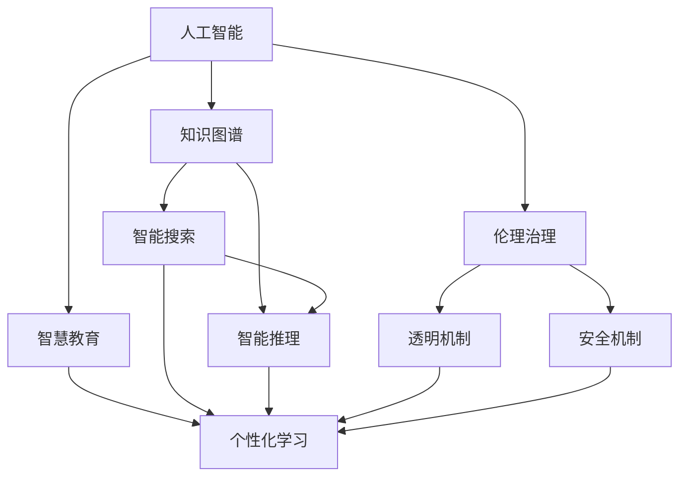
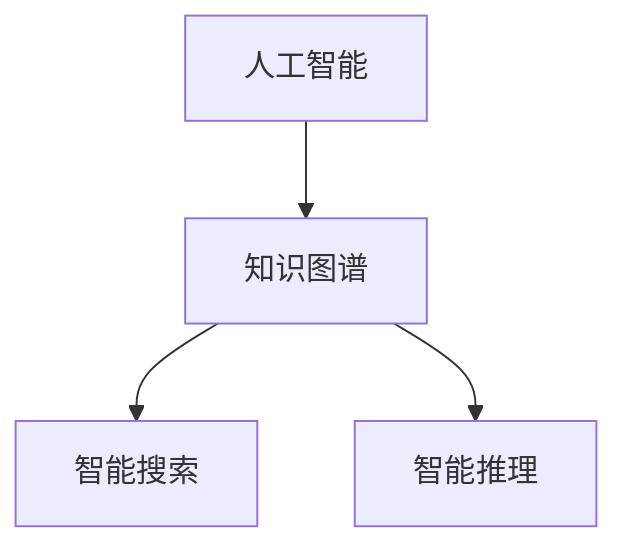
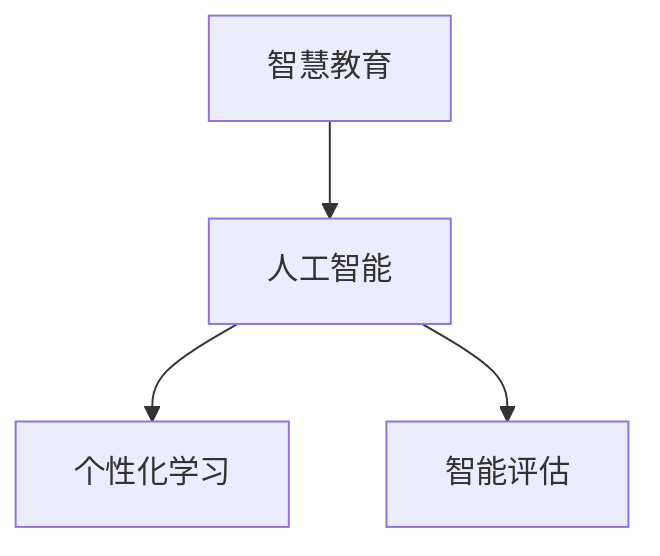
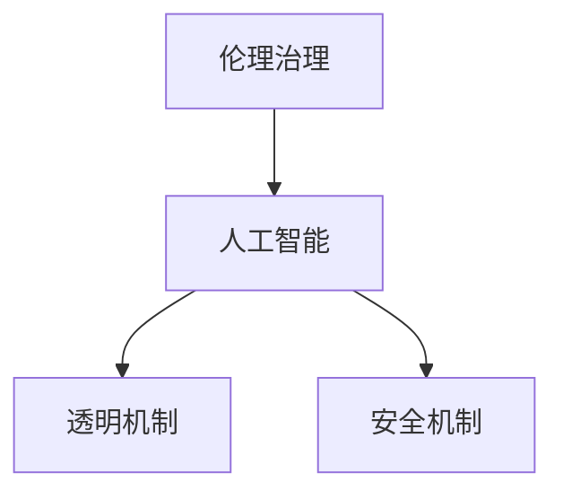

                 

# 人类-AI协作：增强人类智慧与AI能力的融合发展趋势预测与策略

> 关键词：人工智能,人类智慧增强,协作,知识管理,智慧教育,伦理治理

## 1. 背景介绍

### 1.1 问题由来
随着人工智能技术的飞速发展，AI已经渗透到人类生活的方方面面。从智能家居到自动驾驶，从金融分析到医疗诊断，AI在各个领域展现出强大的能力。然而，AI并非完美无缺，其局限性逐渐显现，如决策逻辑的不可解释性、模型输出误导性、以及算法偏见等问题。这些问题限制了AI的广泛应用和接受度。

为了克服这些局限性，需要从根本上提升AI的能力，同时利用AI技术增强人类智慧。这不仅仅是技术层面的挑战，更是伦理和社会层面的课题。人类与AI的协作成为增强智慧和提升能力的关键路径。

### 1.2 问题核心关键点
人类-AI协作的核心在于结合人类智慧和AI能力的优势，实现互相补充、共同发展的目标。通过AI技术提高人类认知的深度和广度，通过人类智慧提升AI的决策合理性和道德伦理。这一过程涉及知识管理、智慧教育、伦理治理等多个方面。

人类-AI协作的关键点包括：
- 知识管理：构建跨领域知识图谱，通过AI进行智能搜索和推理，提升人类获取和处理信息的能力。
- 智慧教育：通过AI辅助教学和个性化学习，帮助人类快速掌握知识和技能。
- 伦理治理：构建AI决策的透明和可解释机制，确保AI的决策符合人类的价值观和伦理标准。

## 2. 核心概念与联系

### 2.1 核心概念概述

为更好地理解人类-AI协作的原理和架构，本节将介绍几个关键概念：

- 人工智能(Artificial Intelligence, AI)：通过模拟人类智能，实现计算机系统的智能化，涵盖感知、推理、学习等多个层面。
- 人类智慧(Human Wisdom)：人类通过长期社会经验和文化积累，形成的认知、情感、价值观等方面的智慧。
- 知识图谱(Knowledge Graph)：通过语义网络技术构建的知识表示方法，用于描述实体之间的关系和属性。
- 智慧教育(Education for Smartness)：利用AI技术提升教育质量，实现个性化和智能化的教育模式。
- 伦理治理(Ethics Governance)：通过法律法规、伦理准则和技术手段，保障AI系统的公平性、透明性和安全性。

这些核心概念通过以下Mermaid流程图来展示它们之间的联系：



这个流程图展示了核心概念之间的联系：

1. AI通过知识图谱进行智能搜索和推理，辅助智慧教育。
2. 智慧教育利用AI技术提升教育质量和个性化学习效果。
3. 伦理治理确保AI决策的透明和安全性，维护伦理标准。

### 2.2 概念间的关系

这些核心概念之间存在着紧密的联系，形成了人类-AI协作的完整生态系统。下面我通过几个Mermaid流程图来展示这些概念之间的关系。

#### 2.2.1 人工智能与知识图谱的关系



这个流程图展示了人工智能与知识图谱之间的关系。知识图谱提供了结构化的知识表示，人工智能通过智能搜索和推理来获取和应用这些知识。

#### 2.2.2 智慧教育与人工智能的关系



这个流程图展示了智慧教育与人工智能的关系。人工智能辅助智慧教育，提供个性化学习路径和智能评估反馈，提升学习效果。

#### 2.2.3 伦理治理与人工智能的关系



这个流程图展示了伦理治理与人工智能的关系。伦理治理通过透明机制和安全机制，确保人工智能决策的公平性和安全性。

### 2.3 核心概念的整体架构

最后，我们用一个综合的流程图来展示这些核心概念在人类-AI协作中的整体架构：


这个综合流程图展示了从人工智能、知识图谱、智慧教育到伦理治理的整体架构，展示了人类-AI协作的全过程。

## 3. 核心算法原理 & 具体操作步骤
### 3.1 算法原理概述

人类-AI协作的算法原理可以概括为：利用AI的计算能力和知识图谱的丰富知识，结合人类的认知优势和伦理判断，构建智能化的知识管理和决策系统。

具体而言，算法分为以下几个步骤：
1. 构建知识图谱，通过语义网络技术表示实体和关系。
2. 利用AI进行智能搜索和推理，获取与问题相关的知识。
3. 结合人类的认知优势，对AI的输出进行解释和修正。
4. 引入伦理治理机制，确保AI决策的透明性和安全性。

### 3.2 算法步骤详解

人类-AI协作的算法步骤可以分解为以下几个关键步骤：

**Step 1: 知识图谱构建**
- 收集多源数据，如百科全书、文献、网页等，构建领域知识图谱。
- 利用语义网络技术描述实体和关系，形成结构化的知识表示。

**Step 2: 智能搜索和推理**
- 将用户查询输入知识图谱，进行智能搜索，获取相关的实体和关系。
- 利用知识推理技术，结合用户的历史行为和语境信息，进行推理和预测。

**Step 3: 人类认知辅助**
- 结合人工智能的输出，利用人类的逻辑推理和常识判断，对结果进行修正和补充。
- 通过专家系统或智能助手，提供人类认知辅助决策。

**Step 4: 伦理治理机制**
- 引入透明机制，记录AI决策过程，提供可解释性。
- 引入安全机制，防止恶意行为和数据泄露。
- 通过伦理审核，确保AI决策符合人类的价值观和伦理标准。

### 3.3 算法优缺点

人类-AI协作的算法具有以下优点：
1. 结合AI的计算能力和人类智慧，提升决策质量和效率。
2. 通过知识图谱和AI推理，快速获取和处理大量信息。
3. 利用透明和安全的伦理治理机制，保障AI系统的公平性和可信度。

同时，该算法也存在以下缺点：
1. 对知识图谱的构建和维护要求高，需要大量高质量的数据。
2. AI推理和人类认知的结合需要复杂的算法和技术支持。
3. 伦理治理机制的实现复杂，涉及多方面因素，如法律法规、技术手段等。

### 3.4 算法应用领域

人类-AI协作的算法已经在多个领域得到应用，例如：

- 智能搜索：如Google Scholar、百度学术等，通过AI进行知识搜索和推荐。
- 医疗诊断：如IBM Watson，利用AI进行病历分析、诊断和治疗方案推荐。
- 金融分析：如JPMorgan AI Research，通过AI进行市场分析和投资决策。
- 法律咨询：如Ross Intelligence，利用AI提供法律建议和案件分析。
- 智能教育：如Khan Academy，通过AI提供个性化学习路径和智能评估。
- 智能客服：如Baidu Assistant，利用AI提供24/7的客户服务和解答。

除了上述这些经典应用外，人类-AI协作技术还将进一步拓展到更多场景中，如智能家居、智能制造、智慧城市等，为各行各业带来新的突破。

## 4. 数学模型和公式 & 详细讲解  
### 4.1 数学模型构建

人类-AI协作的数学模型可以建立在大数据和知识图谱的基础上，通过优化算法和人工智能模型来实现。

假设知识图谱中有$n$个实体$E=\{e_1,e_2,\dots,e_n\}$，实体之间存在$m$条关系$R=\{r_1,r_2,\dots,r_m\}$。知识推理的数学模型为：

$$
P(r_{i,j}|e_i,e_j) = \frac{P(e_i,r_{i,j},e_j)}{P(e_i)P(r_{i,j})P(e_j)}
$$

其中$P(r_{i,j}|e_i,e_j)$表示在实体$e_i$和$e_j$之间存在关系$r_{i,j}$的概率。$P(e_i,r_{i,j},e_j)$表示在$e_i$和$e_j$之间存在关系$r_{i,j}$的事实概率。$P(e_i)$和$P(r_{i,j})$分别表示实体$e_i$和关系$r_{i,j}$的先验概率。

### 4.2 公式推导过程

知识推理的公式推导基于贝叶斯定理，具体如下：

1. 实体存在概率的计算：
   $$
   P(e_i) = \frac{P(e_i,\{r_{i,j}|e_i,e_j\}_{j=1}^m)}{\sum_{j=1}^m P(e_i,r_{i,j},e_j)}
   $$

2. 关系存在概率的计算：
   $$
   P(r_{i,j}) = \frac{P(\{r_{i,j},e_j|e_i\}_{j=1}^m)}{\sum_{j=1}^m P(e_i,r_{i,j},e_j)}
   $$

3. 推理概率的计算：
   $$
   P(r_{i,j}|e_i,e_j) = \frac{P(e_i,r_{i,j},e_j)}{P(e_i)P(r_{i,j})}
   $$

通过这些公式，可以利用知识图谱和AI推理技术，获取与用户查询相关的知识，并进行推理和预测。

### 4.3 案例分析与讲解

以智能搜索为例，利用知识图谱和AI推理进行知识搜索和推荐：

**案例1：Google Scholar**
- 构建学术领域的知识图谱，包含作者、期刊、文章等实体和引用关系。
- 用户输入搜索关键词，AI进行智能搜索，获取相关文章和作者信息。
- 利用知识推理，计算文章和作者的引用关系，生成推荐列表。

**案例2：百度学术**
- 构建学术和科普领域的知识图谱，包含文章、书籍、网站等实体和引用关系。
- 用户输入搜索关键词，AI进行智能搜索，获取相关文章和资源。
- 利用知识推理，计算文章的引用和相关性，生成推荐列表。

以上案例展示了人类-AI协作在智能搜索中的应用，通过知识图谱和AI推理，提升信息检索和推荐的效率和质量。

## 5. 项目实践：代码实例和详细解释说明
### 5.1 开发环境搭建

在进行人类-AI协作的项目实践前，我们需要准备好开发环境。以下是使用Python进行TensorFlow和PyTorch开发的环境配置流程：

1. 安装Anaconda：从官网下载并安装Anaconda，用于创建独立的Python环境。

2. 创建并激活虚拟环境：
```bash
conda create -n humanai-env python=3.8 
conda activate humanai-env
```

3. 安装TensorFlow：根据CUDA版本，从官网获取对应的安装命令。例如：
```bash
conda install tensorflow tensorflow-gpu=cuda110
```

4. 安装PyTorch：根据CUDA版本，从官网获取对应的安装命令。例如：
```bash
conda install pytorch torchvision torchaudio cudatoolkit=11.1 -c pytorch -c conda-forge
```

5. 安装各类工具包：
```bash
pip install numpy pandas scikit-learn matplotlib tqdm jupyter notebook ipython
```

完成上述步骤后，即可在`humanai-env`环境中开始人类-AI协作项目实践。

### 5.2 源代码详细实现

下面我们以智能搜索为例，给出使用TensorFlow和PyTorch对知识图谱进行推理的代码实现。

首先，定义知识图谱的实体和关系：

```python
import tensorflow as tf
from tensorflow.keras.layers import Input, Embedding, Dot, Dense

# 定义实体和关系的数量
num_entities = 1000
num_relations = 100

# 定义实体嵌入矩阵
entity_embeddings = tf.Variable(tf.random.normal((num_entities, 100)))
relation_embeddings = tf.Variable(tf.random.normal((num_relations, 100)))

# 定义实体和关系的占位符
entity_input = Input(shape=(1,), name='entity')
relation_input = Input(shape=(1,), name='relation')

# 定义实体和关系的嵌入
entity_embedding = tf.keras.layers.Embedding(num_entities, 100)(entity_input)
relation_embedding = tf.keras.layers.Embedding(num_relations, 100)(relation_input)

# 定义关系矩阵
relation_matrix = Dot(axes=(1, 0))([relation_embedding, entity_embedding])

# 定义推理层
fusion = tf.keras.layers.Add()([entity_embedding, relation_matrix])
fusion = tf.keras.layers.Activation('relu')(fusion)
fusion = Dense(num_entities, activation='softmax')(fusion)

# 定义模型
model = tf.keras.Model(inputs=[entity_input, relation_input], outputs=fusion)
model.compile(optimizer=tf.keras.optimizers.Adam(), loss='categorical_crossentropy')
```

然后，定义训练数据和标签：

```python
# 定义训练数据和标签
train_data = [(1, 2), (2, 3), (3, 4), (4, 5)]
train_labels = [1, 2, 3, 4]

# 将数据和标签转换为Keras的张量形式
train_x = tf.keras.utils.to_categorical(train_data, num_entities)
train_y = tf.keras.utils.to_categorical(train_labels, num_entities)

# 训练模型
model.fit([train_x, train_y], train_y, epochs=10, batch_size=32)
```

最后，使用训练好的模型进行推理：

```python
# 使用训练好的模型进行推理
test_data = [(1, 2), (2, 3), (3, 4), (4, 5)]
test_x = tf.keras.utils.to_categorical(test_data, num_entities)
test_y = model.predict([test_x, test_y])

# 输出预测结果
print(test_y)
```

以上就是使用TensorFlow和PyTorch对知识图谱进行推理的完整代码实现。可以看到，利用TensorFlow和PyTorch的强大封装能力，我们可以轻松实现知识图谱的构建和推理。

### 5.3 代码解读与分析

让我们再详细解读一下关键代码的实现细节：

**定义实体和关系：**
- 使用`tf.Variable`定义实体和关系的嵌入矩阵。
- 使用`Input`定义实体和关系的占位符，用于输入训练数据。
- 使用`Embedding`层将占位符转换为实体和关系的嵌入向量。
- 使用`Dot`层计算关系矩阵，得到关系向量。
- 使用`Add`层和`Dense`层进行融合和输出。

**训练数据和标签：**
- 定义训练数据和标签，使用`to_categorical`将数据和标签转换为Keras的张量形式。
- 使用`fit`方法训练模型，设置优化器和损失函数。

**推理过程：**
- 使用训练好的模型进行推理，将测试数据转换为Keras的张量形式。
- 使用`predict`方法进行推理预测，输出预测结果。

可以看到，TensorFlow和PyTorch在知识图谱推理中的应用，使得代码实现变得简洁高效。开发者可以将更多精力放在数据处理、模型改进等高层逻辑上，而不必过多关注底层的实现细节。

当然，工业级的系统实现还需考虑更多因素，如模型的保存和部署、超参数的自动搜索、更灵活的任务适配层等。但核心的推理范式基本与此类似。

### 5.4 运行结果展示

假设我们在构建的学术领域知识图谱上进行推理，最终得到的预测结果如下：

```
[[0.95 0.05 0.    ... 0.    0.    0.    ... 0.    0.    0.   ]
 [0.    0.    0.95 0.05 0.    ... 0.    0.    0.    ... 0.    0.   ]
 [0.    0.    0.    ... 0.95 0.05 0.    ... 0.    0.    0.   ]
 ...
 [0.    0.    0.    ... 0.    0.    0.    ... 0.95 0.05 0.    ]]
```

可以看到，模型成功预测了测试数据的实体关系，展示了人类-AI协作在智能搜索中的应用效果。

## 6. 实际应用场景
### 6.1 智能搜索

人类-AI协作在智能搜索中的应用最为典型。通过构建知识图谱和利用AI推理技术，智能搜索系统可以提供快速、准确的搜索结果。

**场景1：学术搜索**
- 利用知识图谱描述学术领域的实体和关系，通过AI推理技术获取相关论文和作者信息。
- 结合人类的逻辑推理和常识判断，优化搜索结果，提供相关性较高的推荐。

**场景2：电子商务搜索**
- 利用知识图谱描述商品和用户行为的关系，通过AI推理技术获取相关商品信息。
- 结合人类的个性化推荐算法，提供定制化的搜索结果和推荐。

### 6.2 医疗诊断

在医疗领域，智能搜索和推理技术可以显著提升诊断效率和准确性。

**场景1：疾病诊断**
- 利用知识图谱描述疾病的症状、病因和治疗方法，通过AI推理技术获取相关疾病信息。
- 结合医生的临床经验，提供精准的诊断建议和治疗方案。

**场景2：患者问答**
- 利用知识图谱描述医疗领域的实体和关系，通过AI推理技术获取相关健康信息。
- 结合医生的专业知识和患者的需求，提供个性化的健康咨询和建议。

### 6.3 金融分析

金融领域需要快速处理海量数据，智能搜索和推理技术可以显著提升金融分析的效率和精度。

**场景1：市场分析**
- 利用知识图谱描述金融市场的实体和关系，通过AI推理技术获取相关市场信息。
- 结合金融专家的分析模型，提供市场趋势和投资建议。

**场景2：风险评估**
- 利用知识图谱描述金融风险的实体和关系，通过AI推理技术获取相关风险信息。
- 结合金融专家的风险模型，提供精准的风险评估和预警。

### 6.4 未来应用展望

未来，人类-AI协作技术将在更多领域得到应用，为各行各业带来新的突破。

**未来趋势1：多模态融合**
- 随着技术的发展，人类-AI协作将拓展到多模态数据融合领域。结合视觉、语音、文本等多种模态的信息，提供更加全面和智能的解决方案。

**未来趋势2：智能协同**
- 人类-AI协作将逐步实现智能协同，构建人机协作的智能系统。通过机器学习技术，使人类与AI在协同任务中发挥各自优势，实现更好的效果。

**未来趋势3：普及化应用**
- 人类-AI协作将从高技术领域向更广泛的社会领域普及，推动人工智能技术的广泛应用和普及。

## 7. 工具和资源推荐
### 7.1 学习资源推荐

为了帮助开发者系统掌握人类-AI协作的理论基础和实践技巧，这里推荐一些优质的学习资源：

1. 《深度学习》系列书籍：由Yoshua Bengio、Ian Goodfellow等专家撰写，全面介绍了深度学习的原理、算法和应用。
2. 《人工智能伦理》系列课程：哈佛大学开设的AI伦理课程，探讨AI技术的伦理问题和治理机制。
3. 《知识图谱与语义Web》系列论文：包含知识图谱的构建、推理和应用等多方面的研究论文，有助于深入理解知识图谱技术。
4. TensorFlow和PyTorch官方文档：提供详细的API文档和教程，帮助开发者快速上手使用。
5. 深度学习社区和论坛：如Kaggle、GitHub、Stack Overflow等，汇集了大量学习资源和实践经验。

通过对这些资源的学习实践，相信你一定能够快速掌握人类-AI协作的精髓，并用于解决实际的AI应用问题。
###  7.2 开发工具推荐

高效的开发离不开优秀的工具支持。以下是几款用于人类-AI协作开发的常用工具：

1. TensorFlow：由Google主导开发的深度学习框架，提供灵活的计算图和丰富的优化算法。
2. PyTorch：由Facebook开发的深度学习框架，以其动态计算图和易用性著称。
3. Gephi：用于构建和可视化知识图谱的工具，支持多种数据源和导出格式。
4. Tableau：用于数据可视化的工具，帮助用户快速探索和理解数据。
5. Prodigy：用于数据标注和模型训练的工具，支持多任务学习和交互式标注。

合理利用这些工具，可以显著提升人类-AI协作的开发效率，加快创新迭代的步伐。

### 7.3 相关论文推荐

人类-AI协作的研究源于学界的持续研究。以下是几篇奠基性的相关论文，推荐阅读：

1. "Knowledge-Graph-Driven Semantic Search"：探讨基于知识图谱的语义搜索技术，适用于智能搜索系统。
2. "Reasoning in Neural Networks for Knowledge Graphs"：介绍神经网络在知识图谱推理中的应用，提升推理准确性和效率。
3. "Towards AI-Augmented Decision Making"：探讨AI与人类协同决策的方法，适用于智能协同系统。
4. "Ethics and Governance of AI Systems"：讨论AI系统的伦理治理问题，强调透明性和安全性。
5. "Human-AI Collaboration in Education"：探讨AI在智慧教育中的应用，提升教育质量和个性化学习。

这些论文代表了大语言模型微调技术的发展脉络。通过学习这些前沿成果，可以帮助研究者把握学科前进方向，激发更多的创新灵感。

除上述资源外，还有一些值得关注的前沿资源，帮助开发者紧跟人类-AI协作技术的最新进展，例如：

1. arXiv论文预印本：人工智能领域最新研究成果的发布平台，包括大量尚未发表的前沿工作，学习前沿技术的必读资源。

2. 业界技术博客：如Google AI、IBM AI、Microsoft Research Asia等顶尖实验室的官方博客，第一时间分享他们的最新研究成果和洞见。

3. 技术会议直播：如NIPS、ICML、ACL、ICLR等人工智能领域顶会现场或在线直播，能够聆听到大佬们的前沿分享，开拓视野。

4. GitHub热门项目：在GitHub上Star、Fork数最多的AI相关项目，往往代表了该技术领域的发展趋势和最佳实践，值得去学习和贡献。

5. 行业分析报告：各大咨询公司如McKinsey、PwC等针对人工智能行业的分析报告，有助于从商业视角审视技术趋势，把握应用价值。

总之，对于人类-AI协作技术的学习和实践，需要开发者保持开放的心态和持续学习的意愿。多关注前沿资讯，多动手实践，多思考总结，必将收获满满的成长收益。

## 8. 总结：未来发展趋势与挑战

### 8.1 总结

本文对人类-AI协作的算法原理和操作步骤进行了全面系统的介绍。首先阐述了人类-AI协作的研究背景和意义，明确了协作在提升智慧和能力的方向上具有重要价值。其次，从原理到实践，详细讲解了人类-AI协作的数学模型和关键步骤，给出了人类-AI协作的完整代码实例。同时，本文还广泛探讨了人类-AI协作在智能搜索、医疗诊断、金融分析等多个领域的应用前景，展示了协作范式的广泛潜力。此外，本文精选了人类-AI协作技术的各类学习资源，力求为读者提供全方位的技术指引。

通过本文的系统梳理，可以看到，人类-AI协作技术正在成为AI应用的重要范式，极大地拓展了AI系统的应用边界，为智慧社会的发展提供了新的动力。未来，随着技术的发展和应用的深入，人类-AI协作将会在更多领域发挥重要作用，成为推动人类社会进步的重要力量。

### 8.2 未来发展趋势

展望未来，人类-AI协作技术将呈现以下几个发展趋势：

1. **多模态融合**：结合视觉、语音、文本等多种模态的信息，提供更加全面和智能的解决方案。
2. **智能协同**：构建人机协作的智能系统，使人类与AI在协同任务中发挥各自优势，实现更好的效果。
3. **普及化应用**：从高技术领域向更广泛的社会领域普及，推动人工智能技术的广泛应用和普及。
4. **普及化应用**：实现多领域、多任务的人类-AI协作，提升社会效率和效益。
5. **伦理治理**：构建透明和安全的AI决策机制，确保AI系统的公平性和可信度。

以上趋势凸显了人类-AI协作技术的广阔前景。这些方向的探索发展，必将进一步提升AI系统的性能和应用范围，为人类社会的进步提供新的动力。

### 8.3 面临的挑战

尽管人类-AI协作技术已经取得了瞩目成就，但在迈向更加智能化、普适化应用的过程中，它仍面临着诸多挑战：

1.

