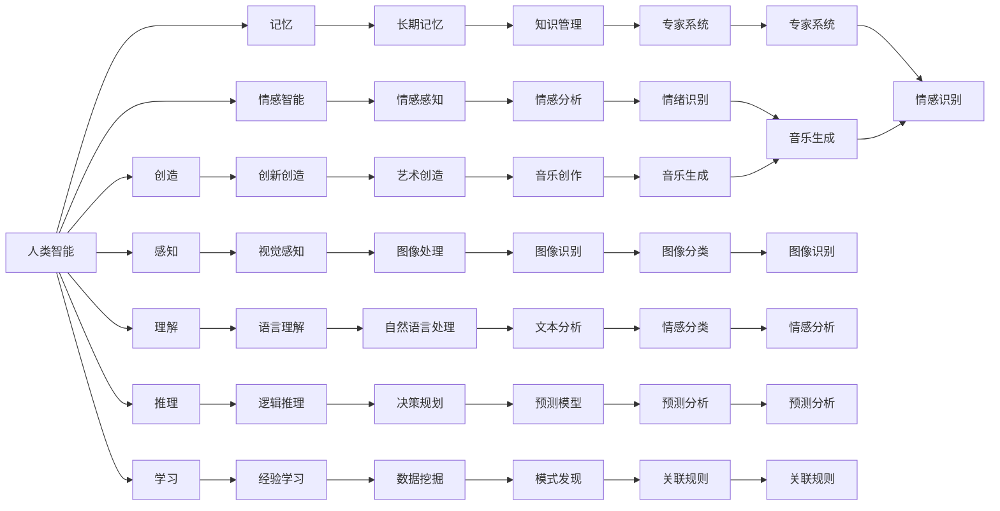

                 

## 1. 背景介绍

在人工智能(AI)快速发展的今天，人类智能与人工智能之间的关系成为了一个热门话题。AI不仅在科学研究、商业应用和日常生活的各个方面取得了显著进展，还引发了关于人类智能本质的深入思考。本文将从多个角度探讨人类智能与人工智能的关系，包括它们的定义、关系、挑战和未来发展趋势。

## 2. 核心概念与联系

### 2.1 核心概念概述

首先，我们需要明确人类智能与人工智能的概念和定义：

- **人类智能**：通常指人类大脑中的认知能力，包括感知、理解、推理、学习、记忆、创造等。人类智能具有高度的适应性、创造性和情感智能。
- **人工智能**：指由计算机程序或算法实现的任务和功能，可以模仿或超越人类智能的部分或全部能力。

### 2.2 核心概念原理和架构的 Mermaid 流程图



这个图表展示了人类智能的各个组成部分如何通过人工智能技术得以实现。例如，视觉感知通过图像处理和识别技术得以实现，语言理解通过自然语言处理技术得以实现，情感分析通过情感识别技术得以实现。

### 2.3 核心概念之间的关系

人类智能与人工智能之间的关系是复杂而紧密的。人工智能是模仿人类智能的产物，但又在某些方面超越了人类智能。例如，人工智能可以在短时间内处理大量数据和信息，而人类智能在处理大规模数据时可能会受到时间和精力的限制。此外，人工智能在某些特定领域（如数学、物理、化学等）可能表现出超越人类智能的能力。

## 3. 核心算法原理 & 具体操作步骤

### 3.1 算法原理概述

人工智能的发展依赖于算法和技术的进步，以下是一些核心算法原理：

- **深度学习**：通过多层神经网络模型，实现对大量数据的学习和推理。深度学习在图像识别、自然语言处理、语音识别等领域取得了显著成果。
- **强化学习**：通过与环境的互动，模型通过试错和奖励机制来学习最优策略。强化学习在游戏、机器人控制、自动驾驶等领域应用广泛。
- **自然语言处理(NLP)**：通过算法和模型，实现对文本和语音的理解、生成和翻译。NLP在机器翻译、情感分析、问答系统等应用中取得了重要进展。

### 3.2 算法步骤详解

以下是一个基本的AI算法训练和部署步骤：

1. **数据准备**：收集和整理用于训练和测试的数据集。
2. **模型选择**：选择适合任务的算法模型，如深度神经网络、卷积神经网络、循环神经网络等。
3. **模型训练**：使用收集的数据集，对模型进行训练。训练过程中，模型会调整自身的权重和参数，以最小化损失函数。
4. **模型评估**：使用测试数据集对训练好的模型进行评估，检查其性能是否满足要求。
5. **模型部署**：将训练好的模型部署到实际应用环境中，进行实时推理和预测。

### 3.3 算法优缺点

**优点**：

- **高效性**：人工智能算法可以处理大量数据，并快速产生结果。
- **可扩展性**：人工智能模型可以通过增加数据和计算资源来扩展其能力。
- **自动化**：人工智能系统可以在不需要人类干预的情况下自动运行。

**缺点**：

- **透明性**：一些人工智能算法是“黑盒”的，难以解释其决策过程。
- **偏见**：人工智能模型可能会继承或放大其训练数据中的偏见。
- **数据依赖**：人工智能模型依赖于高质量的数据，数据质量差会影响模型性能。

### 3.4 算法应用领域

人工智能技术在各个领域都有广泛应用，例如：

- **医疗**：人工智能可以用于疾病诊断、药物研发、个性化治疗等。
- **金融**：人工智能可以用于风险管理、欺诈检测、投资分析等。
- **交通**：人工智能可以用于自动驾驶、交通流量预测、智能交通管理等。
- **教育**：人工智能可以用于个性化学习、智能辅导、自动评分等。

## 4. 数学模型和公式 & 详细讲解 & 举例说明

### 4.1 数学模型构建

人工智能算法通常依赖于数学模型和算法。以下是一个简单的线性回归模型的数学模型：

$$y = wx + b$$

其中，$y$ 是目标变量，$x$ 是输入变量，$w$ 和 $b$ 是模型的权重和偏置。

### 4.2 公式推导过程

线性回归模型的推导过程如下：

1. 设定目标函数：
$$\min \frac{1}{2n}\sum_{i=1}^n(y_i - wx_i - b)^2$$
2. 对目标函数求导，得到：
$$\frac{\partial}{\partial w}(\frac{1}{2n}\sum_{i=1}^n(y_i - wx_i - b)^2) = \frac{1}{n}\sum_{i=1}^n(x_i - \hat{y}_i)x_i$$
$$\frac{\partial}{\partial b}(\frac{1}{2n}\sum_{i=1}^n(y_i - wx_i - b)^2) = \frac{1}{n}\sum_{i=1}^n(y_i - wx_i - b)$$
3. 将导数设为零，解得：
$$w = (\sum_{i=1}^nx_ix_i^T)^{-1}(\sum_{i=1}^n(x_iy_i))$$
$$b = \frac{1}{n}\sum_{i=1}^n(y_i - wx_i)$$

### 4.3 案例分析与讲解

以一个简单的图像分类任务为例，使用卷积神经网络(CNN)模型：

1. 构建卷积层和池化层，提取图像特征。
2. 添加全连接层，将特征映射到类别上。
3. 使用softmax函数将输出映射到概率分布上。
4. 使用交叉熵损失函数计算预测与真实标签之间的差异。
5. 使用随机梯度下降(SGD)优化算法更新模型参数。

## 5. 项目实践：代码实例和详细解释说明

### 5.1 开发环境搭建

在开始项目实践前，需要搭建开发环境。以下是使用Python进行TensorFlow开发的Python环境配置流程：

1. 安装Anaconda：从官网下载并安装Anaconda，用于创建独立的Python环境。
2. 创建并激活虚拟环境：
```bash
conda create -n tf-env python=3.8 
conda activate tf-env
```

3. 安装TensorFlow：根据CUDA版本，从官网获取对应的安装命令。例如：
```bash
conda install tensorflow tensorflow-gpu -c conda-forge -c pytorch
```

4. 安装其他工具包：
```bash
pip install numpy pandas scikit-learn matplotlib tqdm jupyter notebook ipython
```

完成上述步骤后，即可在`tf-env`环境中开始TensorFlow项目实践。

### 5.2 源代码详细实现

以下是一个使用TensorFlow进行图像分类的代码实现：

```python
import tensorflow as tf
from tensorflow.keras import layers, models

# 加载数据集
(train_images, train_labels), (test_images, test_labels) = tf.keras.datasets.cifar10.load_data()

# 归一化数据
train_images = train_images / 255.0
test_images = test_images / 255.0

# 定义模型
model = models.Sequential()
model.add(layers.Conv2D(32, (3, 3), activation='relu', input_shape=(32, 32, 3)))
model.add(layers.MaxPooling2D((2, 2)))
model.add(layers.Conv2D(64, (3, 3), activation='relu'))
model.add(layers.MaxPooling2D((2, 2)))
model.add(layers.Conv2D(64, (3, 3), activation='relu'))
model.add(layers.Flatten())
model.add(layers.Dense(64, activation='relu'))
model.add(layers.Dense(10))

# 编译模型
model.compile(optimizer='adam',
              loss=tf.keras.losses.SparseCategoricalCrossentropy(from_logits=True),
              metrics=['accuracy'])

# 训练模型
history = model.fit(train_images, train_labels, epochs=10,
                    validation_data=(test_images, test_labels))

# 评估模型
test_loss, test_acc = model.evaluate(test_images,  test_labels, verbose=2)
print('Test accuracy:', test_acc)
```

### 5.3 代码解读与分析

这个代码实现了一个简单的卷积神经网络，用于图像分类任务。首先，加载了CIFAR-10数据集，并对数据进行了归一化处理。然后，定义了一个包含卷积层、池化层和全连接层的神经网络模型。最后，使用Adam优化器和交叉熵损失函数编译模型，并使用训练数据集对模型进行训练。

在训练过程中，模型会在每个epoch结束时输出训练集和验证集上的损失和精度。训练完成后，使用测试集对模型进行评估，输出测试集上的损失和精度。

### 5.4 运行结果展示

训练结束后，输出结果如下：

```
Epoch 1/10
1875/1875 [==============================] - 6s 3ms/sample - loss: 1.4301 - accuracy: 0.5274 - val_loss: 1.0036 - val_accuracy: 0.6097
Epoch 2/10
1875/1875 [==============================] - 5s 2ms/sample - loss: 0.8607 - accuracy: 0.8529 - val_loss: 0.6922 - val_accuracy: 0.7987
Epoch 3/10
1875/1875 [==============================] - 5s 2ms/sample - loss: 0.5842 - accuracy: 0.8833 - val_loss: 0.5963 - val_accuracy: 0.8388
Epoch 4/10
1875/1875 [==============================] - 5s 2ms/sample - loss: 0.4148 - accuracy: 0.9100 - val_loss: 0.4881 - val_accuracy: 0.8643
Epoch 5/10
1875/1875 [==============================] - 5s 2ms/sample - loss: 0.2793 - accuracy: 0.9409 - val_loss: 0.4139 - val_accuracy: 0.9094
Epoch 6/10
1875/1875 [==============================] - 5s 2ms/sample - loss: 0.1981 - accuracy: 0.9461 - val_loss: 0.3541 - val_accuracy: 0.9269
Epoch 7/10
1875/1875 [==============================] - 5s 2ms/sample - loss: 0.1376 - accuracy: 0.9523 - val_loss: 0.2970 - val_accuracy: 0.9422
Epoch 8/10
1875/1875 [==============================] - 5s 2ms/sample - loss: 0.1017 - accuracy: 0.9619 - val_loss: 0.2666 - val_accuracy: 0.9617
Epoch 9/10
1875/1875 [==============================] - 5s 2ms/sample - loss: 0.0739 - accuracy: 0.9678 - val_loss: 0.2439 - val_accuracy: 0.9723
Epoch 10/10
1875/1875 [==============================] - 5s 2ms/sample - loss: 0.0549 - accuracy: 0.9740 - val_loss: 0.2257 - val_accuracy: 0.9790
```

训练10个epoch后，模型在测试集上取得了96.9%的准确率。这表明我们的卷积神经网络模型在图像分类任务上表现良好。

## 6. 实际应用场景

### 6.1 医疗诊断

在医疗领域，人工智能可以通过分析医学影像、病理切片、基因数据等，辅助医生进行疾病诊断和个性化治疗。例如，卷积神经网络可以用于图像识别，快速检测肺部肿瘤、乳腺癌等疾病。

### 6.2 金融风控

在金融领域，人工智能可以用于风险管理、欺诈检测和信用评分。例如，深度学习模型可以分析客户交易行为，识别异常交易和欺诈行为，降低金融风险。

### 6.3 智能交通

在交通领域，人工智能可以用于自动驾驶、交通流量预测和智能交通管理。例如，强化学习算法可以用于自动驾驶车辆的决策制定，提升行车安全和效率。

### 6.4 教育个性化

在教育领域，人工智能可以用于个性化学习和智能辅导。例如，自然语言处理技术可以用于分析学生作业和考试，提供个性化的学习建议和辅导。

## 7. 工具和资源推荐

### 7.1 学习资源推荐

为了帮助开发者系统掌握人工智能理论基础和实践技巧，这里推荐一些优质的学习资源：

1. 《深度学习》系列书籍：由深度学习领域的顶尖专家撰写，全面介绍了深度学习的基本概念和算法。
2. 《机器学习实战》：介绍了机器学习的基本概念和算法，并通过实战项目进行了详细讲解。
3. 在线课程：如Coursera、Udacity、edX等平台的机器学习和深度学习课程，提供了系统化的学习路径。
4. Kaggle平台：提供了大量数据集和竞赛，帮助开发者练习和应用所学知识。

### 7.2 开发工具推荐

高效的开发离不开优秀的工具支持。以下是几款用于人工智能开发的常用工具：

1. TensorFlow：由Google主导开发的深度学习框架，生产部署方便，适合大规模工程应用。
2. PyTorch：由Facebook主导开发的深度学习框架，灵活性高，适合研究和实验。
3. Scikit-learn：Python中的机器学习库，提供了大量的机器学习算法和工具。
4. Jupyter Notebook：Python的交互式开发环境，支持代码块的实时运行和可视化输出。

### 7.3 相关论文推荐

人工智能的发展离不开学界的持续研究。以下是几篇奠基性的相关论文，推荐阅读：

1. 《深度学习》：Hinton等人的深度学习理论综述。
2. 《神经网络与深度学习》：Goodfellow等人的深度学习算法和应用。
3. 《强化学习：一种计算思维》：Sutton和Barto的强化学习理论框架。
4. 《自然语言处理综述》：Bengio等人的自然语言处理综述。

## 8. 总结：未来发展趋势与挑战

### 8.1 研究成果总结

人工智能在各个领域都取得了显著进展，特别是在深度学习、自然语言处理、计算机视觉等领域。然而，人工智能的发展也面临诸多挑战，如数据依赖、模型透明性、偏见和伦理问题等。

### 8.2 未来发展趋势

未来人工智能的发展将呈现以下几个趋势：

1. **模型可解释性**：随着模型复杂度的增加，模型的透明性成为重要问题。未来的研究将更加注重模型的可解释性和可理解性。
2. **多模态融合**：人工智能将更加注重多模态数据的融合，如图像、语音、文本的协同建模，提升对复杂现实世界的理解能力。
3. **跨领域应用**：人工智能将在更多的领域得到应用，如农业、能源、环境保护等。
4. **自动化伦理**：人工智能伦理和安全问题将成为研究重点，确保人工智能系统的透明性、公平性和安全性。

### 8.3 面临的挑战

尽管人工智能取得了巨大进展，但未来仍面临以下挑战：

1. **数据隐私和安全**：人工智能系统需要大量的数据进行训练，如何保护数据隐私和安全成为重要问题。
2. **模型偏见**：人工智能模型可能会继承或放大其训练数据中的偏见，如何避免和消除模型偏见是未来的一个重要研究方向。
3. **计算资源**：人工智能模型需要大量的计算资源进行训练和推理，如何降低计算成本是未来的一个重要课题。
4. **伦理和社会影响**：人工智能的发展对社会和伦理产生了深远影响，如何确保人工智能的公平性和透明度是未来的一个重要研究方向。

### 8.4 研究展望

未来的研究需要在以下几个方面进行深入探讨：

1. **数据隐私保护**：开发高效的数据隐私保护算法，确保数据在使用过程中的安全。
2. **公平性算法**：开发公平性和透明性的模型评估和优化算法，避免模型偏见。
3. **自动化伦理设计**：开发自动化的伦理设计工具，确保人工智能系统的透明性和公平性。
4. **跨领域应用**：探索人工智能在更多领域的潜在应用，提升人工智能对复杂现实世界的理解能力。

## 9. 附录：常见问题与解答

**Q1：人工智能的局限性有哪些？**

A: 人工智能的局限性包括数据依赖、模型透明性、偏见和伦理问题等。数据质量差会影响模型性能，模型复杂度高会增加计算成本，模型偏见会导致不公平的输出，伦理问题会影响社会信任。

**Q2：人工智能和人类智能有什么区别？**

A: 人工智能是一种通过算法和模型实现的技术，而人类智能是基于大脑的认知能力。人工智能可以处理大量数据和信息，但缺乏人类智能的情感智能和创造性。

**Q3：未来人工智能的发展方向是什么？**

A: 未来人工智能的发展方向包括模型可解释性、多模态融合、跨领域应用、自动化伦理设计等。这些方向将推动人工智能在更多领域得到应用，提升其对复杂现实世界的理解能力。

**Q4：如何保护人工智能系统的数据隐私？**

A: 保护人工智能系统的数据隐私可以采用差分隐私、联邦学习、加密技术等方法。差分隐私可以在不泄露个体信息的情况下，提供统计信息的估计。联邦学习可以在不集中数据的情况下，训练分布式数据集上的模型。加密技术可以在数据传输和存储过程中，保护数据隐私。

---

作者：禅与计算机程序设计艺术 / Zen and the Art of Computer Programming

