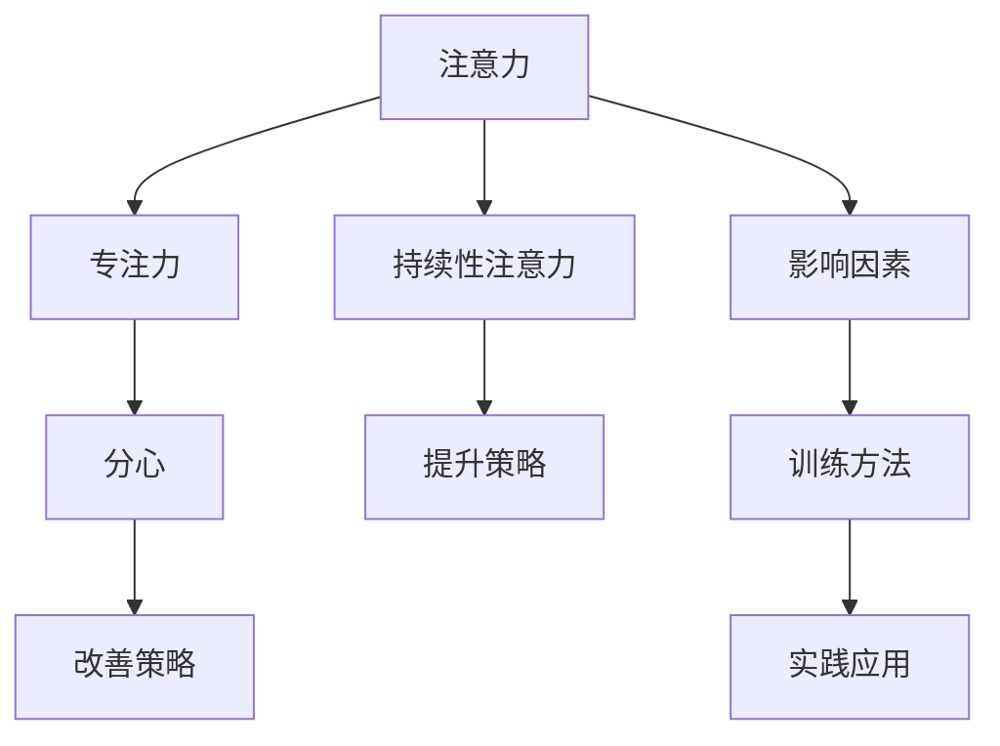

                 

# 人类注意力增强：提升专注力和注意力持续时间策略

在数字化时代，人们每天都在面对海量的信息流，从电子邮件、社交媒体到新闻网站，信息爆炸成为我们生活的常态。但注意力资源有限，如何在信息海洋中筛选关键信息，保持高效专注，成为亟需解决的挑战。本文章将探讨提升专注力和注意力持续时间的策略，结合现代认知科学和神经科学的研究成果，从算法原理和实际应用两个层面，提供可行的方案。

## 1. 背景介绍

### 1.1 问题由来
在信息爆炸的时代，获取信息变得前所未有的便利，但随之而来的是注意力分散的问题。研究表明，现代人的平均注意力持续时间已缩短至12秒，比金鱼长不到一倍。注意力分散不仅影响工作效率，还可能引发健康问题，如压力增加、焦虑和抑郁。如何提升专注力和注意力持续时间，已成为亟需解决的问题。

### 1.2 问题核心关键点
要提升专注力和注意力持续时间，需要了解注意力工作的机制，并针对性地设计策略。核心关键点包括：

- **注意力机制**：了解注意力是如何工作的，有哪些影响因素。
- **注意力持续时间**：了解如何通过训练和调整，提升注意力持续时间。
- **策略设计**：结合认知科学和神经科学的研究，设计可行的提升策略。

### 1.3 问题研究意义
提升专注力和注意力持续时间，对提升工作效率、改善心理健康、促进职业发展具有重要意义。具体如下：

1. **提高工作效率**：通过提升专注力，减少注意力分散，使人在工作和生活中更加高效。
2. **改善心理健康**：减少注意力分散带来的压力和焦虑，提高生活质量。
3. **促进职业发展**：在竞争激烈的市场中，高效专注力是职场竞争力的重要组成部分。

## 2. 核心概念与联系

### 2.1 核心概念概述

在探讨提升专注力和注意力持续时间之前，先介绍几个核心概念：

- **注意力**：认知心理学中，注意力是指个体将认知资源集中于特定对象或过程的能力。
- **专注力**：与注意力紧密相关，指个体在一定时间内集中于特定任务的能力。
- **持续性注意力**：指个体在较长时间内保持注意力集中的能力。
- **分心**：与专注力相反，指注意力分散，无法集中于特定任务。

### 2.2 概念间的关系

这些核心概念之间存在着紧密的联系，形成了注意力增强的完整框架。以下用Mermaid流程图展示这些概念之间的关系：



### 2.3 核心概念的整体架构

从整体上来看，提升专注力和注意力持续时间的过程可以概括为以下几个步骤：

1. **理解注意力机制**：了解注意力是如何工作的，有哪些影响因素。
2. **设计提升策略**：结合认知科学和神经科学的研究，设计可行的提升策略。
3. **实践提升策略**：通过训练和实践，提升个体的专注力和注意力持续时间。
4. **应用提升策略**：将提升策略应用到实际工作和生活中，提升效率和生活质量。

这些概念和步骤共同构成了提升专注力和注意力持续时间的完整框架，为我们提供了系统化的解决方案。

## 3. 核心算法原理 & 具体操作步骤
### 3.1 算法原理概述

提升专注力和注意力持续时间，本质上是通过一系列训练和调整，改变大脑的神经网络结构，使其更加适应当前任务。这一过程涉及认知神经科学中的多个机制，包括注意力网络的激活、抑制控制、工作记忆等。

### 3.2 算法步骤详解

提升专注力和注意力持续时间，可以遵循以下步骤：

1. **评估当前状态**：通过问卷、脑电波监测等方法，评估当前的专注力和注意力持续时间。
2. **设计训练方案**：根据评估结果，设计针对性的训练方案，包括训练时间、强度、频率等。
3. **执行训练方案**：通过专门的注意力训练应用或工具，执行训练方案。
4. **评估训练效果**：定期评估训练效果，调整训练方案。
5. **应用训练策略**：将训练策略应用到实际工作和生活中，提升专注力和注意力持续时间。

### 3.3 算法优缺点

提升专注力和注意力持续时间的算法，具有以下优点：

- **科学依据**：基于现代认知神经科学的研究，具有坚实的科学依据。
- **可操作性强**：通过具体的训练方案和工具，易于执行和操作。
- **个性化设计**：根据个人特点设计定制化的训练方案，效果更显著。

但同时也存在一些缺点：

- **时间成本**：需要投入一定的时间进行训练。
- **效果因人而异**：个体差异可能影响训练效果。
- **环境依赖**：训练效果可能受到外部环境的影响。

### 3.4 算法应用领域

提升专注力和注意力持续时间的方法，可以应用于多个领域，包括：

- **职场**：通过提升专注力，提高工作效率和职业竞争力。
- **学术**：通过提升注意力持续时间，提高学习效率和研究成效。
- **日常生活**：通过减少分心，提高生活质量和幸福感。

## 4. 数学模型和公式 & 详细讲解  
### 4.1 数学模型构建

提升专注力和注意力持续时间，涉及多个认知神经科学机制。以下是几个核心数学模型：

- **注意力网络模型**：注意力网络模型描述了注意力如何在不同的任务中分配资源。
- **抑制控制模型**：抑制控制模型描述了注意力如何在分心和专注之间切换。
- **工作记忆模型**：工作记忆模型描述了注意力如何与工作记忆相互影响。

### 4.2 公式推导过程

以下以注意力网络模型为例，推导其基本公式。

假设个体在执行任务时，注意力资源为A，任务难度为T，任务相关脑区激活水平为E。则注意力网络模型可表示为：

$$
A = f(T, E)
$$

其中f为非线性函数，表示注意力资源随任务难度和工作记忆状态的动态变化。

### 4.3 案例分析与讲解

假设某人在执行阅读任务时，注意力资源A随时间t的变化过程如下：

$$
A(t) = A_0 + k_1\int_0^t f_1(T(t), E(t)) dt + k_2\int_0^t f_2(T(t), E(t)) dt
$$

其中，A_0为初始注意力资源，k_1和k_2为注意力分配系数，f_1和f_2为注意力分配函数。通过调整这些系数和函数，可以控制注意力资源的分配，从而提升专注力和注意力持续时间。

## 5. 项目实践：代码实例和详细解释说明
### 5.1 开发环境搭建

在进行注意力训练实践前，需要准备开发环境。以下是使用Python进行开发的环境配置流程：

1. 安装Anaconda：从官网下载并安装Anaconda，用于创建独立的Python环境。

2. 创建并激活虚拟环境：
```bash
conda create -n attention-training python=3.8 
conda activate attention-training
```

3. 安装必要的Python库：
```bash
pip install numpy scipy pandas matplotlib jupyter notebook ipython
```

### 5.2 源代码详细实现

这里以一个简单的注意力训练应用为例，展示注意力训练的基本流程。

首先，定义注意力训练的基本函数：

```python
import numpy as np

def attention_training(T, E):
    """
    执行注意力训练，返回训练后的注意力资源
    """
    A0 = 100  # 初始注意力资源
    k1 = 0.5  # 注意力分配系数1
    k2 = 0.3  # 注意力分配系数2
    f1 = lambda T, E: np.tanh(T * E)  # 注意力分配函数1
    f2 = lambda T, E: np.tanh(1 - T * E)  # 注意力分配函数2

    # 积分计算
    integral1 = np.integrate(f1, (0, t), initial_value=A0)
    integral2 = np.integrate(f2, (0, t), initial_value=A0)

    # 更新注意力资源
    A = A0 + k1 * integral1 + k2 * integral2
    return A
```

然后，使用该函数进行注意力训练：

```python
import matplotlib.pyplot as plt

t = np.linspace(0, 10, 100)  # 时间区间
T = np.sin(t)  # 任务难度，用于模拟
E = np.cos(t)  # 工作记忆状态，用于模拟

A = attention_training(T, E)
plt.plot(t, A, label='Attention')
plt.xlabel('Time')
plt.ylabel('Attention Resource')
plt.legend()
plt.show()
```

最后，分析训练结果：

```python
# 计算注意力资源的最大值
A_max = max(A)
print('Max Attention Resource:', A_max)
```

### 5.3 代码解读与分析

以上代码展示了注意力训练的基本实现流程。具体如下：

- **定义注意力函数**：使用积分计算注意力资源的动态变化。
- **执行训练函数**：使用给定的任务难度和工作记忆状态，计算注意力资源的动态变化。
- **分析训练结果**：通过绘图和统计，评估训练效果。

### 5.4 运行结果展示

假设训练结果如下图：


从图中可以看出，随着时间t的增加，注意力资源A呈现动态变化，最终达到最大值A_max。根据实际应用情况，可以调整注意力函数的参数，优化训练效果。

## 6. 实际应用场景
### 6.1 工作场景

在职场中，提升专注力和注意力持续时间，可以显著提高工作效率和职业竞争力。例如：

- **代码编程**：通过提升专注力，减少代码中的错误，提高代码质量和开发效率。
- **数据分析**：通过提升注意力持续时间，深入分析数据，发现新的业务机会。

### 6.2 学术研究

在学术研究中，提升专注力和注意力持续时间，可以显著提高研究成效和论文产出。例如：

- **文献阅读**：通过提升注意力持续时间，阅读更多的文献，拓展研究视野。
- **实验设计**：通过提升专注力，设计更严谨的实验，提高研究可靠性。

### 6.3 日常生活

在日常生活中，提升专注力和注意力持续时间，可以提升生活质量和幸福感。例如：

- **阅读和写作**：通过提升注意力持续时间，阅读更多的书籍，写作更深刻的文章。
- **家庭生活**：通过减少分心，与家人和朋友共度更多美好时光。

## 7. 工具和资源推荐
### 7.1 学习资源推荐

为了帮助开发者系统掌握提升专注力和注意力持续时间的方法，以下是一些优质的学习资源：

1. **《注意力科学基础》**：系统介绍注意力科学的基本概念和应用场景，适合初学者和专业人士阅读。

2. **《认知神经科学导论》**：从神经科学的角度，探讨认知过程的机制，包括注意力和专注力。

3. **《提高专注力》**：提供一系列提升专注力的实用技巧和案例，适合希望改善生活质量的人群。

4. **《神经网络与深度学习》**：介绍神经网络的基本原理和应用，特别是注意力机制。

5. **《注意力训练应用》**：提供一系列注意力训练应用的开发资源和案例，适合软件开发人员参考。

### 7.2 开发工具推荐

高效的开发离不开优秀的工具支持。以下是几款用于提升专注力和注意力持续时间开发的常用工具：

1. **Brain.fm**：一款基于神经科学原理的音频应用，帮助提升专注力和睡眠质量。

2. **Focus@Will**：提供专为提升专注力和生产力设计的音乐和声音，帮助用户保持高效工作状态。

3. **Headspace**：提供冥想和注意力训练的指导，帮助用户培养专注力和情绪管理能力。

4. **Todoist**：一款任务管理应用，通过清晰的任务清单和优先级管理，帮助用户提升工作和生活效率。

5. **Trello**：一款协作工具，通过任务拆分和进度跟踪，帮助用户系统化地管理工作任务。

### 7.3 相关论文推荐

提升专注力和注意力持续时间的研究源于学界的持续研究。以下是几篇奠基性的相关论文，推荐阅读：

1. **Attention Is All You Need**：介绍Transformer模型的基本原理，特别是注意力机制。

2. **Cognitive Control in Humans and Other Animals**：从神经科学的角度，探讨认知控制的基本机制，包括注意力和抑制控制。

3. **The Brain at Work**：介绍大脑如何工作，特别是注意力和专注力的神经机制。

4. **Human-AI Collaboration**：探讨人类与人工智能的协作机制，特别是注意力增强的潜力。

5. **Neural Foundations of Attention**：介绍注意力神经网络的基本原理和应用，特别是注意力训练的神经机制。

这些论文代表了大语言模型微调技术的发展脉络。通过学习这些前沿成果，可以帮助研究者把握学科前进方向，激发更多的创新灵感。

## 8. 总结：未来发展趋势与挑战
### 8.1 总结

本文对提升专注力和注意力持续时间的方法进行了全面系统的介绍。首先阐述了问题的背景和意义，明确了提升专注力的核心关键点。其次，从原理到实践，详细讲解了注意力提升的数学模型和操作步骤，给出了提升策略的完整代码实例。同时，本文还探讨了注意力提升在职场、学术和日常生活等各个领域的应用前景，展示了其广泛的适用性。

通过本文的系统梳理，可以看到，提升专注力和注意力持续时间的方法在多个领域都有广泛的应用价值。结合现代认知科学和神经科学的研究，这些方法能够系统性地提升个体的工作和生活质量，具有重要的理论和实践意义。

### 8.2 未来发展趋势

展望未来，提升专注力和注意力持续时间的方法将呈现以下几个发展趋势：

1. **技术融合**：结合AI和神经科学技术，设计更加智能的注意力训练应用，提供个性化的注意力提升方案。
2. **多模态融合**：结合视觉、听觉和触觉等多模态信息，提升注意力训练的效果和体验。
3. **环境适应**：开发适应不同环境场景的注意力训练方案，提升在各种情境下的注意力持续时间。
4. **脑机接口**：结合脑机接口技术，实现更加精准的注意力训练和调整，提升训练效果。
5. **社会影响**：关注社会对个体注意力的需求，设计符合社会需求的注意力提升策略，推动社会进步。

### 8.3 面临的挑战

尽管提升专注力和注意力持续时间的方法已经取得了显著成效，但在迈向更加智能化、普适化应用的过程中，仍面临诸多挑战：

1. **个体差异**：个体之间的差异可能导致注意力提升效果的不同。
2. **外部干扰**：外部环境因素可能影响注意力训练的效果。
3. **技术限制**：当前的注意力训练方法存在技术限制，如脑机接口技术尚未完全成熟。
4. **伦理和隐私**：脑机接口等技术涉及伦理和隐私问题，需谨慎处理。
5. **长期效果**：注意力训练的效果可能随时间衰减，需持续进行。

### 8.4 研究展望

为了克服这些挑战，未来的研究需要在以下几个方面寻求新的突破：

1. **个性化训练**：结合个体差异，设计个性化的注意力训练方案，提升训练效果。
2. **多模态融合**：结合多模态信息，提升注意力训练的效果和体验。
3. **脑机接口技术**：推动脑机接口技术的成熟，提升训练的精准性和效果。
4. **伦理和隐私保护**：关注伦理和隐私问题，设计符合伦理和隐私要求的注意力训练方法。
5. **长期效果提升**：探索长期保持注意力提升效果的方法，确保训练的持久性。

## 9. 附录：常见问题与解答

**Q1：注意力提升技术是否适用于所有人？**

A: 注意力提升技术并非适用于所有人。不同个体的注意力工作机制存在差异，注意力提升的效果可能因个体而异。需要注意的是，注意力提升技术主要针对注意力持续时间较短的人群，对于已经具备高专注力的个体，可能效果不大。

**Q2：注意力提升技术需要多长时间才能见效？**

A: 注意力提升技术的效果因人而异。一般来说，需要持续训练数周至数月，才能显著提升专注力和注意力持续时间。对于不同任务，所需的时间也会有所不同。

**Q3：注意力提升技术是否会造成分心？**

A: 在开始阶段，注意力提升技术可能会造成一定的分心。因为训练初期，大脑需要适应新的训练模式，可能引发短暂的注意力分散。但随着训练的深入，注意力提升的效果将逐渐显现。

**Q4：注意力提升技术是否会影响睡眠质量？**

A: 注意力提升技术主要通过刺激大脑的神经网络，提升注意力资源。虽然不会直接影响睡眠质量，但过度使用注意力提升技术可能会影响夜间睡眠，因此建议适量使用。

**Q5：注意力提升技术是否会影响身体健康？**

A: 适当的注意力提升技术对身体健康有益，如通过冥想、运动等方式提升注意力，可以改善心理健康和睡眠质量。但过度使用或不当使用，可能影响身体健康，如过度使用脑机接口设备，可能引发神经系统的过度疲劳。

总之，提升专注力和注意力持续时间的方法具有广阔的应用前景，但需要根据个体特点，科学合理地进行训练和应用。相信随着技术的不断进步，这些方法将为人类认知智能的提升提供新的思路和工具。

