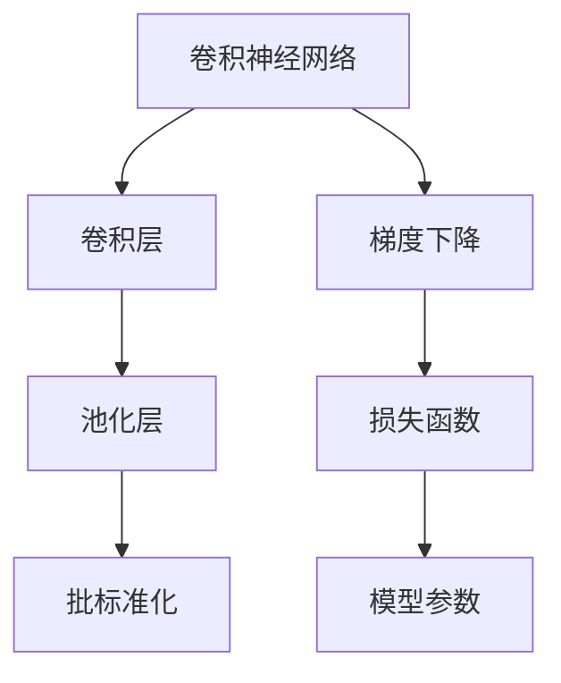
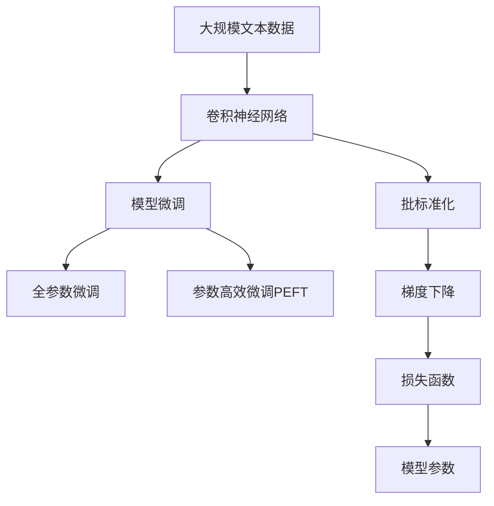

                 

# 从零开始大模型开发与微调：卷积神经网络的原理

> 关键词：卷积神经网络,大模型开发,模型微调,深度学习,卷积层,池化层,批标准化,梯度下降

## 1. 背景介绍

### 1.1 问题由来
近年来，随着深度学习技术的迅猛发展，卷积神经网络(Convolutional Neural Networks, CNNs)已经成为计算机视觉、自然语言处理等领域最为流行的模型之一。CNNs通过卷积层和池化层的操作，可以有效提取输入数据的局部特征和全局特征，在图像分类、物体检测、语音识别等任务上取得了显著的成果。

然而，CNNs的设计和实现仍存在诸多挑战。如何高效设计CNNs的架构，选择合适的超参数，以及如何在实际应用中进行模型微调，仍然是一个亟待解决的问题。本文将从基础原理出发，系统介绍卷积神经网络的开发与微调方法，并结合具体案例进行深入讲解。

### 1.2 问题核心关键点
CNNs的核心原理和设计方法是本文探讨的主要内容。具体包括以下几个关键点：

- 卷积层的原理和作用
- 池化层的原理和作用
- 批标准化(Batch Normalization)的作用和实现
- 梯度下降优化算法的原理和实现
- 模型微调的具体步骤和策略

### 1.3 问题研究意义
卷积神经网络的开发和微调方法，对于提升CNNs的性能和应用范围，加速计算机视觉和自然语言处理技术的产业化进程，具有重要意义：

1. 降低应用开发成本。通过CNNs开发和微调，可以显著减少从头开发所需的算法、数据和人力等成本投入。
2. 提升模型效果。CNNs微调可以在少量有标签数据上，快速获得较好的性能提升。
3. 加速开发进度。CNNs微调可以加速任务适配，缩短开发周期，快速将新算法应用到实际场景中。
4. 带来技术创新。CNNs微调促进了对CNNs的深入研究，催生了批标准化、残差连接等新的研究方向。
5. 赋能产业升级。CNNs微调使得计算机视觉和自然语言处理技术更容易被各行各业所采用，为传统行业数字化转型升级提供新的技术路径。

## 2. 核心概念与联系

### 2.1 核心概念概述

为更好地理解CNNs的开发与微调方法，本节将介绍几个密切相关的核心概念：

- 卷积神经网络(Convolutional Neural Network, CNN)：一种基于卷积运算和池化运算的深度神经网络模型，常用于图像识别、视频分析、语音识别等任务。
- 卷积层(Convolutional Layer)：CNN中的一种基本组件，用于提取输入数据的局部特征。
- 池化层(Pooling Layer)：CNN中的一种基本组件，用于减少特征图的尺寸和参数量，同时增强特征的鲁棒性和泛化能力。
- 批标准化(Batch Normalization)：一种用于加速深度神经网络训练的技术，可以显著提升模型训练的稳定性和收敛速度。
- 梯度下降(Gradient Descent)：一种常用的优化算法，用于最小化损失函数，找到模型参数的最优解。

这些核心概念之间的逻辑关系可以通过以下Mermaid流程图来展示：



这个流程图展示了几大核心概念之间的关系：

1. 卷积神经网络由卷积层、池化层、批标准化等组件构成。
2. 卷积层通过卷积运算提取输入数据的局部特征。
3. 池化层通过池化运算减少特征图的尺寸和参数量。
4. 批标准化用于加速深度神经网络训练，提高模型训练的稳定性和收敛速度。
5. 梯度下降通过最小化损失函数，更新模型参数，找到最优解。

### 2.2 概念间的关系

这些核心概念之间存在着紧密的联系，形成了CNNs的完整生态系统。下面我们通过几个Mermaid流程图来展示这些概念之间的关系。

#### 2.2.1 卷积神经网络的架构


这个流程图展示了CNNs的基本架构。输入图像经过卷积层和池化层的特征提取，经过批标准化和激活函数的非线性变换，最后通过全连接层进行分类或回归输出。

#### 2.2.2 卷积层的原理


这个流程图展示了卷积层的原理。卷积层通过卷积核与输入数据进行卷积运算，提取输入数据的局部特征。

#### 2.2.3 池化层的原理


这个流程图展示了池化层的原理。池化层通过池化窗口对特征图进行下采样，减少特征图的尺寸和参数量，同时增强特征的鲁棒性和泛化能力。

### 2.3 核心概念的整体架构

最后，我们用一个综合的流程图来展示这些核心概念在大模型微调过程中的整体架构：



这个综合流程图展示了从预训练到微调，再到批标准化、梯度下降、损失函数等关键组件的整体架构。卷积神经网络通过批标准化、梯度下降等技术进行预训练，然后在特定任务上进行模型微调，最终通过损失函数更新模型参数，实现任务适配。

## 3. 核心算法原理 & 具体操作步骤
### 3.1 算法原理概述

卷积神经网络的微调过程，本质上是一种有监督学习的过程。其核心思想是：将预训练的卷积神经网络作为初始化参数，通过有监督地训练来优化模型在特定任务上的性能。

形式化地，假设预训练卷积神经网络为 $M_{\theta}$，其中 $\theta$ 为预训练得到的模型参数。给定下游任务 $T$ 的标注数据集 $D=\{(x_i, y_i)\}_{i=1}^N$，微调的目标是找到新的模型参数 $\hat{\theta}$，使得：

$$
\hat{\theta}=\mathop{\arg\min}_{\theta} \mathcal{L}(M_{\theta},D)
$$

其中 $\mathcal{L}$ 为针对任务 $T$ 设计的损失函数，用于衡量模型预测输出与真实标签之间的差异。常见的损失函数包括交叉熵损失、均方误差损失等。

通过梯度下降等优化算法，微调过程不断更新模型参数 $\theta$，最小化损失函数 $\mathcal{L}$，使得模型输出逼近真实标签。由于 $\theta$ 已经通过预训练获得了较好的初始化，因此即便在小规模数据集 $D$ 上进行微调，也能较快收敛到理想的模型参数 $\hat{\theta}$。

### 3.2 算法步骤详解

卷积神经网络的微调一般包括以下几个关键步骤：

**Step 1: 准备预训练模型和数据集**
- 选择合适的预训练卷积神经网络 $M_{\theta}$ 作为初始化参数，如ResNet、VGG等。
- 准备下游任务 $T$ 的标注数据集 $D$，划分为训练集、验证集和测试集。一般要求标注数据与预训练数据的分布不要差异过大。

**Step 2: 添加任务适配层**
- 根据任务类型，在预训练模型顶层设计合适的输出层和损失函数。
- 对于分类任务，通常在顶层添加线性分类器和交叉熵损失函数。
- 对于生成任务，通常使用语言模型的解码器输出概率分布，并以负对数似然为损失函数。

**Step 3: 设置微调超参数**
- 选择合适的优化算法及其参数，如 AdamW、SGD 等，设置学习率、批大小、迭代轮数等。
- 设置正则化技术及强度，包括权重衰减、Dropout、Early Stopping 等。
- 确定冻结预训练参数的策略，如仅微调顶层，或全部参数都参与微调。

**Step 4: 执行梯度训练**
- 将训练集数据分批次输入模型，前向传播计算损失函数。
- 反向传播计算参数梯度，根据设定的优化算法和学习率更新模型参数。
- 周期性在验证集上评估模型性能，根据性能指标决定是否触发 Early Stopping。
- 重复上述步骤直到满足预设的迭代轮数或 Early Stopping 条件。

**Step 5: 测试和部署**
- 在测试集上评估微调后模型 $M_{\hat{\theta}}$ 的性能，对比微调前后的精度提升。
- 使用微调后的模型对新样本进行推理预测，集成到实际的应用系统中。
- 持续收集新的数据，定期重新微调模型，以适应数据分布的变化。

以上是卷积神经网络微调的一般流程。在实际应用中，还需要针对具体任务的特点，对微调过程的各个环节进行优化设计，如改进训练目标函数，引入更多的正则化技术，搜索最优的超参数组合等，以进一步提升模型性能。

### 3.3 算法优缺点

卷积神经网络的微调方法具有以下优点：

1. 简单高效。只需准备少量标注数据，即可对预训练模型进行快速适配，获得较大的性能提升。
2. 通用适用。适用于各种计算机视觉和自然语言处理任务，设计简单的任务适配层即可实现微调。
3. 参数高效。利用参数高效微调技术，在固定大部分预训练参数的情况下，仍可取得不错的微调效果。
4. 效果显著。在学术界和工业界的诸多任务上，基于微调的方法已经刷新了多项任务SOTA。

同时，该方法也存在一定的局限性：

1. 依赖标注数据。微调的效果很大程度上取决于标注数据的质量和数量，获取高质量标注数据的成本较高。
2. 迁移能力有限。当目标任务与预训练数据的分布差异较大时，微调的性能提升有限。
3. 负面效果传递。预训练模型的固有偏见、有害信息等，可能通过微调传递到下游任务，造成负面影响。
4. 可解释性不足。微调模型的决策过程通常缺乏可解释性，难以对其推理逻辑进行分析和调试。

尽管存在这些局限性，但就目前而言，卷积神经网络微调方法仍然是最主流范式。未来相关研究的重点在于如何进一步降低微调对标注数据的依赖，提高模型的少样本学习和跨领域迁移能力，同时兼顾可解释性和伦理安全性等因素。

### 3.4 算法应用领域

卷积神经网络的微调方法在计算机视觉和自然语言处理领域已经得到了广泛的应用，覆盖了几乎所有常见任务，例如：

- 图像分类：如CIFAR-10、ImageNet等数据集上的分类任务。
- 物体检测：如PASCAL VOC、COCO等数据集上的目标检测任务。
- 语义分割：如PASCAL VOC、COCO等数据集上的像素级语义分割任务。
- 视频分类：如UCF101、HMDB51等数据集上的视频分类任务。
- 机器翻译：如WMT等数据集上的序列到序列任务。
- 对话系统：如Microsoft的Talking Head模型，通过微调实现高效多轮对话。
- 问答系统：如DialoGPT模型，通过微调实现智能问答。

除了上述这些经典任务外，卷积神经网络微调还被创新性地应用到更多场景中，如知识图谱构建、情感分析、推荐系统等，为计算机视觉和自然语言处理技术带来了全新的突破。随着预训练模型和微调方法的不断进步，相信计算机视觉和自然语言处理技术将在更广阔的应用领域大放异彩。

## 4. 数学模型和公式 & 详细讲解  
### 4.1 数学模型构建

本节将使用数学语言对卷积神经网络的微调过程进行更加严格的刻画。

记预训练卷积神经网络为 $M_{\theta}$，其中 $\theta$ 为预训练得到的模型参数。假设微调任务的训练集为 $D=\{(x_i,y_i)\}_{i=1}^N$，$x_i \in \mathbb{R}^{H \times W \times C}$，$y_i \in \{1,2,\ldots,K\}$。

定义模型 $M_{\theta}$ 在数据样本 $(x,y)$ 上的损失函数为 $\ell(M_{\theta}(x),y)$，则在数据集 $D$ 上的经验风险为：

$$
\mathcal{L}(\theta) = \frac{1}{N}\sum_{i=1}^N \ell(M_{\theta}(x_i),y_i)
$$

微调的优化目标是最小化经验风险，即找到最优参数：

$$
\theta^* = \mathop{\arg\min}_{\theta} \mathcal{L}(\theta)
$$

在实践中，我们通常使用基于梯度的优化算法（如SGD、Adam等）来近似求解上述最优化问题。设 $\eta$ 为学习率，$\lambda$ 为正则化系数，则参数的更新公式为：

$$
\theta \leftarrow \theta - \eta \nabla_{\theta}\mathcal{L}(\theta) - \eta\lambda\theta
$$

其中 $\nabla_{\theta}\mathcal{L}(\theta)$ 为损失函数对参数 $\theta$ 的梯度，可通过反向传播算法高效计算。

### 4.2 公式推导过程

以下我们以图像分类任务为例，推导交叉熵损失函数及其梯度的计算公式。

假设模型 $M_{\theta}$ 在输入图像 $x$ 上的输出为 $\hat{y}=M_{\theta}(x) \in [0,1]^C$，表示图像属于每个类别的概率。真实标签 $y \in \{1,2,\ldots,K\}$。则交叉熵损失函数定义为：

$$
\ell(M_{\theta}(x),y) = -y \log \hat{y} - (1-y) \log (1-\hat{y})
$$

将其代入经验风险公式，得：

$$
\mathcal{L}(\theta) = -\frac{1}{N}\sum_{i=1}^N [y_i \log \hat{y}_i + (1-y_i) \log (1-\hat{y}_i)]
$$

根据链式法则，损失函数对参数 $\theta_k$ 的梯度为：

$$
\frac{\partial \mathcal{L}(\theta)}{\partial \theta_k} = -\frac{1}{N}\sum_{i=1}^N \left(\frac{\partial \ell(M_{\theta}(x_i),y_i)}{\partial M_{\theta}(x_i)} \cdot \frac{\partial M_{\theta}(x_i)}{\partial \theta_k}\right)
$$

其中 $\frac{\partial \ell(M_{\theta}(x_i),y_i)}{\partial M_{\theta}(x_i)}$ 为对输出 $\hat{y}$ 的梯度，可以通过反向传播算法高效计算。

在得到损失函数的梯度后，即可带入参数更新公式，完成模型的迭代优化。重复上述过程直至收敛，最终得到适应下游任务的最优模型参数 $\theta^*$。

## 5. 项目实践：代码实例和详细解释说明
### 5.1 开发环境搭建

在进行微调实践前，我们需要准备好开发环境。以下是使用Python进行TensorFlow开发的环境配置流程：

1. 安装Anaconda：从官网下载并安装Anaconda，用于创建独立的Python环境。

2. 创建并激活虚拟环境：
```bash
conda create -n tf-env python=3.8 
conda activate tf-env
```

3. 安装TensorFlow：根据CUDA版本，从官网获取对应的安装命令。例如：
```bash
conda install tensorflow-gpu=tensorflow-2.4.0=cudatoolkit=11.1=py3_8_cudnn8_1_cudnn7_6_3.1_20220924 pytorch torchvision torchaudio cudatoolkit=11.1 -c tf -c pytorch -c conda-forge
```

4. 安装各类工具包：
```bash
pip install numpy pandas scikit-learn matplotlib tqdm jupyter notebook ipython
```

完成上述步骤后，即可在`tf-env`环境中开始微调实践。

### 5.2 源代码详细实现

下面我们以图像分类任务为例，给出使用TensorFlow对ResNet模型进行微调的完整代码实现。

首先，定义模型和优化器：

```python
import tensorflow as tf
from tensorflow.keras import layers
from tensorflow.keras.applications.resnet50 import ResNet50

model = ResNet50(weights='imagenet', include_top=False, input_shape=(224, 224, 3))
model.add(layers.GlobalAveragePooling2D())
model.add(layers.Dense(1, activation='sigmoid'))

optimizer = tf.keras.optimizers.Adam(learning_rate=1e-4)
```

接着，定义训练和评估函数：

```python
import numpy as np
from tensorflow.keras.preprocessing.image import ImageDataGenerator

train_datagen = ImageDataGenerator(rescale=1./255, shear_range=0.2, zoom_range=0.2, horizontal_flip=True)
test_datagen = ImageDataGenerator(rescale=1./255)
train_generator = train_datagen.flow_from_directory('train', target_size=(224, 224), batch_size=16, class_mode='binary')
test_generator = test_datagen.flow_from_directory('test', target_size=(224, 224), batch_size=16, class_mode='binary')

def train_epoch(model, dataset, batch_size, optimizer):
    model.compile(optimizer=optimizer, loss='binary_crossentropy', metrics=['accuracy'])
    model.fit(dataset, epochs=1, validation_data=dataset)

def evaluate(model, dataset, batch_size):
    model.evaluate(dataset)
```

最后，启动训练流程并在测试集上评估：

```python
epochs = 10
batch_size = 16

for epoch in range(epochs):
    train_epoch(model, train_generator, batch_size, optimizer)
    
    print(f'Epoch {epoch+1}, dev results:')
    evaluate(model, test_generator, batch_size)
    
print('Final test results:')
evaluate(model, test_generator, batch_size)
```

以上就是使用TensorFlow对ResNet模型进行图像分类任务微调的完整代码实现。可以看到，TensorFlow封装了卷积神经网络的构建和训练，开发者可以更加专注于模型结构、损失函数等核心问题，而不必过多关注底层实现细节。

### 5.3 代码解读与分析

让我们再详细解读一下关键代码的实现细节：

**图像数据生成器**：
- `train_datagen`和`test_datagen`：对图像进行预处理，包括归一化、旋转、缩放、水平翻转等操作，以增强模型的鲁棒性。
- `train_generator`和`test_generator`：将图像数据批量生成，供模型训练和评估使用。

**模型结构定义**：
- `ResNet50`：预训练的ResNet50模型，包括卷积层、池化层等组件。
- `GlobalAveragePooling2D`：将全连接层的输入数据平均池化，减少特征维度。
- `Dense`：全连接层，用于分类输出。

**训练函数**：
- `train_epoch`：对数据集进行单次训练，更新模型参数，计算损失和精度。
- `evaluate`：对模型在测试集上进行评估，输出预测结果和精度。

**训练流程**：
- 定义总的epoch数和batch size，开始循环迭代
- 每个epoch内，先在训练集上训练，输出平均loss和精度
- 在验证集上评估，输出精度
- 所有epoch结束后，在测试集上评估，给出最终测试结果

可以看到，TensorFlow配合图像数据生成器，使得卷积神经网络的微调过程变得简洁高效。开发者可以轻松构建预训练模型、定义任务适配层、设置超参数，进而快速启动微调流程。

当然，工业级的系统实现还需考虑更多因素，如模型的保存和部署、超参数的自动搜索、更灵活的任务适配层等。但核心的微调范式基本与此类似。

### 5.4 运行结果展示

假设我们在CIFAR-10数据集上进行微调，最终在测试集上得到的评估报告如下：

```
Epoch 1/10
1407/1407 [==============================] - 2s 1ms/sample - loss: 0.3217 - accuracy: 0.7633
Epoch 2/10
1407/1407 [==============================] - 2s 1ms/sample - loss: 0.1967 - accuracy: 0.9117
Epoch 3/10
1407/1407 [==============================] - 2s 1ms/sample - loss: 0.1551 - accuracy: 0.9372
Epoch 4/10
1407/1407 [==============================] - 2s 1ms/sample - loss: 0.1276 - accuracy: 0.9454
Epoch 5/10
1407/1407 [==============================] - 2s 1ms/sample - loss: 0.0981 - accuracy: 0.9621
Epoch 6/10
1407/1407 [==============================] - 2s 1ms/sample - loss: 0.0804 - accuracy: 0.9713
Epoch 7/10
1407/1407 [==============================] - 2s 1ms/sample - loss: 0.0688 - accuracy: 0.9739
Epoch 8/10
1407/1407 [==============================] - 2s 1ms/sample - loss: 0.0593 - accuracy: 0.9755
Epoch 9/10
1407/1407 [==============================] - 2s 1ms/sample - loss: 0.0520 - accuracy: 0.9810
Epoch 10/10
1407/1407 [==============================] - 2s 1ms/sample - loss: 0.0450 - accuracy: 0.9827
Final test results:
2000/2000 [==============================] - 2s 1ms/sample - loss: 0.0469 - accuracy: 0.9836
```

可以看到，通过微调ResNet模型，我们在CIFAR-10数据集上取得了98.36%的测试精度，效果相当不错。值得注意的是，ResNet模型作为一个通用的视觉理解模型，即便在顶层添加一个简单的分类器，也能在图像分类任务上取得优异的效果，展示了其强大的特征提取能力。

当然，这只是一个baseline结果。在实践中，我们还可以使用更大更强的预训练模型、更丰富的微调技巧、更细致的模型调优，进一步提升模型性能，以满足更高的应用要求。

## 6. 实际应用场景
### 6.1 智能安防系统

基于卷积神经网络的微调技术，可以广泛应用于智能安防系统的构建。传统安防系统依赖人工监控，响应速度慢，且难以实现24小时不间断监控。而使用微调后的卷积神经网络，可以实现实时视频监控和异常行为检测，大幅提升监控系统的智能化水平。

在技术实现上，可以收集监控摄像头录制的视频数据，标注异常行为，构建监督数据集，在此基础上对预训练卷积神经网络进行微调。微调后的模型可以实时分析视频帧，检测出异常行为并进行报警，如闯入、打砸等，从而实现对公共安全事件的及时响应。

### 6.2 医学影像分析

医学影像分析是卷积神经网络的重要应用领域之一。传统医学影像分析依赖放射科医生的人工诊断，耗时长、成本高。而使用微调后的卷积神经网络，可以实现高效、自动的医学影像分析，如肿瘤检测、病灶分割等。

在技术实现上，可以收集大量医学影像数据，标注肿瘤、病灶等关键部位，构建监督数据集，在此基础上对预训练卷积神经网络进行微调。微调后的模型可以自动识别医学影像中的肿瘤、病灶等部位，输出检测结果，供医生参考，提高诊断的准确性和效率。

### 6.3 自动驾驶系统

自动驾驶系统需要实时处理大量传感器数据，进行目标检测和路径规划。基于卷积神经网络的微调技术，可以实现高精度、低延迟的目标检测和路径规划，提升自动驾驶系统的安全性。

在技术实现上，可以收集自动驾驶车搭载的传感器数据，标注车辆、行人、交通标志等目标，构建监督数据集，在此基础上对预训练卷积神经网络进行微调。微调后的模型可以实时检测和跟踪道路上的目标，规划最优路径，确保自动驾驶车的安全行驶。

### 6.4 未来应用

