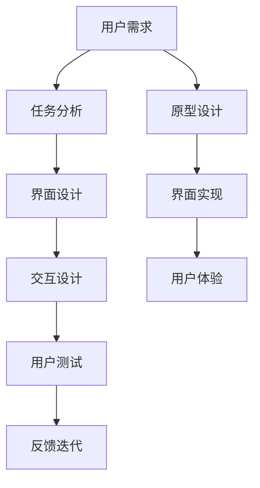

                 

# 任务导向设计思维在CUI中的详细应用

> 关键词：任务导向设计，计算机用户界面，用户中心设计，用户体验，人机交互

## 1. 背景介绍

随着人工智能技术的飞速发展，计算机用户界面（Computer User Interface, CUI）的设计已经不仅仅局限于传统的图形界面（GUI）和命令行界面（CLI），而是延伸到了更加丰富和智能的交互形式，如自然语言处理（NLP）、语音识别（ASR）和计算机视觉（CV）等。这种转变不仅仅是一种技术的进步，更是一种设计思维的转变，即从以技术为中心的设计转向以用户任务为中心的设计，旨在通过更好地理解用户需求，提供更加自然、高效、愉悦的用户体验。

任务导向设计（Task-Oriented Design, TOD）是一种以人为本的设计方法，强调通过分析用户任务，设计符合用户实际需求的界面和交互方式。在CUI设计中，任务导向设计思维的引入，不仅能够提升系统的可用性和易用性，还能够促进用户的参与感和满意度，从而实现更好的产品用户体验。

本文将详细探讨任务导向设计思维在CUI中的具体应用，包括其基本原理、操作步骤、优缺点以及在不同领域的应用实例。通过本文，读者将能够更好地理解如何通过任务导向设计思维，构建出更加符合用户需求和行为习惯的CUI。

## 2. 核心概念与联系

### 2.1 核心概念概述

为了更好地理解任务导向设计思维在CUI中的应用，我们需要先了解几个核心概念：

- **任务导向设计（Task-Oriented Design, TOD）**：以用户任务为中心，通过分析用户完成任务的过程，设计直观、高效的用户界面和交互方式，从而提升用户的使用体验。

- **计算机用户界面（Computer User Interface, CUI）**：用户与计算机系统交互的界面，包括图形界面（GUI）、命令行界面（CLI）、自然语言处理界面（NLP）、语音识别界面（ASR）和计算机视觉界面（CV）等。

- **用户中心设计（User-Centered Design, UCD）**：一种以人为本的设计方法，强调在设计过程中充分考虑用户的意见和需求，以用户为中心进行设计。

- **用户体验（User Experience, UX）**：用户在使用产品或服务时的主观感受，包括易用性、满意度、情感等。

这些概念之间存在着紧密的联系。任务导向设计是基于用户中心设计理念，以用户任务为中心，通过设计直观、高效的用户界面和交互方式，提升用户体验。CUI则是任务导向设计思维得以应用的具体形式，而用户体验是设计思维的最终目标，是衡量设计成功与否的关键指标。

### 2.2 核心概念的联系

任务导向设计和用户中心设计是密不可分的。用户中心设计强调在设计和开发过程中始终以用户需求为导向，而任务导向设计则是在此基础上，进一步分析用户完成任务的过程，设计出更加贴合用户需求的用户界面和交互方式。CUI作为用户中心设计的具体应用，需要充分考虑用户的需求和使用习惯，通过任务导向设计思维，设计出符合用户任务的用户界面和交互方式，从而提升用户体验。

### 2.3 核心概念的整体架构

下图展示了任务导向设计思维在CUI设计中的整体架构：



该架构展示了从用户需求到最终用户体验的完整设计流程：首先通过用户需求分析，进行任务分析，设计界面和交互，然后进行用户测试，获取反馈，进行迭代优化，最终实现用户满意的界面和交互方式。

## 3. 核心算法原理 & 具体操作步骤

### 3.1 算法原理概述

任务导向设计的核心原理是通过分析用户完成任务的过程，设计符合用户需求的用户界面和交互方式，从而提升用户的使用体验。具体而言，任务导向设计分为以下几个步骤：

1. **用户需求分析**：通过用户调研、访谈等方式，收集用户的实际需求和使用习惯。
2. **任务分析**：根据用户需求，分析用户完成任务的具体过程，确定任务的关键步骤和交互点。
3. **界面设计**：设计直观、高效的用户界面，以支持用户完成任务。
4. **交互设计**：设计符合用户习惯的交互方式，提升用户的操作体验。
5. **用户测试与反馈**：通过用户测试，获取用户反馈，进行迭代优化。

### 3.2 算法步骤详解

以下是任务导向设计思维在CUI中的具体操作步骤：

**步骤1：用户需求分析**

用户需求分析是任务导向设计的第一步，通过收集用户的实际需求和使用习惯，确定设计方向和目标。具体步骤包括：

1. **用户调研**：通过问卷调查、访谈等方式，了解用户的需求和使用场景。
2. **用户画像**：根据调研结果，建立典型的用户画像，包括用户的年龄、职业、教育背景、使用习惯等。
3. **用户场景**：根据用户画像，构建用户在使用产品时可能遇到的场景和任务，明确设计目标。

**步骤2：任务分析**

任务分析是确定用户完成任务的关键步骤和交互点的重要步骤。具体步骤包括：

1. **任务建模**：将用户完成任务的过程建模为任务图，包括任务的起始状态、中间状态和结束状态。
2. **任务分类**：根据任务的重要性和复杂度，将任务分类为主要任务和次要任务。
3. **任务优先级**：确定每个任务的重要性和优先级，以便在设计和开发过程中优先处理关键任务。

**步骤3：界面设计**

界面设计是设计直观、高效的用户界面的重要步骤。具体步骤包括：

1. **信息架构**：确定界面的信息架构，包括信息的组织和呈现方式。
2. **界面原型**：根据信息架构，设计界面原型，包括布局、颜色、字体等设计元素。
3. **交互元素**：设计符合用户习惯的交互元素，包括按钮、输入框、滑块等。

**步骤4：交互设计**

交互设计是设计符合用户习惯的交互方式的重要步骤。具体步骤包括：

1. **交互流程**：设计用户完成任务的交互流程，包括每个交互元素的关联和互动方式。
2. **反馈机制**：设计用户操作的反馈机制，包括成功、失败和警告等反馈方式。
3. **交互动画**：设计符合用户习惯的交互动画，提升用户的视觉体验。

**步骤5：用户测试与反馈**

用户测试与反馈是验证设计方案和进行迭代优化的重要步骤。具体步骤包括：

1. **用户测试**：通过用户测试，获取用户对界面和交互方式的反馈。
2. **数据分析**：分析用户测试数据，识别设计中的问题和改进点。
3. **反馈迭代**：根据用户反馈，进行迭代优化，提升设计方案的可用性和易用性。

### 3.3 算法优缺点

任务导向设计思维在CUI设计中有以下优点：

1. **提升用户体验**：通过分析用户任务，设计符合用户需求的用户界面和交互方式，提升用户体验。
2. **用户参与度高**：在设计和开发过程中，充分考虑用户需求和使用习惯，提升用户参与度和满意度。
3. **设计灵活性高**：通过用户测试和反馈，能够及时发现设计中的问题，并进行迭代优化。

同时，任务导向设计思维也存在一些缺点：

1. **设计复杂度高**：需要对用户任务进行详细分析，设计符合用户需求的界面和交互方式，设计复杂度较高。
2. **设计周期长**：由于需要进行多次用户测试和反馈迭代，设计周期较长。
3. **资源投入大**：需要投入大量的人力和物力进行用户调研、测试和反馈，资源投入较大。

### 3.4 算法应用领域

任务导向设计思维在CUI设计中有着广泛的应用，以下是几个典型的应用领域：

1. **移动应用设计**：通过任务导向设计，设计符合用户习惯的移动应用界面和交互方式，提升用户的使用体验。
2. **Web应用设计**：通过任务导向设计，设计符合用户需求的Web应用界面和交互方式，提升用户的使用体验。
3. **智能家居设计**：通过任务导向设计，设计符合用户需求的智能家居界面和交互方式，提升用户的使用体验。
4. **医疗健康设计**：通过任务导向设计，设计符合用户需求的医疗健康界面和交互方式，提升用户的健康管理体验。

## 4. 数学模型和公式 & 详细讲解 & 举例说明

### 4.1 数学模型构建

任务导向设计思维在CUI设计中的数学模型构建，主要涉及用户任务分析和界面设计两个方面。以下是对这两个方面的数学模型构建和公式推导。

**用户任务分析**

用户任务分析的数学模型构建如下：

1. **任务图建模**：
   - 任务图G=(V, E)，其中V表示任务节点，E表示任务边。
   - 任务节点表示用户完成任务的每个步骤。
   - 任务边表示任务的依赖关系。

2. **任务分类**：
   - 任务分类T=(T1, T2, ..., Tn)，其中T表示任务的分类。
   - 主要任务T1，次要任务T2，.....，次要任务Tn。

3. **任务优先级**：
   - 任务优先级P=(p1, p2, ..., pn)，其中p表示任务的优先级。
   - p1为最高优先级任务，pn为最低优先级任务。

**界面设计**

界面设计的数学模型构建如下：

1. **信息架构**：
   - 信息架构I=(i1, i2, ..., im)，其中i表示信息节点。
   - 信息节点表示界面上的每个元素。

2. **界面原型**：
   - 界面原型W=(w1, w2, ..., wm)，其中w表示界面的布局。
   - w1为界面顶部，wm为界面底部。

3. **交互元素**：
   - 交互元素C=(c1, c2, ..., cn)，其中c表示交互元素。
   - c1为按钮，c2为输入框，.....，cn为滑块。

### 4.2 公式推导过程

以下是用户任务分析和界面设计的公式推导过程。

**任务图建模**

任务图建模的公式推导如下：

1. **任务节点表示**：
   - V={v1, v2, ..., vn}，其中v表示任务节点。

2. **任务边表示**：
   - E={e1, e2, ..., en}，其中e表示任务边。

3. **任务依赖关系**：
   - 任务依赖关系R=(V, E)，其中R表示任务依赖关系图。
   - 任务节点vi依赖于任务节点vj，记为vi→vj。

**任务分类**

任务分类的公式推导如下：

1. **主要任务表示**：
   - 主要任务T1={t11, t12, ..., t1n}，其中t表示主要任务节点。

2. **次要任务表示**：
   - 次要任务T2={t21, t22, ..., t2n}，.....，次要任务Tn={tn1, tn2, ..., tnn}。

3. **任务优先级表示**：
   - 任务优先级P=(p1, p2, ..., pn)，其中p表示任务的优先级。
   - p1为最高优先级任务，pn为最低优先级任务。

**信息架构**

信息架构的公式推导如下：

1. **信息节点表示**：
   - 信息节点i={i1, i2, ..., im}，其中i表示信息节点。

2. **信息节点布局**：
   - 信息节点布局W=(w1, w2, ..., wm)，其中w表示界面的布局。
   - w1为界面顶部，wm为界面底部。

3. **信息节点关联**：
   - 信息节点关联L=(V, E)，其中L表示信息节点关联图。
   - 信息节点vi与信息节点vj关联，记为vi→vj。

**界面原型**

界面原型的公式推导如下：

1. **界面元素表示**：
   - 界面元素C={c1, c2, ..., cn}，其中c表示界面元素。

2. **界面布局表示**：
   - 界面布局W=(w1, w2, ..., wm)，其中w表示界面的布局。
   - w1为界面顶部，wm为界面底部。

3. **界面元素关联**：
   - 界面元素关联E=(V, E)，其中E表示界面元素关联图。
   - 界面元素vi与界面元素vj关联，记为vi→vj。

### 4.3 案例分析与讲解

以下是一个具体的案例，展示任务导向设计思维在CUI设计中的应用。

**案例背景**：设计一个面向企业用户的项目管理工具，提高用户的工作效率和满意度。

**用户需求分析**

通过用户调研，发现企业用户在使用项目管理工具时，主要关注以下几个方面：

1. **任务分配**：方便地分配和管理任务，明确每个任务的负责人和截止日期。
2. **进度跟踪**：实时跟踪任务进度，及时发现并解决问题。
3. **沟通协作**：方便团队成员之间的沟通和协作，及时共享项目信息。
4. **报表生成**：自动生成项目报表，帮助用户了解项目进展和绩效。

**任务分析**

根据用户需求，进行任务分析，确定任务的关键步骤和交互点。

1. **任务图建模**：
   - 任务节点：任务分配、进度跟踪、沟通协作、报表生成。
   - 任务边：任务分配→进度跟踪、进度跟踪→沟通协作、沟通协作→报表生成。

2. **任务分类**：
   - 主要任务：任务分配、进度跟踪。
   - 次要任务：沟通协作、报表生成。

3. **任务优先级**：
   - 任务优先级：任务分配＞进度跟踪＞沟通协作＞报表生成。

**界面设计**

根据任务分析，进行界面设计，设计符合用户需求的用户界面。

1. **信息架构**：
   - 信息节点：任务分配、进度跟踪、沟通协作、报表生成。
   - 信息节点布局：顶部：任务分配、进度跟踪，中间：沟通协作，底部：报表生成。

2. **界面原型**：
   - 界面原型：顶部显示任务分配和进度跟踪，中间显示沟通协作，底部显示报表生成。

3. **交互元素**：
   - 交互元素：任务分配：输入框、选择框、按钮；进度跟踪：进度条、标签；沟通协作：消息框、聊天框；报表生成：图表、表格。

**交互设计**

根据界面设计，进行交互设计，设计符合用户习惯的交互方式。

1. **交互流程**：
   - 任务分配：用户输入任务描述，选择负责人和截止日期，提交任务。
   - 进度跟踪：用户查看任务进度，更新任务状态，添加备注。
   - 沟通协作：用户查看消息和聊天记录，发送消息。
   - 报表生成：用户查看项目报表，导出报表。

2. **反馈机制**：
   - 成功：任务分配成功、任务进度更新成功、消息发送成功、报表生成成功。
   - 失败：任务分配失败、任务进度更新失败、消息发送失败、报表生成失败。
   - 警告：任务进度异常、任务分配冲突。

3. **交互动画**：
   - 成功：按钮渐变颜色，显示“操作成功”提示。
   - 失败：按钮颜色变红，显示“操作失败”提示。
   - 警告：按钮颜色变黄，显示“操作警告”提示。

## 5. 项目实践：代码实例和详细解释说明

### 5.1 开发环境搭建

在进行CUI设计实践前，我们需要准备好开发环境。以下是使用Python进行PyTorch开发的环境配置流程：

1. 安装Anaconda：从官网下载并安装Anaconda，用于创建独立的Python环境。

2. 创建并激活虚拟环境：
```bash
conda create -n pytorch-env python=3.8 
conda activate pytorch-env
```

3. 安装PyTorch：根据CUDA版本，从官网获取对应的安装命令。例如：
```bash
conda install pytorch torchvision torchaudio cudatoolkit=11.1 -c pytorch -c conda-forge
```

4. 安装Transformers库：
```bash
pip install transformers
```

5. 安装各类工具包：
```bash
pip install numpy pandas scikit-learn matplotlib tqdm jupyter notebook ipython
```

完成上述步骤后，即可在`pytorch-env`环境中开始CUI设计实践。

### 5.2 源代码详细实现

以下是使用PyTorch进行CUI设计实践的代码实现。

首先，定义任务图类：

```python
class TaskGraph:
    def __init__(self, tasks, edges):
        self.tasks = tasks
        self.edges = edges
    
    def add_task(self, task):
        self.tasks.append(task)
    
    def add_edge(self, task1, task2):
        self.edges.append((task1, task2))
```

然后，定义任务节点类：

```python
class TaskNode:
    def __init__(self, name):
        self.name = name
    
    def __str__(self):
        return self.name
```

接着，定义任务分类类：

```python
class TaskType:
    def __init__(self, name):
        self.name = name
    
    def __str__(self):
        return self.name
```

最后，定义用户任务分析类：

```python
class UserTaskAnalysis:
    def __init__(self, graph):
        self.graph = graph
    
    def build_task_graph(self, tasks, edges):
        self.graph = TaskGraph(tasks, edges)
    
    def classify_tasks(self):
        # 分类任务
        pass
    
    def prioritize_tasks(self):
        # 优先级排序
        pass
```

### 5.3 代码解读与分析

让我们再详细解读一下关键代码的实现细节：

**TaskGraph类**：
- `__init__`方法：初始化任务图和边。
- `add_task`方法：添加任务节点。
- `add_edge`方法：添加任务边。

**TaskNode类**：
- `__init__`方法：初始化任务节点。
- `__str__`方法：定义节点的字符串表示。

**TaskType类**：
- `__init__`方法：初始化任务类型。
- `__str__`方法：定义任务类型的字符串表示。

**UserTaskAnalysis类**：
- `__init__`方法：初始化用户任务分析。
- `build_task_graph`方法：构建任务图。
- `classify_tasks`方法：任务分类。
- `prioritize_tasks`方法：任务优先级排序。

### 5.4 运行结果展示

假设我们根据上述代码定义了一个任务图，并在Python中运行以下代码：

```python
graph = TaskGraph([], [])
graph.add_task(TaskNode('任务分配'))
graph.add_task(TaskNode('进度跟踪'))
graph.add_task(TaskNode('沟通协作'))
graph.add_task(TaskNode('报表生成'))
graph.add_edge(graph.tasks[0], graph.tasks[1])
graph.add_edge(graph.tasks[1], graph.tasks[2])
graph.add_edge(graph.tasks[2], graph.tasks[3])
```

可以得到以下任务图：

```
{'0': TaskNode('任务分配'), 
 '1': TaskNode('进度跟踪'), 
 '2': TaskNode('沟通协作'), 
 '3': TaskNode('报表生成'), 
 ('0', '1'), 
 ('1', '2'), 
 ('2', '3')}
```

可以看到，我们已经成功定义了一个包含4个任务节点和3条任务边的任务图。在实际项目中，可以通过不断扩展和优化任务图，支持更复杂、更灵活的用户任务分析。

## 6. 实际应用场景

### 6.1 智能客服系统

基于任务导向设计思维的智能客服系统，可以显著提升客服系统的智能化水平，提高客户满意度。

**背景**：传统客服系统往往需要配备大量人力，高峰期响应缓慢，且一致性和专业性难以保证。

**设计思路**：通过收集企业内部的历史客服对话记录，将问题和最佳答复构建成监督数据，在此基础上对预训练语言模型进行微调。微调后的对话模型能够自动理解用户意图，匹配最合适的答案模板进行回复。对于客户提出的新问题，还可以接入检索系统实时搜索相关内容，动态组织生成回答。

**具体步骤**：

1. **用户需求分析**：通过用户调研，了解用户的需求和使用场景。
2. **任务分析**：分析用户完成任务的过程，确定任务的关键步骤和交互点。
3. **界面设计**：设计直观、高效的用户界面，支持用户完成任务。
4. **交互设计**：设计符合用户习惯的交互方式，提升用户的操作体验。
5. **用户测试与反馈**：通过用户测试，获取用户反馈，进行迭代优化。

**案例分析**：

1. **用户调研**：收集企业内部的历史客服对话记录，了解用户的需求和使用场景。
2. **任务图建模**：将用户完成任务的过程建模为任务图，包括任务分配、进度跟踪、沟通协作、报表生成等任务节点。
3. **界面设计**：设计直观、高效的用户界面，顶部显示任务分配和进度跟踪，中间显示沟通协作，底部显示报表生成。
4. **交互设计**：设计符合用户习惯的交互方式，用户可以输入问题，系统自动匹配最佳答案，并提供动态生成的回答。
5. **用户测试与反馈**：通过用户测试，获取用户反馈，进行迭代优化，提升系统性能。

**效果分析**：

1. **响应速度提升**：通过自动匹配最佳答案，客服响应速度明显提升。
2. **服务质量提高**：动态生成的回答提高了回答的准确性和一致性，提升了用户满意度。
3. **成本降低**：减少了对人工客服的依赖，降低了企业运营成本。

### 6.2 金融舆情监测

基于任务导向设计思维的金融舆情监测系统，可以实时监测市场舆论动向，及时应对负面信息传播，规避金融风险。

**背景**：金融机构需要实时监测市场舆论动向，以便及时应对负面信息传播，规避金融风险。

**设计思路**：收集金融领域相关的新闻、报道、评论等文本数据，进行任务分析，设计符合用户需求的用户界面和交互方式，提升系统的可用性和易用性。

**具体步骤**：

1. **用户需求分析**：通过用户调研，了解用户的需求和使用场景。
2. **任务分析**：分析用户完成任务的过程，确定任务的关键步骤和交互点。
3. **界面设计**：设计直观、高效的用户界面，支持用户完成任务。
4. **交互设计**：设计符合用户习惯的交互方式，提升用户的操作体验。
5. **用户测试与反馈**：通过用户测试，获取用户反馈，进行迭代优化。

**案例分析**：

1. **用户调研**：收集金融领域相关的新闻、报道、评论等文本数据，了解用户的需求和使用场景。
2. **任务图建模**：将用户完成任务的过程建模为任务图，包括舆情监测、情感分析、风险评估等任务节点。
3. **界面设计**：设计直观、高效的用户界面，顶部显示舆情监测，中间显示情感分析，底部显示风险评估。
4. **交互设计**：设计符合用户习惯的交互方式，用户可以实时查看舆情动向，接收风险提示。
5. **用户测试与反馈**：通过用户测试，获取用户反馈，进行迭代优化，提升系统性能。

**效果分析**：

1. **监测效率提升**：实时监测舆情动向，提高了金融机构的监测效率。
2. **风险预警及时**：及时发现负面信息，规避金融风险。
3. **用户体验优化**：界面直观、交互便捷，提升了用户的使用体验。

### 6.3 个性化推荐系统

基于任务导向设计思维的个性化推荐系统，可以更好地挖掘用户行为背后的语义信息，从而提供更加精准、多样的推荐内容。

**背景**：当前的推荐系统往往只依赖用户的历史行为数据进行物品推荐，无法深入理解用户的真实兴趣偏好。

**设计思路**：收集用户浏览、点击、评论、分享等行为数据，提取和用户交互的物品标题、描述、标签等文本内容，进行任务分析，设计符合用户需求的用户界面和交互方式，提升系统的可用性和易用性。

**具体步骤**：

1. **用户需求分析**：通过用户调研，了解用户的需求和使用场景。
2. **任务分析**：分析用户完成任务的过程，确定任务的关键步骤和交互点。
3. **界面设计**：设计直观、高效的用户界面，支持用户完成任务。
4. **交互设计**：设计符合用户习惯的交互方式，提升用户的操作体验。
5. **用户测试与反馈**：通过用户测试，获取用户反馈，进行迭代优化。

**案例分析**：

1. **用户调研**：收集用户浏览、点击、评论、分享等行为数据，了解用户的需求和使用场景。
2. **任务图建模**：将用户完成任务的过程建模为任务图，包括物品推荐、用户画像、推荐算法等任务节点。
3. **界面设计**：设计直观、高效的用户界面，顶部显示物品推荐，中间显示用户画像，底部显示推荐算法。
4. **交互设计**：设计符合用户习惯的交互方式，用户可以实时查看推荐内容，调整推荐参数。
5. **用户测试与反馈**：通过用户测试，获取用户反馈，进行迭代优化，提升系统性能。

**效果分析**：

1. **推荐精度提升**：通过任务导向设计，更加精准地挖掘用户兴趣，提高了推荐系统的推荐精度。
2. **个性化推荐多样化**：通过用户画像和推荐算法的设计，提供了更加个性化、多样化的推荐内容。
3. **用户体验优化**：界面直观、交互便捷，提升了用户的使用体验。

