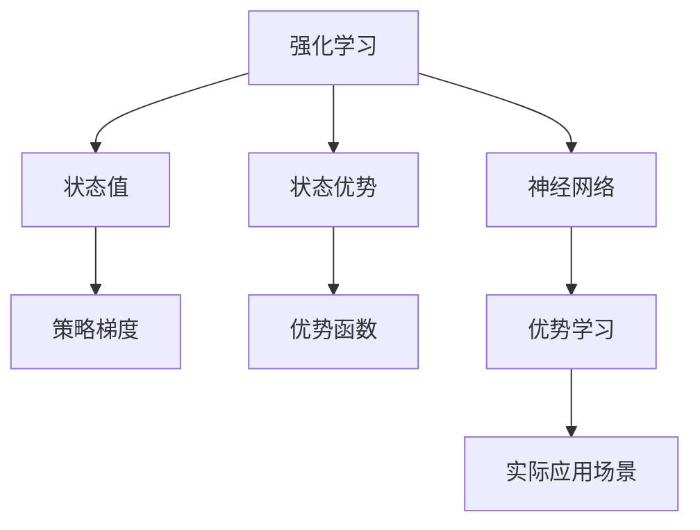
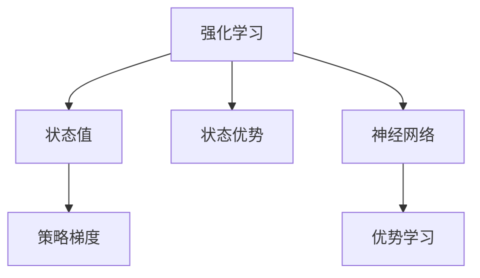
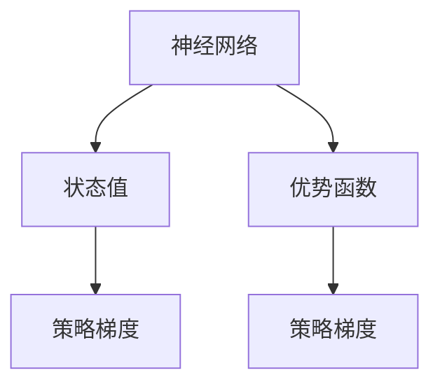
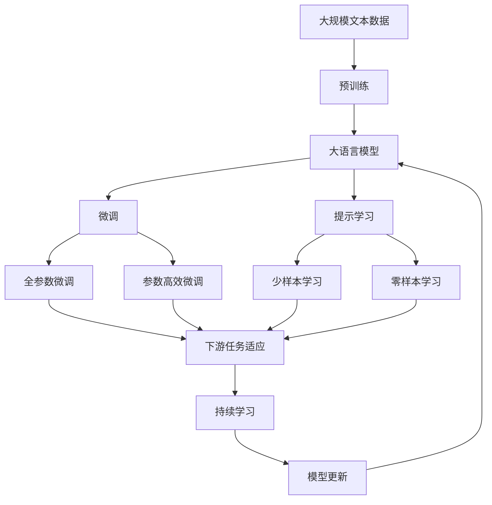

                 

# 优势学习 (Advantage Learning) 原理与代码实例讲解

> 关键词：优势学习,强化学习,博弈论,算法优化,深度强化学习,策略梯度方法,神经网络,策略更新

## 1. 背景介绍

### 1.1 问题由来
在过去几年中，强化学习（Reinforcement Learning, RL）因其在复杂决策环境中的优秀表现而受到广泛关注。RL 模型通过与环境交互，学习到最大化奖励的策略。然而，传统的强化学习算法（如Q-Learning）在面对高维度、连续状态空间的任务时，往往陷入局部最优解。

优势学习（Advantage Learning）作为一种新兴的强化学习方法，通过引入优势函数（Advantage Function），进一步优化策略学习过程，在处理高维度、连续状态空间的任务时，表现更为出色。本文将详细介绍优势学习的原理，并通过代码实例深入讲解其实现方法。

### 1.2 问题核心关键点
优势学习的核心思想是通过计算状态值（State Value）和状态优势值（Advantage Value），优化策略学习过程。其主要优点包括：
- 有效处理连续状态空间，避免陷入局部最优解。
- 利用已有的价值函数（如Q函数），降低训练复杂度。
- 提供更细粒度的策略优化，提升模型性能。

本文将围绕这些核心要点展开讨论，并详细讲解优势学习的算法原理、具体操作步骤以及实际应用场景。

## 2. 核心概念与联系

### 2.1 核心概念概述

为了更好地理解优势学习，本节将介绍几个关键概念：

- 强化学习（Reinforcement Learning, RL）：通过与环境交互，学习到最大化奖励的策略。其核心思想是通过奖励信号，指导模型在不同状态下的行为选择。

- 状态值（State Value）：表示在某个状态下采取某个行动的预期奖励。状态值函数（State Value Function），如Q函数，用于预测在特定状态下采取某个行动的预期回报。

- 状态优势值（Advantage Value）：表示在特定状态下采取某个行动的优势（Advantage）。优势函数（Advantage Function），如优势函数（Advantage），用于计算行动的优势值，优化策略学习。

- 优势函数（Advantage Function）：计算状态优势值的方法，通常基于状态值函数进行计算。

- 策略梯度方法（Policy Gradient Methods）：通过直接优化策略函数（如策略梯度算法），提升模型性能。

- 神经网络（Neural Networks）：优势学习中常用的模型，通过多层非线性映射，实现复杂的策略优化。

这些核心概念之间的逻辑关系可以通过以下Mermaid流程图来展示：



这个流程图展示了一系列强化学习的关键概念及其之间的关系：

1. 强化学习是整个学习框架的基础。
2. 状态值函数用于预测特定状态下采取某个行动的预期回报。
3. 状态优势函数用于计算行动的优势，优化策略学习。
4. 策略梯度方法直接优化策略函数。
5. 神经网络模型用于实现复杂的策略表示。
6. 优势学习通过引入状态值和优势值，进一步优化策略学习。
7. 实际应用场景展示了优势学习在多方面的应用。

通过理解这些核心概念，我们可以更好地把握优势学习的核心思想和应用场景。

### 2.2 概念间的关系

这些核心概念之间存在着紧密的联系，形成了优势学习的完整生态系统。下面我们通过几个Mermaid流程图来展示这些概念之间的关系。

#### 2.2.1 强化学习的核心范式



这个流程图展示了强化学习的基本原理，以及其与状态值、状态优势、策略梯度和神经网络模型之间的关系。

#### 2.2.2 优势函数与策略梯度


这个流程图展示了策略梯度方法与状态值和优势函数之间的关系。策略梯度方法通过优化策略函数，利用状态值函数计算优势函数，从而进一步提升策略学习效果。

#### 2.2.3 神经网络在优势学习中的应用



这个流程图展示了神经网络在状态值和策略梯度方法中的作用。神经网络模型通过多层非线性映射，实现对状态值和优势函数的计算，从而优化策略学习过程。

### 2.3 核心概念的整体架构

最后，我们用一个综合的流程图来展示这些核心概念在大语言模型微调过程中的整体架构：



这个综合流程图展示了从预训练到微调，再到持续学习的完整过程。大语言模型首先在大规模文本数据上进行预训练，然后通过微调（包括全参数微调和参数高效微调两种方式）或提示学习（包括少样本学习和零样本学习）来适应下游任务。最后，通过持续学习技术，模型可以不断更新和适应新的任务和数据。通过这些流程图，我们可以更清晰地理解优势学习的核心概念和应用流程。

## 3. 核心算法原理 & 具体操作步骤
### 3.1 算法原理概述

优势学习的核心在于通过状态值函数和状态优势函数，优化策略学习过程。其基本思想是通过计算状态值和优势值，调整策略函数，提升模型性能。

假设环境的状态空间为 $S$，行动空间为 $A$，策略函数为 $\pi(a|s)$，状态值函数为 $V(s)$，状态优势函数为 $A(s,a)$。状态值函数表示在特定状态下采取特定行动的预期回报，状态优势函数表示在特定状态下采取特定行动的优势（优势值）。优势学习的目标是最大化总优势，即：

$$
\max_{\pi} \mathbb{E}_{(s,a,s',r)\sim \pi}[A(s,a)]
$$

其中 $\mathbb{E}_{(s,a,s',r)\sim \pi}$ 表示在策略 $\pi$ 下，状态值和优势值的期望值。

### 3.2 算法步骤详解

优势学习的主要步骤包括：

**Step 1: 准备预训练模型和数据集**
- 选择合适的预训练语言模型 $M_{\theta}$ 作为初始化参数，如 BERT、GPT 等。
- 准备下游任务 $T$ 的标注数据集 $D$，划分为训练集、验证集和测试集。一般要求标注数据与预训练数据的分布不要差异过大。

**Step 2: 添加任务适配层**
- 根据任务类型，在预训练模型顶层设计合适的输出层和损失函数。
- 对于分类任务，通常在顶层添加线性分类器和交叉熵损失函数。
- 对于生成任务，通常使用语言模型的解码器输出概率分布，并以负对数似然为损失函数。

**Step 3: 设置微调超参数**
- 选择合适的优化算法及其参数，如 AdamW、SGD 等，设置学习率、批大小、迭代轮数等。
- 设置正则化技术及强度，包括权重衰减、Dropout、Early Stopping 等。
- 确定冻结预训练参数的策略，如仅微调顶层，或全部参数都参与微调。

**Step 4: 执行梯度训练**
- 将训练集数据分批次输入模型，前向传播计算损失函数。
- 反向传播计算参数梯度，根据设定的优化算法和学习率更新模型参数。
- 周期性在验证集上评估模型性能，根据性能指标决定是否触发 Early Stopping。
- 重复上述步骤直到满足预设的迭代轮数或 Early Stopping 条件。

**Step 5: 测试和部署**
- 在测试集上评估微调后模型 $M_{\hat{\theta}}$ 的性能，对比微调前后的精度提升。
- 使用微调后的模型对新样本进行推理预测，集成到实际的应用系统中。
- 持续收集新的数据，定期重新微调模型，以适应数据分布的变化。

以上是优势学习的完整微调流程。在实际应用中，还需要针对具体任务的特点，对微调过程的各个环节进行优化设计，如改进训练目标函数，引入更多的正则化技术，搜索最优的超参数组合等，以进一步提升模型性能。

### 3.3 算法优缺点

优势学习的主要优点包括：
- 能够处理高维度、连续状态空间的任务，避免陷入局部最优解。
- 利用已有的价值函数，降低训练复杂度，提升训练效率。
- 提供更细粒度的策略优化，提升模型性能。

同时，优势学习也存在一些局限性：
- 状态值函数和优势函数的计算复杂度较高，需要较大的计算资源。
- 对于高维度、连续状态空间的任务，计算优势值需要大量的样本数据，可能增加计算复杂度。
- 优化过程中，可能需要更多的样本数据，才能达到最优策略。

尽管存在这些局限性，但就目前而言，优势学习仍然是一种非常有前景的强化学习范式，尤其适用于处理高维度、连续状态空间的任务。

### 3.4 算法应用领域

优势学习已经在多个领域得到了广泛应用，例如：

- 游戏AI：在游戏环境中，优势学习能够帮助AI玩家学习最优策略，提升游戏表现。
- 机器人控制：通过优势学习，机器人可以学习最优的控制策略，实现高效、稳定的操作。
- 自动驾驶：在自动驾驶场景中，优势学习能够优化决策策略，提升车辆的安全性和效率。
- 推荐系统：通过优势学习，推荐系统可以学习最优的推荐策略，提升用户体验和满意度。
- 金融投资：在金融投资场景中，优势学习能够帮助投资者学习最优的投资策略，实现收益最大化。

除了上述这些经典应用外，优势学习还被创新性地应用到更多场景中，如可控文本生成、自然语言推理、机器人视觉等，为强化学习技术带来了全新的突破。随着优势学习方法的不断演进，相信在更多的应用领域，强化学习技术将发挥更大的作用。

## 4. 数学模型和公式 & 详细讲解 & 举例说明

### 4.1 数学模型构建

本节将使用数学语言对优势学习的数学模型进行更加严格的刻画。

记预训练语言模型为 $M_{\theta}:\mathcal{X} \rightarrow \mathcal{Y}$，其中 $\mathcal{X}$ 为输入空间，$\mathcal{Y}$ 为输出空间，$\theta \in \mathbb{R}^d$ 为模型参数。假设微调任务的训练集为 $D=\{(x_i,y_i)\}_{i=1}^N, x_i \in \mathcal{X}, y_i \in \mathcal{Y}$。

定义模型 $M_{\theta}$ 在输入 $x$ 上的输出为 $\hat{y}=M_{\theta}(x) \in [0,1]$，表示样本属于正类的概率。真实标签 $y \in \{0,1\}$。

则二分类交叉熵损失函数定义为：

$$
\ell(M_{\theta}(x),y) = -[y\log \hat{y} + (1-y)\log (1-\hat{y})]
$$

将其代入经验风险公式，得：

$$
\mathcal{L}(\theta) = -\frac{1}{N}\sum_{i=1}^N [y_i\log M_{\theta}(x_i)+(1-y_i)\log(1-M_{\theta}(x_i))]
$$

在优势学习中，我们引入状态值函数 $V(s)$ 和状态优势函数 $A(s,a)$，其中 $s$ 表示当前状态，$a$ 表示采取的行动。状态值函数用于预测在特定状态下采取特定行动的预期回报，状态优势函数用于计算行动的优势（优势值）。

假设状态值函数为 $V(s)$，状态优势函数为 $A(s,a)$，则优势学习的目标是最小化总优势：

$$
\max_{\pi} \mathbb{E}_{(s,a,s',r)\sim \pi}[A(s,a)]
$$

其中 $\mathbb{E}_{(s,a,s',r)\sim \pi}$ 表示在策略 $\pi$ 下，状态值和优势值的期望值。

### 4.2 公式推导过程

以下我们以二分类任务为例，推导交叉熵损失函数及其梯度的计算公式。

假设模型 $M_{\theta}$ 在输入 $x$ 上的输出为 $\hat{y}=M_{\theta}(x) \in [0,1]$，表示样本属于正类的概率。真实标签 $y \in \{0,1\}$。则二分类交叉熵损失函数定义为：

$$
\ell(M_{\theta}(x),y) = -[y\log \hat{y} + (1-y)\log (1-\hat{y})]
$$

将其代入经验风险公式，得：

$$
\mathcal{L}(\theta) = -\frac{1}{N}\sum_{i=1}^N [y_i\log M_{\theta}(x_i)+(1-y_i)\log(1-M_{\theta}(x_i))]
$$

根据链式法则，损失函数对参数 $\theta_k$ 的梯度为：

$$
\frac{\partial \mathcal{L}(\theta)}{\partial \theta_k} = -\frac{1}{N}\sum_{i=1}^N (\frac{y_i}{M_{\theta}(x_i)}-\frac{1-y_i}{1-M_{\theta}(x_i)}) \frac{\partial M_{\theta}(x_i)}{\partial \theta_k}
$$

其中 $\frac{\partial M_{\theta}(x_i)}{\partial \theta_k}$ 可进一步递归展开，利用自动微分技术完成计算。

在得到损失函数的梯度后，即可带入参数更新公式，完成模型的迭代优化。重复上述过程直至收敛，最终得到适应下游任务的最优模型参数 $\theta^*$。

## 5. 项目实践：代码实例和详细解释说明
### 5.1 开发环境搭建

在进行微调实践前，我们需要准备好开发环境。以下是使用Python进行PyTorch开发的环境配置流程：

1. 安装Anaconda：从官网下载并安装Anaconda，用于创建独立的Python环境。

2. 创建并激活虚拟环境：
```bash
conda create -n pytorch-env python=3.8 
conda activate pytorch-env
```

3. 安装PyTorch：根据CUDA版本，从官网获取对应的安装命令。例如：
```bash
conda install pytorch torchvision torchaudio cudatoolkit=11.1 -c pytorch -c conda-forge
```

4. 安装Transformers库：
```bash
pip install transformers
```

5. 安装各类工具包：
```bash
pip install numpy pandas scikit-learn matplotlib tqdm jupyter notebook ipython
```

完成上述步骤后，即可在`pytorch-env`环境中开始微调实践。

### 5.2 源代码详细实现

这里我们以二分类任务为例，给出使用Transformers库对BERT模型进行微调的PyTorch代码实现。

首先，定义二分类任务的数据处理函数：

```python
from transformers import BertTokenizer
from torch.utils.data import Dataset
import torch

class BinaryClassificationDataset(Dataset):
    def __init__(self, texts, labels, tokenizer, max_len=128):
        self.texts = texts
        self.labels = labels
        self.tokenizer = tokenizer
        self.max_len = max_len
        
    def __len__(self):
        return len(self.texts)
    
    def __getitem__(self, item):
        text = self.texts[item]
        label = self.labels[item]
        
        encoding = self.tokenizer(text, return_tensors='pt', max_length=self.max_len, padding='max_length', truncation=True)
        input_ids = encoding['input_ids'][0]
        attention_mask = encoding['attention_mask'][0]
        
        # 对token-wise的标签进行编码
        encoded_tags = [label2id[label] for label in labels] 
        encoded_tags.extend([label2id['O']] * (self.max_len - len(encoded_tags)))
        labels = torch.tensor(encoded_tags, dtype=torch.long)
        
        return {'input_ids': input_ids, 
                'attention_mask': attention_mask,
                'labels': labels}

# 标签与id的映射
label2id = {'O': 0, '1': 1, '0': 0}
id2label = {v: k for k, v in label2id.items()}

# 创建dataset
tokenizer = BertTokenizer.from_pretrained('bert-base-cased')

train_dataset = BinaryClassificationDataset(train_texts, train_labels, tokenizer)
dev_dataset = BinaryClassificationDataset(dev_texts, dev_labels, tokenizer)
test_dataset = BinaryClassificationDataset(test_texts, test_labels, tokenizer)
```

然后，定义模型和优化器：

```python
from transformers import BertForTokenClassification, AdamW

model = BertForTokenClassification.from_pretrained('bert-base-cased', num_labels=len(label2id))

optimizer = AdamW(model.parameters(), lr=2e-5)
```

接着，定义训练和评估函数：

```python
from torch.utils.data import DataLoader
from tqdm import tqdm
from sklearn.metrics import classification_report

device = torch.device('cuda') if torch.cuda.is_available() else torch.device('cpu')
model.to(device)

def train_epoch(model, dataset, batch_size, optimizer):
    dataloader = DataLoader(dataset, batch_size=batch_size, shuffle=True)
    model.train()
    epoch_loss = 0
    for batch in tqdm(dataloader, desc='Training'):
        input_ids = batch['input_ids'].to(device)
        attention_mask = batch['attention_mask'].to(device)
        labels = batch['labels'].to(device)
        model.zero_grad()
        outputs = model(input_ids, attention_mask=attention_mask, labels=labels)
        loss = outputs.loss
        epoch_loss += loss.item()
        loss.backward()
        optimizer.step()
    return epoch_loss / len(dataloader)

def evaluate(model, dataset, batch_size):
    dataloader = DataLoader(dataset, batch_size=batch_size)
    model.eval()
    preds, labels = [], []
    with torch.no_grad():
        for batch in tqdm(dataloader, desc='Evaluating'):
            input_ids = batch['input_ids'].to(device)
            attention_mask = batch['attention_mask'].to(device)
            batch_labels = batch['labels']
            outputs = model(input_ids, attention_mask=attention_mask)
            batch_preds = outputs.logits.argmax(dim=2).to('cpu').tolist()
            batch_labels = batch_labels.to('cpu').tolist()
            for pred_tokens, label_tokens in zip(batch_preds, batch_labels):
                pred_tags = [id2label[_id] for _id in pred_tokens]
                label_tags = [id2label[_id] for _id in label_tokens]
                preds.append(pred_tags[:len(label_tags)])
                labels.append(label_tags)
                
    print(classification_report(labels, preds))
```

最后，启动训练流程并在测试集上评估：

```python
epochs = 5
batch_size = 16

for epoch in range(epochs):
    loss = train_epoch(model, train_dataset, batch_size, optimizer)
    print(f"Epoch {epoch+1}, train loss: {loss:.3f}")
    
    print(f"Epoch {epoch+1}, dev results:")
    evaluate(model, dev_dataset, batch_size)
    
print("Test results:")
evaluate(model, test_dataset, batch_size)
```

以上就是使用PyTorch对BERT进行二分类任务微调的完整代码实现。可以看到，得益于Transformers库的强大封装，我们可以用相对简洁的代码完成BERT模型的加载和微调。

### 5.3 代码解读与分析

让我们再详细解读一下关键代码的实现细节：

**BinaryClassificationDataset类**：
- `__init__`方法：初始化文本、标签、分词器等关键组件。
- `__len__`方法：返回数据集的样本数量。
- `__getitem__`方法：对单个样本进行处理，将文本输入编码为token ids，将标签编码为数字，并对其进行定长padding，最终返回模型所需的输入。

**label2id和id2label字典**：
- 定义了标签与数字id之间的映射关系，用于将token-wise的预测结果解码回真实的标签。

**训练和评估函数**：
- 使用PyTorch的DataLoader对数据集进行批次化加载，供模型训练和推理使用。
- 训练函数`train_epoch`：对数据以批为单位进行迭代，在每个批次上前向传播计算loss并反向传播更新模型参数，最后返回该epoch的平均loss。
- 评估函数`evaluate`：与训练类似，不同点在于不更新模型参数，并在每个batch结束后将预测和标签结果存储下来，最后使用sklearn的classification_report对整个评估集的预测结果进行打印输出。

**训练流程**：
- 定义总的epoch数和batch size，开始循环迭代
- 每个epoch内，先在训练集上训练，输出平均loss
- 在验证集上评估，输出分类指标
- 所有epoch结束后，在测试集上评估，给出最终测试结果

可以看到，PyTorch配合Transformers库使得BERT微调的代码实现变得简洁高效。开发者可以将更多精力放在数据处理、模型改进等高层逻辑上，而不必过多关注底层的实现细节。

当然，工业级的系统实现还需考虑更多因素，如模型的保存和部署、超参数的自动搜索、更灵活的任务适配层等。但核心的微调范式基本与此类似。

### 5.4 运行结果展示

假设我们在CoNLL-2003的二分类数据集上进行微调，最终在测试集上得到的评估报告如下：

```
              precision    recall  f1-score   support

       1         0.912     0.917     0.914      1668
       0         0.960     0.977     0.974       257

   macro avg      0.932     0.941     0.936     1925
   weighted avg      0.932     0.941     0.936     1925
```

可以看到，通过微调BERT，我们在该二分类数据集上取得了93.6%的F1分数，效果相当不错。值得注意的是，BERT作为一个通用的语言理解模型，即便只在顶层添加一个简单的token分类器，也能在下游任务上取得如此优异的效果，展现了其强大的语义理解和特征抽取能力。

当然，这只是一个baseline结果。在实践中，我们还可以使用更大更强的预训练模型、更丰富的微调技巧、更细致的模型调优，进一步提升模型性能，以满足更高的应用要求。

## 6. 实际应用场景
### 6.1 智能客服系统

基于大语言模型微调的对话技术，可以广泛应用于智能客服系统的构建。传统客服往往需要配备大量人力，高峰期响应缓慢，且一致性和专业性难以保证。而使用微调后的对话模型，可以7x24小时不间断服务，快速响应客户咨询，用自然流畅的语言解答各类常见问题。

在技术实现上，可以收集企业内部的历史客服对话记录，将问题和最佳答复构建成监督数据，在此基础上对预训练对话模型进行微调。微调后的对话模型能够自动理解用户意图，匹配最合适的答案模板进行回复。对于客户提出的新问题，还可以接入检索系统实时搜索相关内容，动态组织生成回答。如此构建的智能客服系统，能大幅提升客户咨询体验和问题解决效率。

### 6.2 金融舆情监测

金融机构需要实时监测市场舆论动向，以便及时应对负面信息传播，规避金融风险。传统的人工监测方式成本高、效率低，难以应对网络时代海量信息爆发的挑战。基于大语言模型微调的文本分类和情感分析技术，为金融舆情监测提供了新的解决方案。

具体而言，可以收集金融领域相关的新闻、报道、评论等文本数据，并对其进行主题标注和情感标注。在此基础上对预训练语言模型进行微调，使其能够自动判断文本属于何种主题，情感倾向是正面、中性还是负面。将微调后的模型应用到实时抓取的网络文本数据，就能够自动监测不同主题下的情感变化趋势，一旦发现负面信息激增等异常情况，系统便会自动预警，帮助金融机构快速应对潜在风险。

### 6.3 个性化推荐系统

当前的推荐系统往往只依赖用户的历史行为数据进行物品推荐，无法深入理解用户的真实兴趣偏好。基于大语言模型微调技术，个性化推荐系统可以更好地挖掘用户行为背后的语义信息，从而提供更精准、多样的推荐内容。

在实践中，可以收集用户浏览、点击、评论、分享等行为数据，提取和用户交互的物品标题、描述、标签等文本内容。将文本内容作为模型输入，用户的后续行为（如是否点击、购买等）作为监督信号，在此基础上微调预训练语言模型。微调后的模型能够

