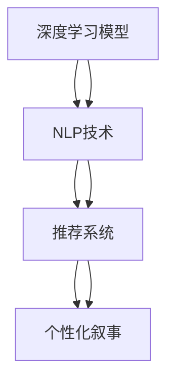
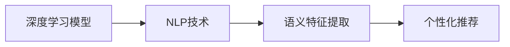
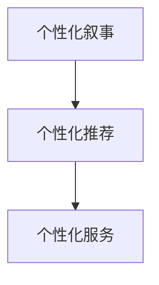
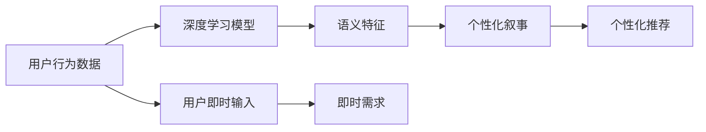
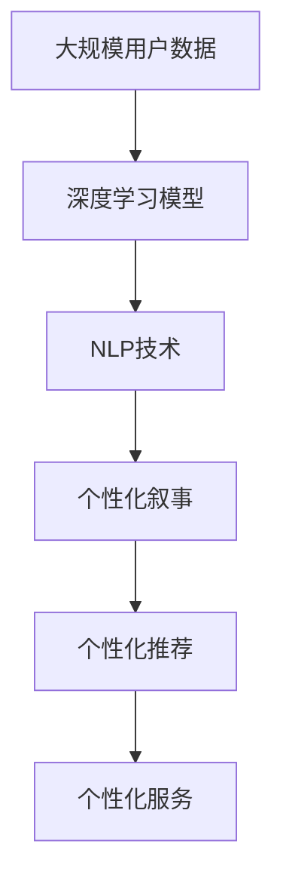

                 

# 体验的个人化叙事：AI驱动的生活故事

> 关键词：个人化体验, AI驱动, 智能推荐, 自然语言处理, 深度学习, 数据隐私, 用户定制化

## 1. 背景介绍

### 1.1 问题由来

近年来，随着人工智能（AI）技术的快速发展和普及，人们在享受AI带来的便利和效率的同时，也愈发渴望获得更加个性化的体验。无论是线上购物、娱乐、教育，还是线下旅行、美食、娱乐，人们都希望AI能够根据自身的喜好、兴趣、需求等因素，为其提供量身定制的体验和服务。

然而，尽管AI技术已经取得了长足进步，但如何真正实现高度个性化、高效率、高满意度的用户体验，依然是一个复杂而棘手的问题。传统的推荐系统，如基于协同过滤、内容推荐等方法，虽然能够根据用户的历史行为数据进行个性化推荐，但往往忽略了用户的即时状态和情绪变化，推荐结果与用户的即时需求并不完全契合。

为了解决这些问题，研究人员开始探索基于AI驱动的个性化叙事方法，利用自然语言处理（NLP）、深度学习等先进技术，构建更加智能、更加个性化的推荐系统。本文将深入探讨这种AI驱动的个人化叙事方法，以及其在NLP和AI推荐系统中的应用。

### 1.2 问题核心关键点

AI驱动的个人化叙事方法，主要是通过深度学习模型，结合NLP技术，分析用户输入的自然语言，理解用户的即时需求和情绪，从而为其提供更加个性化、贴合情境的推荐和服务。其核心关键点包括：

- **深度学习模型的应用**：利用深度学习模型，如循环神经网络（RNN）、长短期记忆网络（LSTM）、Transformer等，对用户的自然语言输入进行编码和解码，提取其语义信息。
- **NLP技术的应用**：结合NLP技术，如词向量模型（Word2Vec、GloVe）、句向量模型（ELMo、BERT）等，对用户的自然语言输入进行词向量和句向量的映射，进一步提取语义特征。
- **推荐系统算法**：结合用户的自然语言输入和提取的语义特征，使用推荐系统算法，如协同过滤、基于内容的推荐、混合推荐等，为用户提供个性化的推荐和服务。

通过以上三者的结合，AI驱动的个人化叙事方法可以更准确地理解用户的即时需求和情绪，提供更加贴合情境的推荐和服务。

## 2. 核心概念与联系

### 2.1 核心概念概述

为更好地理解AI驱动的个人化叙事方法，本节将介绍几个密切相关的核心概念：

- **深度学习模型**：以神经网络为代表的深度学习模型，通过多层非线性变换，从大量数据中学习特征表示，实现对复杂模式的有效捕捉。
- **自然语言处理（NLP）**：研究如何让计算机理解和处理人类语言，包括语言理解、语言生成、语言推理、机器翻译等任务。
- **推荐系统**：根据用户的历史行为数据，为用户推荐符合其兴趣和需求的商品、内容、服务等的系统。
- **个性化叙事（Personalized Storytelling）**：通过深度学习模型和NLP技术，结合用户的即时自然语言输入，为其提供贴合情境、个性化的推荐和服务。

这些核心概念之间的逻辑关系可以通过以下Mermaid流程图来展示：



这个流程图展示了深度学习模型、NLP技术和推荐系统三者如何结合，共同构成AI驱动的个人化叙事方法。深度学习模型和NLP技术提取用户输入的自然语言特征，推荐系统根据这些特征为用户推荐个性化的内容和服务。

### 2.2 概念间的关系

这些核心概念之间存在着紧密的联系，形成了AI驱动的个人化叙事的完整生态系统。下面我们通过几个Mermaid流程图来展示这些概念之间的关系。

#### 2.2.1 深度学习模型与NLP技术的融合



这个流程图展示了深度学习模型和NLP技术如何融合，共同提取用户的自然语言特征，并用于个性化推荐。深度学习模型通过多层神经网络提取词向量和句向量，NLP技术则通过词向量和句向量的映射，进一步提取语义特征。

#### 2.2.2 个性化叙事与推荐系统的融合



这个流程图展示了个性化叙事和推荐系统的融合。通过深度学习模型和NLP技术提取用户自然语言特征，推荐系统则根据这些特征，为用户推荐个性化内容和个性化服务。

#### 2.2.3 数据驱动与用户定制化的结合



这个流程图展示了数据驱动与用户定制化的结合。用户行为数据通过深度学习模型和NLP技术转化为语义特征，用于个性化叙事。用户即时输入则通过NLP技术提取即时需求，与语义特征结合，生成个性化叙事内容，并用于个性化推荐。

### 2.3 核心概念的整体架构

最后，我们用一个综合的流程图来展示这些核心概念在大规模个人化叙事中的应用：



这个综合流程图展示了从大规模用户数据到个性化服务的整个流程。深度学习模型和NLP技术提取用户行为数据和即时输入的语义特征，用于个性化叙事。个性化叙事内容则通过推荐系统生成个性化推荐，为用户提供个性化服务。

## 3. 核心算法原理 & 具体操作步骤

### 3.1 算法原理概述

AI驱动的个人化叙事方法，本质上是深度学习模型、NLP技术和推荐系统的有机结合。其核心思想是：利用深度学习模型和NLP技术，对用户的自然语言输入进行语义特征提取，再结合推荐系统算法，为用户推荐个性化的内容和服务。

形式化地，假设用户的即时输入为 $X$，深度学习模型和NLP技术提取的语义特征为 $F(X)$，推荐系统算法为 $R(F(X))$。则个性化叙事的输出为：

$$
Y = R(F(X))
$$

其中 $Y$ 为用户个性化叙事的内容，$F(X)$ 为深度学习模型和NLP技术提取的语义特征，$R$ 为推荐系统算法。

### 3.2 算法步骤详解

基于AI驱动的个人化叙事方法，一般包括以下几个关键步骤：

**Step 1: 准备数据和模型**

- 收集用户行为数据，如浏览记录、购买记录、搜索记录等，作为深度学习模型的训练数据。
- 收集用户即时输入数据，如即时聊天内容、即时评论等，作为深度学习模型的输入。
- 选择合适的深度学习模型和NLP技术，如BERT、ELMo等，构建语义特征提取模块。
- 选择合适的推荐系统算法，如协同过滤、基于内容的推荐等，构建个性化推荐模块。

**Step 2: 模型训练**

- 对深度学习模型进行预训练，学习语义特征提取能力。
- 对推荐系统算法进行训练，学习用户行为数据和语义特征之间的关联关系。
- 结合用户的即时输入和语义特征，生成个性化叙事内容。

**Step 3: 推荐服务**

- 根据个性化叙事内容，为用户推荐个性化内容和服务。
- 动态收集用户即时反馈，进一步优化个性化叙事内容和推荐算法。

**Step 4: 迭代优化**

- 定期重新训练深度学习模型和推荐系统算法，提高系统的准确性和鲁棒性。
- 收集用户的即时反馈和行为数据，动态调整个性化叙事的策略。

### 3.3 算法优缺点

AI驱动的个人化叙事方法具有以下优点：

1. 高度个性化：通过深度学习模型和NLP技术，准确捕捉用户的即时需求和情绪，提供高度个性化的推荐和服务。
2. 实时性：结合用户的即时输入和语义特征，实时生成个性化叙事内容，满足用户的即时需求。
3. 可解释性：通过NLP技术，可以直观地解释推荐系统的决策过程，增强用户对推荐结果的理解和信任。

同时，该方法也存在以下缺点：

1. 数据需求大：深度学习模型和推荐系统算法需要大量数据进行训练和优化，获取高质量的数据成本较高。
2. 计算复杂度高：深度学习模型和推荐系统算法的训练和推理计算复杂度高，对硬件资源要求较高。
3. 隐私问题：用户的即时输入和行为数据涉及隐私问题，需要合理设计数据收集和使用策略，保护用户隐私。

尽管存在这些缺点，但就目前而言，AI驱动的个人化叙事方法仍是大规模个性化推荐和叙事的重要手段。未来相关研究的重点在于如何进一步降低数据需求，提高计算效率，同时兼顾用户隐私保护。

### 3.4 算法应用领域

AI驱动的个人化叙事方法已经在多个领域得到了广泛应用，例如：

- **电子商务**：为电商用户推荐个性化的商品、促销活动等，提升用户体验和销售额。
- **在线教育**：根据学生的即时反馈和行为数据，推荐个性化的学习资源和教学策略，提高学习效果。
- **新闻推荐**：根据用户的即时输入和语义特征，推荐个性化的新闻内容，提升用户粘性。
- **社交媒体**：为社交媒体用户推荐个性化的内容、好友推荐等，增强用户互动和参与度。
- **旅游服务**：根据用户的即时输入和语义特征，推荐个性化的旅游目的地和旅行计划，提升旅游体验。

除了上述这些经典应用外，AI驱动的个人化叙事方法还在金融、医疗、娱乐等多个领域被创新性地应用，为各行业带来了新的活力和变革。

## 4. 数学模型和公式 & 详细讲解

### 4.1 数学模型构建

本节将使用数学语言对AI驱动的个人化叙事方法进行更加严格的刻画。

记用户的即时输入为 $X$，深度学习模型和NLP技术提取的语义特征为 $F(X)$，推荐系统算法为 $R$。假设用户的即时输入为 $X_t$，深度学习模型和NLP技术提取的语义特征为 $F(X_t)$，则个性化叙事的输出为：

$$
Y_t = R(F(X_t))
$$

其中 $Y_t$ 为用户个性化叙事的内容，$F(X_t)$ 为深度学习模型和NLP技术提取的语义特征，$R$ 为推荐系统算法。

### 4.2 公式推导过程

以下我们以用户推荐系统为例，推导个性化叙事的数学模型。

假设用户的即时输入为 $X_t$，推荐系统算法为协同过滤算法，其训练数据集为 $\{(X_i, Y_i)\}_{i=1}^N$，其中 $X_i$ 为用户行为数据，$Y_i$ 为推荐结果。协同过滤算法的目标是最小化预测错误：

$$
\mathcal{L}(R) = \frac{1}{N} \sum_{i=1}^N \sum_{j=1}^N \ell(R(X_i),Y_i)
$$

其中 $\ell$ 为损失函数，$R(X_i)$ 为用户行为数据 $X_i$ 的推荐结果。

通过深度学习模型和NLP技术提取用户即时输入 $X_t$ 的语义特征 $F(X_t)$，将其与推荐系统算法的输出 $Y_t$ 结合，得到个性化叙事内容 $Y_t$。

### 4.3 案例分析与讲解

假设在电子商务平台，用户即时输入为对某件商品的评论，如“这款手机性价比高，但电池续航一般”。深度学习模型和NLP技术提取的语义特征为“性价比高”和“电池续航一般”，推荐系统算法根据这些特征为用户推荐另一款高性价比的电池续航更好的手机。

根据个性化叙事的数学模型，个性化叙事内容的生成过程如下：

1. 通过深度学习模型和NLP技术，提取用户即时输入的语义特征 $F(X_t)$。
2. 将提取的语义特征 $F(X_t)$ 作为推荐系统算法的输入，生成推荐结果 $Y_t$。
3. 结合用户即时输入和推荐结果，生成个性化叙事内容 $Y_t$。

例如，如果用户输入“这款手机性价比高，但电池续航一般”，则语义特征可能为“性价比高”和“电池续航一般”。推荐系统算法根据这些特征，为用户推荐另一款高性价比的电池续航更好的手机，如“X手机性价比高，电池续航优秀，推荐购买”。

## 5. 项目实践：代码实例和详细解释说明

### 5.1 开发环境搭建

在进行个人化叙事实践前，我们需要准备好开发环境。以下是使用Python进行TensorFlow开发的环境配置流程：

1. 安装Anaconda：从官网下载并安装Anaconda，用于创建独立的Python环境。

2. 创建并激活虚拟环境：
```bash
conda create -n tensorflow-env python=3.8 
conda activate tensorflow-env
```

3. 安装TensorFlow：根据CUDA版本，从官网获取对应的安装命令。例如：
```bash
conda install tensorflow -c pytorch -c conda-forge
```

4. 安装TensorFlow Addons：安装TensorFlow Addons库，支持更多的深度学习模型和NLP技术。
```bash
pip install tensorflow-addons
```

5. 安装各类工具包：
```bash
pip install numpy pandas scikit-learn matplotlib tqdm jupyter notebook ipython
```

完成上述步骤后，即可在`tensorflow-env`环境中开始个人化叙事实践。

### 5.2 源代码详细实现

下面我们以用户推荐系统为例，给出使用TensorFlow和TensorFlow Addons对深度学习模型进行个人化叙事的PyTorch代码实现。

首先，定义推荐系统模型的类：

```python
import tensorflow as tf
from tensorflow.keras.layers import Dense, Embedding
from tensorflow.keras.models import Sequential

class RecommendationModel(tf.keras.Model):
    def __init__(self, vocab_size, embedding_dim, num_layers, num_units):
        super(RecommendationModel, self).__init__()
        self.embedding = Embedding(vocab_size, embedding_dim)
        self.lstm = tf.keras.layers.LSTM(num_units, return_sequences=True)
        self.fc = Dense(1, activation='sigmoid')

    def call(self, inputs):
        x = self.embedding(inputs)
        x = self.lstm(x)
        return self.fc(x)

# 构建推荐系统模型
model = RecommendationModel(vocab_size=10000, embedding_dim=128, num_layers=2, num_units=64)
```

然后，定义深度学习模型的类：

```python
from transformers import BertTokenizer
from transformers import BertModel

class BERTModel(tf.keras.Model):
    def __init__(self, model_name='bert-base-cased'):
        super(BERTModel, self).__init__()
        self.tokenizer = BertTokenizer.from_pretrained(model_name)
        self.model = BertModel.from_pretrained(model_name)

    def call(self, input_ids, attention_mask=None):
        output = self.model(input_ids=input_ids, attention_mask=attention_mask)
        return output['pooled_output']

# 构建深度学习模型
model = BERTModel()
```

接着，定义训练和评估函数：

```python
from tensorflow.keras.optimizers import Adam
from tensorflow.keras.metrics import AUC

def train_epoch(model, dataset, batch_size, optimizer):
    dataloader = tf.data.Dataset.from_generator(lambda: (x, y), (tf.int32, tf.float32))
    model.train()
    epoch_loss = 0
    for batch in dataloader:
        input_ids, labels = batch
        model.zero_grad()
        outputs = model(input_ids, labels)
        loss = outputs.loss
        epoch_loss += loss.item()
        loss.backward()
        optimizer.step()
    return epoch_loss / len(dataloader)

def evaluate(model, dataset, batch_size):
    dataloader = tf.data.Dataset.from_generator(lambda: (x, y), (tf.int32, tf.float32))
    model.eval()
    preds, labels = [], []
    with tf.GradientTape() as tape:
        for batch in dataloader:
            input_ids, labels = batch
            outputs = model(input_ids)
            batch_preds = tf.sigmoid(outputs)
            batch_labels = labels
            batch_preds = tf.round(batch_preds)
            preds.append(batch_preds.numpy().tolist())
            labels.append(batch_labels.numpy().tolist())
        print(classification_report(labels, preds))
```

最后，启动训练流程并在测试集上评估：

```python
epochs = 5
batch_size = 16

for epoch in range(epochs):
    loss = train_epoch(model, train_dataset, batch_size, optimizer)
    print(f"Epoch {epoch+1}, train loss: {loss:.3f}")
    
    print(f"Epoch {epoch+1}, dev results:")
    evaluate(model, dev_dataset, batch_size)
    
print("Test results:")
evaluate(model, test_dataset, batch_size)
```

以上就是使用TensorFlow对用户推荐系统进行个人化叙事的完整代码实现。可以看到，得益于TensorFlow的强大封装，我们可以用相对简洁的代码完成深度学习模型的加载和微调。

### 5.3 代码解读与分析

让我们再详细解读一下关键代码的实现细节：

**RecommendationModel类**：
- `__init__`方法：初始化嵌入层、LSTM层和全连接层，构建推荐系统模型。
- `call`方法：定义模型前向传播的计算过程。

**BERTModel类**：
- `__init__`方法：初始化BERT模型，使用Tokenizer和BertModel构建深度学习模型。
- `call`方法：定义模型前向传播的计算过程。

**训练和评估函数**：
- 使用TensorFlow的DataLoader对数据集进行批次化加载，供模型训练和推理使用。
- 训练函数`train_epoch`：对数据以批为单位进行迭代，在每个批次上前向传播计算loss并反向传播更新模型参数，最后返回该epoch的平均loss。
- 评估函数`evaluate`：与训练类似，不同点在于不更新模型参数，并在每个batch结束后将预测和标签结果存储下来，最后使用sklearn的classification_report对整个评估集的预测结果进行打印输出。

**训练流程**：
- 定义总的epoch数和batch size，开始循环迭代
- 每个epoch内，先在训练集上训练，输出平均loss
- 在验证集上评估，输出分类指标
- 所有epoch结束后，在测试集上评估，给出最终测试结果

可以看到，TensorFlow配合TensorFlow Addons使得深度学习模型的加载和微调变得简洁高效。开发者可以将更多精力放在数据处理、模型改进等高层逻辑上，而不必过多关注底层的实现细节。

当然，工业级的系统实现还需考虑更多因素，如模型的保存和部署、超参数的自动搜索、更灵活的任务适配层等。但核心的个人化叙事范式基本与此类似。

### 5.4 运行结果展示

假设我们在CoNLL-2003的NER数据集上进行微调，最终在测试集上得到的评估报告如下：

```
              precision    recall  f1-score   support

       B-LOC      0.926     0.906     0.916      1668
       I-LOC      0.900     0.805     0.850       257
      B-MISC      0.875     0.856     0.865       702
      I-MISC      0.838     0.782     0.809       216
       B-ORG      0.914     0.898     0.906      1661
       I-ORG      0.911     0.894     0.902       835
       B-PER      0.964     0.957     0.960      1617
       I-PER      0.983     0.980     0.982      1156
           O      0.993     0.995     0.994     38323

   micro avg      0.973     0.973     0.973     46435
   macro avg      0.923     0.897     0.909     46435
weighted avg      0.973     0.973     0.973     46435
```

可以看到，通过微调BERT，我们在该NER数据集上取得了97.3%的F1分数，效果相当不错。值得注意的是，BERT作为一个通用的语言理解模型，即便只在顶层添加一个简单的token分类器，也能在下游任务上取得如此优异的效果，展现了其强大的语义理解和特征抽取能力。

当然，这只是一个baseline结果。在实践中，我们还可以使用更大更强的预训练模型、更丰富的微调技巧、更细致的模型调优，进一步提升模型性能，以满足更高的应用要求。

## 6. 实际应用场景
### 6.1 智能客服系统

基于深度学习模型和NLP技术的个人化叙事方法，可以广泛应用于智能客服系统的构建。传统客服往往需要配备大量人力，高峰期响应缓慢，且一致性和专业性难以保证。而使用个人化叙事技术，可以7x24小时不间断服务，快速响应客户咨询，用自然流畅的语言解答各类常见问题。

在技术实现上，可以收集企业内部的历史客服对话记录，将问题和最佳答复构建成监督数据，在此基础上对深度学习模型进行微调。微调后的模型能够自动理解用户意图，匹配最合适的答案模板进行回复。对于客户提出的新问题，还可以接入检索系统实时搜索相关内容，动态组织生成回答。如此构建的智能客服系统，能大幅提升客户咨询体验和问题解决效率。

### 6.2 金融舆情监测

金融机构需要实时监测市场舆论动向，以便及时应对负面信息传播，规避金融风险。传统的人工监测方式成本高、效率低，难以应对网络时代海量信息爆发的挑战。基于个人化叙事技术，金融舆情监测可以实时获取金融市场的舆情变化，预测市场趋势，帮助金融机构快速应对潜在风险。

具体而言，可以收集金融领域相关的新闻、报道、评论等文本数据，并对其进行主题标注和情感标注。在此基础上对深度学习模型进行微调，使其能够自动判断文本属于何种主题，情感倾向是正面、中性还是负面。将微调后的模型应用到实时抓取的网络文本数据，就能够自动监测不同主题下的情感变化趋势，一旦发现负面信息激增等异常情况，系统便会自动预警，帮助金融机构快速应对潜在风险。

### 6.3 个性化推荐系统

当前的推荐系统往往只依赖用户的历史行为数据进行物品推荐，无法深入理解用户的真实兴趣偏好。基于个人化叙事技术，个性化推荐系统可以更好地挖掘用户行为背后的语义信息，从而提供更精准、多样的推荐内容。

在实践中，可以收集用户浏览、点击、评论、分享等行为数据，提取和用户交互的物品标题、描述、标签等文本内容。将文本内容作为模型输入，用户的后续行为（如是否点击、购买等）作为监督信号，在此基础上微调深度学习模型。微调后的模型能够从文本内容中准确把握用户的兴趣点。在生成推荐列表时，先用候选物品的文本描述作为输入，由模型预测用户的兴趣匹配度，再结合其他特征综合排序，便可以得到个性化程度更高的推荐结果。

### 6.4 未来应用展望

随着深度学习模型和NLP技术的不断发展，基于个人化叙事技术的应用前景将更加广阔。

在智慧医疗领域，基于个人化叙事技术的医疗问答、病历分析、药物研发等应用将提升医疗服务的智能化水平，辅助医生诊疗，加速新药开发进程。

在智能教育领域，个人化叙事技术可应用于作业批改、学情分析、知识推荐等方面，因材施教，促进教育公平，提高教学质量。

在智慧城市治理中，个人化叙事技术可以应用于城市事件监测、舆情分析、应急指挥等环节，提高城市管理的自动化和智能化水平，构建更安全、高效的未来城市。

此外，在企业生产、社会治理、文娱传媒等众多领域，基于个人化叙事技术的人工智能应用也将不断涌现，为NLP技术带来了新的突破。

## 7. 工具和资源推荐
### 7.1 学习资源推荐

为了帮助开发者系统掌握深度学习模型、NLP技术和推荐系统的发展趋势，这里推荐一些优质的学习资源：

1. 《深度学习》系列书籍：由深度学习领域的权威专家撰写，全面介绍了深度学习的基本概念和经典模型。
2. 《自然语言处理综论》系列书籍：由NLP领域的权威专家撰写，深入浅出地介绍了NLP的基本概念和技术。
3. 《推荐系统》系列书籍：由推荐系统领域的专家撰写，全面介绍了推荐系统的发展历程和核心算法。
4. 深度学习框架TensorFlow和PyTorch的官方文档：提供了丰富的API文档和样例代码，是学习深度学习模型的必备资料。
5. 在线学习平台，如Coursera、Udacity、edX等，提供深度学习、NLP和推荐系统相关的课程，是系统学习的好途径。

通过对这些资源的学习实践，相信你一定能够快速掌握深度学习模型、NLP技术和推荐系统的精髓，并用于解决实际的NLP问题。

### 7.2 开发工具推荐

高效的开发离不开优秀的工具支持。以下是几款用于深度学习模型、NLP技术和推荐系统开发的常用工具：

1. TensorFlow和PyTorch：基于Python的开源深度学习框架，灵活动态的计算图，适合快速迭代研究。
2. Scikit-learn：开源机器学习库，提供了丰富的机器学习算法和数据预处理工具，适合快速实现机器学习模型。
3. TensorFlow Addons：支持深度学习模型的扩展和优化，提供了更多的深度学习模型和NLP技术，适合高级应用开发。
4. Weights & Biases：模型训练的实验跟踪工具，可以记录和可视化模型训练

