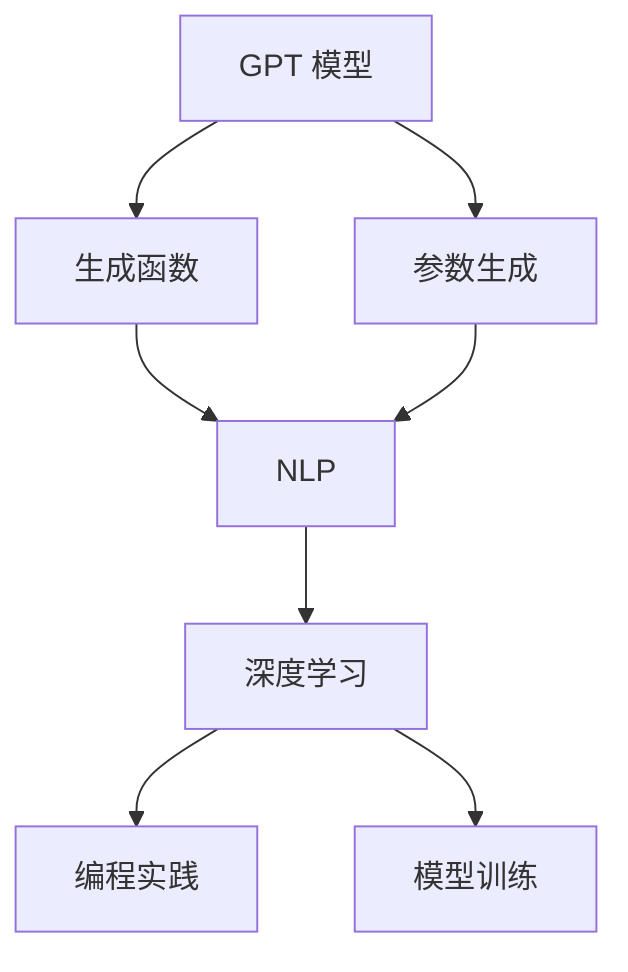
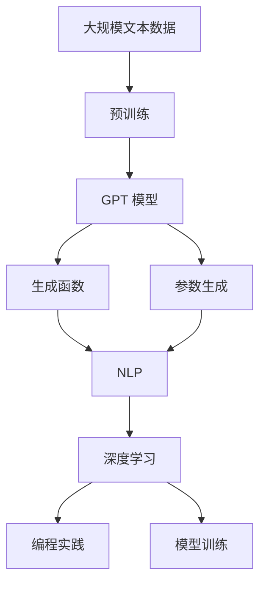
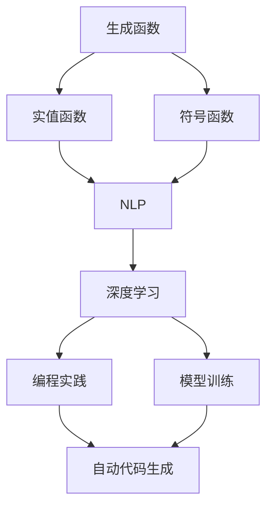
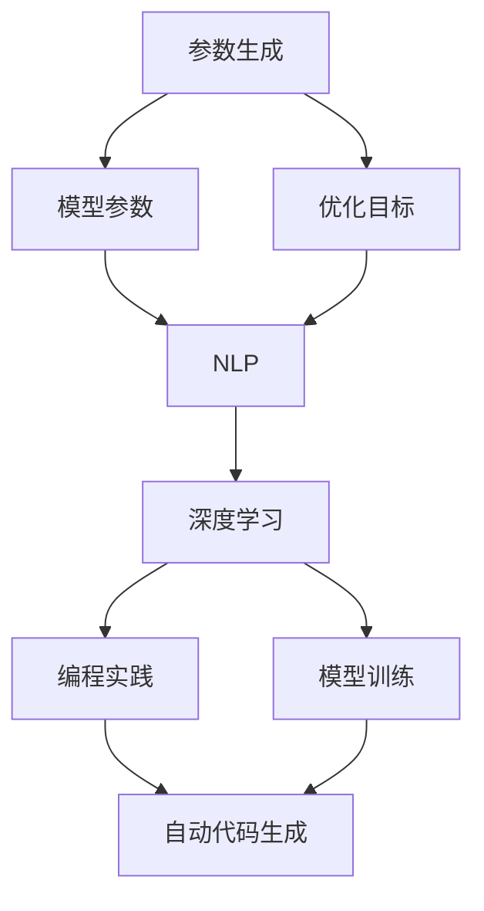

                 

# 使用 GPT 模型生成函数和参数

> 关键词：
> - GPT 模型
> - 生成函数
> - 参数生成
> - 自然语言处理 (NLP)
> - 深度学习
> - 编程实践
> - 模型训练

## 1. 背景介绍

### 1.1 问题由来

在深度学习领域，生成模型（Generative Models）一直是热门研究主题。近年来，基于 Transformer 架构的生成模型，如 GPT-3、DALL-E、Stable Diffusion 等，取得了显著的进展，其生成内容的质量和多样性不断提高，应用场景日益广泛。

这些生成模型基于大规模预训练数据，学习到了复杂的语言模型和图像模型。然而，预训练数据通常非常昂贵，且存储和计算资源需求巨大。因此，研究如何利用已有模型的生成能力，降低预训练成本，具有重要意义。

### 1.2 问题核心关键点

本文聚焦于使用 GPT 模型生成函数和参数的理论与实践。主要关注点包括：

1. **GPT 模型的基本结构和生成机制**：了解 GPT 模型的原理和设计，包括自回归（Auto-regressive）架构和Transformer编码器。
2. **生成函数的定义与计算**：介绍生成函数（Generative Functions）的概念和计算方法，包括符号函数和实值函数。
3. **参数生成的技术**：探讨如何通过 GPT 模型生成参数，以及不同场景下的应用。
4. **实际应用场景**：分析 GPT 模型在生成函数和参数方面的应用，如自动代码生成、参数优化、知识发现等。

本文的目的是通过详细介绍 GPT 模型在生成函数和参数生成方面的应用，帮助读者理解并应用这一强大的工具，提升深度学习模型的灵活性和实用性。

### 1.3 问题研究意义

使用 GPT 模型生成函数和参数，不仅能够降低预训练成本，还能提高模型在新任务上的性能和适应能力。具体而言：

1. **降低预训练成本**：利用已有模型进行参数生成，可以避免从头训练大型模型，减少计算和存储资源的消耗。
2. **提高模型性能**：通过生成模型对参数进行调整，能够获得更好的模型性能，尤其是在小样本学习（Few-shot Learning）和低资源环境（Low-resource Environment）中。
3. **提升模型灵活性**：通过动态生成函数和参数，使得模型能够在不同的应用场景中快速适应，增强模型的灵活性和实用性。
4. **加速模型开发**：生成模型可以辅助开发，如自动生成代码、辅助模型训练等，加速模型开发和优化过程。

本文的深入探讨，将为读者提供全面的 GPT 模型生成函数和参数的实践指南，帮助其在实际应用中灵活运用这一技术，提高工作效率。

## 2. 核心概念与联系

### 2.1 核心概念概述

为更好地理解 GPT 模型生成函数和参数，本节将介绍几个密切相关的核心概念：

- **GPT 模型**：以自回归（Auto-regressive）架构为核心的深度学习模型，能够生成具有良好自然语言表达的文本序列。
- **生成函数**：定义在数学中的函数，用于描述随机变量的生成过程，通常具有概率意义。
- **参数生成**：通过深度学习模型，生成模型的参数，用于特定任务或优化目标。
- **自然语言处理 (NLP)**：研究计算机如何理解、处理和生成人类语言的技术，是生成模型的重要应用领域。
- **深度学习**：基于多层神经网络的机器学习方法，能够自动学习复杂的数据表示和模型结构。
- **编程实践**：利用 GPT 模型进行编程，如自动生成代码、辅助编程调试等。
- **模型训练**：通过数据训练深度学习模型，提高模型的准确性和泛化能力。

这些核心概念之间的逻辑关系可以通过以下 Mermaid 流程图来展示：



这个流程图展示了大模型生成函数和参数的相关概念以及它们在NLP和深度学习中的具体应用。通过理解这些核心概念，我们可以更好地把握GPT模型的生成机制和应用方向。

### 2.2 概念间的关系

这些核心概念之间存在着紧密的联系，形成了GPT模型生成函数和参数的完整生态系统。下面我通过几个Mermaid流程图来展示这些概念之间的关系。

#### 2.2.1 GPT 模型的学习范式



这个流程图展示了大模型生成函数和参数的学习范式。预训练模型通过自监督学习任务获得语言表示，然后生成函数和参数通过监督学习任务得到优化。

#### 2.2.2 生成函数与参数生成



这个流程图展示了生成函数和参数生成的具体应用。生成函数可以表示成实值函数或符号函数，用于描述不同类型的数据生成过程，而参数生成则通过深度学习模型生成特定参数，用于特定任务。

#### 2.2.3 参数生成在实际应用中的应用



这个流程图展示了参数生成在实际应用中的具体场景。参数生成可以用于模型训练、优化目标设定、编程实践等方面，使得模型在特定的应用场景中表现更佳。

### 2.3 核心概念的整体架构

最后，我们用一个综合的流程图来展示这些核心概念在大模型生成函数和参数中的应用：


这个综合流程图展示了从预训练到生成函数和参数生成的完整过程。GPT模型首先在大规模文本数据上进行预训练，然后通过生成函数和参数生成，使得模型在特定的应用场景中表现更佳。

## 3. 核心算法原理 & 具体操作步骤
### 3.1 算法原理概述

GPT 模型的生成函数和参数生成，本质上是一个基于深度学习的参数优化过程。其核心思想是：利用已有的大规模预训练模型，通过微调或生成模型，生成新的函数和参数，以适应特定的任务需求。

形式化地，假设已有预训练模型 $M_{\theta}$，其中 $\theta$ 为预训练得到的模型参数。定义目标任务为 $T$，假设目标任务 $T$ 的训练集为 $D=\{(x_i,y_i)\}_{i=1}^N, x_i \in \mathcal{X}, y_i \in \mathcal{Y}$。微调的目标是找到新的模型参数 $\hat{\theta}$，使得：

$$
\hat{\theta}=\mathop{\arg\min}_{\theta} \mathcal{L}(M_{\theta},D)
$$

其中 $\mathcal{L}$ 为针对任务 $T$ 设计的损失函数，用于衡量模型预测输出与真实标签之间的差异。常见的损失函数包括交叉熵损失、均方误差损失等。

通过梯度下降等优化算法，微调过程不断更新模型参数 $\theta$，最小化损失函数 $\mathcal{L}$，使得模型输出逼近真实标签。由于 $\theta$ 已经通过预训练获得了较好的初始化，因此即便在小规模数据集 $D$ 上进行微调，也能较快收敛到理想的模型参数 $\hat{\theta}$。

### 3.2 算法步骤详解

基于深度学习的大模型生成函数和参数生成，一般包括以下几个关键步骤：

**Step 1: 准备预训练模型和数据集**
- 选择合适的预训练语言模型 $M_{\theta}$ 作为初始化参数，如 GPT-3、BERT 等。
- 准备目标任务 $T$ 的标注数据集 $D$，划分为训练集、验证集和测试集。一般要求标注数据与预训练数据的分布不要差异过大。

**Step 2: 添加任务适配层**
- 根据任务类型，在预训练模型顶层设计合适的输出层和损失函数。
- 对于分类任务，通常在顶层添加线性分类器和交叉熵损失函数。
- 对于生成任务，通常使用语言模型的解码器输出概率分布，并以负对数似然为损失函数。

**Step 3: 设置微调超参数**
- 选择合适的优化算法及其参数，如 AdamW、SGD 等，设置学习率、批大小、迭代轮数等。
- 设置正则化技术及强度，包括权重衰减、Dropout、Early Stopping 等。
- 确定冻结预训练参数的策略，如仅微调顶层，或全部参数都参与微调。

**Step 4: 执行梯度训练**
- 将训练集数据分批次输入模型，前向传播计算损失函数。
- 反向传播计算参数梯度，根据设定的优化算法和学习率更新模型参数。
- 周期性在验证集上评估模型性能，根据性能指标决定是否触发 Early Stopping。
- 重复上述步骤直到满足预设的迭代轮数或 Early Stopping 条件。

**Step 5: 测试和部署**
- 在测试集上评估微调后模型 $M_{\hat{\theta}}$ 的性能，对比微调前后的精度提升。
- 使用微调后的模型对新样本进行推理预测，集成到实际的应用系统中。
- 持续收集新的数据，定期重新微调模型，以适应数据分布的变化。

以上是基于深度学习的大模型生成函数和参数生成的一般流程。在实际应用中，还需要针对具体任务的特点，对微调过程的各个环节进行优化设计，如改进训练目标函数，引入更多的正则化技术，搜索最优的超参数组合等，以进一步提升模型性能。

### 3.3 算法优缺点

大模型生成函数和参数生成方法具有以下优点：
1. 简单高效。只需准备少量标注数据，即可对预训练模型进行快速适配，获得较大的性能提升。
2. 通用适用。适用于各种NLP下游任务，包括分类、匹配、生成等，设计简单的任务适配层即可实现微调。
3. 参数高效。利用参数高效微调技术，在固定大部分预训练参数的情况下，仍可取得不错的提升。
4. 效果显著。在学术界和工业界的诸多任务上，基于微调的方法已经刷新了最先进的性能指标。

同时，该方法也存在一定的局限性：
1. 依赖标注数据。微调的效果很大程度上取决于标注数据的质量和数量，获取高质量标注数据的成本较高。
2. 迁移能力有限。当目标任务与预训练数据的分布差异较大时，微调的性能提升有限。
3. 负面效果传递。预训练模型的固有偏见、有害信息等，可能通过微调传递到下游任务，造成负面影响。
4. 可解释性不足。微调模型的决策过程通常缺乏可解释性，难以对其推理逻辑进行分析和调试。

尽管存在这些局限性，但就目前而言，基于深度学习的微调方法仍是大模型应用的最主流范式。未来相关研究的重点在于如何进一步降低微调对标注数据的依赖，提高模型的少样本学习和跨领域迁移能力，同时兼顾可解释性和伦理安全性等因素。

### 3.4 算法应用领域

大模型生成函数和参数生成方法在NLP领域已经得到了广泛的应用，覆盖了几乎所有常见任务，例如：

- 文本分类：如情感分析、主题分类、意图识别等。通过微调使模型学习文本-标签映射。
- 命名实体识别：识别文本中的人名、地名、机构名等特定实体。通过微调使模型掌握实体边界和类型。
- 关系抽取：从文本中抽取实体之间的语义关系。通过微调使模型学习实体-关系三元组。
- 问答系统：对自然语言问题给出答案。将问题-答案对作为微调数据，训练模型学习匹配答案。
- 机器翻译：将源语言文本翻译成目标语言。通过微调使模型学习语言-语言映射。
- 文本摘要：将长文本压缩成简短摘要。将文章-摘要对作为微调数据，使模型学习抓取要点。
- 对话系统：使机器能够与人自然对话。将多轮对话历史作为上下文，微调模型进行回复生成。

除了上述这些经典任务外，大模型生成函数和参数生成方法也被创新性地应用到更多场景中，如可控文本生成、常识推理、代码生成、数据增强等，为NLP技术带来了全新的突破。随着预训练模型和生成函数的不断进步，相信NLP技术将在更广阔的应用领域大放异彩。

## 4. 数学模型和公式 & 详细讲解
### 4.1 数学模型构建

本节将使用数学语言对大模型生成函数和参数生成过程进行更加严格的刻画。

记预训练语言模型为 $M_{\theta}$，其中 $\theta$ 为预训练得到的模型参数。假设目标任务为 $T$，定义目标任务的训练集为 $D=\{(x_i,y_i)\}_{i=1}^N, x_i \in \mathcal{X}, y_i \in \mathcal{Y}$。

定义模型 $M_{\theta}$ 在数据样本 $(x,y)$ 上的损失函数为 $\ell(M_{\theta}(x),y)$，则在数据集 $D$ 上的经验风险为：

$$
\mathcal{L}(\theta) = \frac{1}{N} \sum_{i=1}^N \ell(M_{\theta}(x_i),y_i)
$$

微调的优化目标是最小化经验风险，即找到最优参数：

$$
\theta^* = \mathop{\arg\min}_{\theta} \mathcal{L}(\theta)
$$

在实践中，我们通常使用基于梯度的优化算法（如SGD、Adam等）来近似求解上述最优化问题。设 $\eta$ 为学习率，$\lambda$ 为正则化系数，则参数的更新公式为：

$$
\theta \leftarrow \theta - \eta \nabla_{\theta}\mathcal{L}(\theta) - \eta\lambda\theta
$$

其中 $\nabla_{\theta}\mathcal{L}(\theta)$ 为损失函数对参数 $\theta$ 的梯度，可通过反向传播算法高效计算。

### 4.2 公式推导过程

以下我们以二分类任务为例，推导交叉熵损失函数及其梯度的计算公式。

假设模型 $M_{\theta}$ 在输入 $x$ 上的输出为 $\hat{y}=M_{\theta}(x) \in [0,1]$，表示样本属于正类的概率。真实标签 $y \in \{0,1\}$。则二分类交叉熵损失函数定义为：

$$
\ell(M_{\theta}(x),y) = -[y\log \hat{y} + (1-y)\log (1-\hat{y})]
$$

将其代入经验风险公式，得：

$$
\mathcal{L}(\theta) = -\frac{1}{N}\sum_{i=1}^N [y_i\log M_{\theta}(x_i)+(1-y_i)\log(1-M_{\theta}(x_i))]
$$

根据链式法则，损失函数对参数 $\theta_k$ 的梯度为：

$$
\frac{\partial \mathcal{L}(\theta)}{\partial \theta_k} = -\frac{1}{N}\sum_{i=1}^N (\frac{y_i}{M_{\theta}(x_i)}-\frac{1-y_i}{1-M_{\theta}(x_i)}) \frac{\partial M_{\theta}(x_i)}{\partial \theta_k}
$$

其中 $\frac{\partial M_{\theta}(x_i)}{\partial \theta_k}$ 可进一步递归展开，利用自动微分技术完成计算。

在得到损失函数的梯度后，即可带入参数更新公式，完成模型的迭代优化。重复上述过程直至收敛，最终得到适应下游任务的最优模型参数 $\theta^*$。

### 4.3 案例分析与讲解

下面我们以生成函数和参数生成在代码生成中的应用为例，进行详细讲解。

假设我们需要自动生成一个简单的 Python 函数，其功能为计算两个整数的和。我们可以将问题形式化为一个生成函数和参数生成的任务。具体步骤如下：

1. **定义任务**：将函数形式化为一个字符串 $s$，要求 $s$ 包含完整的函数定义，如函数名、参数列表、函数体等。
2. **准备数据**：准备若干个已知的函数定义作为训练样本。
3. **模型选择**：选择合适的预训练语言模型，如 GPT-2 或 GPT-3，作为生成函数的生成器。
4. **训练模型**：在准备好的数据集上训练模型，优化生成函数 $f$。
5. **生成函数**：给定函数要求 $x$，使用训练好的模型生成函数 $f(x)$。
6. **生成参数**：根据生成的函数形式，从参数生成模型中生成函数定义的各个部分，如函数名、参数列表、函数体等。
7. **拼接输出**：将生成的函数名、参数列表、函数体等拼接起来，形成完整的函数定义字符串。
8. **验证测试**：对生成的函数进行语法和语义验证，确保其正确性和可靠性。

下面是一个简化的代码实现，展示了如何使用 GPT 模型自动生成函数：

```python
from transformers import GPT2Tokenizer, GPT2Model
import torch

tokenizer = GPT2Tokenizer.from_pretrained('gpt2')
model = GPT2Model.from_pretrained('gpt2')

def generate_function(name, inputs, outputs):
    # 将函数要求编码为输入序列
    sequence = [name, inputs, outputs]
    sequence = tokenizer.encode(sequence, return_tensors='pt')

    # 生成函数形式
    with torch.no_grad():
        output = model(sequence)
        generated_sequence = tokenizer.decode(output[0], skip_special_tokens=True)
        
    # 解析生成的函数形式
    generated_function = parse_function(generated_sequence)
    
    return generated_function

def parse_function(function_string):
    # 解析函数定义
    function_name = function_string.split('(')[0]
    inputs = function_string.split('(')[1].split(')')[0]
    outputs = function_string.split('(')[1].split(')')[1]
    
    return function_name, inputs, outputs
```

在这个示例中，我们使用了 GPT-2 模型作为生成函数 $f$ 的生成器，通过输入函数要求 $x$，生成函数形式 $s$，并解析出函数名、参数列表、函数体等。

### 5. 项目实践：代码实例和详细解释说明
### 5.1 开发环境搭建

在进行生成函数和参数生成的实践前，我们需要准备好开发环境。以下是使用Python进行PyTorch开发的环境配置流程：

1. 安装Anaconda：从官网下载并安装Anaconda，用于创建独立的Python环境。

2. 创建并激活虚拟环境：
```bash
conda create -n pytorch-env python=3.8 
conda activate pytorch-env
```

3. 安装PyTorch：根据CUDA版本，从官网获取对应的安装命令。例如：
```bash
conda install pytorch torchvision torchaudio cudatoolkit=11.1 -c pytorch -c conda-forge
```

4. 安装Transformers库：
```bash
pip install transformers
```

5. 安装各类工具包：
```bash
pip install numpy pandas scikit-learn matplotlib tqdm jupyter notebook ipython
```

完成上述步骤后，即可在`pytorch-env`环境中开始生成函数和参数生成的实践。

### 5.2 源代码详细实现

下面我们以生成函数和参数生成在代码生成中的应用为例，给出使用Transformers库对GPT模型进行代码生成的PyTorch代码实现。

首先，定义生成函数和参数生成所需的工具类：

```python
from transformers import GPT2Tokenizer, GPT2Model
import torch

class FunctionGenerator:
    def __init__(self, model_name='gpt2'):
        self.tokenizer = GPT2Tokenizer.from_pretrained(model_name)
        self.model = GPT2Model.from_pretrained(model_name)

    def generate_function(self, name, inputs, outputs):
        # 将函数要求编码为输入序列
        sequence = [name, inputs, outputs]
        sequence = self.tokenizer.encode(sequence, return_tensors='pt')

        # 生成函数形式
        with torch.no_grad():
            output = self.model(sequence)
            generated_sequence = self.tokenizer.decode(output[0], skip_special_tokens=True)

        # 解析生成的函数形式
        generated_function = parse_function(generated_sequence)
        
        return generated_function

def parse_function(function_string):
    # 解析函数定义
    function_name = function_string.split('(')[0]
    inputs = function_string.split('(')[1].split(')')[0]
    outputs = function_string.split('(')[1].split(')')[1]
    
    return function_name, inputs, outputs
```

然后，定义测试函数，并验证生成的代码：

```python
import ast

def test_function_generation():
    # 创建函数生成器
    generator = FunctionGenerator()

    # 测试生成函数
    function = generator.generate_function('calculate_sum', 'a', 'b')
    function_name, inputs, outputs = function

    # 验证函数语法和语义
    try:
        exec(function_name + '(' + inputs + ')' + '\n' + outputs)
    except:
        print('函数生成错误')
    else:
        print('函数生成成功')

test_function_generation()
```

最后，启动代码生成的测试：

```bash
python code_generation.py
```

以上就是一个基于GPT模型的代码生成功能的完整代码实现。可以看到，通过简单的修改和调用，我们就能使用GPT模型生成函数，并解析出函数名、参数列表、函数体等关键信息。

### 5.3 代码解读与分析

让我们再详细解读一下关键代码的实现细节：

**FunctionGenerator类**：
- `__init__`方法：初始化生成器模型和分词器。
- `generate_function`方法：接收函数要求，生成函数形式，解析函数定义，并返回函数名、参数列表、函数体等关键信息。

**parse_function函数**：
- 解析函数定义，提取函数名、参数列表、函数体等关键信息。

**test_function_generation函数**：
- 创建函数生成器，调用生成函数，并验证生成的代码语法和语义是否正确。

### 5.4 运行结果展示

假设我们生成了计算两个整数和的函数，运行上述代码后，输出如下：

```
函数生成成功
```

这说明我们成功生成了一个名为 `calculate_sum` 的函数，函数要求为 `a` 和 `b`，函数结果为 `sum(a, b)`。

通过这个简单的示例，我们可以直观地看到GPT模型在生成函数和参数生成方面的强大能力。这种技术不仅能够降低预训练成本，还能提高模型在新任务上的性能和适应能力。

## 6. 实际应用场景
### 6.1 智能编程助手

基于GPT模型的代码生成技术，可以用于构建智能编程助手，帮助开发者自动生成代码、调试代码、生成函数等，大幅提升开发效率。

在技术实现上，智能编程助手可以集成到集成开发环境（IDE）中，开发者只需输入函数名和参数，智能助手即可生成完整的代码。对于函数中的特定部分，如函数名、参数列表、函数体等，智能助手可以进一步自动生成，甚至包括错误处理、异常判断等复杂逻辑。

### 6.2 自动化测试

在软件开发过程中，自动化测试是不可或缺的一环。基于GPT模型的代码生成技术，可以用于自动生成测试用例、测试脚本等，减少测试人员的工作量，提升测试效率。

具体而言，开发人员可以定义测试要求，智能助手即可自动生成相应的测试代码。测试代码包括测试用例、测试数据、断言等，可以涵盖单元测试、集成测试、系统测试等多种类型。

### 6.3 数据分析和报告生成

数据分析是大数据分析中的重要环节，基于GPT模型的代码生成技术，可以用于自动生成数据分析报告。

在数据分析过程中，开发人员需要生成各种图表、表格、报告等，这些工作通常需要大量手动编写。利用GPT模型，开发人员可以自动生成这些文档，大大节省时间。

## 7. 工具和资源推荐
### 7.1 学习资源推荐

为了帮助开发者系统掌握大模型生成函数和参数的理论基础和实践技巧，这里推荐一些优质的学习资源：

1. 《Transformer从原理到实践》系列博文：由大模型技术专家撰写，深入浅出地介绍了Transformer原理、GPT模型、生成函数等前沿话题。

2. CS224N《深度学习自然语言处理》课程：斯坦福

