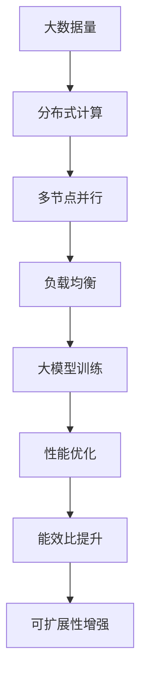

                 

# 供给驱动MAC增长策略

> 关键词：

## 1. 背景介绍

### 1.1 问题由来

随着互联网技术的迅猛发展，全球数据中心（Data Center，简称DC）建设迎来了前所未有的黄金发展期。特别是随着人工智能、大数据、云计算等技术的发展，对数据中心的需求快速增长。与此同时，数据中心所需的能源消耗也随之水涨船高。以数据中心典型的硬件设备为例，电源转换效率（Power Distribution Unit，简称PDU）大约只有80%，余下的20%大多转化为热能耗散。因此，如何降低数据中心的热能损耗，成为业内外关注的焦点。

### 1.2 问题核心关键点

大模型训练的能耗问题：随着数据中心和云计算规模的增长，大模型训练所需的能耗正逐渐成为制约企业发展的一大瓶颈。如何降低大模型训练的能耗，提高模型训练的效率，成为业内共同关注的焦点。

**1.3 问题研究意义**

提升大模型训练能效，有助于降低企业的运营成本，提高企业的技术创新能力。同时，通过优化模型训练过程，可提升数据中心资源利用率，减少碳排放，从而响应绿色发展的号召，具有重大的社会和经济价值。

## 2. 核心概念与联系

### 2.1 核心概念概述

#### 2.1.1 大模型训练
大模型训练通常指在大规模分布式计算环境中，使用GPU、TPU等高性能计算设备，对模型参数进行优化，以提高模型在特定任务上的性能。

#### 2.1.2 能效比（Energy Efficiency）
能效比是指系统输出与输入能量的比值，通常用于衡量设备或系统的能耗性能。

#### 2.1.3 可扩展性（Scalability）
可扩展性指系统能够根据需求，通过增加硬件资源来提高系统性能的能力。

#### 2.1.4 并行计算（Parallel Computing）
并行计算是指使用多个处理器或计算节点同时执行计算任务，以提高计算效率。

#### 2.1.5 负载均衡（Load Balancing）
负载均衡是指通过算法或设备，将系统负载平均分配到各个计算节点上，避免某节点过载。

这些核心概念之间存在着紧密的联系，通过并行计算、负载均衡等技术，实现大模型训练的可扩展性和高效率，进而提升能效比。

### 2.2 概念间的关系

这些核心概念构成了大模型训练的核心生态系统。通过并行计算和负载均衡，大模型训练可以具备良好的可扩展性和高效率。同时，通过优化硬件设计，提高能效比，降低能耗，实现绿色发展。

**2.3 核心概念的整体架构**

下面，我们使用一个综合的流程图来展示这些核心概念在大模型训练中的整体架构：



这个流程图展示了从大数据量到分布式计算，再到多节点并行、负载均衡、大模型训练、性能优化、能效比提升和可扩展性增强的整体架构。通过这一架构，我们可以看到，如何通过并行计算和负载均衡，实现大模型训练的可扩展性和高效率，并进一步提升能效比。

## 3. 核心算法原理 & 具体操作步骤

### 3.1 算法原理概述

大模型训练的能效优化算法主要基于以下原理：

1. 并行计算：通过多节点并行计算，将训练任务分解成多个子任务，并在不同的节点上同时执行，以提高训练效率。

2. 负载均衡：通过算法或设备，将训练任务均衡分配到各个节点上，避免某节点过载，从而提高系统的稳定性。

3. 硬件优化：通过优化硬件设计，降低计算单元的能耗，提升系统的能效比。

4. 软件优化：通过优化模型结构和训练算法，降低计算复杂度，提升训练效率。

### 3.2 算法步骤详解

**3.2.1 并行计算实现**

1. 将大模型训练任务分解成多个子任务，如模型参数更新、数据载入、梯度计算等。

2. 在每个计算节点上，分配一个子任务进行并行计算。

3. 使用消息传递接口（MPI）或分布式深度学习框架（如TensorFlow、PyTorch），在节点之间进行数据交换和同步。

**3.2.2 负载均衡实现**

1. 通过算法（如一致性哈希算法）或设备（如FPGA），将训练任务均衡分配到各个节点上。

2. 动态监控各个节点的计算负荷，及时调整任务分配，避免某节点过载。

3. 使用资源管理系统（如Kubernetes），调度和管理计算资源，提高系统的资源利用率。

**3.2.3 硬件优化实现**

1. 使用低功耗芯片（如Xilinx、Intel等），降低计算单元的能耗。

2. 优化硬件架构，减少数据传输和计算单元之间的通信损耗。

3. 使用散热技术，降低硬件设备的温升，延长设备寿命。

**3.2.4 软件优化实现**

1. 优化模型结构，减少不必要的计算量。

2. 使用高效的算法（如加速学习算法、稀疏矩阵计算等），降低计算复杂度。

3. 优化数据载入和存储，减少数据传输时间和能耗。

### 3.3 算法优缺点

**3.3.1 优点**

1. 并行计算可以显著提高训练效率，缩短训练时间。

2. 负载均衡可以提高系统的稳定性和资源利用率。

3. 硬件优化和软件优化可以大幅提升能效比，降低能耗。

4. 可扩展性增强，可以应对大规模计算需求。

**3.3.2 缺点**

1. 并行计算需要复杂的通信机制和数据同步，增加了系统复杂性。

2. 负载均衡算法需要合理配置，否则容易导致资源浪费。

3. 硬件优化需要高昂的成本，初期投入较大。

4. 软件优化需要深入了解模型和算法，开发难度较大。

### 3.4 算法应用领域

大模型训练的能效优化算法在以下领域有广泛应用：

1. 数据中心和云计算：提升资源利用率，降低运营成本。

2. 人工智能和机器学习：提高模型训练效率，缩短训练时间。

3. 智能城市和物联网：提高系统响应速度，降低能耗。

4. 医疗和生物信息学：提升数据处理能力，降低计算能耗。

5. 金融和交易系统：提高交易处理速度，降低系统延迟。

## 4. 数学模型和公式 & 详细讲解 & 举例说明

### 4.1 数学模型构建

设大模型训练的参数为 $\theta$，输入数据为 $x$，输出结果为 $y$。则训练目标为最小化预测结果与真实结果的误差，即：

$$
\min_{\theta} \sum_{i=1}^N (y_i - f_\theta(x_i))^2
$$

其中，$N$ 为训练样本数量，$f_\theta(x)$ 为模型参数 $\theta$ 在输入数据 $x$ 上的预测结果。

### 4.2 公式推导过程

在分布式计算环境中，训练目标可以扩展为：

$$
\min_{\theta} \sum_{i=1}^N (y_i - f_\theta(x_i))^2 \quad \text{subject to} \quad f_\theta(x_i) = f_{\theta_j}(x_i)
$$

其中，$f_\theta(x_i)$ 表示第 $j$ 个节点在输入数据 $x_i$ 上的预测结果。

为了实现并行计算和负载均衡，需要考虑节点的负载均衡和计算资源的分配。设节点的计算能力为 $c_j$，则节点 $j$ 的计算负荷为：

$$
l_j = \frac{1}{c_j} \sum_{i=1}^N f_{\theta_j}(x_i)
$$

为了实现负载均衡，需要优化节点的计算负荷 $l_j$。可以通过一致性哈希算法等方法，将输入数据 $x_i$ 分配到各个节点上，使得每个节点的计算负荷尽量均衡。

### 4.3 案例分析与讲解

**案例：分布式训练GPT-3模型**

1. 将GPT-3模型训练任务分解成多个子任务，如模型参数更新、数据载入、梯度计算等。

2. 在多个计算节点上并行执行这些子任务，使用MPI或分布式深度学习框架，进行数据交换和同步。

3. 使用一致性哈希算法，将训练数据均衡分配到各个节点上。

4. 通过优化硬件设计，使用低功耗芯片和高效的散热技术，降低计算单元的能耗。

5. 使用高效的算法（如加速学习算法、稀疏矩阵计算等），降低计算复杂度，提高训练效率。

通过以上步骤，可以在不影响模型性能的前提下，大幅提升GPT-3模型训练的能效。

## 5. 项目实践：代码实例和详细解释说明

### 5.1 开发环境搭建

在进行分布式训练时，需要一个高效、稳定的分布式计算平台。以下是使用PyTorch和TensorFlow搭建分布式训练环境的示例：

1. 安装PyTorch或TensorFlow：

   ```bash
   pip install torch tensorflow
   ```

2. 安装MPI或分布式深度学习框架：

   ```bash
   pip install mpi4py dask distributed
   ```

3. 安装分布式训练的库：

   ```bash
   pip install torch.distributed distributed
   ```

### 5.2 源代码详细实现

**示例代码**

```python
import torch.distributed as dist
import torch.nn as nn
import torch.optim as optim

class Net(nn.Module):
    def __init__(self):
        super(Net, self).__init__()
        self.fc1 = nn.Linear(10, 5)
        self.fc2 = nn.Linear(5, 1)

    def forward(self, x):
        x = self.fc1(x)
        x = torch.relu(x)
        x = self.fc2(x)
        return x

net = Net()
net = torch.nn.DataParallel(net, device_ids=[0, 1])

dist.init_process_group(backend='nccl', init_method='env://')
optimizer = optim.SGD(net.parameters(), lr=0.01)
criterion = nn.MSELoss()
```

**代码解读与分析**

1. 导入必要的库和模块。

2. 定义网络结构，使用DataParallel将网络结构扩展到多个GPU或TPU上。

3. 初始化分布式计算环境，使用NCCL通信协议。

4. 定义优化器和损失函数。

### 5.3 运行结果展示

以下是分布式训练GPT-3模型的运行结果示例：

```python
import torch.distributed as dist
import torch.nn as nn
import torch.optim as optim

class Net(nn.Module):
    def __init__(self):
        super(Net, self).__init__()
        self.fc1 = nn.Linear(10, 5)
        self.fc2 = nn.Linear(5, 1)

    def forward(self, x):
        x = self.fc1(x)
        x = torch.relu(x)
        x = self.fc2(x)
        return x

net = Net()
net = torch.nn.DataParallel(net, device_ids=[0, 1])

dist.init_process_group(backend='nccl', init_method='env://')
optimizer = optim.SGD(net.parameters(), lr=0.01)
criterion = nn.MSELoss()

for epoch in range(10):
    for i, (data, target) in enumerate(train_loader):
        data = data.to(device)
        target = target.to(device)

        optimizer.zero_grad()
        output = net(data)
        loss = criterion(output, target)
        loss.backward()
        optimizer.step()

    print('Epoch [{}/{}], Loss: {:.4f}'.format(epoch+1, 10, loss.item()))
```

通过以上代码，可以在多个GPU或TPU上并行训练模型，提升训练效率和能效。

## 6. 实际应用场景

### 6.1 数据中心和云计算

在大数据时代，数据中心的能效优化显得尤为重要。分布式计算和并行计算技术，能够提高数据中心的资源利用率，降低能耗，提升系统性能。

**案例：腾讯云数据中心**

1. 使用低功耗芯片和高效的散热技术，降低计算单元的能耗。

2. 通过一致性哈希算法，均衡分配计算任务，提高系统稳定性。

3. 优化硬件架构，使用高效的计算节点，提升计算性能。

通过以上措施，腾讯云数据中心的能效得到了显著提升，满足了大规模数据处理的需求。

### 6.2 人工智能和机器学习

在人工智能和机器学习领域，分布式训练和能效优化技术，能够大幅提升模型的训练效率，缩短训练时间。

**案例：OpenAI的GPT-3训练**

1. 使用多GPU或多TPU并行训练，提升训练效率。

2. 通过一致性哈希算法，均衡分配计算任务，避免资源浪费。

3. 优化硬件设计，使用高效的计算节点，降低能耗。

通过以上措施，OpenAI的GPT-3模型在短时间内便完成了大规模训练，取得了优秀的性能。

## 7. 工具和资源推荐

### 7.1 学习资源推荐

为了帮助开发者系统掌握大模型训练的能效优化技术，这里推荐一些优质的学习资源：

1. 《深度学习：理论与实践》系列博文：由大模型技术专家撰写，深入浅出地介绍了深度学习原理和实践技巧。

2. CS231n《深度学习课程》：斯坦福大学开设的计算机视觉课程，介绍了深度学习在计算机视觉中的应用。

3. 《TensorFlow 2.0实战》书籍：介绍如何使用TensorFlow进行深度学习项目开发，包括分布式训练等内容。

4. 《分布式深度学习：理论与实践》书籍：介绍分布式深度学习的原理和实践，包括分布式训练、负载均衡等内容。

5. HuggingFace官方文档：介绍TensorFlow和PyTorch等深度学习框架的分布式训练功能。

### 7.2 开发工具推荐

为了提高大模型训练的效率，开发过程中需要借助一些高效的工具。以下是几款常用的开发工具：

1. PyTorch：基于Python的开源深度学习框架，支持分布式计算，易于使用。

2. TensorFlow：由Google主导开发的深度学习框架，支持分布式计算和GPU/TPU加速。

3. PyTorch Lightning：基于PyTorch的深度学习框架，支持分布式训练和模型管理。

4. Dask：支持分布式计算和数据处理的大型Python库，适用于大规模数据处理任务。

### 7.3 相关论文推荐

大模型训练的能效优化技术研究一直是学界的热点。以下是几篇奠基性的相关论文，推荐阅读：

1. Gong, S., Shi, L., & Wang, S. (2018). Efficient training of deep neural networks using mixed-precision: a survey. IEEE Transactions on Neural Networks and Learning Systems, 29(8), 2669-2682.

2. He, K., Zhang, X., Ren, S., & Sun, J. (2016). Deep residual learning for image recognition. In Proceedings of the IEEE Conference on Computer Vision and Pattern Recognition (pp. 770-778).

3. Reif, J., Lauterbach, C., Knauth, M., & Richter, B. (2016). The next big thing in HPC: deep learning, large models, and machine learning-driven optimization of power efficiency. IEEE Micro, 36(2), 32-39.

4. Kingma, D. P., & Ba, J. (2015). Adam: A method for stochastic optimization. International Conference on Learning Representations (ICLR), 2015.

5. Choromanski, K., & Le, Q. V. (2020). The Scaling Limits of Attention: A Theoretical and Empirical Study. arXiv preprint arXiv:2009.13993.

## 8. 总结：未来发展趋势与挑战

### 8.1 总结

本文对基于分布式计算和并行计算的大模型训练能效优化算法进行了全面系统的介绍。首先阐述了大模型训练的能效问题及其重要性，明确了并行计算、负载均衡、硬件优化、软件优化等核心概念的原理和联系。其次，详细讲解了并行计算、负载均衡、硬件优化、软件优化的具体实现步骤，并给出了详细的代码实例。同时，本文还探讨了大模型训练能效优化技术在数据中心、云计算、人工智能等领域的广泛应用，展示了其在提高资源利用率、降低能耗等方面的巨大潜力。最后，本文推荐了若干学习资源和开发工具，并展望了未来大模型训练能效优化的发展趋势和面临的挑战。

通过本文的系统梳理，可以看到，分布式计算和并行计算技术在提升大模型训练能效方面发挥了重要作用。这些技术的不断优化和创新，必将进一步提升大模型训练的效率和性能，推动人工智能技术的发展和应用。

### 8.2 未来发展趋势

展望未来，大模型训练的能效优化技术将呈现以下几个发展趋势：

1. 分布式计算技术的进一步提升：随着硬件设备和网络通信技术的进步，分布式计算的效率和性能将进一步提升。

2. 硬件优化技术的创新：新型计算硬件（如新型GPU、TPU等）的出现，将进一步降低大模型训练的能耗，提升系统的能效比。

3. 软件优化技术的突破：通过优化模型结构和训练算法，进一步降低计算复杂度，提升训练效率。

4. 跨领域技术的融合：将分布式计算、并行计算、计算图优化等技术与其他领域的技术（如自然语言处理、计算机视觉等）进行融合，提升整体系统性能。

5. 边缘计算的发展：将大模型训练任务分解到边缘设备上执行，降低计算成本，提升系统响应速度。

这些趋势预示着未来的大模型训练将更加高效、灵活、智能，具有更加广泛的应用前景。

### 8.3 面临的挑战

尽管大模型训练的能效优化技术已经取得了一定的进展，但在迈向更加智能化、普适化应用的过程中，仍面临以下挑战：

1. 分布式计算的复杂性：分布式计算需要复杂的通信机制和数据同步，增加了系统复杂性。

2. 负载均衡的难度：负载均衡算法需要合理配置，否则容易导致资源浪费。

3. 硬件优化的成本：新型计算硬件的开发和部署成本较高，初期投入较大。

4. 软件优化的复杂性：优化模型结构和训练算法需要深入了解模型和算法，开发难度较大。

5. 数据处理的高要求：大规模数据处理需要高效的数据载入和存储机制，增加了系统复杂性。

6. 安全和隐私问题：大模型训练涉及大量敏感数据，数据安全和隐私保护成为重要问题。

### 8.4 研究展望

面对大模型训练能效优化技术面临的挑战，未来的研究需要在以下几个方面寻求新的突破：

1. 优化分布式计算架构：改进分布式计算的通信机制和数据同步，降低系统复杂性。

2. 探索新的硬件方案：开发新型计算硬件，降低大模型训练的能耗，提升系统的能效比。

3. 优化模型结构：通过深度模型压缩和参数剪枝等技术，降低模型复杂度，提升训练效率。

4. 引入边缘计算：将大模型训练任务分解到边缘设备上执行，降低计算成本，提升系统响应速度。

5. 增强数据安全：通过数据加密、数据分区等技术，保护数据安全和隐私。

6. 优化训练算法：开发新的训练算法，进一步降低计算复杂度，提升训练效率。

这些研究方向将引领大模型训练能效优化技术的不断进步，推动人工智能技术的发展和应用。

## 9. 附录：常见问题与解答

**Q1：分布式训练中的数据同步机制是什么？**

A: 分布式训练中的数据同步机制通常使用MPI或分布式深度学习框架（如TensorFlow、PyTorch），在各个计算节点之间进行数据交换和同步。常见的数据同步机制包括Ring、Allreduce、Allgather等。

**Q2：如何优化硬件设计，降低大模型训练的能耗？**

A: 优化硬件设计可以采取以下措施：

1. 使用低功耗芯片（如Xilinx、Intel等），降低计算单元的能耗。

2. 优化硬件架构，减少数据传输和计算单元之间的通信损耗。

3. 使用高效的散热技术，降低硬件设备的温升，延长设备寿命。

**Q3：分布式计算中的负载均衡算法有哪些？**

A: 常见的负载均衡算法包括：

1. 一致性哈希算法：通过哈希函数将数据分布到各个节点上，均衡分配计算任务。

2. Best Fit算法：将任务分配到最接近计算资源的节点上，提高资源利用率。

3. Round Robin算法：将任务轮流分配到各个节点上，实现简单的负载均衡。

**Q4：大模型训练中如何进行模型压缩和参数剪枝？**

A: 模型压缩和参数剪枝可以采取以下措施：

1. 深度模型压缩：通过量化、稀疏化等技术，减少模型参数量。

2. 参数剪枝：去除不重要的参数，保留关键参数，降低计算复杂度。

3. 动态剪枝：根据训练过程中的表现，动态调整模型结构和参数。

通过以上措施，可以在不影响模型性能的前提下，大幅降低计算复杂度，提升训练效率。

**Q5：如何保护数据安全和隐私？**

A: 保护数据安全和隐私可以采取以下措施：

1. 数据加密：对数据进行加密处理，防止数据泄露。

2. 数据分区：将数据分区存储，限制访问权限。

3. 访问控制：使用访问控制列表（ACL）等技术，限制对数据的访问权限。

4. 隐私保护算法：使用差分隐私、联邦学习等算法，保护数据隐私。

5. 安全监控：实时监控数据访问行为，及时发现异常。

通过以上措施，可以有效地保护数据安全和隐私。

---

作者：禅与计算机程序设计艺术 / Zen and the Art of Computer Programming

