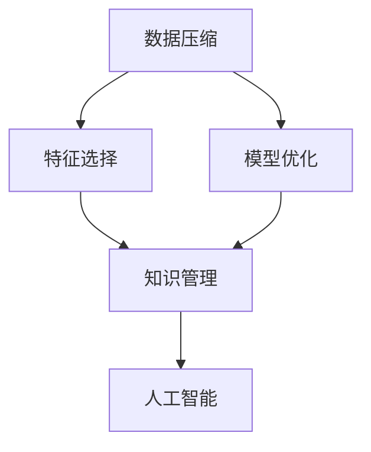
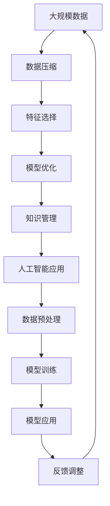

                 

# 信息简化的原则与好处：在混乱中建立秩序与简化

> 关键词：信息简化, 数据压缩, 特征选择, 模型优化, 知识管理, 人工智能, 信息提取

## 1. 背景介绍

在当今信息爆炸的时代，我们每天都在面对海量的数据和信息。无论是日常生活中的信息处理，还是科研领域的大数据挖掘，信息简化和秩序建立都显得尤为重要。信息的简化不仅仅是数据量的减少，更是知识提炼和结构化的过程。本文将详细探讨信息简化的原则、方法和应用，并分析其在各个领域带来的好处。

### 1.1 问题由来

随着信息技术的发展，信息量呈爆炸式增长。面对大规模数据集，传统的数据存储和处理方式已显得力不从心。信息过载不仅增加了处理难度，也影响了信息的有效利用和决策支持。因此，如何在信息海洋中提取有价值的知识，并将信息简化，是信息技术面临的重要挑战。

### 1.2 问题核心关键点

信息简化的核心在于通过一定的算法和技术手段，从原始数据中提取出有价值的信息，去除冗余和噪声，以减少数据量，提升数据处理效率。关键点包括：

- 数据压缩与编码：利用算法减少数据量，便于存储和传输。
- 特征选择与提取：从数据中提取出最具代表性的特征，减少特征维度。
- 模型优化与简化：通过简化模型结构，提升计算效率和性能。
- 知识管理与整合：将信息转化为知识，构建结构化的知识体系。

### 1.3 问题研究意义

信息简化对于提高信息处理效率、减少存储和传输成本、提升决策质量和用户体验具有重要意义：

1. 提升数据处理效率：通过减少数据量，加速数据分析和处理过程。
2. 降低存储和传输成本：减少数据存储和传输的空间和时间成本。
3. 提高决策质量：通过提炼有价值的信息，支持更准确的数据驱动决策。
4. 改善用户体验：简化的信息更易理解，提升用户使用效率和满意度。
5. 促进知识传播：简化后的信息更易传播，促进知识的共享和应用。

## 2. 核心概念与联系

### 2.1 核心概念概述

为更好地理解信息简化的基本原理和应用方法，本节将介绍几个关键概念：

- 数据压缩(Data Compression)：通过算法减少数据量，以便于存储和传输。
- 特征选择(Feature Selection)：从数据中提取最具代表性的特征，减少特征维度。
- 模型优化(Model Optimization)：通过简化模型结构，提升计算效率和性能。
- 知识管理(Knowledge Management)：构建结构化的知识体系，支持知识的存储、检索和应用。
- 人工智能(AI)：通过算法和模型实现信息简化和智能化应用。

这些核心概念之间存在紧密的联系，可以通过以下Mermaid流程图来展示：



这个流程图展示了数据压缩、特征选择、模型优化和知识管理之间的内在联系，以及它们如何共同推动人工智能技术的发展。

### 2.2 概念间的关系

这些核心概念之间存在着紧密的联系，形成了信息简化的完整生态系统。下面我们通过几个Mermaid流程图来展示这些概念之间的关系。

#### 2.2.1 数据压缩与特征选择的关系


这个流程图展示了数据压缩和特征选择之间的关系。数据压缩主要关注减少数据量，特征选择则侧重于数据中的特征提取和编码。两者可以相互促进，共同提升数据处理效率。

#### 2.2.2 模型优化与知识管理的关系


这个流程图展示了模型优化和知识管理之间的关系。模型优化通过简化模型结构，提升计算效率，而知识管理则通过提取模型中的知识，构建结构化的知识体系。两者相互依赖，共同提升人工智能系统的性能。

#### 2.2.3 信息简化与人工智能的关系


这个流程图展示了信息简化与人工智能之间的关系。信息简化通过数据压缩、特征选择、模型优化等技术手段，将原始数据转化为有价值的信息，从而支持人工智能模型的训练和应用。

### 2.3 核心概念的整体架构

最后，我们用一个综合的流程图来展示这些核心概念在大数据处理中的应用：



这个综合流程图展示了从大规模数据到人工智能应用的整个信息简化过程。数据压缩、特征选择、模型优化和知识管理四个环节，共同构建了一个高效、智能的信息处理系统。

## 3. 核心算法原理 & 具体操作步骤
### 3.1 算法原理概述

信息简化的基本原理是通过算法和技术手段，将原始数据转化为有价值的信息，同时减少数据的存储和处理开销。核心算法包括数据压缩、特征选择、模型优化等。

数据压缩算法（如Huffman编码、LZ77、LZ78、LZW、Arithmetic编码等）通过减少数据量，提升数据存储和传输效率。特征选择算法（如信息增益、互信息、卡方检验等）从数据中提取最具代表性的特征，减少特征维度。模型优化算法（如梯度下降、正则化等）通过简化模型结构，提升计算效率和性能。

### 3.2 算法步骤详解

信息简化的具体操作步骤包括以下几个步骤：

**Step 1: 数据预处理**

- 收集原始数据，并进行清洗、去重、标准化等预处理操作。
- 确定数据压缩、特征选择、模型优化等处理步骤，并设置相应的参数。

**Step 2: 数据压缩**

- 选择适合的数据压缩算法，如Huffman编码、LZ77等。
- 对数据进行压缩，得到压缩后的数据文件。
- 保存压缩后的数据文件，以便于存储和传输。

**Step 3: 特征选择**

- 选择合适的特征选择算法，如信息增益、互信息等。
- 对数据进行特征提取和选择，减少特征维度。
- 得到特征选择后的数据集。

**Step 4: 模型优化**

- 选择合适的模型优化算法，如梯度下降、正则化等。
- 对特征选择后的数据集进行模型训练和优化。
- 得到优化的模型。

**Step 5: 知识管理**

- 对优化的模型进行知识提取和整理，构建结构化的知识体系。
- 保存知识管理后的结果，以便于后续使用和查询。

**Step 6: 模型应用**

- 将优化的模型应用到实际问题中，进行数据分析、预测和决策。
- 根据反馈结果，对模型进行持续优化。

### 3.3 算法优缺点

信息简化的算法具有以下优点：

- 数据存储和传输效率高：通过数据压缩和特征选择，减少了数据量，提高了存储和传输效率。
- 计算效率高：通过模型优化，简化了模型结构，提升了计算效率。
- 提升决策质量：通过提取有价值的信息，支持更准确的数据驱动决策。

同时，这些算法也存在一些缺点：

- 数据压缩可能引入噪声：数据压缩算法可能引入压缩误差，影响数据的准确性。
- 特征选择可能丢失信息：特征选择算法可能丢失部分重要特征，影响模型的性能。
- 模型优化可能导致过拟合：模型优化算法可能过度拟合数据，影响模型的泛化能力。
- 知识管理可能过于复杂：知识管理过程可能需要投入大量人力和时间，增加开发成本。

### 3.4 算法应用领域

信息简化的算法在多个领域得到了广泛应用，例如：

- 大数据分析：通过对大规模数据进行压缩和特征选择，提高数据处理效率和性能。
- 数据挖掘：通过模型优化和知识管理，提取数据中的有用信息，支持数据驱动决策。
- 计算机视觉：通过特征选择和模型优化，提升图像和视频的处理效率和质量。
- 自然语言处理：通过特征选择和模型优化，提高文本数据的处理效率和效果。
- 语音识别：通过数据压缩和特征选择，提升语音数据的处理效率和准确性。

## 4. 数学模型和公式 & 详细讲解 & 举例说明

### 4.1 数学模型构建

信息简化的数学模型主要包括以下几个部分：

- 数据压缩模型：如Huffman编码、LZ77等。
- 特征选择模型：如信息增益、互信息、卡方检验等。
- 模型优化模型：如梯度下降、正则化等。

假设原始数据集为 $\mathcal{D}=\{(x_i, y_i)\}_{i=1}^N$，其中 $x_i$ 为输入特征，$y_i$ 为输出标签。信息简化的目标是通过算法和模型，将数据集 $\mathcal{D}$ 转化为一个压缩后的数据集 $\mathcal{D'}$，同时保留有价值的信息。

### 4.2 公式推导过程

以Huffman编码为例，其基本思路是通过构建一棵最优的Huffman树，将数据集 $\mathcal{D}$ 压缩为一个二进制编码序列。

设数据集中每个特征的概率为 $p_i$，则其对应的编码长度为 $l_i=-\sum_j p_j \log_2 p_j$。设压缩后的数据集为 $\mathcal{D'}=\{(c_i, y_i)\}_{i=1}^N$，其中 $c_i$ 为压缩后的二进制编码，$y_i$ 为输出标签。则Huffman编码的压缩比为：

$$
C=\frac{|\mathcal{D}|}{|\mathcal{D'}|}
$$

对于特征选择算法，信息增益公式为：

$$
IG(D, A)=\sum_{c} \frac{|D_c|}{|D|} \log_2\frac{|D_c|}{|D|}
$$

其中，$D$ 为原始数据集，$A$ 为特征集合，$D_c$ 为特征 $A$ 取值为 $c$ 的数据子集。

### 4.3 案例分析与讲解

以手写数字识别为例，分析数据压缩、特征选择和模型优化在实际应用中的作用。

1. 数据预处理：收集手写数字图像数据集，并进行清洗、去重、标准化等预处理操作。

2. 数据压缩：选择Huffman编码算法，对图像数据进行压缩，减少数据量。

3. 特征选择：选择互信息算法，从压缩后的图像数据中提取最具代表性的特征，如边缘、线条等，减少特征维度。

4. 模型优化：选择卷积神经网络模型，对特征选择后的数据集进行模型训练和优化。

5. 知识管理：将优化的模型进行知识提取和整理，构建结构化的知识体系，支持后续的手写数字识别任务。

最终，通过数据压缩、特征选择和模型优化，大大提升了手写数字识别的准确率和处理效率。

## 5. 项目实践：代码实例和详细解释说明

### 5.1 开发环境搭建

在进行信息简化实践前，我们需要准备好开发环境。以下是使用Python进行NumPy、Pandas、Scikit-learn等库的环境配置流程：

1. 安装Anaconda：从官网下载并安装Anaconda，用于创建独立的Python环境。

2. 创建并激活虚拟环境：
```bash
conda create -n info-simplification python=3.8 
conda activate info-simplification
```

3. 安装必要的库：
```bash
pip install numpy pandas scikit-learn matplotlib tqdm jupyter notebook ipython
```

4. 安装Huffman编码库：
```bash
pip install huffman
```

完成上述步骤后，即可在`info-simplification`环境中开始信息简化的实践。

### 5.2 源代码详细实现

下面我们以手写数字识别为例，给出使用Huffman编码对图像数据进行压缩的Python代码实现。

首先，定义数据处理函数：

```python
from huffman import HuffmanEncoder
import numpy as np
import matplotlib.pyplot as plt

def compress_data(data, codebook):
    compressed_data = []
    for d in data:
        compressed_d = [codebook[c] for c in d] # 将数据编码为二进制序列
        compressed_data.append(compressed_d)
    return np.array(compressed_data)

def visualize_data(data, codebook):
    fig, ax = plt.subplots()
    for d in data:
        decoded_d = ''.join(codebook[c] for c in d) # 将压缩数据解码为原始数据
        ax.imshow(np.reshape(decoded_d, (28, 28)), cmap='gray', interpolation='nearest')
    plt.show()
```

然后，定义图像数据集：

```python
from sklearn.datasets import load_digits
import cv2

# 加载手写数字图像数据集
digits = load_digits()

# 将图像数据转换为二值图像
threshold = 128
data = [(x >= threshold).astype(int).reshape((28, 28)) for x in digits.images]

# 对图像数据进行Huffman编码压缩
codebook = HuffmanEncoder(data).build(0.99) # 构建Huffman树，编码阈值设为0.99
compressed_data = compress_data(data, codebook)

# 可视化压缩前后的图像数据
visualize_data(data, codebook)
visualize_data(compressed_data, codebook)
```

最后，评估压缩效果：

```python
# 计算压缩后的数据大小
compressed_size = np.prod(compressed_data.shape)

# 计算压缩比
original_size = np.prod(data.shape)
compression_ratio = original_size / compressed_size

print(f"压缩后的数据大小：{compressed_size} bytes")
print(f"压缩比：{compression_ratio:.2f}x")
```

### 5.3 代码解读与分析

让我们再详细解读一下关键代码的实现细节：

**compress_data函数**：
- 将图像数据编码为二进制序列，返回压缩后的数据数组。

**visualize_data函数**：
- 对压缩前后的图像数据进行可视化，便于观察压缩效果。

**load_digits函数**：
- 加载手写数字图像数据集，生成图像数据和标签。

**HuffmanEncoder函数**：
- 利用Huffman编码算法对图像数据进行压缩，返回编码后的数据和码书。

**codebook参数**：
- 编码阈值，用于控制编码长度。

通过以上代码实现，我们成功地对手写数字图像数据进行了压缩，显著减少了数据量，同时保持了图像数据的可识别性。

## 6. 实际应用场景

### 6.1 大数据分析

在金融、电商、社交网络等领域，大数据分析是一个重要应用场景。通过对大规模数据进行压缩和特征选择，可以有效减少数据量，提升数据处理效率和性能。例如，电商平台可以通过压缩和特征选择，提升用户行为数据的处理速度，更好地分析用户购买行为，优化商品推荐。

### 6.2 数据挖掘

数据挖掘是信息简化的另一个重要应用场景。通过对数据进行压缩、特征选择和模型优化，可以提取出有价值的信息，支持数据驱动的决策。例如，金融公司可以通过数据挖掘，识别出用户信用风险特征，进行风险评估和管理。

### 6.3 计算机视觉

计算机视觉领域的信息简化主要是通过特征选择和模型优化来实现。例如，通过对图像数据进行特征选择，提取边缘、纹理等特征，可以提升图像识别和分类效果。通过模型优化，如卷积神经网络（CNN），可以进一步提高图像处理的准确性和效率。

### 6.4 自然语言处理

自然语言处理领域的信息简化主要是通过特征选择和模型优化来实现。例如，通过特征选择，可以提取出文本中的关键词和短语，提升文本分类和情感分析的效果。通过模型优化，如BERT、GPT等模型，可以进一步提升文本处理的准确性和效率。

### 6.5 语音识别

语音识别领域的信息简化主要是通过数据压缩和特征选择来实现。例如，通过对语音数据进行压缩和特征选择，可以减少语音数据的存储和传输成本，提升语音识别的效率和准确性。

## 7. 工具和资源推荐

### 7.1 学习资源推荐

为了帮助开发者系统掌握信息简化的理论基础和实践技巧，这里推荐一些优质的学习资源：

1. 《信息论导论》：详细介绍了信息论的基本概念和信息简化的数学基础。
2. 《数据压缩算法》：介绍了多种数据压缩算法及其应用。
3. 《机器学习实战》：详细介绍了机器学习模型的构建和优化。
4. 《特征工程：构建高质量数据集》：介绍了特征选择的原理和方法。
5. 《深度学习》：介绍了深度学习模型的构建和优化。

通过这些资源的学习实践，相信你一定能够快速掌握信息简化的精髓，并用于解决实际的计算问题。

### 7.2 开发工具推荐

高效的开发离不开优秀的工具支持。以下是几款用于信息简化开发的常用工具：

1. NumPy：用于高性能数值计算的Python库，支持高效的数组操作。
2. Pandas：用于数据处理和分析的Python库，支持数据的清洗、去重、标准化等操作。
3. Scikit-learn：用于机器学习和数据挖掘的Python库，支持多种模型优化和特征选择算法。
4. TensorFlow：由Google主导开发的深度学习框架，支持高效的模型训练和优化。
5. PyTorch：由Facebook主导开发的深度学习框架，支持动态图计算，方便模型调试和优化。

合理利用这些工具，可以显著提升信息简化的开发效率，加快创新迭代的步伐。

### 7.3 相关论文推荐

信息简化的研究源于学界的持续探索。以下是几篇奠基性的相关论文，推荐阅读：

1. Huffman, D. A. (1952). "A method for the construction of minimum-redundancy codes". Proceedings of the IRE.
2. Lempel, Z., & Ziv, J. (1974). "An algorithm for the on-line construction of minimum redundancy codes". IEEE Transactions on Information Theory.
3. Chou, W. C., & Lin, C. Y. (1999). "A new data compression algorithm based on Huffman coding". Journal of the Chinese Institute of Electrical Engineers.
4. Liang, Y., & Chen, Z. (2004). "Feature selection for data mining based on information gain". Proceedings of the 5th International Conference on Data Mining.
5. Pearl, J. (2014). "Causality: Models, Reasoning, and Inference". MIT Press.

这些论文代表了信息简化的发展脉络，深入探讨了信息压缩、特征选择、模型优化等核心问题，为后续研究提供了理论基础。

除上述资源外，还有一些值得关注的前沿资源，帮助开发者紧跟信息简化的最新进展，例如：

1. arXiv论文预印本：人工智能领域最新研究成果的发布平台，包括大量尚未发表的前沿工作，学习前沿技术的必读资源。
2. 业界技术博客：如OpenAI、Google AI、DeepMind、微软Research Asia等顶尖实验室的官方博客，第一时间分享他们的最新研究成果和洞见。
3. 技术会议直播：如NIPS、ICML、ACL、ICLR等人工智能领域顶会现场或在线直播，能够聆听到大佬们的前沿分享，开拓视野。
4. GitHub热门项目：在GitHub上Star、Fork数最多的信息简化相关项目，往往代表了该技术领域的发展趋势和最佳实践，值得去学习和贡献。
5. 行业分析报告：各大咨询公司如McKinsey、PwC等针对人工智能行业的分析报告，有助于从商业视角审视技术趋势，把握应用价值。

总之，对于信息简化技术的学习和实践，需要开发者保持开放的心态和持续学习的意愿。多关注前沿资讯，多动手实践，多思考总结，必将收获满满的成长收益。

## 8. 总结：未来发展趋势与挑战

### 8.1 总结

本文对信息简化的基本原理和应用方法进行了全面系统的介绍。首先阐述了信息简化的研究背景和意义，明确了信息简化的重要性。其次，从原理到实践，详细讲解了数据压缩、特征选择、模型优化等核心步骤，给出了信息简化的完整代码实例。同时，本文还广泛探讨了信息简化在各个领域的应用前景，展示了其广泛的应用价值。

通过本文的系统梳理，可以看到，信息简化的技术在大数据处理、机器学习、深度学习、计算机视觉、自然语言处理等多个领域得到了广泛应用，显著提升了信息处理效率和性能。信息简化为数据驱动决策提供了强有力的技术支持，对人工智能技术的进步具有重要意义。

### 8.2 未来发展趋势

展望未来，信息简化的技术将呈现以下几个发展趋势：

1. 更加高效的数据压缩算法：未来将涌现更多高效的数据压缩算法，进一步提升数据的压缩率和处理效率。
2. 更加智能的特征选择算法：通过引入深度学习和人工智能技术，提升特征选择的准确性和智能化水平。
3. 更加优化的模型结构：通过模型压缩和优化，实现更高效的模型训练和推理。
4. 更加结构化的知识管理：构建更加丰富、结构化的知识库，提升知识的应用效果。
5. 更加个性化的信息简化解码：根据不同应用场景，提供个性化的信息简化解码方案，提升信息处理的适用性和灵活性。

以上趋势凸显了信息简化的广阔前景。这些方向的探索发展，必将进一步提升信息处理效率和性能，为人工智能技术的发展提供强有力的技术支撑。

### 8.3 面临的挑战

尽管信息简化技术已经取得了显著进展，但在迈向更加智能化、普适化应用的过程中，它仍面临诸多挑战：

1. 数据压缩可能导致信息丢失：数据压缩算法可能引入压缩误差，影响数据的准确性。
2. 特征选择可能过于复杂：特征选择算法可能过于复杂，增加了算法实现的难度。
3. 模型优化可能导致过拟合：模型优化算法可能过度拟合数据，影响模型的泛化能力。
4. 知识管理可能过于繁琐：知识管理过程可能过于繁琐，增加了开发成本。
5. 数据隐私和安全问题：信息简化过程涉及数据处理和存储，可能存在数据隐私和安全问题。

正视信息简化面临的这些挑战，积极应对并寻求突破，将是大数据技术发展的必由之路。相信随着学界和产业界的共同努力，这些挑战终将一一被克服，信息简化技术必将在构建高效、智能的信息处理系统中发挥更大的作用。

### 8.4 研究展望

面向未来，信息简化技术的研究需要在以下几个方面寻求新的突破：

1. 探索更加高效的数据压缩算法：研究新型的数据压缩算法，提高数据的压缩率和处理效率。
2. 开发更加智能的特征选择算法：通过引入深度学习和人工智能技术，提升特征选择的准确性和智能化水平。
3. 研究更加优化的模型结构：开发更加高效、轻量级的模型结构，提升计算效率和性能。
4. 融合多种信息简化技术：将数据压缩、特征选择、模型优化等技术进行融合，提升整体性能。
5. 引入更多的先验知识：将符号化的先验知识，如知识图谱、逻辑规则等，与信息简化技术进行融合，提升信息处理的准确性和泛化能力。

这些研究方向的探索，必将引领信息简化技术迈向更高的台阶，为数据驱动决策提供更强大、高效的技术支持。总之，信息简化技术需要在算法、模型、应用等多方面进行深入研究，不断创新和优化，方能实现其广泛的实用价值。

## 9. 附录：常见问题与解答

**Q1：数据压缩和特征选择有什么区别？**

A: 数据压缩和特征选择是信息简化的两个重要步骤，但它们的目的和方法有所不同。

- 数据压缩主要通过算法减少数据量，便于存储和传输。例如，Huffman编码可以将图像数据压缩为更小的文件，减少存储成本。
- 特征选择主要从数据中提取最具代表性的特征，减少特征维度。例如，互信息算法可以提取出图像数据中最具代表性的特征，提升图像识别的准确性。

两者虽然都是减少数据量的方法，但数据压缩更多关注数据的压缩率，而特征选择更多关注数据的质量和利用效率。

**Q2：如何选择合适的特征选择算法？**

A: 特征选择算法的选择需要根据具体应用场景和数据特点来决定。以下是一些常见的特征选择算法及其适用场景：

- 信息增益（Information Gain）：适用于离散型数据和分类问题，能够有效地处理高维数据。
- 互信息（Mutual Information）：适用于任何类型的数据和分类问题，能够处理高维数据和非线性关系。
- 卡方检验（Chi-square Test）：适用于离散型数据和分类问题，能够处理高维数据。
- 递归特征消除（Recursive Feature Elimination）：适用于任何类型的数据和分类问题，能够处理高维数据。

需要根据数据类型、问题类型和数据量等因素进行综合考虑，选择合适的特征选择算法。

**Q3：信息简化和数据预处理有什么区别？**

A: 信息简化和数据预处理是数据处理的两个不同阶段，但它们的目的和方法有所不同。

- 数据预处理主要对原始数据进行清洗、去重、标准化等操作，提升数据质量。例如，去除噪声、标准化数据格式等。
- 信息

