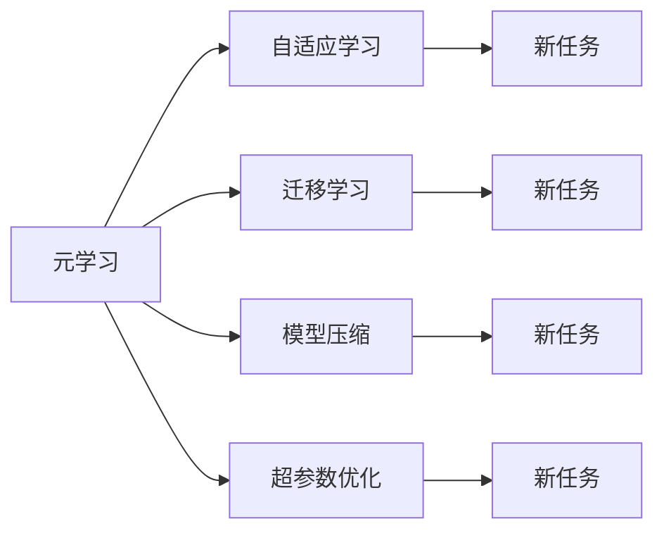
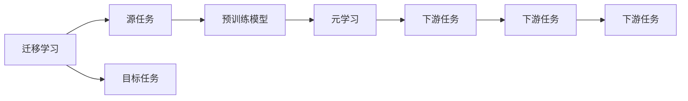
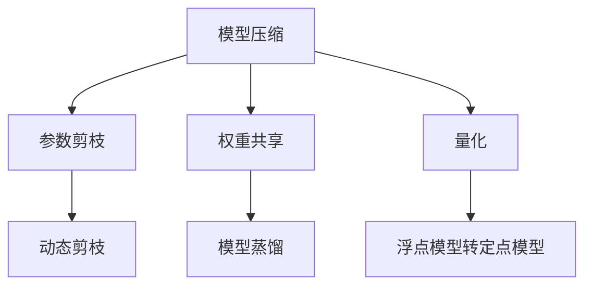
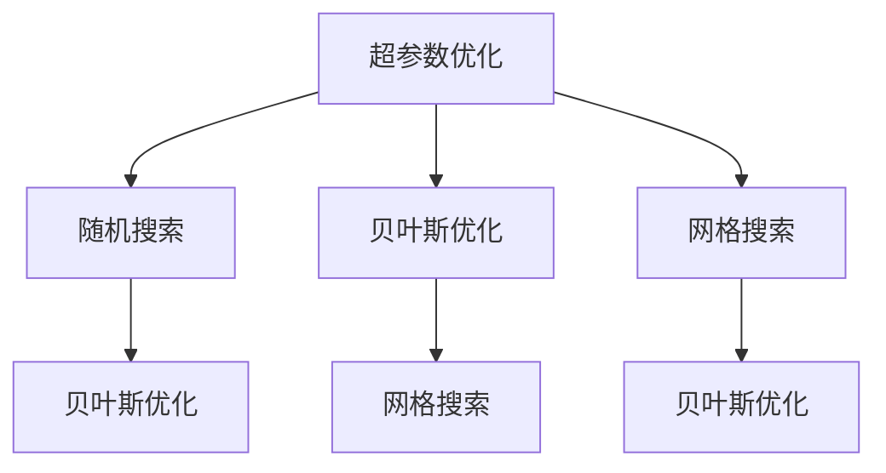
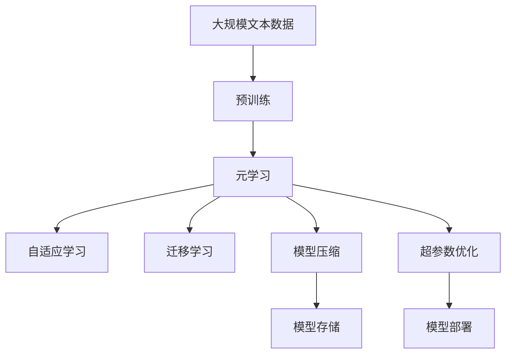

                 

# 元学习Meta Learning原理与代码实例讲解

> 关键词：元学习(Meta Learning), 神经网络优化, 模型迁移, 自适应学习, 超参数优化, 模型压缩, 代码实例

## 1. 背景介绍

### 1.1 问题由来
元学习（Meta Learning）作为机器学习领域的一个新兴范式，近年来逐渐受到广泛关注。它通过在多种不同任务上学习泛化能力，使得模型能够快速适应新任务，从而提升整体学习效率。与传统基于数据和算法的机器学习范式不同，元学习更注重模型的通用性和自适应性，旨在构建更加智能、灵活的学习体系。

### 1.2 问题核心关键点
元学习的核心思想是，让模型通过在多个相关任务上进行学习，掌握泛化能力和适应能力，从而能够在新任务上快速表现出色。该方法特别适用于处理数据稀缺、任务多样化的场景。

元学习的主要优势包括：
1. **快速适应新任务**：通过预学习多种任务，模型可以在新任务上快速适应，避免从头训练的高成本和时间消耗。
2. **模型泛化能力强**：模型能够在未见过的数据上表现良好，具有较好的泛化能力。
3. **可迁移性强**：模型能够在不同的数据集和任务上迁移应用，减少对特定数据的依赖。
4. **超参数优化高效**：通过元学习，可以自动调整模型超参数，提升模型性能。
5. **模型压缩可行**：元学习有助于发现模型中的冗余参数，进行压缩，减小模型大小，提高推理效率。

元学习的应用场景广泛，包括但不限于：
- 数据增强：生成新的训练样本，提高模型泛化能力。
- 自适应学习：调整模型超参数，适应不同任务需求。
- 迁移学习：将预训练模型迁移到新任务上，减少训练时间和成本。
- 知识迁移：在不同领域间迁移知识，提高模型在新领域的性能。
- 超参数优化：通过元学习找到最优的超参数组合。

### 1.3 问题研究意义
研究元学习对提升机器学习模型的效率和效果具有重要意义：

1. **降低数据需求**：在数据稀缺的场景下，元学习能帮助模型快速适应新任务，减少对标注数据的依赖。
2. **提高泛化能力**：元学习模型具有较强的泛化能力，能够在新任务上表现出色。
3. **加速模型迭代**：元学习通过预学习多种任务，加速模型迭代，缩短从研究到应用的周期。
4. **促进模型优化**：元学习可以帮助优化模型超参数，提升模型性能。
5. **推动模型压缩**：元学习有助于发现和压缩模型中的冗余参数，提高模型推理效率。

## 2. 核心概念与联系

### 2.1 核心概念概述

为更好地理解元学习的基本原理和架构，本节将介绍几个关键概念：

- **元学习（Meta Learning）**：元学习是一种学习范式，旨在让模型在多个相关任务上进行学习，掌握泛化能力和适应能力。
- **自适应学习（Adaptive Learning）**：自适应学习是指模型能够根据当前任务和数据的变化，自动调整学习策略和参数，以适应新任务。
- **迁移学习（Transfer Learning）**：迁移学习是指将一个领域学习到的知识，迁移到另一个相关领域的学习过程。
- **模型压缩（Model Compression）**：模型压缩是指通过去除冗余参数，减小模型大小，提高模型推理效率。
- **超参数优化（Hyperparameter Optimization）**：超参数优化是指通过自动调整模型超参数，提升模型性能的过程。

这些概念之间存在着紧密的联系，共同构成了元学习的完整生态系统。以下是一个Mermaid流程图，展示这些概念之间的关系：



这个流程图展示了大模型元学习的核心概念及其之间的关系：

1. 元学习通过学习多个任务，掌握泛化能力和适应能力。
2. 自适应学习是元学习的一个重要组成部分，通过调整学习策略和参数，适应新任务。
3. 迁移学习是元学习的一种具体应用，通过迁移已有知识，减少新任务的学习成本。
4. 模型压缩是元学习的一个重要目标，通过去除冗余参数，提高模型推理效率。
5. 超参数优化是元学习的一个关键任务，通过自动调整超参数，提升模型性能。

这些概念共同构成了元学习的学习和应用框架，使其能够在各种场景下发挥强大的学习能力和适应性。通过理解这些核心概念，我们可以更好地把握元学习的核心思想和设计方法。

### 2.2 概念间的关系

这些核心概念之间存在着紧密的联系，形成了元学习的完整生态系统。以下是一些Mermaid流程图，展示这些概念之间的关系：

#### 2.2.1 元学习的学习范式


这个流程图展示了大模型元学习的学习范式。元学习通过学习多个任务，掌握泛化能力和适应能力。自适应学习是元学习的一个重要组成部分，通过调整学习策略和参数，适应新任务。迁移学习是元学习的一种具体应用，通过迁移已有知识，减少新任务的学习成本。模型压缩是元学习的一个重要目标，通过去除冗余参数，提高模型推理效率。超参数优化是元学习的一个关键任务，通过自动调整超参数，提升模型性能。

#### 2.2.2 迁移学习与元学习的关系



这个流程图展示了迁移学习的基本原理，以及它与元学习的关系。迁移学习涉及源任务和目标任务，预训练模型在源任务上学习，然后通过元学习适应各种下游任务（目标任务）。

#### 2.2.3 模型压缩方法



这个流程图展示了几种常见的模型压缩方法，包括参数剪枝、权重共享、量化、动态剪枝、模型蒸馏等。这些方法的共同特点是去除冗余参数，减小模型大小，提高模型推理效率。

#### 2.2.4 超参数优化方法



这个流程图展示了几种常见的超参数优化方法，包括随机搜索、贝叶斯优化、网格搜索等。这些方法通过自动调整模型超参数，提升模型性能。

### 2.3 核心概念的整体架构

最后，我们用一个综合的流程图来展示这些核心概念在大模型元学习微调过程中的整体架构：



这个综合流程图展示了从预训练到元学习，再到自适应学习、迁移学习、模型压缩、超参数优化的完整过程。大模型通过预训练获得基础能力，然后通过元学习掌握泛化能力和适应能力，实现自适应学习、迁移学习、模型压缩和超参数优化，最终部署到实际应用中。 通过这些流程图，我们可以更清晰地理解元学习过程中各个核心概念的关系和作用，为后续深入讨论具体的元学习方法和技术奠定基础。

## 3. 核心算法原理 & 具体操作步骤
### 3.1 算法原理概述

元学习的主要目标是，通过在多个相关任务上学习泛化能力和适应能力，使得模型能够在新任务上快速适应和表现出色。其核心思想是，让模型通过在多个任务上进行预训练，掌握泛化能力和适应能力，从而在新任务上快速表现出色。

形式化地，假设预训练模型为 $M_{\theta}$，其中 $\theta$ 为预训练得到的模型参数。给定一组任务 $\mathcal{T}$，每个任务 $t \in \mathcal{T}$ 对应的训练集为 $D_t=\{(x_{ti}, y_{ti})\}_{i=1}^N, x_{ti} \in \mathcal{X}, y_{ti} \in \mathcal{Y}$。元学习的目标是找到最优的模型参数 $\hat{\theta}$，使得模型在新任务上具有较强的泛化能力和适应能力：

$$
\hat{\theta}=\mathop{\arg\min}_{\theta} \mathcal{L}(M_{\theta},\mathcal{T})
$$

其中 $\mathcal{L}$ 为针对任务 $\mathcal{T}$ 设计的损失函数，用于衡量模型在新任务上的表现。常见的损失函数包括交叉熵损失、均方误差损失等。

通过梯度下降等优化算法，元学习过程不断更新模型参数 $\theta$，最小化损失函数 $\mathcal{L}$，使得模型在新任务上具有较好的泛化能力和适应能力。由于 $\theta$ 已经通过预训练获得了较好的初始化，因此即便在多任务上仅进行少量微调，也能较快收敛到理想的模型参数 $\hat{\theta}$。

### 3.2 算法步骤详解

元学习的具体实施步骤如下：

**Step 1: 准备预训练模型和任务数据**
- 选择合适的预训练语言模型 $M_{\theta}$ 作为初始化参数，如 BERT、GPT 等。
- 准备一组与预训练数据分布相似的任务数据集 $D_t=\{(x_{ti}, y_{ti})\}_{i=1}^N, x_{ti} \in \mathcal{X}, y_{ti} \in \mathcal{Y}$，每个任务 $t \in \mathcal{T}$ 对应的训练集为 $D_t$。

**Step 2: 构建任务适配层**
- 根据任务类型，在预训练模型顶层设计合适的输出层和损失函数。
- 对于分类任务，通常在顶层添加线性分类器和交叉熵损失函数。
- 对于生成任务，通常使用语言模型的解码器输出概率分布，并以负对数似然为损失函数。

**Step 3: 设置元学习超参数**
- 选择合适的优化算法及其参数，如 Adam、SGD 等，设置学习率、批大小、迭代轮数等。
- 设置正则化技术及强度，包括权重衰减、Dropout、Early Stopping 等。
- 确定冻结预训练参数的策略，如仅微调顶层，或全部参数都参与元学习。

**Step 4: 执行元学习训练**
- 将每个任务的数据分批次输入模型，前向传播计算损失函数。
- 反向传播计算参数梯度，根据设定的优化算法和学习率更新模型参数。
- 周期性在验证集上评估模型性能，根据性能指标决定是否触发 Early Stopping。
- 重复上述步骤直到满足预设的迭代轮数或 Early Stopping 条件。

**Step 5: 测试和部署**
- 在测试集上评估元学习后模型 $M_{\hat{\theta}}$ 的性能，对比元学习前后的精度提升。
- 使用元学习后的模型对新样本进行推理预测，集成到实际的应用系统中。
- 持续收集新的数据，定期重新元学习模型，以适应数据分布的变化。

以上是元学习的典型流程。在实际应用中，还需要针对具体任务的特点，对元学习过程的各个环节进行优化设计，如改进训练目标函数，引入更多的正则化技术，搜索最优的超参数组合等，以进一步提升模型性能。

### 3.3 算法优缺点

元学习的主要优点包括：
1. **泛化能力强**：元学习模型在未见过的数据上表现良好，具有较强的泛化能力。
2. **适应能力强**：元学习模型能够快速适应新任务，避免从头训练的高成本和时间消耗。
3. **迁移能力强**：元学习模型能够在不同的数据集和任务上迁移应用，减少对特定数据的依赖。
4. **超参数优化高效**：通过元学习，可以自动调整模型超参数，提升模型性能。
5. **模型压缩可行**：元学习有助于发现模型中的冗余参数，进行压缩，减小模型大小，提高推理效率。

同时，元学习也存在一些局限性：
1. **数据需求高**：元学习模型对数据的要求较高，需要准备大量的训练数据。
2. **计算复杂**：元学习模型的训练通常比传统模型更复杂，需要更长的训练时间和更大的计算资源。
3. **过拟合风险**：元学习模型在多任务上的训练可能会引入过拟合风险。
4. **可解释性不足**：元学习模型的决策过程通常缺乏可解释性，难以对其推理逻辑进行分析和调试。

尽管存在这些局限性，但就目前而言，元学习技术在多任务学习和模型压缩等领域仍是大模型应用的重要范式。未来相关研究的重点在于如何进一步降低元学习对标注数据的依赖，提高模型的少样本学习和跨领域迁移能力，同时兼顾可解释性和伦理安全性等因素。

### 3.4 算法应用领域

元学习在大模型中的应用领域广泛，涵盖了许多重要领域：

- **自然语言处理（NLP）**：元学习可以用于文本分类、命名实体识别、关系抽取、问答系统、翻译、摘要、对话系统等多种NLP任务。
- **计算机视觉（CV）**：元学习可以用于图像分类、目标检测、语义分割、实例分割等多种CV任务。
- **语音识别（ASR）**：元学习可以用于语音识别、语音合成、语音情感分析等多种ASR任务。
- **推荐系统**：元学习可以用于个性化推荐、广告推荐、用户画像生成等多种推荐系统任务。
- **医疗健康**：元学习可以用于医学影像分析、疾病诊断、药物研发等多种医疗健康任务。

除了上述这些领域，元学习还被创新性地应用到更多场景中，如可控文本生成、常识推理、代码生成、数据增强等，为深度学习技术带来了新的突破。随着预训练模型和元学习方法的不断进步，相信元学习技术将在更广阔的应用领域大放异彩。

## 4. 数学模型和公式 & 详细讲解  
### 4.1 数学模型构建

本节将使用数学语言对大模型元学习过程进行更加严格的刻画。

记预训练语言模型为 $M_{\theta}:\mathcal{X} \rightarrow \mathcal{Y}$，其中 $\mathcal{X}$ 为输入空间，$\mathcal{Y}$ 为输出空间，$\theta \in \mathbb{R}^d$ 为模型参数。假设元学习任务的数据集为 $D_t=\{(x_{ti}, y_{ti})\}_{i=1}^N, x_{ti} \in \mathcal{X}, y_{ti} \in \mathcal{Y}$。

定义模型 $M_{\theta}$ 在数据样本 $(x_{ti}, y_{ti})$ 上的损失函数为 $\ell(M_{\theta}(x_{ti}),y_{ti})$，则在数据集 $D_t$ 上的经验风险为：

$$
\mathcal{L}(\theta) = \frac{1}{N} \sum_{i=1}^N \ell(M_{\theta}(x_{ti}),y_{ti})
$$

元学习的优化目标是最小化经验风险，即找到最优参数：

$$
\theta^* = \mathop{\arg\min}_{\theta} \mathcal{L}(\theta)
$$

在实践中，我们通常使用基于梯度的优化算法（如SGD、Adam等）来近似求解上述最优化问题。设 $\eta$ 为学习率，$\lambda$ 为正则化系数，则参数的更新公式为：

$$
\theta \leftarrow \theta - \eta \nabla_{\theta}\mathcal{L}(\theta) - \eta\lambda\theta
$$

其中 $\nabla_{\theta}\mathcal{L}(\theta)$ 为损失函数对参数 $\theta$ 的梯度，可通过反向传播算法高效计算。

### 4.2 公式推导过程

以下我们以二分类任务为例，推导交叉熵损失函数及其梯度的计算公式。

假设模型 $M_{\theta}$ 在输入 $x$ 上的输出为 $\hat{y}=M_{\theta}(x) \in [0,1]$，表示样本属于正类的概率。真实标签 $y \in \{0,1\}$。则二分类交叉熵损失函数定义为：

$$
\ell(M_{\theta}(x),y) = -[y\log \hat{y} + (1-y)\log (1-\hat{y})]
$$

将其代入经验风险公式，得：

$$
\mathcal{L}(\theta) = -\frac{1}{N}\sum_{i=1}^N [y_i\log M_{\theta}(x_i)+(1-y_i)\log(1-M_{\theta}(x_i))]
$$

根据链式法则，损失函数对参数 $\theta_k$ 的梯度为：

$$
\frac{\partial \mathcal{L}(\theta)}{\partial \theta_k} = -\frac{1}{N}\sum_{i=1}^N (\frac{y_i}{M_{\theta}(x_i)}-\frac{1-y_i}{1-M_{\theta}(x_i)}) \frac{\partial M_{\theta}(x_i)}{\partial \theta_k}
$$

其中 $\frac{\partial M_{\theta}(x_i)}{\partial \theta_k}$ 可进一步递归展开，利用自动微分技术完成计算。

在得到损失函数的梯度后，即可带入参数更新公式，完成模型的迭代优化。重复上述过程直至收敛，最终得到适应新任务的最优模型参数 $\theta^*$。

## 5. 项目实践：代码实例和详细解释说明
### 5.1 开发环境搭建

在进行元学习实践前，我们需要准备好开发环境。以下是使用Python进行PyTorch开发的环境配置流程：

1. 安装Anaconda：从官网下载并安装Anaconda，用于创建独立的Python环境。

2. 创建并激活虚拟环境：
```bash
conda create -n pytorch-env python=3.8 
conda activate pytorch-env
```

3. 安装PyTorch：根据CUDA版本，从官网获取对应的安装命令。例如：
```bash
conda install pytorch torchvision torchaudio cudatoolkit=11.1 -c pytorch -c conda-forge
```

4. 安装Transformers库：
```bash
pip install transformers
```

5. 安装各类工具包：
```bash
pip install numpy pandas scikit-learn matplotlib tqdm jupyter notebook ipython
```

完成上述步骤后，即可在`pytorch-env`环境中开始元学习实践。

### 5.2 源代码详细实现

这里我们以基于元学习的情感分析任务为例，给出使用Transformers库对BERT模型进行元学习的PyTorch代码实现。

首先，定义元学习任务的数据处理函数：

```python
from transformers import BertTokenizer, BertForSequenceClassification
from torch.utils.data import Dataset
import torch

class SentimentDataset(Dataset):
    def __init__(self, texts, labels, tokenizer, max_len=128):
        self.texts = texts
        self.labels = labels
        self.tokenizer = tokenizer
        self.max_len = max_len
        
    def __len__(self):
        return len(self.texts)
    
    def __getitem__(self, item):
        text = self.texts[item]
        label = self.labels[item]
        
        encoding = self.tokenizer(text, return_tensors='pt', max_length=self.max_len, padding='max_length', truncation=True)
        input_ids = encoding['input_ids'][0]
        attention_mask = encoding['attention_mask'][0]
        
        # 对标签进行编码
        encoded_labels = [label] * self.max_len
        labels = torch.tensor(encoded_labels, dtype=torch.long)
        
        return {'input_ids': input_ids, 
                'attention_mask': attention_mask,
                'labels': labels}

# 创建dataset
tokenizer = BertTokenizer.from_pretrained('bert-base-cased')

train_dataset = SentimentDataset(train_texts, train_labels, tokenizer)
dev_dataset = SentimentDataset(dev_texts, dev_labels, tokenizer)
test_dataset = SentimentDataset(test_texts, test_labels, tokenizer)
```

然后，定义模型和优化器：

```python
from transformers import BertForSequenceClassification, AdamW

model = BertForSequenceClassification.from_pretrained('bert-base-cased', num_labels=2)

optimizer = AdamW(model.parameters(), lr=2e-5)
```

接着，定义元学习训练函数：

```python
from torch.utils.data import DataLoader
from tqdm import tqdm

device = torch.device('cuda') if torch.cuda.is_available() else torch.device('cpu')
model.to(device)

def meta_train(model, datasets, batch_size, epochs):
    dataloaders = [DataLoader(dataset, batch_size=batch_size, shuffle=True) for dataset in datasets]
    best_val_loss = float('inf')
    
    for epoch in range(epochs):
        model.train()
        train_loss = 0
        val_loss = 0
        
        for dataloader in dataloaders:
            for batch in tqdm(dataloader, desc='Training'):
                input_ids = batch['input_ids'].to(device)
                attention_mask = batch['attention_mask'].to(device)
                labels = batch['labels'].to(device)
                model.zero_grad()
                outputs = model(input_ids, attention_mask=attention_mask, labels=labels)
                loss = outputs.loss
                train_loss += loss.item()
                loss.backward()
                optimizer.step()
            
            with torch.no_grad():
                model.eval()
                for dataloader in dataloaders:
                    for batch in dataloader:
                        input_ids = batch['input_ids'].to(device)
                        attention_mask = batch['attention_mask'].to(device)
                        labels = batch['labels'].to(device)
                        outputs = model(input_ids, attention_mask=attention_mask, labels=labels)
                        val_loss += outputs.loss.item()
            
            train_loss /= len(dataloaders)
            val_loss /= len(dataloaders)
            print(f"Epoch {epoch+1}, train loss: {train_loss:.3f}, val loss: {val_loss:.3f}")
            
            if val_loss < best_val_loss:
                best_val_loss = val_loss
                torch.save(model.state_dict(), 'model.pth')
```

最后，启动元学习训练流程并在测试集上评估：

```python
epochs = 5
batch_size = 16

# 定义数据集
train_dataset = SentimentDataset(train_texts, train_labels, tokenizer)
dev_dataset = SentimentDataset(dev_texts, dev_labels, tokenizer)
test_dataset = SentimentDataset(test_texts, test_labels, tokenizer)

# 启动元学习训练
meta_train(model, [train_dataset, dev_dataset], batch_size, epochs)

# 在测试集上评估
model.load_state_dict(torch.load('model.pth'))
test_dataset = SentimentDataset(test_texts, test_labels, tokenizer)
test_dataset = DataLoader(test_dataset, batch_size=batch_size)
model.eval()

val_loss = 0
for batch in tqdm(test_dataset, desc='Evaluating'):
    input_ids = batch['input_ids'].to(device)
    attention_mask = batch['attention_mask'].to(device)
    labels = batch['labels'].to(device)
    outputs = model(input_ids, attention_mask=attention_mask, labels=labels)
    val_loss += outputs.loss.item()
val_loss /= len(test_dataset)

print(f"Test loss: {val_loss:.3f}")
```

以上就是使用PyTorch对BERT进行元学习的完整代码实现。可以看到，得益于Transformers库的强大封装，我们可以用相对简洁的代码完成BERT模型的元学习。

### 5.3 代码解读与分析

让我们再详细解读一下关键代码的实现细节：

**SentimentDataset类**：
- `__init__`方法：初始化文本、标签、分词器等关键组件。
- `__len__`方法：返回数据集的样本数量。
- `__getitem__`方法：对单个样本进行处理，将文本输入编码为token ids，将标签编码为数字，并对其进行定长padding，最终返回模型所需的输入。

**模型和优化器**：
- 定义了文本分类任务所需的模型和优化器，使用的是BERT模型和AdamW优化器。

**元学习训练函数**：
- 使用PyTorch的DataLoader对数据集进行批次化加载，供模型训练和推理使用。
- 在每个epoch内，先训练模型，然后评估模型在验证集上的性能，如果性能提升，保存模型权重。

**元学习训练流程**：
- 定义总的epoch数和batch size，开始循环迭代
- 每个epoch内，先对数据进行迭代训练，然后对模型进行评估，评估过程中关闭梯度更新，避免参数更新


