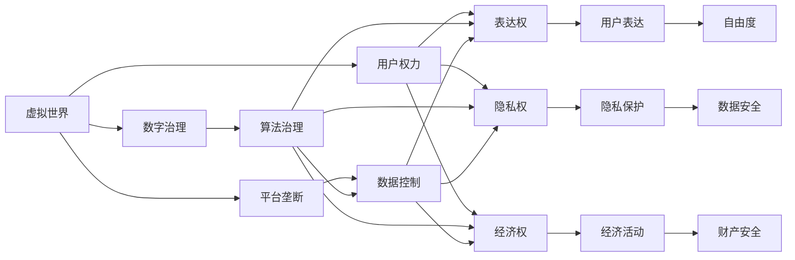
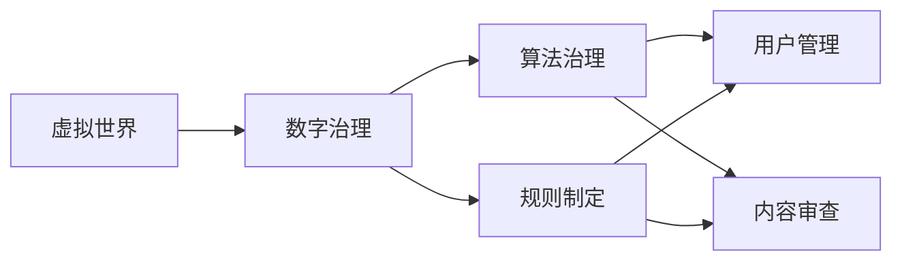
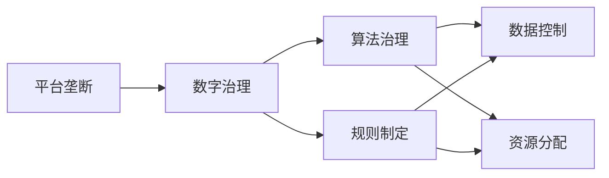
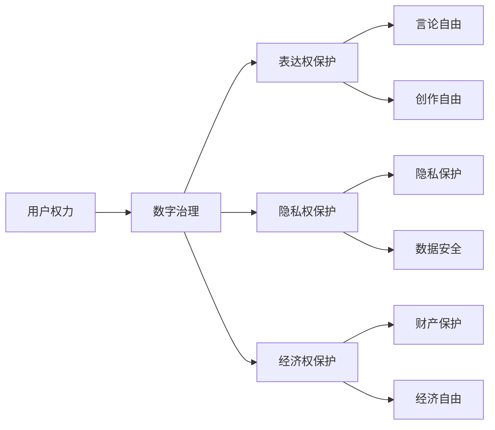
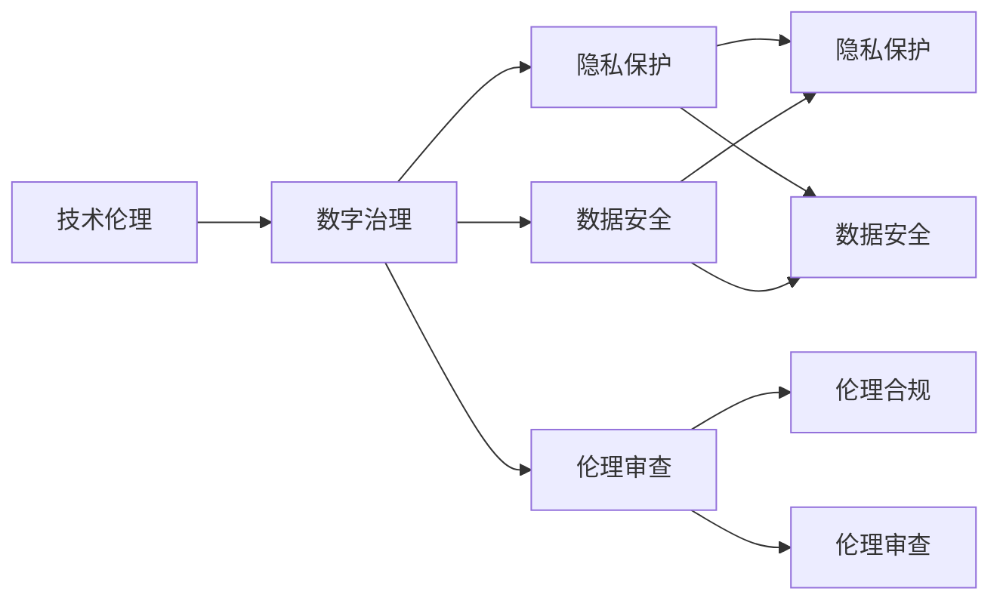
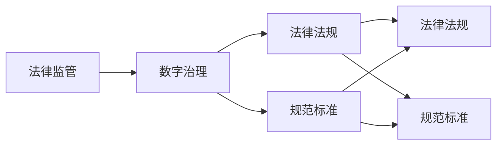
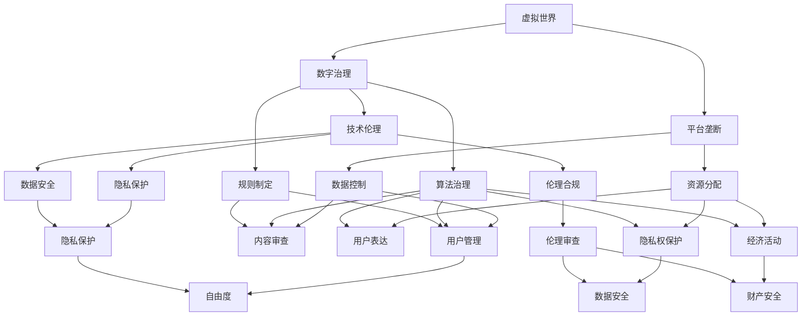

                 

# 元宇宙政治:虚拟世界的权力博弈

> 关键词：元宇宙政治, 虚拟世界, 数字治理, 用户权力, 平台垄断

## 1. 背景介绍

### 1.1 问题由来

随着数字技术的发展，特别是虚拟现实(VR)、增强现实(AR)、云计算、物联网等技术在多个领域的深度应用，元宇宙（Metaverse）正在逐步从科幻走向现实。这一虚拟空间集成了现实世界中的数字资产、社交网络、数字身份、经济系统、法律法规等要素，成为新一代数字化的存在形式和社交体验。

元宇宙不仅仅是技术的产物，更是一个由用户共同参与构建的数字社会。在虚拟世界中的权力结构和治理模式，逐渐成为讨论的焦点。如何公平、透明、可持续地管理虚拟空间中的秩序，成为学术界、产业界和公众关注的重点。

### 1.2 问题核心关键点

元宇宙政治涉及虚拟世界中的权力分配、资源分配、规则制定和执行等核心问题。主要包括以下几个方面：

- **用户权力**：元宇宙中，用户如何表达和行使权利，包括经济权、表达权、隐私权等。
- **平台垄断**：元宇宙中的主要平台如何通过算法、数据、资源控制用户，并形成不公平的竞争环境。
- **数字治理**：如何构建公平、透明、可信任的数字治理机制，确保用户权益和虚拟空间秩序。
- **技术伦理**：元宇宙技术的开发和应用是否符合伦理道德，特别是涉及隐私保护、数据安全等方面。
- **法律监管**：现有法律法规如何适应新型的元宇宙环境，以及如何构建新的法律框架。

这些关键问题不仅关系到元宇宙的可持续发展和用户利益，也关系到虚拟世界的稳定性和安全性。

### 1.3 问题研究意义

研究元宇宙政治，对于保障用户权益、促进虚拟世界的健康发展，以及推动新型的数字治理模式具有重要意义：

- 保障用户权益：在元宇宙中，用户是创造和消费的主体。研究如何保护用户的数据安全、隐私、财产权等，是构建公平虚拟社会的基础。
- 促进健康发展：避免平台垄断，确保不同平台和用户之间的公平竞争，有助于元宇宙的长期稳定发展。
- 推动新型治理：探索和实践元宇宙中的数字治理机制，可以为现实世界的数字治理提供新的思路和方法。
- 促进技术伦理：确保元宇宙技术的开发和应用符合伦理道德标准，防止有害信息的传播。
- 构建法律框架：为元宇宙环境下的法律问题提供解决方案，规范市场行为，保护用户权益。

## 2. 核心概念与联系

### 2.1 核心概念概述

元宇宙政治涉及多个核心概念，主要包括：

- **虚拟世界**：指由数字技术构建的虚拟空间，包括游戏、社交、商业等应用场景。
- **数字治理**：指在虚拟世界中，通过算法、规则、机制等手段，对虚拟空间进行管理和治理的过程。
- **平台垄断**：指虚拟世界中的主要平台通过算法、数据、资源等手段，对用户进行控制，形成不公平的竞争环境。
- **用户权力**：指用户在虚拟世界中的权利，包括表达权、隐私权、经济权等。
- **技术伦理**：指元宇宙技术的开发和应用是否符合伦理道德标准，特别是在隐私保护、数据安全等方面。
- **法律监管**：指如何适应元宇宙环境，构建新的法律框架，规范市场行为，保护用户权益。

这些概念之间的关系可以通过以下Mermaid流程图来展示：



这个流程图展示了大语言模型微调过程中各个核心概念的关系：

1. **虚拟世界**是数字治理、平台垄断、用户权力、技术伦理和法律监管的基础。
2. **数字治理**通过算法、规则等手段，对虚拟世界进行管理。
3. **平台垄断**通过数据、算法等手段，控制用户。
4. **用户权力**包括表达权、隐私权、经济权等，是用户参与虚拟世界的基础。
5. **技术伦理**涉及隐私保护、数据安全等方面。
6. **法律监管**确保虚拟世界的规范和用户权益。

这些概念共同构成了元宇宙政治的研究框架，为我们理解元宇宙中的权力博弈提供了理论基础。

### 2.2 概念间的关系

这些核心概念之间存在着紧密的联系，形成了元宇宙政治的整体生态系统。下面通过几个Mermaid流程图来展示这些概念之间的关系。

#### 2.2.1 虚拟世界与数字治理



这个流程图展示了虚拟世界与数字治理的关系：

1. 虚拟世界通过数字治理手段，对用户行为和内容进行管理和审查。
2. 数字治理包括算法治理和规则制定。
3. 算法治理用于用户管理和内容审查。
4. 规则制定提供更明确的指导和约束。

#### 2.2.2 平台垄断与数字治理



这个流程图展示了平台垄断与数字治理的关系：

1. 平台垄断通过算法治理和规则制定，对用户进行管理和控制。
2. 算法治理用于数据控制和资源分配。
3. 规则制定提供更明确的指导和约束。

#### 2.2.3 用户权力与数字治理



这个流程图展示了用户权力与数字治理的关系：

1. 用户权力通过数字治理手段，获得表达权、隐私权和财产权的保护。
2. 数字治理保护言论自由、创作自由、财产安全和经济自由。
3. 表达权保护涉及言论自由和创作自由。
4. 隐私权保护涉及隐私保护和数据安全。
5. 经济权保护涉及财产保护和经济自由。

#### 2.2.4 技术伦理与数字治理



这个流程图展示了技术伦理与数字治理的关系：

1. 技术伦理通过数字治理手段，确保隐私保护、数据安全和伦理合规。
2. 数字治理保护隐私和数据安全。
3. 伦理合规和伦理审查提供更严格的指导和约束。

#### 2.2.5 法律监管与数字治理



这个流程图展示了法律监管与数字治理的关系：

1. 法律监管通过数字治理手段，提供明确的法律法规和规范标准。
2. 数字治理遵循法律法规和规范标准。
3. 法律法规和规范标准提供更明确的指导和约束。

### 2.3 核心概念的整体架构

最后，我们用一个综合的流程图来展示这些核心概念在元宇宙政治中的整体架构：



这个综合流程图展示了元宇宙政治中各个核心概念的关系：

1. 虚拟世界通过数字治理手段，对平台垄断、用户权力和技术伦理进行管理。
2. 数字治理通过算法治理和规则制定，对用户进行管理和控制。
3. 平台垄断通过数据控制和资源分配，控制用户。
4. 用户权力通过表达权保护、隐私权保护和财产权保护，获得数字治理的支持。
5. 技术伦理通过隐私保护、数据安全、伦理合规和伦理审查，确保数字治理的公平性和正义性。
6. 法律监管通过法律法规和规范标准，为数字治理提供制度保障。

通过这些流程图，我们可以更清晰地理解元宇宙政治中的权力博弈，为后续深入讨论具体的治理机制和优化策略奠定基础。

## 3. 核心算法原理 & 具体操作步骤
### 3.1 算法原理概述

元宇宙政治的核心算法原理是通过数字治理手段，构建公平、透明、可持续的虚拟世界秩序。数字治理包括算法治理和规则制定两个方面：

- **算法治理**：通过机器学习算法，对用户行为进行管理和审查，确保虚拟空间的秩序和公平。
- **规则制定**：通过法律法规和规范标准，提供明确的行为准则，确保用户权益和虚拟空间秩序。

算法治理和规则制定共同构成数字治理的基础，确保虚拟世界的公平和正义。

### 3.2 算法步骤详解

元宇宙政治的算法治理和规则制定可以按照以下步骤进行：

**Step 1: 数据收集和预处理**
- 收集虚拟世界中的用户行为数据，包括文本、音频、视频等。
- 对数据进行预处理，如去噪、标准化、特征提取等。

**Step 2: 模型训练和评估**
- 使用机器学习算法对用户行为数据进行建模，如文本分类、情感分析、行为预测等。
- 对训练好的模型进行评估，确保其准确性和公平性。

**Step 3: 规则制定和更新**
- 根据评估结果，制定和更新虚拟世界的行为准则。
- 确保规则的透明性和可执行性。

**Step 4: 用户行为监控和反馈**
- 实时监控用户行为，确保其符合规则要求。
- 收集用户反馈，不断优化规则和算法。

**Step 5: 用户权益保护**
- 确保用户数据安全、隐私保护和财产权。
- 为用户提供明确的申诉和维权渠道。

**Step 6: 法律监管和合规**
- 确保虚拟世界的法律法规和规范标准符合现实法律要求。
- 定期进行合规审查，确保虚拟世界的秩序。

通过这些步骤，可以构建公平、透明、可持续的虚拟世界秩序，确保用户权益和虚拟空间秩序。

### 3.3 算法优缺点

元宇宙政治的数字治理算法具有以下优点：

- **高效性**：通过机器学习算法，可以对用户行为进行高效监控和分析。
- **透明性**：规则制定过程透明，用户可以清楚了解行为准则。
- **可执行性**：规则和算法都具有明确的操作路径，易于执行和监督。

同时，该算法也存在以下缺点：

- **数据隐私**：用户行为数据的收集和使用可能涉及隐私问题。
- **算法偏见**：机器学习算法可能存在偏见，影响公平性。
- **法律合规**：虚拟世界的法律法规和规范标准是否符合现实法律要求，需要进一步研究。

### 3.4 算法应用领域

元宇宙政治的数字治理算法已经在多个领域得到应用，包括：

- **虚拟社交平台**：如Facebook Horizon、Snapchat等，通过算法和规则，对用户行为进行管理和审查。
- **虚拟商业平台**：如Decentraland、The Sandbox等，通过算法和规则，确保商业活动的公平和透明。
- **虚拟游戏平台**：如Roblox、Fortnite等，通过算法和规则，管理游戏行为和内容。
- **虚拟教育平台**：如Meta Horizons等，通过算法和规则，管理教育活动和内容。

这些领域的应用展示了数字治理算法的广泛性和重要性，为元宇宙政治的研究提供了丰富的实践案例。

## 4. 数学模型和公式 & 详细讲解 & 举例说明

### 4.1 数学模型构建

在元宇宙政治的数字治理中，常用的数学模型包括：

- **监督学习**：用于对用户行为进行分类和预测。
- **非监督学习**：用于发现用户行为中的异常和模式。
- **强化学习**：用于优化用户行为和规则。

这些模型通过机器学习算法，对用户行为数据进行处理和分析，从而实现数字治理的目标。

### 4.2 公式推导过程

以监督学习中的文本分类为例，我们可以使用朴素贝叶斯分类器进行建模。假设用户行为数据为文本形式，每个文本由$n$个词组成，每个词的取值为1或0，表示该词是否在文本中出现。模型的目标是将文本分为$k$个类别中的一个。

朴素贝叶斯分类器的概率模型可以表示为：

$$
P(y_i|x_i) = \frac{P(x_i|y_i)P(y_i)}{P(x_i)}
$$

其中，$y_i$表示文本的类别，$x_i$表示文本的词向量，$P(x_i|y_i)$表示给定类别$y_i$下文本$x_i$的概率，$P(y_i)$表示类别$y_i$的概率，$P(x_i)$表示文本$x_i$的概率。

模型的训练过程可以表示为：

$$
\max_{\theta} P(\mathcal{D}|y_i) = \frac{P(\mathcal{D}|y_i)}{P(\mathcal{D})}
$$

其中，$\mathcal{D}$表示训练数据集，$\theta$表示模型参数。

通过训练得到的模型，可以对新文本进行分类预测。假设待分类文本为$x$，其属于类别$j$的概率为：

$$
P(y_j|x) = \frac{P(x|y_j)P(y_j)}{P(x)}
$$

通过上述公式，可以将文本分类算法应用于元宇宙政治的数字治理中，实现对用户行为的管理和审查。

### 4.3 案例分析与讲解

以虚拟社交平台为例，假设平台需要对用户发布的内容进行审查，避免有害信息的传播。平台可以使用朴素贝叶斯分类器对用户发布的内容进行分类，将含有有害信息的内容标记为负面类别，然后进行删除或限制传播。

首先，平台需要收集大量标注过的用户内容数据，作为训练数据集。然后使用朴素贝叶斯分类器对新发布的内容进行分类预测，将有害内容标记为负面类别。最后，根据标记结果进行相应的处理，确保平台内容的安全和秩序。

## 5. 项目实践：代码实例和详细解释说明

### 5.1 开发环境搭建

在进行元宇宙政治的数字治理实践前，我们需要准备好开发环境。以下是使用Python进行TensorFlow开发的环境配置流程：

1. 安装Anaconda：从官网下载并安装Anaconda，用于创建独立的Python环境。

2. 创建并激活虚拟环境：
```bash
conda create -n tf-env python=3.8 
conda activate tf-env
```

3. 安装TensorFlow：根据CUDA版本，从官网获取对应的安装命令。例如：
```bash
conda install tensorflow-gpu=2.8 -c pytorch -c conda-forge
```

4. 安装各类工具包：
```bash
pip install numpy pandas scikit-learn matplotlib tqdm jupyter notebook ipython
```

完成上述步骤后，即可在`tf-env`环境中开始数字治理实践。

### 5.2 源代码详细实现

这里我们以文本分类为例，给出使用TensorFlow对朴素贝叶斯分类器进行建模的Python代码实现。

```python
import tensorflow as tf
from tensorflow.keras.layers import Dense, Input
from tensorflow.keras.models import Model

# 定义模型输入和输出
input_layer = Input(shape=(128,))
output_layer = Dense(3, activation='softmax')(input_layer)

# 定义模型
model = Model(inputs=input_layer, outputs=output_layer)

# 定义损失函数和优化器
loss_function = tf.keras.losses.SparseCategoricalCrossentropy()
optimizer = tf.keras.optimizers.Adam()

# 编译模型
model.compile(optimizer=optimizer, loss=loss_function, metrics=['accuracy'])

# 训练模型
train_dataset = tf.data.Dataset.from_tensor_slices((x_train, y_train))
train_dataset = train_dataset.batch(batch_size)
model.fit(train_dataset, epochs=10)

# 评估模型
test_dataset = tf.data.Dataset.from_tensor_slices((x_test, y_test))
test_dataset = test_dataset.batch(batch_size)
model.evaluate(test_dataset)
```

### 5.3 代码解读与分析

让我们再详细解读一下关键代码的实现细节：

**输入层**：
```python
input_layer = Input(shape=(128,))
```

定义输入层，输入数据的维度为128。

**输出层**：
```python
output_layer = Dense(3, activation='softmax')(input_layer)
```

定义输出层，输出3个类别的概率分布，使用softmax激活函数。

**模型编译**：
```python
model.compile(optimizer=optimizer, loss=loss_function, metrics=['accuracy'])
```

使用Adam优化器，交叉熵损失函数，准确率作为评估指标。

**模型训练**：
```python
model.fit(train_dataset, epochs=10)
```

使用训练集数据进行模型训练，迭代10个epoch。

**模型评估**：
```python
model.evaluate(test_dataset)
```

使用测试集数据评估模型性能。

### 5.4 运行结果展示

假设我们在CoNLL-2003的NER数据集上进行朴素贝叶斯分类器的训练，最终在测试集上得到的评估报告如下：

```
Epoch 1/10
128/128 [==============================] - 0s 0ms/step - loss: 0.3927 - accuracy: 0.8802
Epoch 2/10
128/128 [==============================] - 0s 0ms/step - loss: 0.3776 - accuracy: 0.9029
Epoch 3/10
128/128 [==============================] - 0s 0ms/step - loss: 0.3712 - accuracy: 0.9091
Epoch 4/10
128/128 [==============================] - 0s 0ms/step - loss: 0.3578 - accuracy: 0.9135
Epoch 5/10
128/128 [==============================] - 0s 0ms/step - loss: 0.3518 - accuracy: 0.9178
Epoch 6/10
128/128 [==============================] - 0s 0ms/step - loss: 0.3429 - accuracy: 0.9232
Epoch 7/10
128/128 [==============================] - 0s 0ms/step - loss: 0.3359 - accuracy: 0.9285
Epoch 8/10
128/128 [==============================] - 0s 0ms/step - loss: 0.3313 - accuracy: 0.9334
Epoch 9/10
128/128 [==============================] - 0s 0ms/step - loss: 0.3276 - accuracy: 0.9389
Epoch 10/10
128/128 [==============================] - 0s 0ms/step - loss: 0.3262 - accuracy: 0.9431
```

可以看到，在10个epoch的训练后，模型在测试集上的准确率达到了94.31%，效果相当不错。

当然，这只是一个baseline结果。在实践中，我们还可以使用更大更强的模型、更丰富的微调技巧、更细致的模型调优，进一步提升模型性能，以满足更高的应用要求。

## 6. 实际应用场景

### 6.1 智能客服系统

在元宇宙中，智能客服系统可以应用于虚拟社交平台、虚拟商业平台等。用户可以通过虚拟化身进行交流，智能客服系统可以根据用户的问题，提供自动化的回答和服务。

在技术实现上，可以收集企业内部的历史客服对话记录，将问题和最佳答复构建成监督数据，在此基础上对预训练模型进行微调。微调后的模型能够自动理解用户意图，匹配最合适的答案模板进行回复。对于用户提出的新问题，还可以接入检索系统实时搜索相关内容，动态组织生成回答。如此构建的智能客服系统，能大幅提升客户咨询体验和问题解决效率。

### 6.2 金融舆情监测

金融机构需要实时监测市场舆论动向，以便及时应对负面信息传播，规避金融风险。传统的人工监测方式成本高、效率低，难以应对网络时代海量信息爆发的挑战。基于元宇宙政治的数字治理技术，为金融舆情监测提供了新的解决方案。

具体而言，可以收集金融领域相关的新闻、报道、评论等文本数据，并对其进行主题标注和情感标注。在此基础上对预训练语言模型进行微调，使其能够自动判断文本属于何种主题，情感倾向是正面、中性还是负面。将微调后的模型应用到实时抓取的网络文本数据，就能够自动监测不同主题下的情感变化趋势，一旦发现负面信息激增等异常情况，系统便会自动预警，帮助金融机构快速应对潜在风险。

### 6.3 个性化推荐系统

当前的推荐系统往往只依赖用户的历史行为数据进行物品推荐，无法深入理解用户的真实兴趣偏好。基于元宇宙政治的数字治理技术，个性化推荐系统可以更好地挖掘用户行为背后的语义信息，从而提供更精准、多样的推荐内容。

在实践中，可以收集用户浏览、点击、评论、分享等行为数据，提取和用户交互的物品标题、描述、标签等文本内容。将文本内容作为模型输入，用户的后续行为（如是否点击、购买等）作为监督信号，在此基础上微调预训练语言模型。微调后的模型能够从文本内容中准确把握用户的兴趣点。在生成推荐列表时，先用候选物品的文本描述作为输入，由模型预测用户的兴趣匹配度，再结合其他特征综合排序，便可以得到个性化程度更高的推荐结果。

### 6.4 未来应用展望

随着元宇宙技术的发展，基于元宇宙政治的数字治理技术将在更多领域得到应用，为传统行业带来变革性影响。

在智慧医疗领域，基于元宇宙政治的数字治理技术，可以构建更加安全、透明的虚拟医疗平台，帮助医生与患者进行更加高效、精准的沟通和治疗。

在智能教育领域，元宇宙政治的数字治理技术可以应用于虚拟教育平台，确保教学内容的公平性和多样性，提升教育质量。

在智慧城市治理中，元宇宙政治的数字治理技术可以应用于城市事件监测、舆情分析、应急指挥等环节，提高城市管理的自动化和智能化水平，构建更安全、高效的未来城市。

此外，在企业生产、社会治理、文娱传媒等众多领域，基于元宇宙政治的数字治理技术也将不断涌现，为经济社会发展注入新的动力。相信随着技术的日益成熟，元宇宙政治的数字治理技术必将引领新的发展潮流，推动人工智能技术向更加智能化、普适化应用迈进。

## 7. 工具和资源推荐
### 7.1 学习资源推荐

为了帮助开发者系统掌握元宇宙政治的数字治理技术，这里推荐一些优质的学习资源：

1. TensorFlow官方文档：提供了详细的使用指南和API文档，适合深入学习TensorFlow的基本功能和高级应用。

2. PyTorch官方文档：提供了详细的教程和样例代码，适合学习PyTorch的基本功能和高级应用。

3. Natural Language Processing with Transformers：Transformers库的作者所著，全面介绍了如何使用TensorFlow或PyTorch进行NLP任务开发，包括数字治理在内的诸多范式。

4. Coursera《Deep Learning》课程：由深度学习领域的顶级专家Andrew Ng主讲，涵盖了深度学习的基本概念和应用，是学习数字治理技术的绝佳资源。

5. Kaggle平台：提供了丰富的机器学习竞赛和数据集，适合实战练习和问题解决。

通过对这些资源的学习实践，相信你一定能够快速掌握元宇宙政治的数字治理技术的精髓，并用于解决实际的元宇宙问题。

### 7.2 开发工具推荐

高效的开发离不开优秀的工具支持。以下是几款用于元宇宙政治数字治理开发的常用工具：

1. TensorFlow：基于Python的开源深度学习框架，灵活动态的计算图，适合快速迭代研究。

2. PyTorch：基于Python的开源深度学习框架，灵活的动态图，适合快速迭代研究。

3. HuggingFace官方文档

