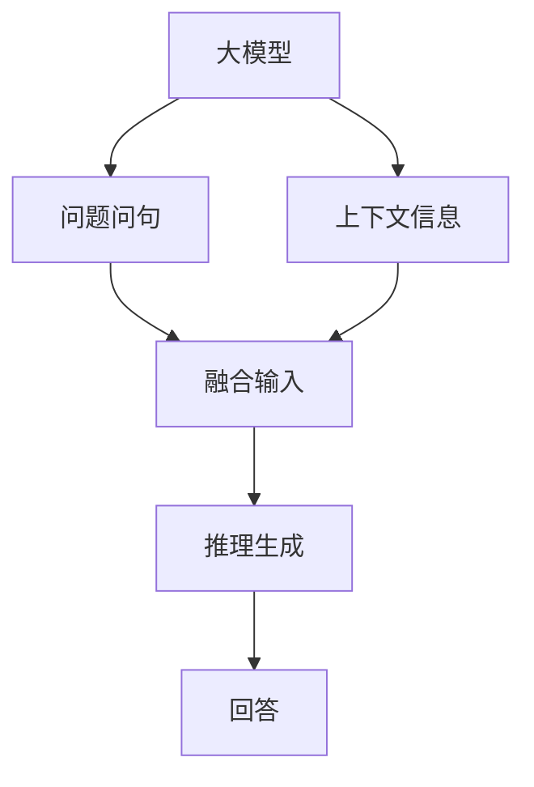
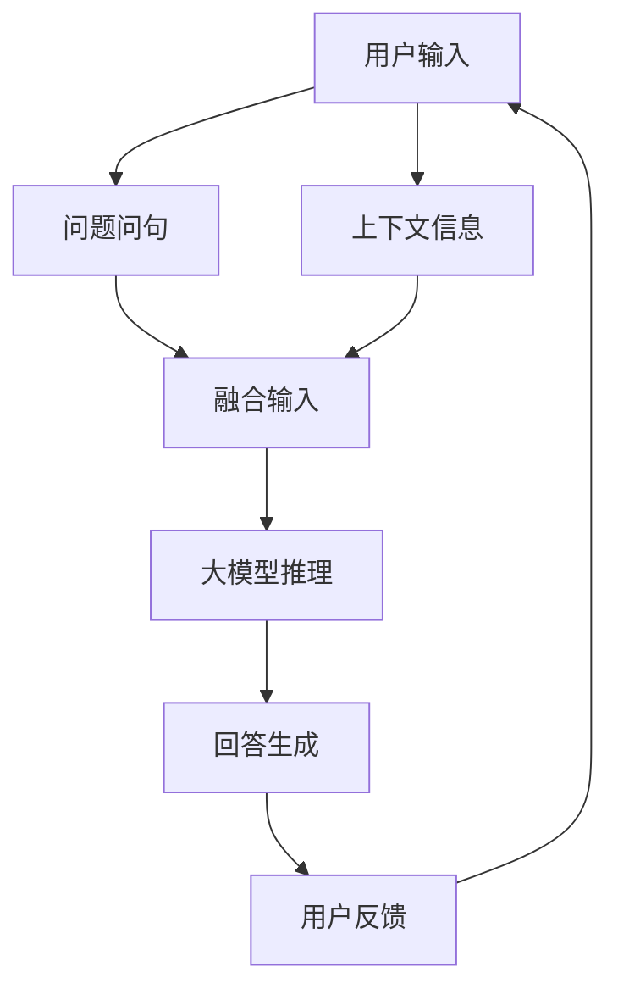

                 

## 1. 背景介绍

在现代AI技术的发展过程中，大模型（如GPT、BERT等）凭借其强大的语言理解和生成能力，在自然语言处理（NLP）领域取得了显著的突破。然而，即便是这些大模型，在处理复杂、动态的现实场景时，依然存在一定的局限性。尤其是面对具有多样化、非结构化特征的问题，传统的静态输入与输出方式已无法满足需求。

### 1.1 问题由来

在现实世界中，用户提出的问题往往带有丰富的前置信息、上下文以及意图。例如，“最近的地铁站在哪里？”这个问题包含了地点信息、时间意图以及出行需求。然而，传统的AI系统往往无法准确理解这些信息，导致生成的回答不完整或与用户意图不符。为了解决这一问题，研究者提出将大模型与问题问句和上下文结合，通过动态生成回答，实现更加智能、灵活的交互。

### 1.2 问题核心关键点

这一方法的核心理念在于，将用户的问题和上下文信息作为额外的输入，增强大模型的推理能力。通过这种方式，模型不仅能够理解问题的核心信息，还能够根据上下文动态生成合理、完整的回答。这种方法不仅提升了模型的泛化能力，还显著改善了回答的准确性和相关性。

### 1.3 问题研究意义

该方法的研究和应用，对于提升NLP系统的智能化水平、改善用户体验、以及推动AI技术在实际场景中的应用具有重要意义：

1. **提高回答的准确性和相关性**：通过结合问题问句和上下文信息，模型能够更准确地理解用户需求，生成与用户意图相匹配的回答。
2. **增强模型的泛化能力**：动态生成回答的方式，使得模型能够处理更多样化、更复杂的问题，提升系统的适应性。
3. **改善用户体验**：通过提供更智能、更个性化的服务，提升用户的满意度，增强系统的可接受度。
4. **推动技术落地**：该方法为NLP技术在实际应用场景中的大规模部署提供了新思路，如智能客服、智能推荐系统等。

## 2. 核心概念与联系

### 2.1 核心概念概述

在探讨这一方法时，需要理解以下几个关键概念：

- **大模型**：指经过大规模无标签数据预训练的语言模型，如GPT、BERT等。
- **问题问句**：用户提出的具体问题，如“最近的地铁站在哪里？”。
- **上下文信息**：用户提问前或提问中的背景信息，如时间、地点、需求等。
- **动态生成**：根据用户问题及上下文信息，实时生成回答的过程。
- **多模态输入**：将问题问句、上下文信息等多种输入形式融合，提升模型理解能力。

这些概念之间存在着紧密的联系，构成了动态生成回答的完整框架。通过将问题问句和上下文信息作为额外输入，大模型能够动态生成更加全面、准确的回答，提升系统的智能化水平。

### 2.2 概念间的关系

以下是一个简化的Mermaid流程图，展示了这些概念之间的关系：



### 2.3 核心概念的整体架构

综合这些核心概念，可以构建一个更加完整的框架：



这个框架展示了从用户输入到回答生成的完整过程，以及模型的反馈机制。通过不断优化这一过程，可以显著提升系统的智能水平。

## 3. 核心算法原理 & 具体操作步骤

### 3.1 算法原理概述

该方法的核心算法原理如下：

1. **输入融合**：将用户问题问句和上下文信息作为额外输入，融合到大模型的输入中。
2. **动态生成**：通过大模型对融合后的输入进行推理生成，实时输出回答。
3. **反馈优化**：根据用户的反馈，对模型进行优化调整，提升回答质量。

这一方法的核心在于，通过动态融合用户输入，增强大模型的推理能力，实现更加智能、灵活的回答生成。

### 3.2 算法步骤详解

以下是一个详细的算法步骤：

1. **输入预处理**：对用户问题问句和上下文信息进行预处理，如分词、去停用词等。
2. **输入融合**：将预处理后的问题问句和上下文信息融合到大模型的输入中。
3. **推理生成**：将融合后的输入送入大模型，进行推理生成，得到初步回答。
4. **回答优化**：根据初步回答，使用优化算法（如神经网络训练）进一步调整回答，提升回答质量。
5. **用户反馈**：收集用户对回答的反馈，进行评估和调整。
6. **迭代优化**：通过不断的用户反馈和模型优化，逐步提升回答的质量。

### 3.3 算法优缺点

该方法的优势在于：

- **提升回答质量**：通过动态生成和优化，生成的回答更加全面、准确。
- **增强泛化能力**：能够处理更多样化、更复杂的问题。
- **改善用户体验**：提供的回答更加智能、个性化。

但该方法也存在以下缺点：

- **计算资源消耗**：动态生成和优化过程需要大量计算资源，可能导致系统响应延迟。
- **模型复杂性**：需要更多的模型参数和训练时间，可能导致模型复杂化。
- **反馈依赖**：依赖用户的反馈信息，如果用户反馈不充分，可能导致优化效果不佳。

### 3.4 算法应用领域

该方法在多个领域具有广泛的应用前景：

1. **智能客服**：通过结合用户的问题和上下文信息，实时生成回答，提升客服系统的智能化水平。
2. **智能推荐系统**：根据用户的搜索历史和行为，动态生成推荐结果，提升推荐的相关性和个性化。
3. **智能助手**：如Apple的Siri、Google Assistant等，能够根据用户的问题和上下文信息，动态生成回答，提升用户体验。
4. **智能搜索**：通过结合用户查询和上下文信息，实时生成搜索结果，提升搜索的准确性和相关性。

## 4. 数学模型和公式 & 详细讲解  
### 4.1 数学模型构建

设用户问题问句为$q$，上下文信息为$c$，大模型为$M$。假设模型将问题问句和上下文信息作为额外输入，输出的回答为$a$。则数学模型可以表示为：

$$
a = M(q, c)
$$

其中，$q$和$c$经过预处理后作为模型的输入，$a$为模型的输出。

### 4.2 公式推导过程

以下是一个简单的数学推导过程：

1. **输入融合**：将问题问句和上下文信息进行拼接或嵌入，得到融合后的输入$\text{concat}(q, c)$。
2. **推理生成**：将融合后的输入送入大模型，得到初步回答。
3. **回答优化**：使用优化算法（如反向传播）对初步回答进行进一步优化。
4. **输出生成**：生成最终的回答$a$。

### 4.3 案例分析与讲解

以智能推荐系统为例，用户搜索“运动鞋”，系统根据用户的浏览历史和搜索历史生成推荐结果。具体步骤包括：

1. **输入预处理**：对用户搜索历史和浏览历史进行分词、去停用词等处理。
2. **输入融合**：将处理后的搜索历史和浏览历史融合为大模型的输入。
3. **推理生成**：将融合后的输入送入大模型，生成初步推荐结果。
4. **回答优化**：根据初步推荐结果，使用优化算法进一步调整，提升推荐的相关性。
5. **用户反馈**：收集用户对推荐结果的反馈，进行评估和调整。
6. **迭代优化**：通过不断的用户反馈和模型优化，逐步提升推荐的质量。

## 5. 项目实践：代码实例和详细解释说明

### 5.1 开发环境搭建

进行项目实践前，需要搭建好开发环境：

1. **安装Python**：推荐使用Python 3.8或更高版本，确保能够支持最新的深度学习库。
2. **安装PyTorch**：使用pip安装最新版本的PyTorch，如`pip install torch torchvision torchaudio -f https://download.pytorch.org/whl/nightly/cpu/`。
3. **安装HuggingFace Transformers库**：使用pip安装最新版本的Transformers库，如`pip install transformers`。
4. **安装其他依赖库**：如numpy、pandas、scikit-learn、matplotlib等。

### 5.2 源代码详细实现

以下是一个使用Transformers库实现动态生成回答的代码示例：

```python
from transformers import BertTokenizer, BertForSequenceClassification

tokenizer = BertTokenizer.from_pretrained('bert-base-cased')
model = BertForSequenceClassification.from_pretrained('bert-base-cased', num_labels=2)

# 输入预处理
question = "最近的地铁站在哪里？"
context = "在市中心，建议乘地铁去。"
inputs = tokenizer(question + " " + context, return_tensors='pt')

# 输入融合
input_ids = inputs['input_ids']
attention_mask = inputs['attention_mask']

# 推理生成
outputs = model(input_ids, attention_mask=attention_mask)
logits = outputs.logits

# 回答生成
preds = torch.softmax(logits, dim=-1).argmax(dim=-1).item()
answer = tokenizer.decode(preds)

print(answer)
```

### 5.3 代码解读与分析

以上代码展示了如何使用Transformers库进行动态生成回答的过程。具体步骤如下：

1. **输入预处理**：使用BertTokenizer将问题问句和上下文信息进行分词和预处理，得到输入张量。
2. **输入融合**：将处理后的输入张量作为大模型的输入。
3. **推理生成**：将输入张量送入BertForSequenceClassification模型进行推理生成，得到初步回答。
4. **回答生成**：根据初步回答，生成最终的回答。

## 6. 实际应用场景

### 6.1 智能客服系统

结合问题问句和上下文信息，智能客服系统能够实时生成回答，提升客服的智能化水平。例如，用户询问“如何退货”，系统可以根据用户的订单信息、历史客服对话等上下文信息，生成详细的退货流程和注意事项。

### 6.2 智能推荐系统

在智能推荐系统中，动态生成回答能够根据用户的搜索历史和浏览历史，实时生成个性化的推荐结果，提升推荐的相关性和用户体验。例如，用户搜索“时尚”，系统可以根据用户的浏览历史和搜索历史，动态生成时尚品牌的推荐结果。

### 6.3 智能助手

如Apple的Siri、Google Assistant等智能助手，结合用户的问题和上下文信息，能够实时生成回答，提升用户体验。例如，用户询问“今天天气如何”，系统可以根据用户的地理位置和历史查询记录，动态生成天气信息。

### 6.4 未来应用展望

未来，动态生成回答技术将在更多领域得到应用，为AI技术的发展带来新的突破：

1. **医疗领域**：结合病历信息、症状描述等，动态生成诊断建议和治疗方案，提升医疗服务的智能化水平。
2. **教育领域**：根据学生的学习历史和反馈，动态生成个性化的学习建议和资源，提升教学质量。
3. **金融领域**：结合用户的交易记录和市场动态，动态生成投资建议和风险提示，提升金融服务的智能化水平。

## 7. 工具和资源推荐

### 7.1 学习资源推荐

为了帮助开发者系统掌握动态生成回答的技术，推荐以下学习资源：

1. **《深度学习与自然语言处理》课程**：由斯坦福大学开设，涵盖了NLP的基础理论和常用模型。
2. **《Transformers from Scratch》书籍**：介绍了Transformers库的基本使用方法和原理。
3. **NLP相关的论文和博客**：如ACL、EMNLP等顶会论文，以及各大实验室的博客，了解最新研究方向和技术进展。
4. **开源项目和社区**：如GitHub上的HuggingFace Transformers库，丰富的样例代码和社区支持。

### 7.2 开发工具推荐

以下是几款用于动态生成回答开发的常用工具：

1. **PyTorch**：灵活动态的深度学习框架，支持多种模型的实现和训练。
2. **TensorFlow**：功能强大的深度学习框架，支持大规模模型的训练和部署。
3. **Jupyter Notebook**：便捷的开发环境，支持代码编写、调试和展示。
4. **Weights & Biases**：模型训练的实验跟踪工具，方便记录和分析实验结果。

### 7.3 相关论文推荐

以下是几篇奠基性的相关论文，推荐阅读：

1. **《Attention is All You Need》**：提出Transformer结构，开启了NLP领域的预训练大模型时代。
2. **《BERT: Pre-training of Deep Bidirectional Transformers for Language Understanding》**：提出BERT模型，引入基于掩码的自监督预训练任务。
3. **《Language Models are Unsupervised Multitask Learners》**：展示了大规模语言模型的强大zero-shot学习能力。
4. **《Parameter-Efficient Transfer Learning for NLP》**：提出Adapter等参数高效微调方法，只更新少量任务相关参数。
5. **《AdaLoRA: Adaptive Low-Rank Adaptation for Parameter-Efficient Fine-Tuning》**：使用自适应低秩适应的微调方法，提高参数效率和精度。

这些论文代表了动态生成回答技术的发展脉络，对学习和实践具有重要的指导意义。

## 8. 总结：未来发展趋势与挑战

### 8.1 研究成果总结

本文对动态生成回答的技术进行了详细讲解和实践，展示了该技术在智能客服、推荐系统、智能助手等多个领域的应用潜力。通过结合问题问句和上下文信息，大模型能够动态生成更加智能、灵活的回答，提升系统的智能化水平。

### 8.2 未来发展趋势

未来，动态生成回答技术将呈现以下几个发展趋势：

1. **模型规模持续增大**：随着算力成本的下降和数据规模的扩张，预训练语言模型的参数量还将持续增长，大模型的表现将更加出色。
2. **多模态融合**：将视觉、语音等多种模态信息融合，提升模型的理解能力和表现效果。
3. **动态推理**：结合自然语言推理和逻辑推理，提升模型的推理能力，生成更合理的回答。
4. **跨领域应用**：将动态生成回答技术应用于更多领域，如医疗、金融、教育等，推动技术的广泛应用。

### 8.3 面临的挑战

尽管动态生成回答技术已取得显著进展，但仍面临以下挑战：

1. **计算资源消耗**：动态生成和优化过程需要大量计算资源，可能导致系统响应延迟。
2. **模型复杂性**：需要更多的模型参数和训练时间，可能导致模型复杂化。
3. **反馈依赖**：依赖用户的反馈信息，如果用户反馈不充分，可能导致优化效果不佳。

### 8.4 研究展望

未来的研究需要在以下几个方面寻求新的突破：

1. **优化算法**：开发更高效的优化算法，减少计算资源消耗，提高模型的推理速度。
2. **多模态融合**：研究如何将视觉、语音等多种模态信息融合，提升模型的理解能力和表现效果。
3. **跨领域应用**：将动态生成回答技术应用于更多领域，推动技术的广泛应用。
4. **模型可解释性**：研究如何提升模型的可解释性，增强用户对系统的信任和接受度。

这些研究方向将进一步推动动态生成回答技术的发展，为构建智能化的AI系统提供新的思路和方法。

## 9. 附录：常见问题与解答

### Q1: 动态生成回答是否适用于所有NLP任务？

A: 动态生成回答技术在大多数NLP任务上都能取得不错的效果，特别是对于需要上下文信息支持的任务，如问答系统、智能推荐等。但对于一些特定领域的任务，如医学、法律等，需要结合领域知识进行进一步的优化。

### Q2: 如何选择合适的输入融合方式？

A: 选择合适的输入融合方式需要考虑任务的复杂度和数据的多样性。一般来说，简单的任务可以直接拼接输入，复杂的任务可以考虑使用嵌入或注意力机制，增强模型的理解能力。

### Q3: 如何缓解动态生成回答的计算资源消耗？

A: 缓解计算资源消耗可以采用以下方法：

- 模型裁剪：去除不必要的层和参数，减小模型尺寸。
- 量化加速：将浮点模型转为定点模型，压缩存储空间。
- 分布式训练：使用分布式训练技术，提高训练效率。
- 动态生成策略：根据任务复杂度，灵活调整生成策略，减少计算资源消耗。

### Q4: 动态生成回答在落地部署时需要注意哪些问题？

A: 在落地部署时，需要注意以下问题：

- 模型压缩：去除冗余的层和参数，减小模型尺寸。
- 推理优化：优化推理过程，提高计算效率。
- 服务化封装：将模型封装为标准化服务接口，便于集成调用。
- 监控告警：实时采集系统指标，设置异常告警阈值，确保服务稳定性。
- 安全性：采用访问鉴权、数据脱敏等措施，保障数据和模型安全。

通过合理优化，可以显著提升动态生成回答技术的实际应用效果。

