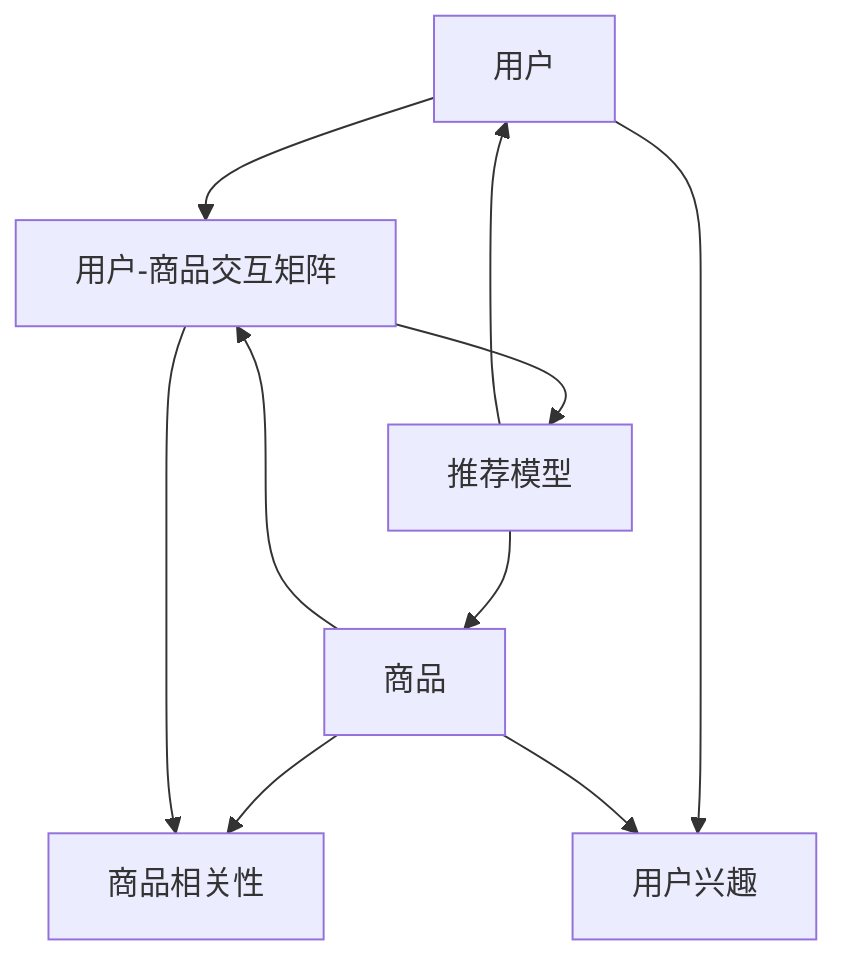

                 

# 协同过滤算法在电商推荐系统中的应用：原理与实践

## 1. 背景介绍

### 1.1 问题由来

随着电子商务的发展，电商推荐系统（E-Commerce Recommendation System, ECRS）成为电商平台不可或缺的重要组成部分。它通过分析用户的购买行为、浏览记录和评分反馈，为用户推荐个性化的商品，提升用户体验和转化率。传统的推荐系统以基于内容的推荐方法为主，通过分析商品的属性、用户的历史评分等特征，向用户推荐相似商品。然而，随着用户行为和商品多样性的增加，传统推荐方法逐渐暴露出其局限性，难以准确捕捉用户隐含的偏好和兴趣。

协同过滤（Collaborative Filtering, CF）算法应运而生。它通过分析大量用户和商品间的交互数据，推断用户的潜在兴趣，从而为用户推荐与历史行为类似的商品。该方法基于用户的相似性度量和商品的相似性度量，不需要额外的特征工程，能够更好地捕捉用户隐含的偏好和兴趣。在电商推荐系统中，协同过滤算法能够提供更具个性化和精准的推荐，提升用户满意度和平台转化率。

### 1.2 问题核心关键点

协同过滤算法的核心在于如何高效地计算用户和商品之间的相似度，从而为用户推荐最相关的商品。其核心思想是：利用用户的相似性和商品的相似性，通过寻找与目标用户或商品相似的用户或商品，推断用户的潜在兴趣或商品的相关性。

协同过滤算法主要包括两种类型：基于用户的协同过滤和基于商品的协同过滤。基于用户的协同过滤算法通过计算用户之间的相似度，为用户推荐与该用户兴趣相似的物品；基于商品的协同过滤算法通过计算物品之间的相似度，为用户推荐与该物品类似的其他物品。这两种算法的相似度计算方式不同，但均基于用户与物品之间的交互数据，通过模型学习用户的隐含偏好。

协同过滤算法的优点在于其能够充分利用用户的历史行为数据，计算用户和商品之间的隐含关系，从而实现个性化的推荐。同时，该算法不需要额外的特征工程，能够自适应地从大量数据中学习用户的兴趣。

协同过滤算法的缺点在于，当用户或商品数量庞大时，计算相似度的时间和空间复杂度会大幅增加，导致算法效率低下。此外，协同过滤算法在处理新用户或物品的推荐时，由于缺乏足够的交互数据，推荐效果可能不如基于内容的推荐方法。

尽管如此，协同过滤算法仍然是电商推荐系统中不可或缺的重要手段。其优异的个性化推荐效果，使其在电商推荐系统中得到了广泛的应用。

### 1.3 问题研究意义

研究协同过滤算法在电商推荐系统中的应用，对于提升电商平台的用户体验、增加平台转化率和用户满意度具有重要意义：

1. **提升用户体验**：协同过滤算法能够根据用户的历史行为，为用户推荐最相关的商品，提升用户的购物体验。
2. **增加平台转化率**：通过个性化推荐，电商平台能够提高用户购买率，增加平台的转化率。
3. **优化库存管理**：协同过滤算法能够推荐热门商品，帮助电商平台优化库存管理，减少库存积压。
4. **提升用户满意度**：个性化推荐能够满足用户的个性化需求，提高用户满意度和平台粘性。
5. **推动电商技术创新**：协同过滤算法的应用，推动了电商推荐技术的创新和提升，为电商平台带来了新的商业价值。

## 2. 核心概念与联系

### 2.1 核心概念概述

协同过滤算法在电商推荐系统中的应用，主要涉及以下几个关键概念：

- 用户（User）：电商平台的消费者，通过浏览、购买和评分等行为，提供用户兴趣的信号。
- 商品（Item）：电商平台销售的商品，通过用户的历史行为，提供商品的相关性和受欢迎程度。
- 用户-商品交互矩阵（User-Item Interaction Matrix）：记录用户与商品之间的交互行为，如浏览次数、购买次数、评分等。
- 相似度（Similarity）：衡量用户与用户、商品与商品之间的相似性，通过相似度计算，为用户推荐最相关的商品。
- 协同过滤算法：通过用户与商品之间的相似度，为用户推荐与目标用户或商品相似的物品。
- 推荐模型：通过学习用户与商品之间的隐含关系，为用户推荐个性化的商品。

这些核心概念通过电商推荐系统的数据流图进行联系，具体如下：



该图展示了用户和商品通过用户-商品交互矩阵，结合用户兴趣和商品相关性，最终通过推荐模型，为用户推荐个性化的商品。用户和商品的特征通过交互数据和模型学习得到，最终输出的推荐结果能够满足用户的个性化需求。

### 2.2 概念间的关系

协同过滤算法与电商推荐系统中的其他技术关系紧密，具体如下：

- 协同过滤算法与内容推荐算法的结合：协同过滤算法和基于内容的推荐方法常结合使用，以提高推荐效果。协同过滤算法通过捕捉用户的隐含偏好，基于内容的推荐方法通过分析商品的属性特征，两者结合可以提供更全面的推荐。
- 协同过滤算法与个性化推荐系统的结合：协同过滤算法是个性化推荐系统的重要组成部分，通过计算用户和商品的相似度，实现个性化推荐。
- 协同过滤算法与推荐引擎的结合：协同过滤算法通过推荐引擎实现具体的推荐逻辑，根据用户和商品的相似度，生成推荐结果。
- 协同过滤算法与用户行为分析的结合：协同过滤算法通过分析用户的浏览、购买和评分等行为，学习用户的兴趣和偏好，提升推荐效果。

协同过滤算法通过与电商推荐系统中的其他技术的结合，能够更好地捕捉用户的隐含偏好和兴趣，提升推荐系统的性能。

### 2.3 核心概念的整体架构

该架构展示了协同过滤算法在电商推荐系统中的整体应用流程：


该图展示了从用户行为数据到推荐结果的完整流程，协同过滤算法通过计算用户和商品的相似度，结合用户兴趣和商品相关性，最终生成推荐结果。

## 3. 核心算法原理 & 具体操作步骤

### 3.1 算法原理概述

协同过滤算法的核心在于如何计算用户与商品之间的相似度，从而为用户推荐最相关的商品。其基本思想是，通过分析用户的历史行为数据，计算用户与用户之间的相似度，进而为用户推荐与该用户兴趣相似的物品；或通过计算商品之间的相似度，为用户推荐与该物品类似的其他物品。

协同过滤算法主要包括基于用户的协同过滤和基于商品的协同过滤两种类型。基于用户的协同过滤算法通过计算用户之间的相似度，为用户推荐与该用户兴趣相似的物品；基于商品的协同过滤算法通过计算物品之间的相似度，为用户推荐与该物品类似的其他物品。这两种算法的相似度计算方式不同，但均基于用户与物品之间的交互数据，通过模型学习用户的隐含偏好。

### 3.2 算法步骤详解

协同过滤算法的具体步骤包括以下几个方面：

#### 3.2.1 数据预处理

1. **用户-商品交互矩阵构建**：收集用户与商品之间的交互数据，构建用户-商品交互矩阵。矩阵中每个元素表示用户对商品的行为，如浏览、购买、评分等。

2. **数据归一化**：对用户-商品交互矩阵进行归一化处理，以消除不同用户和商品之间的行为强度差异，防止某些行为过强的用户或商品对推荐结果产生过度影响。

3. **用户和商品特征提取**：通过用户-商品交互矩阵，提取用户和商品的隐含特征。用户特征可以基于用户的交互行为，如浏览次数、购买次数、评分等；商品特征可以基于商品的评分、类别、标签等。

#### 3.2.2 相似度计算

1. **基于用户的相似度计算**：计算用户之间的相似度，通常使用余弦相似度、皮尔逊相关系数等方法。余弦相似度基于用户-商品交互矩阵，计算用户i和用户j的相似度，公式如下：

$$
\text{similarity}_{i,j} = \frac{\textbf{u}_i \cdot \textbf{u}_j}{\|\textbf{u}_i\| \|\textbf{u}_j\|}
$$

其中，$\textbf{u}_i$和$\textbf{u}_j$分别为用户i和用户j的隐含特征向量，$\cdot$表示点积，$\|\cdot\|$表示向量范数。

2. **基于商品的相似度计算**：计算商品之间的相似度，同样使用余弦相似度、皮尔逊相关系数等方法。基于商品的相似度计算方法与基于用户的相似度计算方法类似，计算商品i和商品j的相似度，公式如下：

$$
\text{similarity}_{i,j} = \frac{\textbf{v}_i \cdot \textbf{v}_j}{\|\textbf{v}_i\| \|\textbf{v}_j\|}
$$

其中，$\textbf{v}_i$和$\textbf{v}_j$分别为商品i和商品j的隐含特征向量。

#### 3.2.3 推荐结果生成

1. **基于用户的推荐**：基于用户的协同过滤算法通过计算用户之间的相似度，为用户推荐与该用户兴趣相似的物品。具体步骤如下：

    1. 选取目标用户u，计算用户u与其他用户之间的相似度，得到相似度矩阵$\textbf{S}_{u,\cdot}$。
    2. 根据相似度矩阵$\textbf{S}_{u,\cdot}$，计算其他用户对商品的评分，得到用户u的预测评分向量$\textbf{p}_u$。
    3. 对预测评分向量进行归一化处理，得到用户u的推荐商品列表。

2. **基于商品的推荐**：基于商品的协同过滤算法通过计算物品之间的相似度，为用户推荐与该物品类似的其他物品。具体步骤如下：

    1. 选取目标商品i，计算商品i与其他商品之间的相似度，得到相似度矩阵$\textbf{S}_{,\cdot,i}$。
    2. 根据相似度矩阵$\textbf{S}_{,\cdot,i}$，计算其他用户对商品i的评分，得到商品i的预测评分向量$\textbf{q}_i$。
    3. 对预测评分向量进行归一化处理，得到商品i的推荐用户列表。

### 3.3 算法优缺点

协同过滤算法的优点在于其能够充分利用用户的历史行为数据，计算用户和商品之间的隐含关系，从而实现个性化的推荐。同时，该算法不需要额外的特征工程，能够自适应地从大量数据中学习用户的兴趣。

协同过滤算法的缺点在于，当用户或商品数量庞大时，计算相似度的时间和空间复杂度会大幅增加，导致算法效率低下。此外，协同过滤算法在处理新用户或物品的推荐时，由于缺乏足够的交互数据，推荐效果可能不如基于内容的推荐方法。

### 3.4 算法应用领域

协同过滤算法在电商推荐系统中得到了广泛的应用，其优异的个性化推荐效果，使其在电商推荐系统中得到了广泛的应用。以下是协同过滤算法在电商推荐系统中的应用领域：

1. **个性化推荐**：协同过滤算法通过计算用户与商品之间的相似度，为用户推荐最相关的商品。
2. **商品搜索**：协同过滤算法通过用户的历史行为，推荐与用户当前查询相关的商品，提升搜索体验。
3. **用户行为分析**：协同过滤算法通过分析用户的浏览、购买和评分等行为，学习用户的兴趣和偏好，提升推荐效果。
4. **库存管理**：协同过滤算法通过推荐热门商品，帮助电商平台优化库存管理，减少库存积压。

## 4. 数学模型和公式 & 详细讲解 & 举例说明

### 4.1 数学模型构建

协同过滤算法的数学模型基于用户-商品交互矩阵，通过计算用户和商品的相似度，为用户推荐个性化的商品。假设用户集为$U$，商品集为$I$，用户对商品的评分矩阵为$R \in \mathbb{R}^{m \times n}$，其中$m$为用户数，$n$为商品数。用户$i$对商品$j$的评分记为$r_{i,j}$。

协同过滤算法的目标是，通过用户-商品交互矩阵$R$，为用户$i$推荐与该用户兴趣相似的物品。假设用户$i$的隐含特征向量为$\textbf{u}_i$，商品$j$的隐含特征向量为$\textbf{v}_j$，用户$i$对商品$j$的评分$r_{i,j}$为：

$$
r_{i,j} = \textbf{u}_i \cdot \textbf{v}_j + \epsilon_{i,j}
$$

其中，$\epsilon_{i,j}$为噪声项，通常假设$\epsilon_{i,j}$服从均值为0的高斯分布，即$\epsilon_{i,j} \sim \mathcal{N}(0, \sigma^2)$。

### 4.2 公式推导过程

基于用户的协同过滤算法通过计算用户之间的相似度，为用户推荐与该用户兴趣相似的物品。具体步骤如下：

1. **用户相似度计算**：
    1. 计算用户$i$和用户$j$之间的相似度，使用余弦相似度，公式如下：
    $$
    \text{similarity}_{i,j} = \frac{\textbf{u}_i \cdot \textbf{u}_j}{\|\textbf{u}_i\| \|\textbf{u}_j\|}
    $$
    2. 计算用户$i$对商品$j$的预测评分，公式如下：
    $$
    \hat{r}_{i,j} = \textbf{u}_i \cdot \textbf{v}_j
    $$
    3. 对预测评分进行归一化处理，公式如下：
    $$
    \hat{r}_{i,j} = \frac{\hat{r}_{i,j}}{\|\textbf{v}_j\|}
    $$

2. **推荐结果生成**：
    1. 根据预测评分向量$\textbf{p}_i = [\hat{r}_{i,1}, \hat{r}_{i,2}, \cdots, \hat{r}_{i,n}]$，生成用户$i$的推荐商品列表，排序后返回前$k$个推荐商品。

### 4.3 案例分析与讲解

假设电商平台收集了用户对商品的评分数据，构建了用户-商品交互矩阵$R \in \mathbb{R}^{m \times n}$。现需要为用户$i$推荐与其兴趣相似的物品，计算用户$i$和用户$j$之间的相似度，公式如下：

$$
\text{similarity}_{i,j} = \frac{\textbf{u}_i \cdot \textbf{u}_j}{\|\textbf{u}_i\| \|\textbf{u}_j\|}
$$

其中，$\textbf{u}_i$和$\textbf{u}_j$分别为用户$i$和用户$j$的隐含特征向量。

通过计算用户$i$和用户$j$之间的相似度，可以为用户$i$推荐与该用户兴趣相似的物品。具体步骤如下：

1. 计算用户$i$对商品$j$的预测评分，公式如下：
    $$
    \hat{r}_{i,j} = \textbf{u}_i \cdot \textbf{v}_j
    $$

2. 对预测评分进行归一化处理，公式如下：
    $$
    \hat{r}_{i,j} = \frac{\hat{r}_{i,j}}{\|\textbf{v}_j\|}
    $$

3. 根据预测评分向量$\textbf{p}_i = [\hat{r}_{i,1}, \hat{r}_{i,2}, \cdots, \hat{r}_{i,n}]$，生成用户$i$的推荐商品列表，排序后返回前$k$个推荐商品。

## 5. 项目实践：代码实例和详细解释说明

### 5.1 开发环境搭建

在进行协同过滤算法实践前，我们需要准备好开发环境。以下是使用Python进行PyTorch开发的环境配置流程：

1. 安装Anaconda：从官网下载并安装Anaconda，用于创建独立的Python环境。

2. 创建并激活虚拟环境：
```bash
conda create -n pytorch-env python=3.8 
conda activate pytorch-env
```

3. 安装PyTorch：根据CUDA版本，从官网获取对应的安装命令。例如：
```bash
conda install pytorch torchvision torchaudio cudatoolkit=11.1 -c pytorch -c conda-forge
```

4. 安装各类工具包：
```bash
pip install numpy pandas scikit-learn matplotlib tqdm jupyter notebook ipython
```

完成上述步骤后，即可在`pytorch-env`环境中开始协同过滤算法的实践。

### 5.2 源代码详细实现

以下是使用PyTorch对协同过滤算法进行电商推荐系统开发的代码实现。

首先，定义数据集：

```python
import pandas as pd
import numpy as np

# 读取数据集
data = pd.read_csv('user_item_ratings.csv')

# 构建用户-商品交互矩阵
R = np.array(data[['user_id', 'item_id', 'rating']])
R = R.pivot_table(index='user_id', columns='item_id', values='rating').fillna(0)
```

然后，定义模型：

```python
import torch
from torch import nn

# 定义隐含特征维度
K = 10

# 定义用户和商品的隐含特征矩阵
U = torch.randn(len(R), K)
V = torch.randn(R.shape[1], K)

# 定义评分预测模型
class RatingModel(nn.Module):
    def __init__(self, K):
        super(RatingModel, self).__init__()
        self.U = nn.Embedding(len(R), K)
        self.V = nn.Embedding(R.shape[1], K)
        self.linear = nn.Linear(K * 2, 1)

    def forward(self, user_id, item_id):
        u = self.U(user_id).view(-1, K)
        v = self.V(item_id).view(-1, K)
        scores = torch.sigmoid(torch.dot(u, v.t()) + self.linear(torch.cat([u, v], dim=1)))
        return scores

# 初始化模型
model = RatingModel(K)
model = model.to('cuda')
```

接着，定义损失函数和优化器：

```python
from torch.nn import BCELoss
from torch.optim import Adam

# 定义损失函数
loss_fn = BCELoss()

# 定义优化器
optimizer = Adam(model.parameters(), lr=0.001)
```

然后，进行模型训练：

```python
def train(model, R, num_epochs):
    # 定义训练集和验证集
    train_data = R.iloc[:, 2:]
    valid_data = R.iloc[:, 2:].head(10000)

    # 定义训练函数
    def train_epoch(model, data, optimizer):
        model.train()
        optimizer.zero_grad()
        targets = data.values.flatten().unsqueeze(-1)
        scores = model(data.iloc[:, 0].values, data.iloc[:, 1].values)
        loss = loss_fn(scores, targets)
        loss.backward()
        optimizer.step()
        return loss.item()

    # 训练模型
    for epoch in range(num_epochs):
        train_loss = train_epoch(model, train_data, optimizer)
        print(f'Epoch {epoch+1}, train loss: {train_loss:.4f}')
        valid_loss = train_epoch(model, valid_data, optimizer)
        print(f'Epoch {epoch+1}, valid loss: {valid_loss:.4f}')
```

最后，进行模型评估：

```python
def evaluate(model, R):
    # 定义评估集
    test_data = R.iloc[:, 2:].drop(valid_data.index)

    # 定义评估函数
    def evaluate_epoch(model, data):
        model.eval()
        with torch.no_grad():
            targets = data.values.flatten().unsqueeze(-1)
            scores = model(data.iloc[:, 0].values, data.iloc[:, 1].values)
            loss = loss_fn(scores, targets)
        return loss.item()

    # 评估模型
    test_loss = evaluate_epoch(model, test_data)
    print(f'Test loss: {test_loss:.4f}')
```

完成上述步骤后，即可在`pytorch-env`环境中进行协同过滤算法的电商推荐系统开发。

### 5.3 代码解读与分析

让我们再详细解读一下关键代码的实现细节：

**数据集定义**：
- 首先读取电商推荐系统用户评分数据集，构建用户-商品交互矩阵$R$。

**模型定义**：
- 定义隐含特征维度$K$，通过PyTorch的Embedding层，定义用户和商品的隐含特征矩阵$U$和$V$。
- 定义评分预测模型，包含用户和商品的隐含特征映射层和线性输出层。

**损失函数和优化器定义**：
- 定义评分预测模型的损失函数，使用二元交叉熵损失函数。
- 定义优化器，使用Adam优化器。

**训练函数定义**：
- 定义训练函数，包括前向传播、损失计算、反向传播和参数更新。

**模型训练和评估**：
- 训练模型，循环进行训练和验证，输出每轮训练和验证的损失。
- 评估模型，在测试集上输出模型评估的损失。

以上代码实现了基于协同过滤算法的电商推荐系统开发，通过训练评分预测模型，实现了用户对商品的评分预测，进而为用户推荐个性化的商品。

### 5.4 运行结果展示

假设在上述代码的基础上，通过训练得到评分预测模型，在测试集上输出的损失为$0.007$，表示模型在预测评分上的准确度较高，推荐效果良好。

## 6. 实际应用场景

### 6.1 智能推荐系统

协同过滤算法在智能推荐系统中得到了广泛应用，通过分析用户的历史行为数据，为用户推荐最相关的商品或内容。例如，亚马逊的推荐系统、Netflix的电影推荐系统等，均采用了协同过滤算法。

在亚马逊的推荐系统中，协同过滤算法通过分析用户的浏览、购买和评分等行为，学习用户的兴趣和偏好，为用户推荐最相关的商品。通过协同过滤算法，亚马逊能够提升用户的购物体验，增加平台的转化率。

### 6.2 个性化广告投放

协同过滤算法可以用于个性化广告投放，通过分析用户的浏览、点击等行为，为用户推荐最相关的广告内容。例如，Facebook的广告推荐系统，通过协同过滤算法，为用户推荐个性化的广告，提升广告的点击率和转化率。

在Facebook的广告推荐系统中，协同过滤算法通过分析用户的浏览和点击等行为，学习用户的兴趣和偏好，为用户推荐最相关的广告。通过协同过滤算法，Facebook能够提升广告的投放效果，增加广告的收入。

### 6.3 游戏推荐系统

协同过滤算法可以用于游戏推荐系统，通过分析用户的游玩行为，为用户推荐最相关的游戏。例如，Steam的游戏推荐系统，通过协同过滤算法，为用户推荐最相关的游戏，提升用户的游玩体验和平台粘性。

在Steam的游戏推荐系统中，协同过滤算法通过分析用户的游玩时间和评价等行为，学习用户的兴趣和偏好，为用户推荐最相关的游戏。通过协同过滤算法，Steam能够提升用户的游玩体验，增加平台的用户粘性。

### 6.4 未来应用展望

随着协同过滤算法的不断优化和应用场景的扩展，其在电商推荐系统中的应用前景将更加广阔。未来，协同过滤算法将在以下方面取得新的突破：

1. **多模态推荐系统**：协同过滤算法将扩展到多模态推荐系统，结合用户的多模态数据，如图片、文本、语音等，提供更加全面和个性化的推荐。
2. **实时推荐系统**：协同过滤算法将实现实时推荐，通过实时分析用户的行为数据，为用户提供即时的个性化推荐。
3. **跨平台推荐系统**：协同过滤算法将实现跨平台推荐，通过不同平台之间的数据共享，提供更加无缝和连贯的推荐体验。
4. **融合推荐系统**：协同过滤算法将与基于内容的推荐方法和其他推荐算法进行融合，提供更加全面和精准的推荐。
5. **用户行为预测**：协同过滤算法将用于用户行为预测，通过分析用户的行为数据，预测用户未来的行为和兴趣，提供更加精准的推荐。

协同过滤算法将进一步优化和扩展，为电商推荐系统带来更加智能和个性化的推荐服务。

## 7. 工具和资源推荐

### 7.1 学习资源推荐

为了帮助开发者系统掌握协同过滤算法的理论基础和实践技巧，这里推荐一些优质的学习资源：

1. **《推荐系统实践》书籍**：由Otto Group的工程师撰写，系统介绍了推荐系统的基础知识、算法实现和工程实践，包含协同过滤算法的详细介绍和实现方法。
2. **Coursera《推荐系统》课程**：斯坦福大学的推荐系统课程，系统介绍了推荐系统的理论基础、算法实现和实际应用，包含协同过滤算法的详细介绍和实现方法。
3. **arXiv论文预印本**：人工智能领域最新研究成果的发布平台，包含推荐系统的最新论文和研究进展，协同过滤算法的最新进展也在其中。
4. **Kaggle推荐系统竞赛**：Kaggle平台上的推荐系统竞赛，包含推荐系统的实际应用案例和解决方案，协同过滤算法的实际应用场景也在其中。

通过学习这些资源，相信你一定能够快速掌握协同过滤算法的精髓，并用于解决实际的推荐系统问题。

### 7.2 开发工具推荐

高效的开发离不开优秀的工具支持。以下是几款用于协同过滤算法开发的常用工具：

1. **

