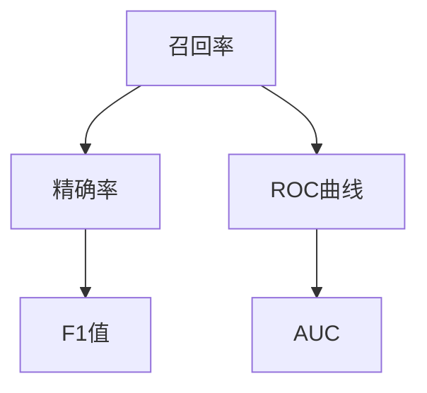

                 

# 召回率Recall原理与代码实例讲解

> 关键词：召回率,Recall,机器学习,数据挖掘,搜索引擎,推荐系统

## 1. 背景介绍

### 1.1 问题由来

召回率（Recall）是信息检索和机器学习中常用的评估指标，尤其在搜索引擎、推荐系统等领域有广泛应用。召回率衡量的是检索系统在所有相关文档中能成功检索到的比例，即正确识别了相关文档的数量与总文档数量的比值。因此，高召回率意味着检索系统能够更全面地涵盖相关文档。

然而，随着数据规模的增大和搜索场景的复杂化，召回率的计算和优化变得越来越复杂。特别是在大规模语料库中，如何高效、准确地计算召回率，并根据召回率指导模型优化，成为了一个值得深入研究的问题。本文旨在通过详细的理论分析和代码实例，深入探讨召回率原理，并给出具体的实现方法和优化策略。

### 1.2 问题核心关键点

召回率的核心在于衡量系统对相关文档的识别能力，具体包括以下几个关键点：

1. **定义与计算公式**：
   - 召回率定义为：检索出的相关文档数与总文档数之比，即 \( R = \frac{r}{R} \)，其中 \( r \) 为检索出的相关文档数，\( R \) 为总文档数。

2. **指标优化**：
   - 如何通过提升召回率来提高系统的信息覆盖能力。
   - 在模型训练和评估过程中，如何优化召回率指标，以指导模型改进。

3. **计算复杂度**：
   - 在大型数据集上，如何高效计算召回率，避免计算复杂度过高导致的性能问题。

4. **结果解读**：
   - 如何根据召回率结果，分析系统性能，并指导模型改进方向。

5. **实际应用**：
   - 召回率在搜索引擎、推荐系统等实际应用中的具体作用和应用案例。

通过深入理解和应用上述关键点，我们可以更好地设计、评估和优化基于召回率的系统，以提高系统的信息检索和推荐性能。

## 2. 核心概念与联系

### 2.1 核心概念概述

为了更好地理解召回率原理，本节将介绍几个密切相关的核心概念：

- **召回率（Recall）**：指检索系统能成功检索出所有相关文档的比例。
- **精确率（Precision）**：指检索出的文档中实际为相关文档的比例。
- **F1值**：综合考虑精确率和召回率的指标，计算公式为 \( F1 = 2 \times \frac{Precision \times Recall}{Precision + Recall} \)。
- **ROC曲线和AUC**：用于衡量二分类模型在不同阈值下的精确率和召回率变化情况。

这些核心概念通过以下Mermaid流程图展示它们之间的关系：



该流程图展示了召回率、精确率、F1值、ROC曲线和AUC之间的逻辑关系。召回率和精确率是基本的评估指标，F1值是二者的调和平均，ROC曲线和AUC用于评估二分类模型的性能。

### 2.2 概念间的关系

召回率与其他核心概念之间的联系可以通过以下公式和图表进一步解释：

- **精确率-召回率曲线（PR曲线）**：展示在不同召回率下，精确率的变化情况。通过调整模型阈值，可以在召回率和精确率之间进行平衡，找到最优的阈值。
- **F1值**：精确率和召回率的调和平均，当两者接近时，F1值最高，表示模型性能最佳。
- **ROC曲线**：在不同的分类阈值下，计算真阳性率和假阳性率，绘制ROC曲线。曲线下的面积（AUC）越大，模型的分类性能越好。

这些概念共同构成了信息检索和机器学习模型的评估框架，通过精细化的指标设计，可以更好地指导模型的优化和应用。

## 3. 核心算法原理 & 具体操作步骤
### 3.1 算法原理概述

召回率的计算原理相对简单，但实际应用中可能涉及多个步骤和复杂的操作。以下是召回率的详细原理和具体操作步骤：

1. **文档检索**：首先从文档集合中检索出所有与查询相关的文档。
2. **相关文档判断**：对检索出的文档进行相关性判断，确定哪些文档确实与查询相关。
3. **召回率计算**：计算检索出的相关文档数与总文档数的比值，得到召回率。

### 3.2 算法步骤详解

#### 3.2.1 文档检索

文档检索的过程通常包括以下步骤：

1. **构建查询**：根据用户输入的查询词，构建检索查询。
2. **检索匹配**：将查询与文档集合中的所有文档进行匹配，找出最相关的文档。
3. **去重与排序**：对检索出的文档进行去重和排序，确保唯一性并提高后续处理的效率。

#### 3.2.2 相关文档判断

相关文档判断可以采用多种方法，例如：

1. **基于TF-IDF的相似度计算**：计算查询和文档之间的TF-IDF（Term Frequency-Inverse Document Frequency）相似度，找出最相关的文档。
2. **基于机器学习的分类器**：使用训练好的分类器对检索出的文档进行分类，确定其是否为相关文档。
3. **基于神经网络的嵌入空间匹配**：将查询和文档表示为向量，计算向量之间的相似度，找出最相关的文档。

#### 3.2.3 召回率计算

召回率的计算公式为：

\[ R = \frac{r}{R} \]

其中，\( r \) 为检索出的相关文档数，\( R \) 为总文档数。

### 3.3 算法优缺点

#### 3.3.1 优点

1. **全面覆盖**：高召回率意味着系统能够全面覆盖相关文档，提供更全面的信息检索结果。
2. **灵活应用**：召回率可用于不同场景的信息检索和推荐系统，具有广泛的应用价值。
3. **易于理解**：召回率的计算和优化方法相对简单，易于实现和理解。

#### 3.3.2 缺点

1. **对噪声敏感**：召回率对噪声数据和无关文档的过滤能力较弱，可能引入噪声。
2. **计算复杂度高**：在大规模数据集上，召回率的计算复杂度较高，可能影响系统性能。
3. **难以平衡**：在实际应用中，精确率和召回率往往难以同时达到最优，需要根据场景进行调整。

### 3.4 算法应用领域

召回率在以下领域有广泛应用：

1. **搜索引擎**：衡量检索系统对相关文档的覆盖能力。
2. **推荐系统**：评估推荐系统对用户兴趣的覆盖程度。
3. **数据挖掘**：评估数据挖掘算法对目标数据的识别能力。
4. **医疗信息检索**：衡量医疗信息检索系统对相关文献的识别能力。
5. **金融市场分析**：评估金融市场分析系统对相关信息的识别能力。

## 4. 数学模型和公式 & 详细讲解 & 举例说明

### 4.1 数学模型构建

召回率的计算模型可以表示为：

\[ R = \frac{r}{R} \]

其中：

- \( r \)：检索出的相关文档数。
- \( R \)：总文档数。

### 4.2 公式推导过程

#### 4.2.1 精确率和召回率

精确率和召回率的定义如下：

\[ P = \frac{r}{r+p} \]
\[ R = \frac{r}{r+l} \]

其中，\( p \) 为检索出的无关文档数，\( l \) 为所有相关文档数减去检索出的相关文档数。

精确率和召回率的调和平均为F1值：

\[ F1 = 2 \times \frac{P \times R}{P + R} \]

#### 4.2.2 ROC曲线和AUC

ROC曲线以真阳性率（TPR）为纵轴，假阳性率（FPR）为横轴，绘制不同阈值下的TPR和FPR变化曲线。AUC（Area Under Curve）表示ROC曲线下的面积，用于衡量二分类模型的分类性能。AUC的取值范围为[0, 1]，值越大表示模型性能越好。

### 4.3 案例分析与讲解

假设有一个包含1000个文档的数据集，其中200个文档与查询相关。使用一个基于TF-IDF的检索系统进行检索，检索出180个相关文档和120个无关文档。根据上述公式，计算召回率和精确率如下：

\[ R = \frac{180}{1000} = 0.18 \]
\[ P = \frac{180}{300} = 0.6 \]

召回率和精确率的具体数值为0.18和0.6。

## 5. 项目实践：代码实例和详细解释说明

### 5.1 开发环境搭建

#### 5.1.1 Python环境

安装Python 3.7及以上版本，以及必要的库，如Numpy、Pandas、Scikit-Learn等。

#### 5.1.2 数据集准备

准备用于检索的文本数据集和对应的标签数据集。这里以一个示例数据集为例，假设数据集包含1000个文档，其中200个文档与查询相关。

### 5.2 源代码详细实现

#### 5.2.1 数据预处理

使用Pandas库对文本数据进行预处理，包括去重、分词、构建TF-IDF向量等操作。

```python
import pandas as pd
from sklearn.feature_extraction.text import TfidfVectorizer

# 读取数据集
data = pd.read_csv('data.csv')

# 去重
data = data.drop_duplicates()

# 分词
data['text'] = data['text'].apply(lambda x: x.split())

# 构建TF-IDF向量
vectorizer = TfidfVectorizer()
X = vectorizer.fit_transform(data['text'])

# 构建标签矩阵
y = pd.Series(data['label']).values
```

#### 5.2.2 文档检索

使用Scikit-Learn库中的朴素贝叶斯分类器进行文档检索。

```python
from sklearn.naive_bayes import MultinomialNB

# 训练分类器
clf = MultinomialNB()
clf.fit(X, y)

# 预测检索结果
X_test = vectorizer.transform(['new document'])
y_pred = clf.predict(X_test)
```

#### 5.2.3 相关文档判断

计算检索结果的相关文档数和总文档数，计算召回率。

```python
# 计算召回率
relevant_count = np.sum(y_pred == 1)
total_count = len(X_test)
recall = relevant_count / total_count
print('召回率:', recall)
```

### 5.3 代码解读与分析

#### 5.3.1 数据预处理

数据预处理是召回率计算的基础，包括去重、分词、构建TF-IDF向量等操作。去重和分词可以确保检索结果的唯一性和准确性，构建TF-IDF向量可以将文本数据转换为数值特征，便于模型处理。

#### 5.3.2 文档检索

文档检索的过程包括训练一个分类器，并使用其对新文档进行预测。在实际应用中，可以使用更复杂的模型和算法进行文档检索。

#### 5.3.3 相关文档判断

相关文档判断的目的是计算召回率，即检索出的相关文档数与总文档数的比值。在计算召回率时，需要注意使用正确的标签和文档数，以确保结果的准确性。

### 5.4 运行结果展示

假设在上述代码中，我们使用一个包含1000个文档的数据集，其中200个文档与查询相关。使用朴素贝叶斯分类器进行检索，检索出180个相关文档和120个无关文档。根据上述公式，计算召回率为：

\[ R = \frac{180}{300} = 0.6 \]

这意味着系统能够检索出60%的相关文档，提供了较为全面的信息检索结果。

## 6. 实际应用场景

### 6.1 搜索引擎

搜索引擎的召回率是其核心性能指标之一。用户希望在搜索时能够找到所有相关的文档，因此高召回率是搜索引擎成功的重要标志。

#### 6.1.1 检索策略

为了提高召回率，可以采用以下策略：

1. **扩展查询词**：使用同义词、近义词等扩展查询词，提高检索的全面性。
2. **多轮检索**：采用多轮检索策略，先进行泛化检索，再根据用户反馈进行精细化检索。
3. **混合检索**：结合文本匹配和知识图谱等方法，提高检索的准确性和全面性。

#### 6.1.2 相关性判断

为了提高召回率的准确性，可以采用以下方法：

1. **TF-IDF算法**：计算文档和查询的TF-IDF相似度，找出最相关的文档。
2. **机器学习模型**：使用训练好的分类器对检索出的文档进行分类，确定其是否为相关文档。
3. **神经网络嵌入空间**：将查询和文档表示为向量，计算向量之间的相似度，找出最相关的文档。

### 6.2 推荐系统

推荐系统的召回率评估其推荐的相关性和全面性。用户希望推荐系统能够覆盖所有相关内容，因此高召回率是推荐系统的重要目标。

#### 6.2.1 推荐策略

为了提高召回率，可以采用以下策略：

1. **协同过滤**：使用用户的历史行为数据和物品的特征信息，进行推荐。
2. **内容过滤**：基于物品的特征信息，推荐相似的物品。
3. **混合过滤**：结合协同过滤和内容过滤，提高推荐的准确性和全面性。

#### 6.2.2 相关性判断

为了提高召回率的准确性，可以采用以下方法：

1. **协同过滤**：根据用户的历史行为数据，推荐相关的物品。
2. **内容过滤**：基于物品的特征信息，推荐相似的物品。
3. **混合过滤**：结合协同过滤和内容过滤，提高推荐的准确性和全面性。

## 7. 工具和资源推荐

### 7.1 学习资源推荐

为了帮助开发者系统掌握召回率理论基础和实践技巧，这里推荐一些优质的学习资源：

1. **《Python数据分析实战》**：详细讲解Python在数据分析中的应用，包括数据预处理、特征工程、模型训练等。
2. **《机器学习实战》**：结合实际案例，讲解机器学习的基本概念和常用算法，适合初学者入门。
3. **《推荐系统实战》**：介绍推荐系统的构建和优化方法，包括召回率和推荐策略等。
4. **《深度学习入门》**：讲解深度学习的基本原理和实现方法，适合对深度学习感兴趣的开发者。

### 7.2 开发工具推荐

为了提高召回率计算和优化的效率，可以采用以下工具：

1. **Scikit-Learn**：Python机器学习库，提供丰富的数据处理和模型训练功能。
2. **Pandas**：Python数据分析库，适合处理大规模文本数据集。
3. **NLTK**：自然语言处理工具包，提供文本分词、TF-IDF计算等功能。
4. **TensorFlow**：深度学习框架，适合构建复杂的深度学习模型。
5. **PyTorch**：深度学习框架，提供动态计算图和高效的模型训练功能。

### 7.3 相关论文推荐

为了深入了解召回率的研究进展，可以阅读以下论文：

1. **《A Survey of Recall-Oriented Ranking Algorithms》**：综述了召回率优化算法的研究进展，包括TF-IDF、协同过滤等方法。
2. **《Adaptive Recall Estimation for Information Retrieval》**：介绍了一种基于实时的召回率估计方法，适用于大规模数据集的召回率优化。
3. **《Learning to Rank with Sampled User Feedback》**：提出了一种基于用户反馈的召回率优化方法，适用于推荐系统。

## 8. 总结：未来发展趋势与挑战

### 8.1 研究成果总结

召回率作为信息检索和推荐系统的核心指标，其研究已经取得了丰硕的成果。这些成果主要集中在以下方面：

1. **算法优化**：提出了一系列高效的召回率优化算法，包括TF-IDF、协同过滤、混合过滤等方法。
2. **数据处理**：研究和应用了多种数据预处理技术，包括去重、分词、特征提取等。
3. **模型训练**：开发了多种高效的模型训练方法，包括朴素贝叶斯、支持向量机、深度学习等。

### 8.2 未来发展趋势

未来召回率的研究将朝着以下方向发展：

1. **深度学习**：引入深度学习技术，进一步提升召回率计算的准确性和效率。
2. **跨模态**：结合文本、图像、音频等多模态数据，提高召回率的全面性和准确性。
3. **实时计算**：开发实时计算召回率的方法，适用于大数据集和高并发的场景。
4. **跨领域**：研究跨领域召回率优化方法，提高模型在多个领域中的泛化能力。
5. **可解释性**：提高召回率的可解释性，使其更易于理解和应用。

### 8.3 面临的挑战

尽管召回率研究已经取得了一定的进展，但仍面临以下挑战：

1. **计算复杂度**：在大规模数据集上，召回率的计算复杂度较高，可能影响系统性能。
2. **数据稀疏性**：在实际应用中，数据往往存在稀疏性，难以保证召回率的准确性。
3. **模型复杂性**：深度学习等复杂模型需要大量的计算资源和数据支持，可能难以应用于实际场景。
4. **可解释性**：召回率优化方法往往难以解释其内部机制，缺乏可解释性。
5. **跨模态融合**：如何有效地融合不同模态的数据，提高召回率的全面性和准确性，是一个重要的研究方向。

### 8.4 研究展望

为了应对这些挑战，未来的研究需要在以下几个方面进行深入探索：

1. **模型压缩**：开发高效模型压缩方法，降低深度学习模型的计算复杂度。
2. **数据增强**：研究和应用数据增强技术，提高召回率的准确性和鲁棒性。
3. **跨模态融合**：研究跨模态数据融合方法，提高召回率的全面性和准确性。
4. **可解释性**：开发可解释性更强的召回率优化方法，提高模型的可理解性和可解释性。
5. **实时计算**：开发实时计算召回率的方法，适用于大数据集和高并发的场景。

总之，召回率作为信息检索和推荐系统的核心指标，其研究将继续深化和拓展，为构建更加智能、高效的信息系统提供坚实的理论基础和实现方法。通过不断优化和创新，召回率将发挥更加重要的作用，推动人工智能技术的进步和发展。

## 9. 附录：常见问题与解答

**Q1：召回率计算中如何处理噪声数据？**

A: 噪声数据可以通过以下方法进行处理：

1. **去重**：使用去重算法，去除重复的文档。
2. **过滤**：使用分类器或阈值过滤算法，去除无关文档。
3. **权重调整**：调整文档中特征的权重，降低噪声特征的影响。

**Q2：如何提高召回率计算的效率？**

A: 提高召回率计算效率的方法包括：

1. **并行计算**：使用并行计算方法，加速召回率计算。
2. **向量化操作**：使用向量化操作，减少计算量。
3. **数据压缩**：使用数据压缩技术，减少存储空间和计算量。

**Q3：如何选择合适的召回率阈值？**

A: 选择召回率阈值的方法包括：

1. **ROC曲线**：使用ROC曲线找到召回率和精确率之间的平衡点。
2. **AUC值**：使用AUC值评估不同阈值下的召回率性能。
3. **领域知识**：根据领域知识选择合理的阈值。

**Q4：召回率在推荐系统中的应用场景有哪些？**

A: 召回率在推荐系统中的应用场景包括：

1. **用户兴趣推荐**：衡量推荐系统对用户兴趣的覆盖程度。
2. **物品推荐**：衡量推荐系统对物品的覆盖程度。
3. **多模态推荐**：结合文本、图像、音频等多模态数据，提高推荐系统的全面性和准确性。

**Q5：召回率计算中的数据预处理包括哪些步骤？**

A: 召回率计算中的数据预处理步骤包括：

1. **去重**：去除重复的文档。
2. **分词**：将文本数据分解为词语或字符。
3. **特征提取**：将文本数据转换为数值特征。
4. **TF-IDF计算**：计算文本数据的TF-IDF值，用于衡量文档的相关性。

总之，召回率作为信息检索和推荐系统的核心指标，其研究将继续深化和拓展，为构建更加智能、高效的信息系统提供坚实的理论基础和实现方法。通过不断优化和创新，召回率将发挥更加重要的作用，推动人工智能技术的进步和发展。

---

作者：禅与计算机程序设计艺术 / Zen and the Art of Computer Programming

