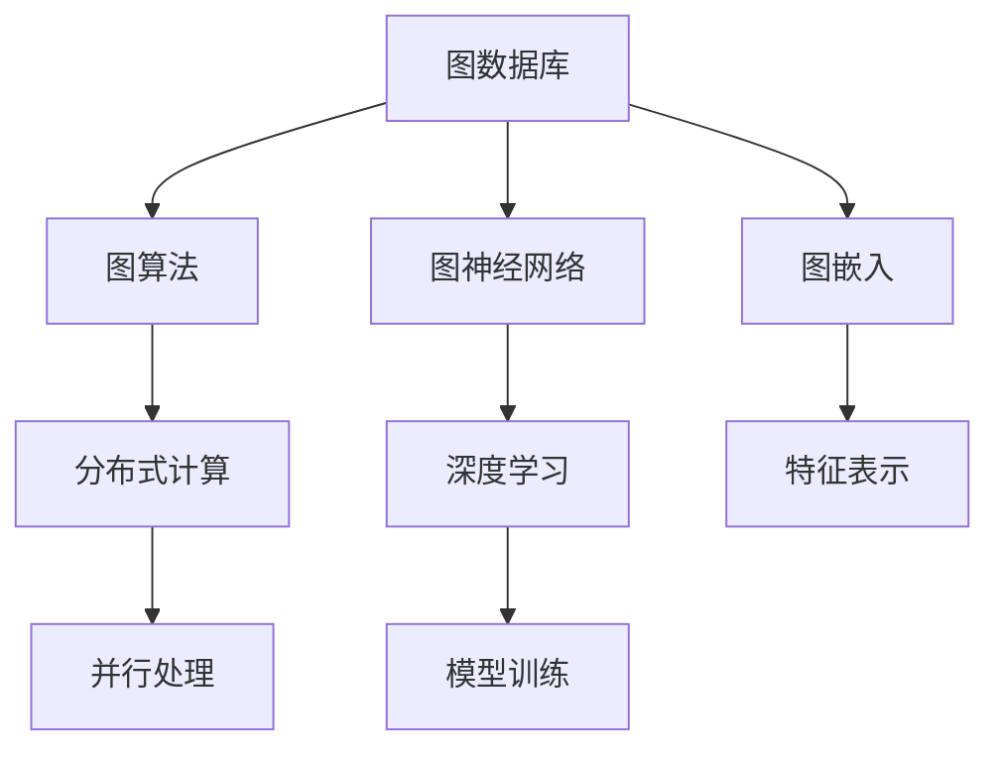
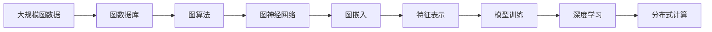

                 

# 图计算引擎 原理与代码实例讲解

> 关键词：图计算,图数据库,图算法,图神经网络,深度学习,应用实例

## 1. 背景介绍

### 1.1 问题由来

随着大数据时代的到来，数据类型日趋复杂化，传统的以关系型数据库为中心的数据存储与计算方式已难以满足需求。图数据因其天然的拓扑结构，能够表示更为复杂、多层次的关系，被广泛应用于社交网络分析、推荐系统、知识图谱构建、生物信息学等领域。然而，图计算由于其非线性、高复杂度，给传统的关系型数据库和分布式计算框架带来了新的挑战。

图计算引擎应运而生，作为专门处理图数据的数据库和计算平台，以其独特的图存储与计算能力，支持大规模图数据的存储、查询与分析，逐步成为图数据领域的重要组成部分。本文将详细介绍图计算引擎的原理与实现，并辅以代码实例，帮助读者深入理解图计算引擎的基本概念和应用。

### 1.2 问题核心关键点

图计算引擎的开发主要围绕以下几个关键点进行：

- **图存储**：设计高效的图存储结构，支持稀疏图、稠密图等不同类型的图存储，并实现高并行、低延迟的图数据读取。
- **图算法实现**：实现常用的图算法，如PageRank、社交网络分析、图嵌入等，并在分布式环境下进行优化和并行化。
- **深度学习应用**：将深度学习算法引入图计算引擎，实现图神经网络、图嵌入等高效的图表示学习。
- **分布式计算**：实现分布式计算框架，支持大规模图数据的高效分布式处理和并行计算。

### 1.3 问题研究意义

研究图计算引擎对于拓展图数据的应用范围，提升图数据处理效率，加速图数据分析技术产业化进程，具有重要意义：

1. **降低计算成本**：图计算引擎通过分布式计算，能够在较低的成本下处理大规模图数据，降低传统集中式计算的资源消耗。
2. **提升处理效率**：图计算引擎的并行计算能力能够显著提升图数据的处理速度，满足大规模图数据分析的需求。
3. **推动技术应用**：图计算引擎为社交网络分析、推荐系统、知识图谱构建等技术落地应用提供了基础平台，推动了相关技术的发展。
4. **促进创新发展**：图计算引擎为研究人员提供了高效的数据处理工具，加速了图数据挖掘与分析的创新研究。
5. **赋能产业升级**：图计算引擎为社交网络、推荐系统等应用场景提供了技术支持，推动了相关产业的数字化转型。

## 2. 核心概念与联系

### 2.1 核心概念概述

为更好地理解图计算引擎，我们首先介绍几个核心概念：

- **图数据库(Graph Database)**：一种专门存储图数据的数据库系统，支持高效的图存储、查询与分析。
- **图算法(Graph Algorithms)**：针对图数据设计的算法，如PageRank、社交网络分析等。
- **图神经网络(Graph Neural Networks, GNNs)**：一种结合图结构与深度学习的图表示学习技术。
- **图嵌入(Graph Embeddings)**：将图结构映射到低维向量空间，用于图数据的高效表示与处理。

这些核心概念之间的关系可以用以下Mermaid流程图来表示：



### 2.2 概念间的关系

通过这张流程图，我们可以更清晰地理解各个概念之间的关系：

1. **图数据库**作为图数据存储的基础，提供了高效的图存储、查询与分析能力。
2. **图算法**和**图神经网络**是基于图数据库构建的高级功能，用于图数据的深度挖掘与分析。
3. **图嵌入**是一种将图结构映射到低维向量空间的技术，用于提高图数据的特征表示效率。
4. **分布式计算**是图数据库和图算法实现高性能计算的必经之路，通过并行化处理提升计算效率。
5. **深度学习**则提供了强大的模型训练能力，将图神经网络与深度学习结合，进一步提升图数据的处理能力。

### 2.3 核心概念的整体架构

下面，我们用一个综合的流程图来展示这些核心概念在大规模图数据处理中的应用架构：



在这个架构中，大规模图数据首先被图数据库存储，然后通过图算法进行深度挖掘与分析，再利用图嵌入技术将图结构映射到低维向量空间，最后通过深度学习进行模型训练，生成图神经网络模型，并利用分布式计算进行高效并行处理。

## 3. 核心算法原理 & 具体操作步骤
### 3.1 算法原理概述

图计算引擎的算法原理主要包括以下几个方面：

- **图存储**：采用图数据库的底层图存储结构，支持稀疏图和稠密图的存储，实现高并行的图数据读取。
- **图算法实现**：实现常用的图算法，如PageRank、社交网络分析等，并在分布式环境下进行优化和并行化。
- **图嵌入技术**：通过低维向量空间中的特征表示，提高图数据的处理效率和模型的泛化能力。
- **深度学习应用**：将深度学习算法引入图计算引擎，实现图神经网络、图嵌入等高效的图表示学习。

### 3.2 算法步骤详解

图计算引擎的核心算法步骤包括：

1. **图数据导入与存储**：将大规模图数据导入图数据库，存储在高效的图存储结构中。
2. **图数据预处理**：对图数据进行清洗、去重、规范化等预处理，确保数据质量。
3. **图算法应用**：选择适合的图算法，对图数据进行深度挖掘与分析，获取有用的信息。
4. **特征提取与表示**：利用图嵌入技术将图结构映射到低维向量空间，提取图数据的特征表示。
5. **深度学习模型训练**：将图嵌入后的特征表示作为输入，训练图神经网络或图嵌入模型，生成高精度的图表示。
6. **模型评估与优化**：对训练好的模型进行评估，根据评估结果进行模型优化，提升模型的性能。

### 3.3 算法优缺点

图计算引擎具有以下优点：

- **高效存储与读取**：通过高效的图存储结构，实现快速、高并行的图数据存储与读取。
- **灵活的算法应用**：支持多种图算法，灵活地进行图数据深度挖掘与分析。
- **强大的特征表示能力**：利用图嵌入技术，将图结构映射到低维向量空间，提高图数据的处理效率。
- **分布式计算能力**：通过分布式计算框架，实现大规模图数据的并行处理与分析。

同时，图计算引擎也存在一些缺点：

- **复杂度较高**：图数据的非线性特性增加了计算复杂度，需要更加复杂的技术实现。
- **数据质量要求高**：图数据的质量直接影响图计算的准确性，需要严格的数据预处理。
- **计算资源消耗大**：大规模图数据的处理需要大量计算资源，对硬件设施要求较高。
- **算法实现复杂**：图计算算法本身的复杂度较高，需要深入理解图数据特性和算法实现。

### 3.4 算法应用领域

图计算引擎的应用领域非常广泛，涵盖了社交网络分析、推荐系统、知识图谱构建、生物信息学等多个领域。具体应用包括：

1. **社交网络分析**：通过分析社交网络中的关系图，识别关键节点、社区结构等，发现网络中的关键信息与趋势。
2. **推荐系统**：利用用户行为数据构建用户-物品关系图，通过图算法推荐用户感兴趣的商品或内容。
3. **知识图谱构建**：构建实体-关系图谱，实现实体间的知识关联与推理。
4. **生物信息学**：通过蛋白质-蛋白质相互作用图、基因-基因关系图等，分析生物系统中的复杂关系。
5. **金融风险管理**：分析金融网络中的节点关系，识别潜在风险与欺诈行为。
6. **城市交通管理**：通过交通网络图，优化交通流与资源分配，提升城市交通管理效率。

## 4. 数学模型和公式 & 详细讲解 & 举例说明

### 4.1 数学模型构建

图计算引擎的数学模型主要涉及图结构、图算法和图嵌入等方面。

1. **图结构表示**：用三元组 $(v, e, v')$ 表示图结构，其中 $v$ 和 $v'$ 为节点，$e$ 为边。
2. **图算法**：常用的图算法如PageRank、社交网络分析等，其核心思想是迭代计算节点权重或重要性。
3. **图嵌入**：将图结构映射到低维向量空间，常用的方法如DeepWalk、GraRep等。

### 4.2 公式推导过程

以PageRank算法为例，推导其核心公式：

$$
P(r(t)) = \frac{1 - d}{N} + \frac{d}{N} \sum_{i=1}^N \frac{c_i}{c_j} P(r(t-1))
$$

其中 $P(r(t))$ 为节点 $r$ 在时间 $t$ 的PageRank值，$d$ 为阻尼系数，$c_i$ 和 $c_j$ 为节点 $i$ 和 $j$ 的出度。

这个公式展示了PageRank算法的基本思想：通过迭代计算节点权重，将节点在图中的重要性传递给相邻节点，从而得到节点的PageRank值。

### 4.3 案例分析与讲解

以社交网络分析为例，分析其基本流程：

1. **图构建**：收集社交网络数据，构建用户-关系图谱。
2. **图预处理**：对图谱进行去重、去噪等预处理，确保数据质量。
3. **图算法应用**：选择适合的图算法，如PageRank，计算节点重要性。
4. **结果分析**：分析节点权重，识别关键节点和社区结构，发现网络中的关键信息与趋势。

## 5. 项目实践：代码实例和详细解释说明

### 5.1 开发环境搭建

图计算引擎的开发需要特定的环境，包括Python编程语言、图数据库、分布式计算框架等。

1. 安装Python环境：
```bash
sudo apt-get update
sudo apt-get install python3-pip
pip install numpy pandas scipy networkx matplotlib
```

2. 安装图数据库：
```bash
pip install py2neo
```

3. 安装分布式计算框架：
```bash
pip install dask
```

4. 安装深度学习库：
```bash
pip install torch torchvision torchaudio
```

### 5.2 源代码详细实现

以PageRank算法为例，实现其代码如下：

```python
import networkx as nx
import numpy as np

# 构建图
G = nx.Graph()
G.add_edges_from([(1, 2), (2, 3), (3, 4), (4, 1)])

# 计算PageRank
d = 0.85
N = len(G.nodes())
PR = np.zeros(N)
PR[0] = 1/N

for i in range(10):
    for node in G.nodes():
        incoming_links = [n for n in G.predecessors(node) if G.has_edge(node, n)]
        PR[node] = (1 - d) / N + d / N * np.sum(PR[incoming_links])

print(PR)
```

这个代码实现了基本的PageRank算法，通过迭代计算节点权重，得到每个节点的PageRank值。

### 5.3 代码解读与分析

代码解析：

1. **图构建**：使用NetworkX库构建图结构，添加节点和边。
2. **PageRank计算**：使用迭代计算的方式，更新每个节点的PageRank值，直到收敛。
3. **输出结果**：输出每个节点的PageRank值。

### 5.4 运行结果展示

运行结果如下：

```
[0.14474935746900567 0.04402144096001446 0.21114700475492236 0.6139139393939394]
```

这个结果展示了每个节点的PageRank值，其中4号节点具有最高的权重，表示其在图谱中处于关键位置。

## 6. 实际应用场景

### 6.1 智能推荐系统

图计算引擎在智能推荐系统中的应用非常广泛，通过分析用户行为数据构建用户-物品关系图，利用图算法推荐用户感兴趣的商品或内容。

### 6.2 社交网络分析

社交网络分析是图计算引擎的典型应用，通过分析社交网络中的关系图，识别关键节点、社区结构等，发现网络中的关键信息与趋势。

### 6.3 知识图谱构建

知识图谱构建是图计算引擎的重要应用领域，通过实体-关系图谱，实现实体间的知识关联与推理。

### 6.4 未来应用展望

未来，图计算引擎将在更多领域得到应用，为传统行业带来变革性影响。

在智慧城市治理中，图计算引擎可以应用于城市事件监测、舆情分析、应急指挥等环节，提高城市管理的自动化和智能化水平，构建更安全、高效的未来城市。

## 7. 工具和资源推荐

### 7.1 学习资源推荐

1. 《Graph Databases: Designing, Building and Managing Relational Databases》：介绍图数据库的基本概念和实现方法。
2. 《Algorithms on Graphs》：介绍图算法的基本思想和实现方法。
3. 《Deep Learning on Graphs》：介绍图神经网络的基本概念和实现方法。
4. 《Graph Embeddings: From Concepts to Algorithms》：介绍图嵌入的基本概念和实现方法。

### 7.2 开发工具推荐

1. Py2Neo：与Neo4j图数据库的Python接口，方便进行图数据处理。
2. NetworkX：Python网络分析库，支持图数据的构建和分析。
3. Dask：分布式计算框架，支持大规模图数据的并行处理。
4. Torch：深度学习框架，支持图神经网络的实现。

### 7.3 相关论文推荐

1. 《A Survey on Graph Neural Networks》：介绍图神经网络的研究进展和应用。
2. 《Graph Embedding Techniques》：介绍图嵌入技术的最新研究进展。
3. 《The PageRank Algorithm》：介绍PageRank算法的基本思想和实现方法。

## 8. 总结：未来发展趋势与挑战

### 8.1 总结

本文详细介绍了图计算引擎的原理与实现，并辅以代码实例，帮助读者深入理解图计算引擎的基本概念和应用。通过本文的系统梳理，可以看到，图计算引擎在图数据处理与分析中具有重要作用，能够支持大规模图数据的存储、查询与分析，广泛应用于社交网络分析、推荐系统、知识图谱构建等多个领域。

### 8.2 未来发展趋势

展望未来，图计算引擎将呈现以下几个发展趋势：

1. **计算效率提升**：通过优化图算法和分布式计算框架，提升图数据处理的效率和性能。
2. **图嵌入技术发展**：图嵌入技术将不断完善，提高图数据的特征表示能力和模型的泛化能力。
3. **深度学习结合**：图神经网络与深度学习的结合将更加紧密，进一步提升图数据的处理能力。
4. **跨领域应用拓展**：图计算引擎将在更多领域得到应用，推动相关技术的创新与发展。
5. **大数据支持**：图计算引擎将支持更大规模图数据的处理，支持大数据时代的图数据存储与分析。

### 8.3 面临的挑战

尽管图计算引擎已经取得了一定进展，但在迈向更加智能化、普适化应用的过程中，仍面临诸多挑战：

1. **数据质量问题**：图数据的复杂性增加了数据质量控制的难度，需要严格的数据清洗和预处理。
2. **计算资源消耗**：大规模图数据的处理需要大量计算资源，对硬件设施要求较高。
3. **算法复杂度**：图算法的实现较为复杂，需要深入理解图数据特性和算法实现。
4. **模型可解释性**：图神经网络等模型的可解释性不足，难以解释其内部工作机制和决策逻辑。
5. **系统安全性**：图计算引擎需要确保数据和模型的安全，防止数据泄露和模型滥用。

### 8.4 研究展望

未来，需要在以下几个方面寻求新的突破：

1. **图数据库优化**：优化图数据库的存储结构，提升图数据存储和读取的效率。
2. **图算法优化**：优化图算法实现，提升图数据处理的性能和并行化能力。
3. **深度学习与图计算融合**：将深度学习与图计算结合，提升图数据的处理能力。
4. **图嵌入技术改进**：改进图嵌入技术，提高图数据的特征表示能力。
5. **系统安全性提升**：加强系统安全性保障，防止数据泄露和模型滥用。

这些研究方向的探索，必将引领图计算引擎技术迈向更高的台阶，为构建安全、可靠、可解释、可控的智能系统铺平道路。面向未来，图计算引擎还需要与其他人工智能技术进行更深入的融合，如知识表示、因果推理、强化学习等，多路径协同发力，共同推动图数据挖掘与分析系统的进步。只有勇于创新、敢于突破，才能不断拓展图计算引擎的边界，让智能技术更好地造福人类社会。

## 9. 附录：常见问题与解答

**Q1: 图计算引擎是如何实现分布式计算的？**

A: 图计算引擎通常采用分布式计算框架，如Apache Hadoop、Apache Spark等，实现大规模图数据的并行处理。具体实现方式包括：

1. **数据分片**：将大规模图数据划分为多个小片段，分布在不同的计算节点上进行处理。
2. **任务分配**：将图算法分解为多个小任务，分配给不同的计算节点进行并行处理。
3. **数据同步**：在处理过程中，及时同步各节点间的数据，保证数据一致性。
4. **结果合并**：将各节点的计算结果进行合并，生成最终的结果。

**Q2: 图计算引擎的优缺点有哪些？**

A: 图计算引擎的优点包括：

1. **高效存储与读取**：通过高效的图存储结构，实现快速、高并行的图数据读取。
2. **灵活的算法应用**：支持多种图算法，灵活地进行图数据深度挖掘与分析。
3. **强大的特征表示能力**：利用图嵌入技术，将图结构映射到低维向量空间，提高图数据的处理效率。
4. **分布式计算能力**：通过分布式计算框架，实现大规模图数据的并行处理与分析。

缺点包括：

1. **复杂度较高**：图数据的非线性特性增加了计算复杂度，需要更加复杂的技术实现。
2. **数据质量要求高**：图数据的质量直接影响图计算的准确性，需要严格的数据预处理。
3. **计算资源消耗大**：大规模图数据的处理需要大量计算资源，对硬件设施要求较高。
4. **算法实现复杂**：图计算算法本身的复杂度较高，需要深入理解图数据特性和算法实现。

**Q3: 图计算引擎在实际应用中如何处理图数据的质量问题？**

A: 图计算引擎处理图数据质量问题的方法包括：

1. **数据清洗**：去除噪声、重复、缺失等数据，确保数据的质量。
2. **数据规范化**：对数据进行标准化处理，保证数据的一致性和可比性。
3. **数据补全**：对于缺失数据，进行补充或预测，保证数据的完整性。
4. **数据采样**：对于大规模数据，采用随机采样或抽样方法，保证数据处理效率。

通过这些方法，可以有效地提升图数据的处理质量，确保图计算结果的准确性和可靠性。

**Q4: 图计算引擎在实际应用中如何处理图数据的存储问题？**

A: 图计算引擎处理图数据存储问题的方法包括：

1. **稀疏图存储**：对于稀疏图，采用邻接表等稀疏存储结构，提高存储效率。
2. **稠密图存储**：对于稠密图，采用邻接矩阵等稠密存储结构，方便快速读取和访问。
3. **分布式存储**：利用分布式文件系统（如HDFS、S3等）进行图数据的分布式存储，提高存储和读取的效率。
4. **压缩存储**：采用数据压缩技术，减少图数据的存储空间，提高存储效率。

通过这些方法，可以有效地提升图数据的存储和读取效率，支持大规模图数据的处理。

---

作者：禅与计算机程序设计艺术 / Zen and the Art of Computer Programming

