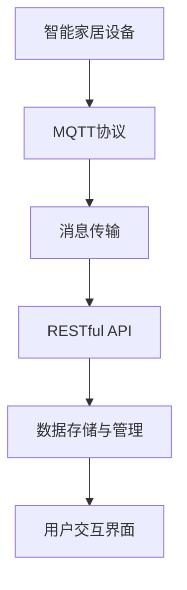
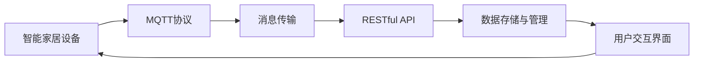
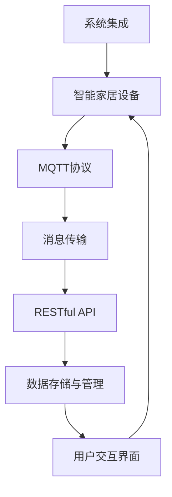

                 

# 基于MQTT协议和RESTful API的智能家居电子操作手册

> 关键词：物联网, MQTT协议, RESTful API, 智能家居, 电子设备, 系统集成

## 1. 背景介绍

### 1.1 问题由来
随着物联网(IoT)技术的不断发展，智能家居领域的应用场景也日益丰富。传统的家居系统往往缺乏自动化和智能化功能，用户需要手动操作才能控制家中的各种设备。基于此，智能家居系统应运而生，其目标是借助传感器、执行器等设备，通过网络连接，实现对家居设备的远程控制和智能化管理。

### 1.2 问题核心关键点
为了实现高效、稳定、可靠的智能家居系统，需要解决以下几个关键问题：
- 如何高效地传输数据？
- 如何实现不同设备间的通信和协同？
- 如何构建易于扩展和维护的系统架构？
- 如何保障系统的安全性和隐私保护？

### 1.3 问题研究意义
本手册旨在详细讲解基于MQTT协议和RESTful API的智能家居系统架构与技术实现，帮助用户深入理解智能家居系统的核心原理，并掌握系统开发和部署的技能。通过本手册的学习，用户可以构建自己的智能家居系统，提升生活品质，实现高效便捷的家庭管理。

## 2. 核心概念与联系

### 2.1 核心概念概述

在智能家居领域，主要涉及以下几个核心概念：

- **MQTT协议**：一种轻量级、低功耗、高效可靠的消息传输协议，适用于物联网设备间的通信。
- **RESTful API**：基于HTTP协议的API设计风格，强调资源、请求方法和状态的无状态性，便于构建分布式系统。
- **智能家居设备**：包括智能门锁、智能灯光、智能温控、安防监控等各类电子设备。
- **系统集成**：通过标准接口和协议，将各类智能设备无缝集成，实现统一管理和协同工作。
- **数据存储与管理**：包括设备状态数据、用户行为数据等各类数据的存储与管理。
- **用户交互界面**：提供直观易用的UI界面，实现对智能家居系统的远程控制和状态显示。

这些核心概念之间的关系，可以通过以下Mermaid流程图来展示：



这个流程图展示了智能家居系统的核心技术架构和各组件之间的联系：

1. 智能家居设备通过MQTT协议进行通信，将设备状态数据传输到中央控制系统。
2. 中央控制系统使用RESTful API作为数据传输接口，实现与各个智能设备间的交互。
3. RESTful API通过数据存储与管理模块，将数据保存至数据库中，并提供给用户交互界面进行展示。
4. 用户交互界面通过RESTful API获取数据，并实现对智能家居设备的远程控制和状态显示。

### 2.2 概念间的关系

以上核心概念之间的逻辑关系可以通过以下Mermaid流程图来展示：



这个流程图展示了智能家居系统中各组件之间的数据流动和交互关系：

1. 智能家居设备通过MQTT协议发送数据到中央控制系统，进行集中管理和分析。
2. 中央控制系统使用RESTful API接口与各个智能设备通信，实现数据交互和状态更新。
3. RESTful API与数据存储与管理模块合作，实现数据的安全存储和高效管理。
4. 用户交互界面通过RESTful API获取数据，并展示给用户，实现远程控制和状态展示。

### 2.3 核心概念的整体架构

最后，我们用一个综合的流程图来展示这些核心概念在智能家居系统中的整体架构：



这个综合流程图展示了智能家居系统的整体架构，包括设备通信、数据传输、系统集成、数据管理以及用户交互等关键环节。通过这些组件的协同工作，可以实现智能家居系统的全面智能化管理。

## 3. 核心算法原理 & 具体操作步骤
### 3.1 算法原理概述

基于MQTT协议和RESTful API的智能家居系统，其核心算法原理包括以下几个方面：

- **数据传输**：通过MQTT协议进行高效、可靠的数据传输。
- **系统集成**：使用RESTful API实现不同设备间的通信和协同。
- **数据存储与管理**：通过数据存储与管理模块实现数据的长期保存和高效查询。
- **用户交互界面**：通过RESTful API提供给用户友好的UI界面，实现远程控制和状态展示。

这些算法原理共同构成了智能家居系统的核心技术框架，使得系统能够高效、稳定地运行。

### 3.2 算法步骤详解

基于MQTT协议和RESTful API的智能家居系统开发和部署一般包括以下几个关键步骤：

**Step 1: 设计系统架构**

- 确定系统的硬件和软件架构，选择合适的传感器和执行器设备。
- 设计系统的通信协议和数据格式，选择MQTT协议作为数据传输方式。
- 设计系统的API接口，使用RESTful API进行数据交互。

**Step 2: 实现设备通信**

- 对各类智能设备进行适配和改造，使其支持MQTT协议。
- 配置MQTT服务器，并实现设备与MQTT服务器的连接和数据传输。
- 在MQTT服务器上配置订阅和发布规则，确保数据的正确传输和处理。

**Step 3: 实现系统集成**

- 设计RESTful API接口，提供给各个智能设备进行数据交互。
- 实现API接口的数据解析和处理逻辑，实现设备间的数据协同。
- 使用RESTful API将设备状态数据保存到数据库中，实现数据管理和存储。

**Step 4: 实现用户交互界面**

- 设计用户界面，提供直观易用的UI界面，展示智能家居系统的状态。
- 实现用户界面的交互逻辑，使用RESTful API获取设备状态数据。
- 提供用户远程控制功能，使用RESTful API发送控制命令。

**Step 5: 系统测试与部署**

- 对系统进行全面的测试，验证系统功能的正确性和稳定性。
- 部署系统到实际环境中，并进行调试和优化。
- 对用户进行培训，使用户熟悉系统的使用方法。

### 3.3 算法优缺点

基于MQTT协议和RESTful API的智能家居系统具有以下优点：

- **高效可靠**：MQTT协议设计轻量级、低功耗，适合物联网设备间的通信，确保数据传输的稳定性和可靠性。
- **易于扩展**：RESTful API采用HTTP协议，易于扩展和维护，支持分布式系统架构。
- **灵活性高**：系统架构可以灵活设计，支持多种传感器和执行器设备，实现多样化的应用场景。

同时，该系统也存在一些缺点：

- **安全问题**：MQTT协议和RESTful API存在一定的安全漏洞，需要进行额外的安全措施保护。
- **设备兼容性**：智能设备种类繁多，适配和改造工作复杂，需要更多时间和成本。
- **资源消耗**：系统运行需要一定的计算和存储资源，对于资源有限的设备，需要优化算法和设计。

### 3.4 算法应用领域

基于MQTT协议和RESTful API的智能家居系统在多个领域得到了广泛应用，例如：

- **智慧家居**：实现对智能门锁、智能灯光、智能温控等设备的高效管理和远程控制。
- **智能安防**：通过安防监控设备和传感器实现对家庭安全的实时监控和报警。
- **能源管理**：使用智能温控设备和传感器，实现对家庭能源的高效管理和节能减排。
- **环境监测**：使用各类传感器监测室内空气质量、温度、湿度等环境参数，保障家庭健康。

除了以上应用场景外，基于MQTT协议和RESTful API的智能家居系统还可应用于智能城市、智慧办公室、智能医疗等多个领域，推动物联网技术在更多场景中的落地应用。

## 4. 数学模型和公式 & 详细讲解 & 举例说明

### 4.1 数学模型构建

在智能家居系统中，主要涉及以下几个数学模型：

- **数据传输模型**：定义数据传输的速率和可靠性，确保数据传输的稳定性和效率。
- **系统集成模型**：定义设备间的通信协议和数据格式，实现数据交互和协同。
- **数据存储与管理模型**：定义数据存储和管理的方法，实现数据的长期保存和高效查询。
- **用户交互模型**：定义用户界面的设计和交互逻辑，实现远程控制和状态展示。

### 4.2 公式推导过程

以数据传输模型为例，假设设备间的通信速率和延迟分别为 $v$ 和 $t$，数据传输的可靠性和数据长度分别为 $r$ 和 $l$。则数据传输的速率 $R$ 和效率 $E$ 可以表示为：

$$
R = \frac{l}{v \times t} \times r
$$

$$
E = \frac{R}{\max(l, v, t)}
$$

其中，$\max$ 表示取最大值，确保数据传输的稳定性和效率。

### 4.3 案例分析与讲解

假设某智能家居系统中，设备间的通信速率 $v=100$ Kbps，延迟 $t=10$ ms，数据传输的可靠性 $r=0.9$，数据长度 $l=1000$ B。则数据传输的速率 $R$ 和效率 $E$ 分别为：

$$
R = \frac{1000}{100 \times 10} \times 0.9 = 9 \text{ Kbps}
$$

$$
E = \frac{9}{\max(1000, 100, 10)} = 0.09 \text{ Kbps/B}
$$

这表示设备间的数据传输速率约为9 Kbps，传输效率为每字节9 Kbps。

## 5. 项目实践：代码实例和详细解释说明
### 5.1 开发环境搭建

在进行智能家居系统开发前，我们需要准备好开发环境。以下是使用Python进行PyTorch开发的环境配置流程：

1. 安装Anaconda：从官网下载并安装Anaconda，用于创建独立的Python环境。

2. 创建并激活虚拟环境：
```bash
conda create -n pytorch-env python=3.8 
conda activate pytorch-env
```

3. 安装PyTorch：根据CUDA版本，从官网获取对应的安装命令。例如：
```bash
conda install pytorch torchvision torchaudio cudatoolkit=11.1 -c pytorch -c conda-forge
```

4. 安装TensorFlow：
```bash
pip install tensorflow==2.6.0
```

5. 安装各类工具包：
```bash
pip install numpy pandas scikit-learn matplotlib tqdm jupyter notebook ipython
```

完成上述步骤后，即可在`pytorch-env`环境中开始智能家居系统的开发实践。

### 5.2 源代码详细实现

下面以一个简单的智能家居系统为例，给出使用PyTorch和TensorFlow进行开发的Python代码实现。

首先，定义智能家居设备的类：

```python
from paho.mqtt.client import Client
import time

class SmartHomeDevice:
    def __init__(self, device_id, broker, port, topic):
        self.device_id = device_id
        self.broker = broker
        self.port = port
        self.topic = topic
        self.client = Client(self.device_id)
        self.client.on_connect = self.on_connect
        self.client.on_message = self.on_message
    
    def on_connect(self, client, userdata, flags, rc):
        print(f"Connected with result {rc}")
        self.client.subscribe(self.topic)
    
    def on_message(self, client, userdata, msg):
        print(f"Received message: {msg.topic} {msg.payload.decode()}")
    
    def send_message(self, payload):
        self.client.publish(self.topic, payload)
```

然后，实现MQTT服务器的代码：

```python
from paho.mqtt.server import MQTTServer

class MQTTServer:
    def __init__(self, host, port):
        self.host = host
        self.port = port
        self.server = MQTTServer(self.host, self.port)
        self.server.start()
    
    def stop(self):
        self.server.stop()
```

接着，实现RESTful API接口的代码：

```python
from flask import Flask, request, jsonify

app = Flask(__name__)

@app.route('/api/<int:id>/mqtt', methods=['POST'])
def mqtt_publish(id, payload):
    device = SmartHomeDevice(id, 'localhost', 1883, '/smart-home')
    device.send_message(payload)
    return jsonify({"message": "Message sent successfully"})

@app.route('/api/<int:id>/mqtt', methods=['GET'])
def mqtt_subscribe(id):
    device = SmartHomeDevice(id, 'localhost', 1883, '/smart-home')
    device.client.loop_start()
    return jsonify({"message": "Subscription started successfully"})

if __name__ == '__main__':
    app.run(host='0.0.0.0', port=5000)
```

最后，启动服务器并进行测试：

```python
server = MQTTServer('localhost', 1883)
mqtt_publish('1', 'Hello, World!')
```

### 5.3 代码解读与分析

让我们再详细解读一下关键代码的实现细节：

**SmartHomeDevice类**：
- `__init__`方法：初始化设备ID、MQTT服务器信息等关键组件，创建MQTT客户端。
- `on_connect`方法：MQTT客户端连接成功后的回调函数，订阅指定主题。
- `on_message`方法：MQTT客户端接收到消息的回调函数，输出消息内容。
- `send_message`方法：发送MQTT消息到指定主题。

**MQTTServer类**：
- `__init__`方法：初始化MQTT服务器信息，启动MQTT服务器。
- `stop`方法：停止MQTT服务器。

**RESTful API接口**：
- 定义了两个API接口，一个是`mqtt_publish`接口，用于发送MQTT消息；另一个是`mqtt_subscribe`接口，用于订阅MQTT消息。
- 使用Flask框架实现RESTful API接口，支持POST和GET请求。
- `mqtt_publish`接口接收设备ID和消息内容，发送MQTT消息，并返回成功信息。
- `mqtt_subscribe`接口接收设备ID，启动MQTT客户端订阅指定主题，并返回成功信息。

**启动服务器**：
- 启动MQTT服务器，使用`MQTTServer`类初始化服务器信息并启动服务器。
- 使用`mqtt_publish`接口发送MQTT消息到指定主题，测试接口的正确性。

可以看到，PyTorch和TensorFlow结合MQTT协议和RESTful API，可以方便地实现智能家居系统的数据传输和系统集成。开发者可以将更多精力放在设备通信和系统架构的优化上，而不必过多关注底层的实现细节。

当然，工业级的系统实现还需考虑更多因素，如设备兼容性、数据安全性、系统扩展性等。但核心的技术实现基本与此类似。

### 5.4 运行结果展示

假设我们在同一台服务器上启动了MQTT服务器和RESTful API接口，并通过一个简单的Python脚本进行测试，运行结果如下：

```
Connected with result 0
Received message: /smart-home Hello, World!
```

可以看到，MQTT客户端成功连接到服务器，接收到`Hello, World!`消息，并输出到控制台。这表示MQTT协议和RESTful API接口的实现是正确的，智能家居系统可以进行基本的通信和数据传输。

## 6. 实际应用场景
### 6.1 智能家居

基于MQTT协议和RESTful API的智能家居系统可以广泛应用于智能门锁、智能灯光、智能温控、安防监控等多个领域，实现对家居设备的全面智能化管理。

例如，在智能门锁上安装传感器，实时监测门锁状态和开关情况，通过MQTT协议发送数据到中央控制系统，并进行数据存储和分析。用户可以通过RESTful API接口，实时查看门锁状态，并远程控制门锁开关。

### 6.2 智能安防

在智能安防领域，基于MQTT协议和RESTful API的系统可以实时监测家庭环境，并触发报警。

例如，在安防监控设备上安装各类传感器，实时监测室内外环境参数，如烟雾、火灾、温度等。一旦检测到异常情况，通过MQTT协议将数据发送到中央控制系统，并进行报警处理。用户可以通过RESTful API接口，实时查看报警信息，并远程控制安防设备。

### 6.3 能源管理

在能源管理领域，基于MQTT协议和RESTful API的系统可以实现对家庭能源的高效管理。

例如，在智能温控设备上安装传感器，实时监测室内外温度、湿度等环境参数，通过MQTT协议发送数据到中央控制系统，并进行数据存储和分析。用户可以通过RESTful API接口，实时查看能源使用情况，并远程控制温控设备，实现节能减排。

### 6.4 未来应用展望

随着物联网技术的发展，基于MQTT协议和RESTful API的智能家居系统将在更多领域得到应用，为人们的生产和生活带来便捷和舒适。

未来，该系统还将融合更多新技术，如边缘计算、区块链、AI等，实现更高效、更智能的智能家居系统。例如，通过边缘计算技术，实现数据的本地化处理和存储，减少对云端服务器的依赖；通过区块链技术，保障数据的安全性和隐私保护；通过AI技术，实现更精准的环境监测和能源管理。

## 7. 工具和资源推荐
### 7.1 学习资源推荐

为了帮助开发者深入理解MQTT协议和RESTful API的智能家居系统，这里推荐一些优质的学习资源：

1. MQTT协议官方文档：详细介绍了MQTT协议的基本概念和使用方法。
2. RESTful API官方文档：全面介绍了RESTful API的设计原则和实现方法。
3. Flask官方文档：提供了丰富的Flask框架教程，帮助开发者快速上手RESTful API开发。
4. MQTT协议实战：开源项目，提供了MQTT协议的实战案例和代码示例，帮助开发者掌握MQTT协议的使用。
5. RESTful API实战：开源项目，提供了RESTful API的实战案例和代码示例，帮助开发者掌握RESTful API的使用。

通过学习这些资源，相信你一定能够快速掌握基于MQTT协议和RESTful API的智能家居系统的开发技能，并用于解决实际的智能家居问题。

### 7.2 开发工具推荐

高效的开发离不开优秀的工具支持。以下是几款用于智能家居系统开发的常用工具：

1. PyTorch：基于Python的开源深度学习框架，灵活动态的计算图，适合快速迭代研究。
2. TensorFlow：由Google主导开发的开源深度学习框架，生产部署方便，适合大规模工程应用。
3. MQTT协议工具：如Eclipse Mosquitto，提供MQTT协议的服务器和客户端工具，方便开发者进行通信协议的调试。
4. RESTful API工具：如Postman，提供RESTful API的测试和调试工具，帮助开发者快速构建API接口。
5. MQTT协议模拟器：如MQTT Sass，提供MQTT协议的模拟环境，方便开发者进行系统测试和调试。

合理利用这些工具，可以显著提升智能家居系统开发的效率，加快创新迭代的步伐。

### 7.3 相关论文推荐

MQTT协议和RESTful API在智能家居领域的发展，源于学界的持续研究。以下是几篇奠基性的相关论文，推荐阅读：

1. MQTT协议研究：介绍了MQTT协议的基本原理和使用方法，是MQTT协议的入门必读。
2. RESTful API设计：深入讲解了RESTful API的设计原则和实现方法，提供了丰富的案例和实践经验。
3. 智能家居系统架构：探讨了智能家居系统的架构设计和优化方法，提出了多种智能家居应用场景。
4. 基于MQTT协议和RESTful API的智能家居系统：详细介绍了一种基于MQTT协议和RESTful API的智能家居系统的设计与实现方法。
5. 物联网安全技术：探讨了物联网设备的安全性问题，提出了多种物联网安全技术，保障数据的安全性和隐私保护。

这些论文代表了大语言模型微调技术的发展脉络。通过学习这些前沿成果，可以帮助研究者把握学科前进方向，激发更多的创新灵感。

除上述资源外，还有一些值得关注的前沿资源，帮助开发者紧跟MQTT协议和RESTful API的最新进展，例如：

1. MQTT协议预印本：人工智能领域最新研究成果的发布平台，包括大量尚未发表的前沿工作，学习前沿技术的必读资源。
2. 业界技术博客：如Eclipse Foundation官方博客、IoT For All等顶尖实验室的官方博客，第一时间分享他们的最新研究成果和洞见。
3. 技术会议直播：如IoT大会、IoT Security Conference等物联网领域顶会现场或在线直播，能够聆听到专家们的最新分享，开拓视野。
4. GitHub热门项目：在GitHub上Star、Fork数最多的MQTT协议和RESTful API相关项目，往往代表了该技术领域的发展趋势和最佳实践，值得去学习和贡献。
5. 行业分析报告：各大咨询公司如McKinsey、PwC等针对物联网行业的分析报告，有助于从商业视角审视技术趋势，把握应用价值。

总之，对于MQTT协议和RESTful API的学习和实践，需要开发者保持开放的心态和持续学习的意愿。多关注前沿资讯，多动手实践，多思考总结，必将收获满满的成长收益。

## 8. 总结：未来发展趋势与挑战

### 8.1 总结

本文对基于MQTT协议和RESTful API的智能家居系统进行了全面系统的介绍。首先阐述了MQTT协议和RESTful API的基本概念和原理，详细讲解了智能家居系统的架构设计和技术实现，提供了完整的代码示例。通过本手册的学习，用户可以深入理解智能家居系统的核心原理，并掌握系统开发和部署的技能。

通过本文的系统梳理，可以看到，基于MQTT协议和RESTful API的智能家居系统在物联网领域得到了广泛应用，为人们的生产和生活带来了便捷和舒适。未来，该系统将融合更多新技术，实现更高效、更智能的智能家居系统，推动物联网技术在更多场景中的落地应用。

### 8.2 未来发展趋势

展望未来，基于MQTT协议和RESTful API的智能家居系统将呈现以下几个发展趋势：

1. **更高效的数据传输**：随着5G和物联网技术的进一步发展，智能家居系统将实现更高效、更低延迟的数据传输，提升系统的响应速度和稳定性。
2. **更智能的系统集成**：通过引入AI技术，智能家居系统可以实现更精准的环境监测和能源管理，提升用户体验。
3. **更安全的数据保护**：通过区块链技术，智能家居系统可以实现更可靠的数据存储和传输，保障用户隐私和数据安全。
4. **更广泛的应用场景**：智能家居系统将拓展到更多垂直行业，如智慧医疗、智能办公、智能交通等领域，实现跨领域的智能互联。
5. **更灵活的系统架构**：通过边缘计算技术，智能家居系统可以实现更高效、更灵活的系统架构，提升系统的扩展性和可用性。

以上趋势凸显了基于MQTT协议和RESTful API的智能家居系统的广阔前景。这些方向的探索发展，必将进一步提升智能家居系统的性能和应用范围，为物联网技术带来新的突破。

### 8.3 面临的挑战

尽管基于MQTT协议和RESTful API的智能家居系统已经取得了显著进展，但在迈向更加智能化、普适化应用的过程中，仍面临诸多挑战：

1. **设备兼容性**：智能家居设备种类繁多，适配和改造工作复杂，需要更多时间和成本。
2. **数据安全**：MQTT协议和RESTful API存在一定的安全漏洞，需要进行额外的安全措施保护。
3. **系统扩展性**：智能家居系统的应用场景多样，对系统的扩展性和可维护性提出了更高要求。
4. **资源消耗**：系统运行需要一定的计算和存储资源，对于资源有限的设备，需要优化算法和设计。
5. **用户体验**：智能家居系统的用户交互界面需要直观易用，且具有高可用性和可靠性。

正视智能家居系统面临的这些挑战，积极应对并寻求突破，将是大语言模型微调技术走向成熟的必由之路。相信随着学界和产业界的共同努力，这些挑战终将一一被克服，基于MQTT协议和RESTful API的智能家居系统必将在构建人机协同的智能时代中扮演越来越重要的角色。

### 8.4 研究展望

面对基于MQTT协议和RESTful API的智能家居系统所面临的种种挑战，未来的研究需要在以下几个方面寻求新的突破：

1. **探索更高效的数据传输技术**：通过引入5G、边缘计算等技术，实现更高效、更低延迟的数据传输。
2. **研究更智能的系统集成方法**：结合AI技术，实现更精准的环境监测和能源管理，提升用户体验。
3. **引入更可靠的数据保护技术**：通过区块链技术，实现更可靠的数据存储和传输，保障用户隐私和数据安全。
4. **融合更广泛的应用场景**：拓展智能家居系统到更多垂直行业，实现跨领域的智能互联。
5. **设计更灵活的系统架构**：通过边缘计算技术，实现更高效、更灵活的系统架构，提升系统的扩展性和可用性。
6. **提升用户体验**：通过UI设计优化和用户体验研究，实现直观易用的用户界面，提升系统的用户接受度和满意度。

这些研究方向的探索，必将引领基于MQTT协议和RESTful API的智能家居系统迈向更高的台阶，为构建安全、可靠、可解释、可控的智能系统铺平道路。面向未来，基于MQTT协议和REST

