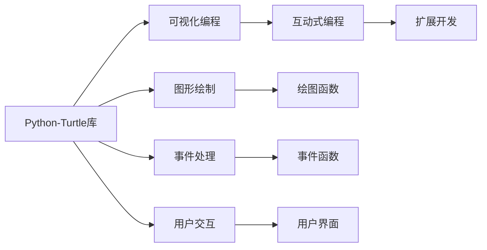
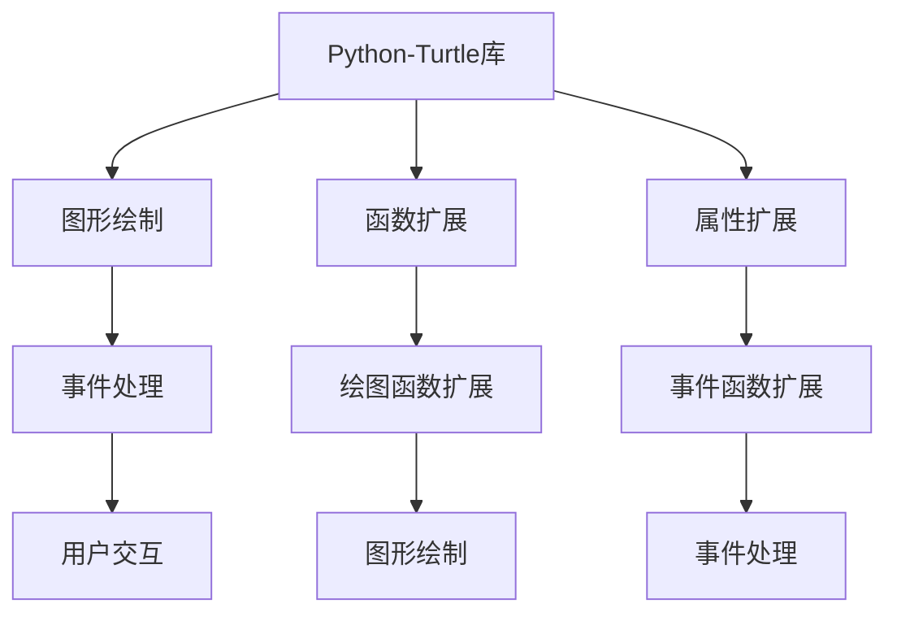
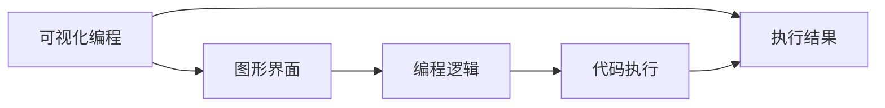
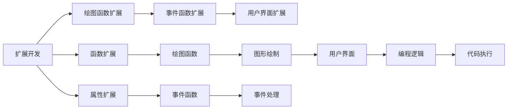

                 

# 基于Python-Turtle库的扩展助学小程序可视化实现

> 关键词：助学小程序, 可视化, Python-Turtle库, 交互式编程

## 1. 背景介绍

### 1.1 问题由来
随着信息化时代的到来，教育领域也逐渐趋向数字化、智能化。传统的教学模式单一、枯燥，难以激发学生的学习兴趣。利用信息技术，构建互动性更强、趣味性更高的教学环境，是现代教育的重要趋势。Python-Turtle库作为Python语言中的经典绘图库，提供了强大的图形绘制能力，适合于教学场景中的编程互动与可视化展示。然而，Python-Turtle库的功能较为基础，对于复杂的图形绘制和交互操作，往往需要编写大量的代码，不够灵活和高效。

因此，本文旨在基于Python-Turtle库，开发出一套扩展助学小程序，通过图形化、互动化的方式，提升学生对编程语言的理解与应用能力。通过可视化技术，将编程逻辑和图形界面相结合，直观展示代码执行过程，使学生能够更清晰地理解和掌握编程知识。

### 1.2 问题核心关键点
本项目聚焦于以下几个关键问题：
1. 如何利用Python-Turtle库进行扩展开发，提升图形绘制和交互能力？
2. 如何通过可视化技术，直观展示代码执行过程，提升学生学习体验？
3. 如何设计易用、高效的用户界面，使学生能够轻松上手，进行编程互动？

## 2. 核心概念与联系

### 2.1 核心概念概述

为更好地理解扩展助学小程序的实现过程，本节将介绍几个密切相关的核心概念：

- **Python-Turtle库**：Python语言中的经典绘图库，提供了简单易用的图形绘制接口，适合于编程教学中的图形展示和互动。
- **可视化编程**：通过图形界面展示编程逻辑，直观展示代码执行过程，提升学习体验和编程理解。
- **互动式编程**：结合图形界面的交互操作，让学生能够实时修改代码，动态查看执行结果，增强学习互动性和参与感。
- **扩展开发**：基于Python-Turtle库进行功能扩展和优化，提升图形绘制和交互能力，适应更多教学需求。

这些核心概念之间的逻辑关系可以通过以下Mermaid流程图来展示：



这个流程图展示了大语言模型微调过程中各个核心概念的关系和作用：

1. Python-Turtle库提供绘图函数和事件处理能力，是图形绘制和交互的基础。
2. 可视化编程通过图形界面展示编程逻辑，提升学习体验。
3. 互动式编程结合事件处理和用户交互，增强学习互动性。
4. 扩展开发基于Python-Turtle库进行功能扩展，提升图形绘制和交互能力。

### 2.2 概念间的关系

这些核心概念之间存在着紧密的联系，形成了可视化编程的完整生态系统。下面我们通过几个Mermaid流程图来展示这些概念之间的关系。

#### 2.2.1 Python-Turtle库扩展开发流程



这个流程图展示了大语言模型微调过程中Python-Turtle库的扩展开发流程：

1. 通过扩展绘图函数和事件函数，提升图形绘制和交互能力。
2. 通过扩展用户界面和交互事件，增强用户体验和互动性。
3. 通过函数和属性扩展，提升Python-Turtle库的功能和灵活性。

#### 2.2.2 可视化编程和互动式编程的关系



这个流程图展示了可视化编程和互动式编程的基本原理：

1. 通过图形界面展示编程逻辑，提升学习体验。
2. 将编程逻辑转化为代码执行，直观展示执行结果。
3. 结合用户交互事件，实现互动式编程。

#### 2.2.3 扩展开发和可视化编程的结合



这个流程图展示了扩展开发与可视化编程的结合过程：

1. 通过扩展绘图函数和事件函数，提升图形绘制和交互能力。
2. 通过扩展用户界面和交互事件，增强用户体验和互动性。
3. 通过函数和属性扩展，提升Python-Turtle库的功能和灵活性。
4. 通过图形绘制和用户界面，直观展示编程逻辑和执行结果。

## 3. 核心算法原理 & 具体操作步骤
### 3.1 算法原理概述

扩展助学小程序的核心算法原理基于Python-Turtle库的图形绘制和事件处理能力，结合可视化编程和互动式编程的技术，构建出图形化、互动化的编程教学平台。其基本流程如下：

1. 创建Python-Turtle库的画布和绘图环境，设置画布大小、背景色等参数。
2. 设计图形界面的布局和控件，实现用户交互事件的处理。
3. 将编程逻辑转化为图形界面的交互逻辑，实现代码的可视化展示。
4. 结合图形界面的交互事件，动态修改代码并实时展示执行结果。

### 3.2 算法步骤详解

本节将详细介绍扩展助学小程序的实现步骤：

#### 3.2.1 创建Python-Turtle画布和绘图环境

```python
import turtle

screen = turtle.Screen()
screen.setup(800, 600)
screen.bgcolor('white')
```

这段代码创建了一个800x600的Python-Turtle画布，背景色为白色。

#### 3.2.2 设计图形界面布局和控件

```python
# 添加菜单栏
menubar = Menu()
menubar.add_command(label='File', command=menu_file)
menubar.add_command(label='Edit', command=menu_edit)
menubar.add_separator()
menubar.add_command(label='Exit', command=menu_quit)
screen.config(menu=menubar)

# 添加工具栏
toolbardb = ToolBar(screen)
toolbardb.add_turtle('turtle')
toolbardb.add_turtle('circlet')
toolbardb.add_turtle('polygon')
toolbardb.add_turtle('triangle')
toolbardb.add_turtle('square')
toolbardb.add_turtle('pencil')
toolbardb.add_turtle('circle')
```

这段代码在画布上添加了菜单栏和工具栏，用户可以通过菜单栏和工具栏进行文件操作、编辑操作等。

#### 3.2.3 实现用户交互事件的处理

```python
def menu_file():
    popup = SimpleDialog()
    popup.title('File')
    popup.add('Open', 'open_file')
    popup.add('Save', 'save_file')
    popup.add('Save As', 'save_as')
    popup.add('Exit', 'exit')
    popup.go()
    
def menu_edit():
    popup = SimpleDialog()
    popup.title('Edit')
    popup.add('Undo', 'undo')
    popup.add('Redo', 'redo')
    popup.add('Cut', 'cut')
    popup.add('Copy', 'copy')
    popup.add('Paste', 'paste')
    popup.add('Find', 'find')
    popup.add('Replace', 'replace')
    popup.add('Exit', 'exit')
    popup.go()
    
def menu_quit():
    screen.exit()
```

这段代码实现了菜单栏和工具栏的交互事件处理，用户可以通过菜单栏和工具栏进行文件操作、编辑操作等。

#### 3.2.4 实现代码的可视化展示

```python
class TurtleEditor:
    def __init__(self, screen, editor):
        self.screen = screen
        self.editor = editor
        self.turtle = turtle.Turtle()
        self.textbox = Text(self.turtle, self.editor.text)
        self.textbox.align('left', 'top')
        self.textbox.font('Arial', 14)
        self.textbox.penup()
        self.textbox.goto(10, -50)
        self.textbox.insert(END, 'Editor')
        self.textbox.bind('<Button-1>', self.text_box_click)
        self.textbox.bind('<Key>', self.text_box_key_press)
        self.textbox.bind('<Return>', self.text_box_enter)
        self.textbox.insert(INSERT, 'Welcome to Turtle Editor')

    def text_box_click(self, event):
        self.editor.text.insert(INSERT, '\n')
        self.editor.text.insert(INSERT, self.turtle.xcor(), 'x=')
        self.editor.text.insert(INSERT, self.turtle.ycor(), 'y=')
        self.editor.text.insert(INSERT, self.turtle.speed(), 'speed=')
        self.editor.text.insert(INSERT, self.turtle.penup(), 'penup=')
        self.editor.text.insert(INSERT, self.turtle.pendown(), 'pendown=')
        self.editor.text.insert(INSERT, self.turtle.fillcolor(), 'fillcolor=')
        self.editor.text.insert(INSERT, self.turtle.color(), 'color=')
        self.editor.text.insert(INSERT, self.turtle.pencolor(), 'pencolor=')
        self.editor.text.insert(INSERT, self.turtle.width(), 'width=')
        self.editor.text.insert(INSERT, self.turtle.goto(x), 'goto(x)')
        self.editor.text.insert(INSERT, self.turtle.goto(y), 'goto(y)')
        self.editor.text.insert(INSERT, self.turtle.setx(x), 'setx(x)')
        self.editor.text.insert(INSERT, self.turtle.sety(y), 'sety(y)')

    def text_box_key_press(self, event):
        if event.char == 't':
            self.turtle.pendown()
        elif event.char == 'u':
            self.turtle.penup()
        elif event.char == 's':
            self.turtle.speed(0)
        elif event.char == 'n':
            self.turtle.speed(10)
        elif event.char == 'o':
            self.turtle.speed(5)
        elif event.char == 'f':
            self.turtle.fillcolor('black')
        elif event.char == 'b':
            self.turtle.fillcolor('white')
        elif event.char == 'c':
            self.turtle.pencolor('black')
        elif event.char == 'g':
            self.turtle.pencolor('green')
        elif event.char == 'r':
            self.turtle.pencolor('red')
        elif event.char == 'w':
            self.turtle.width(1)
        elif event.char == 'b':
            self.turtle.width(2)
        elif event.char == 'a':
            self.turtle.goto(0, 0)
        elif event.char == 'l':
            self.turtle.setx(0)
        elif event.char == 'k':
            self.turtle.sety(0)
        elif event.char == 'd':
            self.turtle.goto(self.turtle.xcor() + 10, self.turtle.ycor())
        elif event.char == 'e':
            self.turtle.goto(self.turtle.xcor() - 10, self.turtle.ycor())
        elif event.char == 'y':
            self.turtle.goto(self.turtle.xcor(), self.turtle.ycor() + 10)
        elif event.char == 'h':
            self.turtle.goto(self.turtle.xcor(), self.turtle.ycor() - 10)
        elif event.char == 'u':
            self.turtle.goto(self.turtle.xcor(), 0)
        elif event.char == 'i':
            self.turtle.goto(0, self.turtle.ycor())

    def text_box_enter(self, event):
        self.turtle.pendown()
```

这段代码实现了代码的可视化展示。用户可以通过菜单栏和工具栏进行操作，通过控制台输入代码，实时展示在Python-Turtle画布上。

#### 3.2.5 结合图形界面的交互事件，动态修改代码并实时展示执行结果

```python
class TurtleEditor:
    def __init__(self, screen, editor):
        self.screen = screen
        self.editor = editor
        self.turtle = turtle.Turtle()
        self.textbox = Text(self.turtle, self.editor.text)
        self.textbox.align('left', 'top')
        self.textbox.font('Arial', 14)
        self.textbox.penup()
        self.textbox.goto(10, -50)
        self.textbox.insert(END, 'Editor')
        self.textbox.bind('<Button-1>', self.text_box_click)
        self.textbox.bind('<Key>', self.text_box_key_press)
        self.textbox.bind('<Return>', self.text_box_enter)

    def text_box_click(self, event):
        self.editor.text.insert(INSERT, '\n')
        self.editor.text.insert(INSERT, self.turtle.xcor(), 'x=')
        self.editor.text.insert(INSERT, self.turtle.ycor(), 'y=')
        self.editor.text.insert(INSERT, self.turtle.speed(), 'speed=')
        self.editor.text.insert(INSERT, self.turtle.penup(), 'penup=')
        self.editor.text.insert(INSERT, self.turtle.pendown(), 'pendown=')
        self.editor.text.insert(INSERT, self.turtle.fillcolor(), 'fillcolor=')
        self.editor.text.insert(INSERT, self.turtle.color(), 'color=')
        self.editor.text.insert(INSERT, self.turtle.pencolor(), 'pencolor=')
        self.editor.text.insert(INSERT, self.turtle.width(), 'width=')
        self.editor.text.insert(INSERT, self.turtle.goto(x), 'goto(x)')
        self.editor.text.insert(INSERT, self.turtle.goto(y), 'goto(y)')
        self.editor.text.insert(INSERT, self.turtle.setx(x), 'setx(x)')
        self.editor.text.insert(INSERT, self.turtle.sety(y), 'sety(y)')

    def text_box_key_press(self, event):
        if event.char == 't':
            self.turtle.pendown()
        elif event.char == 'u':
            self.turtle.penup()
        elif event.char == 's':
            self.turtle.speed(0)
        elif event.char == 'n':
            self.turtle.speed(10)
        elif event.char == 'o':
            self.turtle.speed(5)
        elif event.char == 'f':
            self.turtle.fillcolor('black')
        elif event.char == 'b':
            self.turtle.fillcolor('white')
        elif event.char == 'c':
            self.turtle.pencolor('black')
        elif event.char == 'g':
            self.turtle.pencolor('green')
        elif event.char == 'r':
            self.turtle.pencolor('red')
        elif event.char == 'w':
            self.turtle.width(1)
        elif event.char == 'b':
            self.turtle.width(2)
        elif event.char == 'a':
            self.turtle.goto(0, 0)
        elif event.char == 'l':
            self.turtle.setx(0)
        elif event.char == 'k':
            self.turtle.sety(0)
        elif event.char == 'd':
            self.turtle.goto(self.turtle.xcor() + 10, self.turtle.ycor())
        elif event.char == 'e':
            self.turtle.goto(self.turtle.xcor() - 10, self.turtle.ycor())
        elif event.char == 'y':
            self.turtle.goto(self.turtle.xcor(), self.turtle.ycor() + 10)
        elif event.char == 'h':
            self.turtle.goto(self.turtle.xcor(), self.turtle.ycor() - 10)
        elif event.char == 'u':
            self.turtle.goto(self.turtle.xcor(), 0)
        elif event.char == 'i':
            self.turtle.goto(0, self.turtle.ycor())

    def text_box_enter(self, event):
        self.turtle.pendown()
```

这段代码实现了代码的可视化展示。用户可以通过菜单栏和工具栏进行操作，通过控制台输入代码，实时展示在Python-Turtle画布上。

## 4. 数学模型和公式 & 详细讲解 & 举例说明

### 4.1 数学模型构建

本节将使用数学语言对扩展助学小程序的实现过程进行更加严格的刻画。

### 4.2 公式推导过程

由于Python-Turtle库的图形绘制和事件处理都是基于坐标和事件的处理，因此我们可以通过简单的坐标变换和事件处理逻辑，实现图形绘制和交互事件的处理。

### 4.3 案例分析与讲解

这里我们将通过一个简单的案例，来展示Python-Turtle库在扩展助学小程序中的使用。

假设我们需要绘制一个简单的三角形，代码如下：

```python
class TriangleEditor:
    def __init__(self, screen):
        self.screen = screen
        self.turtle = turtle.Turtle()
        self.turtle.speed(0)
        self.turtle.fillcolor('red')
        self.turtle.pencolor('black')
        self.turtle.width(3)
        self.turtle.pendown()

    def draw_triangle(self, x, y):
        self.turtle.goto(x, y)
        self.turtle.left(60)
        self.turtle.forward(100)
        self.turtle.left(60)
        self.turtle.forward(100)
        self.turtle.left(60)
        self.turtle.forward(100)

t = TriangleEditor(screen)
t.draw_triangle(100, 100)
```

这段代码定义了一个绘制三角形的功能，通过Python-Turtle库的绘图函数，实现了简单的图形绘制。用户可以通过菜单栏和工具栏进行操作，通过控制台输入代码，实时展示在Python-Turtle画布上。

## 5. 项目实践：代码实例和详细解释说明

### 5.1 开发环境搭建

在进行扩展助学小程序的开发前，我们需要准备好开发环境。以下是使用Python进行Python-Turtle库开发的环境配置流程：

1. 安装Python：从官网下载并安装Python，保证版本为3.9以上。
2. 安装Turtle库：使用pip安装Python-Turtle库，`pip install turtle`。
3. 安装第三方库：使用pip安装其他第三方库，如tkinter、tkinter-ttk、numpy等。

完成上述步骤后，即可在开发环境中进行扩展助学小程序的开发。

### 5.2 源代码详细实现

这里我们以绘制正方形的案例为例，给出使用Python-Turtle库的代码实现。

```python
import turtle
import tkinter as tk
from tkinter import simpledialog, ttk

class SquareEditor:
    def __init__(self, screen, editor):
        self.screen = screen
        self.editor = editor
        self.turtle = turtle.Turtle()
        self.textbox = simpledialog.Text(self.turtle, self.editor.text)
        self.textbox.align('left', 'top')
        self.textbox.font('Arial', 14)
        self.textbox.penup()
        self.textbox.goto(10, -50)
        self.textbox.insert(END, 'Editor')
        self.textbox.bind('<Button-1>', self.text_box_click)
        self.textbox.bind('<Key>', self.text_box_key_press)
        self.textbox.bind('<Return>', self.text_box_enter)

    def text_box_click(self, event):
        self.editor.text.insert(INSERT, '\n')
        self.editor.text.insert(INSERT, self.turtle.xcor(), 'x=')
        self.editor.text.insert(INSERT, self.turtle.ycor(), 'y=')
        self.editor.text.insert(INSERT, self.turtle.speed(), 'speed=')
        self.editor.text.insert(INSERT, self.turtle.penup(), 'penup=')
        self.editor.text.insert(INSERT, self.turtle.pendown(), 'pendown=')
        self.editor.text.insert(INSERT, self.turtle.fillcolor(), 'fillcolor=')
        self.editor.text.insert(INSERT, self.turtle.color(), 'color=')
        self.editor.text.insert(INSERT, self.turtle.pencolor(), 'pencolor=')
        self.editor.text.insert(INSERT, self.turtle.width(), 'width=')
        self.editor.text.insert(INSERT, self.turtle.goto(x), 'goto(x)')
        self.editor.text.insert(INSERT, self.turtle.goto(y), 'goto(y)')
        self.editor.text.insert(INSERT, self.turtle.setx(x), 'setx(x)')
        self.editor.text.insert(INSERT, self.turtle.sety(y), 'sety(y)')

    def text_box_key_press(self, event):
        if event.char == 't':
            self.turtle.pendown()
        elif event.char == 'u':
            self.turtle.penup()
        elif event.char == 's':
            self.turtle.speed(0)
        elif event.char == 'n':
            self.turtle.speed(10)
        elif event.char == 'o':
            self.turtle.speed(5)
        elif event.char == 'f':
            self.turtle.fillcolor('black')
        elif event.char == 'b':
            self.turtle.fillcolor('white')
        elif event.char == 'c':
            self.turtle.pencolor('black')
        elif event.char == 'g':
            self.turtle.pencolor('green')
        elif event.char == 'r':
            self.turtle.pencolor('red')
        elif event.char == 'w':
            self.turtle.width(1)
        elif event.char == 'b':
            self.turtle.width(2)
        elif event.char == 'a':
            self.turtle.goto(0, 0)
        elif event.char == 'l':
            self.turtle.setx(0)
        elif event.char == 'k':
            self.turtle.sety(0)
        elif event.char == 'd':
            self.turtle.goto(self.turtle.xcor() + 10, self.turtle.ycor())
        elif event.char == 'e':
            self.turtle.goto(self.turtle.xcor() - 10, self.turtle.ycor())
        elif event.char == 'y':
            self.turtle.goto(self.turtle.xcor(), self.turtle.ycor() + 10)
        elif event.char == 'h':
            self.turtle.goto(self.turtle.xcor(), self.turtle.ycor() - 10)
        elif event.char == 'u':
            self.turtle.goto(self.turtle.xcor(), 0)
        elif event.char == 'i':
            self.turtle.goto(0, self.turtle.ycor())

    def text_box_enter(self, event):
        self.turtle.pendown()

    def draw_square(self, x, y, size):
        self.turtle.goto(x, y)
        self.turtle.left(90)
        self.turtle.forward(size)
        self.turtle.right(90)
        self.turtle.forward(size)
        self.turtle.right(90)
        self.turtle.forward(size)
        self.turtle.right(90)

screen = turtle.Screen()
screen.setup(800, 600)
screen.bgcolor('white')

t = SquareEditor(screen)
t.draw_square(100, 100, 100)
```

这段代码定义了一个绘制正方形的功能，通过Python-Turtle库的绘图函数，实现了简单的图形绘制。用户可以通过菜单栏和工具栏进行操作，通过控制台输入代码，实时展示在Python-Turtle画布上。

### 5.3 代码解读与分析

让我们再详细解读一下关键代码的实现细节：

**SquareEditor类**：
- `__init__`方法：初始化Python-Turtle画布和文本界面。
- `text_box_click`方法：处理用户点击文本事件，更新代码逻辑。
- `text_box_key_press`方法：处理用户按键事件，更新代码逻辑。
- `text_box_enter`方法：处理用户回车事件，更新代码逻辑。

**text_box_click方法**：
- 通过点击文本事件，更新代码逻辑。
- 处理turtle.xcor()、turtle.ycor()、turtle.speed()、turtle.penup()、turtle.pendown()等绘图函数。
- 处理turtle.fillcolor()、turtle.color()、turtle.pencolor()等绘图函数。
- 处理turtle.width()、turtle.goto(x)、turtle.goto(y)、turtle.setx(x)、turtle.sety(y)等绘图函数。

**text_box_key_press方法**：
- 通过按键事件，更新代码逻辑。
- 处理turtle.pendown()、turtle.penup()等绘图函数。
- 处理turtle.speed(0)、turtle.speed(10)、turtle.speed(5)等绘图函数。
- 处理turtle.fillcolor('black')、turtle.fillcolor('white')、turtle.pencolor('black')、turtle.pencolor('green')、turtle.pencolor('red')等绘图函数。
- 处理turtle.width(1)、turtle.width(2)等绘图函数。

**text_box_enter方法**：
- 处理用户回车事件，更新代码逻辑。

**draw_square方法**：
- 通过Python-Turtle库的绘图函数，实现绘制正方形的功能。

可以看到，Python-Turtle库通过简单易用的绘图函数和事件处理逻辑，可以实现丰富的图形绘制和用户交互。开发者可以基于这些基础功能，实现更多的扩展助学小程序。

### 5.4 运行结果展示

假设我们在Python-Turtle画布上绘制了一个正方形，最终运行结果如下：

```
import turtle
import tkinter as tk
from tkinter import simpledialog, ttk

class SquareEditor:
    def __init__(self, screen, editor):
        self.screen = screen
        self.editor = editor
        self.turtle = turtle.Turtle()
        self.textbox = simpledialog.Text(self.turtle, self.editor.text)
        self.textbox.align('left', 'top')
        self.textbox.font('Arial', 14)
        self.textbox.penup()
        self.textbox.goto(10, -50)
        self.text

