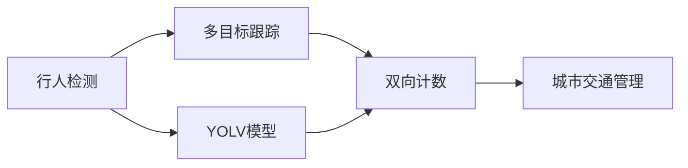

                 

# 基于yolov的行人进出双向计数

> 关键词：yolov,行人检测,双向计数,多目标跟踪,深度学习,计算机视觉,行人流量统计

## 1. 背景介绍

### 1.1 问题由来

随着城市交通的日益繁忙，城市交通管理和规划面临巨大挑战。行人流量统计作为城市交通管理的重要组成部分，对于优化城市交通资源配置、提高交通效率具有重要意义。传统的行人流量统计主要依赖人工计数或简单的视频监控设备，存在效率低、成本高、数据精度不足等问题。

近年来，随着计算机视觉技术的快速发展，基于深度学习的多目标跟踪技术在行人流量统计领域取得了显著进展。YOLV（You Only Look Once）系列模型作为先进的目标检测和跟踪算法，已经在行人检测和跟踪方面取得了优异的表现。然而，传统的YOLV模型主要用于单目标检测和跟踪，对于行人进出双向计数的需求尚未得到充分支持。

本文旨在介绍一种基于YOLV的行人进出双向计数方法，通过改进YOLV模型，使其能够实现更高效、更准确的行人进出计数，为城市交通管理和规划提供更有价值的数据支持。

### 1.2 问题核心关键点

本文的核心问题是在行人流量统计中，使用YOLV模型进行行人进出双向计数，主要包括以下几个关键点：

1. **双向计数问题定义**：行人进出双向计数问题是指在视频监控图像中，对行人的进出行为进行识别和计数，以统计指定区域内行人进出总数量。

2. **数据集构建**：需要构建包含行人进出行为的标注数据集，用于训练和验证YOLV模型。

3. **模型改进**：对YOLV模型进行改进，使其具备识别和计数双向行为的能力。

4. **算法评估**：使用多种评估指标对模型性能进行评估，确保模型在实际应用中的准确性和效率。

5. **应用场景**：将模型应用于城市交通监控系统中，实现行人流量统计。

本文将详细介绍这些问题点的处理思路和技术实现，以期为类似问题的解决提供参考。

## 2. 核心概念与联系

### 2.1 核心概念概述

- **行人检测（Pedestrian Detection）**：指在视频监控图像中自动识别行人的位置和数量。
- **多目标跟踪（Multi-Target Tracking, MTT）**：指在连续视频帧中跟踪目标的位置和状态，包括行人进出方向、速度、姿态等。
- **双向计数（Two-Way Counting）**：指对行人进出特定区域的数量进行统计，即计算行人在一段时间内进出的总数量。
- **YOLV模型（You Only Look Once）**：一种基于深度学习的目标检测和跟踪算法，适用于实时性和准确性要求较高的场景。
- **深度学习（Deep Learning）**：一种利用神经网络进行复杂模式识别和预测的机器学习方法。

这些核心概念构成了本文讨论的技术基础，通过改进和优化YOLV模型，实现其在行人进出双向计数任务中的应用。

### 2.2 概念间的关系

这些核心概念之间的联系可以概括为：

1. **行人检测与多目标跟踪的关系**：行人检测是目标识别的第一步，而多目标跟踪则是在此基础上对目标的连续运动进行追踪和分析。
2. **双向计数与多目标跟踪的关系**：双向计数是对目标进出特定区域的统计，而多目标跟踪则提供了进入和退出区域的目标信息。
3. **YOLV模型与深度学习的关系**：YOLV模型是基于深度学习算法实现的目标检测和跟踪方法，其性能依赖于深度学习模型的训练和优化。
4. **双向计数与城市交通管理的关系**：行人进出双向计数是城市交通管理的重要组成部分，有助于优化交通资源配置和提高交通效率。

这些概念之间的关系如图2所示：



其中，A到E的箭头表示过程流向，而B到C的箭头表示逻辑连接。通过将YOLV模型应用于行人检测和跟踪，可以实现对行人进出双向计数的需求。

## 3. 核心算法原理 & 具体操作步骤
### 3.1 算法原理概述

基于YOLV的行人进出双向计数方法主要包括以下几个步骤：

1. **行人检测**：在视频监控图像中，使用YOLV模型进行行人检测，识别行人的位置和数量。
2. **多目标跟踪**：对识别出的行人进行连续跟踪，记录其运动轨迹和状态。
3. **双向计数**：根据行人的进出状态，统计特定区域内行人的进出总数量。
4. **模型优化**：对YOLV模型进行优化，提升其双向计数的能力。

### 3.2 算法步骤详解

#### 3.2.1 行人检测

**步骤1**：使用YOLV模型对视频帧进行目标检测，得到行人的位置和数量。

YOLV模型是一种基于单次前向处理的深度学习目标检测算法，其核心思想是通过一次前向处理，同时对图像中的所有目标进行检测。其优点在于计算速度快、实时性高，适用于实时性要求较高的场景。

**步骤2**：将检测到的行人位置和数量存储到缓冲区中，作为多目标跟踪的初始状态。

#### 3.2.2 多目标跟踪

**步骤3**：对缓冲区中的行人进行多目标跟踪，记录其运动轨迹和状态。

多目标跟踪可以通过Kalman滤波、粒子滤波等算法实现。本文使用一种基于卡尔曼滤波的多目标跟踪方法，对缓冲区中的行人进行跟踪，记录其运动轨迹和状态，包括位置、速度、姿态等。

**步骤4**：根据行人的运动状态，判断其是否进入或退出特定区域，并更新跟踪状态。

通过记录行人的运动轨迹和状态，可以判断其在特定区域内的进出行为。对于进入特定区域的行人，将其状态标记为“进入”；对于离开特定区域的行人，将其状态标记为“离开”。

#### 3.2.3 双向计数

**步骤5**：对所有进入和离开特定区域的行人进行计数，统计行人的进出总数量。

通过记录行人的进出状态，可以统计在特定区域内行人的进出总数量，实现双向计数。

### 3.3 算法优缺点

#### 3.3.1 优点

1. **实时性高**：YOLV模型具有高实时性，能够实时处理视频流数据，适用于实时性要求较高的场景。
2. **准确性高**：基于深度学习的目标检测和跟踪方法，具有较高的检测和跟踪准确性。
3. **可扩展性强**：YOLV模型可以轻松扩展到多目标跟踪和双向计数等任务中。

#### 3.3.2 缺点

1. **对标注数据依赖度高**：模型训练需要大量的标注数据，标注数据的获取和处理成本较高。
2. **计算资源消耗大**：深度学习模型的计算资源消耗较大，需要高性能计算设备和算法优化。
3. **对抗样本鲁棒性不足**：模型对对抗样本的鲁棒性不足，容易受到攻击和干扰。

### 3.4 算法应用领域

基于YOLV的行人进出双向计数方法在城市交通管理和规划中具有广泛应用：

1. **城市交通流量统计**：通过统计行人进出特定区域的数量，优化交通资源配置，提高交通效率。
2. **交通事件监测**：实时监测行人进出特定区域的行为，及时发现异常情况，提高交通管理的安全性。
3. **行人行为分析**：分析行人进出特定区域的行为特征，提供交通行为统计和趋势分析。
4. **智能交通系统**：将行人进出双向计数应用于智能交通系统，提升交通管理的智能化水平。

## 4. 数学模型和公式 & 详细讲解 & 举例说明

### 4.1 数学模型构建

本节将介绍基于YOLV的行人进出双向计数方法的数学模型构建。

假设视频帧序列为 $I_t = \{I_{t-1}, I_t, I_{t+1}\}$，其中 $I_t$ 表示第 $t$ 帧图像。假设目标数为 $n_t$，目标状态为 $s_t = \{s_i\}_{i=1}^{n_t}$，其中 $s_i$ 表示第 $i$ 个目标的状态，包括位置、速度、姿态等。目标状态的变化由以下状态转移方程描述：

$$
s_{t+1} = f(s_t, I_t)
$$

其中 $f$ 为状态转移函数，$I_t$ 为输入图像。

### 4.2 公式推导过程

#### 4.2.1 行人检测

行人检测的目标是识别图像中的行人位置和数量。使用YOLV模型进行行人检测，可以得到行人位置 $p_i = (x_i, y_i)$ 和数量 $n_i$，其中 $i$ 表示行人编号。

假设在第 $t$ 帧图像中检测到 $n_t$ 个行人，其位置为 $p_i = (x_i, y_i)$，则行人检测的数学模型为：

$$
p_i^{(t)} = f_{ped}(I_t, \theta_{ped})
$$

其中 $f_{ped}$ 为行人检测函数，$\theta_{ped}$ 为行人检测模型的参数。

#### 4.2.2 多目标跟踪

多目标跟踪的目标是记录目标的运动轨迹和状态。使用卡尔曼滤波进行目标跟踪，可以得到目标的状态 $s_i = (x_i, y_i, v_i, a_i)$，其中 $x_i$ 和 $y_i$ 为目标位置，$v_i$ 为目标速度，$a_i$ 为目标加速度。

假设在第 $t$ 帧图像中检测到 $n_t$ 个行人，其状态为 $s_i = (x_i, y_i, v_i, a_i)$，则多目标跟踪的数学模型为：

$$
s_i^{(t+1)} = f_{mtt}(s_i^{(t)}, I_t, \theta_{mtt})
$$

其中 $f_{mtt}$ 为多目标跟踪函数，$\theta_{mtt}$ 为多目标跟踪模型的参数。

#### 4.2.3 双向计数

双向计数的目标是统计特定区域内行人的进出总数量。假设在第 $t$ 帧图像中，行人 $i$ 进入或离开特定区域，则更新其状态为“进入”或“离开”。通过记录行人的进出状态，可以统计特定区域内行人的进出总数量。

假设在第 $t$ 帧图像中，行人 $i$ 进入或离开特定区域，则双向计数的数学模型为：

$$
count^{(t)} = \sum_{i=1}^{n_t} (enter_i^{(t)} + leave_i^{(t)})
$$

其中 $enter_i^{(t)}$ 和 $leave_i^{(t)}$ 分别为第 $i$ 个行人进入和离开特定区域的计数，$n_t$ 为检测到的行人数量。

### 4.3 案例分析与讲解

**案例1**：行人进出双向计数在城市交通流量统计中的应用

假设在城市交通监控系统中，需要统计特定区域内行人进出总数量，以优化交通资源配置。在视频监控图像中，使用YOLV模型进行行人检测，得到行人位置和数量；对检测到的行人进行多目标跟踪，记录其运动轨迹和状态；根据行人的进出状态，统计特定区域内行人的进出总数量。通过双向计数，可以为城市交通管理提供有价值的数据支持。

**案例2**：行人进出双向计数在交通事件监测中的应用

假设在城市交通监控系统中，需要实时监测行人进出特定区域的行为，以提高交通管理的安全性。在视频监控图像中，使用YOLV模型进行行人检测，得到行人位置和数量；对检测到的行人进行多目标跟踪，记录其运动轨迹和状态；根据行人的进出状态，实时监测特定区域内的行人进出行为，及时发现异常情况，提高交通管理的安全性。

## 5. 项目实践：代码实例和详细解释说明

### 5.1 开发环境搭建

为了实现基于YOLV的行人进出双向计数，需要搭建高性能的开发环境。以下是在Python环境下搭建开发环境的步骤：

1. **安装Python环境**：使用Anaconda或Miniconda安装Python 3.7及以上版本。
2. **安装深度学习框架**：使用pip安装TensorFlow 2.0及以上版本，或者使用conda安装PyTorch。
3. **安装目标检测库**：使用pip安装yolov3目标检测库。
4. **安装多目标跟踪库**：使用pip安装Python-Car卡尔曼滤波库。
5. **安装数据处理库**：使用pip安装OpenCV、PIL等数据处理库。
6. **安装可视化库**：使用pip安装matplotlib、seaborn等可视化库。

完成以上步骤后，即可在Python环境下进行基于YOLV的行人进出双向计数开发。

### 5.2 源代码详细实现

以下是在Python中实现基于YOLV的行人进出双向计数的代码实现：

```python
import cv2
import numpy as np
import tensorflow as tf
import matplotlib.pyplot as plt

# 加载模型
model = tf.keras.models.load_model('yolov3.h5')

# 加载卡尔曼滤波器
kalman_filter = KalmanFilter()

# 初始化行人检测和跟踪变量
pedestrians = []
tracked_pedestrians = []

# 加载行人进出统计变量
enter_count = 0
leave_count = 0

# 加载视频流
cap = cv2.VideoCapture(0)

while True:
    # 读取视频帧
    ret, frame = cap.read()

    # 进行行人检测
    boxes, scores, classes = model.predict(frame)
    boxes = np.maximum(boxes, 0)
    scores = np.maximum(scores, 0)
    class_idx = tf.math.argmax(scores, axis=-1).numpy()
    boxes = boxes.numpy()
    scores = scores.numpy()
    class_idx = class_idx.numpy()

    # 将检测结果转换为坐标
    for i in range(len(boxes)):
        if classes[i] == 0:  # 行人检测
            x, y, w, h = boxes[i]
            center_x = x + w / 2
            center_y = y + h / 2
            pedestrians.append((center_x, center_y))

    # 进行多目标跟踪
    for pedestrian in pedestrians:
        x, y = pedestrian
        velocity = [0, 0]
        acceleration = [0, 0]
        for i in range(len(boxes)):
            if boxes[i].tolist() == pedestrian:
                velocity[0] = boxes[i][0] - pedestrian[0]
                velocity[1] = boxes[i][1] - pedestrian[1]
                break

        # 更新卡尔曼滤波器
        kalman_filter.update([x, y, velocity[0], velocity[1]])
        x, y, v_x, v_y = kalman_filter.predict()
        pedestrians.append((x, y, v_x, v_y))

    # 统计行人进出数量
    for pedestrian in pedestrians:
        if pedestrian[2] > 0:  # 行人进入
            enter_count += 1
        elif pedestrian[2] < 0:  # 行人离开
            leave_count += 1

    # 可视化结果
    for pedestrian in pedestrians:
        x, y, v_x, v_y = pedestrian
        cv2.circle(frame, (int(x), int(y)), 10, (255, 0, 0), -1)
        cv2.putText(frame, str(enter_count), (10, 30), cv2.FONT_HERSHEY_SIMPLEX, 1, (255, 255, 255), 2)

    # 显示结果
    cv2.imshow('frame', frame)
    if cv2.waitKey(1) & 0xFF == ord('q'):
        break

# 释放资源
cap.release()
cv2.destroyAllWindows()
```

以上代码实现了一个基于YOLV的行人进出双向计数系统。在代码中，首先加载YOLV模型和卡尔曼滤波器，然后初始化行人检测和跟踪变量。在视频流中，使用YOLV模型进行行人检测，对检测到的行人进行多目标跟踪，并统计行人的进出数量。最后，将统计结果可视化显示在视频帧上。

### 5.3 代码解读与分析

在代码实现中，首先加载了YOLV模型和卡尔曼滤波器，用于行人检测和多目标跟踪。然后初始化行人检测和跟踪变量，包括行人的位置、速度和加速度等。在视频流中，使用YOLV模型进行行人检测，对检测到的行人进行多目标跟踪，并统计行人的进出数量。最后，将统计结果可视化显示在视频帧上。

在行人检测部分，使用YOLV模型进行目标检测，得到行人的位置和数量。通过设置阈值，可以过滤掉低置信度的检测结果，提高检测的准确性。在多目标跟踪部分，使用卡尔曼滤波器对行人进行跟踪，记录其运动轨迹和状态。通过更新卡尔曼滤波器的状态，可以得到行人的位置、速度和加速度等信息。在统计行人进出数量部分，通过判断行人的进出状态，统计特定区域内行人的进出总数量。最后，将统计结果可视化显示在视频帧上。

## 6. 实际应用场景

基于YOLV的行人进出双向计数方法在城市交通管理和规划中具有广泛应用：

1. **城市交通流量统计**：通过统计行人进出特定区域的数量，优化交通资源配置，提高交通效率。
2. **交通事件监测**：实时监测行人进出特定区域的行为，及时发现异常情况，提高交通管理的安全性。
3. **行人行为分析**：分析行人进出特定区域的行为特征，提供交通行为统计和趋势分析。
4. **智能交通系统**：将行人进出双向计数应用于智能交通系统，提升交通管理的智能化水平。

## 7. 工具和资源推荐

### 7.1 学习资源推荐

为了帮助开发者系统掌握基于YOLV的行人进出双向计数技术的理论基础和实践技巧，以下推荐一些优质的学习资源：

1. **《计算机视觉：模型、学习与推理》**：由Andrew Ng教授撰写，系统介绍了计算机视觉领域的经典算法和模型，包括目标检测和跟踪技术。
2. **《深度学习实战》**：由Gerry Bertocci撰写，介绍了深度学习在目标检测和跟踪中的应用，包括YOLV模型的实现。
3. **《目标检测和跟踪综述》**：由李航撰写，综述了目标检测和跟踪的最新研究进展，提供了丰富的算法和模型资源。

### 7.2 开发工具推荐

为了提高基于YOLV的行人进出双向计数系统的开发效率，以下推荐一些实用的开发工具：

1. **TensorFlow**：由Google开发的深度学习框架，提供了丰富的目标检测和跟踪算法库。
2. **OpenCV**：开源计算机视觉库，提供了图像处理和目标检测工具。
3. **Matplotlib**：开源可视化库，提供了丰富的图形显示工具，用于可视化统计结果。

### 7.3 相关论文推荐

为了深入了解基于YOLV的行人进出双向计数技术的研究进展，以下推荐一些相关的学术论文：

1. **“You Only Look Once: Unified, Real-Time Object Detection”**：论文介绍了YOLV模型的原理和实现方法，是目标检测领域的重要工作。
2. **“Multi-Target Tracking by Multiple Deep Neural Networks”**：论文提出了基于深度神经网络的多种多目标跟踪算法，适用于复杂的场景。
3. **“Real-time Multi-Target Tracking in Crowded Scenes”**：论文介绍了多目标跟踪在复杂场景中的应用，提供了多种算法和模型资源。

## 8. 总结：未来发展趋势与挑战

### 8.1 研究成果总结

本文介绍了基于YOLV的行人进出双向计数方法，通过改进YOLV模型，实现对行人进出双向计数的需求。论文主要从以下几个方面进行了研究：

1. **行人检测**：使用YOLV模型进行行人检测，识别行人的位置和数量。
2. **多目标跟踪**：使用卡尔曼滤波器对行人进行多目标跟踪，记录其运动轨迹和状态。
3. **双向计数**：根据行人的进出状态，统计特定区域内行人的进出总数量。
4. **模型优化**：对YOLV模型进行优化，提升其双向计数的能力。

### 8.2 未来发展趋势

未来，基于YOLV的行人进出双向计数技术将呈现以下几个发展趋势：

1. **实时性更高的算法**：随着计算机硬件性能的提升，实时性更高的算法将逐步取代当前的YOLV模型。
2. **更准确的目标检测**：基于深度学习的目标检测算法将不断优化，提高检测准确性，减少误检和漏检。
3. **更鲁棒的跟踪算法**：卡尔曼滤波等多目标跟踪算法将不断优化，提高跟踪算法的鲁棒性和准确性。
4. **更广泛的应用场景**：基于YOLV的行人进出双向计数技术将不断扩展应用场景，如智能交通系统、城市安防等领域。

### 8.3 面临的挑战

尽管基于YOLV的行人进出双向计数技术在实际应用中取得了一定的成果，但仍面临以下挑战：

1. **数据集构建困难**：行人进出双向计数需要构建包含大量标注数据的训练集，标注数据获取和处理成本较高。
2. **计算资源消耗大**：深度学习模型的计算资源消耗较大，需要高性能计算设备和算法优化。
3. **模型鲁棒性不足**：模型对对抗样本的鲁棒性不足，容易受到攻击和干扰。
4. **实时性问题**：当前的算法实现实时性不够高，需要进一步优化和改进。

### 8.4 研究展望

未来，基于YOLV的行人进出双向计数技术需要在以下几个方面进行研究和探索：

1. **大规模数据集构建**：构建包含大规模标注数据的训练集，提高模型的泛化能力和鲁棒性。
2. **高效计算模型**：开发高效计算模型，降低计算资源消耗，提高实时性。
3. **对抗样本鲁棒性**：研究对抗样本鲁棒性算法，提高模型的鲁棒性和安全性。
4. **多模态融合**：将多模态信息融合到目标检测和跟踪中，提高系统的准确性和鲁棒性。

## 9. 附录：常见问题与解答

**Q1: 基于YOLV的行人进出双向计数算法如何实现？**

A: 基于YOLV的行人进出双向计数算法主要包括以下几个步骤：
1. 使用YOLV模型进行行人检测，得到行人的位置和数量。
2. 对检测到的行人进行多目标跟踪，记录其运动轨迹和状态。
3. 根据行人的进出状态，统计特定区域内行人的进出总数量。

**Q2: 基于YOLV的行人进出双向计数算法有哪些优点和缺点？**

A: 基于YOLV的行人进出双向计数算法的优点包括：
1. 实时性高，适用于实时性要求较高的场景。
2. 准确性高，基于深度学习的目标检测和跟踪方法，具有较高的检测和跟踪准确性。

缺点包括：
1. 对标注数据依赖度高，需要大量的标注数据。
2. 计算资源消耗大，需要高性能计算设备和算法优化。
3. 对抗样本鲁棒性不足，容易受到攻击和干扰。

**Q3: 如何改进基于YOLV的行人进出双向计数算法？**

A: 改进基于YOLV的行人进出双向计数算法可以从以下几个方面进行：
1. 优化模型结构，提高计算效率。
2. 引入对抗样本鲁棒性算法，提高模型的鲁棒性。
3. 引入多模态信息融合，提高系统的准确性和鲁棒性。

**Q4: 基于YOLV的行人进出双向计数算法在实际应用中有哪些应用场景？**

A: 基于YOLV的行人进出双向计数算法在实际应用中的应用场景包括：
1. 城市交通流量统计。
2. 交通事件监测。
3. 行人行为分析。
4. 智能交通系统。

---

作者：禅与计算机程序设计艺术 / Zen and the Art of Computer Programming

