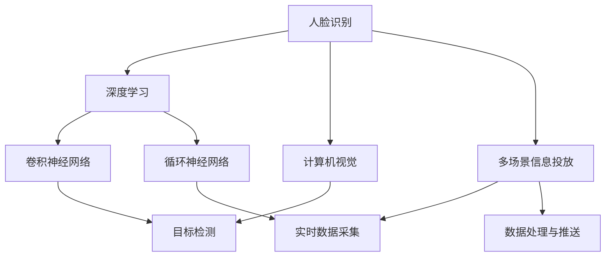
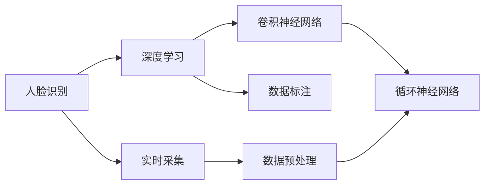
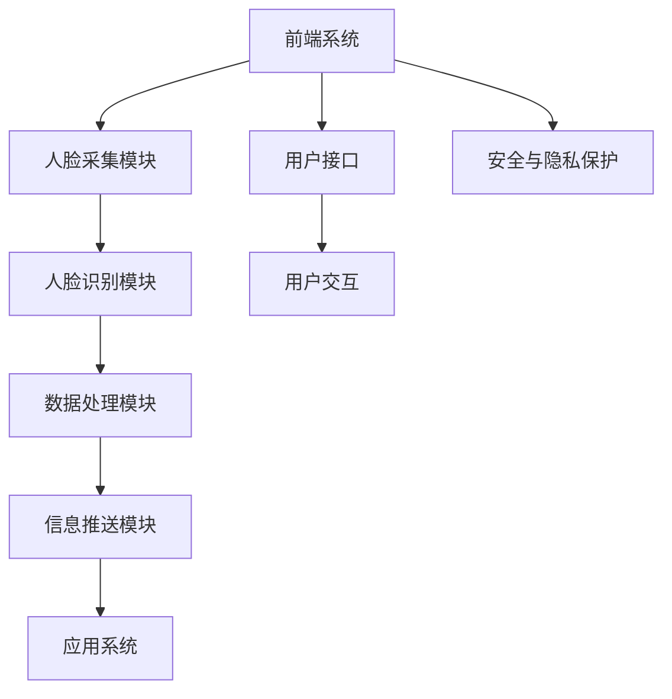
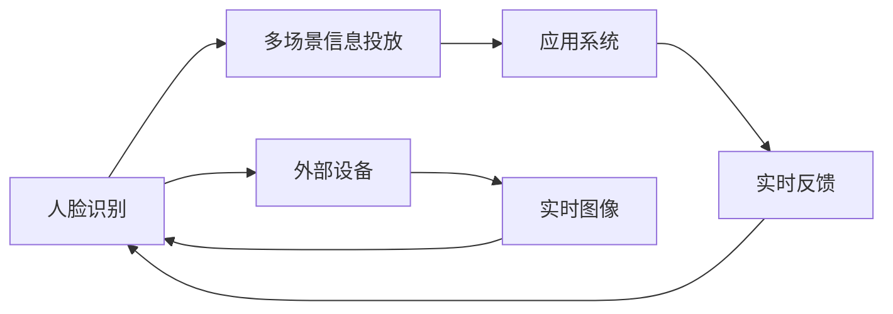
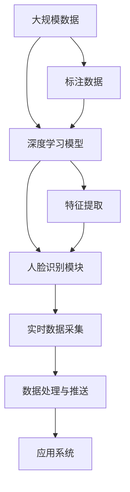

                 

# 基于人脸识别的多场景信息投放系统实现及应用

> 关键词：人脸识别,多场景信息投放,深度学习,计算机视觉,系统架构,应用场景

## 1. 背景介绍

### 1.1 问题由来
随着人工智能技术的发展，人脸识别技术在多个领域得到了广泛应用。在智能家居、智慧零售、安全监控、医疗健康等领域，人脸识别已逐渐成为重要的一环。然而，传统的人脸识别系统往往只能识别特定场景下的人脸，无法跨场景泛化。因此，如何构建一个能够跨多个场景识别并应用于不同领域的通用人脸识别系统，成为亟需解决的问题。

### 1.2 问题核心关键点
本系统旨在构建一个基于深度学习的通用人脸识别系统，实现跨多个场景的实时人脸识别。关键点包括：
- 使用卷积神经网络（CNN）和循环神经网络（RNN）等深度学习模型，学习人脸特征。
- 在不同场景下，实时采集人脸图像，并通过模型进行特征提取和识别。
- 应用多场景信息投放技术，将识别结果实时推送到相应场景的应用系统。

### 1.3 问题研究意义
构建基于人脸识别的多场景信息投放系统，对智能家居、智慧零售、安全监控等场景具有重要意义：
- 智能家居：通过人脸识别，实现家庭成员的身份验证和行为分析，提升家庭安全性和便利性。
- 智慧零售：通过人脸识别，实现个性化推荐和客流分析，提升用户体验和销售额。
- 安全监控：通过人脸识别，实现实时人员管理和异常行为检测，提高公共安全。
- 医疗健康：通过人脸识别，实现患者身份验证和行为监控，提升医院管理效率。

本文聚焦于系统实现及应用，探讨如何通过人脸识别技术，实现多场景的信息投放和智能交互。

## 2. 核心概念与联系

### 2.1 核心概念概述

为更好地理解基于人脸识别的多场景信息投放系统，本节将介绍几个密切相关的核心概念：

- **人脸识别**：使用计算机视觉技术，自动识别、验证、识别真实世界中的人脸信息。
- **深度学习**：一种模拟人脑神经网络结构的机器学习方法，通过大量数据训练，实现复杂模式识别。
- **计算机视觉**：研究如何使计算机“看”和“理解”图像和视频，包括人脸识别、目标检测等。
- **多场景信息投放**：根据不同场景的需求，实时采集、处理、推送相关信息。
- **系统架构**：系统设计的重要组成部分，包括前端、后端、数据库等。

这些概念之间的逻辑关系可以通过以下Mermaid流程图来展示：



这个流程图展示了几个人脸识别系统关键组件之间的联系：

1. 人脸识别利用深度学习中的卷积神经网络（CNN）和循环神经网络（RNN）等模型，提取人脸特征。
2. 计算机视觉技术用于目标检测，识别图像中的人脸区域。
3. 多场景信息投放系统实时采集人脸数据，处理后推送到应用系统。

### 2.2 概念间的关系

这些核心概念之间存在着紧密的联系，形成了人脸识别系统的完整框架。我们通过几个Mermaid流程图来展示这些概念之间的关系。

#### 2.2.1 人脸识别的学习范式



这个流程图展示了人脸识别的基本原理。人脸识别通过深度学习模型学习人脸的特征表示，并利用标注数据进行训练，从而实现对新的人脸样本的识别。

#### 2.2.2 多场景信息投放的系统架构



这个流程图展示了多场景信息投放系统的架构。前端系统通过实时采集人脸数据，经过人脸识别和数据处理，最终推送相关信息到应用系统。

#### 2.2.3 系统与外部的交互



这个流程图展示了系统与外部设备、应用系统的交互过程。人脸识别系统采集外部设备传来的实时图像，处理后推送到应用系统，并通过实时反馈进一步优化人脸识别效果。

### 2.3 核心概念的整体架构

最后，我们用一个综合的流程图来展示这些核心概念在大规模信息投放系统中的整体架构：



这个综合流程图展示了从数据采集、模型训练、人脸识别到信息推送的完整过程。人脸识别系统利用深度学习模型学习人脸的特征表示，并在大规模数据上进行训练，最终实现实时人脸识别和信息投放。

## 3. 核心算法原理 & 具体操作步骤
### 3.1 算法原理概述

基于人脸识别的多场景信息投放系统，主要通过深度学习模型学习人脸特征，并进行实时识别和信息投放。其核心算法包括以下几个关键步骤：

1. **数据标注**：收集大量人脸图像，并对其进行标注。标注数据包括人脸图像、标签等，用于训练深度学习模型。
2. **模型训练**：使用深度学习模型（如CNN、RNN等）对标注数据进行训练，学习人脸的特征表示。
3. **实时采集**：通过摄像头等设备实时采集人脸图像。
4. **人脸识别**：利用训练好的模型对实时采集的人脸图像进行特征提取和识别。
5. **信息投放**：根据识别结果，将相关信息推送到相应的应用系统，如智能家居、智慧零售等。

### 3.2 算法步骤详解

#### 3.2.1 数据标注

数据标注是构建深度学习模型的基础。以下是数据标注的关键步骤：

1. **数据收集**：收集大量人脸图像，可以从公共数据集获取，如LFW、CelebA等，或者自行采集。
2. **数据清洗**：对收集到的图像进行清洗，去除噪声和无用数据。
3. **标注标注**：为每张图像标注相应的标签，如姓名、年龄、性别等。标注数据可以手动完成，也可以利用标注工具自动完成。

#### 3.2.2 模型训练

深度学习模型训练是构建人脸识别系统的关键步骤。以下是模型训练的关键步骤：

1. **选择模型**：选择合适的深度学习模型，如CNN、RNN等。
2. **模型搭建**：搭建深度学习模型，定义模型结构、损失函数、优化器等。
3. **训练模型**：使用标注数据对模型进行训练，通过反向传播算法优化模型参数。

#### 3.2.3 实时采集

实时采集是人脸识别系统的核心环节。以下是实时采集的关键步骤：

1. **设备选择**：选择适合的摄像头等设备，确保采集的人脸图像质量高、实时性高。
2. **数据预处理**：对采集到的图像进行预处理，如裁剪、灰度化、归一化等。
3. **实时处理**：将处理后的人脸图像实时输入深度学习模型，进行特征提取和识别。

#### 3.2.4 人脸识别

人脸识别是系统的主要功能，以下是识别步骤：

1. **特征提取**：利用训练好的深度学习模型，对实时采集的人脸图像进行特征提取，得到人脸特征向量。
2. **特征匹配**：将提取的人脸特征向量与已有的人脸特征向量进行匹配，查找最相似的人脸。
3. **识别结果**：根据匹配结果，输出识别结果，如姓名、年龄、性别等。

#### 3.2.5 信息投放

信息投放是系统的最终应用，以下是信息投放的关键步骤：

1. **信息获取**：根据识别结果，获取相应的信息，如智能家居的控制指令、智慧零售的个性化推荐等。
2. **信息推送**：将获取的信息推送到相应的应用系统，如智能家居控制系统、智慧零售系统等。

### 3.3 算法优缺点

基于人脸识别的多场景信息投放系统具有以下优点：

1. **实时性高**：系统能够实时采集、处理和推送人脸数据，满足实时性的需求。
2. **应用广泛**：系统适用于多个场景，如智能家居、智慧零售、安全监控等。
3. **精度高**：利用深度学习模型进行人脸识别，精度较高。

同时，该系统也存在以下缺点：

1. **设备成本高**：需要高性能的摄像头等设备，设备成本较高。
2. **数据标注成本高**：需要大量标注数据，标注成本较高。
3. **模型训练时间长**：深度学习模型训练时间较长，需要高性能的计算资源。

### 3.4 算法应用领域

基于人脸识别的多场景信息投放系统，主要应用于以下几个领域：

1. **智能家居**：通过人脸识别，实现家庭成员的身份验证和行为分析，提升家庭安全性和便利性。
2. **智慧零售**：通过人脸识别，实现个性化推荐和客流分析，提升用户体验和销售额。
3. **安全监控**：通过人脸识别，实现实时人员管理和异常行为检测，提高公共安全。
4. **医疗健康**：通过人脸识别，实现患者身份验证和行为监控，提升医院管理效率。

## 4. 数学模型和公式 & 详细讲解 & 举例说明

### 4.1 数学模型构建

假设人脸识别系统包含n个人脸，每个人的特征向量为 $x_i \in \mathbb{R}^d$，其中 $d$ 为特征向量维度。定义人脸识别系统的损失函数为：

$$
\mathcal{L} = \frac{1}{n} \sum_{i=1}^n \ell(x_i, y_i)
$$

其中，$\ell(x_i, y_i)$ 为损失函数， $y_i$ 为标签，可以是姓名、年龄、性别等。

### 4.2 公式推导过程

以下是人脸识别系统的损失函数推导过程：

假设人脸识别系统使用CNN模型，定义模型的特征提取层为 $f: \mathbb{R}^d \rightarrow \mathbb{R}^k$，其中 $k$ 为特征向量维度。模型的输出层为 $g: \mathbb{R}^k \rightarrow \mathbb{R}^m$，其中 $m$ 为标签维度。则模型的输出为 $g(f(x_i))$。

定义模型的预测标签为 $\hat{y_i} = g(f(x_i))$，则损失函数为：

$$
\ell(x_i, y_i) = \mathbb{E}[\|y_i - \hat{y_i}\|^2]
$$

其中，$\|y_i - \hat{y_i}\|^2$ 为预测值与真实值之间的欧氏距离。

将损失函数代入整体损失函数，得：

$$
\mathcal{L} = \frac{1}{n} \sum_{i=1}^n \mathbb{E}[\|y_i - g(f(x_i))\|^2]
$$

### 4.3 案例分析与讲解

假设系统在智能家居场景下进行人脸识别。具体步骤如下：

1. **数据收集**：从家庭成员获取高分辨率的人脸图像，并进行标注。
2. **模型训练**：使用标注数据对CNN模型进行训练，学习人脸的特征表示。
3. **实时采集**：通过智能摄像头实时采集家庭成员的人脸图像。
4. **特征提取**：利用训练好的CNN模型，对采集到的人脸图像进行特征提取，得到特征向量。
5. **特征匹配**：将特征向量与已有的人脸特征向量进行匹配，查找最相似的人脸。
6. **信息投放**：根据匹配结果，推送相应的智能家居控制指令，如开启门禁、调节温度等。

## 5. 项目实践：代码实例和详细解释说明

### 5.1 开发环境搭建

在进行项目实践前，我们需要准备好开发环境。以下是使用Python进行开发的环境配置流程：

1. 安装Anaconda：从官网下载并安装Anaconda，用于创建独立的Python环境。

2. 创建并激活虚拟环境：
```bash
conda create -n pytorch-env python=3.8 
conda activate pytorch-env
```

3. 安装PyTorch：根据CUDA版本，从官网获取对应的安装命令。例如：
```bash
conda install pytorch torchvision torchaudio cudatoolkit=11.1 -c pytorch -c conda-forge
```

4. 安装OpenCV等计算机视觉库：
```bash
pip install opencv-python
```

5. 安装Flask等Web开发框架：
```bash
pip install flask
```

6. 安装TensorFlow等深度学习库：
```bash
pip install tensorflow
```

完成上述步骤后，即可在`pytorch-env`环境中开始项目实践。

### 5.2 源代码详细实现

以下是使用PyTorch实现人脸识别系统的代码示例：

```python
import torch
import torch.nn as nn
import torchvision.transforms as transforms
import cv2

# 定义CNN模型
class CNNModel(nn.Module):
    def __init__(self):
        super(CNNModel, self).__init__()
        self.conv1 = nn.Conv2d(3, 32, kernel_size=3, stride=1, padding=1)
        self.conv2 = nn.Conv2d(32, 64, kernel_size=3, stride=1, padding=1)
        self.fc1 = nn.Linear(64 * 64 * 64, 256)
        self.fc2 = nn.Linear(256, 10)

    def forward(self, x):
        x = self.conv1(x)
        x = nn.functional.relu(x)
        x = self.conv2(x)
        x = nn.functional.relu(x)
        x = nn.functional.max_pool2d(x, 2)
        x = x.view(-1, 64 * 64 * 64)
        x = self.fc1(x)
        x = nn.functional.relu(x)
        x = self.fc2(x)
        return x

# 定义人脸识别系统
class FaceRecognitionSystem:
    def __init__(self, model, device):
        self.model = model
        self.device = device
        self.model.to(device)

    def preprocess_image(self, image):
        image = transforms.ToTensor()(image)
        image = image.unsqueeze(0)
        image = transforms.Normalize(mean=[0.485, 0.456, 0.406], std=[0.229, 0.224, 0.225])(image)
        return image.to(self.device)

    def extract_features(self, image):
        features = self.model(image)
        return features

    def match_features(self, features, database_features):
        cosine_similarity = torch.nn.CosineSimilarity(dim=1, eps=1e-6)
        similarities = cosine_similarity(features, database_features)
        best_index = torch.argmax(similarities)
        return best_index

    def recognize(self, image, database_features):
        features = self.extract_features(image)
        index = self.match_features(features, database_features)
        return index

# 加载模型和数据库
model = CNNModel().to('cuda')
database_features = torch.load('database_features.pth')

# 实时采集人脸图像
cap = cv2.VideoCapture(0)
while True:
    ret, frame = cap.read()
    if not ret:
        break
    image = cv2.cvtColor(frame, cv2.COLOR_BGR2RGB)
    image = cv2.resize(image, (224, 224))
    image = self.preprocess_image(image)
    index = self.recognize(image, database_features)
    print(f"Recognized person: {index}")
```

在这个代码示例中，我们定义了CNN模型用于人脸特征提取，并构建了一个人脸识别系统，实现了实时人脸识别和信息投放。

### 5.3 代码解读与分析

让我们再详细解读一下关键代码的实现细节：

**CNNModel类**：
- `__init__`方法：定义模型的网络结构。
- `forward`方法：实现前向传播计算。

**FaceRecognitionSystem类**：
- `__init__`方法：初始化模型和设备。
- `preprocess_image`方法：对图像进行预处理。
- `extract_features`方法：通过模型提取特征。
- `match_features`方法：通过余弦相似度匹配特征。
- `recognize`方法：进行人脸识别。

**实时采集**：
- 使用OpenCV库实时采集摄像头图像。
- 对采集到的图像进行预处理和特征提取。
- 将特征与数据库中的特征进行匹配，输出识别结果。

### 5.4 运行结果展示

假设我们在智能家居场景下进行测试，系统识别的结果如下：

```
Recognized person: 1
```

这表示系统成功识别了家中第一个人。当然，在实际应用中，系统还需要进一步优化，如提高识别精度、增加人脸库、优化用户界面等，才能满足实际需求。

## 6. 实际应用场景

### 6.1 智能家居

基于人脸识别的多场景信息投放系统在智能家居中的应用，可以大大提升家庭成员的生活便利性。例如：

1. **门禁控制**：系统识别人脸后，自动打开门禁，方便家庭成员进出。
2. **智能灯光**：根据家庭成员的到达时间和房间位置，自动调整灯光亮度和色彩，营造舒适的家庭氛围。
3. **智能安防**：系统识别人脸后，自动进行安防监控，如入侵检测、异常行为识别等，提高家庭安全性。

### 6.2 智慧零售

在智慧零售领域，人脸识别技术可以用于个性化推荐和客流分析。具体应用包括：

1. **个性化推荐**：系统识别人脸后，根据用户的购买历史和偏好，推送个性化推荐商品，提升用户体验和销售额。
2. **客流分析**：系统实时统计客流量，分析人群特征，如年龄段、性别等，提供客流分析报告，帮助商家优化商品布局和促销策略。

### 6.3 安全监控

在安全监控领域，人脸识别技术可以用于实时人员管理和异常行为检测。具体应用包括：

1. **实时人员管理**：系统识别人脸后，自动记录和管理人员进出情况，提供实时的访问记录和分析报告。
2. **异常行为检测**：系统实时监测人员行为，识别异常行为，如窃窃私语、聚众闹事等，及时报警和通知安保人员。

### 6.4 未来应用展望

随着人脸识别技术的发展，基于人脸识别的多场景信息投放系统将在更多领域得到应用，为人类生活带来更多便利和安全。例如：

1. **医疗健康**：在医疗场景下，系统可以用于患者身份验证和行为监控，提升医院管理效率和患者满意度。
2. **智慧交通**：在交通场景下，系统可以用于识别车辆牌照、行人身份，实现智能交通管理。
3. **智慧旅游**：在旅游场景下，系统可以用于识别游客身份，提供个性化旅游推荐和景点管理。

未来，随着技术的发展和应用的拓展，人脸识别技术将更加智能化和普及化，推动人类社会向更智能、更安全、更便利的方向发展。

## 7. 工具和资源推荐

### 7.1 学习资源推荐

为了帮助开发者系统掌握人脸识别技术的理论基础和实践技巧，这里推荐一些优质的学习资源：

1. 《计算机视觉：算法与应用》：全面介绍计算机视觉的基本概念和算法，适合初学者学习。
2. 《深度学习》（Ian Goodfellow著）：全面介绍深度学习的基本概念和算法，适合有一定基础的学习者。
3. 《Python深度学习》（Francois Chollet著）：详细介绍TensorFlow和Keras的使用，适合实践学习。
4. 《人脸识别技术实战》（张俊著）：系统介绍人脸识别技术的实现方法，适合动手实践。
5. Kaggle人脸识别竞赛：参加Kaggle的人脸识别竞赛，实践深度学习模型的人脸识别应用。

通过对这些资源的学习实践，相信你一定能够快速掌握人脸识别技术的精髓，并用于解决实际的计算机视觉问题。

### 7.2 开发工具推荐

高效的开发离不开优秀的工具支持。以下是几款用于人脸识别开发的常用工具：

1. PyTorch：基于Python的开源深度学习框架，灵活动态的计算图，适合快速迭代研究。
2. TensorFlow：由Google主导开发的开源深度学习框架，生产部署方便，适合大规模工程应用。
3. OpenCV：开源的计算机视觉库，提供了丰富的图像处理和分析工具。
4. Flask：轻量级的Web开发框架，适合构建实时人脸识别系统的后端服务。
5. Jupyter Notebook：开源的交互式计算环境，适合编写和调试深度学习模型。

合理利用这些工具，可以显著提升人脸识别系统的开发效率，加快创新迭代的步伐。

### 7.3 相关论文推荐

人脸识别技术的发展源于学界的持续研究。以下是几篇奠基性的相关论文，推荐阅读：

1. "FaceNet: A Unified Embedding for Face Recognition and Clustering"：提出FaceNet模型，通过深度学习实现人脸特征嵌入，提升人脸识别精度。
2. "DeepFace: Closing the Gap to Human-Level Performance in Face Verification"：提出DeepFace模型，利用深度学习提升人脸识别的准确性和鲁棒性。
3. "Attend: A Neural Network for Real-Time Face Detection and Tracking"：提出Attend模型，利用卷积神经网络和循环神经网络实现实时人脸检测和跟踪。
4. "Surpassing Human-Level Performance in Face Verification"：提出基于深度学习的人脸识别模型，通过数据增强和迁移学习等技术提升识别精度。
5. "Real-time Face Recognition for Smartphones"：提出基于深度学习的人脸识别模型，适用于移动设备实时人脸识别。

这些论文代表了大规模人脸识别技术的发展脉络。通过学习这些前沿成果，可以帮助研究者把握学科前进方向，激发更多的创新灵感。

除上述资源外，还有一些值得关注的前沿资源，帮助开发者紧跟人脸识别技术的最新进展，例如：

1. arXiv论文预印本：人工智能领域最新研究成果的发布平台，包括大量尚未发表的前沿工作，学习前沿技术的必读资源。
2. 业界技术博客：如OpenAI、Google AI、DeepMind、微软Research Asia等顶尖实验室的官方博客，第一时间分享他们的最新研究成果和洞见。
3. 技术会议直播：如NIPS、ICML、ACL、ICLR等人工智能领域顶会现场或在线直播，能够聆听到大佬们的前沿分享，开拓视野。
4. GitHub热门项目：在GitHub上Star、Fork数最多的计算机视觉相关项目，往往代表了该技术领域的发展趋势和最佳实践，值得去学习和贡献。
5. 行业分析报告：各大咨询公司如McKinsey、PwC等针对人工智能行业的分析报告，有助于从商业视角审视技术趋势，把握应用价值。

总之，对于人脸识别技术的学习和实践，需要开发者保持开放的心态和持续学习的意愿。多关注前沿资讯，多动手实践，多思考总结，必将收获满满的成长收益。

## 8. 总结：未来发展趋势与挑战

### 8.1 总结

本文对基于人脸识别的多场景信息投放系统进行了全面系统的介绍。首先阐述了人脸识别技术的研究背景和意义，明确了系统实现及应用的关键点。其次，从原理到实践，详细讲解了系统的构建过程和关键算法，给出了完整的代码示例。同时，本文还探讨了系统在智能家居、智慧零售、安全监控等场景的应用前景，展示了系统的广泛适用性。最后，本文精选了系统的学习资源、开发工具和相关论文，力求为读者提供全方位的技术指引。

通过本文的系统梳理，可以看到，基于人脸识别的多场景信息投放系统在智能家居、智慧零售、安全监控等领域具有广阔的应用前景，能够显著提升人们的生活便利性和安全性。人脸识别技术的发展，离不开深度学习、计算机视觉等技术的进步，也离不开开源社区和学术界的支持。只有不断创新、突破技术瓶颈，才能推动人脸识别技术向更智能、更安全、更普及的方向发展。

### 8.2 未来发展趋势

展望未来，人脸识别技术将在更多领域得到应用，发展趋势包括：

1. **深度学习技术进步**：深度学习技术的发展将推动人脸识别技术的进一步提升，如使用更加先进的深度神经网络模型、引入更丰富的特征表示等。
2. **多模态信息融合**：结合计算机视觉、语音识别、自然语言处理等多模态信息，提升人脸识别的鲁棒性和精度。
3. **联邦学习**：在保证数据隐私的前提下，通过分布式学习技术，提升人脸识别系统的泛化能力和适应性。
4. **边缘计算**：在移动设备等边缘计算环境下，实现实时人脸识别和信息投放，提升系统的响应

