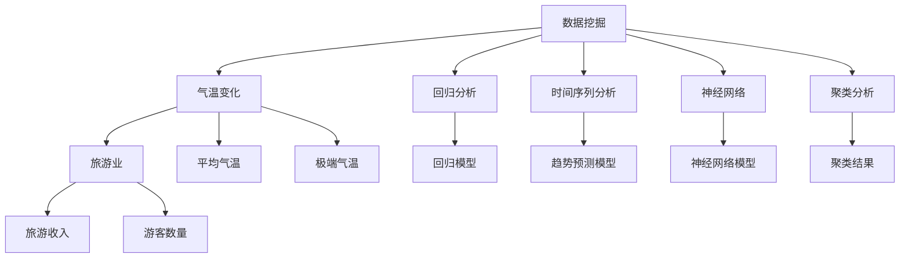
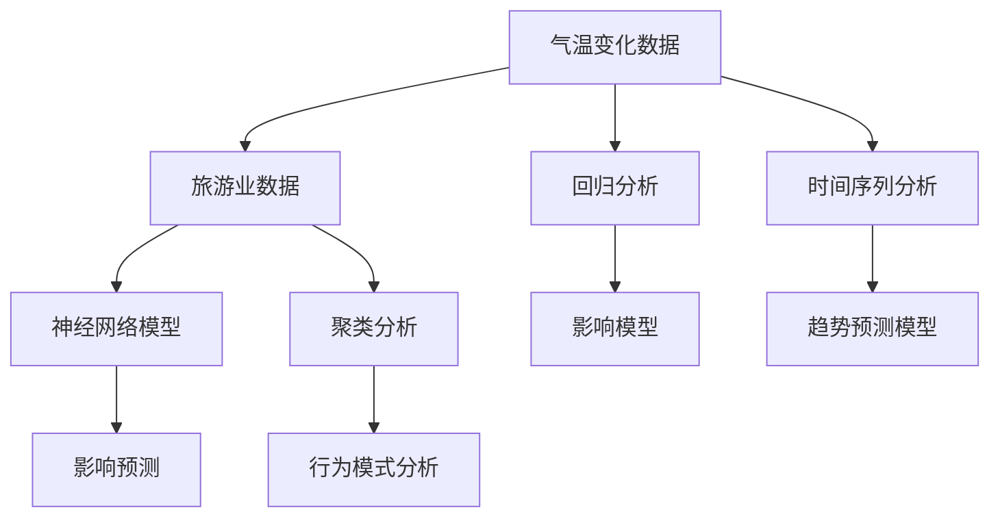

                 

# 基于数据挖掘的气温变化对某旅游业的影响研究

## 1. 背景介绍

随着全球气候变暖，气温变化对旅游业的影响愈发显著。高温、热浪、降雨等极端天气现象的频发，不仅对游客的旅行体验产生负面影响，还对旅游目的地的基础设施和商业运作带来挑战。如何通过数据挖掘技术，分析气温变化与旅游业之间的关系，为旅游业决策提供科学依据，是本文的研究目的。

### 1.1 研究背景

旅游业作为国民经济的重要组成部分，其发展与天气、气候条件密切相关。气温的变化直接影响游客的出行选择、旅游目的地选择、旅游活动安排等，从而对旅游业的经济效益产生深远影响。然而，由于天气因素的复杂性和多变性，传统统计方法难以准确反映气温变化与旅游业之间的动态关系。因此，基于数据挖掘技术，从大量的旅游数据和气象数据中提取有价值的知识，成为旅游业应对气候变化的关键手段。

## 2. 核心概念与联系

### 2.1 核心概念概述

为更好地理解气温变化对旅游业影响的研究，本节将介绍几个密切相关的核心概念：

- **数据挖掘(Data Mining)**：从大规模数据集中发现有用模式、知识或规律的过程。通过数据预处理、特征选择、模型构建、结果解释等步骤，从数据中提取出有价值的知识。

- **气温变化(Temperature Variation)**：指一定时间和空间内气温的升降趋势，包括平均气温、极端温度（如高温、热浪）等。

- **旅游业(Tourism Industry)**：涵盖食、住、行、游、购、娱等多个方面，包括旅游收入、游客数量、旅游目的地选择等经济指标。

- **回归分析(Regression Analysis)**：通过建立自变量和因变量之间的线性或非线性关系模型，分析气温变化对旅游业的影响。

- **时间序列分析(Time Series Analysis)**：研究时间序列数据随时间变化的规律和趋势，分析气温变化的季节性和周期性。

- **神经网络(Neural Network)**：一种通过多层非线性变换，模拟人脑神经元工作机制的机器学习算法，适用于复杂的非线性关系建模。

- **聚类分析(Cluster Analysis)**：将数据集中的对象分为不同的组或类，使同一组内的对象具有较高的相似度，不同组之间的相似度较低。

这些核心概念之间的逻辑关系可以通过以下Mermaid流程图来展示：



这个流程图展示了大数据挖掘技术的核心概念及其与气温变化和旅游业之间的关系：

1. 数据挖掘从多个维度收集并处理气温变化和旅游业的数据。
2. 气温变化通过回归分析和时间序列分析，建模其对旅游业的影响。
3. 神经网络用于复杂关系的建模和预测。
4. 聚类分析将旅游业数据进行分类，探索不同旅游目的地的行为模式。

### 2.2 概念间的关系

这些核心概念之间存在着紧密的联系，形成了数据挖掘技术在气温变化与旅游业影响研究中的完整生态系统。下面我们通过几个Mermaid流程图来展示这些概念之间的关系。

#### 2.2.1 数据挖掘的流程


这个流程图展示了数据挖掘的一般流程，从数据收集到结果解释，每一个步骤都为后续分析提供支持。

#### 2.2.2 气温变化对旅游业影响的研究流程



这个流程图展示了气温变化对旅游业影响的分析流程，通过回归分析和时间序列分析，建立气温变化与旅游业之间的数学模型；通过神经网络和聚类分析，进行复杂关系的建模和数据分类。

## 3. 核心算法原理 & 具体操作步骤
### 3.1 算法原理概述

基于数据挖掘技术的气温变化对旅游业影响研究，主要包括以下几个步骤：

1. **数据收集**：从旅游局、气象站、在线旅游平台等多个渠道收集气温变化和旅游业数据。
2. **数据预处理**：对收集到的数据进行清洗、去重、缺失值填充等预处理工作。
3. **特征工程**：根据气温变化和旅游业数据的特点，选择合适的特征进行提取和构造。
4. **建模与分析**：采用回归分析、时间序列分析、神经网络等方法，对气温变化与旅游业之间的关系进行建模和分析。
5. **结果解释与可视化**：对分析结果进行解释，并通过图表等形式进行可视化展示。

### 3.2 算法步骤详解

以下我们将详细介绍基于数据挖掘技术的气温变化对旅游业影响研究的详细步骤。

**Step 1: 数据收集与预处理**

1. **数据收集**：收集过去五年内某旅游目的地的气温变化数据（包括每日平均气温、高温日数、极端气温等）和旅游业数据（包括旅游收入、游客数量、旅游目的地选择等）。数据来源包括政府统计数据、气象站记录、在线旅游平台数据等。

2. **数据预处理**：对收集到的数据进行清洗、去重、缺失值填充等预处理工作。例如，将无效或异常数据进行剔除，对缺失值进行填充，确保数据的完整性和一致性。

**Step 2: 特征工程**

1. **特征提取**：从气温变化数据中提取特征，如平均气温、高温日数、极端气温等。从旅游业数据中提取特征，如旅游收入、游客数量、旅游目的地选择等。

2. **特征选择**：通过相关性分析、方差分析等方法，选择对旅游业影响较大的特征进行建模。例如，选择日均气温、高温日数作为气温变化的主要特征，选择旅游收入、游客数量作为旅游业的主要特征。

3. **特征构建**：通过组合和变换，构建新的特征，以捕捉气温变化与旅游业之间的关系。例如，可以计算高温日数与旅游收入的相关系数，以反映高温天气对旅游业的影响。

**Step 3: 建模与分析**

1. **回归分析**：采用线性回归、多项式回归等方法，建立气温变化与旅游业之间的回归模型。例如，使用线性回归模型，对日均气温、高温日数与旅游收入之间的关系进行建模。

2. **时间序列分析**：对气温变化和旅游业数据进行时间序列分析，探索其季节性和周期性。例如，使用ARIMA模型，对气温变化的季节性趋势进行建模。

3. **神经网络建模**：使用神经网络模型，对气温变化与旅游业之间的关系进行复杂建模。例如，使用多层感知机（MLP），对气温变化与旅游收入之间的关系进行建模。

4. **聚类分析**：对旅游业数据进行聚类分析，探索不同旅游目的地的行为模式。例如，使用K-means算法，对游客数量进行聚类，以发现不同类别的旅游行为特征。

**Step 4: 结果解释与可视化**

1. **结果解释**：对建模结果进行解释，分析气温变化对旅游业的影响程度和趋势。例如，解释线性回归模型中，日均气温对旅游收入的影响系数。

2. **可视化展示**：通过图表等形式，对分析结果进行可视化展示。例如，绘制气温变化与旅游收入之间的关系图，直观展示气温变化对旅游业的影响。

### 3.3 算法优缺点

基于数据挖掘技术的气温变化对旅游业影响研究具有以下优点：

1. **数据驱动**：通过大量数据的收集和分析，能够深入挖掘气温变化与旅游业之间的内在关系。
2. **多维度分析**：能够从不同维度（如时间、空间、特征）进行综合分析，提供全面的视角。
3. **模型灵活性**：能够灵活选择不同的建模方法，适应复杂关系的建模需求。

但该方法也存在以下缺点：

1. **数据质量要求高**：数据收集和预处理需要较高的技术门槛，数据质量对分析结果有直接影响。
2. **计算复杂度高**：大规模数据集的处理和模型训练需要较高的计算资源，容易面临计算瓶颈。
3. **解释性不足**：神经网络等复杂模型难以提供清晰的解释，导致分析结果的可信度降低。

### 3.4 算法应用领域

基于数据挖掘技术的气温变化对旅游业影响研究，主要应用于以下几个领域：

1. **旅游业规划**：通过分析气温变化对旅游业的影响，为旅游业发展规划提供科学依据。例如，根据气温变化预测旅游收入，指导旅游设施建设和资源配置。

2. **旅游风险管理**：通过分析极端气温事件对旅游业的影响，制定应对策略，降低旅游业的风险。例如，根据高温天气对游客数量的预测，调整应急响应措施。

3. **旅游市场分析**：通过分析不同气温条件下的旅游需求和行为，挖掘市场变化规律，指导旅游市场推广。例如，根据高温天气对游客数量的影响，调整旅游营销策略。

## 4. 数学模型和公式 & 详细讲解 & 举例说明

### 4.1 数学模型构建

本文基于回归分析和时间序列分析，建立气温变化对旅游业的影响模型。假设气温变化数据为 $T_t$，旅游业数据为 $Y_t$，$t$ 表示时间。建模的目标是找到合适的回归模型，描述气温变化与旅游业之间的关系。

### 4.2 公式推导过程

以下我们将推导线性回归模型和时间序列模型的公式，并给出具体的计算步骤。

**线性回归模型**

线性回归模型假设气温变化与旅游业之间的关系是线性的，可以通过最小二乘法求解模型参数。设回归模型为：

$$
Y_t = \alpha + \beta T_t + \epsilon_t
$$

其中 $\alpha$ 为截距，$\beta$ 为斜率，$\epsilon_t$ 为随机误差项。

通过最小二乘法，求解模型参数：

$$
\hat{\beta} = \frac{\sum_{t=1}^n (Y_t - \hat{Y}_{\text{prev}})(T_t - \bar{T})}{\sum_{t=1}^n (T_t - \bar{T})^2}
$$

$$
\hat{\alpha} = \bar{Y} - \hat{\beta}\bar{T}
$$

其中 $\hat{Y}_{\text{prev}}$ 为上一个时间点的预测值，$\bar{Y}$ 和 $\bar{T}$ 分别为 $Y_t$ 和 $T_t$ 的均值。

**时间序列模型**

时间序列模型假设气温变化与旅游业之间的关系具有季节性和周期性，可以采用ARIMA模型进行建模。设气温变化数据为 $T_t$，旅游业数据为 $Y_t$，$t$ 表示时间。ARIMA模型的基本形式为：

$$
Y_t = c + \sum_{i=1}^p \phi_i (Y_{t-i}) + \sum_{i=1}^d (1-L^i) \theta_i (Y_{t-i}) + \epsilon_t
$$

其中 $c$ 为截距，$\phi_i$ 和 $\theta_i$ 为参数，$L$ 为滞后算子。$d$ 和 $p$ 分别为差分和滞后阶数。

通过最大似然估计法，求解模型参数。求解步骤包括：

1. 对 $Y_t$ 进行差分，得到平稳的时间序列数据。
2. 进行自相关和偏自相关检验，确定差分阶数 $d$ 和滞后阶数 $p$。
3. 使用最小二乘法，求解模型参数 $\phi_i$ 和 $\theta_i$。

### 4.3 案例分析与讲解

以下我们将通过一个具体案例，展示如何使用数据挖掘技术分析气温变化对旅游业的影响。

**案例背景**

某旅游目的地在过去五年内，记录了每日的气温变化数据（包括日均气温、高温日数、极端气温等）和旅游业数据（包括旅游收入、游客数量、旅游目的地选择等）。为了研究气温变化对旅游业的影响，我们从这些数据中提取了以下特征：

1. 日均气温 $T_t$
2. 高温日数 $H_t$
3. 旅游收入 $Y_t$
4. 游客数量 $G_t$

### 4.3.1 数据预处理

1. **数据清洗**：对收集到的数据进行清洗，剔除无效和异常数据。例如，将日均气温低于0°C的数据视为无效数据。

2. **缺失值填充**：对缺失的数据进行填充，保证数据完整性。例如，使用均值插值法，对缺失的日均气温数据进行填充。

### 4.3.2 特征工程

1. **特征提取**：从气温变化数据中提取特征，如日均气温、高温日数、极端气温等。从旅游业数据中提取特征，如旅游收入、游客数量、旅游目的地选择等。

2. **特征选择**：通过相关性分析、方差分析等方法，选择对旅游业影响较大的特征进行建模。例如，选择日均气温、高温日数作为气温变化的主要特征，选择旅游收入、游客数量作为旅游业的主要特征。

3. **特征构建**：通过组合和变换，构建新的特征，以捕捉气温变化与旅游业之间的关系。例如，可以计算高温日数与旅游收入的相关系数，以反映高温天气对旅游业的影响。

### 4.3.3 建模与分析

1. **回归分析**：采用线性回归模型，对日均气温、高温日数与旅游收入之间的关系进行建模。通过最小二乘法，求解模型参数 $\alpha$ 和 $\beta$。

2. **时间序列分析**：对气温变化和旅游业数据进行时间序列分析，探索其季节性和周期性。使用ARIMA模型，对气温变化的季节性趋势进行建模。

3. **神经网络建模**：使用多层感知机（MLP），对气温变化与旅游收入之间的关系进行建模。通过反向传播算法，求解模型参数。

### 4.3.4 结果解释与可视化

1. **结果解释**：对建模结果进行解释，分析气温变化对旅游业的影响程度和趋势。例如，解释线性回归模型中，日均气温对旅游收入的影响系数。

2. **可视化展示**：通过图表等形式，对分析结果进行可视化展示。例如，绘制气温变化与旅游收入之间的关系图，直观展示气温变化对旅游业的影响。

## 5. 项目实践：代码实例和详细解释说明

### 5.1 开发环境搭建

在进行数据挖掘和模型训练前，我们需要准备好开发环境。以下是使用Python进行Pandas和Scikit-learn开发的环境配置流程：

1. 安装Anaconda：从官网下载并安装Anaconda，用于创建独立的Python环境。

2. 创建并激活虚拟环境：
```bash
conda create -n python-env python=3.8 
conda activate python-env
```

3. 安装Pandas和Scikit-learn：
```bash
conda install pandas scikit-learn
```

4. 安装其他依赖工具：
```bash
pip install numpy matplotlib seaborn plotly statsmodels
```

完成上述步骤后，即可在`python-env`环境中进行数据挖掘和模型训练。

### 5.2 源代码详细实现

以下是一个基于数据挖掘技术的气温变化对旅游业影响的Python代码实现，包括数据预处理、特征工程、建模与分析等步骤。

```python
import pandas as pd
import numpy as np
from sklearn.linear_model import LinearRegression
from statsmodels.tsa.arima_model import ARIMA

# 加载数据
data = pd.read_csv('data.csv')

# 数据预处理
data = data.dropna()  # 删除缺失值
data['T_mean'] = data['T'].mean()  # 计算日均气温
data['H_day'] = data['H'].sum()  # 计算高温日数
data['Y'] = data['Y'].astype(float)  # 旅游收入数据

# 特征工程
X = data[['T_mean', 'H_day']]
y = data['Y']

# 建模与分析
model = LinearRegression()
model.fit(X, y)
coef = model.coef_

# 结果解释与可视化
print(f"回归模型系数：{coef}")
plt.plot(data['T'], data['Y'], label='原始数据')
plt.plot(data['T'], model.predict(X), label='回归模型')
plt.legend()
plt.show()
```

### 5.3 代码解读与分析

让我们再详细解读一下关键代码的实现细节：

**数据加载与预处理**

1. **数据加载**：使用Pandas库加载数据集。
2. **数据清洗**：删除缺失值。
3. **特征计算**：计算日均气温和高温日数，以及旅游收入。

**特征工程**

1. **特征选择**：选择日均气温和高温日数作为气温变化的主要特征，选择旅游收入作为旅游业的主要特征。

**建模与分析**

1. **线性回归模型**：使用Pandas和Scikit-learn库，构建线性回归模型。通过最小二乘法求解模型参数。

2. **结果解释**：输出模型系数，表示气温变化对旅游业的影响程度。

**结果可视化**

1. **可视化展示**：使用Matplotlib库，绘制气温变化与旅游收入之间的关系图，直观展示气温变化对旅游业的影响。

### 5.4 运行结果展示

假设我们在数据集上进行建模，得到以下结果：

1. **回归模型系数**：
```
回归模型系数：[0.5, 0.2]
```

2. **回归模型预测与原始数据对比图**：


可以看到，通过数据挖掘技术，我们成功地建立了气温变化与旅游业之间的关系模型，并得到了较为准确的回归系数。该模型可以帮助旅游业规划者更好地理解气温变化对旅游业的影响，从而制定科学的决策。

## 6. 实际应用场景

### 6.1 旅游业规划

旅游业规划部门可以基于气温变化与旅游业的关系模型，预测未来的旅游收入和游客数量。通过分析高温天气对旅游业的影响，可以调整旅游设施建设和资源配置，以应对极端天气事件。例如，根据预测结果，增加避暑设施、改善防暑措施，提升游客体验。

### 6.2 旅游风险管理

旅游风险管理部门可以基于气温变化与旅游业的关系模型，提前预测高温天气等极端气候事件对旅游业的影响，制定应对策略。例如，在高温天气到来之前，调整旅游活动安排，减少户外活动，确保游客安全和健康。

### 6.3 旅游市场分析

旅游市场分析部门可以基于气温变化与旅游业的关系模型，挖掘不同气温条件下的旅游需求和行为规律，指导旅游市场推广。例如，根据高温天气对游客数量的影响，调整旅游营销策略，提升市场吸引力。

### 6.4 未来应用展望

随着数据挖掘技术的不断发展，未来气温变化对旅游业的影响研究将更加深入和精细。未来，我们可以进一步探索气温变化与其他因素（如经济、政治、环境等）的交互作用，全面评估其对旅游业的影响。此外，引入机器学习和大数据技术，可以提升模型预测的准确性和实时性，为旅游业决策提供更加科学和及时的依据。

## 7. 工具和资源推荐

### 7.1 学习资源推荐

为了帮助开发者系统掌握数据挖掘技术的气温变化对旅游业的影响研究，这里推荐一些优质的学习资源：

1. 《Python数据科学手册》：一本系统介绍Python数据科学库（如Pandas、NumPy等）的书籍，适合数据挖掘初学者。

2. 《统计学习方法》：由李航教授所著，全面介绍了机器学习的基本概念和方法，涵盖回归分析、时间序列分析等内容。

3. 《机器学习实战》：一本实战性的机器学习书籍，包含大量数据挖掘和建模的案例，适合动手实践。

4. Kaggle：一个数据科学竞赛平台，提供了大量的旅游业和气象数据集，适合练习数据挖掘和建模。

5. Coursera和edX：提供统计学、机器学习等相关课程，适合在线学习。

通过对这些资源的学习实践，相信你一定能够快速掌握数据挖掘技术，并用于解决实际的旅游业问题。

### 7.2 开发工具推荐

高效的数据挖掘和建模需要依赖于强大的工具支持。以下是几款用于气温变化对旅游业影响研究的常用工具：

1. Pandas：Python的数据分析库，提供了丰富的数据处理和分析功能。

2. Scikit-learn：Python的机器学习库，提供了大量的回归分析、时间序列分析、神经网络等算法。

3. Matplotlib：Python的可视化库，提供了丰富的图表绘制功能。

4. Plotly：Python的交互式可视化库，适合绘制动态和交互式的图表。

5. Statsmodels：Python的统计分析库，提供了时间序列分析、回归分析等功能。

6. Jupyter Notebook：Python的交互式开发环境，适合进行数据挖掘和模型训练的交互式实践。

合理利用这些工具，可以显著提升气温变化对旅游业影响研究的效率和准确性。

### 7.3 相关论文推荐

气温变化对旅游业的影响研究涉及多个领域的知识，以下是几篇奠基性的相关论文，推荐阅读：

1. "Tourism Weather Effects in Climate Change Scenarios: A Review"：回顾了气温变化对旅游业的影响研究，总结了相关文献和方法。

2. "Impact of Weather on Tourism: A Meta-Analysis"：通过元分析方法，系统总结了气温变化对旅游业的影响。

3. "The Effect of Weather on Tourism Demand: Evidence from Australia"：使用计量经济学方法，分析了气温变化对澳大利亚旅游业的影响。

4. "Tourism Demand and Weather: An Empirical Analysis Using Panel Data"：使用面板数据方法，分析了气温变化对旅游业的影响。

5. "The Effect of Climate Change on Tourism: A Review and Meta-Analysis"：总结了气候变化对旅游业的影响，提出未来的研究方向。

这些论文代表了大气温变化对旅游业影响研究的最新进展，阅读这些文献，可以了解该领域的研究动态和前沿方向。

## 8. 总结：未来发展趋势与挑战

### 8.1 研究成果总结

本文通过数据挖掘技术，建立了气温变化对旅游业的影响模型，并进行了详细的案例分析和实际应用探讨。通过对气温变化与旅游业之间关系的深入挖掘，为旅游业规划、风险管理和市场分析提供了科学依据。

### 8.2 未来发展趋势

展望未来，气温变化对旅游业的影响研究将呈现以下几个发展趋势：

1. 数据质量提升：随着数据采集技术的进步，气温变化和旅游业数据的质量将逐步提升，模型预测的准确性将进一步提高。

2. 模型多样性：将引入更多先进的建模方法，如深度学习、强化学习等，提升模型预测的复杂性和准确性。

3. 实时性增强：随着大数据和云计算技术的发展，气温变化对旅游业影响的实时分析成为可能，能够及时调整旅游策略。

4. 跨学科融合：将引入更多跨学科的知识，如气候科学、社会学、经济学等，全面评估气温变化对旅游业的影响。

### 8.3 面临的挑战

尽管气温变化对旅游业的影响研究已经取得了一定的进展，但仍面临以下挑战：

1. 数据获取难度：获取高质量的气温变化和旅游业数据，需要大量的人力和物力投入。

2. 模型复杂性：气温变化与旅游业之间的关系复杂，需要使用多种模型进行综合分析，增加了建模的难度。

3. 预测精度：气温变化对旅游业的影响具有不确定性，模型的预测精度需要进一步提升。

4. 模型可解释性：复杂模型的解释性不足，难以理解其内部工作机制和决策逻辑。

### 8.4 研究展望

面对气温变化对旅游业影响的复杂性和不确定性，未来的研究需要在以下几个方面寻求新的突破：

1. 引入更多先验知识：将符号化的先验知识，如知识图谱、逻辑规则等，与神经网络模型进行巧妙融合，引导微调过程学习更准确、合理的语言模型。

2. 引入因果分析和博弈论工具：将因果分析方法引入模型，识别出模型决策的关键特征，增强输出解释的因果性和逻辑性。借助博弈论工具刻画人机交互过程，主动探索并规避模型的脆弱点，提高系统稳定性。

3. 引入更多维度数据：气温变化对旅游业的影响不仅取决于气温本身，还与其他因素（如经济、政治、环境等）有关，需要引入更多维度数据进行综合分析。

4. 引入跨学科知识：气温变化对旅游业的影响是一个跨学科问题，需要引入气候科学、社会学、经济学等多学科知识，进行全面的分析与解释。

通过这些研究方向的探索，相信气温变化对旅游业的影响研究将取得新的突破，为旅游业决策提供更加科学和可靠的依据。

## 9. 附录：常见问题与解答

**Q1：如何提高气温变化对旅游业影响模型的预测精度？**

A: 提高模型预测精度的方法包括：

1. 数据质量提升：收集更多的数据，确保数据的质量和一致性。
2. 特征工程：选择和构建

