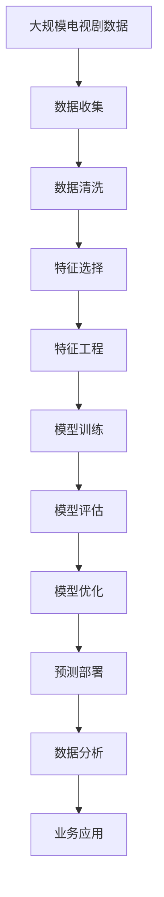

                 

# 基于机器学习的电视剧类型点击量数据分析研究

> 关键词：机器学习, 电视剧类型, 点击量, 数据分析, 特征工程, 深度学习, 预测模型

## 1. 背景介绍

### 1.1 问题由来

随着互联网的普及和智能设备的广泛应用，视频流媒体平台的用户数量和访问量呈现爆炸性增长。这些平台提供了丰富的内容资源，其中电视剧占据了重要地位。如何精准分析用户对电视剧的点击行为，以便更好地进行内容推荐和广告投放，成为平台优化用户体验和提高运营效率的关键问题。

然而，传统的分析方法往往依赖于简单的统计分析或人工观察，难以深入挖掘用户行为背后的复杂规律和趋势。近年来，机器学习（Machine Learning, ML）技术在大数据分析中的应用越来越广泛，特别是深度学习（Deep Learning, DL）模型在图像、语音和自然语言处理等领域取得了显著成效。因此，将机器学习技术应用于电视剧类型点击量数据分析，能够帮助我们更好地理解用户行为，优化内容推荐策略。

### 1.2 问题核心关键点

电视剧类型点击量数据分析的核心在于如何从用户的大量点击数据中，挖掘出有用的信息，并构建预测模型，预测未来用户对不同类型电视剧的点击行为。具体来说，主要包括以下几个关键点：

1. **数据获取与预处理**：从视频流媒体平台收集电视剧类型点击数据，并进行清洗和标准化处理。
2. **特征工程**：提取和构建对用户点击行为有影响的特征，如用户性别、年龄、地域、观看时长、历史行为等。
3. **模型选择与训练**：选择合适的机器学习模型（如线性回归、决策树、随机森林、神经网络等），并利用历史点击数据进行训练和调参。
4. **模型评估与优化**：通过交叉验证和性能指标（如准确率、召回率、F1分数等）评估模型效果，并根据结果进行模型优化。
5. **预测与部署**：利用训练好的模型对用户未来点击行为进行预测，并集成到内容推荐系统中，实现个性化推荐和广告投放。

### 1.3 问题研究意义

电视剧类型点击量数据分析对于视频流媒体平台具有重要意义：

1. **优化内容推荐**：通过分析用户点击行为，可以更好地理解用户偏好，实现个性化内容推荐，提升用户体验和满意度。
2. **提高运营效率**：通过预测用户点击行为，可以在合适的时间点进行内容推广，提高广告投放的精准性和转化率。
3. **辅助决策制定**：分析点击数据有助于了解不同电视剧类型的热度和趋势，辅助平台决策，如新剧制作、广告投放等。
4. **用户行为分析**：通过挖掘用户点击行为背后的规律，可以更深入地了解用户需求，发现潜在的用户群体和行为模式。

## 2. 核心概念与联系

### 2.1 核心概念概述

为更好地理解基于机器学习的电视剧类型点击量数据分析，本节将介绍几个密切相关的核心概念：

- **机器学习（Machine Learning, ML）**：一种利用数据和算法，使计算机系统具备预测、分类、聚类等能力的科学技术。机器学习包括监督学习、无监督学习、强化学习等多种类型。
- **深度学习（Deep Learning, DL）**：机器学习的一种高级形式，通过多层神经网络结构，自动提取数据特征，进行复杂模式识别和决策。深度学习在图像、语音、自然语言处理等领域表现优异。
- **特征工程（Feature Engineering）**：在数据预处理阶段，通过选择、提取、组合、变换等方法，构建对模型有帮助的特征，提升模型预测能力。
- **监督学习（Supervised Learning）**：机器学习的一种类型，通过已标注的数据集进行训练，使模型能够预测新数据的标签。常见的监督学习模型包括线性回归、决策树、随机森林等。
- **预测模型（Prediction Model）**：根据已有数据，构建模型进行未来数据预测。预测模型广泛应用于金融、医疗、电商等多个领域。
- **特征选择（Feature Selection）**：从原始数据中选择对目标变量有影响的特征，减少数据维度和计算复杂度，提升模型泛化能力。

这些核心概念之间的逻辑关系可以通过以下Mermaid流程图来展示：


这个流程图展示了大规模电视剧类型点击量数据分析的主要步骤：从数据收集到特征工程，再到模型训练和预测部署，每个环节都紧密相连，构成完整的分析流程。

### 2.2 概念间的关系

这些核心概念之间存在着紧密的联系，形成了电视剧类型点击量数据分析的完整生态系统。下面我们通过几个Mermaid流程图来展示这些概念之间的关系。

#### 2.2.1 数据预处理流程


这个流程图展示了从原始数据到模型训练的完整预处理流程，其中数据清洗、特征选择和特征工程是数据预处理的关键环节。

#### 2.2.2 模型选择与训练流程


这个流程图展示了从模型选择到预测部署的全过程，其中模型选择、训练、评估和优化是构建高质量预测模型的关键步骤。

#### 2.2.3 特征工程与模型训练的互动


这个流程图展示了特征工程和模型训练之间的互动关系，通过不断调整特征，优化模型训练，最终提升预测效果。

### 2.3 核心概念的整体架构

最后，我们用一个综合的流程图来展示这些核心概念在大规模电视剧类型点击量数据分析中的整体架构：



这个综合流程图展示了从数据收集到业务应用的全过程，各个环节相互协作，共同实现电视剧类型点击量数据分析的目标。

## 3. 核心算法原理 & 具体操作步骤
### 3.1 算法原理概述

基于机器学习的电视剧类型点击量数据分析，本质上是利用历史点击数据构建预测模型，对未来用户行为进行预测。具体来说，主要涉及以下两个方面：

1. **特征提取与处理**：从原始数据中提取和构建对用户点击行为有影响的特征，如用户基本信息、观看时长、历史行为等。
2. **模型训练与优化**：选择合适的机器学习模型，利用历史数据进行训练，并通过交叉验证和性能评估进行模型优化。

通过构建高精度的预测模型，平台可以实时预测用户对不同类型电视剧的点击行为，从而优化内容推荐策略和广告投放。

### 3.2 算法步骤详解

基于机器学习的电视剧类型点击量数据分析主要包括以下几个关键步骤：

**Step 1: 数据收集与预处理**

1. **数据收集**：从视频流媒体平台获取电视剧类型点击数据，包括用户ID、电视剧ID、点击时间、点击类型等信息。
2. **数据清洗**：去除缺失值和异常值，标准化数据格式。

**Step 2: 特征工程**

1. **特征选择**：选择与点击行为相关的重要特征，如用户性别、年龄、地域、观看时长、历史行为等。
2. **特征变换**：对原始特征进行归一化、离散化等处理，提升模型效果。

**Step 3: 模型选择与训练**

1. **模型选择**：选择合适的机器学习模型，如线性回归、决策树、随机森林等。
2. **模型训练**：利用历史点击数据进行模型训练，并选择合适的损失函数和优化算法。

**Step 4: 模型评估与优化**

1. **模型评估**：通过交叉验证和性能指标（如准确率、召回率、F1分数等）评估模型效果。
2. **模型优化**：根据评估结果调整模型参数，如学习率、正则化系数等。

**Step 5: 预测与部署**

1. **预测**：利用训练好的模型对用户未来点击行为进行预测，生成推荐列表。
2. **部署**：将预测模型集成到内容推荐系统中，实现个性化推荐和广告投放。

### 3.3 算法优缺点

基于机器学习的电视剧类型点击量数据分析有以下优点：

1. **预测精度高**：通过构建高质量的预测模型，可以显著提升预测精度，满足实际业务需求。
2. **自动化程度高**：机器学习模型可以自动化完成特征选择、模型训练和优化等任务，减少人工干预。
3. **适应性强**：机器学习模型可以适应不同的数据类型和特征分布，适用于多变的数据环境。

然而，该方法也存在以下缺点：

1. **数据质量要求高**：模型预测效果依赖于高质量的数据，数据清洗和特征工程需要大量前期工作。
2. **模型复杂度大**：机器学习模型往往需要较大的计算资源和时间，模型训练和优化过程可能较为复杂。
3. **解释性不足**：机器学习模型通常是"黑盒"系统，难以解释其内部决策逻辑，难以进行调试和优化。

### 3.4 算法应用领域

基于机器学习的电视剧类型点击量数据分析广泛应用于以下领域：

1. **内容推荐系统**：根据用户历史点击行为，生成个性化推荐列表，提升用户满意度和平台留存率。
2. **广告投放优化**：预测用户点击概率，优化广告投放策略，提高广告转化率和ROI。
3. **用户行为分析**：分析用户点击数据背后的规律和趋势，发现用户需求和行为模式，辅助业务决策。
4. **新剧推荐**：预测新剧类型的热度，为新剧制作和推广提供参考，提升市场竞争力。

## 4. 数学模型和公式 & 详细讲解 & 举例说明

### 4.1 数学模型构建

为了更好地理解基于机器学习的电视剧类型点击量数据分析，我们将构建一个简单的线性回归模型。设历史点击数据集为 $D=\{(x_i,y_i)\}_{i=1}^N$，其中 $x_i$ 为特征向量，$y_i$ 为用户点击行为标签。线性回归模型可以表示为：

$$
y = \theta_0 + \sum_{j=1}^p \theta_j x_{ij} + \epsilon
$$

其中 $\theta = (\theta_0, \theta_1, \ldots, \theta_p)$ 为模型参数，$\epsilon$ 为噪声项。

模型的损失函数为均方误差（Mean Squared Error, MSE）：

$$
L(\theta) = \frac{1}{N} \sum_{i=1}^N (y_i - \hat{y}_i)^2
$$

其中 $\hat{y}_i = \theta_0 + \sum_{j=1}^p \theta_j x_{ij}$。

### 4.2 公式推导过程

下面我们对线性回归模型进行推导。

设 $X \in \mathbb{R}^{N \times p}$ 为特征矩阵，$y \in \mathbb{R}^N$ 为用户点击行为标签，$w \in \mathbb{R}^p$ 为模型参数向量，则线性回归模型可以表示为：

$$
y = Xw + b
$$

其中 $b$ 为截距项，通常初始化为0。模型的损失函数为：

$$
L(w) = \frac{1}{N} \sum_{i=1}^N (y_i - \hat{y}_i)^2 = \frac{1}{N} \sum_{i=1}^N (y_i - (Xw + b))^2
$$

对 $L(w)$ 求导，得：

$$
\frac{\partial L(w)}{\partial w} = -\frac{2}{N} X^T(Xw - y)
$$

令 $\frac{\partial L(w)}{\partial w} = 0$，解得：

$$
w = (X^TX)^{-1}X^Ty
$$

将 $w$ 代入损失函数 $L(w)$，得：

$$
L(w) = \frac{1}{N} y^T(X^TX)^{-1}X^Ty + b^2
$$

可以看出，最优参数 $w$ 和损失函数 $L(w)$ 均与截距项 $b$ 无关，因此通常可以省略截距项。

### 4.3 案例分析与讲解

假设我们有一个简单的电视剧类型点击数据集，其中包含用户ID、电视剧ID、点击时间和点击类型等信息。我们可以将用户性别、年龄、地域等基本信息作为特征 $x_i$，将点击类型（如播放、收藏、评论等）作为标签 $y_i$。

我们将数据集分为训练集和测试集，利用训练集对模型进行训练，并利用测试集进行评估。训练过程中，我们随机选择特征 $x_i$ 和标签 $y_i$，构建损失函数，并使用梯度下降算法进行优化，最终得到最优模型参数 $w$。

通过训练好的模型，我们可以在新的电视剧类型点击数据上生成预测结果，并与真实标签进行对比，评估模型效果。

## 5. 项目实践：代码实例和详细解释说明

### 5.1 开发环境搭建

在进行项目实践前，我们需要准备好开发环境。以下是使用Python进行PyTorch开发的环境配置流程：

1. 安装Anaconda：从官网下载并安装Anaconda，用于创建独立的Python环境。

2. 创建并激活虚拟环境：
```bash
conda create -n ml-env python=3.8 
conda activate ml-env
```

3. 安装PyTorch：根据CUDA版本，从官网获取对应的安装命令。例如：
```bash
conda install pytorch torchvision torchaudio cudatoolkit=11.1 -c pytorch -c conda-forge
```

4. 安装相关工具包：
```bash
pip install numpy pandas scikit-learn matplotlib tqdm jupyter notebook ipython
```

完成上述步骤后，即可在`ml-env`环境中开始项目实践。

### 5.2 源代码详细实现

这里我们以线性回归模型为例，给出利用PyTorch进行电视剧类型点击量数据分析的完整代码实现。

```python
import torch
import torch.nn as nn
import torch.optim as optim
from sklearn.model_selection import train_test_split
from sklearn.metrics import mean_squared_error

# 读取数据集
X = pd.read_csv('data.csv')['features']
y = pd.read_csv('data.csv')['target']

# 数据预处理
X = (X - X.mean()) / X.std()
X_train, X_test, y_train, y_test = train_test_split(X, y, test_size=0.2)

# 定义模型
class LinearRegression(nn.Module):
    def __init__(self, input_dim):
        super(LinearRegression, self).__init__()
        self.linear = nn.Linear(input_dim, 1)
    
    def forward(self, x):
        return self.linear(x)

# 定义优化器和损失函数
model = LinearRegression(X_train.shape[1])
optimizer = optim.SGD(model.parameters(), lr=0.01)
loss_fn = nn.MSELoss()

# 训练模型
for epoch in range(100):
    optimizer.zero_grad()
    outputs = model(X_train)
    loss = loss_fn(outputs, y_train)
    loss.backward()
    optimizer.step()
    print(f'Epoch {epoch+1}, Loss: {loss.item()}')

# 评估模型
with torch.no_grad():
    outputs = model(X_test)
    loss = loss_fn(outputs, y_test)
    mse = mean_squared_error(y_test, outputs.cpu().numpy())
    print(f'Test Loss: {loss.item()}, MSE: {mse}')
```

### 5.3 代码解读与分析

让我们再详细解读一下关键代码的实现细节：

1. **数据预处理**：首先，我们读取数据集，并对特征进行标准化处理。这是数据预处理的重要步骤，能够提升模型效果。

2. **模型定义**：我们定义了一个简单的线性回归模型，包含一个线性层和一个输出层。线性层将输入特征映射到输出，输出层进行线性回归。

3. **优化器和损失函数**：我们选择了随机梯度下降（SGD）优化器，并定义了均方误差（MSE）损失函数。均方误差是线性回归模型的常用损失函数。

4. **模型训练**：在每个epoch中，我们前向传播计算损失函数，并使用反向传播算法更新模型参数。这是模型训练的核心步骤，通过不断迭代优化，使得模型参数逼近最优解。

5. **模型评估**：在测试集上评估模型性能，计算均方误差（MSE），评估模型预测准确性。

## 6. 实际应用场景

### 6.1 智能推荐系统

基于机器学习的电视剧类型点击量数据分析，可以应用于智能推荐系统，实现个性化推荐和广告投放。通过分析用户历史点击行为，智能推荐系统可以生成个性化的电视剧推荐列表，提升用户满意度和平台留存率。此外，智能推荐系统还可以根据用户点击行为，优化广告投放策略，提高广告转化率和ROI。

### 6.2 内容制作与优化

基于机器学习的电视剧类型点击量数据分析，可以为电视剧制作和优化提供参考。通过分析电视剧类型点击数据，制片方可以了解不同电视剧类型的热度和趋势，从而指导新剧制作和内容优化，提升市场竞争力。此外，数据分析还可以为新剧推广和营销提供数据支持，优化广告投放策略，提高广告效果。

### 6.3 用户行为分析

基于机器学习的电视剧类型点击量数据分析，可以用于用户行为分析。通过分析用户点击数据，可以了解用户偏好和行为模式，发现潜在的用户群体和需求，为业务决策提供数据支持。例如，平台可以根据用户点击行为，优化内容推荐策略，提高用户满意度和留存率。

### 6.4 未来应用展望

随着数据量和计算资源的不断增长，基于机器学习的电视剧类型点击量数据分析将有更广阔的应用前景。未来，我们可以利用更多先进的技术手段，如深度学习、强化学习等，提升模型预测能力和适应性，实现更加精准的用户行为预测和推荐。

## 7. 工具和资源推荐

### 7.1 学习资源推荐

为了帮助开发者系统掌握基于机器学习的电视剧类型点击量数据分析的理论基础和实践技巧，这里推荐一些优质的学习资源：

1. **《机器学习》（周志华）**：国内著名机器学习教材，涵盖了机器学习的基本概念、算法和应用。

2. **《深度学习》（Ian Goodfellow）**：深度学习领域的经典教材，详细介绍了深度学习的原理和实践。

3. **Coursera《机器学习》课程**：斯坦福大学开设的机器学习课程，由Andrew Ng教授主讲，内容丰富，适合初学者。

4. **Kaggle机器学习竞赛**：Kaggle提供丰富的机器学习竞赛数据集，适合实践和挑战。

5. **PyTorch官方文档**：PyTorch官方文档，提供了详细的API文档和教程，是学习PyTorch的必备资料。

### 7.2 开发工具推荐

高效的开发离不开优秀的工具支持。以下是几款用于基于机器学习的电视剧类型点击量数据分析的常用工具：

1. **PyTorch**：基于Python的深度学习框架，灵活动态的计算图，适合快速迭代研究。

2. **TensorFlow**：由Google主导开发的深度学习框架，生产部署方便，适合大规模工程应用。

3. **scikit-learn**：Python数据挖掘和机器学习库，包含各种常用的机器学习算法和工具。

4. **Jupyter Notebook**：交互式笔记本，支持Python代码编写、数据可视化等，适合数据探索和模型训练。

5. **TensorBoard**：TensorFlow配套的可视化工具，可实时监测模型训练状态，并提供丰富的图表呈现方式。

### 7.3 相关论文推荐

基于机器学习的电视剧类型点击量数据分析技术的发展源于学界的持续研究。以下是几篇奠基性的相关论文，推荐阅读：

1. **《Deep Learning for Recommender Systems》**：介绍深度学习在推荐系统中的应用，包括协同过滤、序列模型等。

2. **《User Behavior Prediction for Recommendation Systems》**：介绍用户行为预测在推荐系统中的应用，包括基于机器学习的预测方法和模型评估。

3. **《Predictive Analytics in Recommendation Systems》**：介绍预测分析在推荐系统中的应用，包括数据预处理、特征工程和模型优化。

4. **《Click-Through Rate Prediction and Recommendation System》**：介绍点击率预测在推荐系统中的应用，包括数据集构建、特征选择和模型训练。

5. **《Interactive Machine Learning for Recommendation Systems》**：介绍交互式机器学习在推荐系统中的应用，包括在线学习和模型优化。

这些论文代表了大数据环境下推荐系统的发展趋势，提供了丰富的理论基础和实践经验。

## 8. 总结：未来发展趋势与挑战

### 8.1 总结

本文对基于机器学习的电视剧类型点击量数据分析方法进行了全面系统的介绍。首先，阐述了电视剧类型点击量数据分析的研究背景和意义，明确了机器学习在大数据分析中的应用价值。其次，从原理到实践，详细讲解了机器学习模型的构建和训练过程，给出了具体的代码实现和优化技巧。同时，本文还广泛探讨了机器学习模型在智能推荐、内容制作、用户行为分析等多个领域的应用前景，展示了机器学习技术的广泛应用潜力。此外，本文精选了机器学习相关的学习资源和开发工具，力求为读者提供全方位的技术指引。

通过本文的系统梳理，可以看到，基于机器学习的电视剧类型点击量数据分析技术正在成为视频流媒体平台的重要工具，极大地提升了内容推荐和广告投放的精准性和效率。未来，伴随机器学习技术的不断演进，基于数据的电视剧类型点击量分析将发挥更加重要的作用，为视频流媒体平台带来新的业务机遇和发展方向。

### 8.2 未来发展趋势

展望未来，基于机器学习的电视剧类型点击量数据分析技术将呈现以下几个发展趋势：

1. **深度学习应用普及**：深度学习技术在电视剧类型点击量分析中的应用将进一步普及，通过多层神经网络结构，提升模型预测能力和泛化性。

2. **多模态数据融合**：除了电视剧类型点击数据，还可以融合用户行为数据、社交媒体数据等多模态信息，构建更加全面和准确的预测模型。

3. **实时预测系统**：利用流式计算和大数据技术，实现实时预测和动态更新，满足用户即时性和个性化需求。

4. **强化学习应用**：将强化学习技术引入推荐系统，通过奖励机制和交互反馈，进一步优化模型效果。

5. **联邦学习应用**：利用联邦学习技术，实现用户数据隐私保护和跨平台合作，提升数据利用效率。

6. **多任务学习应用**：通过多任务学习技术，同时预测多个相关任务，提升模型预测能力和资源利用效率。

### 8.3 面临的挑战

尽管基于机器学习的电视剧类型点击量数据分析技术已经取得了显著进展，但在实际应用中仍面临诸多挑战：

1. **数据质量问题**：历史点击数据的质量直接影响模型预测效果，数据清洗和特征选择需要大量前期工作。

2. **计算资源限制**：机器学习模型的训练和优化需要较大的计算资源和时间，资源限制可能影响模型效果和实时性。

3. **模型解释性不足**：机器学习模型通常是"黑盒"系统，难以解释其内部决策逻辑，难以进行调试和优化。

4. **用户隐私保护**：在数据收集和分析过程中，需要注意用户隐私保护，避免数据泄露和滥用。

5. **业务应用适配**：将机器学习模型应用于实际业务系统，需要考虑业务逻辑、系统架构和用户需求等复杂因素。

### 8.4 研究展望

面对机器学习面临的挑战，未来的研究需要在以下几个方面寻求新的突破：

1. **数据增强与清洗**：探索数据增强和清洗技术，提升数据质量和数据利用效率。

2. **模型优化与优化器**：研发更加高效的优化算法和模型结构，提升模型训练速度和效果。

3. **可解释性与透明度**：开发可解释性更强的模型和工具，增强模型预测的可理解性和透明性。

4. **隐私保护与数据安全**：引入隐私保护技术，确保数据安全和用户隐私保护。

5. **跨平台协作**：探索跨平台协作机制，提升数据利用效率和资源共享。

6. **多任务联合学习**：研究多任务联合学习技术，同时优化多个相关任务，提升模型性能和资源利用效率。

这些研究方向的探索，必将引领机器学习技术迈向更高的台阶，为视频流媒体平台带来新的业务机遇和发展方向。相信随着技术的不断进步，机器学习在电视剧类型点击量数据分析中的应用将更加广泛和深入。

## 9. 附录：常见问题与解答

**Q1：机器学习模型的预测效果如何评估？**

A: 机器学习模型的预测效果可以通过多种指标进行评估，如准确率、召回率、F1分数、AUC等。这些指标可以综合反映模型的预测能力和泛化能力。

**Q2：如何选择合适的机器学习模型？**

A: 选择合适的机器学习模型需要考虑多个因素，如数据类型、数据规模、特征工程复杂度、计算资源等。常见的机器学习

