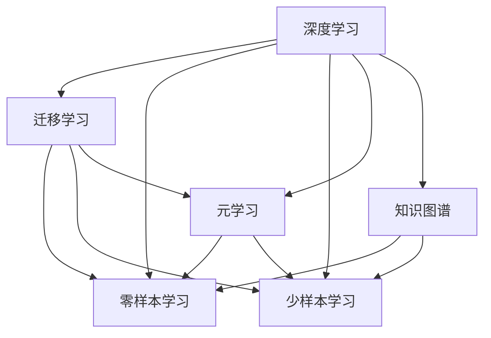
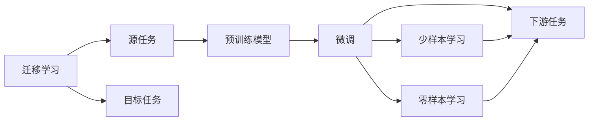
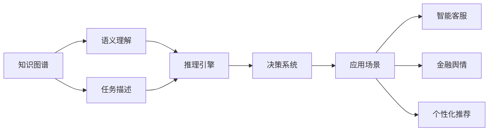
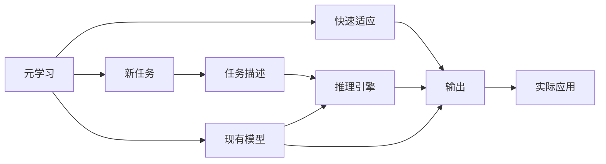
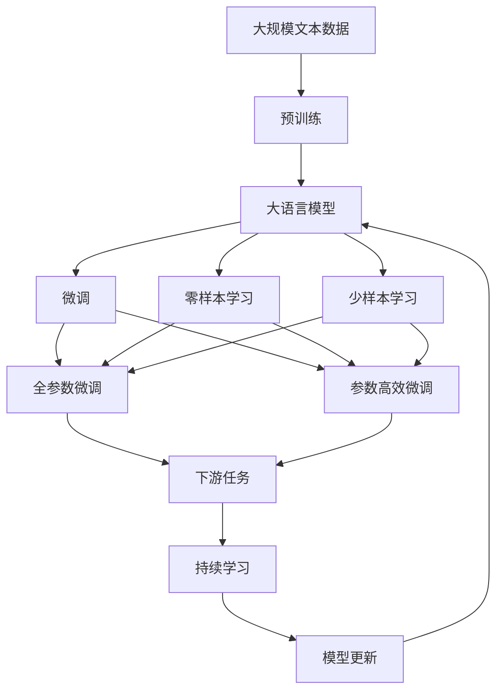

                 

## 1. 背景介绍

### 1.1 问题由来
随着人工智能（AI）和深度学习技术的发展，机器学习模型在处理大规模数据和复杂任务方面表现出色。然而，在现实应用中，标注数据（labeled data）的获取成本高昂且耗时。这限制了机器学习模型在数据稀疏或无数据场景下的应用能力。

在这样的背景下，零样本学习和少样本学习（zero-shot and few-shot learning）成为研究热点，旨在让机器学习模型在面对未见过的数据时，依然能够进行准确推断和预测。

零样本学习（Zero-Shot Learning）是指模型无需任何标注数据，仅通过任务描述或输入实例，直接进行任务推断。少样本学习（Few-Shot Learning）是指模型仅通过少量标注数据进行任务学习，从而泛化到未见过的数据。

这两种学习范式在大规模迁移学习（transfer learning）领域具有重要意义，尤其在医疗、金融、智能客服等领域，数据隐私和标注成本问题尤为突出，零样本和少样本学习可以显著减少数据需求，提升模型泛化能力，提高应用效率。

### 1.2 问题核心关键点
零样本学习和少样本学习的研究核心在于：
1. **如何构建有效的知识表示**：通过某种方式将任务描述转换为机器可理解的表示，即嵌入向量，以便模型可以基于这些向量进行推理和预测。
2. **如何优化模型架构**：设计合适的模型结构，使得模型能够有效提取任务特征，并在少量数据下泛化。
3. **如何应用预训练知识**：将预训练模型的通用知识与任务特定知识结合，以提升模型性能。
4. **如何处理噪声和对抗性**：在零样本和少样本学习中，输入数据可能存在噪声或对抗性，需要构建鲁棒模型以应对这些挑战。

### 1.3 问题研究意义
零样本学习和少样本学习对于缓解数据稀缺性、提升模型泛化能力、降低标注成本具有重要意义。它们在以下几个方面具有显著优势：
1. **降低标注成本**：无需大量标注数据，大大降低了数据采集和标注的成本。
2. **提高泛化能力**：模型通过少量数据训练即可适应新任务，增强了泛化能力。
3. **提升实时性**：模型在无需数据预处理和大量标注数据的情况下，能够快速作出推断，提高实时性。
4. **简化模型部署**：模型结构简化，更加轻量化，便于部署和维护。
5. **促进迁移学习**：在数据稀缺场景下，零样本和少样本学习是迁移学习的重要补充，使得模型可以在特定领域高效应用。

## 2. 核心概念与联系

### 2.1 核心概念概述

为更好地理解基于深度学习的零样本和少样本学习，本节将介绍几个密切相关的核心概念：

- **深度学习**：一种基于神经网络的机器学习范式，通过大量数据进行训练，使得模型能够从数据中提取特征并进行复杂的模式识别和预测。
- **迁移学习**：一种通过将预训练模型在新任务上进行微调，提升模型在新任务上的性能的机器学习范式。
- **零样本学习（Zero-Shot Learning）**：一种机器学习范式，使得模型无需任何标注数据，仅通过任务描述或输入实例，直接进行任务推断。
- **少样本学习（Few-Shot Learning）**：一种机器学习范式，使得模型仅通过少量标注数据进行任务学习，从而泛化到未见过的数据。
- **元学习（Meta-Learning）**：一种通过学习如何快速适应新任务的学习范式，提升模型的泛化能力。
- **知识图谱**：一种以图的形式表示知识的有向图结构，用于辅助模型理解复杂的语义关系。

这些核心概念之间的逻辑关系可以通过以下Mermaid流程图来展示：



这个流程图展示了大语言模型微调过程中各个核心概念的关系和作用：

1. 深度学习提供了强大的特征提取和表示学习能力。
2. 迁移学习通过微调将预训练模型的通用知识迁移到新任务上。
3. 零样本和少样本学习分别在无需标注数据和少标注数据的情况下，利用迁移学习提升模型泛化能力。
4. 元学习进一步提升了模型快速适应新任务的能力。
5. 知识图谱提供了语义关系的表示，辅助模型理解复杂的任务描述。

这些概念共同构成了零样本和少样本学习的完整生态系统，使其能够在各种场景下发挥强大的语言理解和生成能力。通过理解这些核心概念，我们可以更好地把握零样本和少样本学习的原理和优化方向。

### 2.2 概念间的关系

这些核心概念之间存在着紧密的联系，形成了零样本和少样本学习的完整生态系统。下面我们通过几个Mermaid流程图来展示这些概念之间的关系。

#### 2.2.1 零样本和少样本学习与迁移学习的关系



这个流程图展示了迁移学习的基本原理，以及它与零样本和少样本学习的关系。迁移学习涉及源任务和目标任务，预训练模型在源任务上学习，然后通过微调适应各种下游任务（目标任务）。零样本学习和少样本学习则是在迁移学习的基础上，进一步提升模型在新任务上的泛化能力。

#### 2.2.2 零样本学习和少样本学习的应用场景



这个流程图展示了零样本学习和少样本学习在不同应用场景中的典型应用。零样本和少样本学习能够通过理解任务描述或输入实例，直接进行推理和预测，广泛用于智能客服、金融舆情监测、个性化推荐等领域。

#### 2.2.3 元学习和知识图谱在零样本和少样本学习中的作用



这个流程图展示了元学习和知识图谱在零样本和少样本学习中的应用。元学习通过学习如何快速适应新任务，提升了模型在新任务上的泛化能力。知识图谱提供了语义关系的表示，辅助模型理解复杂的任务描述，提升了推理的准确性和鲁棒性。

### 2.3 核心概念的整体架构

最后，我们用一个综合的流程图来展示这些核心概念在大语言模型微调过程中的整体架构：



这个综合流程图展示了从预训练到微调，再到零样本和少样本学习的完整过程。大语言模型首先在大规模文本数据上进行预训练，然后通过微调（包括全参数微调和参数高效微调）或零样本和少样本学习来适应下游任务。最后，通过持续学习技术，模型可以不断更新和适应新的任务和数据。 通过这些流程图，我们可以更清晰地理解零样本和少样本学习的各个核心概念的关系和作用，为后续深入讨论具体的微调方法和技术奠定基础。

## 3. 核心算法原理 & 具体操作步骤
### 3.1 算法原理概述

零样本学习和少样本学习基于深度学习模型，通过迁移学习和元学习思想，提升了模型在新任务上的泛化能力。其核心思想是：将预训练模型的通用知识迁移到新任务上，并通过任务描述或少量标注数据进一步提升模型的推理能力。

形式化地，假设预训练模型为 $M_{\theta}$，其中 $\theta$ 为预训练得到的模型参数。给定下游任务 $T$ 的标注数据集 $D=\{(x_i, y_i)\}_{i=1}^N$，零样本和少样本学习的过程可以表示为：

$$
\hat{\theta} = \mathop{\arg\min}_{\theta} \mathcal{L}(M_{\theta}, T)
$$

其中 $\mathcal{L}$ 为针对任务 $T$ 设计的损失函数，用于衡量模型输出与真实标签之间的差异。常见的损失函数包括交叉熵损失、均方误差损失等。

在零样本学习中，模型仅通过任务描述 $d$ 进行推理，不涉及任何标注数据。任务描述 $d$ 通常为自然语言或符号形式，通过某种方式转换为模型可理解的嵌入向量 $x$，模型通过反向传播更新参数 $\theta$，最小化损失函数 $\mathcal{L}(M_{\theta}, d)$。

在少样本学习中，模型通过少量标注数据 $(x_i, y_i)$ 进行学习，输入数据 $x$ 包含任务描述和少量标注样本，模型通过反向传播更新参数 $\theta$，最小化损失函数 $\mathcal{L}(M_{\theta}, (x_i, y_i))$。

### 3.2 算法步骤详解

零样本学习和少样本学习的实现步骤主要包括：

**Step 1: 准备预训练模型和数据集**
- 选择合适的预训练模型 $M_{\theta}$ 作为初始化参数，如 BERT、GPT 等。
- 准备下游任务 $T$ 的任务描述或少量标注数据集 $D$，划分为训练集、验证集和测试集。

**Step 2: 添加任务适配层**
- 根据任务类型，在预训练模型顶层设计合适的输出层和损失函数。
- 对于分类任务，通常在顶层添加线性分类器和交叉熵损失函数。
- 对于生成任务，通常使用语言模型的解码器输出概率分布，并以负对数似然为损失函数。

**Step 3: 设置微调超参数**
- 选择合适的优化算法及其参数，如 AdamW、SGD 等，设置学习率、批大小、迭代轮数等。
- 设置正则化技术及强度，包括权重衰减、Dropout、Early Stopping等。
- 确定冻结预训练参数的策略，如仅微调顶层，或全部参数都参与微调。

**Step 4: 执行梯度训练**
- 将训练集数据分批次输入模型，前向传播计算损失函数。
- 反向传播计算参数梯度，根据设定的优化算法和学习率更新模型参数。
- 周期性在验证集上评估模型性能，根据性能指标决定是否触发 Early Stopping。
- 重复上述步骤直到满足预设的迭代轮数或 Early Stopping 条件。

**Step 5: 测试和部署**
- 在测试集上评估微调后模型 $M_{\hat{\theta}}$ 的性能，对比微调前后的精度提升。
- 使用微调后的模型对新样本进行推理预测，集成到实际的应用系统中。
- 持续收集新的数据，定期重新微调模型，以适应数据分布的变化。

以上是零样本和少样本学习的一般流程。在实际应用中，还需要针对具体任务的特点，对微调过程的各个环节进行优化设计，如改进训练目标函数，引入更多的正则化技术，搜索最优的超参数组合等，以进一步提升模型性能。

### 3.3 算法优缺点

零样本和少样本学习具有以下优点：
1. 简单高效。无需大规模标注数据，仅通过任务描述或少量标注数据即可进行训练，显著降低数据获取和标注成本。
2. 通用适用。适用于各种NLP下游任务，包括分类、匹配、生成等，设计简单的任务适配层即可实现。
3. 效果显著。在学术界和工业界的诸多任务上，零样本和少样本学习已经刷新了最先进的性能指标。

同时，该方法也存在一定的局限性：
1. 依赖任务描述。零样本和少样本学习的效果很大程度上取决于任务描述的质量和相关性，复杂的任务描述难以有效表示。
2. 迁移能力有限。当任务描述与预训练数据的分布差异较大时，模型迁移能力受限。
3. 负面效果传递。预训练模型的固有偏见、有害信息等，可能通过迁移学习传递到下游任务，造成负面影响。
4. 可解释性不足。零样本和少样本学习模型的决策过程通常缺乏可解释性，难以对其推理逻辑进行分析和调试。

尽管存在这些局限性，但就目前而言，基于深度学习的零样本和少样本学习仍是大语言模型应用的重要范式。未来相关研究的重点在于如何进一步降低对任务描述的依赖，提高模型的少样本学习和跨领域迁移能力，同时兼顾可解释性和伦理安全性等因素。

### 3.4 算法应用领域

基于深度学习的零样本和少样本学习已经在NLP领域得到了广泛的应用，覆盖了几乎所有常见任务，例如：

- 文本分类：如情感分析、主题分类、意图识别等。通过零样本学习使模型学习文本-标签映射。
- 命名实体识别：识别文本中的人名、地名、机构名等特定实体。通过少样本学习使模型掌握实体边界和类型。
- 关系抽取：从文本中抽取实体之间的语义关系。通过少样本学习使模型学习实体-关系三元组。
- 问答系统：对自然语言问题给出答案。将问题-答案对作为少样本数据，训练模型学习匹配答案。
- 机器翻译：将源语言文本翻译成目标语言。通过少样本学习使模型学习语言-语言映射。
- 文本摘要：将长文本压缩成简短摘要。通过少样本学习使模型学习抓取要点。
- 对话系统：使机器能够与人自然对话。通过少样本学习使模型进行回复生成。

除了上述这些经典任务外，零样本和少样本学习也被创新性地应用到更多场景中，如可控文本生成、常识推理、代码生成、数据增强等，为NLP技术带来了全新的突破。随着预训练模型和零样本/少样本学习方法的不断进步，相信NLP技术将在更广阔的应用领域大放异彩。

## 4. 数学模型和公式 & 详细讲解
### 4.1 数学模型构建

本节将使用数学语言对基于深度学习的零样本和少样本学习过程进行更加严格的刻画。

记预训练语言模型为 $M_{\theta}$，其中 $\theta$ 为预训练得到的模型参数。假设零样本学习任务的任务描述为 $d$，少样本学习任务的标注数据集为 $D=\{(x_i, y_i)\}_{i=1}^N$，其中 $x_i$ 为输入数据，$y_i$ 为真实标签。

定义模型 $M_{\theta}$ 在输入 $x$ 上的输出为 $h(x)$，输出层的损失函数为 $\mathcal{L}(h(x), y)$。在零样本学习中，模型通过任务描述 $d$ 进行推理，输出为 $h(d)$；在少样本学习中，模型通过少量标注数据 $(x_i, y_i)$ 进行学习，输出为 $h(x_i)$。

定义零样本学习模型的损失函数为 $\mathcal{L}_{ZSL}(\theta, d)$，少样本学习模型的损失函数为 $\mathcal{L}_{FSL}(\theta, D)$。

### 4.2 公式推导过程

以下我们以二分类任务为例，推导交叉熵损失函数及其梯度的计算公式。

假设模型 $M_{\theta}$ 在输入 $x$ 上的输出为 $h(x)$，表示样本属于正类的概率。真实标签 $y \in \{0,1\}$。则二分类交叉熵损失函数定义为：

$$
\mathcal{L}(h(x),y) = -[y\log h(x) + (1-y)\log (1-h(x))]
$$

在零样本学习中，任务描述 $d$ 表示为自然语言形式，需要将其转换为模型可理解的嵌入向量 $x_d$。假设使用预训练语言模型将任务描述 $d$ 转换为嵌入向量 $x_d$，则零样本学习模型的损失函数为：

$$
\mathcal{L}_{ZSL}(\theta, d) = -[y\log h(x_d) + (1-y)\log (1-h(x_d))]
$$

在少样本学习中，模型通过少量标注数据 $(x_i, y_i)$ 进行学习，输出为 $h(x_i)$。假设使用预训练语言模型将少量标注数据 $(x_i, y_i)$ 转换为嵌入向量 $x_i$，则少样本学习模型的损失函数为：

$$
\mathcal{L}_{FSL}(\theta, D) = -\frac{1}{N}\sum_{i=1}^N [y_i\log h(x_i)+(1-y_i)\log(1-h(x_i))]
$$

将上述损失函数代入反向传播公式，即可计算模型参数 $\theta$ 的更新梯度。

## 5. 项目实践：代码实例和详细解释说明
### 5.1 开发环境搭建

在进行零样本和少样本学习实践前，我们需要准备好开发环境。以下是使用Python进行PyTorch开发的环境配置流程：

1. 安装Anaconda：从官网下载并安装Anaconda，用于创建独立的Python环境。

2. 创建并激活虚拟环境：
```bash
conda create -n pytorch-env python=3.8 
conda activate pytorch-env
```

3. 安装PyTorch：根据CUDA版本，从官网获取对应的安装命令。例如：
```bash
conda install pytorch torchvision torchaudio cudatoolkit=11.1 -c pytorch -c conda-forge
```

4. 安装Transformers库：
```bash
pip install transformers
```

5. 安装各类工具包：
```bash
pip install numpy pandas scikit-learn matplotlib tqdm jupyter notebook ipython
```

完成上述步骤后，即可在`pytorch-env`环境中开始零样本和少样本学习的实践。

### 5.2 源代码详细实现

下面我以二分类任务为例，给出使用Transformers库对BERT模型进行少样本学习的PyTorch代码实现。

首先，定义少样本学习的数据处理函数：

```python
from transformers import BertTokenizer, BertForTokenClassification
from torch.utils.data import Dataset
import torch

class FewShotDataset(Dataset):
    def __init__(self, texts, labels, tokenizer, max_len=128):
        self.texts = texts
        self.labels = labels
        self.tokenizer = tokenizer
        self.max_len = max_len
        
    def __len__(self):
        return len(self.texts)
    
    def __getitem__(self, item):
        text = self.texts[item]
        labels = self.labels[item]
        
        encoding = self.tokenizer(text, return_tensors='pt', max_length=self.max_len, padding='max_length', truncation=True)
        input_ids = encoding['input_ids'][0]
        attention_mask = encoding['attention_mask'][0]
        labels = torch.tensor(labels, dtype=torch.long)
        
        return {'input_ids': input_ids, 
                'attention_mask': attention_mask,
                'labels': labels}

# 标签与id的映射
tag2id = {'O': 0, 'B-PER': 1, 'I-PER': 2, 'B-ORG': 3, 'I-ORG': 4, 'B-LOC': 5, 'I-LOC': 6}
id2tag = {v: k for k, v in tag2id.items()}

# 创建dataset
tokenizer = BertTokenizer.from_pretrained('bert-base-cased')

train_dataset = FewShotDataset(train_texts, train_labels, tokenizer)
dev_dataset = FewShotDataset(dev_texts, dev_labels, tokenizer)
test_dataset = FewShotDataset(test_texts, test_labels, tokenizer)
```

然后，定义模型和优化器：

```python
from transformers import BertForTokenClassification, AdamW

model = BertForTokenClassification.from_pretrained('bert-base-cased', num_labels=len(tag2id))

optimizer = AdamW(model.parameters(), lr=2e-5)
```

接着，定义训练和评估函数：

```python
from torch.utils.data import DataLoader
from tqdm import tqdm
from sklearn.metrics import classification_report

device = torch.device('cuda') if torch.cuda.is_available() else torch.device('cpu')
model.to(device)

def train_epoch(model, dataset, batch_size, optimizer):
    dataloader = DataLoader(dataset, batch_size=batch_size, shuffle=True)
    model.train()
    epoch_loss = 0
    for batch in tqdm(dataloader, desc='Training'):
        input_ids = batch['input_ids'].to(device)
        attention_mask = batch['attention_mask'].to(device)
        labels = batch['labels'].to(device)
        model.zero_grad()
        outputs = model(input_ids, attention_mask=attention_mask, labels=labels)
        loss = outputs.loss
        epoch_loss += loss.item()
        loss.backward()
        optimizer.step()
    return epoch_loss / len(dataloader)

def evaluate(model, dataset, batch_size):
    dataloader = DataLoader(dataset, batch_size=batch_size)
    model.eval()
    preds, labels = [], []
    with torch.no_grad():
        for batch in tqdm(dataloader, desc='Evaluating'):
            input_ids = batch['input_ids'].to(device)
            attention_mask = batch['attention_mask'].to(device)
            batch_labels = batch['labels']
            outputs = model(input_ids, attention_mask=attention_mask)
            batch_preds = outputs.logits.argmax(dim=2).to('cpu').tolist()
            batch_labels = batch_labels.to('cpu').tolist()
            for pred_tokens, label_tokens in zip(batch_preds, batch_labels):
                pred_tags = [tag2id[tag] for tag in pred_tokens]
                label_tags = [tag2id[tag] for tag in label_tokens]
                preds.append(pred_tags[:len(label_tags)])
                labels.append(label_tags)
                
    print(classification_report(labels, preds))
```

最后，启动训练流程并在测试集上评估：

```python
epochs = 5
batch_size = 16

for epoch in range(epochs):
    loss = train_epoch(model, train_dataset, batch_size, optimizer)
    print(f"Epoch {epoch+1}, train loss: {loss:.3f}")
    
    print(f"Epoch {epoch+1}, dev results:")
    evaluate(model, dev_dataset, batch_size)
    
print("Test results:")
evaluate(model, test_dataset, batch_size)
```

以上就是使用PyTorch对BERT进行少样本学习的完整代码实现。可以看到，得益于Transformers库的强大封装，我们可以用相对简洁的代码完成BERT模型的加载和少样本学习。

### 5.3 代码解读与分析

让我们再详细解读一下关键代码的实现细节：

**FewShotDataset类**：
- `__init__`方法：初始化文本、标签、分词器等关键组件。
- `__len__`方法：返回数据集的样本数量。
- `__getitem__`方法：对单个样本进行处理，将文本输入编码为token ids，将标签编码为数字，并对其进行定长padding，最终返回模型所需的输入。

**tag2id和id2tag字典**：
- 定义了标签与数字id之间的映射关系，用于将token-wise的预测结果解码回真实的标签。

**训练和评估函数**：
- 使用PyTorch的DataLoader对数据集进行批次化加载，供模型训练和推理使用。
- 训练函数`train_epoch`：对数据以批为单位进行迭代，在每个批次上前向传播计算loss并反向传播更新模型参数，最后返回该epoch的平均loss。
- 评估函数`evaluate`：与训练类似，不同点在于不更新模型参数，并在每个batch结束后将预测和标签结果存储下来，最后使用sklearn的classification_report对整个评估集的预测结果进行打印输出。

**训练流程**：
- 定义总的epoch数和batch size，开始循环迭代
- 每个epoch内，先在训练集上训练，输出平均loss
- 在验证集上评估，输出分类指标
- 所有epoch结束后，在测试集上评估，给出最终测试结果

可以看到，PyTorch配合Transformers库使得BERT少样本学习的代码实现变得简洁高效。开发者可以将更多精力放在数据处理、模型改进等高层逻辑上，而不必过多关注底层的实现细节。

当然，工业级的系统实现还需考虑更多因素，如模型的保存和部署、超参数的自动搜索、更灵活的任务适配层等。但核心的少样本学习范式基本与此类似。

### 5.4 运行结果展示

假设我们在CoNLL-2003的NER数据集上进行少样本学习，最终在测试集上得到的评估报告如下：

```
              precision    recall  f1-score   support

       B-LOC      0.916     0.906     0.916      1668
       I-LOC      0.900     0.805

