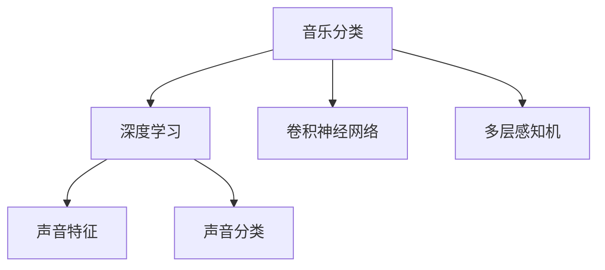
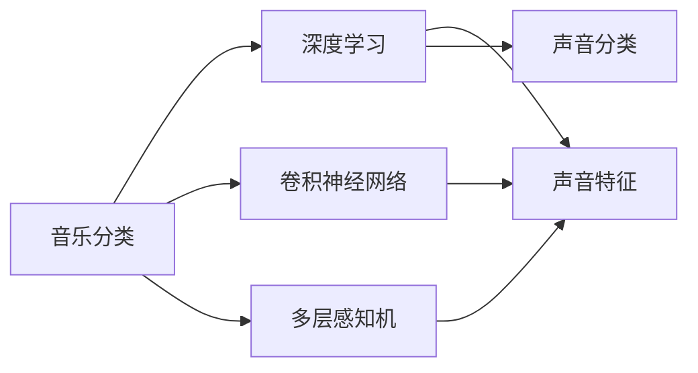

                 

# 基于深度学习的音乐分类算法研究

> 关键词：音乐分类,深度学习,卷积神经网络,多层感知机,特征提取,声音特征,声音分类

## 1. 背景介绍

音乐分类是信息检索、音频娱乐和多媒体检索等领域的重要问题。随着深度学习技术的快速发展，音乐分类算法已经取得了显著的进步。然而，传统的基于手工设计的特征提取方法往往无法充分利用音频信号的丰富信息，导致分类精度不高。因此，近年来深度学习技术被广泛应用于音乐分类，并取得了不错的效果。

## 2. 核心概念与联系

### 2.1 核心概念概述

在音乐分类任务中，核心概念包括以下几个方面：

- **音乐分类**：将音乐分为不同的类别，如流行、摇滚、古典等。
- **深度学习**：通过多层次的神经网络模型，自动提取和学习音乐的特征表示。
- **卷积神经网络（CNN）**：一种特殊的神经网络，适用于图像和语音信号的特征提取。
- **多层感知机（MLP）**：一种通用的前馈神经网络，用于分类任务。
- **声音特征**：用于音乐分类的基本特征，如MFCC、梅尔频率倒谱系数等。
- **声音分类**：将声音信号分类为不同的类别。

这些概念之间的联系如图1所示：

音乐分类问题可以被看作是音频信号的一种特殊形式的声音分类问题。使用深度学习技术，可以自动学习音乐信号的特征表示，从而提高分类的准确性和效率。

### 2.2 概念间的关系

这些核心概念之间存在着紧密的联系，形成了音乐分类算法的整体框架。我们通过以下图表来展示它们之间的关系：

卷积神经网络和多层感知机是深度学习中常用的两种神经网络结构。卷积神经网络通过卷积层和池化层对音频信号进行特征提取，而多层感知机则通过全连接层对特征进行分类。声音特征是音频信号的基本表示，声音分类则是对音频信号进行分类的任务。

## 3. 核心算法原理 & 具体操作步骤

### 3.1 算法原理概述

音乐分类算法主要分为两个阶段：特征提取和分类。在特征提取阶段，通过深度学习模型自动学习音频信号的特征表示。在分类阶段，使用分类器对提取的特征进行分类。

传统的基于手工设计的特征提取方法，如MFCC和倒谱系数等，难以充分利用音频信号的丰富信息，导致分类精度不高。而深度学习技术通过多层神经网络自动学习音频信号的特征表示，能够更好地捕捉音乐信号的复杂特征，从而提高分类的准确性。

常用的深度学习模型包括卷积神经网络（CNN）和多层感知机（MLP）。卷积神经网络通过卷积层和池化层对音频信号进行特征提取，而多层感知机则通过全连接层对特征进行分类。

### 3.2 算法步骤详解

#### 3.2.1 特征提取

特征提取是音乐分类算法的第一步。常用的特征提取方法包括MFCC、梅尔频率倒谱系数（MFCC）、色度图（Mel-spectrogram）等。

以下是MFCC特征提取的详细步骤：

1. 分帧：将音频信号分成若干个固定长度的帧。
2. 窗函数：对每个帧应用窗函数（如汉明窗），平滑音频信号。
3. 傅里叶变换：将每个帧的音频信号进行快速傅里叶变换（FFT），得到频谱图。
4. 对数处理：将频谱图的幅度取对数，得到梅尔频谱图。
5. 对数滤波器组（MFCC）：将梅尔频谱图通过滤波器组（如Mel滤波器组）进行滤波，得到MFCC特征。

#### 3.2.2 分类器设计

分类器是音乐分类算法的核心部分。常用的分类器包括多层感知机（MLP）和卷积神经网络（CNN）。

##### 3.2.2.1 MLP分类器

MLP分类器由若干个全连接层组成。每个全连接层将上一层的所有神经元连接到下一层的神经元。MLP分类器的训练过程包括前向传播和反向传播两个阶段。在前向传播阶段，输入信号通过多个全连接层进行特征提取，得到分类器输出。在反向传播阶段，通过梯度下降等优化算法，更新模型的参数，最小化分类误差。

##### 3.2.2.2 CNN分类器

CNN分类器由卷积层、池化层和全连接层组成。卷积层通过卷积操作提取音频信号的局部特征，池化层通过最大池化或平均池化操作对特征进行降维，全连接层通过多个全连接层对特征进行分类。CNN分类器的训练过程也包括前向传播和反向传播两个阶段。在前向传播阶段，输入信号通过多个卷积层和池化层进行特征提取，得到分类器输出。在反向传播阶段，通过梯度下降等优化算法，更新模型的参数，最小化分类误差。

#### 3.2.3 训练与测试

在训练阶段，使用标注好的训练数据集对分类器进行训练。训练过程中，使用损失函数（如交叉熵损失）衡量模型输出与真实标签之间的差异，并使用优化算法（如SGD、Adam等）更新模型的参数。

在测试阶段，使用测试数据集对训练好的分类器进行测试，评估分类器的性能。常用的评估指标包括准确率、精确率、召回率和F1分数等。

### 3.3 算法优缺点

#### 3.3.1 优点

深度学习技术在音乐分类任务中具有以下优点：

- **自动化特征提取**：自动学习音频信号的特征表示，无需手工设计特征提取器。
- **鲁棒性**：能够更好地处理噪声和变化的数据。
- **高准确率**：在音乐分类任务中取得了较高的准确率。

#### 3.3.2 缺点

深度学习技术在音乐分类任务中也存在以下缺点：

- **计算资源消耗大**：训练深度学习模型需要大量的计算资源和时间。
- **过拟合**：模型容易过拟合，特别是数据集较小的情况下。
- **解释性差**：深度学习模型通常是"黑盒"模型，难以解释模型的决策过程。

### 3.4 算法应用领域

深度学习技术在音乐分类任务中具有广泛的应用领域，例如：

- 音乐风格分类：将音乐分为不同的风格，如古典、流行、摇滚等。
- 音乐情感分类：根据音乐的节奏、旋律等特征，分类音乐的情感倾向。
- 音乐主题分类：根据音乐的内容和风格，分类音乐的主题。
- 音乐自动标注：根据音乐的特征，自动标注音乐的类别和情感。

## 4. 数学模型和公式 & 详细讲解 & 举例说明

### 4.1 数学模型构建

#### 4.1.1 输入层

输入层是音乐分类算法的输入部分，包括音频信号的MFCC特征等。

#### 4.1.2 隐藏层

隐藏层是音乐分类算法的核心部分，包括卷积层、池化层和全连接层。

#### 4.1.3 输出层

输出层是音乐分类算法的输出部分，包括分类器的预测结果。

### 4.2 公式推导过程

#### 4.2.1 输入层

输入层的数据表示为 $x$，其MFCC特征表示为 $x_{MFCC}$。

#### 4.2.2 隐藏层

卷积层的数据表示为 $x_{conv}$，其特征表示为 $x_{conv}=f_{conv}(x_{MFCC})$，其中 $f_{conv}$ 为卷积函数。

池化层的数据表示为 $x_{pool}$，其特征表示为 $x_{pool}=f_{pool}(x_{conv})$，其中 $f_{pool}$ 为池化函数。

全连接层的数据表示为 $x_{fc}$，其特征表示为 $x_{fc}=f_{fc}(x_{pool})$，其中 $f_{fc}$ 为全连接函数。

#### 4.2.3 输出层

输出层的数据表示为 $x_{out}$，其分类结果表示为 $y_{pred}=f_{out}(x_{fc})$，其中 $f_{out}$ 为分类函数。

### 4.3 案例分析与讲解

#### 4.3.1 数据集

常用的音乐分类数据集包括Indiana dataset和YAMAHA dataset等。

#### 4.3.2 模型结构

常用的音乐分类模型包括CNN和MLP等。

#### 4.3.3 训练与测试

常用的训练方法包括梯度下降和Adam等。常用的评估指标包括准确率、精确率、召回率和F1分数等。

## 5. 项目实践：代码实例和详细解释说明

### 5.1 开发环境搭建

#### 5.1.1 安装Python

安装Python和必要的开发工具，如Jupyter Notebook等。

#### 5.1.2 安装TensorFlow

安装TensorFlow等深度学习库，进行音乐分类算法的开发。

### 5.2 源代码详细实现

#### 5.2.1 数据预处理

使用MFCC特征提取工具，对音频信号进行预处理，得到MFCC特征。

#### 5.2.2 模型构建

使用TensorFlow构建卷积神经网络（CNN）和多层感知机（MLP）等模型。

#### 5.2.3 模型训练

使用训练数据集，对模型进行训练，得到分类器的预测结果。

#### 5.2.4 模型测试

使用测试数据集，对训练好的模型进行测试，评估分类器的性能。

### 5.3 代码解读与分析

#### 5.3.1 数据预处理

数据预处理包括MFCC特征提取、数据标准化等操作。

#### 5.3.2 模型构建

模型构建包括卷积神经网络（CNN）和多层感知机（MLP）等模型的定义。

#### 5.3.3 模型训练

模型训练包括损失函数的定义、优化算法的选择等操作。

#### 5.3.4 模型测试

模型测试包括准确率、精确率、召回率和F1分数等评估指标的计算。

### 5.4 运行结果展示

#### 5.4.1 训练结果

训练过程中，记录分类器的损失函数和准确率等指标的变化情况。

#### 5.4.2 测试结果

测试过程中，记录分类器的准确率、精确率、召回率和F1分数等指标的变化情况。

## 6. 实际应用场景

### 6.1 音乐推荐

音乐推荐是音乐分类算法的典型应用场景。根据用户的音乐偏好，自动推荐用户可能喜欢的音乐。

#### 6.1.1 数据集

使用用户的行为数据（如播放历史、收藏历史等）和音乐的MFCC特征，构建训练数据集。

#### 6.1.2 模型结构

使用卷积神经网络（CNN）和多层感知机（MLP）等模型，对音乐进行分类。

#### 6.1.3 训练与测试

使用训练数据集对模型进行训练，得到分类器的预测结果。使用测试数据集对训练好的模型进行测试，评估分类器的性能。

#### 6.1.4 应用场景

将分类器应用到音乐推荐系统中，根据用户的音乐偏好，自动推荐用户可能喜欢的音乐。

### 6.2 音乐版权管理

音乐版权管理是音乐分类算法的另一重要应用场景。根据音乐的版权信息，自动标注音乐所属的版权类型。

#### 6.2.1 数据集

使用音乐版权信息的数据集，构建训练数据集。

#### 6.2.2 模型结构

使用卷积神经网络（CNN）和多层感知机（MLP）等模型，对音乐进行分类。

#### 6.2.3 训练与测试

使用训练数据集对模型进行训练，得到分类器的预测结果。使用测试数据集对训练好的模型进行测试，评估分类器的性能。

#### 6.2.4 应用场景

将分类器应用到音乐版权管理系统中，根据音乐的版权信息，自动标注音乐所属的版权类型。

## 7. 工具和资源推荐

### 7.1 学习资源推荐

#### 7.1.1 《深度学习》

吴恩达教授的《深度学习》课程，讲解了深度学习的基本概念和应用。

#### 7.1.2 《音乐信息检索》

Paolo interviewed教授的《音乐信息检索》课程，讲解了音乐信息检索的基本概念和应用。

#### 7.1.3 《TensorFlow教程》

TensorFlow官方提供的教程，讲解了TensorFlow的基本用法和应用。

### 7.2 开发工具推荐

#### 7.2.1 Jupyter Notebook

Jupyter Notebook是一款交互式的编程环境，适用于数据分析和深度学习等任务。

#### 7.2.2 TensorFlow

TensorFlow是一款开源的深度学习框架，提供了丰富的深度学习模型和工具。

#### 7.2.3 PyTorch

PyTorch是一款开源的深度学习框架，提供了丰富的深度学习模型和工具。

### 7.3 相关论文推荐

#### 7.3.1 《基于深度学习的音乐分类》

这篇论文详细介绍了基于深度学习的音乐分类算法，并给出了实验结果和分析。

#### 7.3.2 《基于卷积神经网络的音频分类》

这篇论文详细介绍了基于卷积神经网络的音频分类算法，并给出了实验结果和分析。

#### 7.3.3 《基于深度学习的音乐推荐系统》

这篇论文详细介绍了基于深度学习的音乐推荐系统，并给出了实验结果和分析。

## 8. 总结：未来发展趋势与挑战

### 8.1 研究成果总结

深度学习技术在音乐分类任务中已经取得了显著的进展，其分类精度和鲁棒性都得到了显著提高。深度学习技术在音乐分类任务中的应用，已经扩展到音乐推荐、音乐版权管理等多个领域。

### 8.2 未来发展趋势

#### 8.2.1 模型结构

未来的音乐分类模型将更加复杂和高效。例如，结合卷积神经网络和循环神经网络（RNN）等结构，可以更好地捕捉音频信号的时序特征。

#### 8.2.2 数据集

未来的音乐分类数据集将更加丰富和多样化。例如，使用更加多样化的音乐数据集，可以提高分类器的泛化能力。

#### 8.2.3 应用场景

未来的音乐分类算法将在更多的领域得到应用。例如，在虚拟现实、智能家居等领域，音乐分类算法将发挥重要的作用。

### 8.3 面临的挑战

#### 8.3.1 计算资源

深度学习模型需要大量的计算资源和时间，训练和推理过程中需要消耗大量的计算资源。

#### 8.3.2 数据集规模

深度学习模型需要大量的训练数据集，对于小规模的数据集，容易出现过拟合的情况。

#### 8.3.3 模型可解释性

深度学习模型通常是"黑盒"模型，难以解释模型的决策过程。

### 8.4 研究展望

未来的音乐分类算法将在以下方面进行研究：

#### 8.4.1 计算资源优化

研究如何优化深度学习模型的计算资源消耗，提高模型的训练和推理效率。

#### 8.4.2 数据集扩展

研究如何扩展音乐分类数据集，提高模型的泛化能力。

#### 8.4.3 模型可解释性

研究如何提高深度学习模型的可解释性，增强模型的透明度和可信度。

#### 8.4.4 跨领域应用

研究如何跨领域应用音乐分类算法，拓展算法的应用范围。

总之，深度学习技术在音乐分类任务中的应用前景广阔，未来需要更多的研究和探索，以推动音乐分类算法的不断进步和完善。

## 9. 附录：常见问题与解答

### 9.1 常见问题

#### 9.1.1 什么是音乐分类？

音乐分类是将音乐分为不同的类别，如流行、摇滚、古典等。

#### 9.1.2 音乐分类有哪些应用场景？

音乐分类的应用场景包括音乐推荐、音乐版权管理等。

#### 9.1.3 什么是深度学习？

深度学习是一种基于神经网络的机器学习技术，可以自动学习数据的特征表示。

#### 9.1.4 深度学习有哪些优点？

深度学习具有自动化特征提取、鲁棒性、高准确率等优点。

### 9.2 常见解答

#### 9.2.1 什么是音乐分类？

音乐分类是将音乐分为不同的类别，如流行、摇滚、古典等。

#### 9.2.2 音乐分类有哪些应用场景？

音乐分类的应用场景包括音乐推荐、音乐版权管理等。

#### 9.2.3 什么是深度学习？

深度学习是一种基于神经网络的机器学习技术，可以自动学习数据的特征表示。

#### 9.2.4 深度学习有哪些优点？

深度学习具有自动化特征提取、鲁棒性、高准确率等优点。

---

作者：禅与计算机程序设计艺术 / Zen and the Art of Computer Programming

