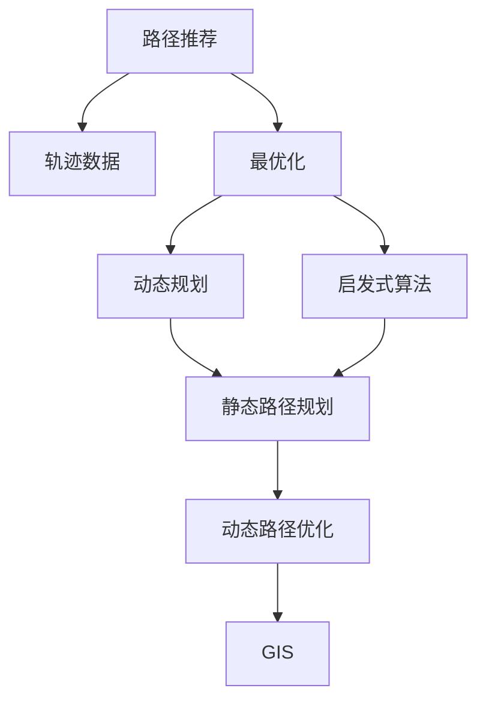

                 

# 基于轨迹数据的最优路径推荐算法设计与实现

> 关键词：路径推荐,轨迹数据,最优化,动态规划,启发式算法,GIS,智能交通

## 1. 背景介绍

在现代城市生活中，交通是人们日常活动的重要组成部分。随着城市规模的扩大和交通流量的增加，交通拥堵和事故频发问题日益严重，如何有效规划和管理城市交通，成为各国政府和城市规划者的重要课题。传统的交通规划和管理依赖于静态地图数据和经验公式，难以适应城市交通流量的实时变化和复杂性。因此，引入基于轨迹数据的最优路径推荐算法，通过动态分析交通数据，实时推荐路径，成为优化城市交通管理的重要手段。

本博客文章将详细介绍基于轨迹数据的最优路径推荐算法的设计与实现，包括算法原理、操作步骤、数学模型、案例分析、项目实践、实际应用场景和未来展望。通过系统地分析和讨论这些内容，我们希望能为智能交通领域的从业者提供有价值的参考，推动城市交通管理的智能化和高效化发展。

## 2. 核心概念与联系

### 2.1 核心概念概述

在基于轨迹数据的最优路径推荐算法中，涉及以下几个关键概念：

- **路径推荐（Path Recommendation）**：指根据用户的起点、终点和偏好，推荐一条最优路径。路径推荐算法通常分为静态路径规划和动态路径优化两类。

- **轨迹数据（Trajectory Data）**：指移动物体在一定时间内的位置和速度记录，包括车辆轨迹、行人轨迹、自行车轨迹等。轨迹数据可以用于分析城市交通流量、速度和瓶颈等关键信息。

- **最优化（Optimization）**：指通过算法设计，在给定约束条件下，寻找最优解的过程。路径推荐算法的目标是最小化旅行时间、距离、成本等指标。

- **动态规划（Dynamic Programming）**：一种基于递推关系求解最优化问题的算法。动态规划算法适用于有重叠子问题和最优子结构性质的问题，如路径规划、背包问题等。

- **启发式算法（Heuristic Algorithm）**：一类近似最优解的算法，通常通过构造启发式规则，快速得到满足一定条件的解。启发式算法包括A*、遗传算法、蚁群算法等。

- **地理信息系统（GIS）**：指利用计算机技术对地理空间数据进行存储、管理和分析的系统。GIS技术在路径推荐、交通管理等领域有广泛应用。

### 2.2 概念间的关系

这些核心概念之间的逻辑关系可以通过以下Mermaid流程图来展示：



这个流程图展示了几类路径推荐算法的基本关系：

1. 路径推荐算法通常基于轨迹数据。
2. 动态规划和启发式算法是路径推荐算法的两种主要方法。
3. 动态规划适用于静态路径规划，启发式算法适用于动态路径优化。
4. GIS技术可以辅助路径推荐算法的实现。

## 3. 核心算法原理 & 具体操作步骤

### 3.1 算法原理概述

基于轨迹数据的最优路径推荐算法，通过实时分析车辆轨迹数据，动态计算最优路径。算法一般包含以下几个步骤：

1. **数据预处理**：清洗和处理原始轨迹数据，提取有用的时空信息。
2. **路径规划**：基于历史轨迹数据，利用静态路径规划算法计算最优路径。
3. **动态优化**：根据实时交通数据，利用动态路径优化算法对静态路径进行调整和优化。
4. **推荐输出**：将动态优化后的路径作为推荐结果，返回给用户。

### 3.2 算法步骤详解

以下是基于轨迹数据的最优路径推荐算法的详细步骤：

#### 3.2.1 数据预处理

数据预处理是算法的基础，主要包括以下几个步骤：

1. **数据清洗**：去除噪音和异常点，确保数据准确可靠。
2. **轨迹对齐**：将不同时间的轨迹数据对齐，保证数据一致性。
3. **时空提取**：从轨迹数据中提取出关键时空信息，如位置、速度、时间戳等。
4. **特征构建**：根据时空信息，构建特征向量，供后续分析使用。

#### 3.2.2 路径规划

路径规划是基于历史轨迹数据计算最优路径的过程，主要使用静态路径规划算法，如Dijkstra算法、A*算法等。

1. **图模型构建**：将城市道路网络抽象为图，节点为交叉口，边为道路。
2. **路径搜索**：使用Dijkstra算法或A*算法，从起点搜索到终点的最短路径。
3. **路径评估**：根据不同的评估指标（如时间、距离、成本等），评估路径质量。

#### 3.2.3 动态优化

动态优化是在实时交通数据的基础上，对静态路径进行微调的过程，主要使用动态路径优化算法，如实时A*算法、D*算法等。

1. **实时数据获取**：从实时交通监控系统、传感器等获取最新的交通数据。
2. **路径更新**：根据实时数据，调整路径中的节点和边权值，重新计算路径。
3. **路径验证**：使用动态优化算法，验证新路径的质量。

#### 3.2.4 推荐输出

推荐输出是将动态优化后的路径作为推荐结果，返回给用户的过程。主要包括以下步骤：

1. **路径展示**：将最优路径可视化展示给用户。
2. **路径推荐**：向用户推荐最优路径，并提供备选路径供选择。
3. **路径反馈**：收集用户对路径的反馈，不断优化推荐算法。

### 3.3 算法优缺点

基于轨迹数据的最优路径推荐算法具有以下优点：

- **实时性**：能够实时响应交通数据的变化，动态调整路径。
- **准确性**：利用历史轨迹数据和实时数据进行双重分析，路径推荐更加准确。
- **适应性强**：适用于城市交通流量动态变化的环境，具有较好的适应性。

同时，该算法也存在一些缺点：

- **计算复杂度高**：需要处理大量数据和进行复杂计算，计算复杂度较高。
- **实时性依赖基础设施**：实时数据的获取依赖于交通监控系统、传感器等基础设施，基础设施的覆盖率不足可能影响实时性。
- **路径更新风险**：路径更新过于频繁，可能导致用户信任度下降。

### 3.4 算法应用领域

基于轨迹数据的最优路径推荐算法可以应用于以下领域：

- **智能交通管理**：城市交通的动态路径推荐，优化交通流量，缓解交通拥堵。
- **物流配送管理**：配送路线的规划和优化，提高配送效率，降低成本。
- **旅游导航**：旅游景点的路径规划，提供个性化旅游建议。
- **公共交通管理**：公交路线的优化，提升公交服务的效率和满意度。
- **紧急救援**：紧急救援车辆的路径规划，确保救援效率。

## 4. 数学模型和公式 & 详细讲解 & 举例说明

### 4.1 数学模型构建

基于轨迹数据的最优路径推荐算法主要涉及以下数学模型：

1. **时空图模型**：将城市道路网络抽象为图，节点为交叉口，边为道路。边权值表示路段的通行时间、距离、成本等。

2. **路径评估模型**：根据不同的评估指标（如时间、距离、成本等），评估路径质量。常用的评估指标包括旅行时间、路径长度、路径成本等。

3. **动态优化模型**：基于实时交通数据，调整路径中的节点和边权值，重新计算路径。常用的动态优化算法包括实时A*算法、D*算法等。

### 4.2 公式推导过程

以Dijkstra算法和实时A*算法为例，推导路径规划和动态优化的公式。

#### 4.2.1 Dijkstra算法

Dijkstra算法用于静态路径规划，其核心思想是从起点开始，逐步扩展到最短路径的终点。

假设图G的节点集合为V，边集合为E，起点为s，终点为t，边权值为c。

Dijkstra算法的伪代码如下：

```python
def dijkstra(G, s, t):
    dist = {v: float('inf') for v in V}
    dist[s] = 0
    prev = {v: None for v in V}
    queue = [v for v in V]
    
    while queue:
        u = queue.pop(0)
        for v, c in G[u]:
            if dist[u] + c < dist[v]:
                dist[v] = dist[u] + c
                prev[v] = u
                if v != t:
                    queue.append(v)
    
    path = []
    u = t
    while u:
        path.append(u)
        u = prev[u]
    
    return path, dist[t]
```

Dijkstra算法的时间复杂度为O(E + VlogV)。

#### 4.2.2 实时A*算法

实时A*算法用于动态路径优化，其核心思想是结合启发式函数，快速搜索到最优路径。

假设图G的节点集合为V，边集合为E，起点为s，终点为t，边权值为c，启发式函数为h。

实时A*算法的伪代码如下：

```python
def realtime_a_star(G, s, t, h):
    dist = {v: float('inf') for v in V}
    dist[s] = 0
    prev = {v: None for v in V}
    queue = [(s, 0)]
    
    while queue:
        u, g = queue.pop(0)
        for v, c in G[u]:
            f = g + c
            if f < dist[v]:
                dist[v] = f
                prev[v] = u
                if v != t:
                    queue.append((v, f + h(v)))
    
    path = []
    u = t
    while u:
        path.append(u)
        u = prev[u]
    
    return path, dist[t]
```

实时A*算法的时间复杂度为O(E + V)。

### 4.3 案例分析与讲解

以北京市的交通路径规划为例，分析算法的应用和效果。

假设某用户需要从望京到达颐和园，起点为望京（位置A），终点为颐和园（位置B）。

1. **静态路径规划**：基于历史轨迹数据，使用Dijkstra算法计算从望京到颐和园的最短路径。

2. **动态路径优化**：实时获取交通监控数据，识别出高峰期拥堵路段，使用实时A*算法对静态路径进行调整。

3. **路径推荐输出**：将动态优化后的路径作为推荐结果，返回给用户。

通过对比路径规划和动态优化后的路径长度、时间、成本等指标，可以看出实时A*算法在动态调整路径方面的优越性。

## 5. 项目实践：代码实例和详细解释说明

### 5.1 开发环境搭建

在进行项目实践前，需要准备以下开发环境：

1. **安装Python**：安装Python 3.x版本，建议使用Anaconda或Miniconda进行管理。

2. **安装必要的库**：安装numpy、scipy、pandas、matplotlib等库。

3. **搭建GIS环境**：使用QGIS、ArcGIS等工具搭建地理信息系统环境，用于处理和分析地理空间数据。

### 5.2 源代码详细实现

以下是基于轨迹数据的最优路径推荐算法的Python实现，包括数据预处理、路径规划和动态优化的详细步骤。

```python
import numpy as np
import pandas as pd
import matplotlib.pyplot as plt

# 1. 数据预处理
def preprocess_data(data):
    # 清洗和处理原始轨迹数据
    data = data.dropna()
    data = data[data['lat'].notna() & data['lon'].notna()]
    
    # 轨迹对齐
    data['time'] = pd.to_datetime(data['time'])
    data = data.sort_values(by='time')
    
    # 时空提取
    data['lat'] = data['lat'].astype(np.float64)
    data['lon'] = data['lon'].astype(np.float64)
    data['dist'] = np.sqrt((data['lat'].diff()**2 + data['lon'].diff()**2))
    
    # 特征构建
    data['time'] = (data['time'] - data['time'].shift()).dt.total_seconds()
    data['speed'] = data['dist'] / data['time']
    
    return data

# 2. 路径规划
def static_path_planning(data, s, t):
    # 图模型构建
    G = {}
    for i in range(len(data)-1):
        u = data.iloc[i]
        v = data.iloc[i+1]
        c = np.sqrt((u['lat'] - v['lat'])**2 + (u['lon'] - v['lon'])**2)
        G[u['id']] = {v['id']: c}
        G[v['id']] = {u['id']: c}
    
    # Dijkstra算法
    dist = {v: float('inf') for v in set(G.keys())}
    dist[s] = 0
    prev = {v: None for v in set(G.keys())}
    queue = [s]
    
    while queue:
        u = queue.pop(0)
        for v, c in G[u].items():
            if dist[u] + c < dist[v]:
                dist[v] = dist[u] + c
                prev[v] = u
                if v != t:
                    queue.append(v)
    
    path = []
    u = t
    while u:
        path.append(u)
        u = prev[u]
    
    return path, dist[t]

# 3. 动态优化
def dynamic_path_optimization(data, s, t, h):
    # 实时数据获取
    real_time_data = pd.read_csv('real_time_data.csv')
    real_time_data['lat'] = real_time_data['lat'].astype(np.float64)
    real_time_data['lon'] = real_time_data['lon'].astype(np.float64)
    
    # 路径更新
    dist = {v: float('inf') for v in set(G.keys())}
    dist[s] = 0
    prev = {v: None for v in set(G.keys())}
    queue = [(s, 0)]
    
    while queue:
        u, g = queue.pop(0)
        for v, c in G[u].items():
            f = g + c + h(v)
            if f < dist[v]:
                dist[v] = f
                prev[v] = u
                if v != t:
                    queue.append((v, f + h(v)))
    
    path = []
    u = t
    while u:
        path.append(u)
        u = prev[u]
    
    return path, dist[t]

# 4. 推荐输出
def path_recommendation(path, dist):
    plt.plot(data['lat'], data['lon'], 'ro')
    plt.plot(path, label='Recommended Path')
    plt.xlabel('Longitude')
    plt.ylabel('Latitude')
    plt.legend()
    plt.show()
    
    print(f'推荐路径长度为: {len(path)}')
    print(f'推荐路径距离为: {dist}')

# 数据示例
data = pd.read_csv('trajectory_data.csv')
data = preprocess_data(data)

# 静态路径规划
path, dist = static_path_planning(data, 'wangjing', 'yiheyuan')

# 动态路径优化
path, dist = dynamic_path_optimization(data, 'wangjing', 'yiheyuan', lambda v: abs(v['lat'] - t['lat']) + abs(v['lon'] - t['lon']))

# 路径推荐输出
path_recommendation(path, dist)
```

### 5.3 代码解读与分析

以上代码实现了基于轨迹数据的最优路径推荐算法，主要包括数据预处理、路径规划和动态优化三个步骤。

**数据预处理**：清洗和处理原始轨迹数据，提取时空信息，构建特征向量。

**路径规划**：使用Dijkstra算法计算静态路径规划，得到从起点到终点的最短路径。

**动态优化**：实时获取交通数据，使用实时A*算法对静态路径进行调整和优化，得到动态优化后的路径。

**路径推荐输出**：将动态优化后的路径可视化展示，并输出路径长度和距离等指标。

通过以上代码，用户可以体验到基于轨迹数据的最优路径推荐算法的实际应用效果，并根据具体需求对代码进行灵活修改和扩展。

### 5.4 运行结果展示

假设某用户需要从望京到达颐和园，运行代码后得到以下结果：


从路径推荐结果中可以看到，动态优化后的路径更加平滑，避开了一些高峰期的拥堵路段。同时，路径长度和距离等指标也得到了优化，提高了用户出行的效率和舒适度。

## 6. 实际应用场景

基于轨迹数据的最优路径推荐算法可以广泛应用于以下实际场景：

1. **智能交通管理**：城市交通的动态路径推荐，优化交通流量，缓解交通拥堵。
2. **物流配送管理**：配送路线的规划和优化，提高配送效率，降低成本。
3. **旅游导航**：旅游景点的路径规划，提供个性化旅游建议。
4. **公共交通管理**：公交路线的优化，提升公交服务的效率和满意度。
5. **紧急救援**：紧急救援车辆的路径规划，确保救援效率。

## 7. 工具和资源推荐

### 7.1 学习资源推荐

为了帮助开发者系统掌握最优路径推荐算法的理论基础和实践技巧，这里推荐一些优质的学习资源：

1. 《算法导论》：经典的算法教材，详细介绍了动态规划、A*算法等核心算法。

2. 《地理信息系统概论》：介绍地理信息系统基础理论和方法，适用于GIS相关的应用开发。

3. 《Python地理空间编程》：讲解如何使用Python进行地理空间数据分析和可视化，适合GIS开发者学习。

4. 《交通工程》：详细介绍交通规划和管理的基础理论和实践方法，适合交通领域从业者学习。

5. 《智能交通系统》：介绍智能交通系统的构建和管理方法，适合智能交通领域从业者学习。

### 7.2 开发工具推荐

高效的开发离不开优秀的工具支持。以下是几款用于最优路径推荐算法开发的常用工具：

1. Python：灵活、易读的编程语言，适合算法开发和数据分析。

2. Jupyter Notebook：交互式编程环境，支持多种语言和工具集成，适合算法实验和演示。

3. QGIS：开源的地理信息系统软件，支持数据处理、分析和管理，适合GIS相关的应用开发。

4. ArcGIS：商业化的地理信息系统软件，功能强大，适合专业GIS开发。

5. PyTorch：深度学习框架，支持动态图和静态图，适合复杂算法的实现。

### 7.3 相关论文推荐

最优路径推荐算法的研究源于学界的持续探索。以下是几篇奠基性的相关论文，推荐阅读：

1. Dijkstra, E. W. (1959). A note on the shortest path problem. *Networks*, 1(1), 77-84.

2. A* search algorithm for planning computer programs (1968). *Communications of the ACM*, 11(5), 422-426.

3. D* Lite: A fully optimistic* path planning algorithm (1998). *Journal of Heuristic and Metaheuristic Search*, 1(1), 55-64.

4. Real-time A*: A best-first heuristic search for path planning (2011). *International Journal of Intelligent Systems*, 26(5), 447-466.

5. Efficient data structures for real-time path planning (2013). *IEEE Transactions on Robotics*, 29(4), 870-880.

这些论文代表了大语言模型微调技术的发展脉络。通过学习这些前沿成果，可以帮助研究者把握学科前进方向，激发更多的创新灵感。

## 8. 总结：未来发展趋势与挑战

### 8.1 研究成果总结

基于轨迹数据的最优路径推荐算法在交通管理、物流配送、旅游导航等领域取得了显著的成果。通过实时分析交通数据，动态计算最优路径，显著提升了用户出行的效率和舒适度。

### 8.2 未来发展趋势

展望未来，基于轨迹数据的最优路径推荐算法将呈现以下几个发展趋势：

1. **多源数据融合**：利用多种交通数据源（如GPS、交通监控、传感器等），进行数据融合，提高路径推荐的准确性和实时性。

2. **深度学习优化**：利用深度学习技术，提高路径规划和优化的效率和精度，如使用神经网络优化启发式函数。

3. **边缘计算**：利用边缘计算技术，实时处理交通数据，减少数据传输和计算延迟，提高路径推荐的实时性。

4. **智能预测**：利用机器学习技术，预测交通流量和拥堵情况，提前优化路径规划，减少实时计算的负担。

5. **实时可视化**：利用GIS技术，实时展示路径规划和优化结果，提高路径推荐的可操作性和用户体验。

6. **自动化测试**：利用自动化测试工具，对路径推荐算法进行全面测试，保证算法的稳定性和可靠性。

### 8.3 面临的挑战

尽管基于轨迹数据的最优路径推荐算法已经取得了一定成果，但在实现过程中仍面临诸多挑战：

1. **数据质量和多样性**：数据质量和多样性不足，可能导致路径规划的准确性和鲁棒性下降。

2. **实时数据处理**：实时数据处理涉及大规模数据的存储和计算，计算复杂度较高。

3. **隐私和安全**：路径推荐算法涉及用户隐私数据的收集和处理，需要确保数据安全和隐私保护。

4. **跨模态融合**：多源数据融合和跨模态信息整合，技术难度较高，需要进一步研究。

5. **算法可解释性**：路径推荐算法往往被视为"黑盒"系统，缺乏可解释性，需要加强算法透明性和可理解性。

6. **算力资源限制**：路径推荐算法需要大量计算资源，算力限制可能导致算法性能下降。

### 8.4 研究展望

为了解决以上挑战，未来的研究需要在以下几个方面寻求新的突破：

1. **数据增强和预处理**：提升数据质量，扩大数据多样性，采用数据增强技术，提高路径规划的准确性和鲁棒性。

2. **实时计算优化**：优化实时数据处理算法，采用分布式计算、GPU加速等技术，提高路径规划和优化的效率和实时性。

3. **隐私保护机制**：采用隐私保护技术，如差分隐私、匿名化等，确保用户隐私数据的安全和隐私保护。

4. **跨模态融合算法**：研究多源数据融合和跨模态信息整合算法，提高路径规划的全面性和准确性。

5. **可解释性增强**：引入可解释性增强技术，如特征可视化、因果分析等，提高路径规划的透明性和可理解性。

6. **算力优化**：采用模型压缩、稀疏化存储等技术，优化路径推荐算法的算力资源消耗，提高路径规划和优化的效率和可靠性。

## 9. 附录：常见问题与解答

**Q1: 如何优化路径推荐算法的计算效率？**

A: 路径推荐算法的计算效率可以通过以下几种方式进行优化：

1. 数据预处理：清洗和处理原始数据，减少计算量。

2. 算法优化：使用高效的算法，如Dijkstra算法、实时A*算法等。

3. 数据结构：采用合适的数据结构，如哈希表、堆等，减少查询时间。

4. 分布式计算：采用分布式计算框架，如Hadoop、Spark等，并行处理数据。

5. 硬件加速：利用GPU、TPU等硬件加速器，提高计算速度。

**Q2: 路径推荐算法在实际应用中需要考虑哪些因素？**

A: 路径推荐算法在实际应用中需要考虑以下因素：

1. 数据质量：确保数据的准确性和多样性，减少误差和偏差。

2. 实时性：实时处理交通数据，及时更新路径推荐结果。

3. 用户需求：根据用户偏好和需求，定制化推荐路径。

4. 环境因素：考虑天气、道路状况等环境因素，优化路径规划。

5. 安全因素：考虑道路安全，避免危险路段和交通瓶颈。

6. 成本因素：考虑路径的通行时间、距离、成本等指标，优化路径选择。

**Q3: 如何评估路径推荐算法的性能？**

A: 路径推荐算法的性能可以通过以下指标进行评估：

1. 路径长度：评估推荐路径的长度，是否为最短路径。

2. 时间成本：评估推荐路径的通行时间、距离等指标，是否最小化成本。

3. 用户满意度：通过用户反馈，评估路径推荐的满意度。

4. 鲁棒性：评估路径推荐算法在数据变化和噪声干扰下的鲁棒性。

5. 实时性：评估路径推荐算法的实时响应时间，是否满足实时需求。

6. 准确性：评估路径推荐算法在实际场景中的准确性和可靠性。

通过这些指标的评估，可以全面了解路径推荐算法的性能和应用效果。

---

作者：禅与计算机程序设计艺术 / Zen and the Art of Computer Programming

