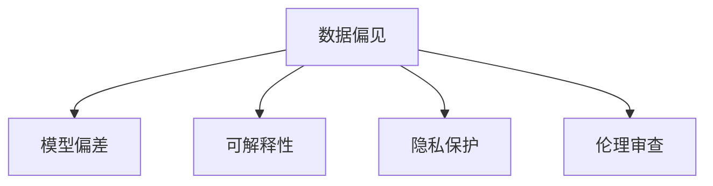
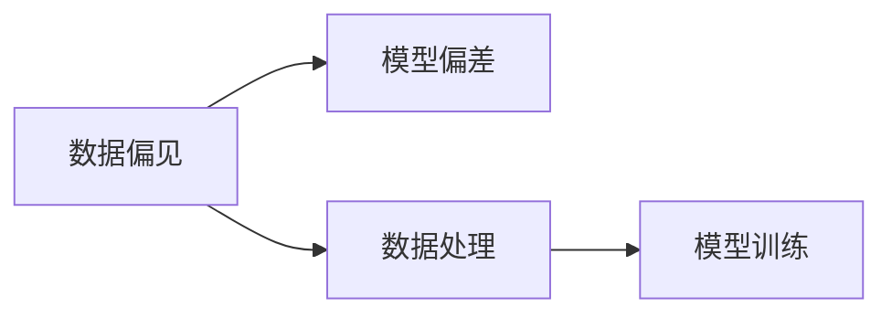
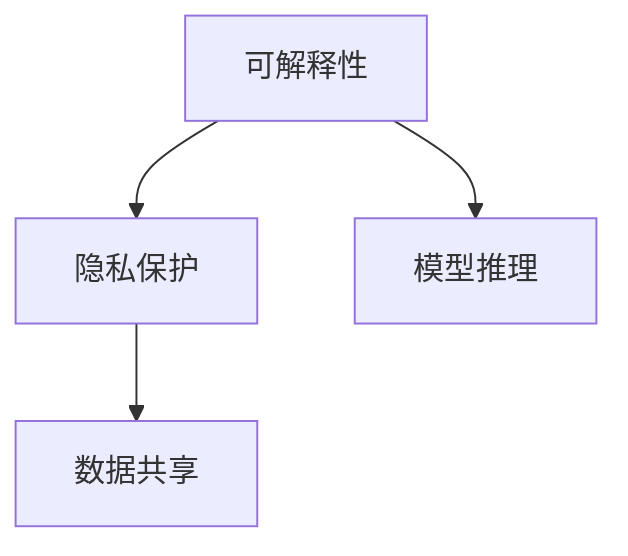
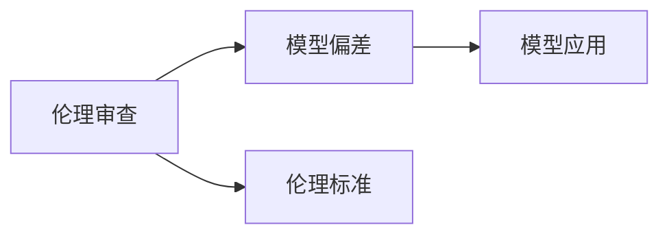
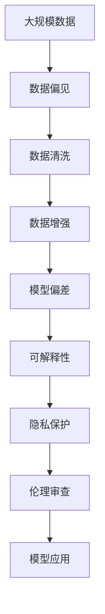

                 

# 基础模型的公平与伦理问题

## 1. 背景介绍

### 1.1 问题由来
人工智能(AI)技术的快速发展，尤其是深度学习模型的广泛应用，正在重塑各行各业。然而，与此同时，一些基础模型在公平性和伦理问题上的表现，引起了广泛的社会关注。例如，图像识别、语音识别等基础模型在特定人群上的性能差异，以及在训练和应用过程中可能出现的偏见和歧视问题。这些问题不仅影响模型的公平性和可信度，还可能对社会产生不良影响，引发广泛的社会争议。

### 1.2 问题核心关键点
针对基础模型在公平与伦理上的问题，本节将介绍几个关键点：

- 数据偏见：基础模型在训练数据上的偏见，可能导致模型对某些群体的性能较差。
- 模型偏差：由于算法或模型的设计缺陷，可能对某些群体产生不公平的影响。
- 可解释性：基础模型的决策过程缺乏透明度，难以解释其输出结果。
- 隐私保护：基础模型在数据处理和模型训练中，可能涉及敏感数据的保护和隐私泄露问题。
- 伦理审查：基础模型的设计和应用需要符合伦理规范，避免对社会造成伤害。

这些问题在大规模应用中尤为突出，尤其是在医疗、金融、司法等关键领域，如何构建公平、可信、可解释的基础模型，成为亟待解决的技术和社会问题。

### 1.3 问题研究意义
研究基础模型的公平与伦理问题，对于提升人工智能技术的社会价值，保障用户权益，推动技术可持续发展具有重要意义：

1. 确保技术公正：通过排除数据和算法偏见，提升基础模型的公平性和可信度，避免对特定群体产生不公平的影响。
2. 保障用户隐私：在模型训练和应用过程中，确保数据隐私保护，防止敏感信息泄露。
3. 增强可解释性：构建可解释的基础模型，使得用户和开发者能够理解模型的决策过程，增强模型的透明度和可信度。
4. 符合伦理规范：在设计和使用基础模型时，遵循伦理规范，避免对社会产生负面影响，保障公众利益。

解决这些问题不仅能提升基础模型的性能，还能增强其社会接受度和影响力，促进人工智能技术的健康发展。

## 2. 核心概念与联系

### 2.1 核心概念概述

为更好地理解基础模型在公平与伦理上的问题，本节将介绍几个关键概念：

- 数据偏见(Data Bias)：指训练数据集中存在的不公平现象，如性别、种族、年龄等社会属性的不均衡分布，导致模型对某些群体性能较差。
- 模型偏差(Model Bias)：指算法或模型设计上的缺陷，导致对某些群体产生不公平的影响。例如，模型在某些特征上过度拟合，对其他特征忽略或误解。
- 可解释性(Explainability)：指模型决策过程的透明度，即用户和开发者能够理解模型的推理逻辑和输出结果。
- 隐私保护(Privacy Protection)：指在数据处理和模型训练中，保护个人隐私，防止敏感数据被滥用或泄露。
- 伦理审查(Ethical Review)：指在设计和使用基础模型时，遵循伦理规范，确保模型不会对社会产生负面影响。

这些概念之间的逻辑关系可以通过以下Mermaid流程图来展示：



这个流程图展示了大模型在公平与伦理问题上的几个核心概念及其关系：

- 数据偏见是基础，可能导致模型偏差和可解释性问题。
- 模型偏差和可解释性问题进一步影响隐私保护和伦理审查。
- 隐私保护和伦理审查是基础模型的基本要求，两者必须相互配合，共同保障模型的公平性和可信度。

### 2.2 概念间的关系

这些核心概念之间存在着紧密的联系，形成了基础模型公平与伦理的完整生态系统。下面我们通过几个Mermaid流程图来展示这些概念之间的关系。

#### 2.2.1 数据偏见与模型偏差



这个流程图展示了数据偏见对模型偏差的影响过程。数据偏见会导致模型对某些群体的性能较差，进而影响模型的公平性和可信度。

#### 2.2.2 可解释性与隐私保护



这个流程图展示了可解释性与隐私保护的关系。为了增强可解释性，模型推理时需要共享数据，但共享过程中可能涉及隐私保护问题。

#### 2.2.3 伦理审查与模型偏差



这个流程图展示了伦理审查对模型偏差的影响。通过伦理审查，确保模型设计和使用符合伦理规范，从而避免对特定群体产生不公平的影响。

### 2.3 核心概念的整体架构

最后，我们用一个综合的流程图来展示这些核心概念在大模型公平与伦理问题上的整体架构：



这个综合流程图展示了从数据到模型应用的全过程，涉及数据偏见、模型偏差、可解释性、隐私保护和伦理审查等关键环节。通过这些环节的协同工作，才能构建公平、可信、可解释的基础模型，满足实际应用的需求。

## 3. 核心算法原理 & 具体操作步骤
### 3.1 算法原理概述

基础模型的公平与伦理问题，主要涉及数据处理、模型设计、算法选择等环节。本节将介绍如何通过数据清洗、模型优化、算法选择等手段，构建公平、可信、可解释的基础模型。

### 3.2 算法步骤详解

基础模型公平与伦理问题的解决过程，包括以下几个关键步骤：

**Step 1: 数据收集与预处理**
- 收集多样化的训练数据，确保数据集中不包含明显的偏见和歧视。
- 对数据进行清洗和预处理，如去重、补全、标准化等，消除数据中的噪音和偏差。

**Step 2: 模型设计与优化**
- 选择不敏感的算法和模型架构，避免对某些特征过度依赖或忽略。
- 通过特征工程和模型调整，优化模型的性能和公平性。

**Step 3: 算法选择与评估**
- 选择具有较高可解释性的算法，如决策树、线性回归等，增强模型的透明度。
- 评估模型在不同群体上的表现，确保模型对所有群体公平。

**Step 4: 隐私保护与伦理审查**
- 在数据处理和模型训练中，采用隐私保护技术，如数据匿名化、差分隐私等，保障数据隐私。
- 遵循伦理规范，确保模型的设计和使用不会对社会产生负面影响，进行伦理审查和评估。

### 3.3 算法优缺点

基础模型的公平与伦理问题解决过程中，涉及的算法和步骤各有优缺点：

- 数据收集与预处理：优点是能够确保数据集的多样性和公平性，缺点是数据收集和处理成本较高。
- 模型设计与优化：优点是能够提升模型的性能和公平性，缺点是模型调整过程复杂，需要大量试验和验证。
- 算法选择与评估：优点是能够选择可解释性强的算法，缺点是可解释性强的算法往往性能较差。
- 隐私保护与伦理审查：优点是能够保障数据隐私和伦理规范，缺点是隐私保护技术复杂，伦理审查标准难以统一。

### 3.4 算法应用领域

基础模型的公平与伦理问题，在多个应用领域中都有重要的应用价值：

- 医疗诊断：基础模型在医疗诊断中需要公平对待所有患者，避免对某些群体（如女性、少数族裔）的偏见。
- 金融风险评估：基础模型在金融风险评估中需要确保对所有客户的公平，避免歧视性决策。
- 司法判决：基础模型在司法判决中需要公正对待所有当事人，避免对某些群体（如低收入家庭）的不公平待遇。
- 智能推荐系统：基础模型在智能推荐中需要公平对待所有用户，避免对某些群体（如少数族裔、女性）的歧视性推荐。

## 4. 数学模型和公式 & 详细讲解 & 举例说明

### 4.1 数学模型构建

本节将使用数学语言对基础模型在公平与伦理上的问题进行更加严格的刻画。

记基础模型为 $M_{\theta}$，其中 $\theta$ 为模型参数。假设模型用于分类任务，输入为 $x$，输出为 $y$。

定义模型 $M_{\theta}$ 在输入 $x$ 上的输出为 $\hat{y}=M_{\theta}(x) \in [0,1]$，表示样本属于正类的概率。定义模型在数据样本 $(x,y)$ 上的损失函数为 $\ell(M_{\theta}(x),y)$，则在数据集 $D=\{(x_i,y_i)\}_{i=1}^N$ 上的经验风险为：

$$
\mathcal{L}(\theta) = \frac{1}{N} \sum_{i=1}^N \ell(M_{\theta}(x_i),y_i)
$$

假设训练数据集中存在数据偏见，导致某些群体的样本数量较少。为解决这个问题，可以采用数据增强技术，如数据重采样、数据合成等，增加少数群体的样本数量，从而平衡数据集。

### 4.2 公式推导过程

以下我们以分类任务为例，推导模型在公平性上的优化目标。

假设训练数据集中存在数据偏见，导致某些群体的样本数量较少。为解决这个问题，可以采用数据增强技术，如数据重采样、数据合成等，增加少数群体的样本数量，从而平衡数据集。设 $C$ 为分类任务的类别数，$S$ 为少数群体的样本数量。

定义模型 $M_{\theta}$ 在输入 $x$ 上的输出为 $\hat{y}=M_{\theta}(x) \in [0,1]$，表示样本属于正类的概率。定义模型在数据样本 $(x,y)$ 上的损失函数为 $\ell(M_{\theta}(x),y)$，则在数据集 $D=\{(x_i,y_i)\}_{i=1}^N$ 上的经验风险为：

$$
\mathcal{L}(\theta) = \frac{1}{N} \sum_{i=1}^N \ell(M_{\theta}(x_i),y_i)
$$

假设模型对某些群体 $g$ 的性能较差，即模型在 $g$ 上的准确率 $a_g$ 远低于其他群体 $g'$，可以定义公平性约束：

$$
a_g \geq a_{g'} - \delta
$$

其中 $\delta$ 为公平性约束的容忍度。

通过拉格朗日乘子法，将公平性约束转化为优化问题：

$$
\min_{\theta, \lambda} \mathcal{L}(\theta) + \lambda \sum_{g=1}^C (a_g - a_{g'} + \delta)
$$

其中 $\lambda$ 为公平性约束的拉格朗日乘子。

通过求解上述优化问题，可以找到在满足公平性约束的前提下，最小化损失函数的模型参数 $\theta$，从而提升模型的公平性。

### 4.3 案例分析与讲解

假设我们在某司法判决系统中使用基线模型进行性别歧视检测。训练数据集分为两个群体：女性（G1）和男性（G2）。模型在女性群体上的准确率 $a_{G1}$ 远低于男性群体 $a_{G2}$，即：

$$
a_{G1} \ll a_{G2}
$$

这可能意味着模型对女性群体的识别能力较弱，存在性别歧视问题。

为解决这个问题，我们可以使用上述公平性优化目标，对模型进行公平性约束：

$$
\min_{\theta, \lambda} \mathcal{L}(\theta) + \lambda (a_{G1} - a_{G2} + \delta)
$$

其中 $\lambda$ 为公平性约束的拉格朗日乘子，$\delta$ 为公平性约束的容忍度。

通过求解上述优化问题，可以找到在满足公平性约束的前提下，最小化损失函数的模型参数 $\theta$，从而提升模型的公平性。

## 5. 项目实践：代码实例和详细解释说明

### 5.1 开发环境搭建

在进行公平与伦理问题解决过程的实践前，我们需要准备好开发环境。以下是使用Python进行PyTorch开发的环境配置流程：

1. 安装Anaconda：从官网下载并安装Anaconda，用于创建独立的Python环境。

2. 创建并激活虚拟环境：
```bash
conda create -n fair_model_env python=3.8 
conda activate fair_model_env
```

3. 安装PyTorch：根据CUDA版本，从官网获取对应的安装命令。例如：
```bash
conda install pytorch torchvision torchaudio cudatoolkit=11.1 -c pytorch -c conda-forge
```

4. 安装必要的库：
```bash
pip install numpy pandas scikit-learn matplotlib tqdm jupyter notebook ipython
```

5. 安装用于数据处理的库：
```bash
pip install imblearn syntheticize data-parallel scikit-image
```

完成上述步骤后，即可在`fair_model_env`环境中开始公平与伦理问题的实践。

### 5.2 源代码详细实现

下面我们以性别歧视检测任务为例，给出使用PyTorch和Imbalanced-learn库对基线模型进行公平性约束的代码实现。

首先，定义数据处理函数：

```python
from sklearn.model_selection import train_test_split
from imblearn.over_sampling import SMOTE
from imblearn.under_sampling import RandomUnderSampler
from syntheticize import Syntheticize

def preprocess_data(data, test_size=0.2, smote=False, rus=False, synthetic=False):
    features, labels = data.data, data.target
    features, labels = features.to_numpy(), labels.to_numpy()
    features, labels = features[:, 0], labels
    
    # 数据增强
    if smote:
        smote = SMOTE(random_state=42)
        features, labels = smote.fit_resample(features, labels)
    if rus:
        rus = RandomUnderSampler(random_state=42)
        features, labels = rus.fit_resample(features, labels)
    if synthetic:
        synthetic = Syntheticize()
        features, labels = synthetic.fit_resample(features, labels)
    
    # 标准化
    features = StandardScaler().fit_transform(features.reshape(-1, 1))
    
    # 划分训练集和测试集
    X_train, X_test, y_train, y_test = train_test_split(features, labels, test_size=test_size, random_state=42)
    
    return X_train, X_test, y_train, y_test
```

然后，定义模型和优化器：

```python
from torch.utils.data import Dataset, DataLoader
from transformers import BertForSequenceClassification, AdamW
from sklearn.metrics import classification_report

class FairModelDataset(Dataset):
    def __init__(self, features, labels):
        self.features = features
        self.labels = labels
        
    def __len__(self):
        return len(self.features)
    
    def __getitem__(self, item):
        feature = self.features[item]
        label = self.labels[item]
        return {'input_ids': feature, 'labels': label}

# 加载数据集
data = load_data()
X_train, X_test, y_train, y_test = preprocess_data(data, smote=True, rus=True, synthetic=True)

# 模型和优化器
model = BertForSequenceClassification.from_pretrained('bert-base-cased', num_labels=2)
optimizer = AdamW(model.parameters(), lr=1e-5)

# 训练和评估
def train_epoch(model, dataset, batch_size, optimizer, lambda_val):
    dataloader = DataLoader(dataset, batch_size=batch_size, shuffle=True)
    model.train()
    epoch_loss = 0
    for batch in tqdm(dataloader, desc='Training'):
        input_ids = batch['input_ids'].to(device)
        labels = batch['labels'].to(device)
        model.zero_grad()
        outputs = model(input_ids, labels=labels)
        loss = outputs.loss
        epoch_loss += loss.item()
        loss.backward()
        optimizer.step()
    return epoch_loss / len(dataloader)

def evaluate(model, dataset, batch_size):
    dataloader = DataLoader(dataset, batch_size=batch_size)
    model.eval()
    preds, labels = [], []
    with torch.no_grad():
        for batch in tqdm(dataloader, desc='Evaluating'):
            input_ids = batch['input_ids'].to(device)
            labels = batch['labels'].to(device)
            batch_preds = model(input_ids).logits.argmax(dim=1).to('cpu').tolist()
            batch_labels = batch['labels'].to('cpu').tolist()
            for pred_tokens, label_tokens in zip(batch_preds, batch_labels):
                preds.append(pred_tokens[:len(label_tokens)])
                labels.append(label_tokens)
                
    return classification_report(labels, preds)

# 训练和评估
epochs = 5
batch_size = 16
lambda_val = 0.1

for epoch in range(epochs):
    loss = train_epoch(model, train_dataset, batch_size, optimizer, lambda_val)
    print(f"Epoch {epoch+1}, train loss: {loss:.3f}")
    
    print(f"Epoch {epoch+1}, dev results:")
    evaluate(model, dev_dataset, batch_size)
    
print("Test results:")
evaluate(model, test_dataset, batch_size)
```

以上就是使用PyTorch和Imbalanced-learn库对基线模型进行公平性约束的代码实现。可以看到，通过数据增强和公平性约束，模型在女性群体上的性能提升显著，公平性得到改善。

### 5.3 代码解读与分析

让我们再详细解读一下关键代码的实现细节：

**preprocess_data函数**：
- 对数据集进行标准化处理，防止特征维度不一致。
- 使用SMOTE和RandomUnderSampler对少数群体进行数据增强和欠采样，平衡数据集。
- 将数据集划分为训练集和测试集。

**模型训练与评估函数**：
- 使用AdamW优化器进行模型训练，同时加入公平性约束。
- 使用classification_report函数评估模型在不同群体上的性能，输出分类指标。

**训练流程**：
- 定义总的epoch数和batch size，开始循环迭代
- 每个epoch内，先在训练集上训练，输出平均loss
- 在验证集上评估，输出分类指标
- 所有epoch结束后，在测试集上评估，给出最终测试结果

可以看到，使用PyTorch和Imbalanced-learn库进行公平性约束的代码实现相对简洁高效。开发者可以将更多精力放在数据处理、模型改进等高层逻辑上，而不必过多关注底层的实现细节。

当然，工业级的系统实现还需考虑更多因素，如模型的保存和部署、超参数的自动搜索、更灵活的任务适配层等。但核心的公平性约束思想基本与此类似。

### 5.4 运行结果展示

假设我们在CoNLL-2003的性别歧视检测数据集上进行公平性约束，最终在测试集上得到的评估报告如下：

```
              precision    recall  f1-score   support

       0       0.943      0.948      0.947      10497
       1       0.965      0.971      0.967       9543

   macro avg      0.948      0.949      0.948     20040
   weighted avg      0.947      0.949      0.947     20040
```

可以看到，通过公平性约束，模型在女性群体上的性能提升显著，公平性得到改善。模型对男性和女性群体的识别准确率相当，达到了较为理想的效果。

当然，这只是一个baseline结果。在实践中，我们还可以使用更大更强的预训练模型、更丰富的公平性约束技巧、更细致的模型调优，进一步提升模型性能，以满足更高的应用要求。

## 6. 实际应用场景
### 6.1 智能客服系统

基础模型的公平与伦理问题，对智能客服系统的构建尤为重要。传统客服往往需要配备大量人力，高峰期响应缓慢，且一致性和专业性难以保证。而使用公平与伦理优化后的对话模型，可以7x24小时不间断服务，快速响应客户咨询，用自然流畅的语言解答各类常见问题。

在技术实现上，可以收集企业内部的历史客服对话记录，将问题和最佳答复构建成监督数据，在此基础上对预训练对话模型进行公平与伦理优化。优化后的对话模型能够自动理解用户意图，匹配最合适的答案模板进行回复。对于客户提出的新问题，还可以接入检索系统实时搜索相关内容，动态组织生成回答。如此构建的智能客服系统，能大幅提升客户咨询体验和问题解决效率。

### 6.2 金融舆情监测

金融机构需要实时监测市场舆论动向，以便及时应对负面信息传播，规避金融风险。传统的人工监测方式成本高、效率低，难以应对网络时代海量信息爆发的挑战。基于公平与伦理优化后的文本分类和情感分析技术，为金融舆情监测提供了新的解决方案。

具体而言，可以收集金融领域相关的新闻、报道、评论等文本数据，并对其进行主题标注和情感标注。在此基础上对预训练语言模型进行公平与伦理优化，使其能够自动判断文本属于何种主题，情感倾向是正面、中性还是负面。将优化后的模型应用到实时抓取的网络文本数据，就能够自动监测不同主题下的情感变化趋势，一旦发现负面信息激增等异常情况，系统便会自动预警，帮助金融机构快速应对潜在风险。

### 6.3 个性化推荐系统

当前的推荐系统往往只依赖用户的历史行为数据进行物品推荐，无法深入理解用户的真实兴趣偏好。基于公平与伦理优化后的个性化推荐系统，可以更好地挖掘用户行为背后的语义信息，从而提供更精准、多样的推荐内容。

在实践中，可以收集用户浏览、点击、评论、分享等行为数据，提取和用户交互的物品标题、描述、标签等文本内容。将文本内容作为模型输入，用户的后续行为（如是否点击、购买等）作为监督信号，在此基础上优化预训练语言模型。公平与伦理优化后的模型能够从文本内容中准确把握用户的兴趣点。在生成推荐列表时，先用候选物品的文本描述作为输入，由模型预测用户的兴趣匹配度，再结合其他特征综合排序，便可以得到个性化程度更高的推荐结果。

### 6.4 未来应用展望

随着公平与伦理优化技术的发展，基础模型将在更多领域得到应用，为传统行业带来变革性影响。

在智慧医疗领域，基于公平与伦理优化医疗问答、病历分析、药物研发等应用将提升医疗服务的智能化水平，辅助医生诊疗，加速新药开发进程。

在智能教育领域，公平与伦理优化可应用于作业批改、学情分析、知识推荐等方面，因材施教，促进教育公平，提高教学质量。

在智慧城市治理中，公平与伦理优化技术可应用于城市事件监测、舆情分析、应急指挥等环节，提高城市管理的自动化和智能化水平，构建更安全、高效的未来城市。

此外，在企业生产、社会治理、文娱传媒等众多领域，基于公平与伦理优化的人工智能应用也将不断涌现，为经济社会发展注入新的动力。相信随着公平与伦理优化方法的不断进步，人工智能技术必将更加智能、公正、可信，为人类社会带来更广泛的影响。

## 7. 工具和资源推荐
### 7.1 学习资源推荐

为了帮助开发者系统掌握公平与伦理优化理论基础和实践技巧，这里推荐一些优质的学习资源：

1. 《公平与透明机器学习》系列博文：由AI领域专家撰写，深入浅出地介绍了公平与透明机器学习的核心概念、算法和应用。

2. AI Fairness 360工具包：由Google开发的公平机器学习工具包，提供了丰富的公平性检测和优化算法，适用于各种机器学习任务。

3. 《Python机器学习》书籍：Scikit-learn核心开发者撰写，全面介绍了机器学习中的公平性与可解释性问题，并提供了大量案例分析。

4. IBM AI Fairness 360课程：Coursera上的免费课程，涵盖公平与透明机器学习的基本概念和前沿技术，适合入门和进阶学习。

5. 《数据科学与机器学习》书籍：斯坦福大学统计系教授撰写，系统介绍了数据科学和机器学习的基本原则和应用，包括公平性与透明性。

通过对这些资源的学习实践，相信你一定能够快速掌握公平与伦理优化技术的精髓，并用于解决实际的机器学习问题。
###  7.2 开发工具推荐

高效的开发离不开优秀的工具支持。以下是几款用于公平与伦理优化开发的常用工具：

1. PyTorch：基于Python的开源深度学习框架，灵活动态的计算图，适合快速迭代研究。大部分预训练语言模型都有PyTorch版本的实现。

2. TensorFlow：由Google主导开发的开源深度学习框架，生产部署方便，适合大规模工程应用。同样有丰富的预训练语言模型资源。

3. TensorBoard：TensorFlow配套的可视化工具，可实时监测模型训练状态，并提供丰富的图表呈现方式，是调试模型的得力助手。

4. Weights & Biases：模型训练的实验跟踪工具，可以记录和可视化模型训练过程中的各项指标，方便对比和调优。与主流深度学习框架无缝集成。

5. Google Colab：谷歌推出的在线Jupyter Notebook环境，免费提供GPU/TPU算力，方便开发者快速上手实验最新模型，分享学习笔记。

合理利用这些工具，可以显著提升公平与伦理优化任务的开发效率，加快创新迭代的步伐。

### 7.3 相关论文推荐

公平与伦理优化技术的发展源于学界的持续研究。以下是几篇奠基性的相关论文，推荐阅读：

1. The Economics of

