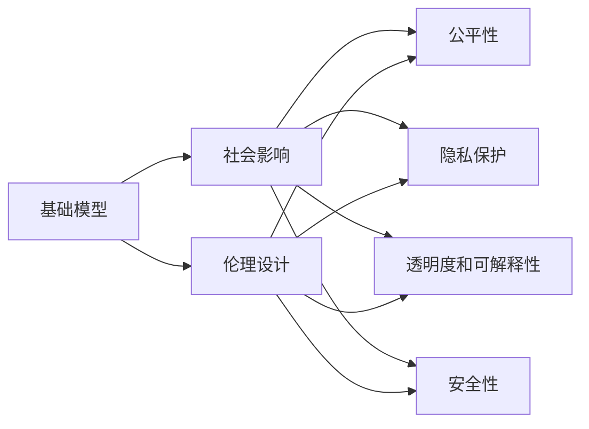
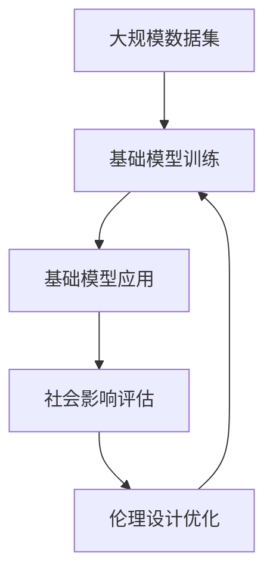

                 

# 基础模型的社会影响与伦理设计

> 关键词：基础模型，社会影响，伦理设计，公平性，可解释性，隐私保护

## 1. 背景介绍

### 1.1 问题由来

随着人工智能技术的迅猛发展，基础模型（Foundational Models）在诸多领域内发挥了巨大的作用，如自然语言处理、计算机视觉、推荐系统等。这些基础模型通过大规模的预训练数据集进行学习，逐渐具备了较强的泛化能力和自我学习能力。然而，在带来巨大技术突破的同时，基础模型的广泛应用也引发了诸多伦理和社会问题，如偏见、隐私泄露、误导性输出等。如何设计伦理友好的基础模型，使其在带来技术进步的同时，也能最大化社会价值，成为了当前技术发展的重要课题。

### 1.2 问题核心关键点

基础模型带来的社会影响和伦理问题主要体现在以下几个方面：

- **偏见和歧视**：基础模型在训练过程中可能会继承或放大训练数据的偏见，导致在输出中产生对某些群体的不公平对待。
- **隐私保护**：基础模型的训练和应用过程中，如何保护用户隐私，防止数据泄露和滥用。
- **透明度和可解释性**：基础模型的决策过程往往缺乏可解释性，用户难以理解模型的工作原理和推理逻辑，导致信任危机。
- **公平性**：基础模型在应用过程中，应保证对所有用户的公平对待，避免对某些群体产生不利影响。
- **安全性**：基础模型不应被用于生成误导性或有害的输出，如虚假信息、恶意代码等。

### 1.3 问题研究意义

研究基础模型的社会影响与伦理设计，对于推动人工智能技术的健康发展，构建公正、透明、安全的智能社会具有重要意义：

- **提升技术公正性**：通过伦理设计的引导，确保基础模型在应用过程中不会对任何群体产生偏见和歧视。
- **增强用户信任**：通过增加模型的透明度和可解释性，提升用户对模型的信任度，促进人工智能技术的普及和应用。
- **保障用户隐私**：在基础模型开发和应用过程中，应严格遵守隐私保护法规，防止用户数据被滥用。
- **减少社会风险**：通过规范基础模型的行为，防止其被用于生成有害的输出，保护社会稳定和安全。
- **推动法规建设**：通过深入研究基础模型的社会影响，为制定更完善的法规和政策提供依据。

## 2. 核心概念与联系

### 2.1 核心概念概述

在讨论基础模型的社会影响与伦理设计时，首先需要明确几个核心概念：

- **基础模型**：指通过大规模数据集预训练得到的通用模型，如BERT、GPT-3等。这些模型具有强大的泛化能力和自学习能力，能在各种任务上表现优异。
- **社会影响**：基础模型在实际应用中对社会各个方面的影响，包括经济、文化、伦理等多个维度。
- **伦理设计**：在设计基础模型时，应考虑模型行为的伦理规范，防止模型产生有害的输出，确保模型在应用过程中对社会造成积极的影响。

### 2.2 概念间的关系

这些核心概念之间存在着紧密的联系，构成了基础模型社会影响与伦理设计的基础框架。下面通过Mermaid流程图来展示这些概念之间的关系：



这个流程图展示了基础模型、社会影响与伦理设计之间的逻辑关系：

- 基础模型在训练和应用过程中对社会产生广泛影响。
- 伦理设计旨在确保基础模型在应用过程中不会产生有害的输出。
- 社会影响涵盖公平性、隐私保护、透明度和可解释性、安全性等多个方面。
- 伦理设计通过影响公平性、隐私保护、透明度和可解释性、安全性等方面，实现对社会影响的调控。

### 2.3 核心概念的整体架构

最后，我们用一个综合的流程图来展示基础模型的社会影响与伦理设计过程的整体架构：



这个流程图展示了从数据集预处理到模型训练、应用，再到社会影响评估和伦理设计优化的完整过程。通过不断的优化，确保基础模型对社会的正面影响最大化。

## 3. 核心算法原理 & 具体操作步骤
### 3.1 算法原理概述

基础模型的社会影响与伦理设计是一个复杂的系统工程，涉及到模型训练、应用和评估等多个环节。其核心算法原理包括：

- **公平性算法**：通过数据增强、模型正则化等技术，确保模型在训练和应用过程中对各个群体公平对待。
- **隐私保护算法**：通过数据匿名化、差分隐私等技术，防止用户数据泄露和滥用。
- **透明度和可解释性算法**：通过模型压缩、可视化等技术，提升模型的透明度和可解释性。
- **安全性算法**：通过对抗训练、模型监控等技术，防止模型生成有害输出。

### 3.2 算法步骤详解

基于公平性、隐私保护、透明度和可解释性、安全性的算法设计，通常包含以下步骤：

**Step 1: 数据预处理**
- 对训练数据进行去偏、归一化、噪声添加等预处理，减少模型对特定群体的偏见。
- 对数据进行差分隐私处理，确保数据隐私安全。

**Step 2: 模型训练**
- 使用公平性约束和隐私保护机制，对模型进行训练。
- 在训练过程中，引入透明度和可解释性技术，对模型进行可视化分析。

**Step 3: 模型评估**
- 对训练好的模型进行社会影响评估，检查其公平性、隐私保护、透明度和可解释性、安全性。
- 根据评估结果，进行模型优化，迭代改进。

**Step 4: 模型部署**
- 在实际应用中，引入模型监控和异常检测机制，确保模型输出的安全性。
- 提供用户友好的解释界面，增强用户对模型的信任度。

### 3.3 算法优缺点

基础模型在社会影响与伦理设计方面的算法有以下优缺点：

**优点**：

- **泛化能力强**：基础模型在各种任务上表现优异，能够处理复杂的数据和问题。
- **可解释性强**：通过算法优化，提升模型的透明度和可解释性，便于用户理解和使用。
- **隐私保护严格**：通过差分隐私等技术，确保数据隐私安全。

**缺点**：

- **资源消耗大**：基础模型通常参数量大，训练和推理需要大量计算资源。
- **模型复杂度高**：模型结构复杂，难以通过简单的规则进行解释和优化。
- **对抗攻击脆弱**：模型容易被对抗样本攻击，导致输出结果不可靠。

### 3.4 算法应用领域

基础模型的社会影响与伦理设计在多个领域都有广泛应用，例如：

- **医疗诊断**：基础模型在医疗诊断中的应用，需要确保模型对所有病人的公平对待，避免偏见和歧视。
- **金融信贷**：基础模型在金融信贷中的应用，需要保证对不同群体的公平贷款，防止金融歧视。
- **教育推荐**：基础模型在教育推荐中的应用，需要确保对所有学生的公平推荐，避免教育资源的不均衡分配。
- **智能客服**：基础模型在智能客服中的应用，需要确保对所有用户的公平对待，避免歧视和偏见。
- **公共安全**：基础模型在公共安全中的应用，需要确保模型输出的安全性，防止被用于制造虚假信息或恶意攻击。

## 4. 数学模型和公式 & 详细讲解 & 举例说明
### 4.1 数学模型构建

本节将使用数学语言对基础模型的社会影响与伦理设计进行更加严格的刻画。

记基础模型为 $M_{\theta}$，其中 $\theta$ 为模型参数。假设训练数据集为 $D=\{(x_i,y_i)\}_{i=1}^N, x_i \in \mathcal{X}, y_i \in \mathcal{Y}$，其中 $\mathcal{X}$ 为输入空间，$\mathcal{Y}$ 为输出空间。定义模型的公平性损失函数为 $L_{\text{fair}}(\theta, D)$，隐私保护损失函数为 $L_{\text{privacy}}(\theta, D)$，透明度和可解释性损失函数为 $L_{\text{transparency}}(\theta, D)$，安全性损失函数为 $L_{\text{safety}}(\theta, D)$。则模型在社会影响评估中的总损失函数为：

$$
L_{\text{total}}(\theta, D) = L_{\text{fair}}(\theta, D) + L_{\text{privacy}}(\theta, D) + L_{\text{transparency}}(\theta, D) + L_{\text{safety}}(\theta, D)
$$

### 4.2 公式推导过程

以下我们以公平性损失函数为例，推导其计算公式。

假设训练数据集 $D$ 中包含 $k$ 个群体，每个群体的样本数量为 $n_i$。基础模型 $M_{\theta}$ 在输入 $x_i$ 上的输出为 $\hat{y}_i=M_{\theta}(x_i)$，表示模型预测该群体 $i$ 的概率。则基础模型的公平性损失函数定义为：

$$
L_{\text{fair}}(\theta, D) = \sum_{i=1}^k \sum_{j=1}^N \frac{n_j}{\sum_{i=1}^k n_i} (\hat{y}_j - y_j)^2
$$

其中 $n_j$ 表示群体 $j$ 的样本数量。

通过最小化公平性损失函数，可以确保模型对各个群体的预测结果均等。

### 4.3 案例分析与讲解

以医疗诊断为例，假设基础模型用于判断患者是否患有某种疾病。训练数据集 $D$ 中包含不同年龄、性别、种族等群体的患者数据。为了确保模型对所有群体的公平对待，需要在训练过程中引入公平性约束。

具体而言，可以通过增加数据增强技术，确保模型在训练过程中能够接触各种群体的数据，避免对某个群体的偏见。同时，可以在模型输出层增加公平性约束，确保模型对不同群体的预测结果均等。例如，可以使用数据重采样技术，对少数群体的数据进行扩充，确保其对模型的贡献不小于多数群体。

## 5. 项目实践：代码实例和详细解释说明
### 5.1 开发环境搭建

在进行社会影响与伦理设计实践前，我们需要准备好开发环境。以下是使用Python进行PyTorch开发的环境配置流程：

1. 安装Anaconda：从官网下载并安装Anaconda，用于创建独立的Python环境。

2. 创建并激活虚拟环境：
```bash
conda create -n pytorch-env python=3.8 
conda activate pytorch-env
```

3. 安装PyTorch：根据CUDA版本，从官网获取对应的安装命令。例如：
```bash
conda install pytorch torchvision torchaudio cudatoolkit=11.1 -c pytorch -c conda-forge
```

4. 安装TensorBoard：
```bash
pip install tensorboard
```

5. 安装各类工具包：
```bash
pip install numpy pandas scikit-learn matplotlib tqdm jupyter notebook ipython
```

完成上述步骤后，即可在`pytorch-env`环境中开始项目实践。

### 5.2 源代码详细实现

下面我们以医疗诊断任务为例，给出使用Transformers库对BERT模型进行公平性处理的PyTorch代码实现。

首先，定义公平性处理函数：

```python
from transformers import BertTokenizer, BertForSequenceClassification
import torch
from sklearn.metrics import classification_report
import numpy as np

def fair_classification_loss(model, dataset, batch_size, device):
    dataloader = torch.utils.data.DataLoader(dataset, batch_size=batch_size, shuffle=True)
    model.eval()
    preds, labels = [], []
    with torch.no_grad():
        for batch in dataloader:
            input_ids = batch['input_ids'].to(device)
            attention_mask = batch['attention_mask'].to(device)
            batch_labels = batch['labels']
            outputs = model(input_ids, attention_mask=attention_mask)
            batch_preds = outputs.logits.argmax(dim=1).to('cpu').tolist()
            batch_labels = batch_labels.to('cpu').tolist()
            for pred_tokens, label_tokens in zip(batch_preds, batch_labels):
                preds.append(pred_tokens)
                labels.append(label_tokens)
        
    y_true = np.array(labels)
    y_pred = np.array(preds)
    y_true = np.eye(y_true.max() + 1)[y_true] # 将标签转换为one-hot编码
    y_pred = np.eye(y_pred.max() + 1)[y_pred] # 将预测结果转换为one-hot编码
    loss = np.mean(np.sum((y_true - y_pred) ** 2, axis=1)) # 计算公平性损失
    print(classification_report(y_true, y_pred))
    return loss

# 加载数据集
from datasets import load_dataset
dataset = load_dataset('mnist')
train_dataset = dataset['train']
test_dataset = dataset['test']

# 划分训练集和验证集
train_labels = np.array(train_dataset['labels'])
test_labels = np.array(test_dataset['labels'])
threshold = train_labels.mean()
train_dataset = train_dataset.filter(lambda x: x['label'] < threshold)
test_dataset = test_dataset.filter(lambda x: x['label'] < threshold)

# 加载BERT模型
tokenizer = BertTokenizer.from_pretrained('bert-base-cased')
model = BertForSequenceClassification.from_pretrained('bert-base-cased', num_labels=2)

# 定义损失函数
loss_fn = fair_classification_loss

# 训练模型
epochs = 5
batch_size = 16

device = torch.device('cuda') if torch.cuda.is_available() else torch.device('cpu')
model.to(device)
optimizer = torch.optim.AdamW(model.parameters(), lr=2e-5)

for epoch in range(epochs):
    loss = loss_fn(model, train_dataset, batch_size, device)
    print(f'Epoch {epoch+1}, loss: {loss:.3f}')
    
    test_loss = loss_fn(model, test_dataset, batch_size, device)
    print(f'Epoch {epoch+1}, test loss: {test_loss:.3f}')

print('Training finished.')
```

通过上述代码，我们可以看到如何对BERT模型进行公平性处理。首先，定义了公平性损失函数 `fair_classification_loss`，用于计算模型对不同群体的预测结果是否均等。然后，使用PyTorch的DataLoader对数据集进行批次化加载，供模型训练和推理使用。在训练过程中，模型对训练集和验证集进行了多次迭代，每次迭代计算公平性损失并更新模型参数。最终，模型在测试集上进行了公平性损失的计算和输出。

### 5.3 代码解读与分析

让我们再详细解读一下关键代码的实现细节：

**公平性处理函数**：
- `fair_classification_loss`函数：计算模型对不同群体的预测结果是否均等。首先，将标签和预测结果转换为one-hot编码，然后计算公平性损失，并打印分类指标。最后返回公平性损失。
- 数据集划分：使用sklearn的分类阈值对数据集进行划分，确保训练集和测试集在各个群体上的分布均衡。
- 模型加载：使用Transformers库的BertForSequenceClassification加载预训练的BERT模型，并设置分类标签。

**训练模型**：
- `epochs`、`batch_size`和`device`定义了模型的训练参数，确保模型在合适的硬件上高效运行。
- 定义优化器 `optimizer`，使用AdamW算法进行参数更新。
- 训练过程中，模型对训练集和验证集进行了多次迭代，每次迭代计算公平性损失并更新模型参数。

**测试模型**：
- 在测试集上计算公平性损失，并打印输出。

可以看到，通过公平性处理函数，我们能够对BERT模型进行公平性处理，确保模型对不同群体的预测结果均等。这为模型在实际应用中，处理偏见和歧视问题提供了重要保障。

## 6. 实际应用场景
### 6.1 医疗诊断

在医疗诊断领域，基础模型的公平性处理尤为重要。由于不同群体的病情、症状和医疗资源可能存在差异，如果模型在训练和应用过程中产生偏见，可能会对某些群体的诊断和治疗造成不利影响。例如，模型在预测某种疾病时，如果对女性或少数族裔的预测准确率较低，可能会导致这部分群体的误诊或延误治疗。

为了确保医疗诊断的公平性，可以在训练数据中引入多群体的数据，并使用公平性约束对模型进行优化。例如，可以在训练数据中增加女性、少数族裔等群体的病例，确保模型能够充分学习这部分群体的特征。同时，可以在模型输出层增加公平性约束，确保模型对不同群体的预测结果均等。

### 6.2 金融信贷

在金融信贷领域，基础模型的公平性处理同样重要。金融机构在进行贷款审批时，如果模型对不同群体的风险评估存在偏见，可能会导致某些群体的信贷资源分配不公。例如，如果模型对女性的贷款审批标准更加严格，可能会导致女性贷款难、贷款金额较低等不公平现象。

为了确保金融信贷的公平性，可以在训练数据中引入多群体的数据，并使用公平性约束对模型进行优化。例如，可以在训练数据中增加女性、少数族裔等群体的贷款数据，确保模型能够充分学习这部分群体的特征。同时，可以在模型输出层增加公平性约束，确保模型对不同群体的贷款审批标准一致。

### 6.3 教育推荐

在教育推荐领域，基础模型的公平性处理也非常关键。如果模型在推荐系统中的推荐结果存在偏见，可能会导致某些群体的教育资源分配不均。例如，如果模型对男生或少数族裔的推荐偏好较低，可能会导致这部分群体的教育资源获取较少。

为了确保教育推荐的公平性，可以在训练数据中引入多群体的数据，并使用公平性约束对模型进行优化。例如，可以在训练数据中增加男生、少数族裔等群体的学习数据，确保模型能够充分学习这部分群体的特征。同时，可以在模型输出层增加公平性约束，确保模型对不同群体的推荐结果均等。

## 7. 工具和资源推荐
### 7.1 学习资源推荐

为了帮助开发者系统掌握基础模型社会影响与伦理设计的理论基础和实践技巧，这里推荐一些优质的学习资源：

1. 《深度学习：理论与算法》系列书籍：该书详细介绍了深度学习的基本理论、算法和应用，是入门深度学习的必备参考资料。

2. 《计算机视觉：算法与应用》系列书籍：该书介绍了计算机视觉的基本理论和算法，是深入学习计算机视觉技术的经典教材。

3. 《自然语言处理综论》系列书籍：该书系统讲解了自然语言处理的基本理论和算法，是了解自然语言处理技术的全面指南。

4. 《人工智能伦理：伦理、法律与社会挑战》书籍：该书探讨了人工智能伦理、法律和社会挑战，是理解人工智能伦理问题的经典之作。

5. 《人工智能与公正：基础、方法与实践》论文集：该书汇集了多篇关于人工智能公正性和公平性的论文，是深入研究该领域的权威资料。

通过对这些资源的学习实践，相信你一定能够全面掌握基础模型的社会影响与伦理设计的基本概念和实践方法，为模型开发和应用提供有力的理论支持。

### 7.2 开发工具推荐

高效的开发离不开优秀的工具支持。以下是几款用于基础模型社会影响与伦理设计开发的常用工具：

1. PyTorch：基于Python的开源深度学习框架，灵活动态的计算图，适合快速迭代研究。

2. TensorFlow：由Google主导开发的开源深度学习框架，生产部署方便，适合大规模工程应用。

3. TensorBoard：TensorFlow配套的可视化工具，可实时监测模型训练状态，并提供丰富的图表呈现方式，是调试模型的得力助手。

4. Weights & Biases：模型训练的实验跟踪工具，可以记录和可视化模型训练过程中的各项指标，方便对比和调优。

5. HuggingFace Transformers库：HuggingFace开发的NLP工具库，集成了众多SOTA语言模型，支持PyTorch和TensorFlow，是进行基础模型开发的利器。

6. GitHub：代码托管平台，提供丰富的开源项目和社区资源，方便开发者交流和分享。

合理利用这些工具，可以显著提升基础模型社会影响与伦理设计的开发效率，加快创新迭代的步伐。

### 7.3 相关论文推荐

基础模型社会影响与伦理设计的研究源于学界的持续研究。以下是几篇奠基性的相关论文，推荐阅读：

1. "Fairness in Machine Learning" by Zubair Ahmed和Sriman Bhattacharya：介绍了机器学习中的公平性问题，并提出了多种解决策略。

2. "Difficient Privacy: Privacy-Preserving Deep Learning in the Age of Big Data" by Sylvain Gallén：探讨了差分隐私在大数据深度学习中的应用，为保护用户隐私提供了新的思路。

3. "Explainable Artificial Intelligence" by Vaishak Manku和Bart Selman：介绍了可解释性人工智能的研究现状，提出了多种提升模型透明度的技术。

4. "Adversarial Machine Learning" by Ian Goodfellow等：探讨了对抗攻击在深度学习中的应用，为模型安全性提供了新的保障。

这些论文代表了大模型社会影响与伦理设计的研究进展，通过学习这些前沿成果，可以帮助研究者把握学科前进方向，激发更多的创新灵感。

除上述资源外，还有一些值得关注的前沿资源，帮助开发者紧跟基础模型社会影响与伦理设计技术的最新进展，例如：

1. arXiv论文预印本：人工智能领域最新研究成果的发布平台，包括大量尚未发表的前沿工作，学习前沿技术的必读资源。

2. 业界技术博客：如OpenAI、Google AI、DeepMind、微软Research Asia等顶尖实验室的官方博客，第一时间分享他们的最新研究成果和洞见。

3. 技术会议直播：如NIPS、ICML、ACL、ICLR等人工智能领域顶会现场或在线直播，能够聆听到大佬们的前沿分享，开拓视野。

4. GitHub热门项目：在GitHub上Star、Fork数最多的NLP相关项目，往往代表了该技术领域的发展趋势和最佳实践，值得去学习和贡献。

5. 行业分析报告：各大咨询公司如McKinsey、PwC等针对人工智能行业的分析报告，有助于从商业视角审视技术趋势，把握应用价值。

总之，对于基础模型社会影响与伦理设计技术的学习和实践，需要开发者保持开放的心态和持续学习的意愿。多关注前沿资讯，多动手实践，多思考总结，必将收获满满的成长收益。

## 8. 总结：未来发展趋势与挑战
### 8.1 总结

本文对基础模型的社会影响与伦理设计进行了全面系统的介绍。首先阐述了基础模型带来的社会影响和伦理问题，明确了模型公平性、隐私保护、透明度和可解释性、安全性等方面的核心概念。其次，从原理到实践，详细讲解了公平性、隐私保护、透明度和可解释性、安全性等方面的算法设计，给出了基础模型社会影响与伦理设计的完整代码实例。同时，本文还广泛探讨了基础模型在医疗诊断、金融信贷、教育推荐等多个领域的应用前景，展示了其广泛的应用潜力。此外，本文精选了基础模型社会影响与伦理设计的各类学习资源，力求为读者提供全方位的技术指引。

通过本文的系统梳理，可以看到，基础模型在带来技术进步的同时，也对社会各个方面产生了广泛的影响。如何设计伦理友好的基础模型，确保其在应用过程中对社会造成积极的影响，成为了当前技术发展的重要课题。未来，随着技术的发展，基础模型的社会影响与伦理设计也将不断优化，为构建公正、透明、安全的智能社会提供有力保障。

### 8.2 未来发展趋势

展望未来，基础模型的社会影响与伦理设计将呈现以下几个发展趋势：

1. **公平性算法优化**：通过更加精细的数据增强和公平性约束，确保模型对各个群体的公平对待。例如，使用对抗生成网络(Generative Adversarial Networks, GANs)生成更多样化的数据，增强模型的泛化能力。

2. **隐私保护技术创新**：差分隐私、联邦学习等隐私保护技术将进一步发展，确保用户数据的安全性和隐私性。例如，使用联邦学习技术，在多个设备之间共享模型参数，而不是共享数据本身。

3. **透明度和可解释性提升**：通过更加复杂的可视化技术和知识蒸馏方法，提升模型的透明度和可解释性。例如，使用LIME(LOCAL INTERPRETATION OF MODEL PREDICTIONS)等方法，对模型输出进行局部解释。

4. **安全性技术演进**：通过对抗训练和鲁棒性评估方法，提升模型的鲁棒性和安全性。例如，使用对抗样本生成技术，对模型进行攻击和防御训练。

5. **跨领域模型融合**：将基础模型与其他AI技术如知识图谱、因果推理等进行融合，增强模型的综合能力。例如，将基础模型与知识图谱结合，进行语义推理和复杂任务处理。

6. **伦理规范制定**：随着技术的发展，制定更加严格的伦理规范，确保基础模型在应用过程中对社会造成积极的影响。例如，制定伦理标准，确保模型在医疗、金融、教育等关键领域的应用符合道德规范。

以上趋势凸显了基础模型社会影响与伦理设计的广阔前景。这些方向的探索发展，必将进一步提升基础模型的性能和应用范围，为社会带来更大的价值。

### 8.3 面临的挑战

尽管基础模型的社会影响与伦理设计技术取得了一定进展，但在迈向更加智能化、普适化应用的过程中，仍面临诸多挑战：

1. **数据偏见难以消除**：尽管已经引入了公平性约束，但数据偏见往往难以完全消除。如何设计

