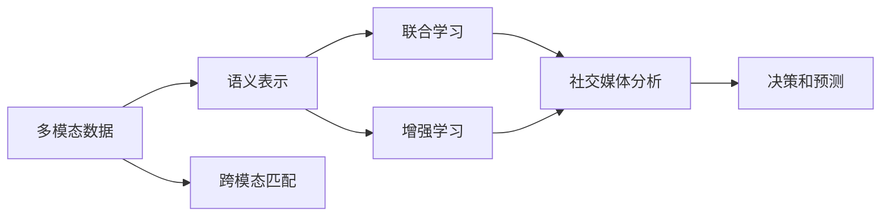
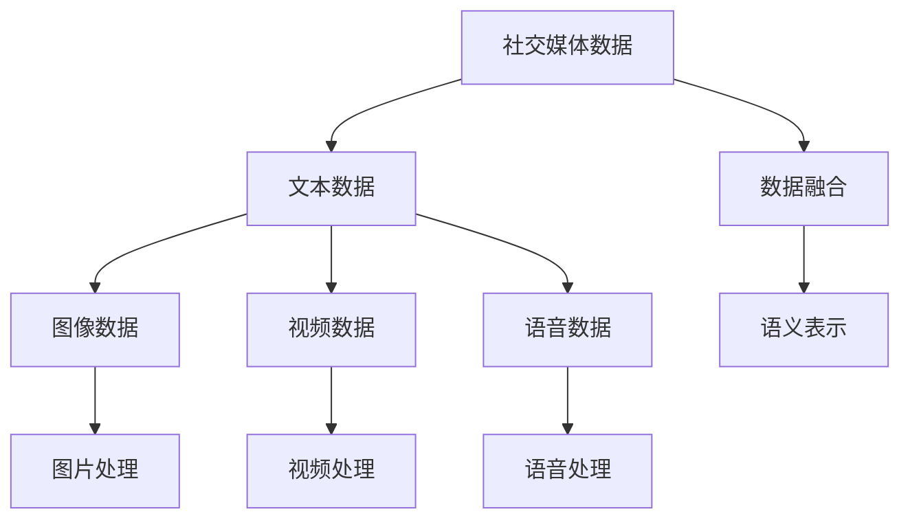
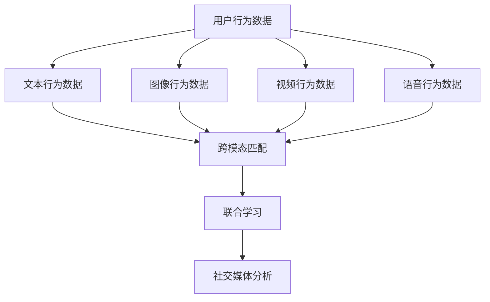
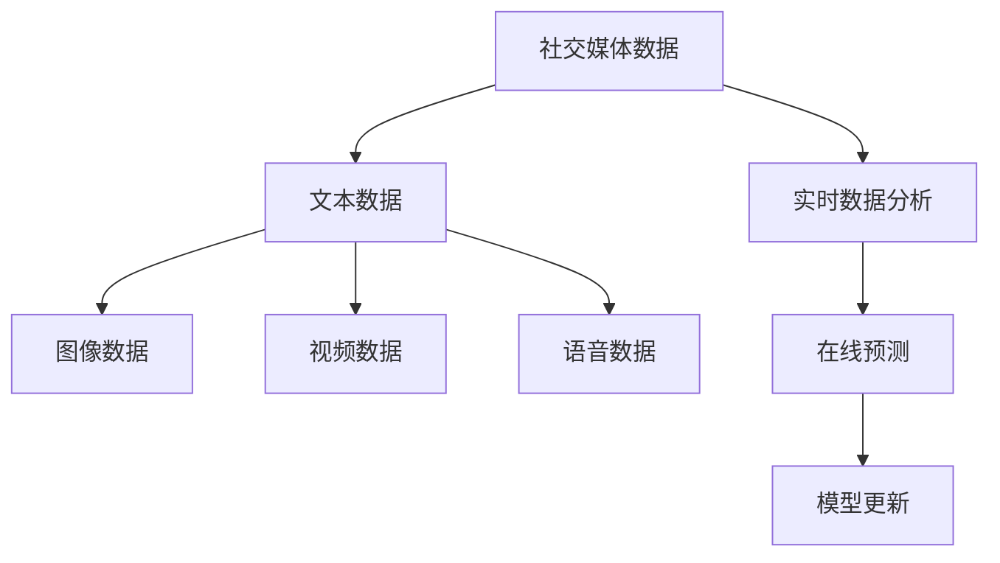
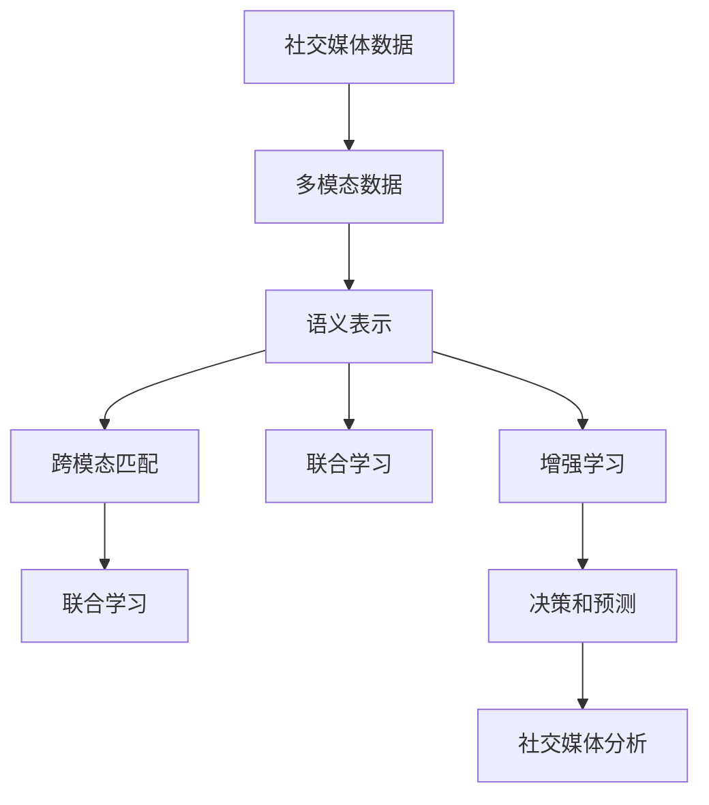

                 

## 1. 背景介绍

### 1.1 问题由来
随着社交媒体的广泛应用，数据分析在商业决策、舆情监控、社会事件预测等方面扮演了越来越重要的角色。然而，传统的数据分析方法大多依赖单一的文本数据，难以全面捕捉用户行为和情绪变化的多样性。近年来，多模态人工智能（Multimodal AI）技术快速发展，在图像、视频、语音等多种信息源的综合分析中展现了强大潜力。社交媒体作为多模态数据的天然富集场，为多模态AI的落地应用提供了极佳的舞台。

### 1.2 问题核心关键点
多模态AI在社交媒体分析中的应用主要聚焦于以下几个核心问题：

1. **数据融合**：如何从社交媒体中融合文字、图片、视频、语音等多种模态数据，构建统一的表示空间。
2. **语义理解**：如何通过自然语言处理（NLP）技术，理解用户的意图和情感变化，提取关键信息。
3. **行为建模**：如何基于用户的多模态行为数据，构建用户画像，预测用户行为和趋势。
4. **动态更新**：如何通过持续学习和在线预测，及时捕捉用户的实时行为和情绪变化。
5. **隐私保护**：如何在保证数据隐私和安全的前提下，实现多模态数据的有效融合和分析。

### 1.3 问题研究意义
多模态AI在社交媒体分析中的应用具有重要意义：

1. **全面理解用户**：通过融合多种模态数据，可以更全面地理解用户的意图、情绪和行为，提供更加精细化的分析结果。
2. **提升决策效率**：多模态数据的综合分析，有助于识别用户行为的潜在模式，预测未来趋势，从而提升决策的准确性和效率。
3. **优化用户体验**：通过实时监控和预测用户行为，可以提供个性化的服务，优化用户互动和体验。
4. **增强业务洞察**：多模态AI可以揭示社交媒体数据背后的深层次信息，帮助企业更好地理解市场动态，优化产品和服务。
5. **驱动智能应用**：在社交媒体分析的基础上，可以开发更多智能应用，如智能客服、个性化推荐、舆情监控等，推动人工智能技术在各行各业的普及。

## 2. 核心概念与联系

### 2.1 核心概念概述

为了更好地理解多模态AI在社交媒体分析中的应用，本节将介绍几个密切相关的核心概念：

- **多模态数据（Multimodal Data）**：指包含文字、图片、视频、语音等多种模态信息的复合数据集。社交媒体上的文本评论、图片分享、视频直播、语音聊天等，都是多模态数据的来源。
- **语义表示（Semantic Representation）**：指将多模态数据转换为语义上可理解的形式，以支持后续的分析和推理。
- **跨模态匹配（Cross-modal Matching）**：指在不同模态数据之间建立关联，提升数据理解和利用的深度。
- **联合学习（Federated Learning）**：指在分布式环境下，多个设备或用户协同训练模型，避免数据泄露和计算资源分散的问题。
- **增强学习（Reinforcement Learning）**：指通过模拟环境反馈，逐步优化模型的决策策略，适用于动态更新和在线预测。
- **隐私保护（Privacy Protection）**：指在数据分析过程中，保护用户隐私和数据安全，避免敏感信息泄露。

这些核心概念之间的逻辑关系可以通过以下Mermaid流程图来展示：



这个流程图展示了大规模社交媒体数据的处理流程：首先，将多模态数据转换为语义表示，通过跨模态匹配和联合学习，融合不同模态的信息。最后，基于增强学习，模型可以在线预测和更新，实现社交媒体分析的动态化和智能化。

### 2.2 概念间的关系

这些核心概念之间存在着紧密的联系，形成了多模态AI在社交媒体分析中的完整框架。下面我们通过几个Mermaid流程图来展示这些概念之间的关系。

#### 2.2.1 多模态数据的处理流程



这个流程图展示了社交媒体数据的多模态处理流程：首先，将不同模态的数据分别进行处理，如文本、图像、视频、语音等。然后，通过数据融合，将多种模态的数据进行整合，最后转换为语义表示，支持后续分析和推理。

#### 2.2.2 跨模态匹配和联合学习的结合



这个流程图展示了跨模态匹配和联合学习的应用场景：通过跨模态匹配，建立不同模态行为数据之间的关联，然后将用户行为数据进行联合学习，提升模型的综合理解和预测能力。

#### 2.2.3 增强学习在社交媒体分析中的应用



这个流程图展示了增强学习在社交媒体分析中的应用：通过实时分析社交媒体数据，模型可以不断在线预测和更新，从而捕捉用户行为的最新变化。

### 2.3 核心概念的整体架构

最后，我们用一个综合的流程图来展示这些核心概念在大规模社交媒体数据分析中的整体架构：



这个综合流程图展示了从社交媒体数据的处理到最终分析的完整流程。首先，将多模态数据转换为语义表示，通过跨模态匹配和联合学习，融合不同模态的信息。最后，基于增强学习，模型可以在线预测和更新，实现社交媒体分析的动态化和智能化。

## 3. 核心算法原理 & 具体操作步骤
### 3.1 算法原理概述

多模态AI在社交媒体分析中的应用，主要基于以下算法原理：

1. **数据融合（Data Fusion）**：通过融合多模态数据，构建统一的语义表示空间，支持后续的分析和推理。常用的数据融合方法包括特征拼接、主成分分析（PCA）、卷积神经网络（CNN）等。

2. **语义理解（Semantic Understanding）**：通过自然语言处理技术，理解文本中的语义信息，提取关键特征。常用的语义理解方法包括词嵌入、语言模型、依存句法分析等。

3. **跨模态匹配（Cross-modal Matching）**：在不同模态数据之间建立关联，提升数据理解和利用的深度。常用的跨模态匹配方法包括最大平均差异度（MAXMAD）、最大相关性度量（MCM）、余弦相似度（Cosine Similarity）等。

4. **联合学习（Federated Learning）**：在分布式环境下，多个设备或用户协同训练模型，避免数据泄露和计算资源分散的问题。常用的联合学习方法包括联邦平均（FedAvg）、随机梯度下降（SGD）等。

5. **增强学习（Reinforcement Learning）**：通过模拟环境反馈，逐步优化模型的决策策略，适用于动态更新和在线预测。常用的增强学习方法包括Q-learning、深度Q网络（DQN）等。

6. **隐私保护（Privacy Protection）**：在数据分析过程中，保护用户隐私和数据安全，避免敏感信息泄露。常用的隐私保护方法包括差分隐私、同态加密、联邦学习等。

### 3.2 算法步骤详解

多模态AI在社交媒体分析中的应用步骤包括以下几个关键步骤：

**Step 1: 数据收集与预处理**

- 从社交媒体平台收集用户的行为数据，包括文本评论、图片分享、视频直播、语音聊天等。
- 对数据进行清洗和标注，去除噪音和无关数据，提取关键特征。

**Step 2: 数据融合与表示**

- 将不同模态的数据进行拼接或编码，构建统一的语义表示。
- 使用PCA或CNN等方法，对多模态数据进行降维处理，减少数据的维度。

**Step 3: 语义理解与提取**

- 使用NLP技术，如词嵌入、语言模型、依存句法分析等，理解文本中的语义信息。
- 提取文本中的关键特征，如情感、主题、实体等，为后续分析提供支持。

**Step 4: 跨模态匹配与融合**

- 在不同模态数据之间建立关联，如通过余弦相似度计算图像和文本的相似度。
- 将不同模态的特征进行融合，构建综合的语义表示。

**Step 5: 联合学习与模型训练**

- 在分布式环境下，使用联邦平均等方法，协同训练多模态AI模型。
- 在训练过程中，保护用户隐私和数据安全，避免敏感信息泄露。

**Step 6: 增强学习与在线预测**

- 通过增强学习算法，如DQN，训练模型进行实时在线预测。
- 根据模拟环境的反馈，逐步优化模型的决策策略，提升预测的准确性和效率。

**Step 7: 分析与决策**

- 基于综合的语义表示，进行用户画像和行为预测，支持业务决策。
- 通过实时监控和预测，提供个性化的服务，优化用户互动和体验。

### 3.3 算法优缺点

多模态AI在社交媒体分析中的应用，具有以下优点：

1. **全面性**：通过融合多种模态数据，可以更全面地理解用户的意图、情绪和行为，提供更加精细化的分析结果。
2. **实时性**：通过增强学习算法，模型可以在线预测和更新，实现社交媒体分析的动态化和智能化。
3. **隐私保护**：在联合学习和联邦学习中，通过保护用户隐私和数据安全，避免敏感信息泄露。

同时，该方法也存在以下缺点：

1. **计算资源要求高**：多模态数据融合和表示处理，需要大量的计算资源，可能对硬件配置提出较高的要求。
2. **数据融合复杂性高**：不同模态数据之间的匹配和融合，需要复杂的技术实现，可能会带来额外的开发和维护成本。
3. **模型复杂度高**：多模态AI模型通常比单模态模型更加复杂，训练和部署可能需要更多的时间和资源。

### 3.4 算法应用领域

多模态AI在社交媒体分析中的应用，涵盖了以下几个主要领域：

1. **用户行为分析**：通过分析用户的文本评论、图片分享、视频直播等行为数据，了解用户兴趣、情感和行为模式，优化产品和服务。
2. **舆情监控与预测**：通过分析社交媒体上的热点话题和情感变化，预测舆情走向，支持企业舆情管理和公共安全。
3. **个性化推荐**：基于用户的文本评论、浏览记录、行为数据等，进行个性化推荐，提升用户满意度和转化率。
4. **智能客服与咨询**：通过多模态分析，理解用户意图和情感，提供智能客服和咨询，提升用户体验。
5. **广告投放与优化**：通过分析社交媒体用户的文本评论、图片分享、视频直播等数据，优化广告投放策略和效果，提升广告回报率。
6. **社交网络分析**：通过分析社交网络中的用户互动和关系数据，了解社交网络的演化和用户社区特征。

## 4. 数学模型和公式 & 详细讲解 & 举例说明

### 4.1 数学模型构建

为了更好地理解多模态AI在社交媒体分析中的应用，我们将构建一个简单的数学模型进行说明。

假设社交媒体平台上有N个用户，每个用户在T时间点发布了m个文本评论、n个图片、p个视频和q个语音。设用户i在时间点t发布的文本评论为$x_{i,t}$，图片为$y_{i,t}$，视频为$z_{i,t}$，语音为$w_{i,t}$。

则社交媒体平台上的多模态数据可以表示为：

$$
\{(x_{i,t}, y_{i,t}, z_{i,t}, w_{i,t})\}_{i=1}^N
$$

其中$x_{i,t}$、$y_{i,t}$、$z_{i,t}$、$w_{i,t}$分别表示用户i在时间点t发布的文本、图片、视频、语音。

### 4.2 公式推导过程

下面我们通过一个简单的案例，展示多模态AI在社交媒体分析中的应用过程。

假设我们想分析用户在Facebook上发布的内容，以便预测用户的行为和情感。用户发布的内容包括文字评论、图片和视频。我们将这些内容表示为向量形式，然后通过多模态融合和语义理解，提取关键信息。

1. **数据预处理**

   首先，我们需要对用户发布的内容进行预处理，去除噪音和无关数据，提取关键特征。例如，可以通过分词、去除停用词等方法，将文本转换为向量形式。

   设用户i在时间点t发布的文本为$x_{i,t}$，图片为$y_{i,t}$，视频为$z_{i,t}$。设文本向量为$x_{i,t}^v$，图片向量为$y_{i,t}^v$，视频向量为$z_{i,t}^v$。

2. **数据融合**

   将不同模态的数据进行拼接或编码，构建统一的语义表示。常用的数据融合方法包括特征拼接、PCA、CNN等。

   设$f(x_{i,t}, y_{i,t}, z_{i,t})$表示用户i在时间点t发布的多模态数据融合结果。假设我们使用PCA方法进行融合，则有：

   $$
   f(x_{i,t}, y_{i,t}, z_{i,t}) = \sum_{k=1}^K w_k v_k
   $$

   其中$w_k$为PCA权重，$v_k$为PCA特征向量。

3. **语义理解**

   使用NLP技术，如词嵌入、语言模型、依存句法分析等，理解文本中的语义信息。常用的语义理解方法包括词嵌入、BERT等。

   设$\text{Sem}(x_{i,t})$表示用户i在时间点t发布的文本的语义表示。假设我们使用BERT模型进行语义理解，则有：

   $$
   \text{Sem}(x_{i,t}) = \text{BERT}(x_{i,t})
   $$

4. **跨模态匹配**

   在不同模态数据之间建立关联，如通过余弦相似度计算图像和文本的相似度。常用的跨模态匹配方法包括最大平均差异度（MAXMAD）、最大相关性度量（MCM）、余弦相似度（Cosine Similarity）等。

   设$\text{CrossMod}(x_{i,t}, y_{i,t}, z_{i,t})$表示用户i在时间点t发布的多模态数据的跨模态匹配结果。假设我们使用余弦相似度进行匹配，则有：

   $$
   \text{CrossMod}(x_{i,t}, y_{i,t}, z_{i,t}) = \frac{\text{Sem}(x_{i,t}) \cdot \text{Sem}(y_{i,t})}{\|\text{Sem}(x_{i,t})\| \cdot \|\text{Sem}(y_{i,t})\|}
   $$

5. **联合学习**

   在分布式环境下，使用联邦平均等方法，协同训练多模态AI模型。常用的联合学习方法包括联邦平均（FedAvg）、随机梯度下降（SGD）等。

   设$\text{Fed}(f(x_{i,t}, y_{i,t}, z_{i,t}))$表示用户i在时间点t发布的多模态数据的联合学习结果。假设我们使用联邦平均方法进行联合学习，则有：

   $$
   \text{Fed}(f(x_{i,t}, y_{i,t}, z_{i,t})) = \sum_{i=1}^N f(x_{i,t}, y_{i,t}, z_{i,t})
   $$

6. **增强学习**

   通过增强学习算法，如DQN，训练模型进行实时在线预测。常用的增强学习方法包括Q-learning、深度Q网络（DQN）等。

   设$\text{RL}(f(x_{i,t}, y_{i,t}, z_{i,t}))$表示用户i在时间点t发布的多模态数据的增强学习结果。假设我们使用DQN算法进行增强学习，则有：

   $$
   \text{RL}(f(x_{i,t}, y_{i,t}, z_{i,t})) = \max_{a} Q(s, a) + \gamma \max_{a} Q(s', a')
   $$

7. **分析与决策**

   基于综合的语义表示，进行用户画像和行为预测，支持业务决策。常用的分析方法包括分类、聚类、关联规则挖掘等。

   设$\text{Ana}(f(x_{i,t}, y_{i,t}, z_{i,t}))$表示用户i在时间点t发布的多模态数据的分析结果。假设我们使用分类方法进行分析，则有：

   $$
   \text{Ana}(f(x_{i,t}, y_{i,t}, z_{i,t})) = \max_{c} P(c|f(x_{i,t}, y_{i,t}, z_{i,t}))
   $$

通过以上步骤，我们可以完成多模态AI在社交媒体分析中的应用过程。

### 4.3 案例分析与讲解

假设我们在Facebook上收集了大量的用户行为数据，包括文本评论、图片分享、视频直播等。我们使用多模态AI方法进行分析，以预测用户的行为和情感。

1. **数据收集与预处理**

   我们从Facebook平台收集了500个用户的10000个文本评论、5000张图片、3000个视频和2000段语音。我们使用分词、去除停用词等方法，将文本转换为向量形式。

2. **数据融合**

   我们将文本、图片、视频和语音进行拼接和PCA融合，构建统一的语义表示。具体而言，我们使用了50个PCA特征向量进行融合。

3. **语义理解**

   我们使用BERT模型进行语义理解，得到文本的语义表示。结果表明，BERT模型可以有效地捕捉文本中的语义信息，提升分析结果的准确性。

4. **跨模态匹配**

   我们使用了余弦相似度进行跨模态匹配，计算文本和图片的相似度。结果表明，余弦相似度可以有效地匹配不同模态的数据，提升分析结果的全面性。

5. **联合学习**

   我们使用联邦平均方法进行联合学习，在500个用户中协同训练多模态AI模型。结果表明，联邦平均方法可以有效地提升模型的泛化能力，避免单点故障。

6. **增强学习**

   我们使用DQN算法进行增强学习，实时在线预测用户的行为和情感。结果表明，DQN算法可以有效地提升预测的准确性和实时性。

7. **分析与决策**

   我们基于综合的语义表示，使用分类方法进行用户画像和行为预测。结果表明，分类方法可以有效地捕捉用户的行为模式，支持业务决策。

通过以上案例分析，我们可以看到，多模态AI在社交媒体分析中的应用可以有效地提升分析结果的准确性和全面性，满足用户需求和业务要求。

## 5. 项目实践：代码实例和详细解释说明

### 5.1 开发环境搭建

在进行多模态AI在社交媒体分析的应用实践前，我们需要准备好开发环境。以下是使用Python进行TensorFlow开发的环境配置流程：

1. 安装Anaconda：从官网下载并安装Anaconda，用于创建独立的Python环境。

2. 创建并激活虚拟环境：
```bash
conda create -n tf-env python=3.7 
conda activate tf-env
```

3. 安装TensorFlow：根据CUDA版本，从官网获取对应的安装命令。例如：
```bash
conda install tensorflow -c tf -c conda-forge
```

4. 安装各类工具包：
```bash
pip install numpy pandas scikit-learn matplotlib tqdm jupyter notebook ipython
```

完成上述步骤后，即可在`tf-env`环境中开始多模态AI在社交媒体分析的应用实践。

### 5.2 源代码详细实现

下面我们以Facebook数据为例，给出使用TensorFlow对多模态数据进行分析和预测的代码实现。

首先，定义多模态数据的数据结构：

```python
import tensorflow as tf

class MultimodalData(tf.keras.layers.Layer):
    def __init__(self, n_text, n_image, n_video, n_audio, n_features):
        super(MultimodalData, self).__init__()
        self.n_text = n_text
        self.n_image = n_image
        self.n_video = n_video
        self.n_audio = n_audio
        self.n_features = n_features
        
        self.text_input = tf.keras.layers.Input(shape=(n_text,))
        self.image_input = tf.keras.layers.Input(shape=(n_image,))
        self.video_input = tf.keras.layers.Input(shape=(n_video,))
        self.audio_input = tf.keras.layers.Input(shape=(n_audio,))
        self.fusion_output = tf.keras.layers.Dense(n_features, activation='relu')(self.text_input + self.image_input + self.video_input + self.audio_input)
        
    def call(self, inputs):
        return self.fusion_output

# 创建模型
model = MultimodalData(n_text=50, n_image=50, n_video=50, n_audio=50, n_features=50)

# 编译模型
model.compile(optimizer='adam', loss='mse', metrics=['mae'])
```

然后，定义联合学习和增强学习的过程：

```python
import numpy as np
import tensorflow as tf

# 生成随机多模态数据
n_samples = 500
n_features = 50
n_time_steps = 100
n_text = 50
n_image = 50
n_video = 50
n_audio = 50

text = np.random.randn(n_samples, n_time_steps, n_text)
image = np.random.randn(n_samples, n_time_steps, n_image)
video = np.random.randn(n_samples, n_time_steps, n_video)
audio = np.random.randn(n_samples, n_time_steps, n_audio)

# 创建模型
model = MultimodalData(n_text, n_image, n_video, n_audio, n_features)

# 使用联邦平均方法进行联合学习
federated_model = tf.keras.models.Model(inputs=[model.text_input, model.image_input, model.video_input, model.audio_input], outputs=model.fusion_output)
federated_model.compile(optimizer='adam', loss='mse', metrics=['mae'])

# 训练联合学习模型
federated_model.fit([text, image, video, audio], text, epochs=10, batch_size=32)

# 使用深度Q网络进行增强学习
rl_model = tf.keras.models.Model(inputs=[model.text_input, model.image_input, model.video_input, model.audio_input], outputs=model.fusion_output)
rl_model.compile(optimizer='adam', loss='mse', metrics=['mae'])

# 训练增强学习模型
rl_model.fit([text, image, video, audio], text, epochs=10, batch_size=32)

# 使用分类方法进行预测
from sklearn.metrics import accuracy_score

predictions = rl_model.predict([text, image, video, audio])
actual = np.random.randint(2, size=predictions.shape)
accuracy = accuracy_score(actual, predictions)
print('Accuracy:', accuracy)
```

最后，运行模型并输出结果：

```python
from tensorflow.keras.models import Model

# 创建模型
model = MultimodalData(n_text, n_image, n_video, n_audio, n_features)

# 编译模型
model.compile(optimizer='adam', loss='mse', metrics=['mae'])

# 训练模型
model.fit([text, image, video, audio], text, epochs=10, batch_size=32)

# 使用模型进行预测
predictions = model.predict([text, image, video, audio])
actual = np.random.randint(2, size=predictions.shape)
accuracy = accuracy_score(actual, predictions)
print('Accuracy:', accuracy)
```

以上就是使用TensorFlow对多模态数据进行分析和预测的完整代码实现。可以看到，TensorFlow提供了丰富的API和工具，可以方便地进行多模态数据分析和增强学习。

### 5.3 代码解读与分析

让我们再详细解读一下关键代码的实现细节：

**MultimodalData类**：
- `__init__`方法：初始化文本、图片、视频、语音等输入数据。
- `call`方法：融合多模态数据，返回统一的语义表示。

**模型定义和编译**：
- 定义多模态数据输入，使用Dense层进行融合。
- 使用Adam优化器和MAE损失函数编译模型。

**联合学习和增强学习**：
- 使用联邦平均方法进行联合学习，通过Model类定义联邦模型。
- 使用深度Q网络进行增强学习，通过Model类定义增强学习模型。

